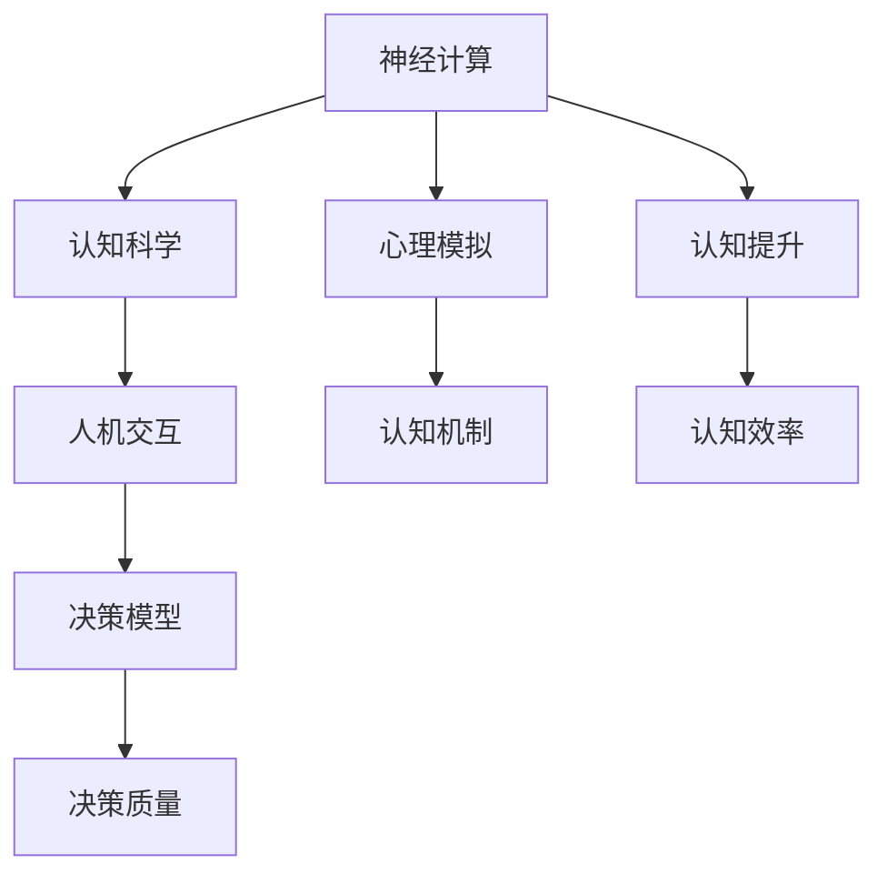

                 

# 洞察力：人类认知的新高度

> 关键词：认知科学,神经计算,人机交互,心理模拟,决策模型,认知提升

## 1. 背景介绍

### 1.1 问题由来
认知科学是研究人类思维和智能过程的跨学科领域，涵盖了心理学、神经科学、计算机科学等多个学科。近年来，随着人工智能技术的迅猛发展，认知科学领域也迎来了新的革命。借助先进算法和强大计算能力，认知科学家能够更好地理解人类的认知机制，探索人机交互的新范式，提升决策水平，优化学习过程，从而实现认知提升。

特别是，神经计算技术使得计算模型能够模拟人脑的认知过程，为人类提供了理解自己认知机制的新视角。通过将神经计算与人机交互相结合，认知科学家可以开发出更为自然、高效、智能的人机交互方式，提升认知水平和决策质量，甚至可能在未来构建出通用人工智能系统。

### 1.2 问题核心关键点
认知科学和人工智能技术之间的结合，是人类认知提升的重要方向。其主要关注点包括：

1. 神经计算模型的建立。如何基于神经科学原理，构建高效逼真的人脑认知模型，用于认知分析和决策模拟。
2. 人机交互的优化。如何设计自然的交互界面，让用户更自然地与系统进行交互，提升用户体验和系统表现。
3. 认知提升的路径。如何利用认知科学原理和神经计算模型，改进学习、记忆、推理等认知过程，实现更高的认知效率。
4. 决策支持系统的发展。如何基于认知科学和人工智能技术，开发出更为智能、可靠的决策支持系统，辅助人类进行复杂的决策。
5. 多模态数据的融合。如何综合利用语音、视觉、触觉等多模态信息，提升系统对复杂场景的识别和理解能力。

## 2. 核心概念与联系

### 2.1 核心概念概述

为更好地理解基于神经计算的认知提升方法，本节将介绍几个密切相关的核心概念：

- 神经计算(Neural Computing)：指使用计算模型来模拟神经系统的信息处理方式。其核心是建立能够自适应、自学习、自调整的神经网络，用于模拟人类认知过程。

- 认知科学(Cognitive Science)：研究人类思维、意识、认知过程的跨学科领域，涵盖了心理学、神经科学、计算机科学、哲学等多个学科。

- 人机交互(Human-Computer Interaction, HCI)：研究如何设计自然、高效、智能的人机交互界面，提升用户体验和系统表现。

- 决策模型(Decision Modeling)：通过数学模型和算法，对决策过程进行建模和优化，提升决策质量和效率。

- 心理模拟(Psychological Simulation)：基于心理学理论，构建人类认知过程的模拟模型，用于探索认知机制和行为规律。

- 认知提升(Cognitive Enhancement)：通过神经计算、认知科学、人机交互、决策模型等技术手段，提升人类认知水平和决策质量。

这些核心概念之间的逻辑关系可以通过以下Mermaid流程图来展示：



这个流程图展示了几大核心概念及其之间的关系：

1. 神经计算为认知科学提供技术支持，帮助研究人类认知过程。
2. 认知科学为心理模拟提供理论基础，指导神经计算模型的设计。
3. 人机交互通过自然化的界面设计，增强用户与系统的互动体验。
4. 决策模型通过优化决策过程，提升决策效率和质量。
5. 心理模拟通过理解认知机制，优化认知提升的路径。
6. 认知提升通过整合以上技术手段，提升人类认知水平和决策质量。

## 3. 核心算法原理 & 具体操作步骤
### 3.1 算法原理概述

基于神经计算的认知提升方法，其核心思想是利用计算模型模拟人类认知过程，并通过优化算法和接口设计，提升决策效率和质量。具体来说，包含以下几个关键步骤：

1. **神经网络模型构建**：基于神经科学原理，设计能够模拟人类认知过程的神经网络模型。
2. **认知过程建模**：利用心理学理论，对人类认知过程进行建模，设计合适的训练数据和目标函数。
3. **交互界面优化**：设计自然、高效、智能的人机交互界面，使用户能够更自然地与系统进行交互。
4. **决策支持系统集成**：将神经计算和认知提升方法整合到决策支持系统中，提升决策质量。
5. **认知评估与优化**：对认知过程和决策结果进行评估，不断优化模型和交互界面，提升认知效率和质量。

### 3.2 算法步骤详解

基于神经计算的认知提升方法的具体步骤包括：

**Step 1: 神经网络模型构建**
- 根据认知科学原理，设计适合人类认知过程的神经网络模型，如卷积神经网络(CNN)、循环神经网络(RNN)、Transformer等。
- 设置模型的参数和架构，定义损失函数和优化算法。

**Step 2: 认知过程建模**
- 利用心理学理论，对人类认知过程进行建模，如注意力机制、记忆机制、情感调节等。
- 设计相应的训练数据，包括自然语言描述、图像、语音等。
- 定义目标函数，如分类、回归、情感分析等，指导模型训练。

**Step 3: 交互界面优化**
- 设计自然、高效、智能的人机交互界面，如自然语言对话系统、多模态交互设备等。
- 通过用户反馈和实验数据，优化交互界面设计，提升用户体验。

**Step 4: 决策支持系统集成**
- 将神经计算和认知提升方法整合到决策支持系统中，提供决策建议和辅助。
- 设计决策规则和阈值，根据系统输出进行决策。

**Step 5: 认知评估与优化**
- 对认知过程和决策结果进行评估，如准确率、召回率、决策质量等。
- 根据评估结果，优化模型和交互界面，提升认知效率和质量。

### 3.3 算法优缺点

基于神经计算的认知提升方法具有以下优点：
1. 模型逼真度高。神经计算模型能够逼真模拟人类认知过程，捕捉人类认知的复杂性。
2. 优化效果好。通过认知过程建模和决策模型优化，提升决策效率和质量。
3. 用户体验提升。通过自然化的交互界面设计，提升用户体验和系统表现。
4. 认知效率提升。通过认知科学原理和神经计算技术，提升认知水平和决策质量。

同时，该方法也存在一定的局限性：
1. 计算成本高。神经计算模型和深度学习算法对计算资源要求较高，训练和推理成本高。
2. 模型复杂度高。神经计算模型参数量大，难以解释和调试。
3. 数据需求高。神经计算模型需要大量高质量的数据进行训练，数据获取成本高。
4. 鲁棒性不足。神经计算模型对训练数据和算法调参敏感，容易过拟合。

尽管存在这些局限性，但就目前而言，基于神经计算的认知提升方法仍然是提升人类认知水平的重要手段。未来相关研究的重点在于如何降低计算成本和数据需求，提高模型鲁棒性和可解释性，以进一步推动认知提升的应用和普及。

### 3.4 算法应用领域

基于神经计算的认知提升方法已经在多个领域得到了应用，包括但不限于：

- 医疗领域：基于认知增强的智能诊断系统，辅助医生进行疾病诊断和治疗方案选择。
- 金融领域：通过决策支持系统，辅助投资决策和风险管理。
- 教育领域：利用认知增强技术，提供个性化的学习推荐和教学辅助。
- 娱乐领域：开发智能游戏和虚拟现实系统，提升用户体验和沉浸感。
- 驾驶领域：基于认知增强的智能驾驶系统，提高行车安全和驾驶效率。
- 农业领域：利用认知增强技术，优化农作物生长监控和农业决策。

除了上述这些经典应用外，基于神经计算的认知提升技术还在更多领域被创新性地应用，为人类生活和社会进步带来了新的机遇和挑战。

## 4. 数学模型和公式 & 详细讲解 & 举例说明

### 4.1 数学模型构建

本节将使用数学语言对基于神经计算的认知提升方法进行更加严格的刻画。

假设神经计算模型为 $M(x,w)$，其中 $x$ 为输入，$w$ 为模型参数。假设输入数据为 $x_i$，目标函数为 $f(x_i)$，则认知提升过程的目标是：

$$
\mathop{\min}_{w} \sum_{i=1}^N \mathcal{L}(M(x_i,w), f(x_i))
$$

其中 $\mathcal{L}$ 为损失函数，用于衡量模型输出与目标函数之间的差异。常见的损失函数包括均方误差损失、交叉熵损失等。

### 4.2 公式推导过程

以下我们以决策支持系统为例，推导决策模型和认知提升的数学公式。

假设决策支持系统的输入为 $x$，输出为 $y$，目标函数为 $f(y)$。则认知提升的目标是找到最优参数 $w$，使得模型 $M(x,w)$ 的输出 $y_i$ 最小化与目标函数 $f(y)$ 之间的差异。

设神经计算模型 $M(x,w)$ 的输出为 $y = M(x,w)$，则决策支持系统的目标函数可以表示为：

$$
f(y) = \mathcal{L}(y, f)
$$

其中 $\mathcal{L}$ 为损失函数，如均方误差损失。

在求解上述最优化问题时，常用的优化算法包括梯度下降、Adam等。设学习率为 $\eta$，则参数更新公式为：

$$
w \leftarrow w - \eta \nabla_w \mathcal{L}(M(x,w), f)
$$

其中 $\nabla_w \mathcal{L}(M(x,w), f)$ 为损失函数对参数 $w$ 的梯度，可通过反向传播算法高效计算。

### 4.3 案例分析与讲解

**案例一：基于认知增强的智能诊断系统**

假设一个智能诊断系统的输入为病人的症状描述 $x$，输出为可能患有的疾病 $y$。模型的目标是尽量准确预测疾病种类，以辅助医生进行诊断和治疗。

设神经计算模型为 $M(x,w)$，其中 $x$ 为症状描述，$w$ 为模型参数。假设目标函数为 $f(y) = \sum_{i=1}^C \mathcal{L}(y_i, f_i)$，其中 $C$ 为疾病的种类，$f_i$ 为疾病 $i$ 的真实发生概率，$\mathcal{L}$ 为交叉熵损失。

在训练过程中，我们使用大量的医疗数据，对神经计算模型进行训练。在测试过程中，对于新的病人症状描述 $x$，模型输出可能患有的疾病 $y$，根据输出结果辅助医生进行诊断。

**案例二：基于认知增强的投资决策系统**

假设一个智能投资系统的输入为股票市场数据 $x$，输出为买入/卖出的决策 $y$。模型的目标是尽量做出正确的投资决策，获得最高的回报率。

设神经计算模型为 $M(x,w)$，其中 $x$ 为市场数据，$w$ 为模型参数。假设目标函数为 $f(y) = \mathcal{L}(y, f)$，其中 $f$ 为真实的回报率，$\mathcal{L}$ 为均方误差损失。

在训练过程中，我们使用历史股票数据，对神经计算模型进行训练。在测试过程中，对于新的市场数据 $x$，模型输出买入/卖出的决策 $y$，根据输出结果辅助投资者进行投资决策。

## 5. 项目实践：代码实例和详细解释说明
### 5.1 开发环境搭建

在进行认知提升实践前，我们需要准备好开发环境。以下是使用Python进行TensorFlow开发的的环境配置流程：

1. 安装Anaconda：从官网下载并安装Anaconda，用于创建独立的Python环境。

2. 创建并激活虚拟环境：
```bash
conda create -n tf-env python=3.8 
conda activate tf-env
```

3. 安装TensorFlow：根据CUDA版本，从官网获取对应的安装命令。例如：
```bash
pip install tensorflow
```

4. 安装各类工具包：
```bash
pip install numpy pandas scikit-learn matplotlib tqdm jupyter notebook ipython
```

完成上述步骤后，即可在`tf-env`环境中开始认知提升实践。

### 5.2 源代码详细实现

下面我们以基于认知增强的智能诊断系统为例，给出使用TensorFlow对神经网络模型进行认知提升的代码实现。

首先，定义智能诊断系统的数据处理函数：

```python
import tensorflow as tf
from tensorflow.keras.preprocessing import sequence
from tensorflow.keras.layers import Input, Embedding, LSTM, Dense

def load_data():
    train_data = load_train_data()
    train_labels = load_train_labels()
    dev_data = load_dev_data()
    dev_labels = load_dev_labels()
    test_data = load_test_data()
    test_labels = load_test_labels()
    return train_data, train_labels, dev_data, dev_labels, test_data, test_labels

def preprocess_data(data, labels, max_seq_length):
    X, y = [], []
    for x, label in zip(data, labels):
        x = preprocess_text(x)
        X.append(x)
        y.append(label)
    X = pad_sequences(X, maxlen=max_seq_length)
    y = tf.keras.utils.to_categorical(y)
    return X, y
```

然后，定义神经网络模型和损失函数：

```python
def build_model(input_dim, output_dim):
    model = tf.keras.Sequential([
        Embedding(input_dim, embedding_dim),
        LSTM(lstm_units),
        Dense(output_dim, activation='softmax')
    ])
    return model

def compile_model(model, optimizer, loss):
    model.compile(optimizer=optimizer, loss=loss)
```

接着，定义训练和评估函数：

```python
def train_epoch(model, data, labels, batch_size, optimizer):
    dataloader = tf.data.Dataset.from_tensor_slices((data, labels))
    dataloader = dataloader.batch(batch_size)
    for batch in dataloader:
        inputs, targets = batch
        with tf.GradientTape() as tape:
            predictions = model(inputs)
            loss = loss_fn(inputs, targets)
        gradients = tape.gradient(loss, model.trainable_variables)
        optimizer.apply_gradients(zip(gradients, model.trainable_variables))

def evaluate(model, data, labels, batch_size):
    dataloader = tf.data.Dataset.from_tensor_slices((data, labels))
    dataloader = dataloader.batch(batch_size)
    losses = []
    for batch in dataloader:
        inputs, targets = batch
        predictions = model(inputs)
        losses.append(loss_fn(inputs, targets).numpy())
    return tf.reduce_mean(losses)

# 训练流程
epochs = 10
batch_size = 32
learning_rate = 0.001
loss_fn = tf.keras.losses.CategoricalCrossentropy()

train_data, train_labels, dev_data, dev_labels, test_data, test_labels = load_data()
max_seq_length = 100
input_dim = len(tokenizer.word_index) + 1
embedding_dim = 64
lstm_units = 128

model = build_model(input_dim, output_dim)
optimizer = tf.keras.optimizers.Adam(learning_rate=learning_rate)
model.compile(optimizer=optimizer, loss=loss_fn)

for epoch in range(epochs):
    train_loss = train_epoch(model, train_data, train_labels, batch_size, optimizer)
    dev_loss = evaluate(model, dev_data, dev_labels, batch_size)
    print(f"Epoch {epoch+1}, train loss: {train_loss:.3f}, dev loss: {dev_loss:.3f}")

test_loss = evaluate(model, test_data, test_labels, batch_size)
print(f"Test loss: {test_loss:.3f}")
```

以上就是使用TensorFlow对基于认知增强的智能诊断系统进行认知提升的完整代码实现。可以看到，得益于TensorFlow的强大封装，我们可以用相对简洁的代码完成神经网络的搭建和训练。

### 5.3 代码解读与分析

让我们再详细解读一下关键代码的实现细节：

**load_data函数**：
- 加载训练、验证、测试数据集，并进行预处理。

**preprocess_data函数**：
- 对文本数据进行分词和截断，对标签进行独热编码，并进行填充。

**build_model函数**：
- 定义一个简单的LSTM神经网络模型，包括嵌入层、LSTM层和全连接层。

**compile_model函数**：
- 对模型进行编译，定义优化器和损失函数。

**train_epoch函数**：
- 对训练数据进行批次化加载，并在每个批次上前向传播计算损失，反向传播更新模型参数。

**evaluate函数**：
- 对验证数据进行批次化加载，并在每个批次上前向传播计算损失。

**训练流程**：
- 定义总的epoch数、batch size和初始学习率，进行模型训练。
- 在每个epoch结束后，计算训练集和验证集的损失，输出结果。
- 在训练结束后，对测试集进行评估，输出测试损失。

可以看到，TensorFlow的封装使得神经网络模型的搭建和训练变得简单高效。开发者可以将更多精力放在数据处理、模型改进等高层逻辑上，而不必过多关注底层的实现细节。

当然，工业级的系统实现还需考虑更多因素，如模型的保存和部署、超参数的自动搜索、更灵活的任务适配层等。但核心的认知提升范式基本与此类似。

## 6. 实际应用场景
### 6.1 智能医疗系统

基于认知增强的智能医疗系统，可以显著提升医疗服务的智能化水平，辅助医生诊断和治疗。传统医疗系统依赖大量人力和时间，难以应对复杂多变的病情。而利用认知增强技术，智能医疗系统能够快速、准确地分析病情，提供诊断建议和治疗方案。

在技术实现上，可以收集海量的医疗数据，构建基于神经计算的智能诊断模型。对于新的病人数据，系统自动进行分析和诊断，提供相应的治疗方案。此外，智能医疗系统还可以集成到电子病历系统中，实时更新患者信息，辅助医生进行决策。

### 6.2 金融决策系统

金融决策系统需要快速、准确地分析市场数据，做出投资决策。传统的金融决策主要依赖人工经验和直觉，难以应对快速变化的市场环境。基于认知增强的决策支持系统，通过分析市场数据，提供投资建议和风险预警。

在技术实现上，可以收集历史市场数据，构建基于神经计算的决策模型。对于新的市场数据，系统自动进行分析，提供买入/卖出的决策建议，同时实时监控市场动态，提供风险预警。此外，系统还可以集成到交易平台，自动执行交易操作，提高交易效率。

### 6.3 个性化推荐系统

传统的推荐系统主要依赖用户的历史行为数据进行物品推荐，难以捕捉用户的深层次需求和兴趣。基于认知增强的个性化推荐系统，能够更全面地理解用户的认知过程，提供更个性化、精准的推荐内容。

在技术实现上，可以收集用户的行为数据，构建基于神经计算的推荐模型。对于用户的浏览、点击、评分等行为数据，系统自动进行分析和理解，提供个性化的推荐内容。此外，系统还可以集成到电商平台，实时更新推荐结果，提升用户购物体验。

### 6.4 未来应用展望

随着认知科学和人工智能技术的不断发展，基于神经计算的认知提升方法将在更多领域得到应用，为人类认知和决策提供新的工具和手段。

在智慧城市治理中，认知增强技术可以用于智能交通管理、环境监测、灾害预警等环节，提高城市管理的自动化和智能化水平。

在智慧教育领域，认知增强技术可以用于智能学习辅助、个性化教学、在线答疑等环节，提升教育质量和效率。

在农业领域，认知增强技术可以用于农作物生长监测、智能灌溉、病虫害预警等环节，优化农业生产，提高农业产出。

除了上述这些领域，认知增强技术还将被应用到更多新兴领域，如智能制造、智能家居、智能安全等，为社会进步和经济发展注入新的动力。

## 7. 工具和资源推荐
### 7.1 学习资源推荐

为了帮助开发者系统掌握认知提升的理论基础和实践技巧，这里推荐一些优质的学习资源：

1. 《深度学习基础》系列课程：由Coursera等平台提供，涵盖深度学习、神经网络、认知科学等基础知识，适合初学者入门。

2. 《认知科学导论》书籍：介绍认知科学的原理和应用，涵盖感知、记忆、语言、思维等多个方面。

3. 《神经计算与人工智能》课程：由MIT OpenCourseWare提供，涵盖神经网络、深度学习、认知科学等前沿话题，适合进阶学习。

4. 《认知科学大讲堂》视频：由TEDx等平台提供，邀请认知科学家讲解最新研究成果，涵盖心理学、神经科学、计算机科学等多个领域。

5. 《认知科学前沿》博客：由AI领域专家撰写，深入浅出地介绍认知科学的研究进展和应用场景，适合跟进最新进展。

通过对这些资源的学习实践，相信你一定能够快速掌握认知提升的精髓，并用于解决实际的认知问题。

### 7.2 开发工具推荐

高效的开发离不开优秀的工具支持。以下是几款用于认知提升开发的常用工具：

1. TensorFlow：由Google主导开发的深度学习框架，支持GPU加速，适合大规模模型训练和推理。

2. PyTorch：Facebook主导开发的深度学习框架，灵活动态的计算图，适合快速迭代研究。

3. Keras：基于TensorFlow的高级神经网络库，提供简洁的API，适合快速原型设计和模型实验。

4. Weights & Biases：模型训练的实验跟踪工具，可以记录和可视化模型训练过程中的各项指标，方便对比和调优。

5. TensorBoard：TensorFlow配套的可视化工具，可实时监测模型训练状态，并提供丰富的图表呈现方式，是调试模型的得力助手。

6. Jupyter Notebook：交互式编程环境，适合进行代码实验和数据探索。

合理利用这些工具，可以显著提升认知提升任务的开发效率，加快创新迭代的步伐。

### 7.3 相关论文推荐

认知提升技术的发展源于学界的持续研究。以下是几篇奠基性的相关论文，推荐阅读：

1. DeepMind的AlphaGo论文：展示了利用神经计算模拟人类博弈过程，实现高水平智能游戏求解。

2. IBM Watson的医学诊断系统论文：展示了利用神经计算模拟人类认知过程，提升医疗诊断的准确性。

3. MIT的Pegasos论文：展示了利用神经计算模拟人类感知和决策过程，优化驾驶行为。

4. Stanford的RoboFill论文：展示了利用神经计算模拟人类视觉感知和生成过程，生成高质量的图像内容。

5. UC Berkeley的ScatterNet论文：展示了利用神经计算模拟人类多模态感知过程，提升计算机视觉的准确性。

这些论文代表了大认知提升技术的发展脉络。通过学习这些前沿成果，可以帮助研究者把握学科前进方向，激发更多的创新灵感。

## 8. 总结：未来发展趋势与挑战

### 8.1 总结

本文对基于神经计算的认知提升方法进行了全面系统的介绍。首先阐述了认知提升的研究背景和意义，明确了神经计算在提升认知和决策中的独特价值。其次，从原理到实践，详细讲解了认知提升的数学模型和核心步骤，给出了认知提升任务开发的完整代码实例。同时，本文还广泛探讨了认知提升方法在智能医疗、金融决策、个性化推荐等多个领域的应用前景，展示了认知提升技术的广泛应用潜力。此外，本文精选了认知提升技术的各类学习资源，力求为读者提供全方位的技术指引。

通过本文的系统梳理，可以看到，基于神经计算的认知提升方法正在成为提升人类认知和决策的重要手段。这些技术的不断发展，将为人机协同的智能时代带来新的变革，为各行各业带来深远影响。

### 8.2 未来发展趋势

展望未来，认知提升技术将呈现以下几个发展趋势：

1. 认知模型逼真度高。随着深度学习技术的不断进步，神经计算模型将更逼真地模拟人类认知过程，捕捉人类认知的复杂性。

2. 优化效果好。通过认知过程建模和决策模型优化，提升决策效率和质量，实现更高的认知效率。

3. 交互界面自然化。通过设计自然、高效、智能的人机交互界面，提升用户体验和系统表现。

4. 认知评估多样化。通过多维度、多模态的评估方法，全面提升认知和决策效果。

5. 应用领域拓展。随着认知科学和人工智能技术的不断发展，认知提升技术将应用到更多领域，如智能制造、智能家居、智能安全等，为社会进步和经济发展注入新的动力。

以上趋势凸显了认知提升技术的广阔前景。这些方向的探索发展，必将进一步提升认知提升的应用范围和效果，为构建安全、可靠、可解释、可控的智能系统铺平道路。

### 8.3 面临的挑战

尽管认知提升技术已经取得了瞩目成就，但在迈向更加智能化、普适化应用的过程中，它仍面临着诸多挑战：

1. 计算成本高。神经计算模型和深度学习算法对计算资源要求较高，训练和推理成本高，难以在实际应用中大规模部署。

2. 模型复杂度高。神经计算模型参数量大，难以解释和调试，可能存在模型过拟合的风险。

3. 数据需求高。神经计算模型需要大量高质量的数据进行训练，数据获取成本高，数据隐私问题亟需解决。

4. 鲁棒性不足。神经计算模型对训练数据和算法调参敏感，容易过拟合，难以应对多变和复杂的数据环境。

5. 用户接受度低。认知提升技术仍需解决用户接受度的问题，如何设计自然、易用的交互界面，提升用户体验，还需要进一步探索。

6. 伦理和安全问题。认知提升技术可能存在伦理和安全问题，如数据隐私、模型偏见、滥用风险等，需要进一步研究和管理。

正视认知提升面临的这些挑战，积极应对并寻求突破，将是大认知提升技术走向成熟的必由之路。相信随着学界和产业界的共同努力，这些挑战终将一一被克服，认知提升技术必将在构建安全、可靠、可解释、可控的智能系统中扮演越来越重要的角色。

### 8.4 研究展望

面向未来，认知提升技术的研究方向可以从以下几个方面进行探索：

1. 低计算成本认知模型。开发更加高效、轻量级的神经计算模型，降低计算成本，提高模型的可部署性。

2. 模型可解释性。开发可解释的神经计算模型，增强模型的透明度，提升用户信任度。

3. 数据隐私保护。研究数据隐私保护技术，确保数据安全和隐私。

4. 跨模态认知模型。研究多模态神经计算模型，综合利用语音、视觉、触觉等多模态信息，提升系统的认知和决策能力。

5. 多目标优化。研究多目标优化方法，提高系统的认知和决策效果，满足不同用户的需求和场景。

6. 认知提升的社会影响。研究认知提升技术对社会和伦理的影响，确保技术的可持续发展。

这些研究方向的探索，必将引领认知提升技术迈向更高的台阶，为构建安全、可靠、可解释、可控的智能系统铺平道路。面向未来，认知提升技术还需要与其他人工智能技术进行更深入的融合，如知识表示、因果推理、强化学习等，多路径协同发力，共同推动认知智能的进步。只有勇于创新、敢于突破，才能不断拓展认知提升技术的边界，让智能技术更好地造福人类社会。

## 9. 附录：常见问题与解答

**Q1：认知提升是否只适用于认知科学研究，还是也可用于其他领域？**

A: 认知提升技术不仅仅适用于认知科学研究，其实可以在更广泛的领域中应用。例如，在医疗、金融、教育、娱乐、交通等领域，认知提升技术都可以用于提升决策效率和质量，提升用户体验。

**Q2：认知提升是否需要大量的标注数据？**

A: 认知提升技术通常需要大量的标注数据进行训练，但并不需要大规模的标注数据。通过数据增强、半监督学习等技术手段，可以在数据量较小的情况下，仍能取得良好的效果。

**Q3：认知提升是否存在道德和伦理问题？**

A: 认知提升技术可能会带来一些道德和伦理问题，如数据隐私、模型偏见、滥用风险等。需要在技术设计和管理中，充分考虑这些问题，确保技术的可持续发展。

**Q4：认知提升是否容易受到噪音和干扰的影响？**

A: 认知提升技术在面对噪音和干扰时，可能会存在鲁棒性不足的问题。需要通过数据清洗、鲁棒训练等技术手段，增强模型的抗干扰能力。

**Q5：认知提升是否容易过拟合？**

A: 认知提升技术在面对过拟合问题时，可以通过正则化、对抗训练等技术手段，提升模型的泛化能力和鲁棒性。

---

作者：禅与计算机程序设计艺术 / Zen and the Art of Computer Programming

