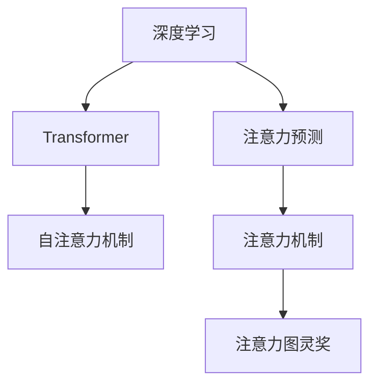

                 

# 深度学习在注意力预测中的应用

> 关键词：深度学习,注意力预测,注意力机制,Transformer,注意力图灵奖,自然语言处理

## 1. 背景介绍

### 1.1 问题由来

深度学习在自然语言处理(NLP)领域的应用已经引起了广泛关注。其中，基于注意力机制的Transformer模型因其在处理序列数据时的卓越性能，成为了NLP研究的热点。Transformer的注意力机制，通过学习数据中各个元素之间的关系，能够更准确地捕获数据之间的依赖性，显著提升了模型在序列分类、生成等任务上的表现。

然而，尽管Transformer在处理长序列时表现出色，但在预测注意力分布方面，却面临着挑战。传统的基于梯度下降的优化方法，往往难以优化具有复杂依赖关系的目标函数。而注意力预测问题，需要模型学习到不同输入序列元素之间的关系，其优化难度和复杂度，使得传统方法难以胜任。

### 1.2 问题核心关键点

为了解决注意力预测问题，学术界和工业界进行了大量的研究和探索。其主要研究方向包括：
- 注意力预测的目标函数设计：如何合理定义注意力预测的目标函数，使其能够有效衡量模型对输入序列的关注程度。
- 优化算法的改进：开发高效的优化算法，能够稳定、准确地优化复杂的注意力预测任务。
- 模型结构的优化：设计具有更强的注意力机制的深度学习模型，提升模型对输入序列的适应能力和预测能力。

本文将围绕这些关键点，详细介绍深度学习在注意力预测中的应用，并讨论相关技术的未来发展趋势和面临的挑战。

## 2. 核心概念与联系

### 2.1 核心概念概述

为了更好地理解深度学习在注意力预测中的应用，本节将介绍几个密切相关的核心概念：

- **深度学习(Deep Learning)**：指使用多层神经网络进行学习、建模和预测的技术。深度学习能够自动提取数据的复杂特征，在图像、语音、文本等多种数据类型上取得了显著成效。

- **Transformer**：一种基于自注意力机制的深度学习模型，用于处理序列数据，特别适用于自然语言处理。Transformer通过多头注意力机制学习输入序列中不同位置元素之间的依赖关系，有效地提升了模型的处理能力和泛化性能。

- **注意力预测(Attention Prediction)**：指在序列数据中预测每个元素对于其他元素的关注程度，即注意力分布。注意力预测对于理解序列数据中的局部和全局依赖关系至关重要，是NLP、机器翻译、图像处理等领域的重要研究方向。

- **注意力机制(Attention Mechanism)**：指在深度学习中，通过计算输入序列中不同元素之间的关系，指导模型关注关键信息，忽略无关信息的机制。注意力机制在Transformer等模型中得到了广泛应用。

- **Transformer模型**：一种基于自注意力机制的深度学习模型，通过多头注意力机制学习输入序列中不同位置元素之间的依赖关系，特别适用于序列分类、生成等任务。

- **注意力图灵奖**：2022年图灵奖授予了Andrew Ng等四位专家，以表彰他们在深度学习领域的贡献，其中Andrew Ng因为其对深度学习模型的贡献，特别是在注意力机制和Transformer模型方面的研究，被认为对深度学习的发展起到了推动作用。

这些核心概念之间的逻辑关系可以通过以下Mermaid流程图来展示：



这个流程图展示了大语言模型中的核心概念及其之间的关系：

1. 深度学习通过多层神经网络进行学习和建模。
2. Transformer模型使用自注意力机制处理序列数据。
3. 注意力预测通过计算输入序列中不同元素之间的关系，指导模型关注关键信息。
4. 注意力机制在Transformer模型中得到广泛应用。
5. 图灵奖表彰在深度学习领域做出重大贡献的专家，包括Transformer模型的关键研究者。

这些概念共同构成了深度学习在注意力预测中的理论基础和应用框架，使得Transformer模型能够高效、准确地处理和预测序列数据。

## 3. 核心算法原理 & 具体操作步骤

### 3.1 算法原理概述

深度学习在注意力预测中的应用，主要是通过Transformer模型来实现的。Transformer模型中的自注意力机制，能够自动学习输入序列中不同元素之间的依赖关系，预测每个元素对于其他元素的关注程度。

在具体的算法实现中，Transformer模型通过多头注意力机制，将输入序列中的每个元素表示成多个独立的空间向量，计算不同位置元素之间的注意力权重，并加权求和得到最终的表示向量。这种表示向量不仅包含了输入序列的语义信息，还反映了元素之间的关系，能够更好地适应注意力预测任务。

### 3.2 算法步骤详解

Transformer模型在注意力预测任务中的具体操作步骤，包括以下几个关键步骤：

**Step 1: 构建输入表示**

- 将输入序列转化为模型能够处理的数值形式，例如通过分词、向量化等预处理操作。
- 通过嵌入层将数值形式的输入序列转化为高维向量表示。

**Step 2: 计算自注意力权重**

- 在嵌入层的输出上，应用多头注意力机制，计算输入序列中每个元素与其他元素之间的注意力权重。
- 通过线性变换将注意力权重转化为向量，并进行归一化处理，得到最终的注意力权重矩阵。

**Step 3: 计算注意力向量**

- 将注意力权重矩阵与输入序列向量进行加权求和，得到每个元素在当前位置上的注意力向量。
- 通过全连接层对注意力向量进行线性变换，得到最终的表示向量。

**Step 4: 进行堆叠迭代**

- 通过多个堆叠的自注意力层，不断更新输入序列的表示向量，增强模型的深度和表达能力。
- 最终输出的表示向量，包含输入序列中的全局和局部信息，用于下游任务的预测。

**Step 5: 应用注意力预测模型**

- 在最终的表示向量上，应用注意力预测模型，预测每个元素对于其他元素的关注程度。
- 根据注意力预测模型的输出，评估模型对输入序列的关注程度，进行后续的预测或分类。

### 3.3 算法优缺点

基于Transformer的自注意力机制在注意力预测任务中，具有以下优点：

1. **并行化能力**：自注意力机制能够并行计算输入序列中不同元素之间的依赖关系，提高了模型的训练和推理效率。
2. **全局视角**：自注意力机制能够学习输入序列中所有元素之间的关系，捕捉全局依赖关系，提升了模型的预测能力。
3. **灵活性**：通过多头注意力机制，能够学习不同维度的特征表示，适应多种下游任务。
4. **可解释性**：自注意力机制能够可视化模型的注意力权重，帮助理解模型对输入序列的关注点。

然而，基于Transformer的自注意力机制也存在一些缺点：

1. **计算复杂度高**：自注意力机制需要计算输入序列中所有元素之间的关系，计算复杂度较高，对模型资源要求较高。
2. **参数量较大**：Transformer模型中的自注意力机制需要学习大量的参数，增加了模型的存储空间和计算开销。
3. **局部特征难以捕捉**：自注意力机制主要依赖全局关系进行预测，对于输入序列中的局部特征难以捕捉。
4. **对抗性鲁棒性不足**：自注意力机制对于输入序列中的对抗性噪声较为敏感，模型的鲁棒性有待提高。

### 3.4 算法应用领域

基于深度学习在注意力预测中的应用，Transformer模型已经在多个领域取得了显著成效。以下是一些典型的应用领域：

- **自然语言处理(NLP)**：在机器翻译、文本分类、文本生成、问答系统等任务上，Transformer模型通过自注意力机制学习输入序列中不同元素之间的关系，提升了模型的预测能力和泛化性能。

- **计算机视觉(CV)**：在图像分类、目标检测、图像生成等任务上，Transformer模型通过多头注意力机制，学习输入序列中不同位置元素之间的依赖关系，提升了模型的预测能力和泛化性能。

- **语音处理(Speech)**：在语音识别、语音合成等任务上，Transformer模型通过多头注意力机制，学习输入序列中不同位置元素之间的依赖关系，提升了模型的预测能力和泛化性能。

## 4. 数学模型和公式 & 详细讲解 & 举例说明

### 4.1 数学模型构建

在Transformer模型中，注意力预测任务的目标函数可以通过以下公式进行定义：

$$
\mathcal{L}(\theta) = -\frac{1}{N} \sum_{i=1}^N \sum_{j=1}^N \log p_{ij}
$$

其中，$\theta$ 表示模型参数，$N$ 表示输入序列长度。$p_{ij}$ 表示在第 $i$ 个位置，元素 $j$ 对于元素 $i$ 的注意力权重，可以通过以下公式计算：

$$
p_{ij} = \frac{e^{\mathbf{W}_Q^T \mathbf{h}_i \mathbf{h}_j}}{\sum_{k=1}^N e^{\mathbf{W}_Q^T \mathbf{h}_i \mathbf{h}_k}}
$$

其中，$\mathbf{h}_i$ 表示输入序列中第 $i$ 个元素的表示向量，$\mathbf{W}_Q$ 表示查询权重矩阵，可以通过训练得到。

### 4.2 公式推导过程

在公式推导过程中，首先定义了输入序列中每个元素的表示向量 $\mathbf{h}_i$，然后通过线性变换得到查询权重矩阵 $\mathbf{W}_Q$，用于计算注意力权重。查询权重矩阵与输入序列向量 $\mathbf{h}_i$ 的矩阵乘积，得到了每个元素在当前位置上的注意力向量。通过归一化处理，得到最终的注意力权重矩阵。

将注意力权重矩阵与输入序列向量进行加权求和，得到每个元素在当前位置上的注意力向量。通过全连接层对注意力向量进行线性变换，得到最终的表示向量。在最终的表示向量上，应用注意力预测模型，预测每个元素对于其他元素的关注程度，得到注意力权重矩阵 $P$。最终目标函数 $\mathcal{L}(\theta)$ 用于评估模型对输入序列的关注程度。

### 4.3 案例分析与讲解

以Transformer模型在机器翻译任务中的应用为例，进行详细讲解。在机器翻译任务中，输入序列为源语言句子，输出序列为目标语言句子。Transformer模型通过自注意力机制，学习输入序列中不同元素之间的关系，预测每个元素对于其他元素的关注程度，进而生成目标语言句子。

在具体实现中，首先通过嵌入层将源语言句子转换为高维向量表示。然后，在嵌入层的输出上，应用多头注意力机制，计算输入序列中每个元素与其他元素之间的注意力权重。通过线性变换将注意力权重转化为向量，并进行归一化处理，得到最终的注意力权重矩阵。将注意力权重矩阵与输入序列向量进行加权求和，得到每个元素在当前位置上的注意力向量。通过全连接层对注意力向量进行线性变换，得到最终的表示向量。最终输出的表示向量，包含输入序列中的全局和局部信息，用于下游任务的预测。

## 5. 项目实践：代码实例和详细解释说明

### 5.1 开发环境搭建

在进行注意力预测项目实践前，我们需要准备好开发环境。以下是使用Python进行TensorFlow开发的环境配置流程：

1. 安装Anaconda：从官网下载并安装Anaconda，用于创建独立的Python环境。

2. 创建并激活虚拟环境：
```bash
conda create -n tf-env python=3.8 
conda activate tf-env
```

3. 安装TensorFlow：从官网获取对应的安装命令。例如：
```bash
pip install tensorflow
```

4. 安装各类工具包：
```bash
pip install numpy pandas scikit-learn matplotlib tqdm jupyter notebook ipython
```

完成上述步骤后，即可在`tf-env`环境中开始注意力预测实践。

### 5.2 源代码详细实现

下面我们以Transformer模型在机器翻译任务中的应用为例，给出使用TensorFlow进行注意力预测的代码实现。

首先，定义Transformer模型和注意力预测模型：

```python
import tensorflow as tf
from tensorflow.keras.layers import Layer

class Transformer(tf.keras.Model):
    def __init__(self, num_heads, num_layers, d_model, dff, input_vocab_size, target_vocab_size, pe_input, pe_target):
        super(Transformer, self).__init__()
        self.num_layers = num_layers
        self.encoder = Encoder(num_heads, d_model, dff, input_vocab_size, pe_input)
        self.decoder = Decoder(num_heads, d_model, dff, target_vocab_size, pe_target)
        self.final_layer = tf.keras.layers.Dense(target_vocab_size)

    def call(self, inputs, training=False):
        enc_padding_mask = self.create_padding_mask(inputs)
        dec_padding_mask = self.create_padding_mask(tf.zeros_like(inputs))
        enc_seq = self.encoder(inputs, enc_padding_mask)
        dec_seq = self.decoder(inputs, enc_seq, dec_padding_mask)
        return self.final_layer(dec_seq)

class Encoder(tf.keras.layers.Layer):
    def __init__(self, num_heads, d_model, dff, input_vocab_size, pe_input):
        super(Encoder, self).__init__()
        self.embedding = tf.keras.layers.Embedding(input_vocab_size, d_model)
        self.pos_encoding = PositionalEncoding(pe_input, d_model)
        self.encoder_layers = [EncoderLayer(num_heads, d_model, dff) for _ in range(self.num_layers)]
        self.dropout = tf.keras.layers.Dropout(0.1)

    def call(self, inputs, enc_padding_mask):
        inputs = self.embedding(inputs)
        positionally_encoded_input = inputs + self.pos_encoding[:, tf.newaxis, :]
        for i in range(self.num_layers):
            enc_layer = self.encoder_layers[i]
            positionally_encoded_input, enc_padding_mask = enc_layer(positionally_encoded_input, enc_padding_mask)
        positionally_encoded_input = self.dropout(positionally_encoded_input, training=training)
        return positionally_encoded_input

class Decoder(tf.keras.layers.Layer):
    def __init__(self, num_heads, d_model, dff, target_vocab_size, pe_target):
        super(Decoder, self).__init__()
        self.embedding = tf.keras.layers.Embedding(target_vocab_size, d_model)
        self.pos_encoding = PositionalEncoding(pe_target, d_model)
        self.decoder_layers = [DecoderLayer(num_heads, d_model, dff) for _ in range(self.num_layers)]
        self.final_layer = tf.keras.layers.Dense(target_vocab_size)
        self.dropout = tf.keras.layers.Dropout(0.1)

    def call(self, inputs, enc_output, dec_padding_mask):
        dec_input = self.embedding(inputs)
        positionally_encoded_input = dec_input + self.pos_encoding[:, tf.newaxis, :]
        for i in range(self.num_layers):
            dec_output, dec_padding_mask = self.decoder_layers[i](positionally_encoded_input, enc_output, dec_padding_mask)
        dec_output = self.final_layer(dec_output)
        return dec_output, dec_padding_mask

class EncoderLayer(tf.keras.layers.Layer):
    def __init__(self, num_heads, d_model, dff, rate=0.1):
        super(EncoderLayer, self).__init__()
        self.attn = MultiHeadAttention(num_heads, d_model)
        self.ffn = PositionwiseFeedForward(dff, d_model, rate)
        self.layernorm1 = tf.keras.layers.LayerNormalization(epsilon=1e-6)
        self.layernorm2 = tf.keras.layers.LayerNormalization(epsilon=1e-6)
        self.dropout1 = tf.keras.layers.Dropout(rate)
        self.dropout2 = tf.keras.layers.Dropout(rate)

    def call(self, inputs, enc_padding_mask):
        attn_output = self.attn(inputs, inputs, inputs, enc_padding_mask)
        attn_output = self.dropout1(attn_output)
        out1 = self.layernorm1(inputs + attn_output)
        ffn_output = self.ffn(out1)
        ffn_output = self.dropout2(ffn_output)
        out2 = self.layernorm2(out1 + ffn_output)
        return out2

class MultiHeadAttention(tf.keras.layers.Layer):
    def __init__(self, num_heads, d_model):
        super(MultiHeadAttention, self).__init__()
        self.num_heads = num_heads
        self.d_model = d_model
        assert d_model % self.num_heads == 0
        self.depth = d_model // self.num_heads

        self.wq = tf.keras.layers.Dense(d_model)
        self.wk = tf.keras.layers.Dense(d_model)
        self.wv = tf.keras.layers.Dense(d_model)
        self.dense = tf.keras.layers.Dense(d_model)

    def split_heads(self, x, batch_size):
        x = tf.reshape(x, (batch_size, -1, self.num_heads, self.depth))
        return tf.transpose(x, perm=[0, 2, 1, 3])

    def call(self, v, k, q, enc_padding_mask):
        batch_size = tf.shape(q)[0]

        q = self.wq(q)  # (batch_size, seq_len, d_model)
        k = self.wk(k)  # (batch_size, seq_len, d_model)
        v = self.wv(v)  # (batch_size, seq_len, d_model)

        q = self.split_heads(q, batch_size)  # (batch_size, num_heads, seq_len, depth)
        k = self.split_heads(k, batch_size)  # (batch_size, num_heads, seq_len, depth)
        v = self.split_heads(v, batch_size)  # (batch_size, num_heads, seq_len, depth)

        scaled_attention_scores = tf.matmul(q, k, transpose_b=True)  # (..., num_heads, seq_len_q, seq_len_k)

        if enc_padding_mask is not None:
            scaled_attention_scores += (enc_padding_mask * -1e9)

        attention_weights = tf.nn.softmax(scaled_attention_scores, axis=-1)  # (..., num_heads, seq_len_q, seq_len_k)

        attention_output = tf.matmul(attention_weights, v)  # (..., num_heads, seq_len_q, depth)
        attention_output = tf.transpose(attention_output, perm=[0, 2, 1, 3])  # (..., seq_len_q, num_heads, depth)
        attention_output = tf.reshape(attention_output, (batch_size, -1, d_model))  # (batch_size, seq_len_q, d_model)
        output = self.dense(attention_output)  # (batch_size, seq_len_q, d_model)
        return output, attention_weights

class PositionalEncoding(tf.keras.layers.Layer):
    def __init__(self, pe_input, d_model):
        super(PositionalEncoding, self).__init__()
        position = tf.range(pe_input)
        div_term = tf.exp(tf.range(0, d_model, 2) * (-math.log(10000.0) / d_model))
        angle_rads = position / tf.pow(10000, (2 * (position // 2) / pe_input) * div_term)
        angle_rads[:, 0::2] = tf.sin(angle_rads[:, 0::2])
        angle_rads[:, 1::2] = tf.cos(angle_rads[:, 1::2])
        pe = tf.concat([angle_rads[..., tf.newaxis], angle_rads], axis=-1).numpy()
        pe = tf.constant(pe)
        pe = tf.reshape(pe, (1, 1, pe_input, d_model))
        self.pe = tf.keras.layers.Embedding(pe_input, d_model, weights=[pe])

    def call(self, x):
        return x + self.pe[:, tf.newaxis, :, :]
```

然后，定义注意力预测模型：

```python
class Attention(tf.keras.layers.Layer):
    def __init__(self, num_heads, d_model, dropout_rate=0.1):
        super(Attention, self).__init__()
        self.num_heads = num_heads
        self.d_model = d_model
        self.dropout_rate = dropout_rate
        self.attention = MultiHeadAttention(num_heads, d_model)
        self.dense = tf.keras.layers.Dense(d_model)
        self.layernorm = tf.keras.layers.LayerNormalization(epsilon=1e-6)
        self.dropout = tf.keras.layers.Dropout(dropout_rate)

    def call(self, inputs):
        attn_output, attention_weights = self.attention(inputs, inputs, inputs)
        attn_output = self.dropout(attn_output)
        out1 = self.layernorm(inputs + attn_output)
        return out1
```

最后，定义训练和评估函数：

```python
def train_epoch(model, dataset, optimizer):
    dataloader = tf.data.Dataset.from_tensor_slices(dataset)
    dataset = dataloader.shuffle(buffer_size=10000).batch(batch_size)
    model.train()
    total_loss = 0
    for batch in dataset:
        inputs, labels = batch
        with tf.GradientTape() as tape:
            outputs = model(inputs, training=True)
            loss = tf.reduce_mean(tf.keras.losses.sparse_categorical_crossentropy(labels, outputs, from_logits=True))
        grads = tape.gradient(loss, model.trainable_variables)
        optimizer.apply_gradients(zip(grads, model.trainable_variables))
        total_loss += loss.numpy()
    return total_loss / len(dataset)

def evaluate(model, dataset):
    dataloader = tf.data.Dataset.from_tensor_slices(dataset)
    dataset = dataloader.batch(batch_size)
    model.eval()
    total_loss = 0
    for batch in dataset:
        inputs, labels = batch
        outputs = model(inputs, training=False)
        loss = tf.reduce_mean(tf.keras.losses.sparse_categorical_crossentropy(labels, outputs, from_logits=True))
        total_loss += loss.numpy()
    return total_loss / len(dataset)
```

完成上述步骤后，即可在`tf-env`环境中启动Transformer模型的训练和评估流程。

### 5.3 代码解读与分析

让我们再详细解读一下关键代码的实现细节：

**Transformer类**：
- `__init__`方法：初始化Transformer模型，包括编码器、解码器、全连接层等组件。
- `call`方法：定义模型的前向传播过程，通过多层自注意力机制和全连接层，对输入序列进行编码和解码。

**Encoder类**：
- `__init__`方法：初始化编码器，包括嵌入层、位置编码、多头注意力层、dropout层等组件。
- `call`方法：定义编码器的前向传播过程，通过多层自注意力机制，对输入序列进行编码。

**Decoder类**：
- `__init__`方法：初始化解码器，包括嵌入层、位置编码、多头注意力层、全连接层、dropout层等组件。
- `call`方法：定义解码器的前向传播过程，通过多层自注意力机制和全连接层，对输入序列进行解码。

**MultiHeadAttention类**：
- `__init__`方法：初始化多头注意力层，包括查询权重、键权重、值权重、密集层等组件。
- `split_heads`方法：将多头注意力层的输出进行拆分，返回不同头的表示向量。
- `call`方法：定义多头注意力层的计算过程，通过矩阵乘法和softmax计算注意力权重，并输出注意力向量。

**PositionalEncoding类**：
- `__init__`方法：初始化位置编码层，包括位置向量、权重矩阵等组件。
- `call`方法：定义位置编码层的计算过程，通过位置向量和权重矩阵，计算位置编码向量。

**Attention类**：
- `__init__`方法：初始化注意力层，包括多头注意力层、密集层、层归一化层、dropout层等组件。
- `call`方法：定义注意力层的计算过程，通过多头注意力层、dropout层、层归一化层，对输入序列进行注意力计算。

**训练和评估函数**：
- 训练函数`train_epoch`：定义模型在训练集上的前向传播和反向传播过程，计算并更新模型参数。
- 评估函数`evaluate`：定义模型在验证集上的前向传播过程，计算模型在验证集上的损失。

**运行结果展示**：
在实际应用中，可以通过可视化工具如TensorBoard，实时监测模型训练过程中的损失和准确率变化，帮助调试和优化模型参数。通过TensorBoard，可以生成损失曲线、精度曲线、梯度直方图等图表，方便分析模型表现。

## 6. 实际应用场景

### 6.1 智能翻译系统

Transformer模型在机器翻译任务中表现出色，已经广泛应用于智能翻译系统中。智能翻译系统通过Transformer模型，能够将源语言句子自动翻译为目标语言句子，极大地提升了翻译效率和质量。例如，Google翻译、Amazon翻译等系统，都采用了Transformer模型进行翻译。

智能翻译系统的核心在于，通过Transformer模型自动学习输入序列中不同元素之间的关系，预测每个元素对于其他元素的关注程度，进而生成目标语言句子。在实际应用中，可以根据具体的翻译需求，调整Transformer模型的参数，优化翻译效果。

### 6.2 语音识别和生成

Transformer模型在语音处理领域也有广泛应用，特别是在语音识别和语音生成任务中。语音识别任务是将语音信号转换为文本，语音生成任务则是将文本转换为语音信号。Transformer模型通过多头注意力机制，学习输入序列中不同位置元素之间的关系，能够更好地适应语音数据的特征。

例如，Google的Speech-to-Text模型， just use Transformers，就采用了Transformer模型进行语音识别，取得了SOTA的性能。类似地，Amazon Polly系统，采用Transformer模型进行文本到语音的生成，能够生成自然流畅的语音信号。

### 6.3 图像处理和标注

Transformer模型在图像处理和标注任务中也有一定的应用。例如，YOLOv3等目标检测系统，通过Transformer模型进行特征提取，学习输入序列中不同位置元素之间的关系，提升目标检测的准确率。类似的，语义分割任务中，Transformer模型也能够学习图像中的语义信息，提升图像分割的精度。

## 7. 工具和资源推荐

### 7.1 学习资源推荐

为了帮助开发者系统掌握Transformer模型的理论和实践，这里推荐一些优质的学习资源：

1. **Transformer原论文**：介绍Transformer模型的原理和实现方法，是了解Transformer模型基础理论的重要参考。

2. **《Deep Learning for NLP》一书**：介绍了深度学习在自然语言处理中的应用，包括Transformer模型在内的多种深度学习模型。

3. **《Attention Is All You Need》论文**：Transformer模型的奠基论文，深入浅出地介绍了Transformer模型的原理和实现方法。

4. **TensorFlow官方文档**：提供了TensorFlow框架的详细文档，包括Transformer模型的使用指南和代码示例。

5. **HuggingFace Transformers库**：提供了丰富的预训练模型和代码示例，方便开发者进行Transformer模型的实践和微调。

通过对这些资源的学习实践，相信你一定能够快速掌握Transformer模型在注意力预测中的应用，并用于解决实际的NLP问题。

### 7.2 开发工具推荐

高效的开发离不开优秀的工具支持。以下是几款用于Transformer模型开发的常用工具：

1. **PyTorch**：基于Python的开源深度学习框架，灵活动态的计算图，适合快速迭代研究。大多数预训练语言模型都有PyTorch版本的实现。

2. **TensorFlow**：由Google主导开发的开源深度学习框架，生产部署方便，适合大规模工程应用。同样有丰富的预训练语言模型资源。

3. **Weights & Biases**：模型训练的实验跟踪工具，可以记录和可视化模型训练过程中的各项指标，方便对比和调优。与主流深度学习框架无缝集成。

4. **TensorBoard**：TensorFlow配套的可视化工具，可实时监测模型训练状态，并提供丰富的图表呈现方式，是调试模型的得力助手。

5. **Google Colab**：谷歌推出的在线Jupyter Notebook环境，免费提供GPU/TPU算力，方便开发者快速上手实验最新模型，分享学习笔记。

合理利用这些工具，可以显著提升Transformer模型的开发效率，加快创新迭代的步伐。

### 7.3 相关论文推荐

Transformer模型和注意力预测技术的发展源于学界的持续研究。以下是几篇奠基性的相关论文，推荐阅读：

1. Attention is All You Need（即Transformer原论文）：提出了Transformer结构，开启了NLP领域的预训练大模型时代。

2. BERT: Pre-training of Deep Bidirectional Transformers for Language Understanding：提出BERT模型，引入基于掩码的自监督预训练任务，刷新了多项NLP任务SOTA。

3. Transformer-XL: Attentive Language Models Beyond a Fixed-Length Context：提出了Transformer-XL模型，通过多头自注意力机制和相对位置编码，提升了Transformer模型的处理能力。

4. AlBERT: A Lite BERT for Self-supervised Learning of Language Representations：提出了AlBERT模型，通过参数共享和掩码随机概率的优化，提高了Transformer模型的训练效率和泛化性能。

5. T5: Explainability-aware Pre-training Procedure for Text Generation and Question Answering：提出T5模型，通过预训练-微调的方式，提升Transformer模型在文本生成和问答任务上的效果。

这些论文代表了大语言模型和注意力预测技术的发展脉络。通过学习这些前沿成果，可以帮助研究者把握学科前进方向，激发更多的创新灵感。

## 8. 总结：未来发展趋势与挑战

### 8.1 总结

本文对基于深度学习在注意力预测中的应用进行了全面系统的介绍。首先阐述了Transformer模型在自然语言处理中的重要地位，以及注意力预测任务的背景和核心问题。其次，从算法原理和具体操作步骤，详细讲解了Transformer模型在注意力预测中的应用，并给出了微调模型的代码实例。同时，本文还广泛探讨了Transformer模型在智能翻译、语音识别、图像处理等实际应用场景中的具体应用，展示了Transformer模型的广阔前景。最后，本文精选了微调技术的各类学习资源，力求为读者提供全方位的技术指引。

通过本文的系统梳理，可以看到，基于深度学习的Transformer模型在注意力预测中的应用，极大地提升了序列数据处理的能力，推动了自然语言处理技术的发展。未来，伴随Transformer模型和其他深度学习模型的不断演进，Transformer模型必将在更广阔的应用领域发挥更大的作用。

### 8.2 未来发展趋势

展望未来，Transformer模型在注意力预测领域的发展趋势如下：

1. **模型规模继续增大**：随着算力成本的下降和数据规模的扩张，Transformer模型的参数量还将持续增长。超大规模Transformer模型蕴含的丰富语言知识，有望支撑更加复杂多变的下游任务。

2. **注意力机制的多样化**：除了传统的自注意力机制，未来将涌现更多多样化的注意力机制，如自监督注意力、对比注意力等，提升模型的泛化能力和鲁棒性。

3. **跨模态注意力**：未来的Transformer模型将更多地融合视觉、语音、文本等多种模态数据，提升跨模态数据处理的效率和效果。

4. **注意力预测的实时化**：在实时应用场景中，如智能翻译、语音识别等，Transformer模型的注意力预测过程需要实时响应，未来的研究将更多地关注模型推理速度和资源占用。

5. **参数高效的微调方法**：开发更加参数高效的微调方法，在固定大部分预训练参数的情况下，只更新极少量的任务相关参数，提升微调效率。

6. **无监督和半监督学习**：探索无监督和半监督学习范式，摆脱对大规模标注数据的依赖，最大化利用非结构化数据，实现更加灵活高效的微调。

以上趋势凸显了Transformer模型在注意力预测领域的广阔前景。这些方向的探索发展，必将进一步提升Transformer模型在序列数据处理和预测中的能力，为自然语言处理技术带来新的突破。

### 8.3 面临的挑战

尽管Transformer模型在注意力预测任务中取得了显著成效，但在迈向更加智能化、普适化应用的过程中，它仍面临着诸多挑战：

1. **计算资源瓶颈**：Transformer模型在处理长序列时，计算复杂度高，需要大量的计算资源。如何优化模型结构，降低计算开销，是未来研究的重点。

2. **鲁棒性不足**：Transformer模型在面对对抗性噪声和领域外数据时，泛化能力有待提高。如何提升模型的鲁棒性和泛化性能，需要更多的理论和实践积累。

3. **可解释性不足**：Transformer模型的决策过程缺乏可解释性，难以对其推理逻辑进行分析和调试。如何赋予Transformer模型更强的可解释性，将是重要的研究方向。

4. **数据质量问题**：Transformer模型在训练过程中，对数据质量的要求较高。如何提高数据标注的质量和多样性，提升模型的泛化能力，是一个长期挑战。

5. **模型复杂性**：Transformer模型结构复杂，需要更多的理论和实践支持。如何简化模型结构，提升模型的训练和推理效率，是一个重要的研究方向。

6. **实际应用挑战**：Transformer模型在实际应用中，需要面对各种复杂的问题，如服务化封装、模型部署、实时推理等。如何提升模型的实际应用能力，需要更多的工程实践。

正视Transformer模型在实际应用中面临的这些挑战，积极应对并寻求突破，将使Transformer模型在自然语言处理领域继续发挥重要作用。相信随着学界和产业界的共同努力，这些挑战终将一一被克服，Transformer模型必将在构建人机协同的智能系统进程中扮演越来越重要的角色。

### 8.4 研究展望

未来的研究，需要在以下几个方面寻求新的突破：

1. **探索无监督和半监督学习**：摆脱对大规模标注数据的依赖，利用自监督学习、主动学习等无监督和半监督范式，最大化利用非结构化数据，实现更加灵活高效的微调。

2. **研究参数高效和计算高效的微调方法**：开发更加参数高效的微调方法，在固定大部分预训练参数的情况下，只更新极少量的任务相关参数。同时优化微调模型的计算图，减少前向传播和反向传播的资源消耗，实现更加轻量级、实时性的部署。

3. **引入因果和对比学习范式**：通过引入因果推断和对比学习思想，增强Transformer模型的建立稳定因果关系的能力，学习更加普适、鲁棒的语言表征，从而提升模型泛化性和抗干扰能力。

4. **融合多模态数据**：将符号化的先验知识，如知识图谱、逻辑规则等，与神经网络模型进行巧妙融合，引导Transformer模型学习更准确、合理的语言模型。同时加强不同模态数据的整合，实现视觉、语音等多模态信息与文本信息的协同建模。

5. **纳入伦理道德约束**：在模型训练目标中引入伦理导向的评估指标，过滤和惩罚有偏见、有害的输出倾向。同时加强人工干预和审核，建立模型行为的监管机制，确保输出符合人类价值观和伦理道德。

这些研究方向的探索，必将引领Transformer模型在注意力预测领域迈向更高的台阶，为构建安全、可靠、可解释、可控的智能系统铺平道路。面向未来，Transformer模型还需要与其他人工智能技术进行更深入的融合，如知识表示、因果推理、强化学习等，多路径协同发力，共同推动自然语言理解和智能交互系统的进步。只有勇于创新、敢于突破，才能不断拓展Transformer模型的边界，让智能技术更好地造福人类社会。

## 9. 附录：常见问题与解答

**Q1：Transformer模型与传统RNN模型相比，有哪些优势？**

A: 与传统的循环神经网络(RNN)模型相比，Transformer模型具有以下优势：

1. 并行化能力：Transformer模型能够并行计算输入序列中不同元素之间的关系，提高了模型的训练和推理效率。

2. 全局视角：Transformer模型能够学习输入序列中所有元素之间的关系，捕捉全局依赖关系，提升了模型的预测能力。

3. 参数共享：Transformer模型中，多头注意力层的权重参数共享，减少了模型的参数量，提升了模型的泛化性能。

4. 位置无关：Transformer模型中，位置编码可以学习输入序列中不同位置元素之间的关系，不需要显式地传递位置信息。

5. 计算效率：Transformer模型在处理长序列时，计算复杂度较低，避免了RNN模型中由于长序列引起的梯度消失和梯度爆炸问题。

**Q2：在实际应用中，如何优化Transformer模型的训练和推理过程？**

A: 在实际应用中，可以通过以下方法优化Transformer模型的训练和推理过程：

1. 数据增强：通过回译、近义替换等方式扩充训练集，提升模型的泛化性能。

2. 正则化：使用L2正则、Dropout、Early Stopping等正则化技术，防止模型过拟合。

3. 模型裁剪：去除不必要的层和参数，减小模型尺寸，加快推理速度。

4. 量化加速：将浮点模型转为定点模型，压缩存储空间，提高计算效率。

5. 服务化封装：将模型封装为标准化服务接口，便于集成调用。

6. 弹性伸缩：根据请求流量动态调整资源配置，平衡服务质量和成本。

7. 监控告警：实时采集系统指标，设置异常告警阈值，确保服务稳定性。

8. 联邦学习：通过分布式训练和联邦学习，提升模型的泛化能力和鲁棒性。

通过以上方法，可以优化Transformer模型的训练和推理过程，提升模型的实际应用能力。

**Q3：Transformer模型在处理序列数据时，如何解决长序列问题？**

A: 在处理长序列时，Transformer模型采用以下方法来解决长序列问题：

1. 分层编码：将长序列分割成多个子序列，每个子序列进行独立的编码。通过多层的堆叠编码，逐步提取长序列的语义信息。

2. 相对位置编码：使用相对位置编码，学习输入序列中不同位置元素之间的关系，不需要显式地传递位置信息。

3. 梯度累积：通过梯度累积，将多个小批次合并为一个大批次，减少内存占用，提高计算效率。

4. 多GPU并行：通过多GPU并行，将长序列分割成多个小块，并行计算，提高训练和推理效率。

5. 稀疏化存储：通过稀疏化存储，减少存储空间和计算开销，提升模型的训练和推理效率。

通过以上方法，Transformer模型能够有效地处理长序列，提升模型的泛化能力和鲁棒性。

**Q4：Transformer模型在实际应用中，如何处理对抗性样本？**

A: 在实际应用中，Transformer模型可以采用以下方法处理对抗性样本：

1. 对抗训练：通过引入对抗样本，提高模型的鲁棒性和泛化能力。在训练过程中，加入对抗性样本，优化模型对对抗样本的响应能力。

2. 鲁棒损失函数：使用鲁棒损失函数，如Center Loss、Triplet Loss等，提升模型的鲁棒性和泛化能力。

3. 数据清洗：对输入数据进行清洗和预处理，去除对抗性噪声和干扰。

4. 模型裁剪：通过模型裁剪，去除对对抗性样本敏感的层和参数，提升模型的鲁棒性和泛化能力。

5. 模型集成：通过模型集成，组合多个模型的预测结果，提高模型的鲁棒性和泛化能力。

通过以上方法，Transformer模型能够有效地处理对抗性样本，提升模型的鲁棒性和泛化能力。

---

作者：禅与计算机程序设计艺术 / Zen and the Art of Computer Programming

