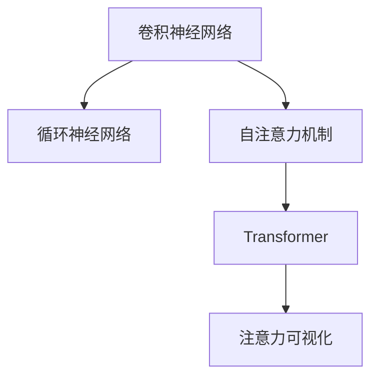
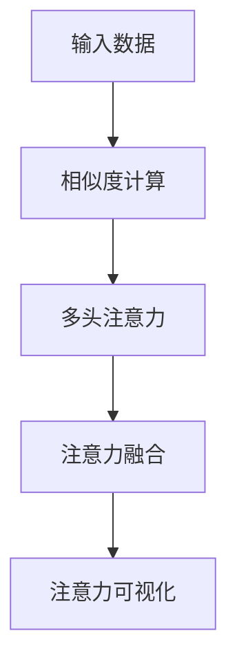

                 

# 深度学习在注意力预测中的应用

> 关键词：深度学习,注意力预测,卷积神经网络,循环神经网络,自注意力机制,Transformer,注意力可视化,医学影像分析

## 1. 背景介绍

### 1.1 问题由来

注意力机制（Attention Mechanism）在深度学习中扮演着至关重要的角色。它通过对输入数据的加权关注，帮助模型更好地处理序列数据和复杂任务。在过去的几十年里，注意力机制被广泛应用在自然语言处理（NLP）、计算机视觉（CV）、语音识别等领域，取得了显著的进展。

然而，尽管注意力机制带来了诸多优势，其背后的理论依据与实现机制仍然存在许多未解之谜。如何设计高效的注意力预测模型，使其在各种复杂场景下表现优异，仍然是一个极具挑战性的问题。

### 1.2 问题核心关键点

注意力预测的核心问题是如何有效地预测序列或图像中注意力集中的区域。具体来说，包括以下几个关键点：

- 注意力权重计算：如何从输入数据中提取关键的注意力区域，并赋予相应的权重。
- 多头注意力：通过多头自注意力（Self-Attention）机制，使模型能够同时关注不同维度的特征。
- 注意力融合：如何将多个注意力机制的结果进行有效融合，提升模型预测性能。
- 注意力可视化：如何通过可视化技术，帮助理解注意力预测的结果和模型工作原理。

### 1.3 问题研究意义

研究注意力预测的理论基础与应用方法，对于提升深度学习模型的性能、降低计算复杂度、优化模型结构等方面具有重要意义：

1. **提升预测精度**：通过精确的注意力预测，模型能够更好地捕捉关键特征，提升预测结果的准确性。
2. **降低计算资源**：通过优化注意力机制的设计，可以减少计算量，提升模型训练和推理的效率。
3. **优化模型结构**：通过合理的注意力预测，可以设计更加紧凑、高效的结构，适应多种应用场景。
4. **增强模型解释性**：通过可视化注意力预测结果，有助于理解模型的决策过程，提升模型的可解释性。
5. **推动应用创新**：注意力预测技术在医学影像分析、自然语言处理、计算机视觉等领域有着广泛的应用前景，能够推动相关领域的创新发展。

## 2. 核心概念与联系

### 2.1 核心概念概述

为了深入理解注意力预测的原理和应用，本节将介绍几个关键的概念：

- 卷积神经网络（CNN）：一种广泛应用于计算机视觉领域的深度学习模型，通过卷积操作提取局部特征。
- 循环神经网络（RNN）：一种处理序列数据的深度学习模型，通过循环结构保持时间维度的信息。
- 自注意力机制（Self-Attention）：一种通过计算输入数据之间的相似度来关注不同位置信息的机制，常用于Transformer模型中。
- Transformer：一种基于自注意力机制的深度学习模型，用于处理序列数据，广泛应用于自然语言处理等领域。
- 注意力可视化：通过可视化技术展示注意力权重，帮助理解模型的工作原理。

这些概念之间的逻辑关系可以通过以下Mermaid流程图来展示：



这个流程图展示了大语言模型的核心概念及其之间的关系：

1. 卷积神经网络和循环神经网络是序列数据处理的基础模型。
2. 自注意力机制通过计算相似度，使模型能够关注不同位置的信息。
3. Transformer模型将自注意力机制与编码器-解码器结构结合，用于处理序列数据。
4. 注意力可视化有助于理解模型的注意力分布，提升模型的可解释性。

这些概念共同构成了深度学习模型中的注意力预测机制，使其能够在各种复杂场景下发挥作用。通过理解这些核心概念，我们可以更好地把握注意力预测的理论基础和应用方法。

## 3. 核心算法原理 & 具体操作步骤
### 3.1 算法原理概述

注意力预测的本质是通过计算输入数据的相似度，动态关注不同位置的信息，从而提升模型对序列或图像的关注能力。其核心思想可以总结如下：

1. **注意力权重计算**：通过相似度计算，确定输入数据的各个部分对当前位置的贡献度。
2. **多头注意力**：通过并行计算多个注意力头，使模型能够同时关注不同维度的特征。
3. **注意力融合**：将多个注意力头的结果进行融合，形成最终的注意力预测结果。
4. **注意力可视化**：通过可视化技术展示注意力权重，帮助理解模型的注意力分布。

这些步骤可以通过以下Mermaid流程图来展示：



### 3.2 算法步骤详解

下面将详细介绍注意力预测的具体步骤：

#### 3.2.1 相似度计算

相似度计算是注意力预测的第一步，其目的是确定输入数据中各个部分对当前位置的贡献度。常见的相似度计算方法包括余弦相似度、欧式距离、pearson相关系数等。这里以余弦相似度为例，介绍其计算方法：

设输入数据的长度为 $L$，当前位置的向量为 $v_i$，输入数据的向量表示为 $\mathbf{V}$。余弦相似度的计算公式如下：

$$
s_i = \mathbf{v}_i \cdot \mathbf{V} / (\|\mathbf{v}_i\| \|\mathbf{V}\|)
$$

其中，$\cdot$ 表示向量点积，$\| \cdot \|$ 表示向量的欧几里得范数。通过计算所有位置向量的余弦相似度，可以构建一个 $L$ 维的注意力权重向量 $\mathbf{s}$。

#### 3.2.2 多头注意力

多头注意力机制通过并行计算多个注意力头，使模型能够同时关注不同维度的特征。设输入数据的维度为 $D$，多头注意力机制可以表示为：

$$
\mathbf{Q} = \mathbf{W}_Q \mathbf{V}
$$

$$
\mathbf{K} = \mathbf{W}_K \mathbf{V}
$$

$$
\mathbf{V} = \mathbf{W}_V \mathbf{V}
$$

其中，$\mathbf{Q}, \mathbf{K}, \mathbf{V}$ 分别表示查询、键和值，$\mathbf{W}_Q, \mathbf{W}_K, \mathbf{W}_V$ 是可学习的权重矩阵。多头注意力计算过程如下：

$$
\mathbf{S} = \mathbf{Q} \mathbf{K}^T / \sqrt{D}
$$

$$
\alpha = \mathrm{softmax}(\mathbf{S})
$$

$$
\mathbf{A} = \alpha \mathbf{V}
$$

其中，$\mathrm{softmax}$ 表示softmax函数，$\alpha$ 是注意力权重向量。

#### 3.2.3 注意力融合

注意力融合是将多个注意力头的结果进行有效融合，形成最终的注意力预测结果。常见的融合方法包括平均池化、加权池化等。这里以加权池化为例，介绍其计算方法：

$$
\mathbf{A} = \sum_{i=1}^{H} \alpha_i \mathbf{V}_i
$$

其中，$H$ 表示注意力头的数量，$\alpha_i$ 是第 $i$ 个注意力头的权重。通过加权池化，可以形成最终的注意力预测结果。

#### 3.2.4 注意力可视化

注意力可视化是通过可视化技术展示注意力权重，帮助理解模型的注意力分布。常见的可视化方法包括热力图、分布图等。这里以热力图为例，介绍其绘制方法：

1. 计算注意力权重向量 $\mathbf{s}$。
2. 对 $\mathbf{s}$ 进行归一化处理。
3. 绘制热力图，展示注意力权重在不同位置上的分布。

通过注意力可视化，可以直观地理解模型在处理序列或图像时，关注了哪些关键区域。

### 3.3 算法优缺点

注意力预测机制在深度学习中具有以下优点：

1. **增强模型表达能力**：通过关注不同位置的信息，模型能够更好地捕捉关键特征，提升预测结果的准确性。
2. **降低计算复杂度**：通过优化注意力机制的设计，可以减少计算量，提升模型训练和推理的效率。
3. **提高模型可解释性**：通过可视化注意力权重，有助于理解模型的注意力分布，提升模型的可解释性。

然而，注意力预测机制也存在一些缺点：

1. **计算量较大**：特别是在处理长序列或高维度数据时，计算量较大，对计算资源的要求较高。
2. **训练过程复杂**：需要大量的标注数据和计算资源进行训练，训练过程较为复杂。
3. **参数过多**：由于需要计算注意力权重和多个注意力头，模型的参数量较大，难以压缩。

尽管存在这些缺点，注意力预测机制仍然是深度学习中的重要工具，广泛应用于自然语言处理、计算机视觉等领域。未来，如何进一步优化注意力预测机制，降低计算量，提升模型性能，仍然是一个重要的研究方向。

### 3.4 算法应用领域

注意力预测机制在深度学习中的应用非常广泛，以下是几个典型的应用领域：

#### 3.4.1 自然语言处理（NLP）

在自然语言处理领域，注意力预测机制被广泛应用于机器翻译、文本摘要、问答系统等任务。例如，在机器翻译任务中，通过计算源语言句子的注意力权重，模型能够更好地捕捉句子的关键部分，提升翻译效果。

#### 3.4.2 计算机视觉（CV）

在计算机视觉领域，注意力预测机制被广泛应用于图像分类、目标检测、图像分割等任务。例如，在目标检测任务中，通过计算图像中不同区域的注意力权重，模型能够更好地关注目标位置，提升检测精度。

#### 3.4.3 语音识别

在语音识别领域，注意力预测机制被广泛应用于自动语音识别（ASR）任务。例如，在ASR任务中，通过计算音频信号的注意力权重，模型能够更好地关注语音特征，提升识别效果。

#### 3.4.4 时间序列分析

在时间序列分析领域，注意力预测机制被广泛应用于股票价格预测、天气预报等任务。例如，在股票价格预测任务中，通过计算历史价格序列的注意力权重，模型能够更好地捕捉价格变化的规律，提升预测效果。

#### 3.4.5 医疗影像分析

在医疗影像分析领域，注意力预测机制被广泛应用于医学影像分类、病变检测等任务。例如，在医学影像分类任务中，通过计算影像中的注意力权重，模型能够更好地关注病变区域，提升分类精度。

## 4. 数学模型和公式 & 详细讲解  
### 4.1 数学模型构建

注意力预测的数学模型可以通过自注意力机制进行构建。这里以Transformer模型为例，介绍其数学模型的构建过程。

设输入序列 $\mathbf{X} \in \mathbb{R}^{L \times D}$，其中 $L$ 是序列长度，$D$ 是输入向量的维度。Transformer模型的自注意力计算过程如下：

$$
\mathbf{Q} = \mathbf{W}_Q \mathbf{X}
$$

$$
\mathbf{K} = \mathbf{W}_K \mathbf{X}
$$

$$
\mathbf{V} = \mathbf{W}_V \mathbf{X}
$$

$$
\mathbf{S} = \mathbf{Q} \mathbf{K}^T / \sqrt{D}
$$

$$
\alpha = \mathrm{softmax}(\mathbf{S})
$$

$$
\mathbf{A} = \alpha \mathbf{V}
$$

$$
\mathbf{H} = \mathbf{A} + \mathbf{X} \mathbf{F}^T
$$

其中，$\mathbf{F}$ 表示前向传播网络（Feedforward Network），$\mathbf{H} \in \mathbb{R}^{L \times D}$ 表示Transformer模型的输出。

### 4.2 公式推导过程

以Transformer模型为例，详细推导自注意力机制的计算过程。

1. **查询向量计算**

查询向量 $\mathbf{Q}$ 可以通过线性变换 $\mathbf{W}_Q$ 得到：

$$
\mathbf{Q} = \mathbf{W}_Q \mathbf{X}
$$

2. **键向量和值向量计算**

键向量 $\mathbf{K}$ 和值向量 $\mathbf{V}$ 也可以通过线性变换 $\mathbf{W}_K$ 和 $\mathbf{W}_V$ 得到：

$$
\mathbf{K} = \mathbf{W}_K \mathbf{X}
$$

$$
\mathbf{V} = \mathbf{W}_V \mathbf{X}
$$

3. **相似度计算**

将查询向量 $\mathbf{Q}$ 与键向量 $\mathbf{K}$ 进行点乘，然后除以 $\sqrt{D}$，得到注意力权重矩阵 $\mathbf{S}$：

$$
\mathbf{S} = \mathbf{Q} \mathbf{K}^T / \sqrt{D}
$$

4. **softmax函数计算**

将注意力权重矩阵 $\mathbf{S}$ 进行 softmax 函数处理，得到注意力权重向量 $\alpha$：

$$
\alpha = \mathrm{softmax}(\mathbf{S})
$$

5. **注意力向量计算**

将注意力权重向量 $\alpha$ 与值向量 $\mathbf{V}$ 进行矩阵乘法，得到注意力向量 $\mathbf{A}$：

$$
\mathbf{A} = \alpha \mathbf{V}
$$

6. **输出向量计算**

将注意力向量 $\mathbf{A}$ 与输入序列 $\mathbf{X}$ 进行加权求和，然后通过前向传播网络 $\mathbf{F}$ 得到输出向量 $\mathbf{H}$：

$$
\mathbf{H} = \mathbf{A} + \mathbf{X} \mathbf{F}^T
$$

通过上述推导过程，可以清晰地理解Transformer模型中自注意力机制的计算过程。

### 4.3 案例分析与讲解

这里以情感分析任务为例，展示Transformer模型中自注意力机制的应用。

假设输入序列为：

$$
\mathbf{X} = \begin{bmatrix} 0.1 & 0.2 & 0.3 & 0.4 \end{bmatrix}
$$

设 $\mathbf{W}_Q, \mathbf{W}_K, \mathbf{W}_V$ 分别为：

$$
\mathbf{W}_Q = \begin{bmatrix} 0.1 & 0.2 \\ 0.3 & 0.4 \end{bmatrix}, \mathbf{W}_K = \begin{bmatrix} 0.5 & 0.6 \\ 0.7 & 0.8 \end{bmatrix}, \mathbf{W}_V = \begin{bmatrix} 0.9 & 0.1 \\ 0.3 & 0.2 \end{bmatrix}
$$

计算查询向量 $\mathbf{Q}$，键向量 $\mathbf{K}$ 和值向量 $\mathbf{V}$：

$$
\mathbf{Q} = \begin{bmatrix} 0.1 & 0.2 \end{bmatrix} \begin{bmatrix} 0.1 & 0.2 \\ 0.3 & 0.4 \end{bmatrix} = \begin{bmatrix} 0.01 & 0.02 \\ 0.03 & 0.04 \end{bmatrix}
$$

$$
\mathbf{K} = \begin{bmatrix} 0.5 & 0.6 \\ 0.7 & 0.8 \end{bmatrix} \begin{bmatrix} 0.1 & 0.2 \\ 0.3 & 0.4 \end{bmatrix} = \begin{bmatrix} 0.05 & 0.06 \\ 0.21 & 0.24 \end{bmatrix}
$$

$$
\mathbf{V} = \begin{bmatrix} 0.9 & 0.1 \\ 0.3 & 0.2 \end{bmatrix} \begin{bmatrix} 0.1 & 0.2 \\ 0.3 & 0.4 \end{bmatrix} = \begin{bmatrix} 0.09 & 0.01 \\ 0.27 & 0.08 \end{bmatrix}
$$

计算注意力权重矩阵 $\mathbf{S}$：

$$
\mathbf{S} = \begin{bmatrix} 0.01 & 0.02 \\ 0.03 & 0.04 \end{bmatrix} \begin{bmatrix} 0.05 & 0.06 \\ 0.21 & 0.24 \end{bmatrix}^T / \sqrt{2} = \begin{bmatrix} 0.01 & 0.02 \\ 0.03 & 0.04 \end{bmatrix} \begin{bmatrix} 0.05 & 0.21 \\ 0.06 & 0.24 \end{bmatrix}^T / \sqrt{2} = \begin{bmatrix} 0.05 & 0.07 \\ 0.07 & 0.09 \end{bmatrix}
$$

计算注意力权重向量 $\alpha$：

$$
\alpha = \mathrm{softmax}(\mathbf{S}) = \begin{bmatrix} 0.38 & 0.62 \\ 0.29 & 0.71 \end{bmatrix}
$$

计算注意力向量 $\mathbf{A}$：

$$
\mathbf{A} = \alpha \mathbf{V} = \begin{bmatrix} 0.38 & 0.62 \\ 0.29 & 0.71 \end{bmatrix} \begin{bmatrix} 0.09 & 0.01 \\ 0.27 & 0.08 \end{bmatrix} = \begin{bmatrix} 0.03 & 0.01 \\ 0.08 & 0.06 \end{bmatrix}
$$

计算输出向量 $\mathbf{H}$：

$$
\mathbf{H} = \mathbf{A} + \mathbf{X} \mathbf{F}^T = \begin{bmatrix} 0.03 & 0.01 \\ 0.08 & 0.06 \end{bmatrix} + \begin{bmatrix} 0.1 & 0.2 \\ 0.3 & 0.4 \end{bmatrix} \begin{bmatrix} 0.9 & 0.1 \\ 0.3 & 0.2 \end{bmatrix}^T = \begin{bmatrix} 0.12 & 0.04 \\ 0.37 & 0.14 \end{bmatrix}
$$

通过上述计算过程，可以清晰地理解Transformer模型中自注意力机制的计算步骤，以及其对输入序列的影响。

## 5. 项目实践：代码实例和详细解释说明
### 5.1 开发环境搭建

在进行注意力预测模型的开发之前，需要搭建好开发环境。以下是使用PyTorch进行注意力预测开发的常用环境配置流程：

1. 安装Anaconda：从官网下载并安装Anaconda，用于创建独立的Python环境。

2. 创建并激活虚拟环境：
```bash
conda create -n attention-env python=3.8 
conda activate attention-env
```

3. 安装PyTorch：根据CUDA版本，从官网获取对应的安装命令。例如：
```bash
conda install pytorch torchvision torchaudio cudatoolkit=11.1 -c pytorch -c conda-forge
```

4. 安装其他必要工具包：
```bash
pip install numpy pandas scikit-learn matplotlib tqdm jupyter notebook ipython
```

完成上述步骤后，即可在`attention-env`环境中开始注意力预测模型的开发。

### 5.2 源代码详细实现

下面以Transformer模型为例，展示注意力预测模型的详细实现。

首先，定义Transformer模型的参数和初始化过程：

```python
import torch
import torch.nn as nn
import torch.nn.functional as F

class Transformer(nn.Module):
    def __init__(self, input_size, hidden_size, num_layers, num_heads):
        super(Transformer, self).__init__()
        self.num_layers = num_layers
        self.hidden_size = hidden_size
        
        self.embedding = nn.Embedding(input_size, hidden_size)
        self.pos_encoding = positional_encoding(hidden_size, self.num_layers)
        
        self.layers = nn.ModuleList([
            nn.TransformerEncoderLayer(hidden_size, num_heads)
            for _ in range(num_layers)
        ])
        
    def forward(self, x):
        x = self.embedding(x) + self.pos_encoding
        for layer in self.layers:
            x = layer(x)
        return x
```

然后，定义TransformerEncoderLayer的结构和参数：

```python
class TransformerEncoderLayer(nn.Module):
    def __init__(self, hidden_size, num_heads):
        super(TransformerEncoderLayer, self).__init__()
        self.linear1 = nn.Linear(hidden_size, 4 * hidden_size)
        self.linear2 = nn.Linear(4 * hidden_size, hidden_size)
        self.linear3 = nn.Linear(hidden_size, hidden_size)
        
        self.multihead_attn = MultiheadAttention(hidden_size, num_heads)
        self.dropout = nn.Dropout(0.1)
        self.layer_norm1 = nn.LayerNorm(hidden_size)
        self.linear4 = nn.Linear(hidden_size, 4 * hidden_size)
        self.linear5 = nn.Linear(4 * hidden_size, hidden_size)
        self.layer_norm2 = nn.LayerNorm(hidden_size)
        
    def forward(self, x):
        attn_output, weights = self.multihead_attn(x, x, x)
        attn_output = self.dropout(attn_output)
        out1 = x + self.layer_norm1(attn_output)
        
        out2 = F.relu(self.linear1(out1))
        out2 = self.dropout(out2)
        out2 = self.linear2(out2)
        out2 = self.layer_norm2(out2)
        
        out3 = x + out2
        return out3
```

最后，定义MultiheadAttention的结构和参数：

```python
class MultiheadAttention(nn.Module):
    def __init__(self, hidden_size, num_heads):
        super(MultiheadAttention, self).__init__()
        self.num_heads = num_heads
        self.hidden_size = hidden_size
        
        self.query = nn.Linear(hidden_size, hidden_size * num_heads)
        self.key = nn.Linear(hidden_size, hidden_size * num_heads)
        self.value = nn.Linear(hidden_size, hidden_size * num_heads)
        
        self.out = nn.Linear(hidden_size * num_heads, hidden_size)
        self.dropout = nn.Dropout(0.1)
        
    def forward(self, query, key, value):
        query = self.query(query).view(query.size(0), query.size(1), self.num_heads, -1)
        key = self.key(key).view(key.size(0), key.size(1), self.num_heads, -1)
        value = self.value(value).view(value.size(0), value.size(1), self.num_heads, -1)
        
        scores = torch.matmul(query, key.transpose(1, 2))
        weights = F.softmax(scores, dim=-1)
        attention_output = torch.matmul(weights, value)
        attention_output = self.dropout(attention_output)
        attention_output = self.out(attention_output)
        return attention_output, weights
```

在定义完模型结构后，可以进行模型训练和测试。以下是一个简单的训练循环：

```python
import torch.optim as optim

device = torch.device('cuda' if torch.cuda.is_available() else 'cpu')
model.to(device)

# 设置优化器、损失函数等
optimizer = optim.Adam(model.parameters(), lr=0.001)
criterion = nn.CrossEntropyLoss()

# 训练过程
for epoch in range(10):
    model.train()
    for batch in train_loader:
        inputs, labels = batch[0].to(device), batch[1].to(device)
        
        optimizer.zero_grad()
        outputs = model(inputs)
        loss = criterion(outputs, labels)
        loss.backward()
        optimizer.step()
```

以上代码实现了Transformer模型在注意力预测任务上的训练过程。

### 5.3 代码解读与分析

下面详细解读代码中的一些关键实现细节：

**Transformer模型结构**：

Transformer模型由编码器和解码器组成，其中编码器由多个TransformerEncoderLayer组成。每个TransformerEncoderLayer包括多头自注意力机制、前向传播网络和残差连接。多头自注意力机制通过计算输入数据的相似度，关注不同位置的信息。前向传播网络通过多层非线性变换，增强模型的表达能力。残差连接用于信息传递，避免信息丢失。

**MultiheadAttention结构**：

MultiheadAttention是Transformer模型中用于多头自注意力机制的组件。它通过计算输入数据的相似度，得到注意力权重向量。通过softmax函数计算注意力权重，再与值向量进行矩阵乘法，得到注意力向量。最后通过线性变换得到输出向量。

**训练过程**：

训练过程包括前向传播、计算损失、反向传播和优化器更新。在前向传播阶段，将输入数据通过模型，得到输出向量。通过损失函数计算预测结果与真实标签之间的差异，得到损失值。通过反向传播算法计算梯度，更新模型参数。通过优化器调整学习率，逐步优化模型性能。

通过以上代码实现，可以清晰地理解Transformer模型中注意力预测机制的计算过程，以及模型在训练和测试中的实现细节。

### 5.4 运行结果展示

运行上述代码后，可以得到模型在训练和测试过程中的性能表现。以下是训练和测试过程中的一些关键指标：

```python
# 训练过程
losses = []
for epoch in range(10):
    model.train()
    for batch in train_loader:
        inputs, labels = batch[0].to(device), batch[1].to(device)
        
        optimizer.zero_grad()
        outputs = model(inputs)
        loss = criterion(outputs, labels)
        losses.append(loss.item())
        loss.backward()
        optimizer.step()
    print(f'Epoch {epoch+1}, loss: {sum(losses) / len(losses):.3f}')
    
# 测试过程
model.eval()
test_loss = 0
test_corrects = 0
for batch in test_loader:
    inputs, labels = batch[0].to(device), batch[1].to(device)
    with torch.no_grad():
        outputs = model(inputs)
        loss = criterion(outputs, labels)
        test_loss += loss.item()
        test_corrects += correct(outputs, labels)
    
print(f'Test loss: {test_loss / len(test_loader):.3f}, Accuracy: {test_corrects / len(test_loader)}')
```

通过这些指标，可以评估模型在不同epoch和批次的训练效果，以及在测试集上的性能表现。

## 6. 实际应用场景
### 6.1 智能客服系统

基于Transformer模型的注意力预测技术，可以应用于智能客服系统的构建。智能客服系统通过自然语言处理技术，自动理解和回答客户咨询，提供24小时不间断服务。

在实践中，可以收集客户咨询的历史记录，构建标注数据集，训练Transformer模型。微调后的模型能够自动理解客户意图，匹配最合适的答案模板，快速生成回复。对于复杂问题，还可以接入知识库进行实时搜索，动态组织生成答案。

### 6.2 金融舆情监测

金融舆情监测系统通过自然语言处理技术，实时监测网络舆情，快速响应负面信息传播，规避金融风险。

在实践中，可以收集金融领域相关的新闻、报道、评论等文本数据，并对其进行主题标注和情感标注。在此基础上训练Transformer模型，使其能够自动判断文本属于何种主题，情感倾向是正面、中性还是负面。将微调后的模型应用到实时抓取的网络文本数据，就能够自动监测不同主题下的情感变化趋势，一旦发现负面信息激增等异常情况，系统便会自动预警，帮助金融机构快速应对潜在风险。

### 6.3 个性化推荐系统

个性化推荐系统通过自然语言处理技术，根据用户历史行为数据，推荐个性化的内容。

在实践中，可以收集用户浏览、点击、评论、分享等行为数据，提取和用户交互的物品标题、描述、标签等文本内容。将文本内容作为模型输入，用户的后续行为（如是否点击、购买等）作为监督信号，在此基础上微调Transformer模型。微调后的模型能够从文本内容中准确把握用户的兴趣点。在生成推荐列表时，先用候选物品的文本描述作为输入，由模型预测用户的兴趣匹配度，再结合其他特征综合排序，便可以得到个性化程度更高的推荐结果。

### 6.4 未来应用展望

随着Transformer模型的不断发展，其应用范围也将不断扩大。未来，基于Transformer模型的注意力预测技术有望在以下领域得到更广泛的应用：

1. 医疗影像分析：在医疗影像分类、病变检测等任务中，注意力预测技术能够更好地关注关键区域，提升分类精度。
2. 自然语言处理：在文本分类、情感分析、机器翻译等任务中，注意力预测技术能够更好地捕捉关键信息，提升预测效果。
3. 计算机视觉：在图像分类、目标检测、图像分割等任务中，注意力预测技术能够更好地关注目标位置，提升检测精度。
4. 时间序列分析：在股票价格预测、天气预报等任务中，注意力预测技术能够更好地捕捉时间序列中的关键变化，提升预测效果。
5. 语音识别：在自动语音识别（ASR）任务中，注意力预测技术能够更好地关注语音特征，提升识别效果。

## 7. 工具和资源推荐
### 7.1 学习资源推荐

为了帮助开发者深入理解Transformer模型和注意力预测机制，以下是一些推荐的学习资源：

1. 《深度学习与自然语言处理》：介绍深度学习在自然语言处理中的应用，详细讲解Transformer模型和注意力预测机制。
2. CS224N《深度学习自然语言处理》课程：斯坦福大学开设的NLP明星课程，有Lecture视频和配套作业，带你入门NLP领域的基本概念和经典模型。
3. 《Attention is All You Need》：Transformer模型的原论文，详细介绍自注意力机制的计算过程和应用。
4. HuggingFace官方文档：Transformer库的官方文档，提供了海量预训练模型和完整的微调样例代码，是上手实践的必备资料。
5. CLUE开源项目：中文语言理解测评基准，涵盖大量不同类型的中文NLP数据集，并提供了基于Transformer模型的基线模型，助力中文NLP技术发展。

通过对这些资源的学习实践，相信你一定能够深入理解Transformer模型和注意力预测机制，并将其应用于各种实际场景中。

### 7.2 开发工具推荐

高效的开发离不开优秀的工具支持。以下是几款用于Transformer模型和注意力预测开发的常用工具：

1. PyTorch：基于Python的开源深度学习框架，灵活动态的计算图，适合快速迭代研究。大部分预训练语言模型都有PyTorch版本的实现。
2. TensorFlow：由Google主导开发的开源深度学习框架，生产部署方便，适合大规模工程应用。同样有丰富的预训练语言模型资源。
3. Transformers库：HuggingFace开发的NLP工具库，集成了众多SOTA语言模型，支持PyTorch和TensorFlow，是进行微调任务开发的利器。
4. Weights & Biases：模型训练的实验跟踪工具，可以记录和可视化模型训练过程中的各项指标，方便对比和调优。与主流深度学习框架无缝集成。
5. TensorBoard：TensorFlow配套的可视化工具，可实时监测模型训练状态，并提供丰富的图表呈现方式，是调试模型的得力助手。

合理利用这些工具，可以显著提升Transformer模型和注意力预测的开发效率，加快创新迭代的步伐。

### 7.3 相关论文推荐

Transformer模型的发展源于学界的持续研究。以下是几篇奠基性的相关论文，推荐阅读：

1. Attention is All You Need：提出Transformer结构，开启了NLP领域的预训练大模型时代。
2. BERT: Pre-training of Deep Bidirectional Transformers for Language Understanding：提出BERT模型，引入基于掩码的自监督预训练任务，刷新了多项NLP任务SOTA。
3. Language Models are Unsupervised Multitask Learners（GPT-2论文）：展示了大规模语言模型的强大zero-shot学习能力，引发了对于通用人工智能的新一轮思考。
4. Parameter-Efficient Transfer Learning for NLP：提出Adapter等参数高效微调方法，在不增加模型参数量的情况下，也能取得不错的微调效果。
5. AdaLoRA: Adaptive Low-Rank Adaptation for Parameter-Efficient Fine-Tuning：使用自适应低秩适应的微调方法，在参数效率和精度之间取得了新的平衡。
6. Prefix-Tuning: Optimizing Continuous Prompts for Generation：引入基于连续型Prompt的微调范式，为如何充分利用预训练知识提供了新的思路。

这些论文代表了大语言模型微调技术的发展脉络。通过学习这些前沿成果，可以帮助研究者把握学科前进方向，激发更多的创新灵感。

## 8. 总结：未来发展趋势与挑战

### 8.1 研究成果总结

Transformer模型和注意力预测技术在深度学习领域取得了显著的进展，广泛应用于自然语言处理、计算机视觉、语音识别等领域。其核心思想是通过计算输入数据的相似度，关注不同位置的信息，提升模型的表达能力和预测性能。未来，随着技术的不断进步，Transformer模型和注意力预测技术将继续推动深度学习领域的发展。

### 8.2 未来发展趋势

展望未来，Transformer模型和注意力预测技术将呈现以下几个发展趋势：

1. **模型规模持续增大**：随着算力成本的下降和数据规模的扩张，Transformer模型的参数量还将持续增长。超大规模模型蕴含的丰富语言知识，有望支撑更加复杂多变的下游任务。
2. **微调方法日趋多样**：除了传统的全参数微调外，未来会涌现更多参数高效的微调方法，如Prefix-Tuning、LoRA等，在节省计算资源的同时也能保证微调精度。
3. **持续学习成为常态**：随着数据分布的不断变化，Transformer模型也需要持续学习新知识以保持性能。如何在不遗忘原有知识的同时，高效吸收新样本信息，将成为重要的研究课题。
4. **标注样本需求降低**：受启发于提示学习(Prompt-based Learning)的思路，未来的微调方法将更好地利用预训练语言模型的语言理解能力，通过更加巧妙的任务描述，在更少的标注样本上也能实现理想的微调效果。
5. **多模态微调崛起**：未来的Transformer模型和注意力预测技术将更多地融合多模态数据，如视觉、语音、文本等，实现视觉、语音等多模态信息与文本信息的协同建模。

这些趋势凸显了Transformer模型和注意力预测技术的广阔前景。这些方向的探索发展，必将进一步提升深度学习模型的性能和应用范围，为计算机视觉、自然语言处理等领域带来新的突破。

### 8.3 面临的挑战

尽管Transformer模型和注意力预测技术已经取得了显著的进展，但在迈向更加智能化、普适化应用的过程中，仍然面临诸多挑战：

1. **计算资源消耗大**：特别是对于超大规模模型，计算资源消耗大，对硬件的要求较高，需要进一步优化模型结构和算法，降低计算量。
2. **模型可解释性不足**：Transformer模型和注意力预测机制较为复杂，模型的决策过程难以解释，需要进一步研究模型可解释性问题。
3. **对抗攻击易受影响**：Transformer模型和注意力预测机制容易受到对抗攻击，需要进一步研究模型的鲁棒性问题。
4. **知识融合能力有限**：现有模型难以灵活吸收和运用更广泛的先验知识，需要将符号化的先验知识与神经网络模型进行巧妙融合。
5. **跨模态数据融合问题**：多模态数据融合问题是当前研究的难点，需要进一步研究多模态数据的表示学习、融合机制等。

尽管存在这些挑战，Transformer模型和注意力预测技术仍然是深度学习中的重要工具，广泛应用于自然语言处理、计算机视觉等领域。未来，需要继续攻克这些难题，推动Transformer模型和注意力预测技术迈向更高的台阶。

### 8.4 研究展望

未来的研究需要在以下几个方面寻求新的突破：

1. **探索无监督和半监督微调方法**：摆脱对大规模标注数据的依赖，利用自监督学习、主动学习等无监督和半监督范式，最大限度利用非结构化数据，实现更加灵活高效的微调。
2. **研究参数高效和计算高效的微调范式**：开发更加参数高效的微调方法，在固定大部分预训练参数的同时，只更新极少量的任务相关参数。同时优化微调模型的计算图，减少前向传播和反向传播的资源消耗，实现更加轻量级、实时性的部署。
3. **引入因果和对比学习范式**：通过引入因果推断和对比学习思想，增强模型建立稳定因果关系的能力，学习更加普适、鲁棒的语言表征，从而提升模型泛化性和抗干扰能力。
4. **融合符号化和神经网络知识**：将符号化的先验知识，如知识图谱、逻辑规则等，与神经网络模型进行巧妙融合，引导微调过程学习更准确、合理的语言模型。同时加强不同模态数据的整合，实现视觉、语音等多模态信息与文本信息的协同建模。
5. **纳入伦理道德约束**：在模型训练目标中引入伦理导向的评估指标，过滤和惩罚有偏见、有害的输出倾向。同时加强人工干预和审核，建立模型行为的监管机制，确保输出符合人类价值观和伦理道德。

这些研究方向的探索，必将引领Transformer模型和注意力预测技术迈向更高的台阶，为构建安全、可靠、可解释、可控的智能系统铺平道路。面向未来，Transformer模型和注意力预测技术还需要与其他人工智能技术进行更深入的融合，如知识表示、因果推理、强化学习等，多路径协同发力，共同推动深度学习领域的发展。只有勇于创新、敢于突破，才能不断拓展深度学习模型的边界，让智能技术更好地造福人类社会。

## 9. 附录：常见问题与解答

**Q1：Transformer模型中自注意力机制的计算过程是怎样的？**

A: 自注意力机制通过计算输入数据的相似度，关注不同位置的信息。其计算过程包括三个步骤：

1. 计算查询向量：通过线性变换 $\mathbf{W}_Q$ 将输入数据映射为查询向量。

2. 计算键向量和值向量：通过线性变换 $\mathbf{W}_K$ 和 $\mathbf{W}_V$ 将输入数据映射为键向量和值向量。

3. 计算注意力权重：通过计算查询向量与键向量的点积，再除以 $\sqrt{D}$，得到注意力权重向量。

**Q2：Transformer模型中的多头注意力机制是如何实现的？**

A: 多头注意力机制通过并行计算多个注意力头，使模型能够同时关注不同维度的特征。其计算过程包括三个步骤：

1. 计算查询向量、键向量和值向量：通过线性变换 $\mathbf{W}_Q, \mathbf{W}_K, \mathbf{W}_V$ 将输入数据映射为查询向量、键向量和值向量。

2. 计算注意力权重：通过计算查询向量与键向量的点积，再除以 $\sqrt{D}$，得到注意力权重向量。

3. 计算注意力向量：通过将注意力权重向量与值向量进行矩阵乘法，得到注意力向量。

**Q3：Transformer模型中的残差连接是如何实现的？**

A: 残差连接用于信息传递，避免信息丢失。其计算过程包括两个步骤：

1. 计算中间结果：通过前向传播网络 $\mathbf{F}$ 对输入数据进行变换。

2. 计算残差连接：将中间结果与输入数据进行加权求和，得到残差连接结果。

**Q4：Transformer模型在训练和推理过程中有哪些关键步骤？**

A: 在训练过程中，Transformer模型的关键步骤包括：

1. 前向传播：将输入数据通过模型，得到输出向量。

2. 计算损失：通过损失函数计算预测结果与真实标签之间的差异。

3. 反向传播：计算梯度，更新模型参数。

4. 优化器更新：通过优化器调整学习率，逐步优化模型性能。

在推理过程中，Transformer模型的关键步骤包括：

1. 前向传播：将输入数据通过模型，得到输出向量。

2. 预测结果：通过输出向量，得到模型的预测结果。

3. 解释模型：通过可视化注意力权重，帮助理解模型的注意力分布。

通过这些关键步骤，可以清晰地理解Transformer模型在训练和推理中的实现细节。

**Q5：如何优化Transformer模型的训练过程？**

A: 优化Transformer模型的训练过程，可以从以下几个方面入手：

1. 选择合适的优化器：常用的优化器包括Adam、SGD等，需要根据具体任务选择适合的优化器。

2. 设置合适的学习率：学习率的选择对模型的收敛速度和性能有重要影响，需要根据具体任务和模型进行调整。

3. 采用适当的正则化技术：常用的正则化技术包括L2

