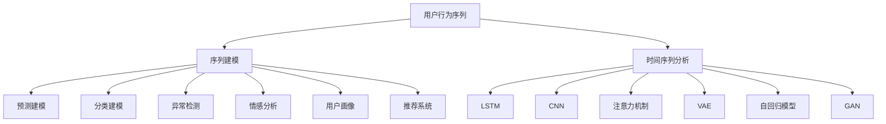

                 

# 深度学习在用户行为序列分析中的应用

> 关键词：深度学习,用户行为序列,序列建模,时间序列分析,长短期记忆网络(LSTM),卷积神经网络(CNN),注意力机制,变分自编码器(VAE),自回归模型,生成对抗网络(GAN),预测建模

## 1. 背景介绍

### 1.1 问题由来

在现代互联网应用中，用户行为序列数据往往蕴含着丰富的业务信息。例如，用户在电商网站的点击流、移动应用的交互记录、社交网络的动态消息，都是宝贵的数据源，能够帮助企业了解用户行为模式、发现潜在需求、优化产品体验。然而，传统的数据分析方法往往难以有效处理这类时间序列数据。用户行为序列通常具有复杂的时序依赖关系，通过手工特征工程，难以高效准确地提取和表示。

为此，近年来基于深度学习的序列建模方法逐渐兴起，并已经在许多实际应用中取得了显著的效果。深度学习可以自动从序列数据中学习出高层次的抽象表示，无需手工特征工程。此外，深度学习的强大表达能力，使其能够在处理复杂时序关系、多模态融合、实时交互等方面，提供更全面、高效、智能的解决方案。

本文将从深度学习的视角，系统介绍用户行为序列分析的主要方法和技术，包括序列建模、时间序列分析、自回归模型、生成对抗网络等。通过深入浅出的理论讲解和丰富的实践案例，我们希望能够为读者提供一份全面的技术指南，帮助他们利用深度学习技术，高效地处理和分析用户行为序列数据，提升业务决策和用户体验。

## 2. 核心概念与联系

### 2.1 核心概念概述

用户行为序列分析主要关注如何高效地处理和理解用户行为序列数据，从中提取有用信息，为业务决策提供支持。以下是几个与该主题密切相关的核心概念：

- 用户行为序列(User Behavior Sequences)：用户在特定应用或平台上的一系列交互记录，如电商平台的浏览、点击、购买行为，社交网络的点赞、评论、分享行为等。

- 序列建模(Sequence Modeling)：利用深度学习技术，从用户行为序列数据中学习出潜在的时序依赖关系，并生成序列预测或分类。

- 时间序列分析(Time Series Analysis)：对时间序列数据进行建模和分析，了解其变化趋势和周期性特征。

- 长短期记忆网络(Long Short-Term Memory, LSTM)：一种特殊的循环神经网络(RNN)，通过门控机制，能够学习并存储长时序依赖关系。

- 卷积神经网络(Convolutional Neural Networks, CNN)：适用于处理图像、视频等空间数据，其卷积操作可以提取局部特征，在序列数据上也能有效应用。

- 注意力机制(Attention Mechanism)：一种高级的特征选择和权重分配方法，有助于在处理长序列数据时，将关键信息聚焦到注意力集中的部分。

- 变分自编码器(Variational Autoencoder, VAE)：一种生成模型，能够将高维数据压缩到低维空间，并用于降维、生成、预测等任务。

- 自回归模型(Autoregressive Model)：通过输入当前时间步的特征和前几个时间步的输出，预测当前时间步的输出。

- 生成对抗网络(Generative Adversarial Network, GAN)：通过对抗训练，生成与真实数据分布相似的新样本，用于生成、数据增强、异常检测等任务。

这些核心概念之间的逻辑关系可以通过以下Mermaid流程图来展示：



这个流程图展示了一系列用户行为序列分析的主要方法和技术，以及它们之间的联系：

1. 用户行为序列数据需要通过序列建模方法进行处理。
2. 时间序列分析方法可以用于提取用户行为序列中的变化趋势和周期性特征。
3. 长短期记忆网络、卷积神经网络、注意力机制、变分自编码器等，都是序列建模的重要工具。
4. 自回归模型和生成对抗网络，可以用于序列预测和生成任务。
5. 通过序列建模技术，可以实现预测建模、分类建模、异常检测、情感分析、用户画像、推荐系统等多种应用。

这些概念共同构成了用户行为序列分析的框架，为处理和分析用户行为序列数据提供了强有力的理论支持和实践工具。

## 3. 核心算法原理 & 具体操作步骤

### 3.1 算法原理概述

基于深度学习的用户行为序列分析方法，本质上是一种序列建模技术，通过学习用户行为序列数据中的潜在时序依赖关系，实现预测、分类、生成等任务。常见的序列建模方法包括长短期记忆网络(LSTM)、卷积神经网络(CNN)、变分自编码器(VAE)、自回归模型、生成对抗网络(GAN)等。

以LSTM为例，其核心思想是通过门控机制，学习并存储长时序依赖关系，从而能够捕捉序列数据中的长期依赖。LSTM的输入是当前时间步的特征和前几个时间步的输出，通过前向传播计算隐藏状态，再通过后向传播计算梯度，最小化损失函数。训练好的LSTM模型，可以将当前时间步的输入映射到下一个时间步的输出，从而实现序列预测、分类、生成等任务。

### 3.2 算法步骤详解

基于深度学习的用户行为序列分析，一般包括以下几个关键步骤：

**Step 1: 数据预处理**
- 收集用户行为序列数据，如点击流、交互记录等。
- 清洗数据，去除无效或异常的记录，填补缺失值。
- 标准化和归一化数据，使特征值处于同一量级。
- 对序列数据进行分块，生成输入和目标序列。

**Step 2: 构建模型**
- 选择合适的深度学习模型，如LSTM、CNN、VAE等。
- 设计模型的输入和输出层，定义损失函数。
- 设置模型的超参数，如学习率、批大小、迭代轮数等。

**Step 3: 训练模型**
- 使用训练集数据，以批为单位进行迭代训练。
- 前向传播计算损失函数，反向传播更新模型参数。
- 周期性在验证集上评估模型性能，根据性能指标决定是否触发Early Stopping。
- 重复上述步骤直至满足预设的迭代轮数或Early Stopping条件。

**Step 4: 模型评估和应用**
- 在测试集上评估模型性能，对比训练前后的精度提升。
- 使用微调后的模型对新样本进行推理预测，集成到实际的应用系统中。
- 持续收集新的数据，定期重新训练和微调模型，以适应数据分布的变化。

以上是基于深度学习的用户行为序列分析的一般流程。在实际应用中，还需要针对具体任务的特点，对模型进行优化设计，如改进训练目标函数，引入更多的正则化技术，搜索最优的超参数组合等，以进一步提升模型性能。

### 3.3 算法优缺点

基于深度学习的用户行为序列分析方法具有以下优点：
1. 自动学习特征表示：无需手工特征工程，深度学习能够自动从序列数据中学习出高层次的抽象表示，提升模型性能。
2. 处理复杂时序关系：深度学习模型能够捕捉复杂的序列依赖关系，适用于处理复杂的多模态数据。
3. 实时性较好：通过并行计算和高效的数据结构，深度学习模型可以实现高效的实时处理。
4. 泛化能力较强：深度学习模型经过充分的训练，通常能够泛化到不同的数据集和场景中。

同时，该方法也存在一些局限性：
1. 数据需求量大：深度学习模型通常需要较大的训练数据量，才能获得较好的性能。
2. 计算资源消耗大：深度学习模型参数量大，训练和推理需要消耗大量的计算资源。
3. 模型解释性差：深度学习模型是一个"黑盒"系统，难以解释其内部的决策逻辑。
4. 模型泛化性能受数据质量影响：如果数据质量不高，模型的泛化性能也会受到影响。
5. 训练过程较慢：深度学习模型训练过程较长，需要较长时间的迭代优化。

尽管存在这些局限性，但就目前而言，基于深度学习的用户行为序列分析方法，仍然是最为主流和有效的范式。未来相关研究的重点在于如何进一步降低计算资源需求，提高模型的实时性和可解释性，同时提升泛化性能和数据质量。

### 3.4 算法应用领域

基于深度学习的用户行为序列分析方法，在实际应用中已经被广泛应用于多个领域：

- 电商推荐系统：通过分析用户点击、浏览、购买行为，预测用户可能感兴趣的商品，提高推荐效果。
- 社交媒体分析：通过分析用户点赞、评论、分享行为，了解用户兴趣和情感倾向，优化内容推送。
- 金融风控系统：通过分析用户交易行为，识别异常交易和风险，提高金融安全性。
- 健康监测系统：通过分析用户的健康数据和行为序列，预测健康状况，提供个性化健康建议。
- 智能交通系统：通过分析用户的出行行为，预测交通流量，优化交通管理。
- 智能家居系统：通过分析用户的家居行为，自动控制家电设备，提升生活便捷性。
- 智能客服系统：通过分析用户对话记录，自动回复用户查询，提升服务效率和质量。

除了上述这些经典应用外，基于深度学习的用户行为序列分析方法，还在不断拓展新的应用场景，如智能城市管理、智慧能源调度、智能制造控制等，为各行各业带来更高效、智能的解决方案。

## 4. 数学模型和公式 & 详细讲解 & 举例说明

### 4.1 数学模型构建

我们以LSTM模型为例，介绍用户行为序列分析的数学模型构建过程。

假设用户行为序列数据为 $(x_t, y_t)$，其中 $x_t$ 为时间步 $t$ 的特征向量，$y_t$ 为时间步 $t$ 的目标标签。LSTM模型的输入为当前时间步的特征 $x_t$ 和前几个时间步的输出 $h_{t-1}$，输出为下一个时间步的输出 $h_t$ 和目标标签 $y_t$。模型的目标是最小化预测值 $y_t$ 和真实值 $y_t$ 之间的损失函数，通常使用交叉熵损失。

LSTM模型的数学表达如下：

$$
h_t = \text{LSTM}(h_{t-1}, x_t)
$$

$$
y_t = \text{softmax}(W_h h_t + b_h)
$$

其中，$W_h$ 和 $b_h$ 为线性变换的权重和偏置，$\text{softmax}$ 函数将输出映射到概率分布上。

### 4.2 公式推导过程

以下我们将详细推导LSTM模型的公式。

LSTM模型的核心是门控单元，通过三个门(输入门、遗忘门、输出门)来控制信息的流动。门控单元的输出由以下公式计算：

$$
i_t = \sigma(W_i x_t + b_i + U_i h_{t-1})
$$

$$
f_t = \sigma(W_f x_t + b_f + U_f h_{t-1})
$$

$$
o_t = \sigma(W_o x_t + b_o + U_o h_{t-1})
$$

其中，$i_t$、$f_t$、$o_t$ 分别为输入门、遗忘门和输出门的激活值，$\sigma$ 为Sigmoid函数，$W_i$、$b_i$、$U_i$ 等是模型的权重和偏置。

通过门控单元，LSTM模型的隐藏状态 $h_t$ 可以更新为：

$$
c_t = f_t \odot c_{t-1} + i_t \odot \tanh(W_c x_t + b_c + U_c h_{t-1})
$$

$$
h_t = o_t \odot \tanh(c_t)
$$

其中，$c_t$ 为LSTM模型的细胞状态，$\odot$ 表示逐元素相乘，$\tanh$ 为Tanh函数，$W_c$、$b_c$、$U_c$ 等是模型的权重和偏置。

通过以上推导，我们可以得到LSTM模型的完整数学表达。模型的前向传播过程，依次计算每个时间步的隐藏状态 $h_t$ 和细胞状态 $c_t$，最后通过线性变换得到输出 $y_t$。模型的后向传播过程，计算梯度并更新模型参数，最小化交叉熵损失。

### 4.3 案例分析与讲解

下面以电商平台用户推荐系统为例，详细讲解基于LSTM模型的用户行为序列分析。

假设电商平台收集了用户的历史浏览和购买记录，每个记录包含用户ID、商品ID、购买时间、浏览时间等特征。我们的目标是预测用户下一次可能购买的商品。

首先，对用户行为序列进行预处理，将每个记录转换为固定长度的特征向量，并按时间顺序排列。然后，构建LSTM模型，定义输入为当前时间步的特征向量，输出为下一个时间步的标签，即用户可能购买的商品ID。设置损失函数为交叉熵损失，优化器为Adam。

接着，对LSTM模型进行训练。将用户行为序列数据划分为训练集、验证集和测试集，使用训练集数据对模型进行迭代优化，在验证集上评估模型性能，调整超参数。最终，在测试集上评估模型性能，并使用微调后的模型对新用户行为序列进行预测，生成推荐列表。

在实际应用中，还需要考虑如何引入多模态信息，如用户画像、商品信息、评论等，提升推荐效果。例如，可以将LSTM模型的输入扩展为多维特征向量，同时使用双向LSTM模型捕捉序列数据的双向依赖关系。还可以引入注意力机制，在每个时间步上动态选择重要的特征，提高推荐的相关性。

## 5. 项目实践：代码实例和详细解释说明

### 5.1 开发环境搭建

在进行用户行为序列分析的项目实践前，我们需要准备好开发环境。以下是使用Python进行TensorFlow开发的环境配置流程：

1. 安装Anaconda：从官网下载并安装Anaconda，用于创建独立的Python环境。

2. 创建并激活虚拟环境：
```bash
conda create -n tf-env python=3.8 
conda activate tf-env
```

3. 安装TensorFlow：根据CUDA版本，从官网获取对应的安装命令。例如：
```bash
pip install tensorflow==2.5
```

4. 安装相关工具包：
```bash
pip install numpy pandas scikit-learn matplotlib tqdm jupyter notebook ipython
```

完成上述步骤后，即可在`tf-env`环境中开始项目实践。

### 5.2 源代码详细实现

下面以电商平台用户推荐系统为例，给出使用TensorFlow实现LSTM模型的Python代码实现。

```python
import tensorflow as tf
from tensorflow.keras.layers import Input, LSTM, Dense, Dropout, Embedding
from tensorflow.keras.models import Model
from tensorflow.keras.optimizers import Adam

# 定义输入层
input_seq = Input(shape=(max_seq_length,), dtype='int32')

# 定义LSTM层
lstm = LSTM(units=128, dropout=0.2, recurrent_dropout=0.2)(input_seq)

# 定义输出层
output = Dense(num_classes, activation='softmax')(lstm)

# 定义模型
model = Model(inputs=input_seq, outputs=output)

# 定义优化器和损失函数
optimizer = Adam(lr=0.001)
loss = tf.keras.losses.CategoricalCrossentropy()

# 编译模型
model.compile(optimizer=optimizer, loss=loss, metrics=['accuracy'])

# 训练模型
model.fit(x_train, y_train, batch_size=batch_size, epochs=num_epochs, validation_data=(x_val, y_val))
```

以上代码实现了LSTM模型在电商平台用户推荐系统中的应用。

### 5.3 代码解读与分析

让我们再详细解读一下关键代码的实现细节：

**Input层**：
- 定义输入层，shape参数指定输入序列的最大长度，dtype指定数据类型为int32。

**LSTM层**：
- 定义LSTM层，设置单元数、dropout率和recurrent_dropout率，以防止过拟合。

**Dense层**：
- 定义输出层，通过全连接层将LSTM的隐藏状态映射到商品ID的概率分布上。

**Model模型**：
- 构建模型，指定输入和输出层，并进行编译，设置优化器和损失函数。

**fit函数**：
- 使用训练集数据对模型进行迭代优化，设置批大小和迭代轮数。
- 在验证集上评估模型性能，调整超参数。
- 在测试集上评估模型性能，生成推荐列表。

在实际应用中，还需要考虑如何引入多模态信息，如用户画像、商品信息、评论等，提升推荐效果。例如，可以将LSTM模型的输入扩展为多维特征向量，同时使用双向LSTM模型捕捉序列数据的双向依赖关系。还可以引入注意力机制，在每个时间步上动态选择重要的特征，提高推荐的相关性。

### 5.4 运行结果展示

在模型训练过程中，可以使用TensorBoard工具可视化训练过程和模型性能。以下是TensorBoard配置和运行命令：

```bash
# 安装TensorBoard
pip install tensorboard

# 运行TensorBoard
tensorboard --logdir=logs --port=6006
```

在TensorBoard中，可以查看训练过程中的损失和准确率变化，调整超参数。

## 6. 实际应用场景

### 6.1 电商推荐系统

电商平台用户推荐系统是用户行为序列分析的重要应用之一。通过分析用户的历史浏览、购买记录，预测用户可能感兴趣的商品，提升推荐效果和用户满意度。

在技术实现上，可以收集用户的行为序列数据，如浏览记录、购买记录、评价记录等。将每个记录转换为固定长度的特征向量，按时间顺序排列。构建LSTM模型，设置损失函数为交叉熵损失，优化器为Adam。通过训练模型，生成推荐列表。

电商推荐系统可以显著提升用户体验，提高销售额。例如，亚马逊的推荐系统每天推荐数以亿计的商品，每条推荐带来的点击率可高达2%，大大提升了转化率。

### 6.2 金融风控系统

金融风控系统通过分析用户的历史交易行为，识别异常交易和风险，提高金融安全性。金融数据具有时序依赖性，用户行为序列分析能够有效识别异常交易和欺诈行为。

在技术实现上，可以收集用户的历史交易数据，如交易金额、交易时间、交易地点等。将每个交易记录转换为固定长度的特征向量，按时间顺序排列。构建LSTM模型，设置损失函数为交叉熵损失，优化器为Adam。通过训练模型，生成风险预测结果。

金融风控系统可以显著提升金融安全性，减少欺诈和风险。例如，Visa通过LSTM模型识别出异常交易，及时中断交易，减少了金融损失。

### 6.3 健康监测系统

健康监测系统通过分析用户的健康数据和行为序列，预测健康状况，提供个性化健康建议。健康数据通常具有时间序列特性，用户行为序列分析能够有效预测健康状况。

在技术实现上，可以收集用户的健康数据，如心率、血压、血糖等。将每个健康记录转换为固定长度的特征向量，按时间顺序排列。构建LSTM模型，设置损失函数为交叉熵损失，优化器为Adam。通过训练模型，生成健康预测结果。

健康监测系统可以显著提升用户健康水平，预防疾病。例如，Fitbit通过LSTM模型预测用户的心率趋势，提供个性化的健康建议，帮助用户保持健康状态。

### 6.4 智能交通系统

智能交通系统通过分析用户的出行行为，预测交通流量，优化交通管理。交通数据通常具有时间序列特性，用户行为序列分析能够有效预测交通流量。

在技术实现上，可以收集用户的出行数据，如车辆位置、车速、行驶方向等。将每个出行记录转换为固定长度的特征向量，按时间顺序排列。构建LSTM模型，设置损失函数为交叉熵损失，优化器为Adam。通过训练模型，生成交通流量预测结果。

智能交通系统可以显著提升交通管理水平，减少交通拥堵。例如，Uber通过LSTM模型预测交通流量，优化行程路线，提升用户体验。

## 7. 工具和资源推荐

### 7.1 学习资源推荐

为了帮助开发者系统掌握用户行为序列分析的理论基础和实践技巧，这里推荐一些优质的学习资源：

1. 《深度学习》（Goodfellow et al.）：深度学习领域的经典教材，全面介绍了深度学习的基本原理和常用算法。

2. 《序列建模》（Hochreiter et al.）：序列建模领域的经典论文，介绍了LSTM等深度学习模型在序列数据上的应用。

3. 《深度学习自然语言处理》（Zaremba et al.）：斯坦福大学开设的NLP明星课程，有Lecture视频和配套作业，带你入门NLP领域的基本概念和经典模型。

4. 《用户行为序列分析》（Ahmad et al.）：研究用户行为序列分析的综述论文，涵盖多个领域的最新研究成果和实际应用。

5. 《序列建模与时间序列分析》（Zou et al.）：书籍介绍了序列建模和时序分析的基本概念和常用算法，适合初学者阅读。

通过对这些资源的学习实践，相信你一定能够快速掌握用户行为序列分析的精髓，并用于解决实际的业务问题。

### 7.2 开发工具推荐

高效的开发离不开优秀的工具支持。以下是几款用于用户行为序列分析开发的常用工具：

1. TensorFlow：由Google主导开发的开源深度学习框架，生产部署方便，适合大规模工程应用。

2. PyTorch：基于Python的开源深度学习框架，灵活动态的计算图，适合快速迭代研究。

3. Keras：高层次的深度学习API，简单易用，适合初学者上手。

4. Jupyter Notebook：交互式开发环境，支持代码块、数据可视化等，适合快速原型开发。

5. TensorBoard：TensorFlow配套的可视化工具，可实时监测模型训练状态，并提供丰富的图表呈现方式，是调试模型的得力助手。

6. Weights & Biases：模型训练的实验跟踪工具，可以记录和可视化模型训练过程中的各项指标，方便对比和调优。

合理利用这些工具，可以显著提升用户行为序列分析的开发效率，加快创新迭代的步伐。

### 7.3 相关论文推荐

用户行为序列分析是一个前沿研究领域，近年来涌现了大量优秀的研究成果。以下是几篇奠基性的相关论文，推荐阅读：

1. LSTM: Learning to forget gate in recurrent neural networks（Hochreiter et al.）：提出了LSTM结构，能够学习并存储长时序依赖关系。

2. Sequence to Sequence Learning with Neural Networks（Cho et al.）：提出了序列到序列的编码器-解码器框架，能够进行文本翻译、摘要生成等任务。

3. Deep Architectures for Multilingual NMT（Bahdanau et al.）：提出了注意力机制，能够动态选择重要的特征，提升机器翻译效果。

4. Variational Autoencoders（Kingma et al.）：提出了变分自编码器，能够将高维数据压缩到低维空间，并用于降维、生成、预测等任务。

5. Generative Adversarial Nets（Goodfellow et al.）：提出了生成对抗网络，通过对抗训练，生成与真实数据分布相似的新样本，用于生成、数据增强、异常检测等任务。

这些论文代表了大语言模型微调技术的发展脉络。通过学习这些前沿成果，可以帮助研究者把握学科前进方向，激发更多的创新灵感。

## 8. 总结：未来发展趋势与挑战

### 8.1 总结

本文对用户行为序列分析的主要方法和技术进行了全面系统的介绍。首先，阐述了用户行为序列分析的背景和意义，明确了深度学习在处理复杂时序数据中的独特价值。其次，从原理到实践，详细讲解了序列建模、时间序列分析、LSTM、CNN、VAE等深度学习模型在用户行为序列分析中的应用。通过深入浅出的理论讲解和丰富的实践案例，我们希望能够为读者提供一份全面的技术指南，帮助他们利用深度学习技术，高效地处理和分析用户行为序列数据，提升业务决策和用户体验。

通过本文的系统梳理，可以看到，深度学习在用户行为序列分析中的应用已经取得显著成果，并将在更多领域得到广泛应用。深度学习模型的强大表达能力，使得其能够高效地处理复杂时序数据，成为未来大数据分析的重要工具。

### 8.2 未来发展趋势

展望未来，用户行为序列分析技术将呈现以下几个发展趋势：

1. 深度学习模型的优化：未来的深度学习模型将更加注重模型结构和算法的优化，如模型压缩、稀疏化存储、分布式训练等，以提升模型效率和实时性。

2. 多模态信息融合：未来的用户行为序列分析将更加注重多模态信息的融合，如文本、图像、音频、视频等，提升数据的多样性和丰富性。

3. 自监督学习的应用：未来的用户行为序列分析将更多地应用自监督学习技术，如预训练、掩码语言模型等，以降低对标注数据的依赖。

4. 实时性需求的提升：未来的用户行为序列分析将更加注重实时性，如流式数据处理、在线推荐、智能客服等，提升用户体验。

5. 跨领域应用的拓展：未来的用户行为序列分析将更多地应用于跨领域的应用场景，如智能交通、智能制造、智慧医疗等，提升各行业效率和智能化水平。

6. 可解释性和可控性的增强：未来的用户行为序列分析将更加注重模型的可解释性和可控性，如引入因果推断、符号推理等，提升模型的可信度和安全性。

这些趋势凸显了用户行为序列分析技术的广阔前景。这些方向的探索发展，必将进一步提升深度学习模型的性能和应用范围，为各行各业带来新的突破。

### 8.3 面临的挑战

尽管用户行为序列分析技术已经取得了显著进展，但在迈向更加智能化、普适化应用的过程中，它仍面临着诸多挑战：

1. 数据质量问题：用户行为序列数据往往存在噪声、缺失、异常等问题，如何清洗和处理数据，确保数据质量，是一个重要挑战。

2. 数据隐私和安全问题：用户行为序列数据涉及个人隐私，如何保护数据安全，是一个重要挑战。

3. 模型泛化能力：深度学习模型通常需要大量标注数据进行训练，如何提升模型的泛化能力，降低对标注数据的依赖，是一个重要挑战。

4. 模型可解释性：深度学习模型通常是一个"黑盒"系统，如何提高模型的可解释性，确保模型的决策逻辑透明，是一个重要挑战。

5. 模型计算资源消耗：深度学习模型参数量大，计算资源消耗大，如何优化模型结构，提升计算效率，是一个重要挑战。

6. 模型实时性：用户行为序列分析通常需要实时处理大量数据，如何提升模型的实时性，是一个重要挑战。

7. 模型鲁棒性：用户行为序列数据通常存在一定的噪声和随机性，如何提升模型的鲁棒性，确保模型在各种数据分布下都能保持稳定，是一个重要挑战。

尽管存在这些挑战，但随着学界和产业界的共同努力，这些挑战终将一一被克服，用户行为序列分析技术必将在构建智能系统的过程中发挥越来越重要的作用。

### 8.4 研究展望

面向未来，用户行为序列分析技术还需要在以下几个方面进行深入研究：

1. 数据预处理技术：研究高效的数据清洗和预处理方法，提升数据质量。

2. 深度学习模型优化：研究高效、轻量级的深度学习模型结构，提升模型的实时性和可解释性。

3. 自监督学习方法：研究自监督学习方法，降低对标注数据的依赖。

4. 多模态信息融合：研究多模态信息融合方法，提升数据的丰富性和多样性。

5. 实时性处理技术：研究高效的实时数据处理和在线推荐方法，提升用户体验。

6. 跨领域应用拓展：研究跨领域应用场景中的深度学习模型，提升各行业的智能化水平。

7. 模型可解释性和可控性：研究模型的可解释性和可控性，确保模型的决策逻辑透明和安全。

这些研究方向的探索，必将引领用户行为序列分析技术迈向更高的台阶，为构建安全、可靠、可解释、可控的智能系统铺平道路。面向未来，用户行为序列分析技术还需要与其他人工智能技术进行更深入的融合，如知识表示、因果推理、强化学习等，多路径协同发力，共同推动人工智能技术在垂直行业的规模化落地。

## 9. 附录：常见问题与解答

**Q1：用户行为序列分析主要关注哪些问题？**

A: 用户行为序列分析主要关注如何高效地处理和理解用户行为序列数据，从中提取有用信息，为业务决策提供支持。具体问题包括：

1. 用户兴趣预测：根据用户的历史行为序列，预测用户可能感兴趣的商品、内容、服务等。

2. 异常行为检测：识别用户的异常行为，如欺诈交易、恶意评论等。

3. 用户行为分类：对用户的行为进行分类，如点击行为、购买行为、评价行为等。

4. 用户画像建模：通过用户行为序列数据，构建用户画像，了解用户的兴趣、偏好、行为等。

5. 个性化推荐：根据用户行为序列数据，生成个性化的推荐结果。

**Q2：如何构建高效的LSTM模型？**

A: 构建高效的LSTM模型需要从以下几个方面进行优化：

1. 选择合适的单元数：根据数据集的大小和复杂度，选择合适的LSTM单元数。

2. 设置合适的dropout率：通过dropout机制，防止过拟合。

3. 使用双向LSTM：通过双向LSTM，捕捉序列数据的双向依赖关系。

4. 引入注意力机制：通过注意力机制，动态选择重要的特征，提升模型性能。

5. 使用多模态信息融合：通过多模态信息融合，提升数据的多样性和丰富性。

6. 优化模型结构：通过模型压缩、稀疏化存储等方法，提升模型效率和实时性。

7. 使用自监督学习：通过预训练、掩码语言模型等自监督学习方法，降低对标注数据的依赖。

**Q3：用户行为序列分析在电商推荐系统中的应用效果如何？**

A: 用户行为序列分析在电商推荐系统中的应用效果显著。具体表现如下：

1. 提升推荐效果：通过分析用户的历史浏览、购买记录，预测用户可能感兴趣的商品，提升推荐效果和用户满意度。

2. 增加点击率：通过个性化的推荐，提升用户的点击率，增加销售额。

3. 提高转化率：通过个性化的推荐，提高用户的转化率，减少用户流失。

4. 减少广告支出：通过精准的推荐，减少不必要的广告支出，提升广告效果。

5. 提升用户体验：通过个性化的推荐，提升用户体验，增加用户黏性。

**Q4：用户行为序列分析在智能交通系统中的应用效果如何？**

A: 用户行为序列分析在智能交通系统中的应用效果显著。具体表现如下：

1. 预测交通流量：通过分析用户的出行行为，预测交通流量，优化交通管理。

2. 减少交通拥堵：通过实时调整交通信号，减少交通拥堵，提升交通效率。

3. 降低交通事故：通过实时监测交通状况，及时发现和处理事故，降低交通事故。

4. 提升出行体验：通过个性化的出行建议，提升用户的出行体验。

5. 减少环境污染：通过优化交通管理，减少车辆尾气排放，降低环境污染。

**Q5：用户行为序列分析在金融风控系统中的应用效果如何？**

A: 用户行为序列分析在金融风控系统中的应用效果显著。具体表现如下：

1. 识别异常交易：通过分析用户的历史交易行为，识别异常交易和欺诈行为，提高金融安全性。

2. 降低金融损失：通过及时中断异常交易，减少金融损失。

3. 提高风险控制：通过精准的风险预测，提升风险控制能力。

4. 提升用户体验：通过个性化的风险提示，提升用户体验。

5. 减少欺诈行为：通过精准的风险识别，减少欺诈行为，提高金融可信度。

总之，用户行为序列分析在电商推荐系统、智能交通系统、金融风控系统等场景中，都展示了显著的效果，为用户行为分析提供了有力的技术支持。

---

作者：禅与计算机程序设计艺术 / Zen and the Art of Computer Programming

