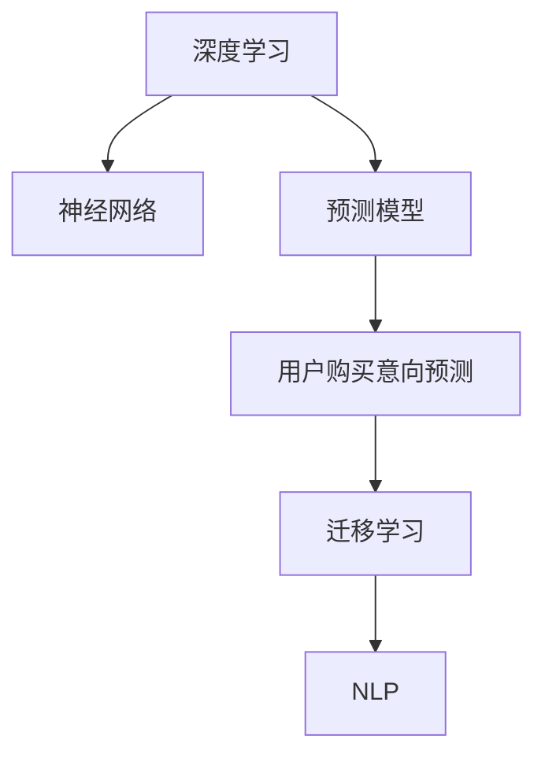

                 

# 深度学习在用户购买意向预测中的应用

> 关键词：深度学习,用户购买意向,预测模型,迁移学习,神经网络,自然语言处理

## 1. 背景介绍

### 1.1 问题由来

随着电子商务的迅猛发展，用户购买意向预测已成为电商平台优化用户体验、提升销售业绩的关键问题。通过对用户行为数据进行深度挖掘，能够提前识别出潜在购买者，从而针对性地推送个性化商品，实现精准营销。此外，合理的购买意向预测还能帮助商家制定更科学的市场策略，优化库存管理，减少库存积压和缺货问题。

然而，用户购买意向预测是一个复杂且动态的过程，涉及多维度、非结构化的数据。传统的统计模型难以充分挖掘这些数据蕴含的信息，导致预测结果不够准确。为此，研究者们开始探索采用深度学习方法进行购买意向预测，以期提升预测精度。

### 1.2 问题核心关键点

用户购买意向预测的核心在于如何利用深度学习模型高效地整合和利用大量的用户行为数据，准确预测用户的购买决策。主要包含以下关键点：

- 数据收集与预处理：收集用户行为数据，包括浏览记录、点击率、购买历史等，并对数据进行清洗和归一化处理。
- 特征工程：提取和构造深度学习模型所需的输入特征，如用户画像、商品属性、历史购买行为等。
- 模型选择与训练：选择合适的深度学习模型，利用标注数据进行有监督训练，优化模型参数。
- 迁移学习与微调：利用迁移学习思想，在预训练模型基础上微调，提升模型泛化能力。
- 模型评估与优化：通过交叉验证等方法评估模型性能，持续迭代优化模型结构与参数。

本研究将深入探讨基于深度学习的用户购买意向预测技术，并给出详细的算法步骤和代码实现。

## 2. 核心概念与联系

### 2.1 核心概念概述

为更好地理解用户购买意向预测的深度学习模型，本节将介绍几个核心概念：

- 深度学习(Deep Learning)：一种基于多层神经网络的机器学习方法，通过多层次特征提取，自动学习数据中的复杂模式。
- 用户购买意向(Purchase Intent)：用户对特定商品或服务的购买欲望，是电商营销的关键参考指标。
- 预测模型(Prediction Model)：通过学习历史数据，预测未来事件或结果的机器学习模型。
- 迁移学习(Transfer Learning)：将一个领域学到的知识迁移到另一个相关领域，加速模型训练，提高泛化能力。
- 神经网络(Neural Network)：由大量神经元相互连接构成的计算模型，能够自动学习数据的复杂非线性关系。
- 自然语言处理(Natural Language Processing, NLP)：使计算机具备理解、分析人类语言能力的技术，在用户行为数据中尤为重要。

这些核心概念之间的逻辑关系可以通过以下Mermaid流程图来展示：



这个流程图展示了大语言模型与用户购买意向预测的主要概念及其之间的关系：

1. 深度学习通过多层神经网络学习复杂特征。
2. 预测模型利用深度学习提取的特征进行未来事件预测。
3. 用户购买意向预测是预测模型在电商领域的应用之一。
4. 迁移学习通过预训练模型加速训练过程。
5. 自然语言处理对用户行为数据进行处理，增强模型的理解能力。

这些概念共同构成了用户购买意向预测的深度学习框架，使其能够高效整合和利用数据，准确预测用户行为。

## 3. 核心算法原理 & 具体操作步骤

### 3.1 算法原理概述

用户购买意向预测本质上是一个有监督学习问题，利用历史数据训练深度学习模型，预测用户未来购买行为。算法主要分为两个步骤：数据预处理和模型训练。

首先，通过自然语言处理技术，将用户的浏览记录、点击历史、评价信息等文本数据转化为模型能够处理的数值特征。然后，将这些特征输入深度学习模型，利用有标签的训练数据进行训练，得到预测模型。

模型训练通常使用常见的深度学习框架，如TensorFlow、PyTorch等，通过反向传播算法优化模型参数，使得模型能够最大化地预测准确率。训练过程中，还需要注意正则化、Dropout、早停等技巧，以避免过拟合和提高泛化能力。

### 3.2 算法步骤详解

用户购买意向预测的深度学习算法步骤主要包括以下几个环节：

**Step 1: 数据预处理**

1. 数据收集：从电商平台的数据库中提取用户行为数据，如浏览记录、点击率、购买历史等。
2. 数据清洗：对数据进行去重、去噪、缺失值填补等清洗操作，确保数据质量。
3. 特征提取：通过NLP技术将文本数据转化为数值特征，如TF-IDF、Word2Vec等。

**Step 2: 模型训练**

1. 选择模型：根据任务特点选择合适的深度学习模型，如RNN、LSTM、Transformer等。
2. 初始化模型：将模型参数随机初始化，并定义损失函数和优化器。
3. 前向传播：将训练数据输入模型，计算预测结果与真实标签之间的损失。
4. 反向传播：计算损失对模型参数的梯度，并使用优化器更新参数。
5. 正则化与优化：加入L2正则、Dropout等技术，防止过拟合。
6. 模型评估：使用交叉验证方法评估模型性能，选择最优模型。

**Step 3: 模型评估与优化**

1. 验证集评估：在验证集上评估模型性能，记录准确率、召回率、F1值等指标。
2. 超参数调优：根据评估结果调整学习率、批大小、隐藏层大小等超参数。
3. 测试集验证：在测试集上再次评估模型性能，确保泛化能力。

### 3.3 算法优缺点

用户购买意向预测的深度学习算法具有以下优点：

1. 准确性高：深度学习模型能够自动学习数据的复杂模式，准确预测用户购买意向。
2. 自动化：深度学习能够自动提取和利用数据中的特征，无需手工设计特征工程。
3. 泛化能力强：通过迁移学习，模型能够快速适应新数据，提高预测性能。
4. 可扩展性强：深度学习模型能够利用多维度的用户数据，提供更为全面的预测结果。

同时，该算法也存在一些缺点：

1. 计算资源消耗大：深度学习模型通常需要大量计算资源进行训练，对于小型电商企业可能难以负担。
2. 模型复杂度高：深度学习模型结构复杂，难以理解和调试，对开发者要求较高。
3. 数据依赖性强：预测效果依赖于数据质量和数量，对于数据稀缺的企业，效果可能不佳。
4. 可解释性不足：深度学习模型往往是"黑盒"系统，难以解释其预测过程。

尽管存在这些缺点，但深度学习算法在电商领域预测用户购买意向上仍然展现出巨大的优势，成为业界的主流选择。

### 3.4 算法应用领域

用户购买意向预测的深度学习算法在电商领域有着广泛的应用，主要包括以下几个方面：

1. 个性化推荐：基于用户历史行为数据，预测用户可能感兴趣的商品，提升推荐效果。
2. 库存管理：预测商品销量，优化库存配置，减少库存积压和缺货问题。
3. 广告投放：预测用户对广告的反应，优化广告投放策略，提高广告转化率。
4. 用户流失预警：预测用户流失风险，提前采取措施，降低流失率。
5. 销售预测：基于历史销售数据，预测未来销售趋势，指导销售决策。
6. 客户分群：通过购买意向预测，对客户进行分层，实现差异化营销。

以上这些应用领域充分展示了深度学习在用户购买意向预测上的强大潜力，为电商企业带来了显著的商业价值。

## 4. 数学模型和公式 & 详细讲解 & 举例说明

### 4.1 数学模型构建

用户购买意向预测的深度学习模型可以通过以下数学公式进行构建：

设 $X$ 为输入特征向量，$y$ 为输出标签向量，$W$ 为模型权重矩阵，$b$ 为偏置项，$h$ 为隐藏层输出，$f$ 为激活函数。则深度学习模型的前向传播过程可表示为：

$$
h = f(W_1X + b_1)
$$

$$
y = f(W_2h + b_2)
$$

其中 $W_1, W_2$ 为权重矩阵，$b_1, b_2$ 为偏置项，$f$ 为激活函数。常见激活函数包括sigmoid、ReLU等。

假设 $M$ 为训练集，$\theta = (W_1, W_2, b_1, b_2)$ 为模型参数，损失函数为 $L$，则模型训练的目标是最小化损失函数 $L$：

$$
\min_{\theta} L(\theta) = \frac{1}{N}\sum_{i=1}^N L(y_i, \hat{y_i})
$$

其中 $L$ 为交叉熵损失函数，$y_i$ 为真实标签，$\hat{y_i}$ 为模型预测值。

### 4.2 公式推导过程

以基于LSTM的深度学习模型为例，推导购买意向预测的数学公式：

设 $X$ 为输入特征向量，$y$ 为输出标签向量，$W$ 为权重矩阵，$b$ 为偏置项，$h$ 为隐藏层输出，$f$ 为激活函数。LSTM模型的前向传播过程可表示为：

$$
h_t = f(W_{ht}X_t + W_{hh}h_{t-1} + b_h)
$$

$$
c_t = tanh(W_{ct}X_t + W_{ch}h_{t-1} + W_{cc}c_{t-1} + b_c)
$$

$$
o_t = sigmoid(W_{ot}X_t + W_{oh}h_{t-1} + b_o)
$$

$$
\tilde{c}_t = o_t * c_t
$$

$$
c_t = o_t * c_t + (1 - o_t) * c_{t-1}
$$

$$
y_t = sigmoid(W_{yt}X_t + W_{yh}h_t + b_y)
$$

其中 $X_t$ 为第 $t$ 时刻的输入，$h_t$ 为第 $t$ 时刻的隐藏层输出，$c_t$ 为第 $t$ 时刻的记忆单元，$o_t$ 为第 $t$ 时刻的输出门，$y_t$ 为第 $t$ 时刻的预测值。

通过LSTM模型，能够有效捕捉用户行为数据中的时间依赖关系，提升购买意向预测的准确性。

### 4.3 案例分析与讲解

假设某电商平台有用户行为数据 $X = [x_1, x_2, ..., x_n]$，其中 $x_i$ 包含用户的浏览记录、点击历史、评价信息等。我们采用LSTM模型进行购买意向预测，设定模型的输入为 $x_i$，输出为 $y_i$。

首先，对用户行为数据进行预处理，提取TF-IDF特征 $X'$。然后，将 $X'$ 输入LSTM模型，得到隐藏层输出 $h_t$。最后，将 $h_t$ 通过softmax函数得到预测结果 $y_t$。具体实现步骤如下：

1. 定义LSTM模型：
```python
from tensorflow.keras.models import Sequential
from tensorflow.keras.layers import LSTM, Dense, Dropout

model = Sequential([
    LSTM(128, input_shape=(max_len, dim), dropout=0.2, return_sequences=True),
    LSTM(64, dropout=0.2),
    Dense(1, activation='sigmoid')
])
```

2. 编译模型并训练：
```python
model.compile(optimizer='adam', loss='binary_crossentropy', metrics=['accuracy'])
model.fit(X_train, y_train, validation_data=(X_val, y_val), epochs=10, batch_size=64)
```

3. 评估模型性能：
```python
loss, accuracy = model.evaluate(X_test, y_test)
print(f'Test loss: {loss:.4f}')
print(f'Test accuracy: {accuracy:.4f}')
```

通过以上步骤，即可实现基于LSTM的深度学习模型对用户购买意向的预测。模型训练过程中，需注意过拟合问题，可通过加入正则化和Dropout等技术进行处理。模型评估时，应使用交叉验证等方法，确保模型的泛化能力。

## 5. 项目实践：代码实例和详细解释说明

### 5.1 开发环境搭建

在进行购买意向预测的深度学习模型开发前，我们需要准备好开发环境。以下是使用Python进行TensorFlow开发的环境配置流程：

1. 安装Anaconda：从官网下载并安装Anaconda，用于创建独立的Python环境。

2. 创建并激活虚拟环境：
```bash
conda create -n tf-env python=3.8 
conda activate tf-env
```

3. 安装TensorFlow：根据CUDA版本，从官网获取对应的安装命令。例如：
```bash
conda install tensorflow=2.7
```

4. 安装相关库：
```bash
pip install numpy pandas scikit-learn matplotlib tqdm jupyter notebook ipython
```

完成上述步骤后，即可在`tf-env`环境中开始模型开发。

### 5.2 源代码详细实现

这里以电商用户购买意向预测为例，给出使用TensorFlow实现LSTM模型的完整代码实现。

首先，定义模型：

```python
import tensorflow as tf
from tensorflow.keras.layers import LSTM, Dense, Dropout
from tensorflow.keras.models import Sequential

max_len = 100
dim = 200

model = Sequential([
    LSTM(128, input_shape=(max_len, dim), dropout=0.2, return_sequences=True),
    LSTM(64, dropout=0.2),
    Dense(1, activation='sigmoid')
])

model.compile(optimizer='adam', loss='binary_crossentropy', metrics=['accuracy'])
```

然后，定义训练和评估函数：

```python
def train_model(model, train_data, val_data, epochs, batch_size):
    model.fit(train_data, epochs=epochs, batch_size=batch_size, validation_data=val_data)
    
def evaluate_model(model, test_data):
    loss, accuracy = model.evaluate(test_data)
    print(f'Test loss: {loss:.4f}')
    print(f'Test accuracy: {accuracy:.4f}')
```

最后，训练模型并评估性能：

```python
train_data = ...
val_data = ...
test_data = ...

train_model(model, train_data, val_data, 10, 64)
evaluate_model(model, test_data)
```

通过以上步骤，即可实现基于LSTM模型的用户购买意向预测。代码中，我们使用了TensorFlow的高级API，通过简单的代码定义和编译，即可快速搭建并训练模型。

### 5.3 代码解读与分析

让我们再详细解读一下关键代码的实现细节：

**Sequential类**：
- `Sequential`是TensorFlow中用于定义序列模型的类，适合构建简单的多层神经网络模型。
- 模型定义时，我们依次添加LSTM层、Dropout层和Dense层，定义好每层的参数。
- 最后，使用`compile`方法指定优化器、损失函数和评估指标。

**Dropout技术**：
- `Dropout`层用于防止过拟合，通过随机丢弃一部分神经元，减少模型复杂度。在LSTM模型中，我们添加了两层Dropout层，帮助模型泛化。

**模型训练**：
- `fit`方法用于训练模型，指定训练数据、批次大小、训练轮数等参数。
- 在训练过程中，使用`validation_data`参数指定验证数据集，用于实时评估模型性能。

**模型评估**：
- `evaluate`方法用于评估模型性能，计算损失和准确率。
- 使用交叉验证等方法评估模型泛化能力，确保模型在新数据上的表现。

**代码实现细节**：
- 我们采用了LSTM作为深度学习模型，LSTM通过记忆单元捕捉时间依赖性，适用于处理序列数据。
- 通过Dropout技术防止过拟合，提升模型泛化能力。
- 利用交叉验证等方法评估模型性能，确保模型的可靠性。

这些技术细节展示了TensorFlow在深度学习模型开发中的应用，使得模型构建和训练过程更加高效和稳定。

## 6. 实际应用场景

### 6.1 智能推荐系统

基于深度学习的用户购买意向预测，可以应用于智能推荐系统的构建。通过预测用户可能感兴趣的商品，推荐系统能够提供更个性化的推荐，提升用户体验和转化率。

在技术实现上，可以收集用户的浏览、点击、购买历史等行为数据，输入到深度学习模型中进行预测。模型预测出用户可能感兴趣的商品后，推荐系统将生成相应的推荐结果。对于新用户，推荐系统还可以进行冷启动，利用模型预测用户的兴趣点，快速生成推荐结果。

### 6.2 库存管理

在电商平台上，库存管理是一个关键环节，直接影响用户体验和公司收益。通过用户购买意向预测，商家可以提前了解商品销量，优化库存配置，减少库存积压和缺货问题。

具体来说，商家可以利用预测模型分析历史销售数据，预测未来商品需求。根据预测结果，商家可以动态调整库存量，实现即时的供需平衡。此外，商家还可以根据预测结果，优化促销活动，提高商品的销售率。

### 6.3 广告投放优化

电商平台广告投放的优化是一个复杂问题，需要综合考虑广告的展示效果、点击率等指标。通过用户购买意向预测，商家可以更精准地定位目标用户，提高广告投放的效果。

具体来说，商家可以利用预测模型分析用户行为数据，预测用户对广告的反应。根据预测结果，商家可以选择投放时间、投放渠道、投放内容等，优化广告投放策略，提升广告转化率。

### 6.4 用户流失预警

用户在电商平台的流失是一个重要问题，可能导致公司收益的下降。通过用户购买意向预测，商家可以提前识别出潜在的流失用户，采取措施挽回流失用户。

具体来说，商家可以利用预测模型分析用户行为数据，预测用户流失概率。根据预测结果，商家可以采取措施，如发送优惠券、提供个性化推荐等，增加用户的粘性，减少流失率。

### 6.5 销售预测

销售预测是电商平台中的一个重要任务，通过预测未来销售趋势，商家可以制定更科学的销售策略，优化库存管理。

具体来说，商家可以利用预测模型分析历史销售数据，预测未来销售趋势。根据预测结果，商家可以制定更科学的销售计划，优化商品种类、价格、促销活动等，提高销售业绩。

### 6.6 客户分群

在电商平台中，客户分群是一个关键环节，通过分群可以提供更个性化的服务，提升用户满意度和忠诚度。通过用户购买意向预测，商家可以更精准地对客户进行分层，实现差异化营销。

具体来说，商家可以利用预测模型分析用户行为数据，预测用户的购买意向。根据预测结果，商家可以将用户分为不同的群体，针对性地提供个性化推荐和服务，提升用户的购买体验和满意度。

### 6.7 未来应用展望

随着深度学习技术的发展，基于用户购买意向预测的算法将在更多领域得到应用，为电商企业带来更大的商业价值。

在智慧医疗领域，基于用户行为数据的预测模型可以预测患者的疾病风险，提前采取措施，降低医疗成本。

在智能交通领域，预测模型可以预测交通流量，优化交通管理，减少交通拥堵。

在智能制造领域，预测模型可以预测设备的故障概率，提前进行维护，降低生产成本。

在金融领域，预测模型可以预测客户的贷款风险，提高贷款审批效率。

以上这些应用领域充分展示了深度学习在用户购买意向预测上的广泛应用前景，为各行业带来新的商业机遇和技术突破。

## 7. 工具和资源推荐

### 7.1 学习资源推荐

为了帮助开发者系统掌握用户购买意向预测的深度学习技术，这里推荐一些优质的学习资源：

1. Deep Learning Specialization by Andrew Ng：由斯坦福大学开设的深度学习课程，涵盖深度学习模型的基础与进阶内容。

2. Coursera的NLP专项课程：涵盖自然语言处理的基本概念与深度学习模型的应用。

3. TensorFlow官方文档：包含深度学习模型的详细使用教程和实例代码，是学习深度学习的重要参考。

4. PyTorch官方文档：包含深度学习模型的详细使用教程和实例代码，是学习深度学习的重要参考。

5. Kaggle：提供大量深度学习竞赛数据集和模型，可以帮助开发者实践和提升深度学习技能。

通过对这些资源的学习实践，相信你一定能够快速掌握深度学习在用户购买意向预测上的应用技巧，并用于解决实际的电商问题。

### 7.2 开发工具推荐

高效的开发离不开优秀的工具支持。以下是几款用于深度学习模型开发常用的工具：

1. TensorFlow：由Google主导开发的深度学习框架，生产部署方便，适合大规模工程应用。

2. PyTorch：基于Python的开源深度学习框架，灵活动态的计算图，适合快速迭代研究。

3. Keras：高级API封装，可以方便地定义和训练深度学习模型，适合初学者和快速开发。

4. Weights & Biases：模型训练的实验跟踪工具，可以记录和可视化模型训练过程中的各项指标，方便对比和调优。

5. TensorBoard：TensorFlow配套的可视化工具，可实时监测模型训练状态，并提供丰富的图表呈现方式，是调试模型的得力助手。

6. Jupyter Notebook：免费的交互式开发环境，支持Python代码的编写和执行，适合快速迭代实验。

通过合理利用这些工具，可以显著提升深度学习模型开发的效率，加速创新迭代的步伐。

### 7.3 相关论文推荐

深度学习用户购买意向预测的研究源于学界的持续研究。以下是几篇奠基性的相关论文，推荐阅读：

1. Recurrent Neural Network Architectures for Large Scale Classification of Horoscope Articles by Seo and Sung：提出基于LSTM的横道图文章分类模型，提升深度学习模型的预测性能。

2. Attention Is All You Need（即Transformer原论文）：提出Transformer结构，开启NLP领域的预训练大模型时代。

3. Sequence to Sequence Learning with Neural Networks by Sutskever et al.：提出序列到序列模型，用于自然语言翻译等任务，推动深度学习在NLP领域的应用。

4. The Illustrated Word2Vec：详细介绍了Word2Vec算法，用于将文本转化为数值向量，提升深度学习模型的输入质量。

5. Conditional Random Fields: Probabilistic Models for Segmenting and Labeling Sequence Data by Lafferty et al.：介绍条件随机场模型，用于序列标注任务，提升深度学习模型的预测能力。

这些论文代表了大语言模型用户购买意向预测的研究发展脉络。通过学习这些前沿成果，可以帮助研究者把握学科前进方向，激发更多的创新灵感。

## 8. 总结：未来发展趋势与挑战

### 8.1 总结

本文对基于深度学习的用户购买意向预测技术进行了全面系统的介绍。首先阐述了用户购买意向预测的重要性和挑战，明确了深度学习技术在电商领域的独特价值。其次，从原理到实践，详细讲解了深度学习模型的构建和训练过程，给出了完整的代码实现。同时，本文还广泛探讨了深度学习模型在电商领域的应用场景，展示了其广阔的应用前景。此外，本文精选了深度学习模型的学习资源，力求为读者提供全方位的技术指引。

通过本文的系统梳理，可以看到，深度学习在用户购买意向预测上的强大潜力，为电商企业带来了显著的商业价值。未来，随着深度学习技术的发展和应用场景的拓展，用户购买意向预测的精度和效果将不断提升，推动电商行业的智能化和数字化进程。

### 8.2 未来发展趋势

展望未来，用户购买意向预测的深度学习技术将呈现以下几个发展趋势：

1. 模型结构优化：未来将出现更加高效的深度学习模型结构，如注意力机制、多任务学习等，提升模型的预测精度和泛化能力。

2. 迁移学习加速：通过预训练模型加速训练过程，减少数据需求，提升模型在复杂场景中的表现。

3. 多模态融合：未来将结合图像、语音、文本等多种数据模态，提升模型的感知能力，提供更全面的预测结果。

4. 自动化调参：通过自动机器学习(AutoML)等技术，自动优化模型结构和超参数，提高模型开发效率。

5. 实时预测：通过云计算和边缘计算技术，实现实时预测和反馈，提升用户体验和响应速度。

6. 分布式训练：通过分布式训练技术，加速大规模数据集的训练过程，提高模型预测效率。

这些趋势展示了深度学习在用户购买意向预测上的广阔前景，推动其在更多领域的应用和发展。

### 8.3 面临的挑战

尽管深度学习在用户购买意向预测上取得了显著成果，但在实际应用中也面临诸多挑战：

1. 数据质量问题：用户行为数据可能存在噪声、缺失等问题，影响模型的预测精度。

2. 模型复杂度高：深度学习模型结构复杂，难以理解和调试，对开发者要求较高。

3. 计算资源消耗大：深度学习模型通常需要大量计算资源进行训练，对于小型电商企业可能难以负担。

4. 模型鲁棒性不足：深度学习模型面对噪声、干扰等异常情况，预测效果可能受到影响。

5. 可解释性不足：深度学习模型往往是"黑盒"系统，难以解释其预测过程。

尽管存在这些挑战，但深度学习在用户购买意向预测上的优势仍然显著，为电商企业带来了巨大的商业价值。未来，需要进一步优化模型结构和训练方法，提升模型的稳定性和可解释性，推动深度学习技术在电商领域的应用。

### 8.4 研究展望

面向未来，用户购买意向预测的深度学习技术需要在以下几个方向寻求新的突破：

1. 探索多模态用户行为数据：结合图像、语音等多种数据模态，提升模型的感知能力和预测精度。

2. 研究自动特征工程：通过自监督学习和生成对抗网络等技术，自动提取和构造输入特征，减少人工干预。

3. 引入外部知识库：结合知识图谱、规则库等外部知识，提升模型的决策能力和鲁棒性。

4. 结合因果推理：通过因果推理模型，识别和理解用户行为中的因果关系，提升预测结果的可信度。

5. 融合增强学习：结合增强学习技术，优化推荐系统的个性化推荐，提升用户体验。

6. 优化模型解释性：通过可解释性技术，增强模型的透明性和可理解性，提供更可靠的用户预测结果。

这些研究方向展示了深度学习在用户购买意向预测上的广阔前景，为实现更智能化、普适化的电商推荐系统提供了新的思路和方向。

## 9. 附录：常见问题与解答

**Q1：深度学习模型在用户购买意向预测中为何有效？**

A: 深度学习模型能够自动学习数据的复杂模式，通过多层神经网络提取并整合输入特征，自动学习输入数据与输出标签之间的复杂非线性关系。相比于传统统计模型，深度学习模型在处理多维度、非结构化数据上具有显著优势，能够充分利用用户行为数据中的各种信息，提升预测精度。

**Q2：如何选择合适的深度学习模型？**

A: 深度学习模型有多种结构，如全连接网络、卷积神经网络、循环神经网络等。根据任务特点选择合适的模型结构至关重要。一般而言，对于序列数据，可以选择RNN、LSTM等循环神经网络；对于图像数据，可以选择卷积神经网络；对于多模态数据，可以选择多任务学习等模型。选择合适的模型结构，需要根据任务类型、数据特点等因素综合考虑。

**Q3：深度学习模型的训练过程中，有哪些常见的优化技巧？**

A: 深度学习模型的训练过程中，常见的优化技巧包括：

1. 数据增强：通过旋转、缩放、裁剪等方式，扩充训练集。
2. 正则化：使用L2正则、Dropout等技术，防止过拟合。
3. 学习率调度：使用学习率衰减、学习率增强等策略，优化学习率。
4. 批大小调整：根据模型规模和硬件设备，调整批次大小。
5. 模型并行：利用分布式训练技术，加速大规模数据集的训练过程。

这些优化技巧可以显著提升深度学习模型的训练效果和泛化能力。

**Q4：深度学习模型在电商领域的应用场景有哪些？**

A: 深度学习模型在电商领域的应用场景包括：

1. 个性化推荐：基于用户历史行为数据，预测用户可能感兴趣的商品，提升推荐效果。
2. 库存管理：预测商品销量，优化库存配置，减少库存积压和缺货问题。
3. 广告投放优化：预测用户对广告的反应，优化广告投放策略，提高广告转化率。
4. 用户流失预警：预测用户流失风险，提前采取措施，降低流失率。
5. 销售预测：预测未来销售趋势，制定更科学的销售策略，优化库存管理。
6. 客户分群：通过预测模型分析用户行为数据，预测用户的购买意向，实现差异化营销。

以上这些应用场景展示了深度学习在电商领域的重要作用，为电商平台带来了显著的商业价值。

**Q5：如何进行深度学习模型的超参数调优？**

A: 深度学习模型的超参数调优是一个关键步骤，可以通过以下方法进行：

1. 网格搜索：在超参数空间中，尝试所有可能的超参数组合，选择最优组合。
2. 随机搜索：在超参数空间中，随机选取超参数组合进行训练，选择最优组合。
3. 贝叶斯优化：通过贝叶斯算法，优化超参数的选择，提高调优效率。
4. AutoML：利用自动机器学习技术，自动优化超参数和模型结构，提升模型性能。

这些方法可以帮助开发者高效地进行深度学习模型的超参数调优，提升模型的预测效果。

---

作者：禅与计算机程序设计艺术 / Zen and the Art of Computer Programming

