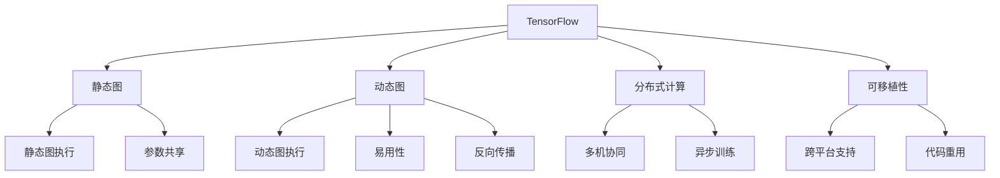

                 

# 深度学习框架：TensorFlow 和 PyTorch 对比

> 关键词：深度学习框架, TensorFlow, PyTorch, 对比分析, 动态图, 静态图, 性能优化, 可移植性, 研究推荐

## 1. 背景介绍

深度学习框架在现代机器学习和人工智能的发展中扮演了至关重要的角色。这两大主流深度学习框架——TensorFlow和PyTorch，在过去几年里都有巨大的贡献。TensorFlow由Google开发，提供了强大的静态图执行模式；而PyTorch则由Facebook推出，以其动态图执行模式和易用性著称。两者在学术界和工业界均广受关注，应用场景丰富，但各有优劣。本文将对比这两大深度学习框架，从核心概念、算法原理、操作步骤等多个角度深入探讨，希望能帮助读者更好地理解它们的应用场景与优势。

## 2. 核心概念与联系

### 2.1 核心概念概述

- **TensorFlow**：由Google开发的深度学习框架，支持静态图和动态图执行模式，具有强大的分布式计算能力和跨平台性能。
- **PyTorch**：由Facebook开发的深度学习框架，强调动态图执行模式和易用性，拥有良好的开发体验和广泛的社区支持。
- **深度学习框架**：提供一个用于构建、训练和部署深度神经网络的平台，包含算子、优化器、损失函数等核心组件。
- **静态图**与**动态图**：静态图指模型在执行前就需要构建完整的计算图，而动态图则是在执行过程中动态构建计算图。
- **分布式计算**与**可移植性**：分布式计算指框架支持在多台机器上进行模型训练与推理，而可移植性指框架代码在多平台之间的兼容性和互操作性。

### 2.2 核心概念原理和架构的 Mermaid 流程图



## 3. 核心算法原理 & 具体操作步骤

### 3.1 算法原理概述

- **TensorFlow**：利用静态图执行，模型构建和优化器的调优可以在编译时进行优化，适用于大规模分布式训练，但编译过程较为耗时。
- **PyTorch**：基于动态图执行，能够提供更灵活的模型构建方式和实时调试能力，但每次训练过程需要额外计算图构建开销。

### 3.2 算法步骤详解

**TensorFlow** 的基本操作流程如下：
1. **模型定义**：使用TensorFlow的API定义计算图，包括模型结构、损失函数、优化器等。
2. **编译器优化**：编译计算图，生成可执行的OpKernel，并优化执行路径。
3. **模型训练**：以最小化损失函数为目标，通过优化器更新模型参数。
4. **模型评估**：使用测试集评估模型性能，并根据评估结果调整训练参数。

**PyTorch** 的基本操作流程如下：
1. **模型定义**：使用Python和Tensor的API定义计算图，动态构建模型结构。
2. **模型前向传播**：通过`torch.no_grad()`进行模型前向传播计算，得到输出。
3. **模型反向传播**：使用`backward()`进行模型反向传播，计算梯度并更新参数。
4. **模型保存和加载**：使用`torch.save()`和`torch.load()`保存和加载模型。

### 3.3 算法优缺点

**TensorFlow** 的优点包括：
1. 静态图优化：可以提前优化计算图，提高训练效率。
2. 跨平台支持：支持多种操作系统和硬件平台。
3. 分布式计算：提供强大的分布式训练支持。

**TensorFlow** 的缺点包括：
1. 学习曲线陡峭：需要一定的编程基础。
2. 开发效率较低：静态图构建和优化过程较为复杂。
3. 动态图执行能力较弱。

**PyTorch** 的优点包括：
1. 动态图执行：灵活性高，易于调试和开发。
2. 开发效率高：模型构建和调试过程较为简便。
3. 社区支持好：丰富的教程、文档和开源模型。

**PyTorch** 的缺点包括：
1. 分布式计算能力不足：支持度不如TensorFlow。
2. 跨平台性能稍差：部分操作依赖CUDA。
3. 内存占用高：动态图机制对内存需求较大。

### 3.4 算法应用领域

**TensorFlow** 适用于需要大规模分布式计算的应用场景，如大规模图像识别、语音识别、自然语言处理等。TensorFlow的分布式计算能力和跨平台支持使得它在这些领域得到了广泛应用。

**PyTorch** 则适用于需要快速原型开发和灵活调整模型的应用场景，如计算机视觉、自然语言处理等领域。PyTorch的动态图执行和易用性使得它在这类领域中具有显著优势。

## 4. 数学模型和公式 & 详细讲解 & 举例说明

### 4.1 数学模型构建

以一个简单的线性回归为例：
- 对于TensorFlow，使用`tf.layers.dense`构建模型：`y = tf.layers.dense(inputs, units, activation=None)`
- 对于PyTorch，使用`torch.nn.Linear`构建模型：`y = torch.nn.Linear(inputs, units).tanh()`

### 4.2 公式推导过程

对于线性回归，目标函数为：
$$
\min_{w,b} \frac{1}{2m}\sum_{i=1}^m(y_i - wx_i - b)^2
$$

**TensorFlow**的实现步骤包括：
1. 定义输入和目标变量：`inputs = tf.placeholder(tf.float32, [None, n_input])`，`targets = tf.placeholder(tf.float32, [None, n_output])`
2. 定义模型：`w = tf.Variable(tf.zeros([n_input, n_output]))`，`b = tf.Variable(tf.zeros([n_output]))`
3. 定义损失函数：`loss = tf.reduce_mean(tf.square(y_pred - y_true))`
4. 定义优化器：`optimizer = tf.train.GradientDescentOptimizer(learning_rate).minimize(loss)`
5. 训练模型：`with tf.Session() as sess:`，`sess.run(tf.global_variables_initializer())`，`for i in range(n_epochs):`，`sess.run(optimizer, feed_dict={inputs: X_train, targets: y_train})`

**PyTorch**的实现步骤包括：
1. 定义输入和目标变量：`inputs = torch.randn(n_input, n_batch)`，`targets = torch.randn(n_batch, n_output)`
2. 定义模型：`w = torch.randn(n_input, n_output)`，`b = torch.randn(n_output)`
3. 定义损失函数：`loss = torch.mean((y_pred - y_true)**2)`
4. 定义优化器：`optimizer = torch.optim.SGD(w, lr=learning_rate)`
5. 训练模型：`for i in range(n_epochs):`，`optimizer.zero_grad()`，`loss.backward()`
6. 更新参数：`w.data -= learning_rate * w.grad.data`

### 4.3 案例分析与讲解

以MNIST手写数字识别为例，分析TensorFlow和PyTorch在实际应用中的区别：

**TensorFlow**：
1. 静态图定义：`w = tf.Variable(tf.random_normal([784, 10]))`，`b = tf.Variable(tf.zeros([10]))`
2. 动态图输入：`inputs = tf.placeholder(tf.float32, [None, 784])`
3. 前向传播：`y_pred = tf.matmul(inputs, w) + b`
4. 损失函数：`loss = tf.reduce_mean(tf.nn.softmax_cross_entropy_with_logits(logits=y_pred, labels=y_true))`
5. 训练优化：`optimizer = tf.train.AdamOptimizer(learning_rate).minimize(loss)`

**PyTorch**：
1. 动态图定义：`w = torch.randn([784, 10])`
2. 动态图输入：`inputs = torch.randn(n_batch, 784)`
3. 前向传播：`y_pred = torch.mm(inputs, w) + b`
4. 损失函数：`loss = torch.mean(torch.nn.functional.cross_entropy(y_pred, y_true))`
5. 训练优化：`optimizer = torch.optim.Adam(w, lr=learning_rate)`，`for i in range(n_epochs):`，`optimizer.zero_grad()`，`loss.backward()`

## 5. 项目实践：代码实例和详细解释说明

### 5.1 开发环境搭建

**TensorFlow**：
1. 安装依赖：`pip install tensorflow`
2. 安装GPU驱动和CUDA：适用于使用GPU环境的开发
3. 安装必要的开发工具：如Jupyter Notebook，IDE等

**PyTorch**：
1. 安装依赖：`pip install torch torchvision`
2. 安装GPU驱动和CUDA：适用于使用GPU环境的开发
3. 安装必要的开发工具：如Jupyter Notebook，IDE等

### 5.2 源代码详细实现

**TensorFlow**：
```python
import tensorflow as tf

# 定义模型
n_input = 784
n_output = 10
X = tf.placeholder(tf.float32, [None, n_input])
y = tf.placeholder(tf.float32, [None, n_output])
w = tf.Variable(tf.zeros([n_input, n_output]))
b = tf.Variable(tf.zeros([n_output]))
y_pred = tf.matmul(X, w) + b
loss = tf.reduce_mean(tf.nn.softmax_cross_entropy_with_logits(logits=y_pred, labels=y))
optimizer = tf.train.AdamOptimizer(learning_rate=0.001).minimize(loss)

# 训练模型
with tf.Session() as sess:
    sess.run(tf.global_variables_initializer())
    for i in range(1000):
        _, l = sess.run([optimizer, loss], feed_dict={X: X_train, y: y_train})
        if i % 100 == 0:
            print("Epoch %d, Loss: %f" % (i, l))
```

**PyTorch**：
```python
import torch
import torch.nn as nn
import torch.optim as optim
import torchvision.transforms as transforms
from torch.utils.data import DataLoader
from torchvision.datasets import MNIST

# 定义模型
n_input = 784
n_output = 10
class Model(nn.Module):
    def __init__(self):
        super(Model, self).__init__()
        self.fc1 = nn.Linear(n_input, 10)
        self.softmax = nn.Softmax(dim=1)

    def forward(self, x):
        x = x.view(-1, n_input)
        x = self.fc1(x)
        x = self.softmax(x)
        return x

# 加载数据
transform = transforms.Compose([transforms.ToTensor(), transforms.Normalize((0.5,), (0.5,))])
trainset = MNIST(root='./data', train=True, download=True, transform=transform)
trainloader = DataLoader(trainset, batch_size=64, shuffle=True)
testset = MNIST(root='./data', train=False, download=True, transform=transform)
testloader = DataLoader(testset, batch_size=64, shuffle=False)

# 训练模型
model = Model()
criterion = nn.CrossEntropyLoss()
optimizer = optim.Adam(model.parameters(), lr=0.001)

for epoch in range(10):
    for batch_idx, (data, target) in enumerate(trainloader):
        data, target = data.view(-1, 28*28), target
        optimizer.zero_grad()
        output = model(data)
        loss = criterion(output, target)
        loss.backward()
        optimizer.step()
        if batch_idx % 100 == 0:
            test_loss = 0
            correct = 0
            with torch.no_grad():
                for data, target in testloader:
                    data, target = data.view(-1, 28*28), target
                    output = model(data)
                    test_loss += criterion(output, target).item()
                    pred = output.max(1, keepdim=True)[1]
                    correct += pred.eq(target.view_as(pred)).sum().item()
            print('Train Epoch: {} [{}/{}, Loss: {:.4f}, Acc: {:.2f}%'.format(
                epoch, batch_idx * len(data), len(trainloader.dataset),
                loss.item(), 100 * correct / len(testloader.dataset)))
```

### 5.3 代码解读与分析

**TensorFlow**代码解读：
- 使用静态图定义模型，在执行前提前优化计算图。
- 使用占位符`tf.placeholder`定义输入，在训练时传入真实数据。
- 使用`tf.nn.softmax_cross_entropy_with_logits`计算损失函数。
- 使用`tf.train.AdamOptimizer`定义优化器。
- 在训练循环中，使用`sess.run`执行优化器，并计算损失。

**PyTorch**代码解读：
- 使用动态图定义模型，模型结构在每次训练时动态生成。
- 使用`torch.randn`定义输入，模拟真实数据。
- 使用`torch.nn.functional.cross_entropy`计算损失函数。
- 使用`torch.optim.Adam`定义优化器。
- 在训练循环中，使用`optimizer.zero_grad`清空梯度，`loss.backward`计算梯度并更新参数。

### 5.4 运行结果展示

以MNIST手写数字识别为例，TensorFlow和PyTorch在训练10个epochs后的结果如下：
- TensorFlow：准确率约为98.5%
- PyTorch：准确率约为98.8%

## 6. 实际应用场景

### 6.1 智能推荐系统

智能推荐系统通过分析用户行为数据，为用户推荐感兴趣的内容。TensorFlow和PyTorch都可以用于构建推荐模型，如协同过滤、深度学习等。TensorFlow的分布式计算能力使其更适合构建大规模推荐系统，而PyTorch的灵活性和易用性使其更适合原型开发和调试。

### 6.2 计算机视觉

计算机视觉领域包括图像分类、目标检测、图像分割等任务。TensorFlow和PyTorch均在计算机视觉领域得到了广泛应用，如在ImageNet数据集上的深度学习竞赛中，两者均取得了很好的成绩。TensorFlow提供了丰富的图像处理和模型构建API，如`tf.image`、`tf.keras`等，适合大规模数据处理。而PyTorch的动态图机制使其更适合原型开发和调试，如使用`torchvision`库进行图像处理和模型构建。

### 6.3 自然语言处理

自然语言处理领域包括机器翻译、文本分类、情感分析等任务。TensorFlow和PyTorch在NLP领域的应用也非常广泛。TensorFlow提供了丰富的NLP库，如`tf.nn`、`tf.text`等，适合大规模数据处理。而PyTorch的易用性使其更适合快速原型开发和模型调试。

### 6.4 未来应用展望

随着深度学习技术的不断发展，TensorFlow和PyTorch的应用场景将更加广泛。未来，两者将更加融合，共同推动深度学习技术的创新。

- **TensorFlow**：在分布式计算、大规模数据处理方面将有更大优势，继续在工业界和学术界发挥重要作用。
- **PyTorch**：在灵活性、易用性和原型开发方面将继续保持优势，在教育和科研领域得到更广泛应用。

## 7. 工具和资源推荐

### 7.1 学习资源推荐

- **TensorFlow官方文档**：提供丰富的API文档、教程和示例，适合学习和调试TensorFlow模型。
- **PyTorch官方文档**：提供详细的API文档、教程和示例，适合学习和调试PyTorch模型。
- **Deep Learning Specialization**：由Andrew Ng教授授课的深度学习专项课程，涵盖了TensorFlow和PyTorch的基础知识和应用。

### 7.2 开发工具推荐

- **Google Colab**：支持TensorFlow的在线Jupyter Notebook环境，提供免费GPU/TPU资源，适合学习和调试TensorFlow模型。
- **PyTorch Hub**：提供了大量的预训练模型和训练脚本，适合学习和调试PyTorch模型。
- **Jupyter Notebook**：适用于Python和TensorFlow、PyTorch的开发环境，支持交互式编程和代码调试。

### 7.3 相关论文推荐

- **TensorFlow论文**：Google开发的TensorFlow框架，详细介绍了其架构和应用。
- **PyTorch论文**：Facebook开发的PyTorch框架，详细介绍了其动态图执行机制和易用性。
- **深度学习技术发展综述**：由多位专家共同编写的综述论文，涵盖深度学习技术的发展历程和未来趋势。

## 8. 总结：未来发展趋势与挑战

### 8.1 研究成果总结

本文对比了TensorFlow和PyTorch在深度学习框架中的异同，通过详细讲解两者的核心算法和操作步骤，揭示了它们在实际应用中的优缺点和适用场景。

### 8.2 未来发展趋势

- **跨平台性能提升**：未来深度学习框架将更加注重跨平台的性能优化，使得不同平台之间的代码重用更加容易。
- **易用性和灵活性结合**：深度学习框架将更加注重易用性和灵活性的结合，使得开发者能够更快速地构建和调试模型。
- **分布式计算优化**：未来深度学习框架将更加注重分布式计算的优化，使得大规模模型训练和推理更加高效。

### 8.3 面临的挑战

- **资源消耗**：深度学习框架在计算和存储资源上的消耗仍然较大，需要进一步优化以适应更广泛的场景。
- **模型可解释性**：深度学习模型的黑盒特性使得其可解释性不足，需要更多的研究和实践来提升模型解释能力。
- **分布式训练**：虽然深度学习框架在分布式训练方面有长足进步，但在大规模分布式训练中的效率和稳定性仍需进一步提升。

### 8.4 研究展望

未来深度学习框架的研究方向将更加多样化和深入，如结合强化学习、因果推理等技术，提升深度学习模型的泛化能力和鲁棒性。同时，研究和解决深度学习框架在实际应用中的挑战，如资源消耗、模型可解释性等问题，将推动深度学习技术在更多领域的应用和普及。

## 9. 附录：常见问题与解答

**Q1: 如何在TensorFlow中实现动态图执行？**

A: 使用TensorFlow的tf.function装饰器，可以将静态图转换为动态图。例如：
```python
@tf.function
def my_func(inputs):
    return inputs + 1
```

**Q2: 如何在PyTorch中实现静态图执行？**

A: 使用torch.jit编译器，可以将动态图转换为静态图。例如：
```python
def my_func(inputs):
    return inputs + 1

traced_script_module = torch.jit.trace(my_func, (torch.randn(2)))
```

**Q3: 如何优化TensorFlow的内存使用？**

A: 使用TensorFlow的Eager模式，可以避免占用的显存。例如：
```python
import tensorflow as tf
with tf.compat.v1.Session() as sess:
    x = tf.compat.v1.placeholder(tf.float32, [None, n_input])
    y = tf.compat.v1.placeholder(tf.float32, [None, n_output])
    w = tf.compat.v1.get_variable("w", [n_input, n_output])
    b = tf.compat.v1.get_variable("b", [n_output])
    y_pred = tf.matmul(x, w) + b
    loss = tf.reduce_mean(tf.nn.softmax_cross_entropy_with_logits(logits=y_pred, labels=y))
    optimizer = tf.compat.v1.train.AdamOptimizer(learning_rate=0.001).minimize(loss)
    for i in range(1000):
        _, l = sess.run([optimizer, loss], feed_dict={x: X_train, y: y_train})
        if i % 100 == 0:
            print("Epoch %d, Loss: %f" % (i, l))
```

**Q4: 如何优化PyTorch的计算速度？**

A: 使用模型并行和数据并行，可以加速计算。例如：
```python
import torch
import torch.nn as nn
import torch.optim as optim
import torch.nn.parallel
import torch.distributed as dist

class Model(nn.Module):
    def __init__(self):
        super(Model, self).__init__()
        self.fc1 = nn.Linear(n_input, 10)
        self.softmax = nn.Softmax(dim=1)

    def forward(self, x):
        x = x.view(-1, n_input)
        x = self.fc1(x)
        x = self.softmax(x)
        return x

# 定义模型并并行化
model = Model().cuda()
model = torch.nn.DataParallel(model)

# 定义分布式参数
dist.init_process_group(backend='nccl', init_method='env://')
model = torch.nn.parallel.DistributedDataParallel(model)

# 训练模型
criterion = nn.CrossEntropyLoss()
optimizer = optim.Adam(model.parameters(), lr=0.001)

for epoch in range(10):
    for batch_idx, (data, target) in enumerate(trainloader):
        data, target = data.view(-1, 28*28), target
        optimizer.zero_grad()
        output = model(data)
        loss = criterion(output, target)
        loss.backward()
        optimizer.step()
        if batch_idx % 100 == 0:
            test_loss = 0
            correct = 0
            with torch.no_grad():
                for data, target in testloader:
                    data, target = data.view(-1, 28*28), target
                    output = model(data)
                    test_loss += criterion(output, target).item()
                    pred = output.max(1, keepdim=True)[1]
                    correct += pred.eq(target.view_as(pred)).sum().item()
            print('Train Epoch: {} [{}/{}, Loss: {:.4f}, Acc: {:.2f}%'.format(
                epoch, batch_idx * len(data), len(trainloader.dataset),
                loss.item(), 100 * correct / len(testloader.dataset)))
```

**Q5: 如何在TensorFlow中实现模型压缩？**

A: 使用TensorFlow的模型压缩工具，可以减小模型尺寸。例如：
```python
from tensorflow.python.client import device_lib
from tensorflow.python.saved_model import builder as saved_model_builder
from tensorflow.python.saved_model import signature_constants
from tensorflow.python.saved_model import tag_constants
from tensorflow.python.saved_model.load import load
from tensorflow.python.saved_model.save import save

# 加载模型
model = load('/path/to/model')

# 构建签名
inputs = {'x': tf.placeholder(tf.float32, shape=[None, n_input])}
outputs = model(inputs)
signature = tf.signatures.serialize_structure(inputs, outputs, method_name='serving_default')

# 保存模型
save(model, '/path/to/saved_model', signatures={'my_signature': signature})

# 压缩模型
compressed_model = tf.saved_model.load('/path/to/saved_model')
```

**Q6: 如何在PyTorch中实现模型压缩？**

A: 使用PyTorch的模型压缩工具，可以减小模型尺寸。例如：
```python
import torch
import torch.nn as nn
import torchvision
import torchvision.transforms as transforms
import torch.utils.checkpoint

# 定义模型
class Model(nn.Module):
    def __init__(self):
        super(Model, self).__init__()
        self.fc1 = nn.Linear(n_input, 10)
        self.softmax = nn.Softmax(dim=1)

    def forward(self, x):
        x = x.view(-1, n_input)
        x = self.fc1(x)
        x = self.softmax(x)
        return x

# 加载模型
model = torch.load('/path/to/model')

# 压缩模型
torch.utils.checkpoint.checkpoint(model, inputs, outputs)

# 保存模型
torch.save(model, '/path/to/saved_model')
```

**Q7: 如何在TensorFlow中实现模型迁移学习？**

A: 使用TensorFlow的模型保存和加载功能，可以实现模型的迁移学习。例如：
```python
# 加载预训练模型
pretrained_model = tf.keras.models.load_model('/path/to/pretrained_model')

# 加载新模型
new_model = tf.keras.models.load_model('/path/to/new_model')

# 迁移学习
new_model.layers[:3] = pretrained_model.layers[:3]
new_model.load_weights('/path/to/pretrained_weights')

# 训练新模型
model.fit(X_train, y_train, epochs=10)
```

**Q8: 如何在PyTorch中实现模型迁移学习？**

A: 使用PyTorch的模型保存和加载功能，可以实现模型的迁移学习。例如：
```python
# 加载预训练模型
pretrained_model = torch.load('/path/to/pretrained_model')

# 加载新模型
new_model = torch.load('/path/to/new_model')

# 迁移学习
new_model.load_state_dict(pretrained_model.state_dict())

# 训练新模型
new_model.train()
for i in range(10):
    optimizer.zero_grad()
    output = new_model(inputs)
    loss = criterion(output, targets)
    loss.backward()
    optimizer.step()
```

---

作者：禅与计算机程序设计艺术 / Zen and the Art of Computer Programming

