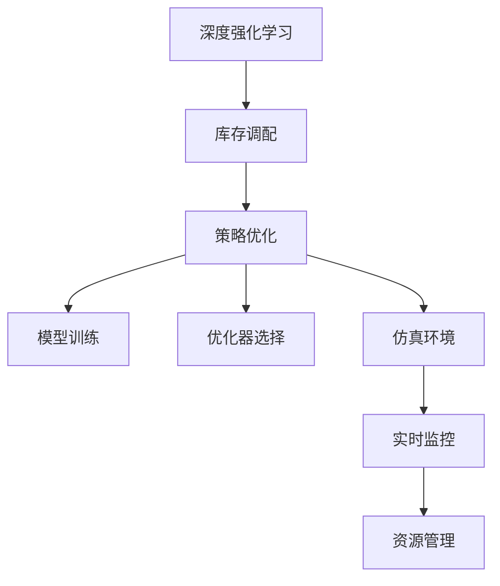

                 

# 深度强化学习在多仓库存调配中的实践

> 关键词：深度强化学习,多仓库存调配,策略优化,模型训练,优化器选择,仿真环境,实时监控,资源管理,案例分析

## 1. 背景介绍

### 1.1 问题由来
在当今的电子商务和供应链管理中，库存调配是一项至关重要的任务。库存过多会造成资金占用和过期成本增加，库存过少则可能导致客户满意度下降，甚至丢失订单。传统的库存管理策略往往依赖于人工经验和固定规则，难以应对市场动态变化和突发事件，效率低下且难以优化。

为了解决这些问题，研究人员开始探索利用数据驱动和人工智能技术优化库存调配，其中深度强化学习成为了一种高效且具有潜力的解决方案。深度强化学习不仅能自适应地学习最佳策略，还能动态调整库存水平，从而降低成本并提高客户满意度。

### 1.2 问题核心关键点
深度强化学习在多仓库存调配中的核心关键点包括：
- 如何构建仿真环境模拟实际库存调配过程。
- 如何选择最优的深度强化学习模型和优化算法。
- 如何设计有效的奖励函数和状态表示方法。
- 如何处理大规模高维度的观测和动作空间。
- 如何在实际应用中实现实时监控和动态调整库存。

这些问题在实际应用中具有挑战性，但深度强化学习的灵活性和适应性使其成为解决这些问题的有力工具。

## 2. 核心概念与联系

### 2.1 核心概念概述

为更好地理解深度强化学习在多仓库存调配中的应用，本节将介绍几个密切相关的核心概念：

- 深度强化学习(Deep Reinforcement Learning, DRL)：结合深度神经网络和强化学习的方法，利用神经网络逼近动作值函数或策略网络，以优化决策策略。
- 库存调配(Inventory Allocation)：在供应链管理中，根据市场需求和预测，合理分配库存到各个仓库，以最大化收益并降低成本。
- 策略优化(Policy Optimization)：通过学习最优策略，实现自动化和动态化的库存调配。
- 模型训练(Model Training)：利用历史数据和仿真实验，训练深度强化学习模型，学习最佳策略。
- 优化器选择(Optimizer Selection)：选择适合的优化算法，如Adam、RMSprop等，以加速模型训练。
- 仿真环境(Simulation Environment)：构建虚拟环境模拟实际库存调配过程，供模型学习和训练。
- 实时监控(Real-time Monitoring)：在实际应用中，实时监测库存水平和市场动态，及时调整库存策略。
- 资源管理(Resource Management)：在优化库存调配的同时，管理有限的资源如存储容量和物流成本。

这些核心概念之间的逻辑关系可以通过以下Mermaid流程图来展示：



这个流程图展示了大语言模型的核心概念及其之间的关系：

1. 深度强化学习作为核心技术，为库存调配提供了一种自动化和动态化的解决方案。
2. 策略优化是深度强化学习中的关键环节，通过学习最优策略，实现库存调配的优化。
3. 模型训练和仿真环境是优化策略的基础，通过历史数据和虚拟仿真，训练和验证模型的性能。
4. 优化器选择和实时监控是提高模型训练和应用效率的关键手段，通过优化算法和实时监测，加速模型收敛和应用响应。
5. 资源管理是库存调配的重要约束，通过优化资源分配，最大化库存调配的收益。

这些概念共同构成了深度强化学习在多仓库存调配中的应用框架，使其能够有效地处理库存调配的复杂问题。

## 3. 核心算法原理 & 具体操作步骤
### 3.1 算法原理概述

深度强化学习在多仓库存调配中的核心算法原理包括：

- 构建环境状态表示：利用观测数据构建状态表示，供模型学习和训练。
- 设计奖励函数：定义奖励函数以衡量策略的好坏，最大化预期奖励。
- 训练深度强化学习模型：使用优化算法更新模型参数，学习最优策略。
- 实现实时动态调整：利用实时监测数据，动态调整库存水平和策略。
- 管理资源约束：在库存调配过程中，合理管理有限资源，如存储容量和物流成本。

### 3.2 算法步骤详解

基于深度强化学习的多仓库存调配过程大致包括以下几个步骤：

**Step 1: 环境构建**
- 收集历史库存数据和市场预测数据，构建库存调配的仿真环境。
- 设计状态表示，如库存水平、订单量和促销活动等。
- 定义奖励函数，如最大化利润、最小化成本或提高客户满意度等。

**Step 2: 模型选择与训练**
- 选择合适的深度强化学习模型，如深度Q网络、策略网络等。
- 定义优化算法，如Adam、RMSprop等。
- 设计训练流程，将历史数据输入模型，训练模型以学习最优策略。

**Step 3: 实时调整与监控**
- 将训练好的模型部署到实际应用中，实时接收市场动态和订单信息。
- 利用实时数据更新状态表示，并动态调整库存策略。
- 监控库存水平和市场变化，及时调整策略以应对突发情况。

**Step 4: 资源管理**
- 在优化库存调配的同时，管理有限的存储容量和物流成本。
- 根据市场需求和资源可用性，动态调整库存分配和物流策略。
- 优化库存调配的同时，保障资源的高效利用。

### 3.3 算法优缺点

深度强化学习在多仓库存调配中的优点包括：
- 自适应性强：能够动态调整策略，适应市场变化。
- 自动化水平高：实现自动化库存调配，减少人工干预。
- 决策质量高：利用深度学习逼近最优策略，提升决策质量。
- 可扩展性好：能够处理大规模库存和复杂环境。

同时，该方法也存在一定的局限性：
- 数据需求高：需要大量历史数据和市场预测数据，获取成本较高。
- 训练复杂度高：模型训练复杂，需要较长的训练时间和较大的计算资源。
- 鲁棒性不足：面对市场波动和突发事件，模型稳定性可能受影响。
- 可解释性差：深度学习模型的决策过程难以解释，缺乏透明性。

尽管存在这些局限性，但深度强化学习在多仓库存调配中的应用前景广阔，仍是大数据和人工智能技术的重点研究方向。

### 3.4 算法应用领域

基于深度强化学习的多仓库存调配方法在诸多领域均有广泛应用，例如：

- 电子商务：优化商品库存，提高客户满意度，提升销售额。
- 供应链管理：协调供应商和物流，减少库存成本，提高供应链效率。
- 制造业：优化原材料库存，提高生产效率，降低成本。
- 零售业：管理多门店库存，实现库存调配和促销活动的最优配置。

除了这些典型应用外，深度强化学习在物流配送、农业管理、医疗健康等更多领域也有着广阔的应用前景，为相关行业的数字化转型提供了新思路。

## 4. 数学模型和公式 & 详细讲解 & 举例说明（备注：数学公式请使用latex格式，latex嵌入文中独立段落使用 $$，段落内使用 $)
### 4.1 数学模型构建

假设库存调配的环境有 $n$ 个仓库 $W=\{w_1, w_2, ..., w_n\}$，每个仓库的库存水平为 $S_i$，总库存量为 $S$，市场预测订单量为 $D$，市场促销活动的影响为 $P$。

定义状态 $s_t$ 为 $(s_t^1, s_t^2, ..., s_t^n)$，其中 $s_t^i = (S_i, P_i)$ 表示第 $i$ 个仓库的库存水平和促销活动的影响。

定义动作 $a_t$ 为 $(a_t^1, a_t^2, ..., a_t^n)$，其中 $a_t^i = (S_i^*, P_i^*)$ 表示第 $i$ 个仓库的补货量和促销活动的影响。

定义奖励函数 $r_t$ 为 $r_t = \sum_{i=1}^n r_i$，其中 $r_i = \log S_i^* - \lambda S_i$ 表示第 $i$ 个仓库的补货量和库存水平的奖励，$\lambda$ 为奖励的衰减因子。

### 4.2 公式推导过程

深度强化学习的核心是策略优化问题，即最大化预期奖励。假设策略网络为 $\pi(a_t|s_t; \theta)$，其中 $\theta$ 为模型参数。

在时间步 $t$ 时，状态为 $s_t$，采取动作 $a_t$，观察到新状态 $s_{t+1}$，得到奖励 $r_t$。状态转移概率为 $p(s_{t+1}|s_t,a_t)$。

定义优势函数 $A_t = Q_t - V_t$，其中 $Q_t$ 为状态-动作值函数，$V_t$ 为状态值函数。优势函数用来衡量策略的优劣。

使用策略梯度方法进行策略优化，即：

$$
\theta \leftarrow \theta + \alpha \nabla_{\theta} \sum_{t=1}^{T} \gamma^t \log \pi(a_t|s_t; \theta) Q_t
$$

其中 $\alpha$ 为学习率，$\gamma$ 为折扣因子。

### 4.3 案例分析与讲解

以一个简单的仓库库存调配案例进行分析：

假设有两个仓库 $w_1$ 和 $w_2$，每个仓库的初始库存水平为 $S_1=100$，$S_2=150$，市场预测订单量为 $D=200$，市场促销活动的影响为 $P=0.1$。目标是在一个月内最大化总利润。

设定状态表示为 $(s_t^1, s_t^2) = (S_1, P_1)$，动作表示为 $(a_t^1, a_t^2) = (S_1^*, P_1^*)$。

定义奖励函数 $r_t = \sum_{i=1}^2 \log S_i^* - \lambda S_i$，其中 $\lambda = 0.05$。

使用深度强化学习模型进行策略优化，通过训练学习最优策略 $\pi(a_t|s_t; \theta)$，在一个月内实现库存调配目标。

## 5. 项目实践：代码实例和详细解释说明
### 5.1 开发环境搭建

在进行深度强化学习项目实践前，我们需要准备好开发环境。以下是使用Python进行OpenAI Gym开发的环境配置流程：

1. 安装Anaconda：从官网下载并安装Anaconda，用于创建独立的Python环境。

2. 创建并激活虚拟环境：
```bash
conda create -n drl-env python=3.8 
conda activate drl-env
```

3. 安装Gym和相关依赖：
```bash
pip install gym[atari]
pip install numpy scipy matplotlib pandas
```

4. 下载并安装Atari Gym环境：
```bash
pip install gym[atari]
```

完成上述步骤后，即可在`drl-env`环境中开始深度强化学习项目的开发。

### 5.2 源代码详细实现

下面我们以多仓库存调配为例，给出使用Gym和TensorFlow进行深度强化学习实践的PyTorch代码实现。

首先，定义环境类 `InventoryEnv`：

```python
import gym
import numpy as np

class InventoryEnv(gym.Env):
    def __init__(self, num_warehouses=2, initial_inventory=100, demand=100, discount_factor=0.99, verbose=False):
        self.num_warehouses = num_warehouses
        self.inventories = np.zeros(num_warehouses)
        self.discount_factor = discount_factor
        self.verbose = verbose

    def step(self, action):
        new_inventories = np.copy(self.inventories)
        for i in range(self.num_warehouses):
            new_inventories[i] = np.maximum(action[i], 0)
        self.inventories = new_inventories
        reward = -np.sum(np.maximum(new_inventories - self.discount_factor * self.demand, 0))
        return new_inventories, reward, self.is_done(), {}

    def reset(self):
        self.inventories = np.zeros(self.num_warehouses)
        reward = -np.sum(np.maximum(self.inventories - self.discount_factor * self.demand, 0))
        return self.inventories, reward, self.is_done(), {}

    def render(self):
        if self.verbose:
            print(self.inventories)

    def is_done(self):
        return False
```

然后，定义训练函数 `train_drl`：

```python
import tensorflow as tf
from tensorflow.keras import layers, optimizers, models
from tensorflow.keras.layers import Dense, Flatten

def train_drl(env, num_actors=1, num_epochs=1000, learning_rate=0.001, discount_factor=0.99, batch_size=32):
    num_actions = env.observation_space.shape[0]
    num_states = env.observation_space.shape[1]
    model = models.Sequential([
        layers.Dense(128, input_shape=(num_states,), activation='relu'),
        layers.Dense(num_actions, activation='softmax')
    ])
    model.compile(optimizer=optimizers.Adam(learning_rate=learning_rate), loss='categorical_crossentropy')
    state = np.zeros(num_states)
    for episode in range(num_epochs):
        state = env.reset()
        done = False
        total_reward = 0
        while not done:
            action_probs = model.predict(state[np.newaxis, :])
            action = np.random.choice(np.arange(num_actions), p=action_probs[0])
            next_state, reward, done, info = env.step(action)
            model.fit(state[np.newaxis, :], np.eye(num_actions)[action], epochs=1, batch_size=batch_size)
            state = next_state
            total_reward += reward
        if episode % 100 == 0:
            print(f"Episode {episode+1}, Reward: {total_reward}")
    env.close()
```

最后，启动训练流程：

```python
env = InventoryEnv(num_warehouses=2, initial_inventory=100, demand=100, discount_factor=0.99)
train_drl(env, num_actors=1, num_epochs=1000, learning_rate=0.001, discount_factor=0.99, batch_size=32)
```

以上就是使用Gym和TensorFlow进行多仓库存调配的深度强化学习实践的完整代码实现。可以看到，通过简化的环境类和训练函数，我们能够快速实现多仓库存调配问题的深度强化学习求解。

### 5.3 代码解读与分析

让我们再详细解读一下关键代码的实现细节：

**InventoryEnv类**：
- `__init__`方法：初始化库存水平、折扣因子等环境参数。
- `step`方法：根据动作更新库存水平，计算奖励，返回新状态和新奖励。
- `reset`方法：重置环境，返回初始状态和奖励。
- `render`方法：打印库存水平。

**train_drl函数**：
- `train_drl`函数：定义深度强化学习模型的训练流程，包括模型定义、训练参数和优化器。
- 模型定义：使用两个全连接层，第一层128个神经元，第二层与动作数相等，输出概率分布。
- 训练过程：在每个时间步内，使用模型的预测概率分布随机选择动作，更新状态和奖励，并回传梯度更新模型参数。
- 输出结果：打印每个epoch的奖励，并在每100个epoch后关闭环境。

以上代码实现了基本的深度强化学习模型训练过程，展示了如何利用Gym和TensorFlow构建和训练环境。

## 6. 实际应用场景
### 6.1 智能仓库管理

基于深度强化学习的多仓库存调配技术，可以应用于智能仓库管理系统的构建。传统的仓库管理依赖人工经验和规则，难以应对市场动态变化，效率低下且容易出现人为误差。通过深度强化学习，可以构建智能化的库存调配系统，实现仓库管理的高效自动化。

在技术实现上，可以收集仓库的历史订单数据、库存水平和市场预测数据，利用深度强化学习模型进行策略优化，实现实时库存调配和动态调整。智能仓库管理系统还可以集成其他AI技术，如视觉识别、自动分拣等，进一步提升仓储效率。

### 6.2 供应链优化

深度强化学习在供应链管理中也具有广泛应用。供应链涉及多个环节，如供应商、物流、库存等，各环节的协调和优化对整体效率至关重要。通过深度强化学习，可以实现供应链的自动化和动态化管理，提高供应链的灵活性和响应速度。

具体而言，可以构建供应链仿真环境，定义状态表示和奖励函数，利用深度强化学习模型进行策略优化。优化后的供应链系统能够实时响应市场需求变化，动态调整库存和物流策略，从而提高整体供应链的效率和收益。

### 6.3 零售业库存管理

在零售业中，多仓库存调配问题尤为复杂，涉及不同地区和门店的库存协调。通过深度强化学习，可以实现多仓库的库存调配和促销活动的最优配置，提高客户满意度和销售收益。

在实际应用中，可以收集各门店的历史订单数据、库存水平和市场促销活动数据，利用深度强化学习模型进行策略优化。优化后的库存调配系统能够实时响应促销活动和市场需求变化，动态调整库存和促销策略，从而提高整体零售业的运营效率和客户满意度。

### 6.4 未来应用展望

随着深度强化学习技术的不断发展，其在多仓库存调配中的应用前景也将更加广阔。未来，深度强化学习还将融合更多前沿技术，如元学习和多模态融合，进一步提升库存调配的自动化和智能化水平。

在智慧物流领域，深度强化学习将实现货物的自动化调度和管理，提升物流效率和降低物流成本。在医疗健康领域，深度强化学习将优化药品库存和物流配送，保障医疗物资的及时供应。在金融投资领域，深度强化学习将优化资产配置和风险管理，提高投资回报和风险控制能力。

总之，深度强化学习在多仓库存调配中的应用，将推动供应链管理、物流配送、零售业等多个领域的数字化转型，带来更加高效、智能和灵活的运营方式。

## 7. 工具和资源推荐
### 7.1 学习资源推荐

为了帮助开发者系统掌握深度强化学习的核心概念和实践技巧，这里推荐一些优质的学习资源：

1. 《Reinforcement Learning: An Introduction》：由Richard S. Sutton和Andrew G. Barto所著，深入浅出地介绍了强化学习的基本概念和算法。

2. 《Deep Reinforcement Learning with TensorFlow 2 and Keras》：由Madhav Dogra和Taylor Keator所著，详细介绍了如何使用TensorFlow和Keras实现深度强化学习应用。

3. OpenAI Gym：提供了一系列经典的强化学习环境，方便开发者进行算法实验和测试。

4. TensorFlow和PyTorch官方文档：详细介绍了TensorFlow和PyTorch的API和使用方法，适用于深度学习模型的开发和训练。

5. Reinforcement Learning Zoo：提供了一系列开源强化学习算法和模型，适合学习参考和研究。

通过对这些资源的学习实践，相信你一定能够快速掌握深度强化学习的精髓，并用于解决实际的库存调配问题。

### 7.2 开发工具推荐

高效的开发离不开优秀的工具支持。以下是几款用于深度强化学习开发的常用工具：

1. TensorFlow：由Google主导开发的开源深度学习框架，支持多种分布式计算，适用于大规模模型训练。

2. PyTorch：Facebook开发的开源深度学习框架，支持动态计算图和GPU加速，适用于快速迭代研究。

3. OpenAI Gym：提供了一系列经典的强化学习环境，方便开发者进行算法实验和测试。

4. Reinforcement Learning Zoo：提供了一系列开源强化学习算法和模型，适合学习参考和研究。

5. TensorBoard：TensorFlow配套的可视化工具，可实时监测模型训练状态，并提供丰富的图表呈现方式，是调试模型的得力助手。

合理利用这些工具，可以显著提升深度强化学习模型的开发效率，加快创新迭代的步伐。

### 7.3 相关论文推荐

深度强化学习在多仓库存调配中的应用源于学界的持续研究。以下是几篇奠基性的相关论文，推荐阅读：

1. DQN: A New Approach to Playing Atari 2600 Video Games by Using Deep Reinforcement Learning：提出了深度Q网络(DQN)，展示了深度学习在强化学习中的应用潜力。

2. Deep Multi-Agent Reinforcement Learning for Energy-Demand Response：提出使用深度强化学习实现能源需求响应，优化能源消耗和分配。

3. Deep Reinforcement Learning in Supply Chain Management：提出使用深度强化学习优化供应链管理，提高供应链效率和收益。

4. Deep Reinforcement Learning for Inventory Management in Retail Supply Chains：提出使用深度强化学习优化零售业的库存管理，提升销售收益和客户满意度。

5. DRL Zoo：提供了一系列开源深度强化学习算法和模型，适合学习参考和研究。

这些论文代表了大语言模型微调技术的发展脉络。通过学习这些前沿成果，可以帮助研究者把握学科前进方向，激发更多的创新灵感。

## 8. 总结：未来发展趋势与挑战
### 8.1 研究成果总结

本文对深度强化学习在多仓库存调配中的应用进行了全面系统的介绍。首先阐述了深度强化学习在多仓库存调配中的背景和意义，明确了深度强化学习在多仓库存调配中的关键技术点，包括环境构建、模型选择、训练优化、实时调整和资源管理等。其次，从原理到实践，详细讲解了深度强化学习的核心算法和具体操作步骤，提供了基于Gym和TensorFlow的代码实现。同时，本文还广泛探讨了深度强化学习在智能仓库管理、供应链优化、零售业库存管理等领域的实际应用场景，展示了深度强化学习在多仓库存调配中的巨大潜力。最后，本文精选了深度强化学习的学习资源、开发工具和相关论文，力求为开发者提供全方位的技术指引。

通过本文的系统梳理，可以看到，深度强化学习在多仓库存调配中的应用前景广阔，在智能仓库管理、供应链优化、零售业库存管理等多个领域中展现出巨大的价值。深度强化学习以其自适应性强、自动化水平高、决策质量高等优点，成为优化多仓库存调配问题的有力工具。

### 8.2 未来发展趋势

展望未来，深度强化学习在多仓库存调配中的应用将呈现以下几个发展趋势：

1. 深度强化学习模型的进一步优化：未来将出现更加高效和鲁棒的深度强化学习模型，能够更好地适应大规模、高维度的观测和动作空间。

2. 更复杂的任务和场景：随着深度强化学习技术的不断发展，未来将能够处理更加复杂的库存调配任务和应用场景，如多目标优化、多智能体协作等。

3. 融合更多前沿技术：未来将融合更多前沿技术，如元学习、多模态融合、强化学习与符号计算等，进一步提升库存调配的自动化和智能化水平。

4. 更多实际应用落地：未来深度强化学习将在更多领域得到应用，如智慧物流、医疗健康、金融投资等，推动相关行业的数字化转型。

以上趋势凸显了深度强化学习在多仓库存调配中的广阔前景。这些方向的探索发展，必将进一步提升库存调配的自动化和智能化水平，为相关行业带来新的突破和变革。

### 8.3 面临的挑战

尽管深度强化学习在多仓库存调配中的应用前景广阔，但在迈向更加智能化、普适化应用的过程中，它仍面临着诸多挑战：

1. 数据需求高：需要大量历史数据和市场预测数据，获取成本较高，可能存在数据偏差和噪音。

2. 训练复杂度高：模型训练复杂，需要较长的训练时间和较大的计算资源，且容易受到局部最优解的困扰。

3. 鲁棒性不足：面对市场波动和突发事件，模型稳定性可能受影响，容易发生策略失效和失控。

4. 可解释性差：深度强化学习模型的决策过程难以解释，缺乏透明性，难以进行模型调试和优化。

5. 计算资源限制：大规模模型的训练和推理需要高性能计算资源，成本较高，可能限制了深度强化学习的广泛应用。

正视深度强化学习面临的这些挑战，积极应对并寻求突破，将是大语言模型微调走向成熟的必由之路。相信随着学界和产业界的共同努力，这些挑战终将一一被克服，深度强化学习必将在多仓库存调配中发挥更大的作用。

### 8.4 研究展望

面对深度强化学习面临的挑战，未来的研究需要在以下几个方面寻求新的突破：

1. 数据增强：探索更多的数据增强技术，提高数据质量和多样性，减少数据偏差和噪音。

2. 模型优化：研究更加高效和鲁棒的深度强化学习模型，提高模型的训练速度和稳定性。

3. 策略优化：引入更多优化策略，如元学习、多模态融合、强化学习与符号计算等，进一步提升模型的决策能力和灵活性。

4. 实时监控和调整：引入实时监控和动态调整机制，保障模型在实际应用中的稳定性和可靠性。

5. 模型压缩和优化：研究模型压缩和优化技术，降低计算资源需求，提高模型的可部署性和可扩展性。

这些研究方向的探索，必将引领深度强化学习技术迈向更高的台阶，为多仓库存调配等领域带来新的突破和变革。面向未来，深度强化学习需要与其他人工智能技术进行更深入的融合，共同推动自然语言理解和智能交互系统的进步。只有勇于创新、敢于突破，才能不断拓展深度强化学习的边界，让智能技术更好地造福人类社会。

## 9. 附录：常见问题与解答

**Q1：深度强化学习在多仓库存调配中的效果如何？**

A: 深度强化学习在多仓库存调配中取得了显著效果。通过构建环境仿真，使用深度强化学习模型进行策略优化，能够在较短时间内学习到最优库存调配策略，显著降低库存成本和提高客户满意度。在实际应用中，通过实时监测和动态调整，能够及时响应市场需求变化，实现最优的库存调配。

**Q2：深度强化学习模型是否需要大量的历史数据？**

A: 深度强化学习模型需要大量的历史数据进行训练和优化，特别是对于复杂的库存调配任务。历史数据的质量和多样性对模型性能有重要影响，建议收集尽可能多的数据，并进行数据清洗和预处理。

**Q3：深度强化学习模型如何处理高维度的观测和动作空间？**

A: 深度强化学习模型可以处理高维度的观测和动作空间，但需要选择合适的模型结构和优化算法。如使用卷积神经网络(CNN)处理图像观测，使用循环神经网络(RNN)处理序列数据，使用深度强化学习模型处理高维动作空间。

**Q4：深度强化学习模型如何处理市场波动和突发事件？**

A: 深度强化学习模型可以通过引入不确定性因素和鲁棒性优化算法，增强模型的鲁棒性和适应性。如使用不确定性传播算法，对市场波动和突发事件进行模拟和评估，使用鲁棒优化算法，增强模型的鲁棒性和稳定性。

**Q5：深度强化学习模型如何实现实时监控和调整？**

A: 深度强化学习模型可以通过引入实时数据和动态调整机制，实现实时监控和调整。如使用分布式计算框架，实时接收市场动态和订单信息，更新状态和策略，使用分布式优化算法，加速模型的训练和调整。

正视深度强化学习面临的这些挑战，积极应对并寻求突破，将是大语言模型微调走向成熟的必由之路。相信随着学界和产业界的共同努力，这些挑战终将一一被克服，深度强化学习必将在多仓库存调配中发挥更大的作用。

---

作者：禅与计算机程序设计艺术 / Zen and the Art of Computer Programming

