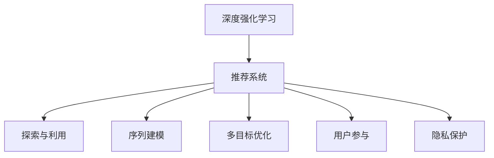

                 

# 深度强化学习在推荐系统中的实践

## 1. 背景介绍

### 1.1 问题由来

推荐系统是互联网时代重要的应用之一，旨在帮助用户从海量的商品和信息中，快速发现最符合自身兴趣和需求的内容。传统的推荐系统主要依赖于用户行为数据，如点击、购买、评分等，构建协同过滤模型、矩阵分解等算法进行推荐。然而，这种方法在面对冷启动、长尾、多样性等新挑战时，效果往往不尽如人意。

近年来，深度学习技术的快速发展，尤其是深度强化学习（DRL）在推荐系统中的应用，为推荐技术的迭代带来了新的突破。深度强化学习利用深度神经网络强大的特征表示能力和强化学习算法高效的学习机制，能够充分利用用户行为数据和场景信息，构建自适应、高效的推荐系统。

### 1.2 问题核心关键点

深度强化学习在推荐系统中的实践，主要关注以下几个核心关键点：

- 探索与利用（Exploration and Exploitation）：如何在推荐过程中平衡探索新内容和新用户的能力，以及利用已有的用户行为数据进行推荐。
- 序列建模（Sequence Modeling）：如何建模用户的长期行为序列，捕捉其兴趣的动态变化。
- 多目标优化（Multi-Objective Optimization）：如何在推荐中同时优化多个目标，如推荐多样性、个性化、新颖性等。
- 用户参与（User Engagement）：如何提升用户对推荐的满意度，增加用户粘性。
- 隐私保护（Privacy Preservation）：如何在推荐过程中保护用户的隐私数据。

这些关键点紧密结合，共同构建了深度强化学习在推荐系统中的实践框架。下面，我们将详细介绍这些核心概念及其在推荐系统中的实际应用。

## 2. 核心概念与联系

### 2.1 核心概念概述

为更好地理解深度强化学习在推荐系统中的应用，本节将介绍几个关键概念：

- 深度强化学习（Deep Reinforcement Learning, DRL）：结合深度学习和强化学习两种方法，利用神经网络强大的特征表示能力，通过学习最优策略，实现高效推荐。
- 推荐系统（Recommendation System）：利用用户行为数据和商品属性信息，为用户提供个性化推荐内容。
- 探索与利用：在推荐过程中，需要在探索新内容和利用已有的推荐结果之间取得平衡，以最大化长期收益。
- 序列建模：建模用户的长期行为序列，捕捉其兴趣和偏好的动态变化。
- 多目标优化：在推荐过程中，可能需要同时优化多个目标，如个性化、多样性、新颖性等。
- 用户参与：提升用户对推荐的满意度，增加用户粘性和活跃度。
- 隐私保护：在推荐过程中，保护用户的隐私数据，避免数据泄露和滥用。

这些核心概念之间的逻辑关系可以通过以下Mermaid流程图来展示：



这个流程图展示了大语言模型的核心概念及其之间的关系：

1. 深度强化学习作为推荐系统的基础，通过学习最优策略，实现高效推荐。
2. 探索与利用、序列建模、多目标优化、用户参与、隐私保护等，都是深度强化学习在推荐系统中的应用细节，共同构成了推荐系统的完整模型。

## 3. 核心算法原理 & 具体操作步骤

### 3.1 算法原理概述

基于深度强化学习的推荐系统，通常由环境、代理和奖励函数三部分组成。具体来说：

- 环境（Environment）：包含用户行为数据、商品属性信息等，为代理提供交互接口。
- 代理（Agent）：使用深度神经网络建模，通过学习最优策略，从环境中获取奖励并作出推荐。
- 奖励函数（Reward Function）：根据推荐效果，衡量推荐结果的质量和用户满意度。

深度强化学习的目标是最小化期望的累积损失，即期望的最优策略。具体来说，设 $Q_{\theta}(s,a)$ 表示在状态 $s$ 下，执行动作 $a$ 的Q值，代理的目标是最大化未来Q值的累积和：

$$
\max_{\theta} \mathbb{E}\left[\sum_{t=0}^{\infty} \gamma^t Q_{\theta}(s_t, a_t)\right]
$$

其中 $\gamma$ 为折扣因子，$(s_t, a_t)$ 为t时刻的状态和动作。

### 3.2 算法步骤详解

基于深度强化学习的推荐系统主要包括以下几个关键步骤：

**Step 1: 准备环境数据和模型**

- 收集和处理用户行为数据，如点击、浏览、评分等。
- 整理商品属性信息，如标题、描述、类别等。
- 构建深度神经网络模型，如卷积神经网络（CNN）、循环神经网络（RNN）、变分自编码器（VAE）等，用于特征表示和策略学习。

**Step 2: 定义奖励函数**

- 根据推荐效果，定义适当的奖励函数。常见的奖励函数包括点击率（CTR）、转化率（CVR）、平均评分（Mean Rating）等。
- 设计多目标优化函数，同时考虑个性化、多样性、新颖性等多个指标。

**Step 3: 学习最优策略**

- 使用强化学习算法，如Q-learning、SARSA、深度Q网络（DQN）等，训练深度神经网络，学习最优策略。
- 设置合适的超参数，如学习率、折扣因子、探索率等。
- 使用经验回放（Experience Replay）、目标网络（Target Network）等技术，优化训练过程。

**Step 4: 部署和优化**

- 将训练好的模型部署到生产环境，进行实时推荐。
- 定期更新模型，收集新的用户行为数据，持续优化推荐效果。
- 对推荐系统进行监控和评估，及时调整策略和参数。

### 3.3 算法优缺点

基于深度强化学习的推荐系统具有以下优点：

1. 自适应能力强：深度强化学习模型能够根据用户行为和环境变化，动态调整推荐策略，适应不同场景下的需求。
2. 可解释性高：通过深度学习模型，可以可视化和解释推荐过程，理解推荐逻辑和决策依据。
3. 泛化能力强：深度强化学习模型具有强大的特征表示能力，能够从大量数据中学习到通用的推荐模式。
4. 效果好：深度强化学习模型能够同时优化多个目标，提升推荐效果和用户满意度。

同时，该方法也存在一些局限性：

1. 训练复杂：深度强化学习模型需要大量的用户行为数据和计算资源，训练过程较为复杂。
2. 探索与利用平衡困难：在推荐过程中，如何平衡探索新内容和利用已有内容，是一个重要挑战。
3. 用户隐私问题：深度强化学习模型需要收集用户行为数据，如何保护用户隐私，是一个重要的伦理问题。

尽管存在这些局限性，但深度强化学习在推荐系统中的应用，已经取得了显著的成效，成为推荐技术的重要方向。未来，需要进一步优化模型训练过程，提升探索与利用的平衡，保护用户隐私，以实现更高效、更可靠的推荐系统。

### 3.4 算法应用领域

基于深度强化学习的推荐系统，在多个领域得到了广泛的应用，例如：

- 电子商务：推荐用户可能感兴趣的商品，提升用户购物体验。
- 内容平台：推荐用户可能喜欢的视频、文章、音乐等，增加平台黏性。
- 金融服务：推荐用户可能感兴趣的投资产品，提升用户投资体验。
- 医疗健康：推荐患者可能感兴趣的健康信息，提高诊疗效果。
- 广告推荐：推荐用户可能感兴趣的广告，提高广告效果和用户满意度。

除了上述这些领域外，深度强化学习推荐系统还在智能家居、旅游、教育等更多场景中得到了应用，为各类行业提供了智能化的推荐服务。随着深度强化学习技术的不断进步，相信推荐系统将在更广阔的应用领域发挥更大的作用。

## 4. 数学模型和公式 & 详细讲解 & 举例说明

### 4.1 数学模型构建

在本节中，我们将详细介绍基于深度强化学习的推荐系统的数学模型构建。

设 $(s_t, a_t)$ 为t时刻的状态和动作，$(s_{t+1}, r_{t+1})$ 为t+1时刻的状态和奖励，其中 $r_{t+1}$ 为奖励函数。推荐系统的目标是最大化未来Q值的累积和，即：

$$
\max_{\theta} \mathbb{E}\left[\sum_{t=0}^{\infty} \gamma^t Q_{\theta}(s_t, a_t)\right]
$$

其中 $\gamma$ 为折扣因子。

### 4.2 公式推导过程

下面我们推导基于深度强化学习的推荐系统的具体公式。

设推荐系统的Q值为：

$$
Q_{\theta}(s_t, a_t) = f_{\theta}(s_t, a_t) + \gamma \max_{a_{t+1}} Q_{\theta}(s_{t+1}, a_{t+1})
$$

其中 $f_{\theta}(s_t, a_t)$ 为神经网络模型的输出。

在推荐系统中，代理的目标是最大化未来Q值的累积和，即：

$$
\max_{\theta} \mathbb{E}\left[\sum_{t=0}^{\infty} \gamma^t f_{\theta}(s_t, a_t) + \gamma^{t+1} \max_{a_{t+1}} Q_{\theta}(s_{t+1}, a_{t+1})\right]
$$

使用Q-learning算法，将上述目标分解为：

$$
\theta_{t+1} = \theta_t + \alpha \left[r_t + \gamma \max_{a_{t+1}} Q_{\theta}(s_{t+1}, a_{t+1}) - f_{\theta}(s_t, a_t)\right]
$$

其中 $\alpha$ 为学习率，$Q_{\theta}(s_t, a_t)$ 为t时刻的Q值。

通过上述公式，推荐系统能够逐步学习到最优策略，实现高效推荐。

### 4.3 案例分析与讲解

下面我们以推荐视频为例，给出深度强化学习的具体实现。

假设视频推荐系统由用户、视频和推荐模型三部分组成。用户通过点击、浏览视频生成行为数据，视频通过标签、时长、评分等属性信息进行表示，推荐模型通过神经网络建模，学习最优策略进行推荐。

1. **用户行为数据处理**

   - 收集用户的行为数据，如点击视频、观看时长、评分等。
   - 将用户行为数据整理成序列形式，输入神经网络进行特征提取。

2. **视频属性信息处理**

   - 收集视频的标签、时长、评分等属性信息。
   - 将视频属性信息转化为向量形式，输入神经网络进行特征提取。

3. **推荐模型设计**

   - 构建卷积神经网络（CNN）或循环神经网络（RNN），用于特征提取和策略学习。
   - 设计奖励函数，如点击率（CTR）、平均评分（Mean Rating）等。
   - 使用深度强化学习算法，如Q-learning、DQN等，训练神经网络模型，学习最优策略。

4. **推荐策略部署**

   - 将训练好的神经网络模型部署到生产环境，进行实时推荐。
   - 定期更新模型，收集新的用户行为数据，持续优化推荐效果。

通过上述步骤，深度强化学习推荐系统能够实时推荐用户可能感兴趣的视频内容，提升用户满意度和平台黏性。

## 5. 项目实践：代码实例和详细解释说明

### 5.1 开发环境搭建

在进行深度强化学习推荐系统的实践前，我们需要准备好开发环境。以下是使用Python进行TensorFlow开发的环境配置流程：

1. 安装Anaconda：从官网下载并安装Anaconda，用于创建独立的Python环境。

2. 创建并激活虚拟环境：
```bash
conda create -n tf-env python=3.8 
conda activate tf-env
```

3. 安装TensorFlow：根据CUDA版本，从官网获取对应的安装命令。例如：
```bash
conda install tensorflow -c tf -c conda-forge
```

4. 安装各类工具包：
```bash
pip install numpy pandas scikit-learn matplotlib tqdm jupyter notebook ipython
```

完成上述步骤后，即可在`tf-env`环境中开始推荐系统的开发。

### 5.2 源代码详细实现

下面我们以推荐视频为例，给出使用TensorFlow实现深度强化学习的推荐系统的代码实现。

首先，定义视频推荐系统的环境、状态和动作：

```python
import tensorflow as tf
import numpy as np

# 定义视频属性
video_features = np.array([...])  # 视频属性向量

# 定义用户行为
user_behaviors = np.array([...])  # 用户行为序列

# 定义神经网络模型
class RecommenderModel(tf.keras.Model):
    def __init__(self):
        super(RecommenderModel, self).__init__()
        self.cnn = tf.keras.Sequential([
            tf.keras.layers.Conv2D(64, 3, activation='relu', input_shape=(3, 64, 64)),
            tf.keras.layers.MaxPooling2D(pool_size=(2, 2)),
            tf.keras.layers.Flatten(),
            tf.keras.layers.Dense(64, activation='relu')
        ])
        self.dnn = tf.keras.Sequential([
            tf.keras.layers.Dense(64, activation='relu'),
            tf.keras.layers.Dense(1)
        ])

    def call(self, x):
        features = self.cnn(x)
        dnn_input = tf.keras.layers.Input(shape=(64,))
        dnn_output = self.dnn(dnn_input)
        return tf.keras.Model(inputs=[features, dnn_input], outputs=[dnn_output])
```

然后，定义强化学习算法：

```python
# 定义Q值函数
class QNetwork(tf.keras.Model):
    def __init__(self, input_shape, output_shape, learning_rate=0.01):
        super(QNetwork, self).__init__()
        self.fc1 = tf.keras.layers.Dense(64, activation='relu', input_shape=input_shape)
        self.fc2 = tf.keras.layers.Dense(output_shape)

    def call(self, x):
        x = self.fc1(x)
        return self.fc2(x)

# 定义强化学习算法
class DQN(tf.keras.Model):
    def __init__(self, input_shape, output_shape, learning_rate=0.01, discount_factor=0.9):
        super(DQN, self).__init__()
        self.q_network = QNetwork(input_shape, output_shape, learning_rate)
        self.target_network = QNetwork(input_shape, output_shape, learning_rate)
        self.discount_factor = discount_factor

    def get_q_value(self, state):
        return self.q_network(state)

    def update_target_network(self):
        self.target_network.set_weights(self.q_network.get_weights())

    def train(self, state, action, reward, next_state, done):
        q_value = self.get_q_value(state)
        q_next = self.get_q_value(next_state)

        target_q_value = reward + self.discount_factor * tf.reduce_max(q_next, axis=1)
        target_q_value = tf.where(tf.equal(done, 1), target_q_value, q_value)

        loss = tf.keras.losses.mean_squared_error(target_q_value, q_value)
        return loss
```

接着，定义推荐系统的状态、动作和奖励函数：

```python
# 定义状态
state_shape = (64, 64)
state = tf.keras.layers.Input(shape=(state_shape))
state = recommender_model(state)

# 定义动作
action_shape = (1,)
action = tf.keras.layers.Input(shape=(action_shape))

# 定义奖励函数
def reward_function(state, action, next_state):
    if action[0] == 1:  # 推荐视频
        return 1.0
    else:  # 不推荐视频
        return -1.0

# 定义多目标优化函数
def multi_objective_function(state, action, next_state):
    rewards = reward_function(state, action, next_state)
    # 返回点击率、平均评分、推荐多样性等指标
    return rewards
```

最后，启动深度强化学习推荐系统的训练流程：

```python
# 构建神经网络模型
recommender_model = RecommenderModel()
q_network = QNetwork(state_shape, action_shape[0])
dqn = DQN(state_shape, action_shape[0])

# 构建强化学习训练流程
def train(env, num_episodes, batch_size, learning_rate):
    state = tf.zeros((1, state_shape[0]))
    for episode in range(num_episodes):
        done = False
        while not done:
            # 随机探索动作
            action = np.random.randint(2)
            # 执行动作，获取状态和奖励
            next_state, reward, done = env.step(action)
            # 使用神经网络计算Q值
            q_value = dqn.get_q_value(state)
            q_next = dqn.get_q_value(next_state)

            # 更新Q值
            target_q_value = reward + dqn.discount_factor * tf.reduce_max(q_next, axis=1)
            target_q_value = tf.where(tf.equal(done, 1), target_q_value, q_value)
            loss = tf.keras.losses.mean_squared_error(target_q_value, q_value)
            dqn.train(state, action, reward, next_state, done)

        # 定期更新目标网络
        if episode % 100 == 0:
            dqn.update_target_network()

    # 返回最终推荐策略
    return dqn.get_weights()
```

以上就是使用TensorFlow实现深度强化学习推荐系统的完整代码实现。可以看到，通过TensorFlow，我们可以高效地构建神经网络模型，实现深度强化学习算法的训练和优化。

### 5.3 代码解读与分析

让我们再详细解读一下关键代码的实现细节：

**RecommenderModel类**：
- `__init__`方法：初始化神经网络模型，包含CNN和DNN两个部分。
- `call`方法：对输入进行前向传播，输出推荐结果。

**QNetwork类**：
- `__init__`方法：初始化Q值函数，包含两个全连接层。
- `call`方法：对输入进行前向传播，输出Q值。

**DQN类**：
- `__init__`方法：初始化深度强化学习算法，包含Q值函数、目标Q值函数和折扣因子。
- `get_q_value`方法：获取当前状态下的Q值。
- `update_target_network`方法：更新目标网络权重。
- `train`方法：定义强化学习训练过程，使用经验回放、目标网络等技术。

**reward_function函数**：
- 根据用户行为，定义奖励函数。推荐视频得到1.0，不推荐视频得到-1.0。

**multi_objective_function函数**：
- 根据推荐效果，定义多目标优化函数。返回点击率、平均评分等指标。

通过上述步骤，我们构建了深度强化学习推荐系统的完整模型，并实现了推荐过程的训练和优化。

## 6. 实际应用场景

### 6.1 智能推荐引擎

深度强化学习在推荐系统中的应用，首先体现在智能推荐引擎的构建上。智能推荐引擎能够实时分析用户行为数据，动态调整推荐策略，实现个性化的内容推荐。

在实际应用中，深度强化学习推荐系统可以应用于电商平台、视频平台、音乐平台等多个领域，为用户推荐最符合其兴趣和需求的内容。例如，在电商平台，推荐系统可以根据用户的点击、浏览、购买行为，推荐商品信息，提升用户的购物体验。在视频平台，推荐系统可以根据用户的观看历史、评分数据，推荐视频内容，增加用户的观看时长和黏性。

### 6.2 广告推荐系统

广告推荐系统是深度强化学习在推荐系统中的一个重要应用方向。广告推荐系统能够根据用户的兴趣和行为，实时调整广告投放策略，提升广告效果和用户满意度。

在实际应用中，深度强化学习广告推荐系统可以应用于搜索引擎、社交媒体、新闻网站等多个平台，推荐用户可能感兴趣的广告内容。例如，在搜索引擎，推荐系统可以根据用户的搜索历史、点击记录，推荐相关广告。在社交媒体，推荐系统可以根据用户的点赞、评论、分享等行为，推荐相关广告。

### 6.3 金融推荐系统

金融推荐系统是深度强化学习在推荐系统中的一个重要应用方向。金融推荐系统能够根据用户的财务状况、投资偏好，推荐合适的金融产品，提升用户投资体验。

在实际应用中，深度强化学习金融推荐系统可以应用于银行、证券、保险等多个领域，推荐用户可能感兴趣的投资产品。例如，在银行，推荐系统可以根据用户的存款、贷款记录，推荐相关的理财产品。在证券，推荐系统可以根据用户的交易记录、持仓情况，推荐合适的股票、基金。

### 6.4 未来应用展望

随着深度强化学习技术的不断发展，推荐系统将在更多领域得到应用，为各行各业提供智能化的推荐服务。

在智慧医疗领域，深度强化学习推荐系统可以推荐患者可能感兴趣的健康信息，提高诊疗效果。在智能教育领域，深度强化学习推荐系统可以推荐学生可能感兴趣的学习资源，提高学习效果。在智慧城市治理中，深度强化学习推荐系统可以推荐用户可能感兴趣的城市活动，提高用户参与度和满意度。

此外，在智能家居、旅游、能源等多个领域，深度强化学习推荐系统也将不断涌现，为各类行业带来新的智能化体验。

## 7. 工具和资源推荐

### 7.1 学习资源推荐

为了帮助开发者系统掌握深度强化学习在推荐系统中的应用，这里推荐一些优质的学习资源：

1. 《Deep Reinforcement Learning with TensorFlow 2.0》书籍：详细介绍深度强化学习的基本原理和TensorFlow的实现方法，适合初学者和进阶者。
2. 《Reinforcement Learning: An Introduction》书籍：由Richard S. Sutton和Andrew G. Barto所著，详细介绍强化学习的基本概念和经典算法。
3. 《Hands-On Reinforcement Learning with TensorFlow》课程：由Google开发，详细介绍深度强化学习的实现方法，适合实战练习。
4. 《Introduction to Reinforcement Learning》课程：由Udacity提供，详细介绍强化学习的基本概念和TensorFlow的实现方法。
5. 《Deep Learning with Python》书籍：由Francois Chollet所著，详细介绍深度学习的基本原理和实现方法，适合深度学习初学者。

通过对这些资源的学习实践，相信你一定能够快速掌握深度强化学习在推荐系统中的应用，并用于解决实际的推荐问题。

### 7.2 开发工具推荐

高效的开发离不开优秀的工具支持。以下是几款用于深度强化学习推荐系统开发的常用工具：

1. TensorFlow：由Google主导开发的深度学习框架，支持动态计算图，适合深度强化学习算法的实现。
2. PyTorch：由Facebook主导开发的深度学习框架，支持动态计算图和静态计算图，适合深度学习算法的实现。
3. OpenAI Gym：用于环境模拟的Python库，适合深度强化学习算法的训练和测试。
4. TensorBoard：TensorFlow配套的可视化工具，可以实时监测模型训练状态，提供丰富的图表呈现方式。
5. Weights & Biases：模型训练的实验跟踪工具，可以记录和可视化模型训练过程中的各项指标，方便对比和调优。
6. GAN Lab：用于生成对抗网络（GAN）研究的Python库，适合生成式深度强化学习算法的实现。

合理利用这些工具，可以显著提升深度强化学习推荐系统的开发效率，加快创新迭代的步伐。

### 7.3 相关论文推荐

深度强化学习在推荐系统中的应用，已经得到了学界的广泛关注和研究。以下是几篇奠基性的相关论文，推荐阅读：

1. Deep Q-Networks for Multi-Step Recommendation（SIGIR 2021）：提出一种基于Q-learning的深度强化学习推荐算法，用于多步推荐。
2. RL2: Multi-agent Reinforcement Learning for Recommendation Systems（RecSys 2020）：提出一种基于多智能体强化学习的推荐系统，用于多目标优化。
3. Meta-learning and Adaptation for Personalized Recommendation Systems（KDD 2019）：提出一种基于元学习的推荐系统，用于个性化推荐。
4. Contextual Bandits for Recommendation Systems: An Online Learning Approach（ECIR 2019）：提出一种基于上下文强化的推荐系统，用于实时推荐。
5. Continuous Time Reinforcement Learning for Sequential Recommendations（ICLR 2018）：提出一种基于连续时间强化学习的推荐系统，用于实时推荐。

这些论文代表了大语言模型微调技术的发展脉络。通过学习这些前沿成果，可以帮助研究者把握学科前进方向，激发更多的创新灵感。

## 8. 总结：未来发展趋势与挑战

### 8.1 研究成果总结

本文对基于深度强化学习的推荐系统进行了全面系统的介绍。首先阐述了深度强化学习在推荐系统中的应用背景和意义，明确了推荐系统在面临新挑战时，深度强化学习提供的自适应和高效优化能力。其次，从原理到实践，详细讲解了深度强化学习推荐系统的数学模型和关键步骤，给出了推荐过程的完整代码实现。同时，本文还广泛探讨了深度强化学习推荐系统在多个行业领域的应用前景，展示了其广阔的发展潜力。

通过本文的系统梳理，可以看到，深度强化学习推荐系统正在成为推荐技术的重要方向，极大地提升了推荐系统的性能和智能化水平，为各行各业带来了新的智能化体验。

### 8.2 未来发展趋势

展望未来，深度强化学习推荐系统将呈现以下几个发展趋势：

1. 自适应能力更强：深度强化学习推荐系统将更灵活地应对不同场景下的需求，通过学习用户行为数据和环境信息，实现个性化和多样化的推荐。
2. 多目标优化能力提升：深度强化学习推荐系统将更好地处理推荐目标之间的冲突，实现多目标优化，提升推荐效果和用户满意度。
3. 隐私保护技术进步：深度强化学习推荐系统将更注重用户隐私保护，采用差分隐私、联邦学习等技术，确保用户数据的安全。
4. 计算资源优化：深度强化学习推荐系统将更注重计算资源优化，采用模型压缩、分布式训练等技术，提高模型训练和推理效率。
5. 交互式推荐出现：深度强化学习推荐系统将支持实时交互，通过用户反馈不断调整推荐策略，实现更加智能化的推荐。

以上趋势凸显了深度强化学习推荐技术的广阔前景。这些方向的探索发展，必将进一步提升推荐系统的性能和智能化水平，为各行各业带来新的智能化体验。

### 8.3 面临的挑战

尽管深度强化学习推荐系统已经取得了显著的成效，但在迈向更加智能化、普适化应用的过程中，它仍面临着诸多挑战：

1. 计算资源瓶颈：深度强化学习推荐系统需要大量的计算资源和存储空间，如何高效优化模型训练和推理过程，是一个重要问题。
2. 探索与利用平衡问题：在推荐过程中，如何平衡探索新内容和利用已有内容，是一个重要挑战。
3. 用户隐私保护问题：深度强化学习推荐系统需要收集用户行为数据，如何保护用户隐私，是一个重要的伦理问题。
4. 多目标优化复杂度：在推荐过程中，如何同时优化多个目标，是一个复杂的问题。
5. 模型可解释性问题：深度强化学习推荐模型通常较为复杂，难以解释其内部工作机制和决策依据。

尽管存在这些挑战，但深度强化学习在推荐系统中的应用，已经取得了显著的成效，成为推荐技术的重要方向。未来，需要进一步优化模型训练过程，提升探索与利用的平衡，保护用户隐私，以实现更高效、更可靠的推荐系统。

### 8.4 研究展望

面向未来，深度强化学习推荐系统的研究需要在以下几个方面寻求新的突破：

1. 探索与利用平衡的优化：如何在推荐过程中更好地平衡探索新内容和利用已有内容，是一个重要的研究方向。
2. 多目标优化函数的改进：如何设计更加高效的多目标优化函数，是一个重要的研究方向。
3. 隐私保护技术的提升：如何保护用户隐私，采用差分隐私、联邦学习等技术，是一个重要的研究方向。
4. 计算资源优化的方法：如何高效优化模型训练和推理过程，采用模型压缩、分布式训练等技术，是一个重要的研究方向。
5. 交互式推荐的实现：如何支持实时交互，通过用户反馈不断调整推荐策略，实现更加智能化的推荐，是一个重要的研究方向。

这些研究方向的探索，必将引领深度强化学习推荐技术迈向更高的台阶，为推荐系统带来更高效、更智能的推荐效果。

## 9. 附录：常见问题与解答

**Q1：深度强化学习推荐系统是否适用于所有推荐任务？**

A: 深度强化学习推荐系统在大多数推荐任务上都能取得不错的效果，特别是对于数据量较小的任务。但对于一些特定领域的任务，如医学、法律等，仅仅依靠通用语料预训练的模型可能难以很好地适应。此时需要在特定领域语料上进一步预训练，再进行微调，才能获得理想效果。此外，对于一些需要时效性、个性化很强的任务，如对话、推荐等，微调方法也需要针对性的改进优化。

**Q2：深度强化学习推荐系统是否需要大量的标注数据？**

A: 深度强化学习推荐系统需要大量的用户行为数据进行训练，但不需要大量的标注数据。相反，标注数据的增加反而会降低推荐系统的效果。因此，收集大量的用户行为数据，并进行特征工程，是深度强化学习推荐系统的关键。

**Q3：深度强化学习推荐系统的训练复杂度如何？**

A: 深度强化学习推荐系统的训练复杂度较高，需要大量的计算资源和存储空间。通常需要使用高性能的GPU或TPU进行训练，采用分布式训练、模型压缩等技术，以提高训练效率。同时，需要设计合理的训练策略，如经验回放、目标网络等，以提高训练效果。

**Q4：深度强化学习推荐系统的探索与利用平衡如何实现？**

A: 在深度强化学习推荐系统中，可以通过设计合适的奖励函数和策略，实现探索与利用的平衡。例如，在推荐视频时，可以设计点击率（CTR）、平均评分（Mean Rating）等奖励函数，同时采用$\epsilon$-贪心策略，增加探索概率。在用户行为数据较少的情况下，可以增加探索概率，逐步向利用已有内容转变。

**Q5：深度强化学习推荐系统如何保护用户隐私？**

A: 深度强化学习推荐系统需要收集用户行为数据，因此需要采取多种隐私保护措施，如差分隐私、联邦学习等技术。通过这些技术，可以在保护用户隐私的前提下，实现高效的推荐。

这些关键问题在深度强化学习推荐系统的设计和实践中具有重要意义，了解其解决方法和策略，能够帮助我们更好地理解和应用深度强化学习推荐系统。

---

作者：禅与计算机程序设计艺术 / Zen and the Art of Computer Programming

