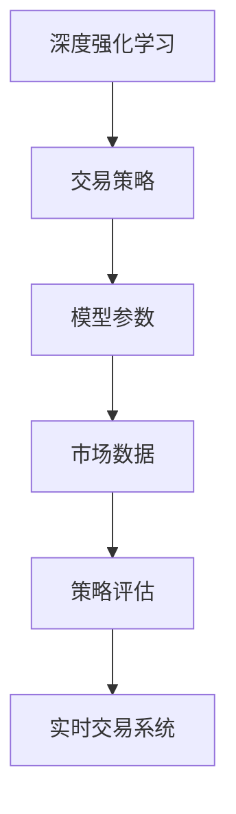

                 

# 深度强化学习在金融交易中的应用

## 1. 背景介绍

金融交易领域是一个高度动态且竞争激烈的行业，其中充满了机会与风险。深度强化学习（Deep Reinforcement Learning, DRL）作为近年来人工智能领域的一个重要分支，通过模型自主学习并优化交易策略，已经在金融交易中得到了广泛应用。

### 1.1 问题由来

传统的金融交易策略多依赖经验丰富的交易员，通过手工构建交易策略，并通过历史数据进行测试和回测，以评估其效果。然而，这种模式面临数据量不足、回测失效、市场动态变化等诸多问题。深度强化学习提供了一种全新的方式，能够利用大数据和深度学习模型，自动学习最优的交易策略，并实时应对市场动态变化。

### 1.2 问题核心关键点

深度强化学习在金融交易中的应用，主要包括以下几个核心关键点：
1. **模型学习与优化**：利用深度神经网络学习复杂的市场信号和交易规则，通过不断试验和优化，找到最优的交易策略。
2. **实时决策与执行**：深度强化学习模型能够实时分析市场数据，自动生成交易指令，无需人工干预。
3. **动态适应与演化**：模型能够根据市场环境的变化，动态调整策略，避免策略失效。
4. **多模态数据整合**：利用交易数据、新闻、社交媒体等多源数据，全面理解市场，提升策略效果。
5. **风险控制与管理**：通过深度强化学习，自动进行风险评估和控制，减少交易风险。

这些关键点使得深度强化学习在金融交易中具备了独特的优势，可以显著提升交易效率和收益。

## 2. 核心概念与联系

### 2.1 核心概念概述

为更好地理解深度强化学习在金融交易中的应用，本节将介绍几个密切相关的核心概念：

- **深度强化学习**：结合深度神经网络和强化学习的技术，通过模型自主学习最优交易策略。
- **交易策略**：描述如何进行交易的具体规则，包括买卖时机、仓位管理、风险控制等。
- **模型参数**：深度神经网络中的权重和偏置，通过训练得到，用于生成交易策略。
- **市场数据**：包括交易价格、成交量、市场深度、新闻、社交媒体等多源数据。
- **策略评估**：通过回测和模拟交易，评估交易策略的效果和风险。
- **实时交易系统**：通过API将交易策略自动转化为交易指令，并实时执行。

这些概念之间的逻辑关系可以通过以下Mermaid流程图来展示：



这个流程图展示了大语言模型的核心概念及其之间的关系：

1. 深度强化学习通过市场数据训练模型，生成交易策略。
2. 交易策略通过模型参数实现，模型参数由市场数据决定。
3. 市场数据来源广泛，包括历史价格、新闻、社交媒体等。
4. 交易策略通过策略评估进行优化，确保策略可行。
5. 实时交易系统将优化后的策略自动执行，实现交易。

这些概念共同构成了深度强化学习在金融交易中的应用框架，使其能够实现自动学习和策略优化。

## 3. 核心算法原理 & 具体操作步骤
### 3.1 算法原理概述

深度强化学习在金融交易中的应用，本质上是一个优化问题，即在给定市场数据的情况下，通过模型学习最优的交易策略。其核心思想是：将金融交易过程建模为一个连续的决策过程，通过深度神经网络生成策略，不断迭代优化，最大化预期收益。

形式化地，假设市场数据为 $X$，交易策略为 $π$，预期收益为 $R(X)$，则最优交易策略 $π^*$ 满足：

$$
π^* = \mathop{\arg\max}_{π} \mathbb{E}[R(X, π)]
$$

其中 $\mathbb{E}$ 表示期望值。在实际操作中，深度强化学习通过以下步骤实现这一目标：

1. 收集市场数据 $X$，并构建输入输出格式。
2. 设计深度神经网络模型 $Q(.)$，计算在给定状态下采取某策略的预期收益。
3. 利用Q-learning等强化学习算法，在市场数据上不断更新模型参数，优化预期收益。
4. 通过回测和模拟交易，评估模型效果和风险，进一步优化策略。

### 3.2 算法步骤详解

深度强化学习在金融交易中的应用步骤如下：

**Step 1: 数据准备**
- 收集金融市场的各类数据，包括历史价格、成交量、市场深度、新闻、社交媒体等。
- 清洗和标准化数据，确保数据质量。

**Step 2: 模型构建**
- 设计深度神经网络模型 $Q(.)$，如卷积神经网络（CNN）、长短时记忆网络（LSTM）、生成对抗网络（GAN）等。
- 确定模型输入输出格式，一般将历史价格和成交量作为输入，将买入/卖出的概率作为输出。

**Step 3: 模型训练**
- 在历史数据上训练模型 $Q(.)$，最小化预测收益与真实收益的差距。
- 使用Q-learning等强化学习算法，不断更新模型参数，优化预期收益。
- 引入正则化技术，如L2正则、Dropout等，防止模型过拟合。

**Step 4: 策略评估与优化**
- 使用回测和模拟交易评估策略效果。
- 根据评估结果，调整模型参数和交易策略，确保策略可行且高效。

**Step 5: 实时交易执行**
- 将优化后的策略封装为实时交易系统，通过API调用执行交易。
- 实时监测市场数据，根据新数据动态调整策略。

### 3.3 算法优缺点

深度强化学习在金融交易中的应用具有以下优点：
1. 自动化决策：深度强化学习能够自动生成交易策略，无需人工干预。
2. 适应性强：模型能够根据市场动态变化，动态调整策略，提升策略鲁棒性。
3. 数据利用充分：通过多源数据整合，模型能够全面理解市场，提升策略效果。
4. 风险控制：通过深度强化学习，模型能够自动进行风险评估和控制，降低交易风险。

同时，该方法也存在一定的局限性：
1. 模型复杂度高：深度强化学习模型需要大量的参数和计算资源，训练复杂。
2. 数据噪声影响：市场数据存在噪声，可能会影响模型的学习和决策。
3. 策略失效风险：模型可能存在过拟合或泛化能力不足的问题，导致策略失效。
4. 透明度不足：深度强化学习模型内部机制复杂，难以解释和调试。

尽管存在这些局限性，但就目前而言，深度强化学习仍然是在金融交易中最具潜力的技术之一。未来相关研究的重点在于如何进一步提高模型的透明度，降低对数据噪声的敏感度，同时兼顾自动化决策和策略优化。

### 3.4 算法应用领域

深度强化学习在金融交易中的应用领域非常广泛，以下是一些典型的应用场景：

- **高频交易**：利用市场微小价格波动，频繁进行交易，获取高频收益。
- **套利交易**：通过分析不同市场之间的价格差异，进行套利交易。
- **资产管理**：通过深度强化学习构建投资组合，优化资产配置。
- **市场预测**：利用历史数据和市场新闻，预测市场走势，进行预判性交易。
- **量化交易**：通过模型生成量化交易策略，进行大规模交易。

此外，深度强化学习还被应用于风险管理、财务分析、客户服务等多个领域，推动金融交易的智能化进程。随着技术的不断进步，相信深度强化学习将在更多场景中发挥重要作用，为金融行业带来新的变革。

## 4. 数学模型和公式 & 详细讲解  
### 4.1 数学模型构建

本节将使用数学语言对深度强化学习在金融交易中的应用进行更加严格的刻画。

假设市场数据为 $X$，交易策略为 $π$，预期收益为 $R(X)$。定义模型 $Q(.)$ 为深度神经网络，输入为 $X$，输出为交易策略 $π$。则模型的训练目标为：

$$
\mathcal{L}(Q) = \mathbb{E}[\log Q(X, π)]
$$

其中 $\mathbb{E}$ 表示期望值。

在训练过程中，利用历史数据 $D=\{(X_i, y_i)\}_{i=1}^N$，其中 $X_i$ 为历史市场数据，$y_i$ 为交易结果（买入/卖出），通过最小化损失函数 $\mathcal{L}(Q)$，更新模型参数 $\theta$：

$$
\theta = \mathop{\arg\min}_{\theta} \mathcal{L}(Q)
$$

### 4.2 公式推导过程

以下我们以高频交易为例，推导深度强化学习模型的训练过程。

假设市场数据 $X$ 为一个时间序列 $(x_t)$，其中 $x_t$ 为第 $t$ 个时间步的特征向量。模型 $Q(.)$ 预测在给定市场状态 $x_t$ 下，采取买入或卖出的概率为 $π(x_t)$。则模型的训练目标为最大化预期收益 $R(x_t)$，即：

$$
\mathop{\max}_{π} \mathbb{E}[R(x_t) | x_t]
$$

利用历史数据 $D=\{(x_t, y_t)\}_{t=1}^T$，其中 $y_t$ 为第 $t$ 个时间步的交易结果，利用蒙特卡洛方法计算预期收益：

$$
R(x_t) = \mathbb{E}[R_{t+1} | x_t, π]
$$

其中 $R_{t+1}$ 为下一个时间步的预期收益。

定义模型的目标函数为：

$$
\mathcal{L}(Q) = -\frac{1}{N} \sum_{i=1}^N \log Q(x_i, π(x_i))
$$

其中 $Q(x_i, π(x_i))$ 为模型在历史数据 $x_i$ 上的输出，即预测买入或卖出的概率。

通过反向传播算法，更新模型参数 $\theta$，最小化损失函数 $\mathcal{L}(Q)$。在训练过程中，引入正则化技术，如L2正则、Dropout等，防止模型过拟合。

### 4.3 案例分析与讲解

以高盛开发的“Streisand”交易系统为例，该系统利用深度强化学习进行高频交易。其主要步骤如下：

1. 收集市场数据，包括历史价格、成交量、市场深度等。
2. 构建深度神经网络模型 $Q(.)$，预测在给定市场状态下采取买入或卖出的概率。
3. 在历史数据上训练模型 $Q(.)$，最小化预测收益与真实收益的差距。
4. 利用回测和模拟交易评估策略效果。
5. 根据评估结果，调整模型参数和交易策略，确保策略可行且高效。

高盛的“Streisand”系统通过深度强化学习，显著提升了高频交易的收益率和稳定性，成为金融交易领域的一个重要案例。

## 5. 项目实践：代码实例和详细解释说明
### 5.1 开发环境搭建

在进行深度强化学习实践前，我们需要准备好开发环境。以下是使用Python进行TensorFlow开发的环境配置流程：

1. 安装Anaconda：从官网下载并安装Anaconda，用于创建独立的Python环境。

2. 创建并激活虚拟环境：
```bash
conda create -n tf-env python=3.8 
conda activate tf-env
```

3. 安装TensorFlow：根据CUDA版本，从官网获取对应的安装命令。例如：
```bash
conda install tensorflow==2.6 -c tensorflow -c conda-forge
```

4. 安装各类工具包：
```bash
pip install numpy pandas scikit-learn matplotlib tqdm jupyter notebook ipython
```

完成上述步骤后，即可在`tf-env`环境中开始深度强化学习实践。

### 5.2 源代码详细实现

下面我们以高频交易为例，给出使用TensorFlow构建深度强化学习模型的PyTorch代码实现。

首先，定义交易策略的评估函数：

```python
import tensorflow as tf

def train_step(x, y):
    with tf.GradientTape() as tape:
        q_values = model(x)
        loss = tf.losses.sparse_categorical_crossentropy(y, q_values)
    grads = tape.gradient(loss, model.trainable_variables)
    optimizer.apply_gradients(zip(grads, model.trainable_variables))
    return loss
```

然后，定义模型和优化器：

```python
from tensorflow.keras.models import Sequential
from tensorflow.keras.layers import Dense, LSTM
from tensorflow.keras.optimizers import Adam

model = Sequential([
    LSTM(64, input_shape=(x_train.shape[1], x_train.shape[2])),
    Dense(2, activation='softmax')
])

optimizer = Adam(lr=0.001)
```

接着，定义训练和评估函数：

```python
def evaluate(model, x_test, y_test):
    q_values = model(x_test)
    predictions = tf.argmax(q_values, axis=1)
    accuracy = tf.metrics.sparse_categorical_accuracy(y_test, predictions)
    return accuracy.numpy()
```

最后，启动训练流程并在测试集上评估：

```python
epochs = 50
batch_size = 64

for epoch in range(epochs):
    loss = train_step(x_train, y_train)
    if epoch % 10 == 0:
        print(f"Epoch {epoch+1}, train loss: {loss:.3f}")
    
    accuracy = evaluate(model, x_test, y_test)
    print(f"Epoch {epoch+1}, test accuracy: {accuracy:.3f}")
    
print("Training completed.")
```

以上就是使用TensorFlow进行深度强化学习的高频交易实践的完整代码实现。可以看到，借助TensorFlow和Keras库，深度强化学习模型的构建和训练变得相对简单和高效。

### 5.3 代码解读与分析

让我们再详细解读一下关键代码的实现细节：

**train_step函数**：
- 定义训练步骤，计算模型在给定输入 $x$ 上的Q值，并计算损失函数 $loss$。
- 使用梯度下降算法更新模型参数 $\theta$，最小化损失函数 $\mathcal{L}(Q)$。

**evaluate函数**：
- 定义模型在测试集上的评估过程，计算预测结果与真实标签之间的准确率。
- 利用TensorFlow的`metrics`模块，计算准确率指标。

**训练流程**：
- 定义训练轮数和批次大小，开始循环迭代。
- 每个epoch内，在训练集上训练，输出平均损失。
- 在测试集上评估模型，输出准确率。
- 重复上述过程直至训练完成。

可以看到，TensorFlow和Keras库使得深度强化学习的实践过程变得非常简便和高效。开发者可以将更多精力放在模型设计和策略优化上，而不必过多关注底层的实现细节。

当然，工业级的系统实现还需考虑更多因素，如模型的保存和部署、超参数的自动搜索、更加灵活的策略适配等。但核心的深度强化学习框架基本与此类似。

## 6. 实际应用场景
### 6.1 智能投资管理

深度强化学习在智能投资管理中的应用，可以显著提升资产管理的效率和收益。传统的资产管理依赖于人工决策，存在主观性和不确定性，而深度强化学习模型能够通过学习市场规律，自动生成投资策略，降低主观性，提升决策效率。

在技术实现上，可以收集历史交易数据、市场新闻、财经数据等，构建深度强化学习模型。通过模拟交易和回测，优化模型参数，构建智能投资组合，并实时监控市场动态，动态调整投资策略，最大化投资收益。

### 6.2 风险控制与预测

深度强化学习在风险控制中的应用，可以预测市场波动，评估交易风险，辅助投资者进行风险管理。传统的风险管理依赖于人工分析和历史回测，存在滞后性和主观性，而深度强化学习模型能够通过学习市场历史数据，实时预测市场走势，自动进行风险评估和控制。

在技术实现上，可以收集历史交易数据、市场新闻、社交媒体等多源数据，构建深度强化学习模型。通过实时监测市场数据，预测市场波动，自动评估交易风险，并根据风险水平，动态调整投资策略，减少交易风险。

### 6.3 高频交易与套利

深度强化学习在高频交易和套利中的应用，可以显著提升交易效率和收益。传统的交易策略依赖于人工设计，存在执行延迟和操作风险，而深度强化学习模型能够通过学习市场微小价格波动，自动生成高频交易策略，降低执行延迟和操作风险。

在技术实现上，可以收集历史交易数据、市场深度、交易价格等，构建深度强化学习模型。通过实时监测市场数据，自动生成高频交易策略，实现高频交易和套利，获取高频收益。

### 6.4 未来应用展望

随着深度强化学习技术的不断发展，其在金融交易中的应用前景广阔。未来，深度强化学习将进一步渗透到金融交易的各个环节，为金融行业带来新的变革。

在智慧投资领域，深度强化学习可以构建智能投资管理平台，实现智能化投资决策和风险控制。在智能投顾（Robo-Advisor）领域，深度强化学习可以辅助投资顾问，实现个性化投资建议和动态策略调整。

在风险管理领域，深度强化学习可以实时预测市场波动，自动评估交易风险，辅助投资者进行风险管理。在高频交易领域，深度强化学习可以实现高频交易和套利，获取高频收益。

未来，深度强化学习还将在金融衍生品交易、量化交易、智能合约等多个领域得到应用，推动金融交易的智能化进程。

## 7. 工具和资源推荐
### 7.1 学习资源推荐

为了帮助开发者系统掌握深度强化学习在金融交易中的应用，这里推荐一些优质的学习资源：

1. 《深度学习》系列博文：由大模型技术专家撰写，深入浅出地介绍了深度强化学习的原理、模型构建和应用实例。

2. 斯坦福大学《深度学习与人工智能》课程：介绍了深度学习在金融交易中的应用，包括模型构建、策略评估和风险控制等。

3. 《强化学习：算法和应用》书籍：介绍了强化学习的基本算法和应用场景，对于深度强化学习的应用非常有帮助。

4. TensorFlow官方文档：详细介绍了TensorFlow库的使用方法，包括深度强化学习模型的构建和训练。

5. GitHub上的深度强化学习项目：提供了大量的代码示例和研究论文，是学习和研究的重要资源。

通过对这些资源的学习实践，相信你一定能够快速掌握深度强化学习在金融交易中的应用，并用于解决实际的金融问题。

### 7.2 开发工具推荐

高效的开发离不开优秀的工具支持。以下是几款用于深度强化学习开发的常用工具：

1. TensorFlow：由Google主导开发的开源深度学习框架，生产部署方便，适合大规模工程应用。支持深度强化学习模型的构建和训练。

2. PyTorch：基于Python的开源深度学习框架，灵活性高，适合快速迭代研究。支持深度强化学习模型的构建和训练。

3. Keras：高层次的深度学习库，易于上手，支持深度强化学习模型的构建和训练。

4. OpenAI Gym：一个用于构建和测试强化学习算法的开源平台，提供了多种环境，方便测试和优化算法。

5. RLlib：一个基于TensorFlow和PyTorch的深度强化学习库，提供了多种算法和环境，支持深度强化学习模型的构建和训练。

6. Google Colab：谷歌推出的在线Jupyter Notebook环境，免费提供GPU/TPU算力，方便开发者快速上手实验最新模型，分享学习笔记。

合理利用这些工具，可以显著提升深度强化学习的开发效率，加快创新迭代的步伐。

### 7.3 相关论文推荐

深度强化学习在金融交易中的应用源于学界的持续研究。以下是几篇奠基性的相关论文，推荐阅读：

1. "Deep Learning in Asset Pricing and Portfolio Management"：介绍了深度学习在资产定价和组合管理中的应用，推动了深度强化学习在金融交易中的应用。

2. "Deep Reinforcement Learning in Financial Market"：展示了深度强化学习在金融市场的实际应用，包括高频交易和风险管理。

3. "Robust Trading via Deep Reinforcement Learning"：介绍了深度强化学习在量化交易中的应用，展示了深度强化学习在构建最优交易策略中的优势。

4. "Deep Learning for Algorithmic Trading"：讨论了深度学习在算法交易中的应用，展示了深度强化学习在提高交易效率和收益中的作用。

5. "Deep Learning in Financial Risk Management"：介绍了深度学习在金融风险管理中的应用，展示了深度强化学习在实时风险评估和控制中的优势。

这些论文代表了大语言模型微调技术的发展脉络。通过学习这些前沿成果，可以帮助研究者把握学科前进方向，激发更多的创新灵感。

## 8. 总结：未来发展趋势与挑战

### 8.1 总结

本文对深度强化学习在金融交易中的应用进行了全面系统的介绍。首先阐述了深度强化学习的背景和意义，明确了深度强化学习在金融交易中的应用场景和优势。其次，从原理到实践，详细讲解了深度强化学习的数学模型和关键步骤，给出了深度强化学习任务开发的完整代码实例。同时，本文还广泛探讨了深度强化学习在智能投资管理、风险控制与预测、高频交易与套利等多个领域的应用前景，展示了深度强化学习技术的巨大潜力。此外，本文精选了深度强化学习的各类学习资源，力求为读者提供全方位的技术指引。

通过本文的系统梳理，可以看到，深度强化学习在金融交易中具备了独特的优势，可以显著提升交易效率和收益。未来，伴随深度强化学习技术的不断发展，其在金融交易中的应用前景广阔，将推动金融行业的智能化进程。

### 8.2 未来发展趋势

展望未来，深度强化学习在金融交易中的应用将呈现以下几个发展趋势：

1. 自动化程度提升：深度强化学习模型将具备更强的自主学习和决策能力，实现更加自动化和智能化的交易。

2. 多模态数据融合：深度强化学习模型将能够整合多源数据，全面理解市场动态，提升策略效果。

3. 实时交易系统优化：深度强化学习模型将能够实时监测市场数据，动态调整交易策略，提高交易效率。

4. 策略评估与优化：深度强化学习模型将具备更强的策略评估与优化能力，确保策略可行且高效。

5. 风险控制与预测：深度强化学习模型将能够实时预测市场波动，自动评估交易风险，辅助投资者进行风险管理。

6. 模型透明性与可解释性：深度强化学习模型将具备更强的透明性与可解释性，确保系统稳定性和安全性。

这些趋势凸显了深度强化学习在金融交易中的巨大潜力，将进一步提升金融交易的智能化水平，推动金融行业的变革发展。

### 8.3 面临的挑战

尽管深度强化学习在金融交易中的应用已经取得了瞩目成就，但在迈向更加智能化、普适化应用的过程中，它仍面临着诸多挑战：

1. 数据噪声问题：市场数据存在噪声，可能会影响模型的学习和决策。如何降低数据噪声的影响，提高模型的鲁棒性，还需要更多理论和实践的积累。

2. 模型复杂度与训练成本：深度强化学习模型需要大量的参数和计算资源，训练复杂。如何降低模型复杂度，提高训练效率，是一个亟待解决的问题。

3. 策略失效风险：深度强化学习模型可能存在过拟合或泛化能力不足的问题，导致策略失效。如何提高模型的泛化能力，降低策略失效风险，需要进一步研究。

4. 透明度不足：深度强化学习模型内部机制复杂，难以解释和调试。如何提高模型的透明性与可解释性，还需要更多研究与实践。

5. 安全性与伦理问题：深度强化学习模型可能存在安全隐患和伦理问题，如何确保模型行为的安全性与合规性，是未来研究的重要方向。

6. 算力与资源优化：深度强化学习模型需要大量的计算资源，如何优化资源配置，提升系统效率，是一个需要持续探索的问题。

正视深度强化学习面临的这些挑战，积极应对并寻求突破，将是大语言模型微调走向成熟的必由之路。相信随着学界和产业界的共同努力，这些挑战终将一一被克服，深度强化学习必将在构建安全、可靠、可解释、可控的智能系统铺平道路。

### 8.4 研究展望

面向未来，深度强化学习在金融交易中的研究需要在以下几个方面寻求新的突破：

1. 探索更加高效的学习算法：开发更加高效的学习算法，如元学习、自监督学习等，以降低对数据噪声的敏感度，提高模型的鲁棒性。

2. 优化模型结构与参数设计：设计更加高效、轻量级的模型结构，降低训练复杂度，提高训练效率。

3. 引入更多先验知识：将符号化的先验知识，如知识图谱、逻辑规则等，与神经网络模型进行巧妙融合，引导深度强化学习模型学习更准确、合理的语言模型。

4. 加强多源数据融合：利用多源数据整合，全面理解市场动态，提升策略效果。

5. 引入因果分析方法：将因果分析方法引入深度强化学习模型，识别出模型决策的关键特征，增强输出解释的因果性和逻辑性。

6. 加强系统安全与伦理研究：加强系统安全与伦理研究，确保模型行为的安全性与合规性，构建更可靠、更可控的系统。

这些研究方向的探索，必将引领深度强化学习在金融交易中的技术突破，为构建安全、可靠、可解释、可控的智能系统铺平道路。面向未来，深度强化学习需要在多模态数据融合、因果分析、系统安全与伦理等多个方向进行更深入的研究，以实现更加智能化、普适化的金融交易系统。

## 9. 附录：常见问题与解答

**Q1：深度强化学习在金融交易中是否适合所有交易类型？**

A: 深度强化学习在金融交易中适用于高频交易、套利交易、量化交易等多种交易类型。但对于一些特定的交易类型，如长线投资、货币市场等，传统的交易策略可能更适合。深度强化学习需要大量的数据和计算资源，可能不适用于数据量较小的交易类型。

**Q2：深度强化学习模型的训练时间如何优化？**

A: 深度强化学习模型的训练时间受数据量、模型复杂度和计算资源的影响。可以通过以下几个方法优化训练时间：
1. 数据预处理：对数据进行采样、降噪、归一化等预处理，提高数据质量。
2. 模型压缩：对模型进行剪枝、量化等压缩，降低模型复杂度，减少计算资源消耗。
3. 硬件加速：使用GPU、TPU等高性能设备，提升计算速度。
4. 分布式训练：利用分布式训练框架，如Horovod、TensorFlow分布式等，加快训练速度。
5. 数据并行：利用数据并行技术，将数据切分成多个批次，并行训练。

**Q3：深度强化学习模型在交易策略评估中如何处理多源数据？**

A: 深度强化学习模型在交易策略评估中，可以通过以下方法处理多源数据：
1. 数据融合：将多源数据进行融合，构建一个综合的市场状态表示，作为模型的输入。
2. 特征选择：通过特征选择技术，选择对市场波动影响较大的特征，提升模型效果。
3. 权重调整：根据不同数据的重要性，调整其在模型中的权重，提高模型的鲁棒性。
4. 多任务学习：将多源数据看作多个任务，训练一个多任务学习模型，提升模型效果。

**Q4：深度强化学习模型在金融交易中的应用是否存在伦理问题？**

A: 深度强化学习模型在金融交易中的应用存在一定的伦理问题。例如，模型可能存在偏见，偏向某些市场参与者，导致不公平的竞争。此外，模型可能学习到有害信息，输出错误的交易建议，带来安全隐患。为避免这些问题，需要从数据、算法、模型等多个层面进行严格的设计和验证，确保模型的公平性、透明性和安全性。

**Q5：深度强化学习模型在金融交易中的应用是否需要考虑法律法规？**

A: 深度强化学习模型在金融交易中的应用需要严格遵守法律法规，避免违法行为。例如，使用模型进行交易时，需要遵守证券法规，不得进行内幕交易、操纵市场等违法行为。此外，模型输出需要符合法律法规，不能进行欺诈、虚假宣传等不合法行为。因此，在设计和应用深度强化学习模型时，需要充分考虑法律法规的要求，确保模型的合规性。

综上所述，深度强化学习在金融交易中的应用具有广阔的前景，但也面临诸多挑战和问题。通过积极应对并寻求突破，深度强化学习必将在构建安全、可靠、可解释、可控的智能系统中发挥重要作用，推动金融行业的智能化进程。

