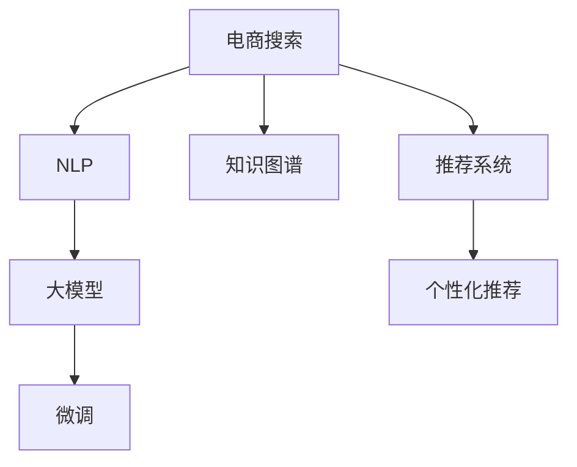

                 

# 深度解析：大模型如何革新电商搜索体验

> 关键词：深度学习,大模型,电商搜索,自然语言处理(NLP),知识图谱,推荐系统,个性化推荐

## 1. 背景介绍

在现代电商领域，搜索体验无疑是决定用户购物成败的关键因素。好的搜索系统不仅能快速响应用户需求，还能根据用户历史行为和上下文信息，提供个性化、精准的推荐，极大地提升用户的购物效率和满意度。然而，传统的电商搜索系统往往依赖人工制定的规则和算法，难以跟上用户需求变化和商品信息的海量增长，导致推荐结果不够精准、个性化，用户体验不佳。

近年来，随着深度学习和大模型的兴起，电商搜索领域迎来了新的变革。通过对电商数据进行深度学习和大模型微调，可以构建更为智能、高效的搜索系统。大模型通过学习丰富的商品知识图谱，不仅能够理解和回答用户自然语言查询，还能进行精确的商品匹配和个性化推荐，极大地提升了电商搜索的体验和效率。

本文将从背景、核心概念、算法原理、实际操作、应用场景等多个方面，深入解析大模型在电商搜索中的革新应用，探讨其核心优势和面临的挑战。

## 2. 核心概念与联系

### 2.1 核心概念概述

为了更好地理解大模型在电商搜索中的应用，本节将介绍几个密切相关的核心概念：

- 电商搜索（E-commerce Search）：指用户在电商平台上输入查询词，通过搜索系统获取相关商品信息的交互过程。电商搜索的目的是提高商品发现效率，提升用户体验和满意度。

- 自然语言处理（Natural Language Processing, NLP）：指计算机理解和处理人类语言的技术，包括文本分类、情感分析、实体识别、机器翻译等任务。

- 知识图谱（Knowledge Graph, KG）：以结构化的三元组形式表示的语义知识库，用于构建实体间的关联网络，支持复杂的推理和查询。

- 推荐系统（Recommender System）：指通过分析用户行为和商品信息，为用户推荐相关商品的系统。推荐系统应用广泛，涉及商品推荐、新闻推荐、视频推荐等诸多场景。

- 个性化推荐（Personalized Recommendation）：指根据用户兴趣和行为，动态调整推荐策略，提供符合用户期望的商品，提升推荐效果和用户满意度。

- 大模型（Large Model）：指通过海量的无标签数据进行预训练，学习丰富的知识表示的深度学习模型。常见的大模型包括BERT、GPT、T5等。

- 微调（Fine-tuning）：指在预训练模型基础上，使用特定任务的数据进行优化，提升模型在该任务上的性能。

这些核心概念之间的逻辑关系可以通过以下Mermaid流程图来展示：



这个流程图展示了电商搜索系统和大模型的关系：

1. 电商搜索通过NLP技术理解用户查询，从知识图谱中获取商品信息。
2. 大模型通过预训练学习丰富的商品知识图谱，支持NLP任务的实现。
3. 微调进一步优化大模型在电商搜索任务上的表现。
4. 推荐系统根据微调后的大模型结果，提供个性化推荐。

## 3. 核心算法原理 & 具体操作步骤

### 3.1 算法原理概述

基于大模型的电商搜索系统，通过微调技术，将预训练的大模型适配到电商搜索任务上，从而获得更好的商品匹配和推荐能力。其核心思想是：

1. 收集电商平台上用户的历史搜索行为、浏览记录、购买历史等数据，构建标注数据集。

2. 对预训练的大模型进行微调，使其能够理解电商搜索中的自然语言查询，并从商品知识图谱中检索相关商品。

3. 利用微调后的模型进行商品匹配和推荐，提升搜索效率和用户满意度。

### 3.2 算法步骤详解

#### 3.2.1 数据准备

首先，需要收集电商搜索系统的用户行为数据，构建标注数据集。标注数据集应包含用户查询、商品信息、标签等信息，用于训练和评估微调后的模型。

#### 3.2.2 模型微调

接着，选择适合电商搜索任务的大模型，如BERT、GPT等，作为初始模型。在大模型的顶层添加任务适配层，如分类器或解码器，用于处理查询和检索任务。

然后，设置微调的超参数，如学习率、批大小、迭代轮数等。使用标注数据集进行有监督训练，通过反向传播更新模型参数，最小化损失函数。

#### 3.2.3 推荐系统集成

最后，将微调后的模型集成到推荐系统中，根据用户历史行为和查询结果，动态调整推荐策略，输出符合用户期望的商品列表。

### 3.3 算法优缺点

#### 3.3.1 优点

- **精度高**：大模型通过预训练学习丰富的知识表示，微调后的模型能够更准确地理解用户查询和商品信息，提供精准的商品推荐。
- **泛化能力强**：大模型具有较强的泛化能力，能够适应不同的电商应用场景和商品信息变化。
- **可解释性高**：大模型通过微调过程，能够学习到用户查询和商品信息间的关联关系，提供更加可信的推荐结果。
- **高效性**：大模型通过并行计算，可以加速推荐系统的处理速度，提升用户体验。

#### 3.3.2 缺点

- **数据依赖性高**：微调的效果依赖于标注数据集的质量和数量，标注数据集的不足可能导致模型性能下降。
- **计算资源消耗大**：大模型的预训练和微调需要大量计算资源，不适合对资源有限的企业应用。
- **部署复杂**：大模型的微调过程复杂，需要专业知识进行配置和维护。

### 3.4 算法应用领域

大模型在电商搜索中的应用，已经在众多电商平台得到广泛应用。具体而言，包括以下几个方面：

- 商品推荐：通过微调大模型，提供基于用户历史行为和查询结果的商品推荐。
- 智能客服：利用微调后的模型，提供智能客服系统，解答用户查询。
- 个性化营销：根据用户行为数据，动态调整广告投放策略，提高广告效果。
- 风险控制：通过微调大模型，进行欺诈检测、信用评分等风险控制。

## 4. 数学模型和公式 & 详细讲解 & 举例说明

### 4.1 数学模型构建

假设电商搜索任务为查询-商品匹配任务，用户查询为 $q$，商品为 $p$，标注为 $y$。对于每个样本 $(x_i, y_i)$，其中 $x_i = (q_i, p_i)$ 表示查询-商品对，$y_i$ 表示匹配标签。

记预训练的大模型为 $M_{\theta}$，其中 $\theta$ 为模型参数。微调的目标是最小化标注数据集上的损失函数，即：

$$
\min_{\theta} \frac{1}{N}\sum_{i=1}^N \ell(M_{\theta}(x_i), y_i)
$$

其中 $\ell$ 为损失函数，如交叉熵损失或均方误差损失。

### 4.2 公式推导过程

假设微调后的模型为 $M_{\hat{\theta}} = M_{\theta}^{NLP} \times M_{\theta}^{KG}$，其中 $M_{\theta}^{NLP}$ 为处理自然语言查询的模型，$M_{\theta}^{KG}$ 为处理知识图谱的模型。

对于查询 $q$，通过自然语言处理模型 $M_{\theta}^{NLP}$ 得到查询向量 $q^v$，通过知识图谱模型 $M_{\theta}^{KG}$ 得到商品向量 $p^v$。模型的预测结果为 $y^{\hat{\theta}} = M_{\hat{\theta}}(q^v, p^v)$。

微调过程中，使用交叉熵损失函数计算损失：

$$
\ell = -(y\log y^{\hat{\theta}} + (1-y)\log (1-y^{\hat{\theta}}))
$$

其中 $y^{\hat{\theta}} = M_{\hat{\theta}}(q^v, p^v)$。

通过梯度下降等优化算法，更新模型参数 $\theta$，最小化损失函数。

### 4.3 案例分析与讲解

以下以商品推荐为例，给出具体案例分析：

假设用户查询为“女款皮包”，商品知识图谱中包含商品的属性（品牌、颜色、材质等）。使用BERT模型进行微调，得到查询向量 $q^v$ 和商品向量 $p^v$。

在商品推荐场景中，通过比较查询向量与商品向量的相似度，选择相似度最高的商品作为推荐结果。假设向量相似度计算方法为余弦相似度，则推荐结果 $r$ 为：

$$
r = \frac{q^v \cdot p^v}{\|q^v\|\|p^v\|}
$$

其中 $\cdot$ 表示向量点乘，$\|q^v\|$ 表示向量 $q^v$ 的模长。

通过这种方式，微调后的模型能够提供基于用户查询的个性化推荐，提高电商搜索的效率和用户体验。

## 5. 项目实践：代码实例和详细解释说明

### 5.1 开发环境搭建

在实践中，我们需要准备好开发环境。以下是使用Python进行PyTorch开发的环境配置流程：

1. 安装Anaconda：从官网下载并安装Anaconda，用于创建独立的Python环境。

2. 创建并激活虚拟环境：
```bash
conda create -n pytorch-env python=3.8 
conda activate pytorch-env
```

3. 安装PyTorch：根据CUDA版本，从官网获取对应的安装命令。例如：
```bash
conda install pytorch torchvision torchaudio cudatoolkit=11.1 -c pytorch -c conda-forge
```

4. 安装Transformers库：
```bash
pip install transformers
```

5. 安装各类工具包：
```bash
pip install numpy pandas scikit-learn matplotlib tqdm jupyter notebook ipython
```

完成上述步骤后，即可在`pytorch-env`环境中开始微调实践。

### 5.2 源代码详细实现

下面我们以商品推荐任务为例，给出使用Transformers库对BERT模型进行微调的PyTorch代码实现。

首先，定义商品推荐任务的数据处理函数：

```python
from transformers import BertTokenizer
from torch.utils.data import Dataset
import torch

class RecommendationDataset(Dataset):
    def __init__(self, queries, items, labels, tokenizer, max_len=128):
        self.queries = queries
        self.items = items
        self.labels = labels
        self.tokenizer = tokenizer
        self.max_len = max_len
        
    def __len__(self):
        return len(self.queries)
    
    def __getitem__(self, item):
        query = self.queries[item]
        item = self.items[item]
        label = self.labels[item]
        
        encoding = self.tokenizer(query, return_tensors='pt', max_length=self.max_len, padding='max_length', truncation=True)
        input_ids = encoding['input_ids'][0]
        attention_mask = encoding['attention_mask'][0]
        
        # 对商品信息进行编码
        item_encoding = self.tokenizer(item, return_tensors='pt', max_length=self.max_len, padding='max_length', truncation=True)
        item_input_ids = item_encoding['input_ids'][0]
        item_attention_mask = item_encoding['attention_mask'][0]
        
        return {'input_ids': input_ids, 
                'attention_mask': attention_mask,
                'item_input_ids': item_input_ids,
                'item_attention_mask': item_attention_mask,
                'labels': label}

# 创建dataset
tokenizer = BertTokenizer.from_pretrained('bert-base-cased')

train_dataset = RecommendationDataset(train_queries, train_items, train_labels, tokenizer)
dev_dataset = RecommendationDataset(dev_queries, dev_items, dev_labels, tokenizer)
test_dataset = RecommendationDataset(test_queries, test_items, test_labels, tokenizer)
```

然后，定义模型和优化器：

```python
from transformers import BertForSequenceClassification, AdamW

model = BertForSequenceClassification.from_pretrained('bert-base-cased', num_labels=2)

optimizer = AdamW(model.parameters(), lr=2e-5)
```

接着，定义训练和评估函数：

```python
from torch.utils.data import DataLoader
from tqdm import tqdm
from sklearn.metrics import classification_report

device = torch.device('cuda') if torch.cuda.is_available() else torch.device('cpu')
model.to(device)

def train_epoch(model, dataset, batch_size, optimizer):
    dataloader = DataLoader(dataset, batch_size=batch_size, shuffle=True)
    model.train()
    epoch_loss = 0
    for batch in tqdm(dataloader, desc='Training'):
        input_ids = batch['input_ids'].to(device)
        attention_mask = batch['attention_mask'].to(device)
        item_input_ids = batch['item_input_ids'].to(device)
        item_attention_mask = batch['item_attention_mask'].to(device)
        labels = batch['labels'].to(device)
        model.zero_grad()
        outputs = model(input_ids, attention_mask=attention_mask, item_input_ids=item_input_ids, item_attention_mask=item_attention_mask)
        loss = outputs.loss
        epoch_loss += loss.item()
        loss.backward()
        optimizer.step()
    return epoch_loss / len(dataloader)

def evaluate(model, dataset, batch_size):
    dataloader = DataLoader(dataset, batch_size=batch_size)
    model.eval()
    preds, labels = [], []
    with torch.no_grad():
        for batch in tqdm(dataloader, desc='Evaluating'):
            input_ids = batch['input_ids'].to(device)
            attention_mask = batch['attention_mask'].to(device)
            item_input_ids = batch['item_input_ids'].to(device)
            item_attention_mask = batch['item_attention_mask'].to(device)
            batch_labels = batch['labels']
            outputs = model(input_ids, attention_mask=attention_mask, item_input_ids=item_input_ids, item_attention_mask=item_attention_mask)
            batch_preds = outputs.logits.argmax(dim=2).to('cpu').tolist()
            batch_labels = batch_labels.to('cpu').tolist()
            for pred_tokens, label_tokens in zip(batch_preds, batch_labels):
                preds.append(pred_tokens[:len(label_tokens)])
                labels.append(label_tokens)
                
    print(classification_report(labels, preds))
```

最后，启动训练流程并在测试集上评估：

```python
epochs = 5
batch_size = 16

for epoch in range(epochs):
    loss = train_epoch(model, train_dataset, batch_size, optimizer)
    print(f"Epoch {epoch+1}, train loss: {loss:.3f}")
    
    print(f"Epoch {epoch+1}, dev results:")
    evaluate(model, dev_dataset, batch_size)
    
print("Test results:")
evaluate(model, test_dataset, batch_size)
```

以上就是使用PyTorch对BERT进行商品推荐任务微调的完整代码实现。可以看到，得益于Transformers库的强大封装，我们可以用相对简洁的代码完成BERT模型的加载和微调。

### 5.3 代码解读与分析

让我们再详细解读一下关键代码的实现细节：

**RecommendationDataset类**：
- `__init__`方法：初始化查询、商品、标签等关键组件。
- `__len__`方法：返回数据集的样本数量。
- `__getitem__`方法：对单个样本进行处理，将查询输入编码为token ids，将商品信息输入编码为token ids，并对其进行定长padding，最终返回模型所需的输入。

**tokenizer**：
- 定义了查询和商品信息的编码器，用于将输入文本转换为模型所需的格式。

**训练和评估函数**：
- 使用PyTorch的DataLoader对数据集进行批次化加载，供模型训练和推理使用。
- 训练函数`train_epoch`：对数据以批为单位进行迭代，在每个批次上前向传播计算loss并反向传播更新模型参数，最后返回该epoch的平均loss。
- 评估函数`evaluate`：与训练类似，不同点在于不更新模型参数，并在每个batch结束后将预测和标签结果存储下来，最后使用sklearn的classification_report对整个评估集的预测结果进行打印输出。

**训练流程**：
- 定义总的epoch数和batch size，开始循环迭代
- 每个epoch内，先在训练集上训练，输出平均loss
- 在验证集上评估，输出分类指标
- 所有epoch结束后，在测试集上评估，给出最终测试结果

可以看到，PyTorch配合Transformers库使得BERT微调的代码实现变得简洁高效。开发者可以将更多精力放在数据处理、模型改进等高层逻辑上，而不必过多关注底层的实现细节。

当然，工业级的系统实现还需考虑更多因素，如模型的保存和部署、超参数的自动搜索、更灵活的任务适配层等。但核心的微调范式基本与此类似。

## 6. 实际应用场景

### 6.1 智能客服系统

基于大模型微调的对话技术，可以广泛应用于智能客服系统的构建。传统客服往往需要配备大量人力，高峰期响应缓慢，且一致性和专业性难以保证。而使用微调后的对话模型，可以7x24小时不间断服务，快速响应客户咨询，用自然流畅的语言解答各类常见问题。

在技术实现上，可以收集企业内部的历史客服对话记录，将问题和最佳答复构建成监督数据，在此基础上对预训练对话模型进行微调。微调后的对话模型能够自动理解用户意图，匹配最合适的答案模板进行回复。对于客户提出的新问题，还可以接入检索系统实时搜索相关内容，动态组织生成回答。如此构建的智能客服系统，能大幅提升客户咨询体验和问题解决效率。

### 6.2 金融舆情监测

金融机构需要实时监测市场舆论动向，以便及时应对负面信息传播，规避金融风险。传统的人工监测方式成本高、效率低，难以应对网络时代海量信息爆发的挑战。基于大语言模型微调的文本分类和情感分析技术，为金融舆情监测提供了新的解决方案。

具体而言，可以收集金融领域相关的新闻、报道、评论等文本数据，并对其进行主题标注和情感标注。在此基础上对预训练语言模型进行微调，使其能够自动判断文本属于何种主题，情感倾向是正面、中性还是负面。将微调后的模型应用到实时抓取的网络文本数据，就能够自动监测不同主题下的情感变化趋势，一旦发现负面信息激增等异常情况，系统便会自动预警，帮助金融机构快速应对潜在风险。

### 6.3 个性化推荐系统

当前的推荐系统往往只依赖用户的历史行为数据进行物品推荐，无法深入理解用户的真实兴趣偏好。基于大语言模型微调技术，个性化推荐系统可以更好地挖掘用户行为背后的语义信息，从而提供更加精准、多样的推荐内容。

在实践中，可以收集用户浏览、点击、评论、分享等行为数据，提取和用户交互的物品标题、描述、标签等文本内容。将文本内容作为模型输入，用户的后续行为（如是否点击、购买等）作为监督信号，在此基础上微调预训练语言模型。微调后的模型能够从文本内容中准确把握用户的兴趣点。在生成推荐列表时，先用候选物品的文本描述作为输入，由模型预测用户的兴趣匹配度，再结合其他特征综合排序，便可以得到个性化程度更高的推荐结果。

### 6.4 未来应用展望

随着大语言模型微调技术的发展，其在电商搜索领域的应用前景广阔。未来，基于大模型的电商搜索系统将具备更强大的商品匹配和推荐能力，极大地提升用户的购物体验。

具体而言，未来可能出现以下发展趋势：

1. **跨模态搜索**：结合视觉、语音等多模态信息，构建更加智能化的搜索体验。
2. **上下文感知**：通过上下文信息增强查询理解，提供更加个性化、精准的推荐。
3. **实时更新**：基于实时数据进行动态微调，保持搜索结果的时效性。
4. **多任务学习**：结合商品推荐、广告投放等任务，提升搜索系统的综合价值。

这些趋势将进一步推动电商搜索系统的智能化进程，为用户提供更加优质、便捷的购物体验。

## 7. 工具和资源推荐

### 7.1 学习资源推荐

为了帮助开发者系统掌握大模型微调的理论基础和实践技巧，这里推荐一些优质的学习资源：

1. 《深度学习入门：基于Python的理论与实现》：入门深度学习的经典书籍，介绍了深度学习的基本概念和实现方法。

2. 《Transformers: From Attention to All Things》：Transformer原论文的作者所写，全面介绍了Transformer模型及其应用。

3. 《自然语言处理入门》课程：上海交通大学开设的NLP入门课程，涵盖了NLP的基本技术和前沿进展。

4. 《Recommender System: Exploration, Exploitation, and Prediction》：推荐系统领域的经典书籍，介绍了推荐系统的理论基础和实现方法。

5. 《Kaggle》：全球最大的数据科学竞赛平台，可以参与各类竞赛，积累实战经验。

通过对这些资源的学习实践，相信你一定能够快速掌握大模型微调的精髓，并用于解决实际的NLP问题。

### 7.2 开发工具推荐

高效的开发离不开优秀的工具支持。以下是几款用于大模型微调开发的常用工具：

1. PyTorch：基于Python的开源深度学习框架，灵活动态的计算图，适合快速迭代研究。

2. TensorFlow：由Google主导开发的开源深度学习框架，生产部署方便，适合大规模工程应用。

3. Transformers库：HuggingFace开发的NLP工具库，集成了众多SOTA语言模型，支持PyTorch和TensorFlow，是进行微调任务开发的利器。

4. Weights & Biases：模型训练的实验跟踪工具，可以记录和可视化模型训练过程中的各项指标，方便对比和调优。

5. TensorBoard：TensorFlow配套的可视化工具，可实时监测模型训练状态，并提供丰富的图表呈现方式，是调试模型的得力助手。

6. Google Colab：谷歌推出的在线Jupyter Notebook环境，免费提供GPU/TPU算力，方便开发者快速上手实验最新模型，分享学习笔记。

合理利用这些工具，可以显著提升大语言模型微调任务的开发效率，加快创新迭代的步伐。

### 7.3 相关论文推荐

大语言模型和微调技术的发展源于学界的持续研究。以下是几篇奠基性的相关论文，推荐阅读：

1. Attention is All You Need：提出了Transformer结构，开启了NLP领域的预训练大模型时代。

2. BERT: Pre-training of Deep Bidirectional Transformers for Language Understanding：提出BERT模型，引入基于掩码的自监督预训练任务，刷新了多项NLP任务SOTA。

3. Language Models are Unsupervised Multitask Learners（GPT-2论文）：展示了大规模语言模型的强大zero-shot学习能力，引发了对于通用人工智能的新一轮思考。

4. Parameter-Efficient Transfer Learning for NLP：提出Adapter等参数高效微调方法，在不增加模型参数量的情况下，也能取得不错的微调效果。

5. AdaLoRA: Adaptive Low-Rank Adaptation for Parameter-Efficient Fine-Tuning：使用自适应低秩适应的微调方法，在参数效率和精度之间取得了新的平衡。

这些论文代表了大语言模型微调技术的发展脉络。通过学习这些前沿成果，可以帮助研究者把握学科前进方向，激发更多的创新灵感。

## 8. 总结：未来发展趋势与挑战

### 8.1 总结

本文对基于大模型的电商搜索系统进行了全面系统的介绍。首先阐述了电商搜索的现状和需求，明确了大模型在电商搜索中的应用价值。其次，从原理到实践，详细讲解了基于大模型的电商搜索系统的核心算法和操作步骤，给出了微调任务开发的完整代码实例。同时，本文还探讨了大模型在电商搜索中的应用场景，展示了其核心优势和未来展望。

通过本文的系统梳理，可以看到，基于大模型的电商搜索系统在提升商品匹配和推荐能力、优化用户体验等方面具有巨大潜力。大模型通过微调技术，能够更好地理解用户查询和商品信息，提供精准的推荐结果，成为电商搜索系统的有力助手。

### 8.2 未来发展趋势

展望未来，大模型在电商搜索领域的应用将继续深入，呈现以下几个发展趋势：

1. **多模态融合**：结合视觉、语音等多模态信息，提供更加全面、精准的搜索体验。
2. **上下文感知**：通过上下文信息增强查询理解，提供更加个性化、精准的推荐。
3. **实时更新**：基于实时数据进行动态微调，保持搜索结果的时效性。
4. **多任务学习**：结合商品推荐、广告投放等任务，提升搜索系统的综合价值。
5. **跨领域应用**：大模型微调技术不仅仅适用于电商搜索，还可以应用于更多领域，如智能客服、个性化推荐等。

这些趋势将进一步推动大模型在电商搜索领域的应用，为用户带来更加优质、便捷的购物体验。

### 8.3 面临的挑战

尽管大模型在电商搜索领域具有广阔的应用前景，但在实际应用过程中，仍面临诸多挑战：

1. **数据质量问题**：电商搜索系统需要高质量的标注数据进行微调，标注数据的质量直接影响微调效果。标注数据的获取和处理成本高，且数据质量难以保证。
2. **计算资源消耗**：大模型的预训练和微调需要大量计算资源，不适合对资源有限的企业应用。
3. **模型可解释性**：大模型的决策过程缺乏可解释性，难以对其推理逻辑进行分析和调试。
4. **安全性问题**：电商搜索系统涉及用户隐私和商业机密，大模型微调后的系统需要具备高安全性和隐私保护能力。
5. **模型部署效率**：大模型的微调过程复杂，部署效率低下，需要更高效的模型压缩和优化技术。

这些挑战需要各方共同努力，通过技术创新和合作，才能解决。只有解决了这些挑战，大模型在电商搜索领域的应用才能真正落地，为电商企业带来显著的商业价值。

### 8.4 研究展望

面向未来，大模型微调技术需要在以下几个方面进行更深入的研究：

1. **数据增强技术**：通过数据增强技术，扩充训练集，提升模型的泛化能力。
2. **模型压缩与优化**：通过模型压缩和优化技术，减小模型的计算资源消耗，提高部署效率。
3. **可解释性提升**：研究提升大模型可解释性的方法，增强用户对系统的信任和接受度。
4. **隐私保护与安全**：研究大模型微调后的系统在隐私保护和安全方面的技术手段。
5. **多任务学习**：研究多任务学习技术，提升电商搜索系统的综合价值。

这些研究方向将推动大模型微调技术在电商搜索领域的不断进步，为电商企业带来更多的创新价值。

## 9. 附录：常见问题与解答

**Q1：电商搜索系统如何利用大模型进行商品推荐？**

A: 电商搜索系统利用大模型进行商品推荐的过程如下：

1. 收集电商平台上用户的历史搜索行为、浏览记录、购买历史等数据，构建标注数据集。
2. 选择适合电商搜索任务的大模型，如BERT、GPT等，作为初始模型。
3. 在大模型的顶层添加任务适配层，如分类器或解码器，用于处理查询和检索任务。
4. 使用标注数据集进行有监督训练，通过反向传播更新模型参数，最小化损失函数。
5. 在训练过程中，模型能够学习到用户查询和商品信息间的关联关系。
6. 在测试时，输入用户查询，通过大模型得到查询向量，从商品知识图谱中检索相关商品，生成推荐结果。

通过这种方式，大模型能够提供基于用户查询的个性化推荐，提高电商搜索的效率和用户体验。

**Q2：电商搜索系统如何利用大模型进行智能客服？**

A: 电商搜索系统利用大模型进行智能客服的过程如下：

1. 收集电商平台上用户的历史客服对话记录，将问题和最佳答复构建成监督数据。
2. 选择适合客服任务的大模型，如BERT、GPT等，作为初始模型。
3. 在大模型的顶层添加任务适配层，如解码器，用于处理对话生成任务。
4. 使用监督数据集进行有监督训练，通过反向传播更新模型参数，最小化损失函数。
5. 在测试时，输入用户查询，通过大模型生成智能回复。
6. 对于用户提出的新问题，可以接入检索系统实时搜索相关内容，动态生成回答。

通过这种方式，大模型能够自动理解用户意图，匹配最合适的回答，提供智能客服服务，提升客户咨询体验和问题解决效率。

**Q3：电商搜索系统如何利用大模型进行个性化推荐？**

A: 电商搜索系统利用大模型进行个性化推荐的过程如下：

1. 收集用户浏览、点击、评论、分享等行为数据，提取和用户交互的物品标题、描述、标签等文本内容。
2. 选择适合推荐任务的大模型，如BERT、GPT等，作为初始模型。
3. 在大模型的顶层添加任务适配层，如分类器或解码器，用于处理推荐任务。
4. 使用标注数据集进行有监督训练，通过反向传播更新模型参数，最小化损失函数。
5. 在测试时，输入用户查询，通过大模型得到查询向量，从商品知识图谱中检索相关商品，生成推荐结果。
6. 结合其他特征，如用户行为数据、商品属性等，综合排序，生成个性化推荐列表。

通过这种方式，大模型能够提供基于用户兴趣和行为的个性化推荐，提升用户满意度。

---

作者：禅与计算机程序设计艺术 / Zen and the Art of Computer Programming

