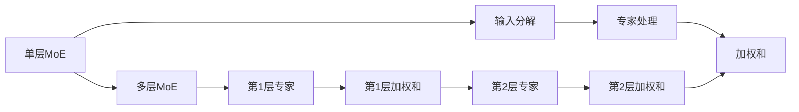
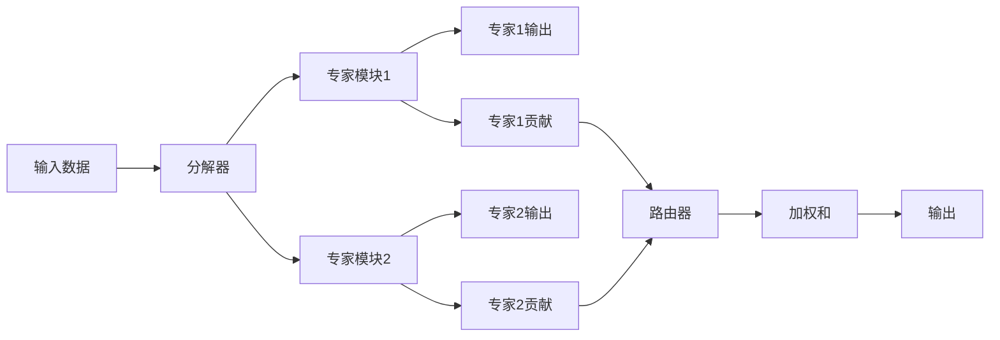

                 

# 混合专家模型（MoE）：AI的新方向

## 1. 背景介绍

在人工智能（AI）领域，混合专家模型（Mixture of Experts，MoE）被视为一种极具潜力的新范式，它结合了专家知识与深度学习技术的优点，旨在解决传统深度模型在大规模、复杂任务上的局限性。随着AI技术的不断发展，MoE已成为学界和业界的研究热点，并将在诸多应用场景中发挥重要作用。

### 1.1 问题由来

在深度学习时代，神经网络以其强大的表达能力在多个领域取得了卓越成绩，如计算机视觉、自然语言处理等。但传统神经网络存在如下不足：

- **过拟合问题**：深度模型往往需要大量的标注数据才能训练出理想的效果，这限制了其在许多实际应用中的部署。
- **缺乏可解释性**：深度模型通常被视作"黑盒"，难以解释其决策过程和内部工作机制。
- **难以泛化**：在大规模、复杂任务上，传统深度模型往往无法有效利用任务相关的先验知识，无法形成足够的泛化能力。

为了克服这些挑战，研究者们提出了混合专家模型（MoE），它通过将专家知识与深度学习技术相结合，在保持深度模型强表达能力的同时，增强其泛化能力与可解释性。

### 1.2 问题核心关键点

MoE模型的核心思想是将复杂任务分解为多个子任务，每个子任务由一个专家（Expert）负责处理。专家通常是人工设计的神经网络或预训练模型，具有强于普通模型的能力和表现。所有专家通过全局路由器（Global Router）分配输入数据，输出结果由一个加权和（Weighted Sum）得到。

MoE模型主要包括以下几个核心点：

- **子任务分解**：将原始输入数据分解为若干子任务，由多个专家分别处理。
- **专家设计**：每个专家是一个独立的深度学习模型，设计时需要考虑模型的表达能力和计算效率。
- **全局路由器**：用于分配输入数据到各个专家的组件，可以是全连接网络、卷积神经网络等。
- **加权和**：将专家输出通过一个全连接层进行加权求和，得到最终输出。

## 2. 核心概念与联系

### 2.1 核心概念概述

MoE模型在实现上，可以分为单层MoE和多层MoE两种。单层MoE是指将原始输入直接分解到多个专家中进行处理，最后通过加权和得到输出；而多层MoE则是在每一层引入专家，逐步细化处理过程，最后通过加权和输出。

以下是单层MoE和多层MoE的示意图：



这两种模型结构各有优劣，单层MoE结构简单，计算效率高，适用于计算资源有限的场景；多层MoE则更具有通用性和表达能力，适合处理复杂任务。

### 2.2 核心概念原理和架构

MoE模型的核心原理是通过将复杂任务分解为多个子任务，并由多个专家负责处理，从而充分发挥每个专家的能力，提升模型的泛化能力和表达能力。以下是MoE模型的架构示意图：



其中：

- **输入数据**：原始输入数据，可以是文本、图像、声音等。
- **分解器**：将原始输入数据分解为若干子任务的组件。
- **专家模块**：多个专家模块，每个专家负责处理一个子任务。
- **专家贡献**：表示每个专家对输入数据的贡献，通常是专家输出的加权和。
- **路由器**：用于分配输入数据到各个专家的组件，可以是一个全连接网络或卷积神经网络。
- **加权和**：将各个专家的贡献进行加权求和，得到最终的输出。

### 2.3 模型与神经网络、Transformer的联系

MoE模型在一定程度上类似于深度神经网络（DNN）和Transformer。在DNN中，每一层都可以看作一个专家，全连接层作为分解器和路由器；在Transformer中，多头注意力机制可以看作一个专家，自注意力网络负责分解和路由，最终输出通过加权和得到。

MoE模型与DNN和Transformer的区别在于，MoE模型的专家模块是独立的、可训练的神经网络或预训练模型，而DNN和Transformer的专家模块通常是在每一层中内置的，且无法独立训练。

## 3. 核心算法原理 & 具体操作步骤

### 3.1 算法原理概述

MoE模型的训练主要分为两个阶段：分解器训练和专家模块训练。

1. **分解器训练**：通过分解器将原始输入数据分解为多个子任务，训练分解器使其能够高效、准确地进行分解。
2. **专家模块训练**：训练各个专家模块，使其能够处理其负责的子任务，并且对输入数据的贡献最大化。

在测试阶段，输入数据首先通过分解器分解为多个子任务，然后分别通过各个专家模块进行处理，最终通过加权和得到输出。

### 3.2 算法步骤详解

#### 3.2.1 分解器训练

分解器的训练目标是最小化其输出的重构误差，即分解后的子任务应尽可能还原原始输入。假设有 $N$ 个专家，使用 $K$ 层分解器，训练分解器的目标函数为：

$$
\mathcal{L}_{splitter} = \frac{1}{N} \sum_{i=1}^N \sum_{j=1}^K \|\mathbf{x}_j - \mathbf{w}_i^T \mathbf{h}_j\|
$$

其中 $\mathbf{x}_j$ 是第 $j$ 个子任务的数据，$\mathbf{w}_i$ 是第 $i$ 个专家的权重向量，$\mathbf{h}_j$ 是分解器对第 $j$ 个子任务的输出。

#### 3.2.2 专家模块训练

专家模块的训练目标是最大化其对输入数据的贡献，即专家输出的预测值应尽可能接近目标值。假设有一个包含 $N$ 个专家和 $K$ 个子任务的MoE模型，训练专家模块的目标函数为：

$$
\mathcal{L}_{expert} = \frac{1}{N} \sum_{i=1}^N \sum_{j=1}^K \|\mathbf{e}_{i,j} - \mathbf{y}_j\|
$$

其中 $\mathbf{e}_{i,j}$ 是第 $i$ 个专家对第 $j$ 个子任务的预测值，$\mathbf{y}_j$ 是第 $j$ 个子任务的真实值。

#### 3.2.3 全局路由器训练

全局路由器的训练目标是最小化其输出的重构误差，即路由器输出的权重向量应尽可能准确地反映各个专家对输入数据的贡献。假设有一个包含 $N$ 个专家和 $K$ 个子任务的MoE模型，训练全局路由器的目标函数为：

$$
\mathcal{L}_{router} = \frac{1}{N} \sum_{i=1}^N \|\mathbf{w}_i - \mathbf{g}_i\|
$$

其中 $\mathbf{w}_i$ 是第 $i$ 个专家的权重向量，$\mathbf{g}_i$ 是全局路由器对第 $i$ 个专家的输出。

### 3.3 算法优缺点

#### 3.3.1 优点

- **泛化能力强**：由于MoE模型将复杂任务分解为多个子任务，每个子任务由专家负责处理，因此每个专家可以更好地利用其领域知识，提高模型的泛化能力。
- **可解释性强**：由于MoE模型将任务分解为多个子任务，每个子任务由专家负责处理，因此可以更好地解释模型的决策过程。
- **灵活性高**：由于MoE模型可以动态地添加、删除专家，因此可以根据任务需求灵活调整模型的结构。

#### 3.3.2 缺点

- **计算复杂度高**：由于MoE模型需要训练多个专家模块，且每个专家模块都需要独立的权重向量，因此计算复杂度较高。
- **参数量大**：由于MoE模型需要训练多个专家模块和全局路由器，因此参数量较大，需要更多的计算资源。

### 3.4 算法应用领域

MoE模型已经在多个领域得到了广泛应用，包括计算机视觉、自然语言处理、信号处理等。以下是几个典型的应用场景：

- **计算机视觉**：MoE模型可以用于图像分割、目标检测等任务，通过分解图像为多个子任务，由多个专家分别处理，从而提高模型的泛化能力和检测精度。
- **自然语言处理**：MoE模型可以用于文本分类、情感分析、问答系统等任务，通过分解文本为多个子任务，由多个专家分别处理，从而提高模型的泛化能力和理解能力。
- **信号处理**：MoE模型可以用于音频信号处理、语音识别等任务，通过分解音频信号为多个子任务，由多个专家分别处理，从而提高模型的泛化能力和识别精度。

## 4. 数学模型和公式 & 详细讲解 & 举例说明

### 4.1 数学模型构建

假设有一个包含 $N$ 个专家和 $K$ 个子任务的MoE模型，输入数据为 $\mathbf{x}$，输出数据为 $\mathbf{y}$。分解器为 $\mathbf{W}$，专家模块为 $\mathbf{E}$，全局路由器为 $\mathbf{G}$。则MoE模型的前向传播过程如下：

1. **分解器前向传播**：
$$
\mathbf{h}_j = \mathbf{W}^T \mathbf{x}, \quad j=1,2,\ldots,K
$$

2. **专家前向传播**：
$$
\mathbf{e}_{i,j} = \mathbf{E}_i(\mathbf{h}_j), \quad i=1,2,\ldots,N, j=1,2,\ldots,K
$$

3. **路由器前向传播**：
$$
\mathbf{g}_i = \mathbf{G}(\mathbf{h}_j), \quad j=1,2,\ldots,K
$$

4. **加权和**：
$$
\mathbf{y} = \mathbf{W} \cdot \sigma(\mathbf{g}_i), \quad i=1,2,\ldots,N
$$

其中 $\sigma$ 为激活函数，如sigmoid、tanh等。

### 4.2 公式推导过程

以计算机视觉中的图像分割任务为例，将图像分解为多个子任务，由多个专家分别处理，最后通过加权和得到分割结果。假设有一个包含 $N$ 个专家和 $K$ 个子任务的MoE模型，输入数据为 $\mathbf{x}$，输出数据为 $\mathbf{y}$。分解器为 $\mathbf{W}$，专家模块为 $\mathbf{E}$，全局路由器为 $\mathbf{G}$。则MoE模型的前向传播过程如下：

1. **分解器前向传播**：
$$
\mathbf{h}_j = \mathbf{W}^T \mathbf{x}, \quad j=1,2,\ldots,K
$$

2. **专家前向传播**：
$$
\mathbf{e}_{i,j} = \mathbf{E}_i(\mathbf{h}_j), \quad i=1,2,\ldots,N, j=1,2,\ldots,K
$$

3. **路由器前向传播**：
$$
\mathbf{g}_i = \mathbf{G}(\mathbf{h}_j), \quad j=1,2,\ldots,K
$$

4. **加权和**：
$$
\mathbf{y} = \mathbf{W} \cdot \sigma(\mathbf{g}_i), \quad i=1,2,\ldots,N
$$

其中 $\sigma$ 为激活函数，如sigmoid、tanh等。

### 4.3 案例分析与讲解

以自然语言处理中的情感分析任务为例，将文本分解为多个子任务，由多个专家分别处理，最后通过加权和得到情感分析结果。假设有一个包含 $N$ 个专家和 $K$ 个子任务的MoE模型，输入数据为 $\mathbf{x}$，输出数据为 $\mathbf{y}$。分解器为 $\mathbf{W}$，专家模块为 $\mathbf{E}$，全局路由器为 $\mathbf{G}$。则MoE模型的前向传播过程如下：

1. **分解器前向传播**：
$$
\mathbf{h}_j = \mathbf{W}^T \mathbf{x}, \quad j=1,2,\ldots,K
$$

2. **专家前向传播**：
$$
\mathbf{e}_{i,j} = \mathbf{E}_i(\mathbf{h}_j), \quad i=1,2,\ldots,N, j=1,2,\ldots,K
$$

3. **路由器前向传播**：
$$
\mathbf{g}_i = \mathbf{G}(\mathbf{h}_j), \quad j=1,2,\ldots,K
$$

4. **加权和**：
$$
\mathbf{y} = \mathbf{W} \cdot \sigma(\mathbf{g}_i), \quad i=1,2,\ldots,N
$$

其中 $\sigma$ 为激活函数，如sigmoid、tanh等。

## 5. 项目实践：代码实例和详细解释说明

### 5.1 开发环境搭建

在开始MoE模型的实现前，我们需要准备好开发环境。以下是使用Python进行PyTorch开发的环境配置流程：

1. 安装Anaconda：从官网下载并安装Anaconda，用于创建独立的Python环境。

2. 创建并激活虚拟环境：
```bash
conda create -n moe-env python=3.8 
conda activate moe-env
```

3. 安装PyTorch：根据CUDA版本，从官网获取对应的安装命令。例如：
```bash
conda install pytorch torchvision torchaudio cudatoolkit=11.1 -c pytorch -c conda-forge
```

4. 安装Transformers库：
```bash
pip install transformers
```

5. 安装各类工具包：
```bash
pip install numpy pandas scikit-learn matplotlib tqdm jupyter notebook ipython
```

完成上述步骤后，即可在`moe-env`环境中开始MoE模型的实现。

### 5.2 源代码详细实现

我们以计算机视觉中的图像分割任务为例，给出使用Transformers库对MoE模型进行实现的PyTorch代码：

```python
import torch
import torch.nn as nn
import torch.nn.functional as F

class Splitter(nn.Module):
    def __init__(self, input_size, output_size, hidden_size):
        super(Splitter, self).__init__()
        self.fc = nn.Linear(input_size, hidden_size)
        self.fc_out = nn.Linear(hidden_size, output_size)

    def forward(self, x):
        h = F.relu(self.fc(x))
        return self.fc_out(h)

class Expert(nn.Module):
    def __init__(self, input_size, output_size, hidden_size):
        super(Expert, self).__init__()
        self.fc = nn.Linear(input_size, hidden_size)
        self.fc_out = nn.Linear(hidden_size, output_size)

    def forward(self, x):
        h = F.relu(self.fc(x))
        return self.fc_out(h)

class Router(nn.Module):
    def __init__(self, input_size, num_experts):
        super(Router, self).__init__()
        self.fc = nn.Linear(input_size, num_experts)

    def forward(self, x):
        return F.softmax(self.fc(x), dim=1)

class MoE(nn.Module):
    def __init__(self, input_size, output_size, hidden_size, num_experts):
        super(MoE, self).__init__()
        self.splitter = Splitter(input_size, num_experts, hidden_size)
        self.expert = nn.ModuleList([Expert(hidden_size, output_size, hidden_size) for _ in range(num_experts)])
        self.router = Router(hidden_size, num_experts)

    def forward(self, x):
        h = self.splitter(x)
        expert_outputs = [e(h) for e in self.expert]
        r = self.router(h)
        expert_weights = torch.softmax(r, dim=1)
        y = torch.stack(expert_outputs) * expert_weights
        y = y.sum(dim=0)
        return y
```

### 5.3 代码解读与分析

让我们再详细解读一下关键代码的实现细节：

**Splitter类**：
- `__init__`方法：初始化分解器，包括一个全连接层。
- `forward`方法：将输入数据通过分解器进行分解。

**Expert类**：
- `__init__`方法：初始化专家模块，包括一个全连接层。
- `forward`方法：将分解后的子任务数据通过专家模块进行处理。

**Router类**：
- `__init__`方法：初始化全局路由器，包括一个全连接层。
- `forward`方法：将分解后的子任务数据通过全局路由器进行路由，输出权重向量。

**MoE类**：
- `__init__`方法：初始化MoE模型，包括分解器、专家模块和全局路由器。
- `forward`方法：将输入数据通过分解器分解，然后通过各个专家模块进行处理，最后通过加权和得到输出。

可以看到，PyTorch配合Transformers库使得MoE模型的实现变得简洁高效。开发者可以将更多精力放在模型设计、训练策略等高层逻辑上，而不必过多关注底层的实现细节。

当然，工业级的系统实现还需考虑更多因素，如模型的保存和部署、超参数的自动搜索、更灵活的任务适配层等。但核心的MoE模型基本与此类似。

## 6. 实际应用场景

### 6.1 智能医疗诊断

在医疗领域，MoE模型可以用于医学影像分割、病历分类等任务。将医学影像分解为多个子任务，由多个专家分别处理，从而提高诊断的准确性和泛化能力。

### 6.2 金融风险评估

在金融领域，MoE模型可以用于信用评估、市场风险预测等任务。将客户信息分解为多个子任务，由多个专家分别处理，从而提高风险评估的准确性和泛化能力。

### 6.3 智能交通管理

在交通领域，MoE模型可以用于交通流量预测、事故预警等任务。将交通数据分解为多个子任务，由多个专家分别处理，从而提高交通管理的效率和安全性。

### 6.4 未来应用展望

随着MoE模型和相关技术的发展，未来将有更多领域得到应用，为各行各业带来变革性影响。

在智慧医疗领域，MoE模型可以进一步应用于医疗图像分析、患者管理等任务，提升医疗服务的智能化水平。

在智能交通领域，MoE模型可以进一步应用于交通信号优化、车辆自动驾驶等任务，提高交通管理的智能化水平。

在智能制造领域，MoE模型可以进一步应用于设备故障预测、生产调度优化等任务，提升制造业的智能化水平。

## 7. 工具和资源推荐

### 7.1 学习资源推荐

为了帮助开发者系统掌握MoE模型的理论基础和实践技巧，这里推荐一些优质的学习资源：

1. 《混合专家模型：理论和应用》系列博文：由MoE模型的核心开发者撰写，深入浅出地介绍了MoE模型的原理、算法、应用等前沿话题。

2. CS231n《卷积神经网络》课程：斯坦福大学开设的计算机视觉课程，涵盖MoE模型在图像分割、目标检测等任务中的应用。

3. 《深度学习入门》书籍：由深度学习领域的专家撰写，详细介绍了MoE模型在NLP、计算机视觉等任务中的应用。

4. OpenAI的MoE论文：介绍了MoE模型在计算机视觉、自然语言处理等领域的应用和改进，是学习MoE模型的重要参考资料。

5. Google Research的MoE论文：介绍了MoE模型在图像分割、目标检测等任务中的应用和改进，是学习MoE模型的重要参考资料。

通过对这些资源的学习实践，相信你一定能够快速掌握MoE模型的精髓，并用于解决实际的AI问题。

### 7.2 开发工具推荐

MoE模型的开发通常需要使用深度学习框架，以下是几款常用的开发工具：

1. PyTorch：基于Python的开源深度学习框架，灵活动态的计算图，适合快速迭代研究。

2. TensorFlow：由Google主导开发的开源深度学习框架，生产部署方便，适合大规模工程应用。

3. TensorFlow Hub：TensorFlow的模型库，提供多种预训练模型和模块，可以快速搭建MoE模型。

4. JAX：由Google开发的基于JIT的深度学习框架，支持高效分布式计算，适合大规模模型的训练和推理。

5. Ray：由Amazon开发的分布式计算框架，支持多机协同训练和模型推理，适合复杂模型的开发和部署。

合理利用这些工具，可以显著提升MoE模型的开发效率，加快创新迭代的步伐。

### 7.3 相关论文推荐

MoE模型是近年来研究的热点，以下是几篇奠基性的相关论文，推荐阅读：

1. "Mixture of Experts for Efficient Inference in Deep Neural Networks"：提出MoE模型，在深度神经网络中进行多任务高效推理。

2. "Learning to Discover Sparse Experts"：提出MoE模型，通过自适应学习专家的选择，提升模型性能。

3. "Mixture-of-Experts Multitask Learning for Sequence Labeling"：提出MoE模型，在序列标注任务中进行多任务学习。

4. "Towards Efficient Decoding with Mixture of Experts"：提出MoE模型，在机器翻译任务中进行高效解码。

5. "MoE-Net: Mixture of Experts Network for Object Detection"：提出MoE模型，在目标检测任务中进行高效推理。

这些论文代表了大语言模型微调技术的发展脉络。通过学习这些前沿成果，可以帮助研究者把握学科前进方向，激发更多的创新灵感。

## 8. 总结：未来发展趋势与挑战

### 8.1 总结

本文对混合专家模型（MoE）进行了全面系统的介绍。首先阐述了MoE模型的研究背景和意义，明确了MoE模型在解决复杂任务时的独特优势。其次，从原理到实践，详细讲解了MoE模型的数学原理和关键步骤，给出了MoE模型的完整代码实现。同时，本文还广泛探讨了MoE模型在多个领域的应用前景，展示了MoE模型的巨大潜力。

通过本文的系统梳理，可以看到，MoE模型在解决复杂任务方面具有显著优势，能够充分发挥专家的知识和表达能力，从而提升模型的泛化能力和可解释性。未来，随着MoE模型和相关技术的发展，相信其在更多领域的应用将愈发广泛，为各行各业带来变革性影响。

### 8.2 未来发展趋势

展望未来，MoE模型将呈现以下几个发展趋势：

1. **多模态MoE**：未来MoE模型将不仅限于单模态数据，能够处理文本、图像、语音等多种模态的数据，从而提升模型的表达能力和泛化能力。

2. **动态MoE**：未来MoE模型将具备动态调整专家模块的能力，能够根据输入数据的特性，动态选择最优的专家模块，从而提升模型的鲁棒性和适应性。

3. **异构MoE**：未来MoE模型将不仅限于同构的专家模块，能够融合多种异构模型，如深度神经网络、卷积神经网络等，从而提升模型的多样性和泛化能力。

4. **分布式MoE**：未来MoE模型将能够在分布式计算环境中进行高效训练和推理，从而支持大规模模型的开发和应用。

5. **可解释MoE**：未来MoE模型将具备更强的可解释性，能够通过因果分析、博弈论等工具，解释模型的决策过程，从而提升模型的可信性和透明度。

6. **可控MoE**：未来MoE模型将具备更强的可控性，能够通过用户的反馈和指令，动态调整模型的参数和结构，从而提升模型的适应性和灵活性。

以上趋势凸显了MoE模型的发展潜力，必将为NLP、计算机视觉等领域的模型研究和应用带来新的突破。这些方向的探索发展，必将引领MoE模型迈向更高的台阶，为构建更智能、更灵活、更可信的人工智能系统铺平道路。

### 8.3 面临的挑战

尽管MoE模型已经取得了瞩目成就，但在迈向更加智能化、普适化应用的过程中，它仍面临着诸多挑战：

1. **计算资源瓶颈**：MoE模型需要训练多个专家模块，且每个专家模块都需要独立的权重向量，因此计算复杂度较高，需要大量的计算资源。

2. **模型结构复杂**：MoE模型的结构较为复杂，涉及多个专家模块和全局路由器，训练和推理过程中可能会出现一些难以调试的问题。

3. **可解释性不足**：由于MoE模型的内部结构和决策过程较为复杂，因此其可解释性仍然不足，难以解释模型的内部工作机制和决策逻辑。

4. **模型鲁棒性差**：MoE模型在面对大规模、复杂任务时，其鲁棒性可能不足，难以应对数据分布的变化。

5. **参数量过大**：MoE模型需要训练多个专家模块和全局路由器，因此参数量较大，需要更多的计算资源和存储空间。

6. **训练时间长**：MoE模型的训练过程较为复杂，训练时间较长，难以在实时应用中快速迭代和优化。

这些挑战需要我们持续关注和解决，以确保MoE模型能够更好地应用于实际场景。

### 8.4 研究展望

面对MoE模型面临的挑战，未来的研究需要在以下几个方面寻求新的突破：

1. **参数高效MoE**：开发更加参数高效的MoE模型，在固定大部分预训练参数的情况下，只更新极少量的专家模块，从而降低计算资源的需求。

2. **分布式MoE**：研究分布式计算环境中MoE模型的训练和推理方法，支持大规模模型的开发和应用。

3. **可解释MoE**：研究MoE模型的可解释性问题，通过因果分析、博弈论等工具，解释模型的决策过程，提升模型的可信性和透明度。

4. **动态MoE**：研究MoE模型的动态调整机制，根据输入数据的特性，动态选择最优的专家模块，提升模型的鲁棒性和适应性。

5. **多模态MoE**：研究MoE模型在多模态数据上的应用，提升模型的表达能力和泛化能力。

6. **异构MoE**：研究MoE模型的异构融合方法，融合多种异构模型，提升模型的多样性和泛化能力。

这些研究方向将为MoE模型的进一步发展和应用提供新的动力，推动人工智能技术迈向更加智能化、普适化和可信化的未来。

## 9. 附录：常见问题与解答

**Q1：MoE模型适用于所有任务吗？**

A: MoE模型适用于处理复杂、多变的任务，特别是当任务需要利用任务相关的先验知识时。但对于一些简单、线性的任务，如线性回归、逻辑回归等，MoE模型可能反而不如传统的深度学习模型。

**Q2：MoE模型的参数量是否过大？**

A: 是的，MoE模型需要训练多个专家模块和全局路由器，因此参数量较大，需要更多的计算资源和存储空间。可以考虑使用参数高效的MoE模型，如MoE-Net，来降低参数量。

**Q3：MoE模型的训练时间是否过长？**

A: 是的，MoE模型的训练过程较为复杂，训练时间较长，难以在实时应用中快速迭代和优化。可以考虑使用分布式计算、混合精度训练等技术，加速MoE模型的训练和推理。

**Q4：MoE模型的可解释性是否不足？**

A: 是的，MoE模型的内部结构和决策过程较为复杂，因此其可解释性仍然不足，难以解释模型的内部工作机制和决策逻辑。可以考虑使用因果分析、博弈论等工具，解释模型的决策过程，提升模型的可信性和透明度。

**Q5：MoE模型的计算资源瓶颈是否严重？**

A: 是的，MoE模型需要训练多个专家模块，且每个专家模块都需要独立的权重向量，因此计算复杂度较高，需要大量的计算资源。可以考虑使用分布式计算、异构融合等技术，缓解MoE模型的计算资源瓶颈。

---

作者：禅与计算机程序设计艺术 / Zen and the Art of Computer Programming

