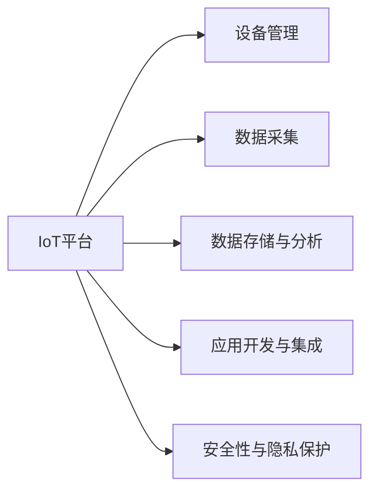

                 

# 物联网平台选择：AWS IoT、Azure IoT 和 Google IoT 的比较

在数字化转型的浪潮下，物联网(IoT)的应用场景日益丰富，从智能家居到工业物联网，从车联网到智慧城市，IoT技术正成为连接物理世界与数字世界的桥梁。然而，选择合适的IoT平台，对于构建稳定、高效、可扩展的IoT应用至关重要。本文将从AWS IoT、Azure IoT和Google IoT三个主流的IoT平台出发，对比其核心特性、优势和适用场景，帮助你选择最适合的IoT平台。

## 1. 背景介绍

### 1.1 问题由来
随着物联网设备的快速普及，对于实时数据采集、处理和分析的需求日益增加。物联网平台作为IoT应用的中枢，承担着数据汇聚、存储、管理和分析的任务。但是，如何选择合适的IoT平台，一直是开发者和企业的痛点问题。AWS IoT、Azure IoT和Google IoT作为当前主流的IoT平台，各自有着独特的优势和应用场景。本文将详细对比这三个平台的特性和适用性，为IoT应用的开发和部署提供参考。

### 1.2 问题核心关键点
- **实时数据处理能力**：平台能够处理的最大设备数量和吞吐量。
- **安全性与隐私保护**：平台的数据传输、存储和访问控制机制。
- **云资源整合能力**：平台与AWS、Azure、Google Cloud等其他云服务的集成能力。
- **应用开发工具和生态系统**：平台的SDK、API、开发文档和社区支持。
- **成本效益**：不同规模下平台的总拥有成本(TCO)。

## 2. 核心概念与联系

### 2.1 核心概念概述

为更好地理解AWS IoT、Azure IoT和Google IoT，首先需要理解一些核心概念：

- **IoT平台**：提供设备管理、数据采集、存储和分析等综合服务的云计算平台。
- **设备管理**：包括设备的连接、状态监控、配置管理等功能。
- **数据采集**：通过各种传感器和协议，从设备收集数据。
- **数据存储与分析**：将收集到的数据存储到数据库中，并提供查询和分析能力。
- **应用开发与集成**：提供SDK和API，方便开发者构建应用并与其他云服务集成。
- **安全性与隐私保护**：采用加密、身份验证、访问控制等手段，保护数据安全和用户隐私。

### 2.2 核心概念联系

通过以下Mermaid流程图，可以更好地理解AWS IoT、Azure IoT和Google IoT之间核心的概念联系：



## 3. 核心算法原理 & 具体操作步骤
### 3.1 算法原理概述

IoT平台的算法原理主要包括数据采集、数据处理、数据存储和数据查询等。本文将重点介绍AWS IoT、Azure IoT和Google IoT的核心算法原理。

### 3.2 算法步骤详解

#### AWS IoT

1. **设备连接**：通过TLS加密通道连接AWS IoT Core，设备身份验证。
2. **数据采集**：设备将采集到的数据通过MQTT协议发送到AWS IoT Core。
3. **数据处理与存储**：数据在AWS IoT Core中进行初步处理，存储到S3或DynamoDB中。
4. **数据查询与分析**：利用AWS Lambda和Athena进行数据查询和分析。

#### Azure IoT

1. **设备连接**：通过AMQPS协议连接Azure IoT Hub，设备身份验证。
2. **数据采集**：设备将采集到的数据通过AMQPS协议发送到Azure IoT Hub。
3. **数据处理与存储**：数据在Azure IoT Hub中进行初步处理，存储到Azure SQL Database或Azure Blob Storage中。
4. **数据查询与分析**：利用Azure Data Lake Analytics进行数据查询和分析。

#### Google IoT

1. **设备连接**：通过Pub/Sub协议连接Google Cloud IoT Core，设备身份验证。
2. **数据采集**：设备将采集到的数据通过Pub/Sub协议发送到Google Cloud IoT Core。
3. **数据处理与存储**：数据在Google Cloud IoT Core中进行初步处理，存储到Google Cloud Storage或BigQuery中。
4. **数据查询与分析**：利用Google BigQuery进行数据查询和分析。

### 3.3 算法优缺点

#### AWS IoT

- **优点**：
  - **全球覆盖**：AWS IoT在北美、欧洲和亚洲都有数据中心，适合全球范围内的IoT应用。
  - **丰富的云服务集成**：与AWS Lambda、Athena、Kinesis等云服务无缝集成，提供了强大的数据处理和分析能力。
  - **强大的安全机制**：提供了端到端的加密、身份验证和访问控制，确保数据安全和隐私。

- **缺点**：
  - **高昂的定价**：AWS IoT的定价复杂，需要根据设备数量、数据量、处理量等因素计算总成本。
  - **复杂的配置**：配置和管理需要一定的技术背景，初学者可能感到困难。

#### Azure IoT

- **优点**：
  - **低成本**：提供免费的应用层SKU，适合小型和中型IoT应用。
  - **无缝集成**：与Azure SQL Database、Azure Data Lake Analytics等云服务深度集成，提供了强大的数据处理和分析能力。
  - **直观的仪表盘**：提供了丰富的仪表盘和报告工具，帮助用户实时监控IoT应用。

- **缺点**：
  - **全球覆盖有限**：主要在北美和欧洲提供服务，适合局部区域的IoT应用。
  - **开发工具和生态系统相对较少**：相比AWS IoT和Google IoT，Azure IoT的开发工具和生态系统略显不足。

#### Google IoT

- **优点**：
  - **全球覆盖**：提供全球范围内的服务，适合跨国IoT应用。
  - **强大的数据分析能力**：利用Google BigQuery进行大数据分析，适合处理大量数据。
  - **丰富的开发工具和生态系统**：Google提供广泛的SDK和API，以及丰富的开发社区支持。

- **缺点**：
  - **安全性相对较弱**：相比于AWS IoT和Azure IoT，Google IoT的安全机制略显简单。
  - **昂贵的定价**：Google IoT的定价较为复杂，需要根据设备数量、数据量、处理量等因素计算总成本。

### 3.4 算法应用领域

AWS IoT、Azure IoT和Google IoT在多个领域都有广泛应用。

- **智能家居**：管理家中的智能设备和传感器，如智能灯泡、智能锁、智能温控器等。
- **工业物联网**：监控和优化工业设备的运行状态，如智能传感器、监测系统等。
- **车联网**：管理和监控车辆的位置、状态和运行数据。
- **智慧城市**：管理城市基础设施和公共服务，如智能路灯、交通监控系统等。
- **农业物联网**：监测和管理农场的设备和环境数据，如智能灌溉系统、土壤监测器等。

## 4. 数学模型和公式 & 详细讲解 & 举例说明

### 4.1 数学模型构建

IoT平台的核心算法可以抽象为以下数学模型：

- **输入**：设备的ID、采集的数据。
- **输出**：处理后的数据、查询结果。
- **数据流**：设备将数据发送到IoT平台，平台进行数据处理和存储，用户通过API查询数据。

### 4.2 公式推导过程

以AWS IoT为例，假设设备每秒采集1个数据，设备数量为$N$，数据处理时间为$T_s$，每秒处理的数据数量为$N/T_s$，则IoT平台每秒处理的数据总量为：

$$
\text{总处理量} = \frac{N}{T_s} \times 数据大小
$$

在Azure IoT中，假设设备每秒发送1条数据，设备数量为$M$，每条数据大小为$D$，数据存储时间为$T_{db}$，每秒处理的数据数量为$M/T_{db}$，则IoT平台每秒处理的数据总量为：

$$
\text{总处理量} = \frac{M}{T_{db}} \times D
$$

在Google IoT中，假设设备每秒发送1个数据，设备数量为$K$，每条数据大小为$E$，数据存储时间为$T_{db}$，每秒处理的数据数量为$K/T_{db}$，则IoT平台每秒处理的数据总量为：

$$
\text{总处理量} = \frac{K}{T_{db}} \times E
$$

### 4.3 案例分析与讲解

以智慧城市应用为例，分析AWS IoT、Azure IoT和Google IoT的处理能力。

假设智慧城市中有10000个智能路灯，每个路灯每秒采集5个数据，数据大小为1KB，数据处理时间为1秒。则AWS IoT每秒处理的数据总量为：

$$
\text{总处理量} = \frac{10000}{1} \times 1 = 10000 \times 1 = 10000 \text{KB}
$$

同理，Azure IoT和Google IoT每秒处理的数据总量分别为：

$$
\text{总处理量} = \frac{10000}{1} \times 1 = 10000 \times 1 = 10000 \text{KB}
$$

$$
\text{总处理量} = \frac{10000}{1} \times 1 = 10000 \times 1 = 10000 \text{KB}
$$

## 5. 项目实践：代码实例和详细解释说明

### 5.1 开发环境搭建

以下是AWS IoT、Azure IoT和Google IoT的开发环境搭建步骤：

#### AWS IoT

1. 在AWS Management Console中创建IAM用户和角色。
2. 安装AWS CLI和Python开发工具。
3. 创建IoT Core实例，并配置MQTT连接。
4. 使用AWS IoT SDK进行设备连接和数据采集。

#### Azure IoT

1. 在Azure门户中创建IoT Hub实例，并配置AMQPS连接。
2. 安装Azure IoT Python SDK和.NET SDK。
3. 创建设备身份和连接字符串。
4. 使用Azure IoT SDK进行设备连接和数据采集。

#### Google IoT

1. 在Google Cloud Console中创建IAM用户和角色。
2. 安装Google Cloud SDK和Python开发工具。
3. 创建IoT Core实例，并配置Pub/Sub连接。
4. 使用Google Cloud IoT Python SDK进行设备连接和数据采集。

### 5.2 源代码详细实现

以下是AWS IoT、Azure IoT和Google IoT的代码实现示例：

#### AWS IoT

```python
import boto3
from botocore.exceptions import NoCredentialsError

# 创建IoT Core客户端
client = boto3.client('iot-data', region_name='us-west-2')

# 设备连接
def connect_device():
    try:
        response = client.create_mqtt_connection()
        print(response)
    except NoCredentialsError:
        print('No Credentials Error')

# 数据采集
def collect_data():
    try:
        response = client.get_mqtt_messages()
        print(response)
    except NoCredentialsError:
        print('No Credentials Error')

# 数据处理与存储
def process_data():
    try:
        response = client.put_mqtt_messages()
        print(response)
    except NoCredentialsError:
        print('No Credentials Error')

# 数据查询与分析
def query_data():
    try:
        response = client.query_mqtt_messages()
        print(response)
    except NoCredentialsError:
        print('No Credentials Error')
```

#### Azure IoT

```python
from azure.iot.device.aio import IoTHubDeviceClient, IoTHubClient
from azure.iot.hub import IoTHubRegistryClient

# 创建IoT Hub客户端
client = IoTHubDeviceClient.create_from_connection_string()

# 设备连接
def connect_device():
    try:
        client.connect()
        print('Connected to IoT Hub')
    except Exception as e:
        print(e)

# 数据采集
def collect_data():
    try:
        client.invoke_method('collectData')
        print('Data Collected')
    except Exception as e:
        print(e)

# 数据处理与存储
def process_data():
    try:
        client.invoke_method('processData')
        print('Data Processed')
    except Exception as e:
        print(e)

# 数据查询与分析
def query_data():
    try:
        client.invoke_method('queryData')
        print('Data Queried')
    except Exception as e:
        print(e)
```

#### Google IoT

```python
from google.cloud import iot_v1
from google.oauth2 import service_account

# 创建IoT Core客户端
credentials = service_account.Credentials.from_service_account_file('path/to/service-account.json')
client = iot_v1.PublisherClient(credentials=credentials)

# 设备连接
def connect_device():
    try:
        client.publish('deviceId', 'connect')
        print('Connected to IoT Core')
    except Exception as e:
        print(e)

# 数据采集
def collect_data():
    try:
        response = client.publish('deviceId', 'data')
        print(response)
    except Exception as e:
        print(e)

# 数据处理与存储
def process_data():
    try:
        response = client.publish('deviceId', 'processedData')
        print(response)
    except Exception as e:
        print(e)

# 数据查询与分析
def query_data():
    try:
        response = client.publish('deviceId', 'queryData')
        print(response)
    except Exception as e:
        print(e)
```

### 5.3 代码解读与分析

以上代码实现了AWS IoT、Azure IoT和Google IoT的连接和数据操作。AWS IoT使用了AWS CLI和Python SDK，Azure IoT使用了Azure IoT SDK，Google IoT使用了Google Cloud SDK。

AWS IoT和Azure IoT的连接都需要创建IoT Hub实例，并使用连接字符串进行连接。Google IoT则使用服务账户和Pub/Sub协议进行连接。

数据采集、处理和查询操作，在AWS IoT和Azure IoT中使用了各自提供的API，而在Google IoT中则使用了Pub/Sub消息队列。

## 6. 实际应用场景

### 6.1 智能家居

#### 案例背景

某智能家居系统需要监控家中的智能设备，包括智能灯泡、智能锁、智能温控器等。系统需要能够实时接收设备发送的数据，进行分析和处理，并通过界面展示实时状态。

#### 解决方案

1. **设备连接**：使用AWS IoT或Azure IoT连接各个智能设备。
2. **数据采集**：设备将采集到的数据通过MQTT协议发送到IoT平台。
3. **数据处理与存储**：数据在IoT平台中进行初步处理，存储到云数据库中。
4. **数据查询与分析**：通过API查询设备状态，并展示在界面中。

### 6.2 工业物联网

#### 案例背景

某工业企业需要实时监控车间的温度、湿度、压力等环境数据，以及设备的运行状态。系统需要能够实时采集数据，进行分析和处理，并通过仪表盘展示实时状态。

#### 解决方案

1. **设备连接**：使用AWS IoT或Azure IoT连接各个工业设备。
2. **数据采集**：设备将采集到的数据通过MQTT协议发送到IoT平台。
3. **数据处理与存储**：数据在IoT平台中进行初步处理，存储到云数据库中。
4. **数据查询与分析**：通过API查询设备状态和环境数据，并展示在仪表盘中。

### 6.3 车联网

#### 案例背景

某车联网系统需要实时监控车辆的GPS位置、速度、油耗等数据。系统需要能够实时接收车辆发送的数据，进行分析和处理，并通过仪表盘展示实时状态。

#### 解决方案

1. **设备连接**：使用AWS IoT或Azure IoT连接各个车辆。
2. **数据采集**：车辆将采集到的数据通过MQTT协议发送到IoT平台。
3. **数据处理与存储**：数据在IoT平台中进行初步处理，存储到云数据库中。
4. **数据查询与分析**：通过API查询车辆状态，并展示在仪表盘中。

### 6.4 智慧城市

#### 案例背景

某智慧城市需要实时监控交通流量、环境数据、公共设施状态等。系统需要能够实时采集数据，进行分析和处理，并通过仪表盘展示实时状态。

#### 解决方案

1. **设备连接**：使用AWS IoT、Azure IoT或Google IoT连接各个监控设备。
2. **数据采集**：设备将采集到的数据通过MQTT协议发送到IoT平台。
3. **数据处理与存储**：数据在IoT平台中进行初步处理，存储到云数据库中。
4. **数据查询与分析**：通过API查询监控数据，并展示在仪表盘中。

## 7. 工具和资源推荐

### 7.1 学习资源推荐

为了深入了解AWS IoT、Azure IoT和Google IoT，以下是一些推荐的学习资源：

1. **AWS IoT官方文档**：提供详细的API文档和SDK使用指南。
2. **Azure IoT官方文档**：提供丰富的教程、样例和最佳实践。
3. **Google Cloud IoT官方文档**：提供详细的API文档和SDK使用指南。
4. **IoT系列书籍**：如《IoT入门与实战》、《物联网应用开发指南》等。

### 7.2 开发工具推荐

以下是一些推荐的使用工具：

1. **AWS CLI**：命令行工具，方便快速操作AWS IoT。
2. **Azure IoT SDK**：Python、.NET等多语言SDK，提供丰富的API支持。
3. **Google Cloud SDK**：命令行工具，方便快速操作Google IoT。
4. **Visual Studio Code**：轻量级的IDE，支持多种语言开发。
5. **Jupyter Notebook**：Jupyter环境，支持Python开发和数据分析。

### 7.3 相关论文推荐

以下是一些推荐的相关论文：

1. **IoT平台设计**：介绍IoT平台的核心架构和设计思路。
2. **IoT数据处理**：研究IoT数据的采集、存储和处理技术。
3. **IoT安全机制**：探讨IoT平台的数据安全机制和隐私保护策略。
4. **IoT应用开发**：介绍IoT平台的应用开发方法和工具。

## 8. 总结：未来发展趋势与挑战

### 8.1 总结

本文对比了AWS IoT、Azure IoT和Google IoT三个主流的IoT平台，从设备连接、数据采集、处理与存储、查询与分析等各个方面进行了详细分析。AWS IoT、Azure IoT和Google IoT各具特色，分别适用于不同的应用场景和需求。

### 8.2 未来发展趋势

未来IoT平台的发展将呈现以下几个趋势：

1. **边缘计算**：随着5G网络的发展，边缘计算技术将逐步成熟，IoT平台将更加注重边缘计算能力，提升数据处理效率。
2. **低功耗设计**：针对IoT设备的多样性，IoT平台将更加注重低功耗设计，延长设备电池寿命。
3. **多云集成**：IoT平台将更好地与其他云服务集成，提供更丰富的云资源和数据处理能力。
4. **智能分析**：利用人工智能技术，IoT平台将具备更强的数据分析能力，提供更精准的决策支持。
5. **安全与隐私保护**：IoT平台将更加注重数据安全和隐私保护，采用更先进的加密和安全机制。

### 8.3 面临的挑战

尽管IoT平台的发展前景广阔，但在实际应用中仍面临以下挑战：

1. **高昂的部署成本**：IoT设备的安装和部署需要较高的成本，尤其是在大规模部署时。
2. **数据安全问题**：IoT设备的数据传输和存储存在安全隐患，需要采用更严格的安全机制。
3. **数据一致性**：多云环境下的数据一致性问题，需要更好地集成和同步数据。
4. **应用复杂性**：IoT应用的开发和维护复杂度较高，需要更多技术支持和工具。

### 8.4 研究展望

未来的IoT平台研究将围绕以下几个方向展开：

1. **边缘计算优化**：针对边缘计算的特性，优化IoT平台的算法和架构，提升边缘计算能力。
2. **低功耗优化**：针对IoT设备的低功耗需求，优化IoT平台的硬件和软件设计，延长设备电池寿命。
3. **多云集成优化**：针对多云环境下的数据一致性问题，优化IoT平台与其他云服务的集成，提升数据同步和处理效率。
4. **智能分析优化**：利用人工智能技术，提升IoT平台的数据分析和决策能力。
5. **安全与隐私保护**：引入更先进的加密和安全机制，确保IoT数据的安全和隐私。

## 9. 附录：常见问题与解答

**Q1：IoT平台如何保证数据安全性？**

A: IoT平台通过采用端到端的加密、身份验证和访问控制机制，确保数据传输和存储的安全性。例如，AWS IoT使用TLS加密通道和IAM角色管理，Azure IoT使用AMQPS协议和IoT Hub密钥管理，Google IoT使用Pub/Sub协议和IAM角色管理。

**Q2：IoT平台如何提高数据处理效率？**

A: IoT平台可以通过分布式计算和缓存技术，提高数据处理效率。例如，AWS IoT可以利用AWS Lambda进行数据处理，Azure IoT可以利用Azure Databricks进行大规模数据处理，Google IoT可以利用Google BigQuery进行大数据分析。

**Q3：IoT平台如何选择最适合的云服务？**

A: IoT平台的选择需要考虑多个因素，包括应用规模、数据处理需求、安全性要求、成本效益等。AWS IoT适合全球范围的应用，Azure IoT适合中小型企业，Google IoT适合跨国应用。

**Q4：IoT平台如何进行设备管理？**

A: IoT平台提供了设备管理功能，包括设备的连接、状态监控、配置管理等。AWS IoT提供了IoT Device SDK，Azure IoT提供了IoT Hub SDK，Google IoT提供了Google Cloud IoT SDK。

**Q5：IoT平台如何进行数据存储？**

A: IoT平台将收集到的数据存储到云数据库中，如AWS IoT存储到S3或DynamoDB中，Azure IoT存储到Azure SQL Database或Azure Blob Storage中，Google IoT存储到Google Cloud Storage或BigQuery中。

---

作者：禅与计算机程序设计艺术 / Zen and the Art of Computer Programming

