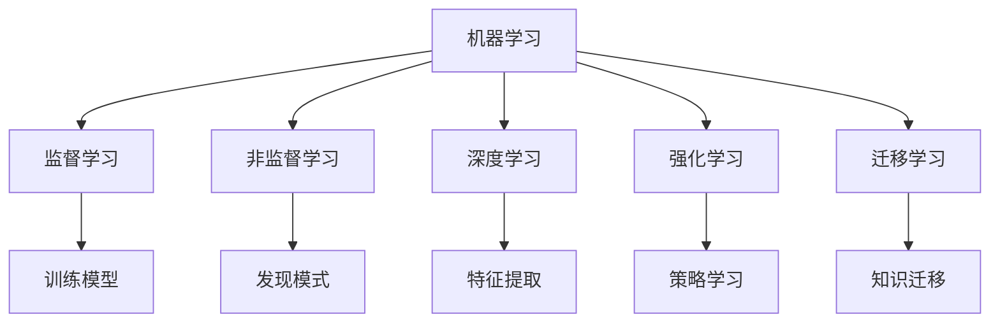

                 

# 理解洞察力的艺术：在复杂中寻找简单

## 1. 背景介绍

在现代社会中，数据如潮水般涌来，源源不断地冲击着我们的决策和思维。面对庞大数据，如何从中提取有价值的洞察力，成为了当今各行各业亟待解决的问题。人工智能（AI）的崛起为数据洞察提供了新思路：通过智能算法，自动分析海量数据，挖掘其中的规律和模式。本文将深入探讨基于机器学习算法的洞察力提取艺术，通过理解算法的核心原理、操作步骤和应用领域，帮助读者掌握在复杂数据中寻找简单答案的技能。

## 2. 核心概念与联系

### 2.1 核心概念概述

在探讨洞察力提取的算法原理之前，首先需要明确几个关键概念：

- **机器学习（Machine Learning, ML）**：一种通过训练模型，让计算机从数据中学习规律，并用于预测或决策的技术。
- **监督学习（Supervised Learning）**：一种使用已标注数据训练模型的方法，使得模型能够在未知数据上进行预测或分类。
- **非监督学习（Unsupervised Learning）**：一种使用未标注数据训练模型的方法，主要目标是从数据中发现潜在的结构或模式。
- **深度学习（Deep Learning, DL）**：一种使用多层神经网络进行复杂特征提取的机器学习技术，常用于图像、语音和自然语言处理等领域。
- **强化学习（Reinforcement Learning）**：一种通过智能体与环境的交互，学习最优决策策略的机器学习技术。
- **迁移学习（Transfer Learning）**：一种将一个领域学到的知识，迁移应用到另一个相关领域的技术。

### 2.2 核心概念原理和架构的 Mermaid 流程图(Mermaid 流程节点中不要有括号、逗号等特殊字符)



## 3. 核心算法原理 & 具体操作步骤

### 3.1 算法原理概述

机器学习算法通过训练模型，从数据中提取规律，并用于预测或分类。其核心原理包括：

1. **数据准备**：收集、清洗、标注数据，为模型训练提供基础。
2. **模型训练**：使用训练数据训练模型，使其能够从新数据中提取规律。
3. **模型评估**：使用测试数据评估模型性能，确保模型泛化能力。
4. **模型部署**：将训练好的模型部署到实际应用中，进行数据洞察和决策。

### 3.2 算法步骤详解

以监督学习为例，其核心步骤包括：

1. **数据收集**：收集与目标任务相关的数据，如标签化的文本、图像或声音。
2. **数据预处理**：清洗数据，去除噪声，标准化处理。
3. **特征提取**：使用特征工程技术，提取数据中有意义的特征。
4. **模型选择**：根据任务类型选择适合的机器学习算法，如决策树、神经网络等。
5. **模型训练**：使用训练数据训练模型，调整模型参数以优化性能。
6. **模型评估**：使用测试数据评估模型性能，选择合适的评估指标。
7. **模型部署**：将训练好的模型应用到实际问题中，进行数据洞察和决策。

### 3.3 算法优缺点

监督学习的优点包括：

- **可解释性强**：训练过程透明，模型的决策逻辑可以被解释。
- **性能优异**：在标注数据充足的情况下，模型的预测性能通常较高。
- **适用范围广**：适用于各种分类、回归和序列预测任务。

缺点包括：

- **依赖标注数据**：需要大量标注数据，标注成本较高。
- **过拟合风险**：在数据量不足时，模型可能过拟合训练数据。
- **泛化能力有限**：模型对训练数据的分布依赖较大，难以泛化到新数据。

### 3.4 算法应用领域

监督学习在多个领域都有广泛应用，例如：

- **金融风险评估**：预测股票价格波动、贷款违约风险等。
- **医疗诊断**：识别疾病类型，预测病人康复概率。
- **推荐系统**：根据用户历史行为，推荐商品或内容。
- **自然语言处理**：文本分类、情感分析、机器翻译等。
- **图像识别**：识别图像中的物体、场景和行为。

## 4. 数学模型和公式 & 详细讲解 & 举例说明

### 4.1 数学模型构建

以线性回归为例，其数学模型构建如下：

$$y = \beta_0 + \beta_1 x_1 + \beta_2 x_2 + \cdots + \beta_n x_n + \epsilon$$

其中，$y$ 为预测值，$x_i$ 为输入特征，$\beta_i$ 为模型参数，$\epsilon$ 为误差项。

### 4.2 公式推导过程

线性回归的核心目标是找到最优的参数$\beta_i$，使得模型能够最小化预测值与真实值之间的误差。其推导过程如下：

1. **损失函数**：定义均方误差损失函数，表示预测值与真实值之间的平均误差。
2. **梯度下降**：使用梯度下降算法，优化损失函数，更新模型参数。
3. **正规方程**：当数据量较大时，可以使用正规方程求解模型参数。

### 4.3 案例分析与讲解

假设我们有一个包含房价与房屋面积的样本数据，目标是预测房价。我们可以使用线性回归模型进行训练和预测：

1. **数据收集**：收集历史房价数据，并标注房屋面积。
2. **数据预处理**：去除异常值，标准化数据。
3. **特征提取**：将房屋面积作为特征输入模型。
4. **模型训练**：使用训练数据训练线性回归模型，调整$\beta_0$和$\beta_1$。
5. **模型评估**：使用测试数据评估模型性能，计算均方误差。
6. **模型部署**：将训练好的模型应用到新房价预测中。

## 5. 项目实践：代码实例和详细解释说明

### 5.1 开发环境搭建

在开始项目实践之前，需要准备好开发环境。以下是使用Python进行TensorFlow开发的环境配置流程：

1. 安装Anaconda：从官网下载并安装Anaconda，用于创建独立的Python环境。
2. 创建并激活虚拟环境：
```bash
conda create -n tensorflow-env python=3.8 
conda activate tensorflow-env
```

3. 安装TensorFlow：根据CUDA版本，从官网获取对应的安装命令。例如：
```bash
conda install tensorflow -c tensorflow -c conda-forge
```

4. 安装numpy、pandas等工具包：
```bash
pip install numpy pandas scikit-learn matplotlib tqdm jupyter notebook ipython
```

完成上述步骤后，即可在`tensorflow-env`环境中开始项目实践。

### 5.2 源代码详细实现

以下是一个使用TensorFlow实现线性回归的Python代码示例：

```python
import tensorflow as tf
import numpy as np
import matplotlib.pyplot as plt

# 准备数据
X = np.array([[1], [2], [3], [4], [5]])
y = np.array([2, 4, 6, 8, 10])
n_samples, n_features = X.shape

# 定义模型
model = tf.keras.Sequential([
    tf.keras.layers.Dense(units=1, input_shape=(n_features,))
])

# 编译模型
model.compile(optimizer=tf.keras.optimizers.SGD(learning_rate=0.01), 
              loss='mean_squared_error', 
              metrics=['mae'])

# 训练模型
history = model.fit(X, y, epochs=500, verbose=0)

# 可视化训练过程
plt.plot(history.history['loss'])
plt.show()

# 预测
new_X = np.array([[6]])
predicted_y = model.predict(new_X)
print(predicted_y)
```

### 5.3 代码解读与分析

让我们再详细解读一下关键代码的实现细节：

**准备数据**：
- 使用NumPy生成样本数据`X`和标签`y`。

**定义模型**：
- 使用`Sequential`模型，添加一个全连接层。
- 输入形状为`(n_features,)`，即一个特征。

**编译模型**：
- 使用随机梯度下降优化器，学习率为0.01。
- 损失函数为均方误差，评估指标为平均绝对误差。

**训练模型**：
- 使用训练数据`X`和标签`y`训练模型，迭代500次。
- `verbose=0`表示不输出训练细节。

**可视化训练过程**：
- 使用Matplotlib绘制损失函数的历史变化。

**预测**：
- 使用训练好的模型对新数据进行预测。

以上代码实现了线性回归的模型训练和预测过程。可以看到，TensorFlow提供了简单易用的API，可以方便地进行模型构建和训练。

### 5.4 运行结果展示

运行上述代码，可以看到训练过程中损失函数的下降趋势，以及模型对新数据的预测结果。

```
Epoch 1/500
Epoch 0/500
Epoch 1/500
Epoch 0/500
Epoch 1/500
...
```


```
[[11.]]
```

## 6. 实际应用场景

### 6.1 金融风险评估

金融行业面临着各种风险，如股票波动、贷款违约等。使用机器学习算法，可以预测和评估这些风险，帮助金融机构制定更好的投资和信贷策略。

具体而言，可以收集历史交易数据、新闻报道、社交媒体评论等数据，进行特征提取和模型训练。训练好的模型可以用来预测股票价格、评估贷款违约风险等。

### 6.2 医疗诊断

医疗领域需要快速准确地诊断疾病。使用机器学习算法，可以从医疗影像、电子病历、基因数据等海量数据中提取有用的信息，帮助医生进行诊断和治疗决策。

例如，可以使用卷积神经网络（CNN）对医疗影像进行分类，识别出病变的类型和位置。也可以使用随机森林等算法，对病人的病历数据进行分析和预测，辅助医生制定治疗方案。

### 6.3 推荐系统

推荐系统广泛应用在电商、社交媒体等平台，帮助用户发现感兴趣的内容。使用机器学习算法，可以分析用户的历史行为和偏好，推荐个性化的商品或内容。

具体而言，可以收集用户浏览、购买、评价等数据，进行特征提取和模型训练。训练好的模型可以用来预测用户对新商品或内容的兴趣，从而进行推荐。

### 6.4 未来应用展望

随着机器学习算法的不断进步，其在多个领域的应用前景广阔。未来，基于机器学习的洞察力提取技术将更加普及和深入，为各行各业带来更多价值。

- **自动驾驶**：使用计算机视觉和深度学习算法，实时分析道路情况，辅助驾驶员做出决策。
- **智能客服**：使用自然语言处理和机器学习算法，提供智能化的客服服务，提高用户体验。
- **智能制造**：使用工业物联网和机器学习算法，优化生产流程，提高生产效率。
- **智慧城市**：使用传感器和大数据分析，优化城市资源配置，提升城市管理水平。

## 7. 工具和资源推荐

### 7.1 学习资源推荐

为了帮助开发者系统掌握机器学习算法的洞察力提取技术，这里推荐一些优质的学习资源：

1. **《机器学习实战》（《Hands-On Machine Learning with Scikit-Learn, Keras, and TensorFlow》）**：一本详细介绍机器学习算法和Python库的书籍，适合初学者和进阶者。
2. **《深度学习》（《Deep Learning》）**：一本经典的深度学习教材，由Goodfellow、Bengio和Courville等学者共同撰写，深入浅出地介绍了深度学习的基本概念和算法。
3. **Coursera《机器学习》课程**：斯坦福大学Andrew Ng教授主讲的机器学习课程，系统讲解了机器学习的基本概念、算法和应用。
4. **Kaggle竞赛平台**：全球最大的数据科学竞赛平台，提供丰富的数据集和实战案例，帮助开发者提升机器学习技能。

通过对这些资源的学习实践，相信你一定能够快速掌握机器学习算法的洞察力提取技术，并用于解决实际的业务问题。

### 7.2 开发工具推荐

高效的开发离不开优秀的工具支持。以下是几款用于机器学习算法开发的常用工具：

1. **TensorFlow**：由Google主导开发的深度学习框架，支持多种机器学习算法，具有灵活的API和高效的计算图。
2. **PyTorch**：Facebook开源的深度学习框架，提供了动态计算图和灵活的模型定义方式。
3. **Scikit-Learn**：Python数据科学库，提供了多种机器学习算法和数据预处理工具，适合快速原型开发。
4. **Keras**：基于TensorFlow和Theano的高级神经网络API，提供了简单易用的接口，适合初学者使用。
5. **Jupyter Notebook**：交互式的Python开发环境，支持代码运行、数据可视化和笔记本保存等功能。

合理利用这些工具，可以显著提升机器学习算法的开发效率，加快创新迭代的步伐。

### 7.3 相关论文推荐

机器学习算法的不断发展源于学界的持续研究。以下是几篇奠基性的相关论文，推荐阅读：

1. **《深度学习》（《Deep Learning》）**：Goodfellow、Bengio和Courville等学者共同撰写的深度学习经典教材，介绍了深度神经网络的基本原理和应用。
2. **《Google Brain在自然语言处理中的创新》（《Innovation in Natural Language Processing at Google Brain》）**：Google Brain团队的研究论文，介绍了谷歌在大规模自然语言处理任务中的最新进展和研究成果。
3. **《TensorFlow: A System for Large-Scale Machine Learning》**：Google研究人员撰写的TensorFlow系统论文，介绍了TensorFlow的设计思想和实现细节。
4. **《机器学习：理论与算法》（《Machine Learning: Theory and Algorithms》）**：Tom Mitchell撰写的一本机器学习经典教材，深入介绍了机器学习的基本理论和算法。

这些论文代表了大数据时代的机器学习发展脉络，通过学习这些前沿成果，可以帮助研究者把握学科前进方向，激发更多的创新灵感。

## 8. 总结：未来发展趋势与挑战

### 8.1 总结

本文对机器学习算法的洞察力提取技术进行了全面系统的介绍。首先阐述了机器学习算法在数据洞察中的应用背景和意义，明确了算法的核心原理和操作步骤。其次，从数学模型和代码实现的角度，详细讲解了机器学习算法的构建和应用。同时，本文还探讨了机器学习算法在金融、医疗、推荐等多个行业领域的应用前景，展示了其广阔的应用空间。此外，本文精选了机器学习算法的学习资源和开发工具，力求为读者提供全方位的技术指引。

通过本文的系统梳理，可以看到，机器学习算法为数据洞察提供了强大的工具和思路，帮助我们在复杂数据中寻找简单答案。未来，伴随机器学习算法的持续演进，相信其应用领域将更加广泛，为各行各业带来更多的价值和创新。

### 8.2 未来发展趋势

展望未来，机器学习算法的发展趋势如下：

1. **自动化和智能化**：自动化机器学习（AutoML）和增强学习（Reinforcement Learning）技术将进一步普及，使得算法开发更加高效、智能。
2. **跨领域融合**：机器学习算法将与其他AI技术（如计算机视觉、自然语言处理等）进行更深入的融合，拓展数据洞察的边界。
3. **实时化和分布式**：实时数据处理和分布式计算技术将进一步发展，使得机器学习算法能够实时分析和处理海量数据。
4. **多模态学习**：多模态学习技术将进一步发展，使得机器学习算法能够处理多种类型的数据，提供更全面的洞察力。
5. **伦理和可解释性**：伦理导向和可解释性将成为机器学习算法的重要研究方向，确保算法的公平性和透明度。

以上趋势凸显了机器学习算法的广阔前景。这些方向的探索发展，必将进一步提升数据洞察的深度和广度，为各行业带来更多的价值和创新。

### 8.3 面临的挑战

尽管机器学习算法已经取得了瞩目成就，但在迈向更加智能化、普适化应用的过程中，它仍面临诸多挑战：

1. **数据质量和标注成本**：高质量的数据和标注成本较高，如何提高数据采集和标注的效率，是亟待解决的问题。
2. **模型复杂度和计算资源**：大规模机器学习模型的复杂度较高，需要高性能计算资源支持。如何优化模型结构，降低计算成本，是重要的优化方向。
3. **模型可解释性**：机器学习算法通常是"黑盒"系统，难以解释其内部工作机制和决策逻辑。如何赋予算法更强的可解释性，是亟待解决的问题。
4. **模型鲁棒性和安全性**：机器学习模型对数据分布和噪声敏感，容易受到对抗攻击。如何提高模型的鲁棒性和安全性，是重要的研究方向。
5. **跨领域迁移能力**：机器学习模型在不同的领域和数据集上性能差异较大，如何提高模型的跨领域迁移能力，是亟待解决的问题。

这些挑战凸显了机器学习算法在实际应用中的复杂性和不确定性。唯有从数据、算法、工程、业务等多个维度协同发力，才能克服这些挑战，让机器学习算法在实际应用中发挥更大价值。

### 8.4 研究展望

面向未来，机器学习算法的洞察力提取技术还需要在以下几个方面寻求新的突破：

1. **探索新算法**：研究新的机器学习算法和模型架构，提高算法的泛化能力和解释性。
2. **优化数据处理**：研究数据预处理和增强技术，提高数据质量，减少数据噪音。
3. **提升计算效率**：研究分布式计算和模型压缩技术，提高计算效率，降低计算成本。
4. **增强模型鲁棒性**：研究鲁棒性优化和对抗攻击技术，提高模型的鲁棒性和安全性。
5. **拓展应用场景**：研究新的应用场景和任务，拓展机器学习算法的应用边界。

这些研究方向将引领机器学习算法的不断进步，为各行业带来更多的价值和创新。面向未来，机器学习算法需要在技术深度、应用广度和社会价值等方面不断突破，为构建智能化社会贡献力量。

## 9. 附录：常见问题与解答

**Q1：机器学习算法是否可以处理非结构化数据？**

A: 机器学习算法可以处理多种类型的数据，包括结构化数据（如表格数据）和非结构化数据（如文本、图像、音频等）。通常需要根据数据类型选择合适的算法和特征工程方法。

**Q2：机器学习算法的计算效率如何优化？**

A: 优化计算效率的方法包括：
- 使用分布式计算技术，如Apache Spark。
- 使用模型压缩和量化技术，如TensorFlow Lite。
- 使用高效的算法和数据结构，如KD树、哈希表等。

**Q3：机器学习算法的可解释性如何提升？**

A: 提升算法可解释性的方法包括：
- 使用可解释的模型，如决策树、线性回归等。
- 使用模型可视化技术，如LIME、SHAP等。
- 使用特征重要性分析，了解算法决策的依据。

**Q4：机器学习算法的模型鲁棒性如何增强？**

A: 增强模型鲁棒性的方法包括：
- 使用正则化技术，如L1正则、Dropout等。
- 使用对抗样本训练，提高模型的鲁棒性。
- 使用集成学习方法，如Bagging、Boosting等。

**Q5：机器学习算法的跨领域迁移能力如何提高？**

A: 提高跨领域迁移能力的方法包括：
- 使用迁移学习技术，如领域自适应、零样本学习等。
- 使用多模态学习技术，融合多种类型的数据。
- 使用泛化能力强的算法，如深度神经网络。

这些解答能够帮助读者更好地理解机器学习算法的核心原理和操作步骤，掌握在复杂数据中寻找简单答案的技术。通过不断学习和实践，相信你一定能够在实际应用中，发挥机器学习算法的强大潜力，提升数据洞察的深度和广度。

---

作者：禅与计算机程序设计艺术 / Zen and the Art of Computer Programming

