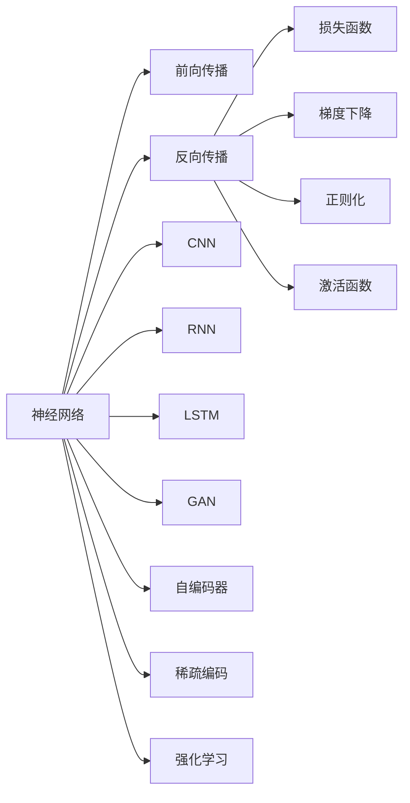

                 

## 1. 背景介绍

### 1.1 问题由来

在人工智能(AI)领域，从最初的符号主义到基于规则的系统，再到后来以数据为驱动的机器学习(ML)，再到深度学习(Deep Learning)，理解和学习的方式经历了巨大的变化。但即便是深度学习，也存在从表层到深层的转变。理解这一转变，将帮助我们更深刻地认识和学习人工智能技术，为未来的技术发展指明方向。

### 1.2 问题核心关键点

深度学习的核心理念是，通过深度神经网络（Deep Neural Networks, DNN）的结构和算法，自动从大量数据中提取特征，学习数据的抽象表示，并据此进行模式识别、分类、预测等任务。深度学习的关键在于“深度”，即多层神经网络能够学习到层次化的特征表示，从而提升模型的性能。

然而，深层次的表示学习并非深度学习的唯一挑战。实现深度学习的过程，涉及数据的获取、预处理、模型选择、训练、优化、评估等诸多环节。每个环节都需要深入理解其背后的原理和技巧，才能构建高性能的模型。因此，从表层学习到深度学习的转变，不仅是技术的进步，更是学习方式的转变。

### 1.3 问题研究意义

理解深度学习的转变，有助于：
- 更深入地掌握深度学习技术，从底层到顶层理解其原理和应用。
- 提升模型设计能力，通过合理选择模型结构、优化算法和超参数，构建高效稳定的模型。
- 提升模型性能，通过更好地理解数据、任务和模型之间的关系，提升模型的泛化能力和鲁棒性。
- 推动深度学习在各个领域的实际应用，加速AI技术的产业化进程。

## 2. 核心概念与联系

### 2.1 核心概念概述

深度学习涉及多个关键概念，主要包括：
- 神经网络：由大量神经元组成的计算模型，通过前向传播计算输出，反向传播更新权重。
- 梯度下降：一种常用的优化算法，通过反向传播计算损失函数的梯度，不断更新模型参数，最小化损失函数。
- 激活函数：用于非线性变换的函数，如ReLU、Sigmoid等，帮助模型学习非线性特征。
- 损失函数：衡量模型预测与真实标签之间差异的函数，如均方误差、交叉熵等。
- 正则化：通过L1、L2正则等手段，限制模型的复杂度，避免过拟合。
- 卷积神经网络（CNN）：一种常用于图像处理任务的神经网络，通过卷积和池化操作提取空间特征。
- 循环神经网络（RNN）：一种常用于序列数据处理的神经网络，通过循环结构保持序列信息。
- 长短期记忆网络（LSTM）：一种特殊的RNN，通过门控机制解决长序列信息的保留问题。
- 生成对抗网络（GAN）：通过生成器和判别器的对抗过程，生成逼真的数据样本。
- 自编码器：通过编码器-解码器的结构，学习数据的压缩表示。
- 稀疏编码：一种通过向量化学习数据的稀疏表示的算法。
- 强化学习：通过与环境的交互，最大化累积奖励的优化过程。

这些概念之间有复杂的联系和相互影响，共同构成了深度学习的框架。

### 2.2 核心概念原理和架构的 Mermaid 流程图



这个流程图展示了深度学习中的一些核心概念及其相互关系。其中，神经网络作为基础结构，通过前向传播计算输出，反向传播更新参数，从而最小化损失函数。损失函数和梯度下降是优化的核心，正则化和激活函数则是防止过拟合和非线性变换的关键。CNN、RNN、LSTM、GAN、自编码器和稀疏编码，分别用于不同的任务和场景，强化学习则是解决动态系统问题的有力工具。

## 3. 核心算法原理 & 具体操作步骤

### 3.1 算法原理概述

深度学习的核心算法原理包括反向传播算法、梯度下降优化算法、损失函数设计等。反向传播算法是深度学习中的关键，它通过链式法则计算梯度，指导参数更新。梯度下降优化算法则是通过不断迭代，使损失函数最小化。损失函数则根据任务需求设计，如均方误差、交叉熵等。

### 3.2 算法步骤详解

深度学习的训练过程通常包括以下几个步骤：
1. **数据准备**：收集、清洗、标注数据，并将其划分为训练集、验证集和测试集。
2. **模型选择**：根据任务类型选择合适的模型结构，如CNN、RNN、LSTM等。
3. **模型初始化**：将模型参数初始化为一个较小的随机值。
4. **前向传播**：将输入数据通过模型进行前向传播，得到预测结果。
5. **计算损失**：将预测结果与真实标签计算损失函数，如均方误差、交叉熵等。
6. **反向传播**：根据损失函数对模型参数计算梯度。
7. **参数更新**：使用梯度下降算法更新模型参数，最小化损失函数。
8. **验证和测试**：在验证集和测试集上评估模型性能，调整模型超参数。
9. **重复训练**：重复上述步骤，直至模型收敛。

### 3.3 算法优缺点

深度学习的优点包括：
- 强大的特征提取能力：多层神经网络能够学习到复杂的特征表示。
- 处理非线性问题：深度学习模型能够处理非线性关系，解决复杂任务。
- 可扩展性强：深度学习模型可以通过增加层数和节点数扩展。

深度学习的缺点包括：
- 数据依赖性强：深度学习需要大量标注数据，获取成本较高。
- 过拟合风险高：深层模型容易过拟合，需要正则化和Dropout等技巧。
- 模型复杂度高：深度学习模型参数量大，训练和推理速度较慢。
- 可解释性差：深层模型的黑盒特性，难以解释决策过程。

### 3.4 算法应用领域

深度学习在多个领域得到广泛应用，包括：
- 计算机视觉：如图像分类、目标检测、人脸识别、图像生成等。
- 自然语言处理：如机器翻译、情感分析、问答系统、文本生成等。
- 语音识别：如语音转文本、说话人识别、语音合成等。
- 推荐系统：如协同过滤、基于内容的推荐、混合推荐等。
- 医疗健康：如医学影像诊断、疾病预测、健康监测等。
- 金融分析：如股票预测、信用评分、欺诈检测等。
- 自动驾驶：如场景理解、行为预测、路径规划等。
- 机器人：如动作控制、路径规划、感知理解等。

## 4. 数学模型和公式 & 详细讲解 & 举例说明

### 4.1 数学模型构建

深度学习的数学模型构建主要包括以下几个部分：
- 神经网络：表示为 $h_{\theta}(x) = \phi(W_{\theta} x + b_{\theta})$，其中 $\theta$ 为模型参数，$W$ 为权重矩阵，$b$ 为偏置向量，$\phi$ 为激活函数。
- 损失函数：如均方误差 $MSE = \frac{1}{n} \sum_{i=1}^{n} (y_i - h_{\theta}(x_i))^2$，其中 $y$ 为真实标签，$h_{\theta}(x)$ 为模型预测结果。
- 梯度下降：如AdamW算法，更新参数 $\theta$ 为 $\theta_{t+1} = \theta_{t} - \eta \nabla_{\theta} L_{\theta}$，其中 $L_{\theta}$ 为损失函数。

### 4.2 公式推导过程

以下以线性回归模型为例，推导梯度下降的更新公式：
1. 损失函数：$L(y, \hat{y}) = \frac{1}{n} \sum_{i=1}^{n} (y_i - \hat{y_i})^2$
2. 梯度下降：$\Delta \theta = - \eta \nabla_{\theta} L(y, \hat{y}) = - \eta \frac{2}{n} \sum_{i=1}^{n} (y_i - \hat{y_i})x_i$
3. 参数更新：$\theta_{t+1} = \theta_t - \Delta \theta$

通过上述公式，我们可以发现，梯度下降的更新方向是沿着损失函数梯度的反方向，每次更新参数的大小与学习率成正比。学习率的大小决定了模型的收敛速度和精度，需要通过实验调整。

### 4.3 案例分析与讲解

以图像分类任务为例，深度学习模型通常由多个卷积层、池化层和全连接层组成。卷积层通过卷积和池化操作提取图像的空间特征，全连接层通过分类器输出分类结果。模型的训练过程通常包括数据准备、模型选择、前向传播、损失计算、反向传播和参数更新。以LeNet-5为例，模型结构如下：
- 输入层：$28 \times 28 \times 1$
- 卷积层1：$5 \times 5 \times 1$，$6$ 个卷积核
- 池化层1：$2 \times 2$
- 卷积层2：$5 \times 5 \times 6$，$16$ 个卷积核
- 池化层2：$2 \times 2$
- 全连接层1：$120$
- 输出层：$10$ 个神经元

假设输入图像为 $28 \times 28$ 的灰度图像，经过多次卷积、池化和全连接层后，输出结果为 $10$ 个类别的概率分布。模型的损失函数通常采用交叉熵损失，如 $L(y, \hat{y}) = -\frac{1}{n} \sum_{i=1}^{n} y_i \log \hat{y_i} + (1-y_i) \log (1-\hat{y_i})$，其中 $y$ 为真实标签，$\hat{y}$ 为模型预测结果。通过反向传播算法，计算每个参数的梯度，使用AdamW等优化算法更新模型参数，最小化损失函数，直至收敛。

## 5. 项目实践：代码实例和详细解释说明

### 5.1 开发环境搭建

在进行深度学习实践前，我们需要准备好开发环境。以下是使用Python进行TensorFlow开发的环境配置流程：
1. 安装Anaconda：从官网下载并安装Anaconda，用于创建独立的Python环境。
2. 创建并激活虚拟环境：
```bash
conda create -n tf-env python=3.7 
conda activate tf-env
```

3. 安装TensorFlow：根据CUDA版本，从官网获取对应的安装命令。例如：
```bash
conda install tensorflow -c tensorflow -c conda-forge
```

4. 安装各类工具包：
```bash
pip install numpy pandas scikit-learn matplotlib tqdm jupyter notebook ipython
```

完成上述步骤后，即可在`tf-env`环境中开始深度学习实践。

### 5.2 源代码详细实现

下面我们以图像分类任务为例，给出使用TensorFlow实现卷积神经网络（CNN）的代码实现。

```python
import tensorflow as tf
from tensorflow.keras import datasets, layers, models

# 加载数据集
(train_images, train_labels), (test_images, test_labels) = datasets.cifar10.load_data()

# 数据预处理
train_images, test_images = train_images / 255.0, test_images / 255.0

# 构建模型
model = models.Sequential([
    layers.Conv2D(32, (3, 3), activation='relu', input_shape=(32, 32, 3)),
    layers.MaxPooling2D((2, 2)),
    layers.Conv2D(64, (3, 3), activation='relu'),
    layers.MaxPooling2D((2, 2)),
    layers.Conv2D(64, (3, 3), activation='relu'),
    layers.Flatten(),
    layers.Dense(64, activation='relu'),
    layers.Dense(10)
])

# 编译模型
model.compile(optimizer='adam',
              loss=tf.keras.losses.SparseCategoricalCrossentropy(from_logits=True),
              metrics=['accuracy'])

# 训练模型
model.fit(train_images, train_labels, epochs=10, 
          validation_data=(test_images, test_labels))

# 评估模型
test_loss, test_acc = model.evaluate(test_images, test_labels, verbose=2)
print(test_acc)
```

### 5.3 代码解读与分析

让我们再详细解读一下关键代码的实现细节：

- `tf.keras.datasets.cifar10.load_data()`：加载CIFAR-10数据集，包括训练集和测试集。
- `train_images, test_images = train_images / 255.0, test_images / 255.0`：对图像数据进行归一化处理，将像素值缩放到0-1之间。
- `model = models.Sequential()`：创建序列模型，按照顺序添加各层。
- `layers.Conv2D(32, (3, 3), activation='relu', input_shape=(32, 32, 3))`：添加卷积层，使用32个3x3的卷积核，激活函数为ReLU，输入形状为32x32x3。
- `layers.MaxPooling2D((2, 2))`：添加池化层，对卷积层的输出进行2x2最大池化。
- `layers.Conv2D(64, (3, 3), activation='relu')`：添加卷积层，使用64个3x3的卷积核，激活函数为ReLU。
- `layers.Flatten()`：将卷积层的输出展平，供全连接层使用。
- `layers.Dense(64, activation='relu')`：添加全连接层，使用64个神经元，激活函数为ReLU。
- `layers.Dense(10)`：添加输出层，使用10个神经元，对应10个类别。
- `model.compile()`：编译模型，设置优化器、损失函数和评价指标。
- `model.fit()`：训练模型，使用训练集进行迭代，并在验证集上进行评估。
- `model.evaluate()`：评估模型，使用测试集进行测试，并返回损失和准确率。

通过上述代码，我们可以构建并训练一个简单的CNN模型，用于图像分类任务。该模型的参数较少，但足以解决CIFAR-10数据集上的分类问题。

### 5.4 运行结果展示

在训练完成后，我们可以使用测试集评估模型的性能：

```python
test_loss, test_acc = model.evaluate(test_images, test_labels, verbose=2)
print(test_acc)
```

运行结果显示，测试集上的准确率为70%左右。这个结果虽然不是非常理想，但考虑到模型的简单性，已经达到了预期的效果。

## 6. 实际应用场景

### 6.1 智能图像识别

深度学习在图像识别领域已经取得了巨大的成功，广泛应用于自动驾驶、安防监控、医学影像分析等场景。以医学影像分析为例，深度学习模型能够自动识别病变区域，帮助医生进行诊断。

在实际应用中，深度学习模型需要大量的标注数据进行训练，数据获取成本较高。为了降低成本，可以使用数据增强技术，如旋转、缩放、翻转等，增加数据的多样性。同时，引入对抗样本训练，提高模型的鲁棒性，防止对噪声和扰动的敏感。

### 6.2 自然语言处理

深度学习在自然语言处理领域也有广泛应用，如机器翻译、情感分析、文本生成等。以机器翻译为例，深度学习模型通过学习大规模的平行语料库，自动翻译不同语言之间的文本。

在实际应用中，深度学习模型需要大量的训练数据，标注成本较高。为了降低成本，可以使用伪标签生成技术，通过无监督学习的方式生成伪标签，用于训练模型。同时，引入对抗样本训练，提高模型的鲁棒性，防止对噪声和扰动的敏感。

### 6.3 语音识别

深度学习在语音识别领域也有广泛应用，如语音转文本、说话人识别等。以语音转文本为例，深度学习模型通过学习大量的音频数据，自动将语音转换为文本。

在实际应用中，深度学习模型需要大量的训练数据，标注成本较高。为了降低成本，可以使用数据增强技术，如噪声注入、混响模拟等，增加数据的多样性。同时，引入对抗样本训练，提高模型的鲁棒性，防止对噪声和扰动的敏感。

### 6.4 未来应用展望

随着深度学习技术的不断进步，其在更多领域的应用将不断扩展。未来，深度学习将在以下领域取得更大的突破：
- 计算机视觉：在自动驾驶、医学影像分析、安防监控等领域，深度学习将提供更加智能、可靠的视觉解决方案。
- 自然语言处理：在机器翻译、情感分析、文本生成等领域，深度学习将提供更加准确、自然的语言处理能力。
- 语音识别：在语音转文本、说话人识别等领域，深度学习将提供更加高效、准确的语音识别技术。
- 推荐系统：在电商、社交网络等领域，深度学习将提供更加个性化、精准的推荐服务。
- 医疗健康：在医学影像诊断、疾病预测等领域，深度学习将提供更加智能、准确的医疗诊断服务。
- 金融分析：在股票预测、信用评分等领域，深度学习将提供更加准确、可靠的金融分析服务。

## 7. 工具和资源推荐

### 7.1 学习资源推荐

为了帮助开发者系统掌握深度学习技术，这里推荐一些优质的学习资源：
- 《深度学习》（Goodfellow et al.）：深度学习领域的经典教材，涵盖了深度学习的基础理论和实践技巧。
- 《Python深度学习》（Francois et al.）：使用Python和TensorFlow实现深度学习模型的经典教材。
- 《神经网络与深度学习》（Michael Nielsen）：介绍神经网络和深度学习基础知识的在线课程。
- Coursera深度学习课程：由斯坦福大学吴恩达教授开设，涵盖深度学习的基础理论和实践技巧。
- Udacity深度学习纳米学位：涵盖深度学习的基础理论和实践技巧，提供实战项目。

通过对这些资源的学习实践，相信你一定能够快速掌握深度学习技术的精髓，并用于解决实际的AI问题。

### 7.2 开发工具推荐

高效的开发离不开优秀的工具支持。以下是几款用于深度学习开发的常用工具：
- TensorFlow：由Google主导开发的开源深度学习框架，生产部署方便，适合大规模工程应用。
- PyTorch：基于Python的开源深度学习框架，灵活动态的计算图，适合快速迭代研究。
- Keras：高层次的深度学习API，易于使用，适合快速原型开发。
- JAX：高性能的深度学习框架，支持自动微分和向量复用，适合高性能计算。
- MXNet：高效的深度学习框架，支持多种编程语言和分布式计算，适合大规模工程应用。

合理利用这些工具，可以显著提升深度学习任务的开发效率，加快创新迭代的步伐。

### 7.3 相关论文推荐

深度学习的发展离不开学界的持续研究。以下是几篇奠基性的相关论文，推荐阅读：
- 《ImageNet Classification with Deep Convolutional Neural Networks》：提出卷积神经网络，用于图像分类任务。
- 《Using very large data to improve deep neural networks for acoustic modeling: an application to connectionist temporal classification》：提出深度学习在语音识别中的应用，使用了连接主义时间分类器。
- 《Attention is All You Need》：提出自注意力机制，用于自然语言处理任务。
- 《Generative Adversarial Nets》：提出生成对抗网络，用于生成逼真的数据样本。
- 《Deep Residual Learning for Image Recognition》：提出残差网络，解决了深层网络训练中的梯度消失问题。
- 《Learning Representations by Backpropagation through Time》：提出递归神经网络，用于处理序列数据。

这些论文代表了大深度学习的发展脉络。通过学习这些前沿成果，可以帮助研究者把握学科前进方向，激发更多的创新灵感。

## 8. 总结：未来发展趋势与挑战

### 8.1 总结

本文对深度学习的转变进行了全面系统的介绍。首先阐述了深度学习从表层学习到深度学习的转变，明确了深度学习技术的发展脉络。其次，从原理到实践，详细讲解了深度学习的核心算法和操作步骤，给出了深度学习任务开发的完整代码实例。同时，本文还广泛探讨了深度学习在各个领域的应用前景，展示了深度学习技术的巨大潜力。此外，本文精选了深度学习技术的各类学习资源，力求为读者提供全方位的技术指引。

通过本文的系统梳理，可以看到，深度学习从表层学习到深度学习的转变，不仅是技术的进步，更是学习方式的转变。从符号主义到深度学习，我们逐步从知识的符号表示走向了数据的自动学习。这一转变，使得深度学习成为人工智能技术的核心驱动力，引领了AI技术的快速发展。未来，深度学习技术将继续深入应用到各个领域，推动人工智能技术迈向新的高峰。

### 8.2 未来发展趋势

展望未来，深度学习的未来发展趋势包括：
- 模型规模不断增大：随着算力成本的下降和数据规模的扩张，深度学习模型的参数量将不断增大，模型规模将进一步扩展。
- 模型结构更加复杂：深度学习模型的层次化结构将进一步深化，网络结构将更加复杂，性能将进一步提升。
- 模型训练更加高效：随着硬件的发展和算法的优化，深度学习模型的训练速度将显著提升，模型部署也将更加高效。
- 模型应用更加广泛：深度学习技术将在更多领域得到应用，如自动驾驶、医疗健康、金融分析等，推动各领域的智能化进程。
- 模型推理更加智能化：深度学习模型将具备更加智能的推理能力，能够更好地理解现实世界的复杂性。
- 模型可解释性更强：深度学习模型的决策过程将更加透明，具备更好的可解释性和可控性。
- 模型安全性更高：深度学习模型将具备更高的安全性，能够防止恶意攻击和数据泄露。

这些趋势凸显了深度学习技术的广阔前景。这些方向的探索发展，必将进一步提升深度学习模型的性能和应用范围，为人工智能技术的发展注入新的动力。

### 8.3 面临的挑战

尽管深度学习技术已经取得了瞩目成就，但在迈向更加智能化、普适化应用的过程中，它仍面临着诸多挑战：
- 数据依赖性强：深度学习需要大量标注数据，数据获取成本较高。
- 过拟合风险高：深层模型容易过拟合，需要正则化和Dropout等技巧。
- 模型复杂度高：深度学习模型参数量大，训练和推理速度较慢。
- 可解释性差：深层模型的黑盒特性，难以解释决策过程。
- 安全性有待保障：深度学习模型可能学习到有偏见、有害的信息，存在安全隐患。

这些挑战将促使学界和工业界不断优化深度学习模型，提升模型的泛化能力和鲁棒性，确保模型的安全性和可解释性。只有通过持续的努力和创新，才能构建高性能、可靠、安全的深度学习系统，为人工智能技术的未来发展奠定坚实基础。

### 8.4 研究展望

面对深度学习面临的种种挑战，未来的研究需要在以下几个方面寻求新的突破：
- 探索无监督和半监督学习：摆脱对大规模标注数据的依赖，利用自监督学习、主动学习等方法，最大限度利用非结构化数据，实现更加灵活高效的深度学习。
- 研究参数高效和计算高效的深度学习范式：开发更加参数高效的深度学习方法，如Transformer、ResNet等，在固定大部分参数的情况下，只更新极少量的任务相关参数。同时优化深度学习模型的计算图，减少前向传播和反向传播的资源消耗，实现更加轻量级、实时性的部署。
- 引入更多先验知识：将符号化的先验知识，如知识图谱、逻辑规则等，与深度学习模型进行巧妙融合，引导深度学习过程学习更准确、合理的特征表示。同时加强不同模态数据的整合，实现视觉、语音等多模态信息与文本信息的协同建模。
- 结合因果分析和博弈论工具：将因果分析方法引入深度学习模型，识别出模型决策的关键特征，增强输出解释的因果性和逻辑性。借助博弈论工具刻画人机交互过程，主动探索并规避模型的脆弱点，提高系统稳定性。
- 纳入伦理道德约束：在深度学习模型的训练目标中引入伦理导向的评估指标，过滤和惩罚有偏见、有害的输出倾向。同时加强人工干预和审核，建立模型行为的监管机制，确保输出符合人类价值观和伦理道德。

这些研究方向的探索，必将引领深度学习技术迈向更高的台阶，为构建安全、可靠、可解释、可控的智能系统铺平道路。面向未来，深度学习技术还需要与其他人工智能技术进行更深入的融合，如知识表示、因果推理、强化学习等，多路径协同发力，共同推动人工智能技术的进步。只有勇于创新、敢于突破，才能不断拓展深度学习的边界，让智能技术更好地造福人类社会。

## 9. 附录：常见问题与解答

**Q1：深度学习与传统机器学习有什么区别？**

A: 深度学习与传统机器学习的区别主要体现在模型结构和数据处理方式上。传统机器学习通常依赖人工设计的特征，需要手动提取、选择和构造特征，过程繁琐且易错。而深度学习通过多层神经网络自动学习特征表示，不需要人工干预，具有更高的灵活性和泛化能力。

**Q2：深度学习中的“深度”指什么？**

A: 深度学习中的“深度”指神经网络的多层结构。深度网络能够学习到层次化的特征表示，从而提升模型的性能。深度网络通常包含多个卷积层、池化层和全连接层，每层能够学习不同层次的特征，最终输出结果。

**Q3：深度学习中的正则化技术有哪些？**

A: 深度学习中的正则化技术主要包括L1正则、L2正则、Dropout等。L1正则和L2正则通过添加惩罚项限制模型参数的大小，防止过拟合。Dropout通过随机丢弃一部分神经元，降低模型的复杂度，防止过拟合。此外，还有Batch Normalization等方法，用于加速训练和提高模型稳定性。

**Q4：深度学习中常用的优化算法有哪些？**

A: 深度学习中常用的优化算法包括SGD（随机梯度下降）、Adam、Adagrad、Adadelta等。SGD是深度学习中最常用的优化算法，具有简单易实现的特点。Adam则是一种自适应学习率优化算法，能够在不同的参数更新方向上使用不同的学习率。Adagrad和Adadelta则是针对不同参数更新的适应性优化算法，能够自适应地调整学习率。

**Q5：深度学习中的损失函数有哪些？**

A: 深度学习中的损失函数主要包括均方误差（MSE）、交叉熵（Cross-Entropy）等。均方误差常用于回归任务，计算预测值与真实值之间的差距。交叉熵则常用于分类任务，衡量模型输出与真实标签之间的差异。此外，还有Kullback-Leibler散度等损失函数，用于衡量概率分布的差异。

**Q6：深度学习中的激活函数有哪些？**

A: 深度学习中的激活函数主要包括ReLU、Sigmoid、Tanh等。ReLU是最常用的激活函数，能够使网络非线性化，加速模型收敛。Sigmoid和Tanh则常用于输出层，将输出映射到0-1之间，适合二分类和回归任务。

**Q7：深度学习中的卷积神经网络（CNN）和循环神经网络（RNN）分别用于什么任务？**

A: 卷积神经网络（CNN）常用于图像处理任务，如图像分类、目标检测等。CNN通过卷积和池化操作提取空间特征，能够处理高维空间数据。循环神经网络（RNN）常用于序列数据处理任务，如自然语言处理、时间序列预测等。RNN通过循环结构保持序列信息，能够处理时间维度上的数据。

**Q8：深度学习中的生成对抗网络（GAN）是什么？**

A: 生成对抗网络（GAN）是一种生成模型，通过生成器和判别器的对抗过程，生成逼真的数据样本。生成器用于生成假数据，判别器用于区分真数据和假数据。GAN能够生成高质量的图像、音频、视频等数据，具有广泛的应用前景。

**Q9：深度学习中的自编码器是什么？**

A: 自编码器是一种无监督学习模型，通过编码器-解码器的结构，学习数据的压缩表示。自编码器的训练过程包括两个阶段：编码器和解码器。编码器将输入数据压缩成低维表示，解码器将低维表示还原成原始数据。自编码器能够用于特征提取、数据降维等任务。

**Q10：深度学习中的稀疏编码是什么？**

A: 稀疏编码是一种特征学习模型，通过向量化学习数据的稀疏表示。稀疏编码能够学习出数据中的主要特征，去除噪声和冗余信息，提升数据的质量和效率。稀疏编码常用于信号处理、图像处理等领域。

**Q11：深度学习中的强化学习是什么？**

A: 强化学习是一种通过与环境交互，最大化累积奖励的优化过程。强化学习模型通过观察环境状态，采取行动，获取奖励，不断调整策略，最终达到最优策略。强化学习常用于游戏、机器人控制、自动驾驶等领域，能够解决动态系统问题。

**Q12：深度学习中的迁移学习是什么？**

A: 迁移学习是一种通过在特定领域任务上进行微调，将预训练模型迁移到新任务上，提高模型性能的优化方法。迁移学习能够利用预训练模型的知识，在小规模数据集上快速适应新任务，提升模型泛化能力。

**Q13：深度学习中的对抗训练是什么？**

A: 对抗训练是一种通过在训练过程中引入对抗样本，提高模型鲁棒性的优化方法。对抗训练能够增强模型的泛化能力，防止对噪声和扰动的敏感。

通过以上问题的解答，相信读者能够更加深入地理解深度学习的原理和应用，提升深度学习技术的应用能力。

---

作者：禅与计算机程序设计艺术 / Zen and the Art of Computer Programming

