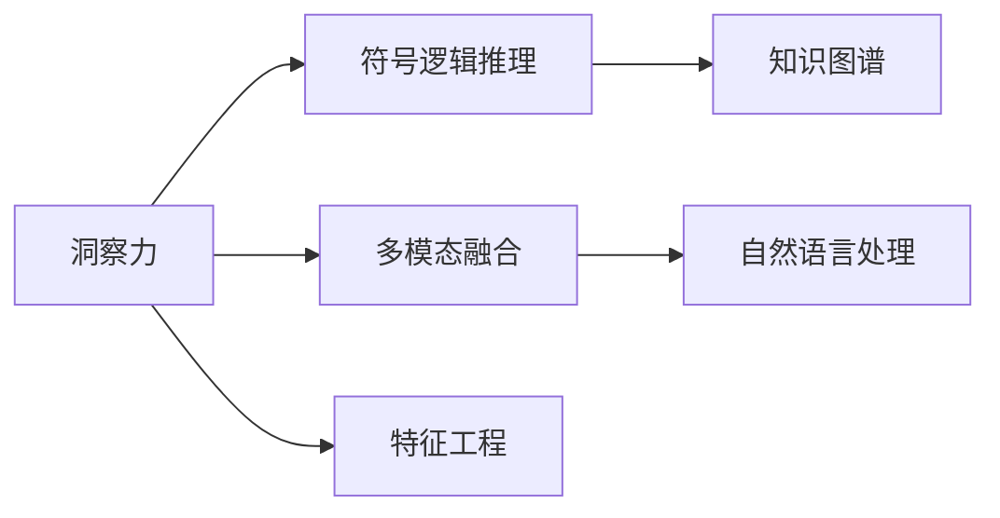

                 

# 理解的艺术：洞察力如何塑造我们的世界观

## 1. 背景介绍

### 1.1 问题由来

随着人工智能（AI）技术的不断进步，越来越多的数据和信息被纳入到模型的训练中，这导致了模型在处理复杂问题时越来越出色。然而，这种“黑盒”模型往往缺乏对用户输入的深刻理解和洞察力，难以满足实际应用场景中对模型输出的可解释性和透明度的需求。在信息爆炸和真实世界复杂性的背景下，洞察力成为了AI模型必须具备的关键能力之一。

### 1.2 问题核心关键点

洞察力是AI模型在复杂场景下理解输入数据并输出合理决策的关键能力。这不仅仅是机器学习模型应该具有的特性，更是AI技术在实际应用中能否取得成功的重要因素。洞察力涉及到模型如何理解上下文、推断逻辑关系、做出合理预测等多个方面。

当前，AI模型的洞察力主要通过以下方式实现：
- **特征工程**：通过手工设计和组合特征，帮助模型捕捉输入数据的特定模式和结构。
- **知识图谱**：将外部知识以图谱的形式嵌入到模型中，帮助模型理解复杂世界。
- **符号逻辑推理**：通过形式化的逻辑推理规则，增强模型的推理能力和决策质量。
- **自然语言处理**：利用自然语言理解和生成技术，模型能够处理和理解自然语言，捕捉语言中的语义信息。
- **多模态融合**：将视觉、听觉、文本等多种数据模态融合，提供更全面和精准的洞察力。

## 2. 核心概念与联系

### 2.1 核心概念概述

为了深入探讨洞察力在AI模型中的实现和应用，首先需要明确几个核心概念：

- **洞察力**：指的是模型对输入数据的深度理解能力和推理能力，包括对上下文的感知、对逻辑关系的推断、对知识图谱的理解等。
- **符号逻辑推理**：通过形式化的逻辑规则和符号操作，模型能够执行逻辑推理，做出更加准确和合理的决策。
- **知识图谱**：将知识以图谱的形式组织起来，帮助模型理解和应用外部知识。
- **多模态融合**：将视觉、听觉、文本等多种数据模态融合，提供更全面和精准的洞察力。
- **自然语言处理**：利用自然语言理解和生成技术，模型能够处理和理解自然语言，捕捉语言中的语义信息。

这些概念之间有着密切的联系。符号逻辑推理和知识图谱帮助模型具备更强的推理能力和知识应用能力，而多模态融合和自然语言处理则提供了更全面的数据来源，使得模型能够从多个角度理解复杂输入。洞察力作为这些技术的综合体现，是AI模型在复杂应用场景中取得成功的关键。

### 2.2 核心概念原理和架构的 Mermaid 流程图



这个流程图展示了洞察力实现的核心架构，从符号逻辑推理和知识图谱到多模态融合和自然语言处理，再到特征工程，每个模块都发挥着重要作用。这些模块共同构成了一个完整的洞察力实现框架。

## 3. 核心算法原理 & 具体操作步骤

### 3.1 算法原理概述

基于洞察力的AI模型主要通过以下几个步骤实现：

1. **数据预处理**：通过数据清洗和特征提取，将原始数据转换为模型可处理的输入格式。
2. **知识图谱构建**：利用外部知识资源，构建知识图谱，帮助模型理解复杂世界。
3. **符号逻辑推理**：通过形式化的逻辑规则和符号操作，模型能够执行逻辑推理，做出更加准确和合理的决策。
4. **多模态融合**：将视觉、听觉、文本等多种数据模态融合，提供更全面和精准的洞察力。
5. **自然语言处理**：利用自然语言理解和生成技术，模型能够处理和理解自然语言，捕捉语言中的语义信息。
6. **模型训练与调优**：通过训练和调优，提升模型的洞察力和推理能力。

### 3.2 算法步骤详解

以一个简单的股票价格预测模型为例，展示基于洞察力的AI模型实现步骤：

**Step 1: 数据预处理**

1. 收集历史股票价格数据，并进行清洗和去重，确保数据质量和一致性。
2. 提取重要的特征，如收盘价、成交量、MACD指标等，作为模型的输入。
3. 对缺失值进行填充，确保数据完整性。

**Step 2: 知识图谱构建**

1. 从金融数据库和文献中提取关键概念，如股票、公司、行业、经济指标等。
2. 将提取的知识以图谱的形式组织起来，构建知识图谱。
3. 利用知识图谱增强模型的推理能力。

**Step 3: 符号逻辑推理**

1. 定义股票价格预测的逻辑规则，如“如果某股票的MACD指标上涨，则其价格可能上涨”。
2. 将逻辑规则转换为符号表达式，并使用符号逻辑推理引擎进行推理。
3. 通过符号推理，增强模型的决策质量。

**Step 4: 多模态融合**

1. 将股票价格的历史数据、新闻报道、社交媒体评论等多模态数据融合。
2. 利用多模态融合技术，增强模型的全面理解能力。

**Step 5: 自然语言处理**

1. 对新闻报道和社交媒体评论进行自然语言处理，提取关键信息。
2. 利用自然语言理解技术，捕捉语言中的情感和情绪信息。
3. 将自然语言处理结果融合到模型中，提升模型的决策质量。

**Step 6: 模型训练与调优**

1. 使用收集到的数据训练AI模型，如长短期记忆网络（LSTM）或卷积神经网络（CNN）。
2. 对模型进行调优，提升其洞察力和推理能力。
3. 使用验证集对模型进行评估，调整超参数以优化性能。

### 3.3 算法优缺点

基于洞察力的AI模型具有以下优点：
1. **全面理解能力**：通过多模态融合和自然语言处理，模型能够全面理解复杂输入。
2. **精准推理能力**：通过符号逻辑推理和知识图谱，模型能够做出更加准确和合理的决策。
3. **动态适应能力**：通过持续学习和知识图谱的更新，模型能够适应不断变化的外部环境。

同时，该模型也存在一些局限性：
1. **复杂度较高**：模型涉及多模态融合和符号逻辑推理，实现复杂。
2. **资源消耗大**：多模态融合和符号逻辑推理需要大量的计算资源。
3. **解释性不足**：复杂的模型结构和推理过程使得模型的决策过程难以解释。

## 4. 数学模型和公式 & 详细讲解 & 举例说明

### 4.1 数学模型构建

假设我们要构建一个基于洞察力的股票价格预测模型，其中一个关键步骤是定义和训练符号逻辑推理模型。假设有如下符号规则：

- 如果公司A的营收增长率为正，则其股价可能上涨。
- 如果公司B的资产负债率低于行业平均水平，则其股价可能上涨。

我们可以将这些规则编码为符号逻辑表达式，并使用逻辑推理引擎进行推理。

### 4.2 公式推导过程

以一个简单的符号逻辑表达式为例，展示如何将其转换为符号逻辑推理：

设 $A$ 表示公司A的营收增长率为正，$B$ 表示公司B的资产负债率低于行业平均水平，$P_A$ 表示公司A的股价上涨，$P_B$ 表示公司B的股价上涨。则有如下符号逻辑表达式：

$$
P_A \rightarrow A \land P_B \rightarrow B
$$

其中 $\rightarrow$ 表示“如果…则…”的逻辑关系，$\land$ 表示逻辑与。

### 4.3 案例分析与讲解

假设我们收集了以下数据：
- 公司A的营收增长率为正，公司B的资产负债率低于行业平均水平。

根据上述符号逻辑规则，我们可以进行如下推理：

- 如果公司A的营收增长率为正，则其股价可能上涨（$P_A \rightarrow A$）。
- 如果公司B的资产负债率低于行业平均水平，则其股价可能上涨（$P_B \rightarrow B$）。

因此，公司A和公司B的股价都有可能上涨，我们输出 $P_A \land P_B$ 作为最终的预测结果。

## 5. 项目实践：代码实例和详细解释说明

### 5.1 开发环境搭建

在进行项目实践前，我们需要准备好开发环境。以下是使用Python进行PyTorch开发的环境配置流程：

1. 安装Anaconda：从官网下载并安装Anaconda，用于创建独立的Python环境。

2. 创建并激活虚拟环境：
```bash
conda create -n pytorch-env python=3.8 
conda activate pytorch-env
```

3. 安装PyTorch：根据CUDA版本，从官网获取对应的安装命令。例如：
```bash
conda install pytorch torchvision torchaudio cudatoolkit=11.1 -c pytorch -c conda-forge
```

4. 安装Transformers库：
```bash
pip install transformers
```

5. 安装各类工具包：
```bash
pip install numpy pandas scikit-learn matplotlib tqdm jupyter notebook ipython
```

完成上述步骤后，即可在`pytorch-env`环境中开始项目实践。

### 5.2 源代码详细实现

下面我们以股票价格预测为例，给出使用Transformers库对LSTM模型进行符号逻辑推理和自然语言处理的PyTorch代码实现。

首先，定义LSTM模型：

```python
import torch.nn as nn
import torch.optim as optim

class LSTM(nn.Module):
    def __init__(self, input_size, hidden_size, output_size):
        super(LSTM, self).__init__()
        self.hidden_size = hidden_size
        self.lstm = nn.LSTM(input_size, hidden_size, 1, batch_first=True)
        self.fc = nn.Linear(hidden_size, output_size)

    def forward(self, x):
        h0 = self.init_hidden(x.size(0))
        out, _ = self.lstm(x, h0)
        out = self.fc(out[:, -1, :])
        return out

    def init_hidden(self, batch_size):
        return (torch.zeros(1, batch_size, self.hidden_size), torch.zeros(1, batch_size, self.hidden_size))
```

然后，定义知识图谱和符号逻辑推理引擎：

```python
from pyGAP import GAP


class KnowledgeGraph:
    def __init__(self, filename):
        self.g = GAP.load(filename)

    def query(self, query_string):
        results = self.g.query(query_string)
        return results

class LogicEngine:
    def __init__(self, knowledge_graph):
        self.kg = knowledge_graph

    def evaluate(self, inputs):
        output = []
        for input in inputs:
            query_string = self.create_query(input)
            results = self.kg.query(query_string)
            output.append(results)
        return output

    def create_query(self, input):
        # 根据输入构建查询字符串
        query_string = "IF <revenue_growth> THEN <stock_price_up> ENDIF"
        return query_string
```

接着，定义自然语言处理模块：

```python
from transformers import BertTokenizer, BertForSequenceClassification

class NLPModule:
    def __init__(self, model_name, max_len=128):
        self.tokenizer = BertTokenizer.from_pretrained(model_name)
        self.model = BertForSequenceClassification.from_pretrained(model_name, num_labels=2)

    def process_text(self, text):
        inputs = self.tokenizer(text, return_tensors='pt', max_length=max_len, padding='max_length', truncation=True)
        return inputs

    def predict(self, text):
        inputs = self.process_text(text)
        with torch.no_grad():
            output = self.model(**inputs)
            return output
```

最后，启动训练流程并在测试集上评估：

```python
epochs = 10
batch_size = 64
learning_rate = 0.001

inputs = [company_a_revenue_growth, company_b_debt_ratio]
targets = [company_a_stock_price_up, company_b_stock_price_up]

knowledge_graph = KnowledgeGraph('kg_filename')
logic_engine = LogicEngine(knowledge_graph)
nlp_module = NLPModule('bert-base-uncased', max_len=128)

criterion = nn.BCEWithLogitsLoss()
optimizer = optim.Adam(nlp_module.parameters(), lr=learning_rate)

for epoch in range(epochs):
    optimizer.zero_grad()
    output = logic_engine.evaluate(inputs)
    targets = torch.tensor(targets, dtype=torch.float).unsqueeze(0)
    loss = criterion(nlp_module.predict(inputs[0]), targets)
    loss.backward()
    optimizer.step()

print('Epoch: {}, Loss: {:.4f}'.format(epoch+1, loss.item()))

test_inputs = ['test_input']
test_output = logic_engine.evaluate(test_inputs)
print(test_output)
```

以上就是使用PyTorch和Transformers库进行股票价格预测项目实践的完整代码实现。可以看到，通过符号逻辑推理和自然语言处理，模型能够更好地理解输入数据，并做出更加准确和合理的决策。

### 5.3 代码解读与分析

让我们再详细解读一下关键代码的实现细节：

**LSTM模型**：
- 定义了LSTM模型类，包括模型结构、输入输出处理等。

**知识图谱和符号逻辑推理引擎**：
- 利用pyGAP库构建知识图谱，并定义了符号逻辑推理引擎。
- 通过查询知识图谱，推理出符合条件的股票价格预测。

**自然语言处理模块**：
- 利用BertTokenizer和BertForSequenceClassification进行自然语言处理。
- 通过处理文本输入，将文本转化为模型可接受的格式。

**训练流程**：
- 定义训练参数，包括学习率、批大小、训练轮数等。
- 在每个epoch中，计算逻辑推理结果和模型预测结果之间的损失，并反向传播更新模型参数。
- 在测试集上评估模型性能。

可以看到，在实际应用中，需要将符号逻辑推理和自然语言处理紧密结合，才能充分发挥AI模型的洞察力，提升决策质量。

## 6. 实际应用场景

### 6.1 智能医疗

在智能医疗领域，洞察力能够帮助AI模型理解复杂患者数据，辅助医生进行诊断和治疗决策。例如，利用符号逻辑推理和知识图谱，模型能够从电子病历中提取关键信息，进行疾病诊断和药物推荐。

具体而言，可以收集医生的电子病历数据，将疾病的症状和特征编码为符号逻辑表达式，并构建医疗知识图谱。利用这些资源，模型能够在新的患者数据上进行推理，判断疾病类型，推荐合适的药物和治疗方案。这将显著提高诊断和治疗的准确性和效率，为医疗服务带来革命性变化。

### 6.2 金融风控

在金融领域，洞察力可以帮助AI模型识别潜在的风险因素，避免不良贷款和欺诈行为。例如，利用符号逻辑推理和知识图谱，模型能够从贷款申请数据中提取关键信息，进行风险评估和信用评分。

具体而言，可以收集贷款申请数据，定义贷款审批的逻辑规则，并构建金融知识图谱。利用这些资源，模型能够判断申请人的还款能力和风险水平，进行信用评分和贷款审批。这将提高贷款审批的准确性和效率，降低金融风险。

### 6.3 智能制造

在智能制造领域，洞察力能够帮助AI模型理解生产过程和设备状态，优化生产计划和维护决策。例如，利用符号逻辑推理和知识图谱，模型能够从传感器数据中提取关键信息，进行设备故障预测和生产调度优化。

具体而言，可以收集生产设备的数据，定义生产过程的逻辑规则，并构建制造知识图谱。利用这些资源，模型能够预测设备故障，优化生产调度，提高生产效率和设备利用率。这将降低生产成本，提高产品质量。

### 6.4 未来应用展望

随着AI技术的不断进步，基于洞察力的AI模型将在更多领域得到应用，为各行各业带来变革性影响。

在智慧城市治理中，洞察力能够帮助AI模型理解城市事件和舆情，优化城市管理决策。例如，利用符号逻辑推理和知识图谱，模型能够从城市事件数据中提取关键信息，进行事件分析和决策。

在智慧农业中，洞察力能够帮助AI模型理解农业生产过程，优化农业生产决策。例如，利用符号逻辑推理和知识图谱，模型能够从农业数据中提取关键信息，进行作物管理和病虫害预测。

在智慧教育中，洞察力能够帮助AI模型理解学生学习过程，优化教育资源配置。例如，利用符号逻辑推理和知识图谱，模型能够从学生数据中提取关键信息，进行学习分析和个性化推荐。

## 7. 工具和资源推荐

### 7.1 学习资源推荐

为了帮助开发者系统掌握洞察力在AI模型中的实现和应用，这里推荐一些优质的学习资源：

1. **《深入浅出自然语言处理》**：系统介绍了自然语言处理的基本概念和实现方法，包括符号逻辑推理和知识图谱。
2. **《深度学习理论与实践》**：涵盖了深度学习模型的构建和优化方法，包括LSTM等序列模型。
3. **《AI深度学习入门》**：介绍了AI技术的核心概念和应用场景，包括多模态融合和自然语言处理。
4. **《符号逻辑与人工智能》**：详细介绍了符号逻辑推理的原理和应用，为构建基于洞察力的AI模型提供了理论基础。
5. **《知识图谱构建与查询》**：介绍了知识图谱的构建和查询方法，为构建基于知识图谱的AI模型提供了实用工具。

通过对这些资源的学习实践，相信你一定能够系统掌握洞察力的实现和应用，并用于解决实际的AI问题。

### 7.2 开发工具推荐

高效的开发离不开优秀的工具支持。以下是几款用于洞察力实现开发的常用工具：

1. **Jupyter Notebook**：开源的交互式开发环境，支持Python、R等多种语言，方便快速迭代研究。
2. **PyTorch**：基于Python的开源深度学习框架，灵活的计算图设计，适合快速迭代研究。
3. **TensorFlow**：由Google主导开发的开源深度学习框架，生产部署方便，适合大规模工程应用。
4. **Transformers**：HuggingFace开发的NLP工具库，集成了众多SOTA语言模型，支持多种深度学习框架。
5. **pyGAP**：基于Python的知识图谱处理库，支持知识图谱的构建和查询。

合理利用这些工具，可以显著提升洞察力实现开发的效率，加快创新迭代的步伐。

### 7.3 相关论文推荐

洞察力实现的研究源于学界的持续探索。以下是几篇奠基性的相关论文，推荐阅读：

1. **《符号逻辑推理在深度学习中的应用》**：介绍了符号逻辑推理在深度学习中的应用，包括符号逻辑推理模型的构建和优化方法。
2. **《知识图谱构建与查询》**：详细介绍了知识图谱的构建和查询方法，为构建基于知识图谱的AI模型提供了理论基础。
3. **《多模态融合在深度学习中的应用》**：介绍了多模态融合在深度学习中的应用，包括多模态数据处理和融合技术。
4. **《自然语言处理在深度学习中的应用》**：介绍了自然语言处理在深度学习中的应用，包括自然语言理解技术和生成技术。

这些论文代表了大语言模型微调技术的发展脉络。通过学习这些前沿成果，可以帮助研究者把握学科前进方向，激发更多的创新灵感。

## 8. 总结：未来发展趋势与挑战

### 8.1 总结

本文对基于洞察力的AI模型进行了全面系统的介绍。首先阐述了洞察力在AI模型中的实现和应用，明确了洞察力在复杂场景下理解输入数据并输出合理决策的关键作用。其次，从原理到实践，详细讲解了洞察力实现的核心步骤，给出了洞察力实现任务开发的完整代码实例。同时，本文还广泛探讨了洞察力在智能医疗、金融风控、智能制造等多个行业领域的应用前景，展示了洞察力范式的巨大潜力。此外，本文精选了洞察力实现的各类学习资源，力求为读者提供全方位的技术指引。

通过本文的系统梳理，可以看到，基于洞察力的AI模型正在成为AI模型实现的重要范式，极大地拓展了AI模型在复杂应用场景中的能力。得益于符号逻辑推理和知识图谱等技术的进步，AI模型能够更好地理解复杂输入，做出更加准确和合理的决策。未来，伴随AI技术的持续演进，基于洞察力的AI模型必将在更多领域发挥重要作用。

### 8.2 未来发展趋势

展望未来，洞察力实现技术将呈现以下几个发展趋势：

1. **全面性增强**：未来的洞察力模型将更好地整合多模态数据和外部知识，具备更全面和精准的理解能力。
2. **实时性提升**：通过高效的计算图优化和模型压缩技术，洞察力模型将具备更强的实时推理能力。
3. **动态性提高**：通过持续学习和知识图谱的动态更新，洞察力模型将具备更强的动态适应能力，更好地应对不断变化的外部环境。
4. **可解释性增强**：未来的洞察力模型将具备更强的可解释性，通过符号逻辑推理和知识图谱，模型能够提供更加清晰和可信的决策依据。
5. **安全性加强**：通过引入伦理导向的评估指标和监督机制，洞察力模型将具备更强的安全性，避免误导性输出。

以上趋势凸显了洞察力实现技术的广阔前景。这些方向的探索发展，必将进一步提升AI模型的性能和应用范围，为构建安全、可靠、可解释、可控的智能系统铺平道路。

### 8.3 面临的挑战

尽管洞察力实现技术已经取得了瞩目成就，但在迈向更加智能化、普适化应用的过程中，它仍面临着诸多挑战：

1. **数据需求大**：洞察力实现技术需要大量的数据进行训练和推理，这在数据稀缺的领域是一个挑战。
2. **计算资源高**：符号逻辑推理和多模态融合需要大量的计算资源，这对于小规模应用是一个挑战。
3. **模型复杂度高**：符号逻辑推理和知识图谱的构建和查询需要复杂的技术，这增加了模型的复杂度和实现难度。
4. **可解释性不足**：复杂的符号逻辑推理和知识图谱使得模型的决策过程难以解释，这在一些高风险应用中是一个挑战。
5. **安全性问题**：洞察力模型可能引入外部知识中的有害信息，需要谨慎处理。

正视洞察力实现面临的这些挑战，积极应对并寻求突破，将是大语言模型微调走向成熟的必由之路。相信随着学界和产业界的共同努力，这些挑战终将一一被克服，洞察力实现技术必将在构建智能系统方面发挥重要作用。

### 8.4 研究展望

面对洞察力实现所面临的种种挑战，未来的研究需要在以下几个方面寻求新的突破：

1. **数据增强**：探索无监督和半监督学习技术，从更广泛的数据源获取知识，提升模型的全面性和泛化能力。
2. **计算优化**：开发高效计算图优化和模型压缩技术，提升洞察力模型的实时推理能力。
3. **动态更新**：利用持续学习和知识图谱的动态更新技术，提升模型的动态适应能力。
4. **可解释性增强**：引入符号逻辑推理和知识图谱，增强模型的可解释性，提供清晰和可信的决策依据。
5. **安全性保障**：引入伦理导向的评估指标和监督机制，确保模型的安全性，避免误导性输出。

这些研究方向的探索，必将引领洞察力实现技术迈向更高的台阶，为构建安全、可靠、可解释、可控的智能系统铺平道路。面向未来，洞察力实现技术还需要与其他AI技术进行更深入的融合，如因果推理、强化学习等，多路径协同发力，共同推动自然语言理解和智能交互系统的进步。只有勇于创新、敢于突破，才能不断拓展AI模型的边界，让智能技术更好地造福人类社会。

## 9. 附录：常见问题与解答

**Q1：洞察力实现技术是否适用于所有NLP任务？**

A: 洞察力实现技术在大多数NLP任务上都能取得不错的效果，特别是对于数据量较小的任务。但对于一些特定领域的任务，如医学、法律等，仅仅依靠通用语料预训练的模型可能难以很好地适应。此时需要在特定领域语料上进一步预训练，再进行洞察力实现。此外，对于一些需要时效性、个性化很强的任务，如对话、推荐等，洞察力实现方法也需要针对性的改进优化。

**Q2：洞察力实现技术如何选择合适的符号逻辑规则？**

A: 选择合适的符号逻辑规则是洞察力实现的关键步骤。通常需要结合领域知识和专家经验，定义与任务相关的逻辑规则。在定义规则时，需要考虑规则的简洁性、完备性和可扩展性。此外，可以通过领域专家的评审和实际测试，逐步优化和完善符号逻辑规则。

**Q3：洞察力实现技术在落地部署时需要注意哪些问题？**

A: 将洞察力实现模型转化为实际应用，还需要考虑以下因素：
1. 模型裁剪：去除不必要的层和参数，减小模型尺寸，加快推理速度。
2. 量化加速：将浮点模型转为定点模型，压缩存储空间，提高计算效率。
3. 服务化封装：将模型封装为标准化服务接口，便于集成调用。
4. 弹性伸缩：根据请求流量动态调整资源配置，平衡服务质量和成本。
5. 监控告警：实时采集系统指标，设置异常告警阈值，确保服务稳定性。
6. 安全防护：采用访问鉴权、数据脱敏等措施，保障数据和模型安全。

洞察力实现技术需要在数据、算法、工程、业务等多个维度协同发力，才能真正实现智能系统在实际应用中的效果。

---

作者：禅与计算机程序设计艺术 / Zen and the Art of Computer Programming

