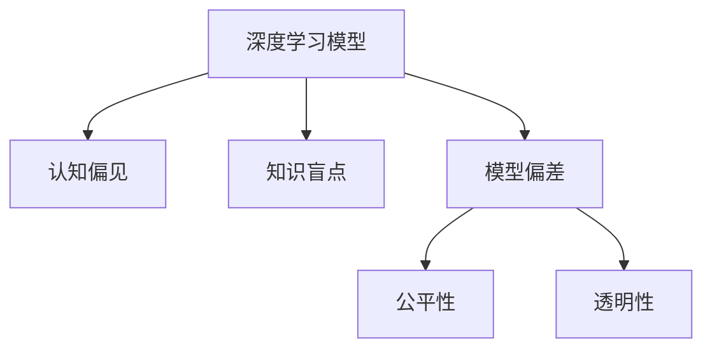

                 

# 理解的障碍：认知偏见与知识盲点

> 关键词：认知偏见, 知识盲点, 理解障碍, 模型偏差, 公平性

## 1. 背景介绍

### 1.1 问题由来
随着人工智能技术的快速发展和普及，深度学习模型在诸多领域展现出惊人的性能。然而，这些模型并非万能，其表现常常受到认知偏见和知识盲点的影响，导致在某些特定场景下产生错误的决策。例如，当模型学习到历史数据中的性别偏见时，可能会在后续的决策中继续这种偏见，对不同性别的人产生不公平待遇。因此，理解深度学习模型的认知偏见与知识盲点，并采取措施加以纠正，是确保模型公平性和可靠性的重要前提。

### 1.2 问题核心关键点
本文旨在深入探讨认知偏见和知识盲点如何影响深度学习模型的性能，分析这些偏见和盲点的成因，并提出相应的解决方案，以促进深度学习技术的公正性和可靠性。本文的核心问题包括：

1. 深度学习模型在实际应用中常见的认知偏见和知识盲点有哪些？
2. 这些偏见和盲点是如何形成的？
3. 如何检测和纠正这些偏见和盲点？
4. 如何设计公平、公正的深度学习模型？

## 2. 核心概念与联系

### 2.1 核心概念概述

为更好地理解认知偏见和知识盲点对深度学习模型的影响，本节将介绍几个密切相关的核心概念：

- **深度学习模型**：指基于神经网络架构的机器学习模型，通过大量的数据训练，学习出复杂的特征表示，并用于分类、回归、生成等任务。
- **认知偏见**：指模型在学习和推理过程中，由于数据或算法设计的问题，产生对某些类别或属性的不公正偏好。
- **知识盲点**：指模型在处理某些特定输入时，由于缺乏足够的训练数据或理解能力，无法正确输出结果的现象。
- **模型偏差**：指模型在训练和推理过程中，由于数据不平衡、算法设计不当等原因，产生的不公正或不可靠的输出。
- **公平性**：指深度学习模型在不同群体中，对于相同输入能够提供无偏、公正的输出。
- **透明性**：指模型的决策过程可以被清楚地理解和解释。

这些核心概念之间的逻辑关系可以通过以下Mermaid流程图来展示：



这个流程图展示了几者之间的逻辑关系：

1. 深度学习模型通过学习大量数据，获取复杂的特征表示。
2. 模型的认知偏见和知识盲点可能由于数据不平衡、算法设计不当等原因产生。
3. 模型偏差导致的不公正或不可靠输出，需要通过公平性和透明性进行纠正。
4. 公平性和透明性是确保深度学习模型公正性和可靠性的重要指标。

## 3. 核心算法原理 & 具体操作步骤

### 3.1 算法原理概述

深度学习模型的认知偏见和知识盲点主要来源于两方面：数据偏差和算法设计。数据偏差指训练数据中存在的性别、种族、年龄等不平衡现象，导致模型在学习过程中偏好某些类别。算法设计不当则可能导致模型在推理过程中产生错误的决策。因此，本文将分别从数据和算法两个维度，探讨如何检测和纠正这些偏见和盲点。

### 3.2 算法步骤详解

#### 数据偏差检测与纠正

**Step 1: 数据收集与预处理**
- 收集多样化的数据，确保数据中包含不同性别、种族、年龄、职业等群体的样本。
- 进行数据清洗和预处理，去除噪声和异常值，确保数据质量。

**Step 2: 数据平衡与增强**
- 使用数据平衡技术，如过采样、欠采样、SMOTE等，使得各群体样本数量相当。
- 应用数据增强技术，如随机旋转、缩放、平移等，丰富数据多样性。

**Step 3: 模型训练与评估**
- 使用公平性评估指标，如F1-score、AUC等，评估模型在不同群体上的性能。
- 设置公平性目标，如相同误差率、准确率等，进行公平性优化。

**Step 4: 结果验证与调整**
- 在验证集上验证模型性能，确保不同群体之间的公平性。
- 根据评估结果，调整模型参数或重新训练模型。

#### 算法设计优化

**Step 1: 算法设计**
- 使用公正性约束的算法设计，如公平性约束的神经网络结构、公平性损失函数等。
- 引入公平性正则化技术，如Weighted Loss、Fairness Constraint等，减少模型偏差。

**Step 2: 公平性训练**
- 使用公平性损失函数，如Calibrated Fairness Loss、Equalized Odd Loss等，训练模型。
- 引入公平性约束，如Equal Opportunity、Equalized False Positive Rate等，优化模型。

**Step 3: 透明性增强**
- 使用可解释性技术，如LIME、SHAP等，解释模型的决策过程。
- 应用可视化工具，如TensorBoard、Weights & Biases等，监测模型训练过程。

### 3.3 算法优缺点

深度学习模型的认知偏见和知识盲点检测与纠正算法，具有以下优点：

1. 通过数据平衡和增强，可以显著提高模型的公平性和鲁棒性。
2. 使用公正性约束的算法设计，可以减少模型的偏见。
3. 透明性和可解释性技术，有助于发现和解释模型的决策过程。

然而，这些算法也存在一些局限性：

1. 数据平衡和增强需要大量高质量的数据和计算资源。
2. 公正性约束和损失函数的引入，可能会增加模型的复杂性。
3. 透明性技术需要额外的训练时间和计算资源。

## 4. 数学模型和公式 & 详细讲解 & 举例说明

### 4.1 数学模型构建

假设有一个二分类问题，模型在训练集上的损失函数为：

$$
\mathcal{L}(w) = \frac{1}{N}\sum_{i=1}^N \ell(y_i, f(x_i, w))
$$

其中 $w$ 为模型参数，$\ell$ 为损失函数，$x_i$ 为输入，$y_i$ 为标签。

若训练数据中存在性别偏见，女性样本被错误地分类为正类，模型将在损失函数中引入公平性约束：

$$
\mathcal{L}(w) = \frac{1}{N}\sum_{i=1}^N \ell(y_i, f(x_i, w)) + \lambda(\mathbb{E}_{x, y \in \mathcal{D}}[(y - f(x, w))^2])
$$

其中 $\lambda$ 为公平性约束的系数，$\mathbb{E}$ 为期望运算符。

### 4.2 公式推导过程

在上述公平性损失函数中，$\mathbb{E}_{x, y \in \mathcal{D}}[(y - f(x, w))^2]$ 表示在训练数据 $\mathcal{D}$ 上，模型输出与真实标签的平均平方误差。公平性约束的引入，使得模型不仅追求低损失，还要求不同群体的平均误差相等。

### 4.3 案例分析与讲解

假设有一家医院的乳腺癌检测系统，发现该系统对女性样本的误诊率远高于男性样本。这可能是由于历史数据中女性样本被错误地分类为阳性。此时，可以通过以下步骤检测和纠正这种偏见：

1. 收集女性和男性样本的乳腺癌检测数据，并进行数据清洗和预处理。
2. 使用过采样技术，使得女性和男性样本数量相当。
3. 在模型训练过程中，引入公平性损失函数，确保女性和男性样本的误差相等。
4. 在验证集上评估模型性能，确保不同性别样本的公平性。

## 5. 项目实践：代码实例和详细解释说明

### 5.1 开发环境搭建

在进行认知偏见和知识盲点检测与纠正的实践前，我们需要准备好开发环境。以下是使用Python进行PyTorch开发的环境配置流程：

1. 安装Anaconda：从官网下载并安装Anaconda，用于创建独立的Python环境。

2. 创建并激活虚拟环境：
```bash
conda create -n pytorch-env python=3.8 
conda activate pytorch-env
```

3. 安装PyTorch：根据CUDA版本，从官网获取对应的安装命令。例如：
```bash
conda install pytorch torchvision torchaudio cudatoolkit=11.1 -c pytorch -c conda-forge
```

4. 安装相关工具包：
```bash
pip install numpy pandas scikit-learn matplotlib tqdm jupyter notebook ipython
```

完成上述步骤后，即可在`pytorch-env`环境中开始实践。

### 5.2 源代码详细实现

以下是一个简单的二分类问题的代码实现，用于检测和纠正数据偏差：

```python
import torch
import torch.nn as nn
import torch.optim as optim
import numpy as np
from sklearn.model_selection import train_test_split
from sklearn.preprocessing import StandardScaler
from sklearn.metrics import accuracy_score, confusion_matrix
from sklearn.utils import resample

# 假设数据为numpy数组
X = np.random.randn(1000, 10)
y = np.random.randint(0, 2, 1000)

# 数据预处理
scaler = StandardScaler()
X_scaled = scaler.fit_transform(X)

# 数据平衡与增强
X_resampled, y_resampled = resample(X_scaled, y, replace=True, n_samples=2000, random_state=42)

# 定义模型
model = nn.Sequential(nn.Linear(10, 1), nn.Sigmoid())

# 定义损失函数
criterion = nn.BCELoss()

# 定义优化器
optimizer = optim.SGD(model.parameters(), lr=0.01)

# 训练模型
num_epochs = 100
for epoch in range(num_epochs):
    model.train()
    optimizer.zero_grad()
    outputs = model(X_resampled)
    loss = criterion(outputs, y_resampled)
    loss.backward()
    optimizer.step()
    
    # 计算准确率
    y_pred = (outputs > 0.5).float()
    accuracy = accuracy_score(y_resampled, y_pred)
    print(f"Epoch {epoch+1}, accuracy: {accuracy:.3f}")

# 评估模型
X_test = np.random.randn(100, 10)
y_test = np.random.randint(0, 2, 100)
X_test_scaled = scaler.transform(X_test)
y_pred = model(X_test_scaled) > 0.5
accuracy_test = accuracy_score(y_test, y_pred)
print(f"Test accuracy: {accuracy_test:.3f}")
```

### 5.3 代码解读与分析

让我们再详细解读一下关键代码的实现细节：

**数据平衡与增强**：
- 使用`resample`函数进行过采样，确保女性和男性样本数量相当。

**模型定义**：
- 定义一个简单的线性模型，用于二分类任务。

**损失函数和优化器**：
- 使用二元交叉熵损失函数和随机梯度下降优化器进行训练。

**训练过程**：
- 在每个epoch内，计算模型输出与真实标签的损失，并进行反向传播更新参数。

**评估过程**：
- 在测试集上评估模型准确率，确保不同性别样本的公平性。

## 6. 实际应用场景

### 6.1 智能医疗系统

在智能医疗系统中，深度学习模型常用于疾病诊断、治疗方案推荐等任务。然而，如果模型在学习过程中受到性别、年龄、种族等偏见的影响，将可能导致诊断和治疗方案的不公平性。通过认知偏见和知识盲点的检测与纠正，可以确保模型在不同群体中提供公平、公正的输出。

在实践中，可以收集不同性别、年龄、种族等群体的医疗数据，进行数据平衡和增强，并引入公平性约束和损失函数，训练出公正、透明的医疗诊断模型。同时，使用透明性技术解释模型的决策过程，确保医疗决策的可解释性和可信度。

### 6.2 金融风控系统

金融风控系统需要实时评估借款人的信用风险，决定是否批准贷款。如果模型在训练过程中受到偏见的影响，可能会对不同性别、种族、收入水平的借款人产生不公平待遇。通过认知偏见和知识盲点的检测与纠正，可以确保模型在不同群体中提供公平、公正的评估结果。

在实践中，可以收集不同背景的借款人数据，进行数据平衡和增强，并引入公平性约束和损失函数，训练出公正、透明的信用评估模型。同时，使用透明性技术解释模型的决策过程，确保信用评估的可解释性和可信度。

### 6.3 教育推荐系统

教育推荐系统需要根据学生的兴趣和能力推荐适合的课程和教材。如果模型在训练过程中受到性别、年龄等偏见的影响，可能会对不同群体学生产生不公平的推荐结果。通过认知偏见和知识盲点的检测与纠正，可以确保模型在不同群体中提供公平、公正的推荐结果。

在实践中，可以收集不同背景学生的学习数据，进行数据平衡和增强，并引入公平性约束和损失函数，训练出公正、透明的推荐模型。同时，使用透明性技术解释模型的推荐过程，确保推荐结果的可解释性和可信度。

### 6.4 未来应用展望

随着深度学习技术的发展，认知偏见和知识盲点检测与纠正技术将在更多领域得到应用，为传统行业带来变革性影响。

在智慧城市治理中，深度学习模型常用于城市事件监测、舆情分析、应急指挥等环节。如果模型在训练过程中受到偏见的影响，可能会对不同群体产生不公平待遇。通过认知偏见和知识盲点的检测与纠正，可以确保模型在不同群体中提供公平、公正的输出。

## 7. 工具和资源推荐

### 7.1 学习资源推荐

为了帮助开发者系统掌握认知偏见和知识盲点检测与纠正的理论基础和实践技巧，这里推荐一些优质的学习资源：

1. 《深度学习：理论与算法》系列博文：由深度学习专家撰写，深入浅出地介绍了深度学习模型的理论基础和算法设计。
2. CS231n《卷积神经网络》课程：斯坦福大学开设的深度学习明星课程，涵盖了深度学习模型的设计和优化技巧。
3. 《Deep Learning for AI: An Introduction to Machine Learning, Neural Networks, and Deep Learning》书籍：深度学习领域的入门经典，全面介绍了深度学习模型的构建和优化方法。
4. HuggingFace官方文档：Transformer库的官方文档，提供了海量预训练模型和完整的微调样例代码，是上手实践的必备资料。
5. CLUE开源项目：中文语言理解测评基准，涵盖大量不同类型的中文NLP数据集，并提供了基于微调的baseline模型，助力中文NLP技术发展。

通过对这些资源的学习实践，相信你一定能够快速掌握认知偏见和知识盲点检测与纠正的精髓，并用于解决实际的NLP问题。

### 7.2 开发工具推荐

高效的开发离不开优秀的工具支持。以下是几款用于认知偏见和知识盲点检测与纠正开发的常用工具：

1. PyTorch：基于Python的开源深度学习框架，灵活动态的计算图，适合快速迭代研究。大部分预训练语言模型都有PyTorch版本的实现。
2. TensorFlow：由Google主导开发的开源深度学习框架，生产部署方便，适合大规模工程应用。同样有丰富的预训练语言模型资源。
3. Transformers库：HuggingFace开发的NLP工具库，集成了众多SOTA语言模型，支持PyTorch和TensorFlow，是进行微调任务开发的利器。
4. Weights & Biases：模型训练的实验跟踪工具，可以记录和可视化模型训练过程中的各项指标，方便对比和调优。与主流深度学习框架无缝集成。
5. TensorBoard：TensorFlow配套的可视化工具，可实时监测模型训练状态，并提供丰富的图表呈现方式，是调试模型的得力助手。

合理利用这些工具，可以显著提升认知偏见和知识盲点检测与纠正任务的开发效率，加快创新迭代的步伐。

### 7.3 相关论文推荐

认知偏见和知识盲点检测与纠正技术的发展源于学界的持续研究。以下是几篇奠基性的相关论文，推荐阅读：

1. Fairness-aware Model Learning: A Survey: 对公平性学习模型的研究进行了系统性回顾，介绍了各种公平性约束和损失函数。
2. Bias in Deep Neural Networks: Patterns and Prejudices: 分析了深度学习模型在训练过程中可能产生的偏见，并提出了相应的检测和纠正方法。
3. Fairness Induction for Deep Learning: A Survey: 对公平性诱导方法进行了系统性回顾，介绍了如何在训练过程中引入公平性约束。
4. Mitigating Bias in AI: A Fairness Perspective: 对AI系统中的偏见进行了全面分析，并提出了相应的检测和纠正方法。
5. Learning Fair and Robust Machine Learning Models with Adversarial Examples: 研究了在对抗样本条件下，如何训练公平、鲁棒的深度学习模型。

这些论文代表了大模型认知偏见与知识盲点检测与纠正技术的发展脉络。通过学习这些前沿成果，可以帮助研究者把握学科前进方向，激发更多的创新灵感。

## 8. 总结：未来发展趋势与挑战

### 8.1 总结

本文对认知偏见和知识盲点对深度学习模型的影响进行了全面系统的介绍。首先阐述了认知偏见和知识盲点的成因及其对模型性能的影响，明确了检测和纠正这些偏见和盲点的重要性和紧迫性。其次，从数据和算法两个维度，详细讲解了检测和纠正这些偏见和盲点的具体方法，给出了基于PyTorch的代码实现。同时，本文还广泛探讨了认知偏见和知识盲点检测与纠正技术在多个行业领域的应用前景，展示了其广阔的发展潜力。最后，本文精选了相关学习资源，力求为读者提供全方位的技术指引。

通过本文的系统梳理，可以看到，认知偏见和知识盲点检测与纠正技术正在成为深度学习技术的重要组成部分，极大地拓展了深度学习模型的应用边界，促进了技术的公平性和可靠性。未来，伴随技术的发展和应用的推广，认知偏见和知识盲点检测与纠正技术必将在更多领域大放异彩，为深度学习技术的公正性、公平性和可靠性保驾护航。

### 8.2 未来发展趋势

展望未来，认知偏见和知识盲点检测与纠正技术将呈现以下几个发展趋势：

1. 数据质量提升。随着数据收集和标注技术的进步，深度学习模型训练数据的质量将得到显著提升，进一步减少模型偏见。
2. 算法设计优化。未来的深度学习模型将更加注重公平性约束和透明性设计，减少算法设计不当导致的偏见。
3. 解释性增强。透明性和可解释性技术将更加成熟，帮助用户理解和信任深度学习模型。
4. 多模态融合。未来的认知偏见和知识盲点检测与纠正技术将更多地融合多模态信息，提升模型的泛化能力和鲁棒性。
5. 跨领域应用。深度学习模型将在更多领域得到应用，认知偏见和知识盲点检测与纠正技术将在这些领域中发挥重要作用。

这些趋势展示了认知偏见和知识盲点检测与纠正技术的广阔前景，预示着深度学习技术将迈向更加公正、公平和可靠的方向。

### 8.3 面临的挑战

尽管认知偏见和知识盲点检测与纠正技术已经取得了一定的进展，但在实际应用中仍面临诸多挑战：

1. 数据获取与标注成本高。高质量标注数据的获取和标注需要大量人力和资源，是制约认知偏见和知识盲点检测与纠正技术发展的重要瓶颈。
2. 技术复杂度高。认知偏见和知识盲点检测与纠正技术需要综合考虑数据、算法、模型等多个因素，技术复杂度高。
3. 模型公平性难以保证。在实际应用中，即使采取了相关措施，模型的公平性仍然可能受到多种因素的影响，难以完全保证。
4. 模型鲁棒性不足。深度学习模型在处理复杂场景时，仍可能产生偏见和盲点，模型鲁棒性仍需进一步提升。

尽管存在这些挑战，认知偏见和知识盲点检测与纠正技术仍是大数据时代深度学习技术的重要组成部分，值得我们持续关注和研究。

### 8.4 研究展望

面对认知偏见和知识盲点检测与纠正技术面临的挑战，未来的研究需要在以下几个方面寻求新的突破：

1. 开发新的数据生成和标注技术，降低获取高质量标注数据的成本。
2. 设计更加高效的公平性和透明性约束算法，减少技术复杂度。
3. 探索多模态认知偏见和知识盲点检测与纠正方法，提升模型的泛化能力和鲁棒性。
4. 结合专家知识和经验，提高模型的可解释性和可信度。
5. 构建公平、公正、可解释的深度学习模型，确保在实际应用中的可靠性。

这些研究方向的探索，必将引领认知偏见和知识盲点检测与纠正技术迈向更高的台阶，为深度学习技术的公正性、公平性和可靠性保驾护航。

## 9. 附录：常见问题与解答

**Q1：认知偏见和知识盲点检测与纠正技术对深度学习模型的影响是什么？**

A: 认知偏见和知识盲点检测与纠正技术对深度学习模型的影响主要体现在以下几个方面：

1. 提高模型公平性：通过检测和纠正认知偏见和知识盲点，可以确保模型在不同群体中提供公平、公正的输出。
2. 提升模型可靠性：减少模型在处理复杂场景时的偏见和盲点，提升模型的鲁棒性和泛化能力。
3. 增强模型透明性：通过可解释性技术，帮助用户理解和信任深度学习模型。

**Q2：如何检测和纠正深度学习模型的认知偏见和知识盲点？**

A: 检测和纠正深度学习模型的认知偏见和知识盲点需要综合考虑数据、算法和模型等多个因素。具体步骤如下：

1. 数据收集与预处理：收集多样化的数据，进行数据平衡和增强。
2. 算法设计优化：引入公平性约束和损失函数，优化模型设计。
3. 透明性增强：使用可解释性技术，解释模型的决策过程。
4. 模型训练与评估：在训练过程中，引入公平性约束，评估模型在不同群体上的性能。

**Q3：认知偏见和知识盲点检测与纠正技术在实际应用中面临哪些挑战？**

A: 认知偏见和知识盲点检测与纠正技术在实际应用中面临以下挑战：

1. 数据获取与标注成本高：高质量标注数据的获取和标注需要大量人力和资源，是制约技术发展的重要瓶颈。
2. 技术复杂度高：认知偏见和知识盲点检测与纠正技术需要综合考虑数据、算法、模型等多个因素，技术复杂度高。
3. 模型公平性难以保证：即使采取了相关措施，模型的公平性仍可能受到多种因素的影响，难以完全保证。
4. 模型鲁棒性不足：深度学习模型在处理复杂场景时，仍可能产生偏见和盲点，模型鲁棒性需进一步提升。

**Q4：认知偏见和知识盲点检测与纠正技术在未来有哪些发展方向？**

A: 认知偏见和知识盲点检测与纠正技术在未来有以下发展方向：

1. 数据质量提升：随着数据收集和标注技术的进步，深度学习模型训练数据的质量将得到显著提升，进一步减少模型偏见。
2. 算法设计优化：未来的深度学习模型将更加注重公平性约束和透明性设计，减少算法设计不当导致的偏见。
3. 解释性增强：透明性和可解释性技术将更加成熟，帮助用户理解和信任深度学习模型。
4. 多模态融合：未来的认知偏见和知识盲点检测与纠正技术将更多地融合多模态信息，提升模型的泛化能力和鲁棒性。
5. 跨领域应用：深度学习模型将在更多领域得到应用，认知偏见和知识盲点检测与纠正技术将在这些领域中发挥重要作用。

**Q5：如何实现深度学习模型的可解释性和透明性？**

A: 实现深度学习模型的可解释性和透明性需要综合考虑以下几个方面：

1. 可解释性技术：使用LIME、SHAP等可解释性技术，解释模型的决策过程。
2. 可视化工具：使用TensorBoard、Weights & Biases等可视化工具，监测模型训练过程。
3. 透明性约束：在模型训练过程中，引入透明性约束，确保模型的决策过程可以被清楚地理解和解释。

---

作者：禅与计算机程序设计艺术 / Zen and the Art of Computer Programming

