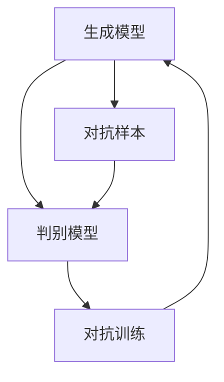

                 

# 生成对抗网络（GAN）：创造性AI应用

> 关键词：生成对抗网络,GAN,创造性AI应用,深度学习,图像生成,自然语言生成,风格转换,研究进展,应用场景

## 1. 背景介绍

### 1.1 问题由来
生成对抗网络（Generative Adversarial Networks, GAN）是一种基于博弈论的深度学习模型。自2014年被提出以来，已经在图像生成、音频生成、自然语言生成等领域取得了巨大成功。GAN的核心思想是利用一个生成模型（Generative Model）和一个判别模型（Discriminative Model），通过两者的对抗过程生成逼真、多样化的数据。GAN的诞生，将深度学习技术从“被动学习”走向了“主动创造”，为人工智能领域带来了创造性应用的新范式。

### 1.2 问题核心关键点
GAN的核心在于生成模型和判别模型的对抗训练，通过迭代优化，使得生成模型能够生成越来越逼真的数据，同时判别模型也无法准确区分真实数据和生成的伪造数据。这种对抗过程，本质上是一个零和博弈，但随着训练的进行，生成模型逐渐胜出，最终生成出高质量的数据。

### 1.3 问题研究意义
研究GAN的应用，对于拓展深度学习的应用边界，提升数据生成质量，驱动创造性AI技术的发展，具有重要意义：

1. **数据增强**：GAN能够生成大量高质量、多样化的数据，弥补实际数据不足的问题，广泛应用于医学、自动驾驶、游戏开发等领域。
2. **图像与音频编辑**：通过GAN，可以实现对图像、音频等媒体的创造性编辑和处理，如人脸修复、视频生成、语音转换等，提升用户体验。
3. **虚拟现实与增强现实**：GAN生成的虚拟物体、场景，可以用于虚拟现实(VR)和增强现实(AR)，构建沉浸式的交互体验。
4. **艺术创作**：GAN能够生成逼真、独特的艺术作品，为艺术家提供新的创作工具。
5. **隐私保护**：通过生成模型，可以生成匿名化的数据，保护用户隐私，同时满足数据多样化的需求。

GAN技术正在推动人工智能从数据驱动走向创造性驱动，为众多领域带来革命性变化。

## 2. 核心概念与联系

### 2.1 核心概念概述

为了更好地理解GAN的核心思想和应用，本节将介绍几个密切相关的核心概念：

- 生成模型（Generative Model）：用于生成逼真数据的模型。通常使用神经网络，如卷积神经网络(CNN)、递归神经网络(RNN)等。
- 判别模型（Discriminative Model）：用于区分真实数据和生成数据的模型。同样使用神经网络，与生成模型相反。
- 对抗训练（Adversarial Training）：生成模型和判别模型的训练过程。通过两者的对抗，提高生成模型生成数据的逼真度。
- 对抗样本（Adversarial Examples）：对判别模型有害的样本，可以欺骗判别模型。
- 梯度对抗（Gradient-based Attack）：利用梯度信息对模型进行攻击，使其输出错误。

这些概念之间的逻辑关系可以通过以下Mermaid流程图来展示：



这个流程图展示了大GAN模型的核心概念及其之间的关系：

1. 生成模型生成数据，判别模型评估数据真实性。
2. 通过对抗训练，提高生成模型的生成能力，使其生成更逼真的数据。
3. 对抗样本和梯度对抗进一步提高生成模型的鲁棒性，避免被判别模型轻易识别。

这些概念共同构成了GAN的工作原理和优化方向。通过理解这些核心概念，我们可以更好地把握GAN的工作机制和优化策略。

## 3. 核心算法原理 & 具体操作步骤
### 3.1 算法原理概述

GAN的训练过程分为两个主要部分：生成模型的训练和判别模型的训练。生成模型和判别模型交替进行训练，通过对抗过程提升生成模型的生成质量。

具体来说，生成模型的训练目标是最小化生成样本与真实样本的判别器损失，即最大化判别器无法正确区分生成样本和真实样本的概率。而判别模型的训练目标是最大化真实样本和生成样本的判别概率差异，即最大化判别器能够正确区分真实样本和生成样本的概率。

通过这两者的对抗训练，使得生成模型逐渐生成更逼真的数据，判别模型逐渐无法区分真实样本和生成样本。

### 3.2 算法步骤详解

GAN的训练过程主要包括以下几个关键步骤：

**Step 1: 准备数据集**
- 收集生成数据集 $\mathcal{D}_G$ 和判别数据集 $\mathcal{D}_D$。通常 $\mathcal{D}_G$ 为真实样本集，$\mathcal{D}_D$ 为真实样本和生成样本混合的集。

**Step 2: 定义模型**
- 选择生成模型 $G$ 和判别模型 $D$ 的结构和参数初始化。
- 通常使用卷积神经网络(CNN)或递归神经网络(RNN)等深度学习模型。
- 生成模型 $G$ 输入噪声 $z$，输出生成样本 $G(z)$。
- 判别模型 $D$ 输入样本 $x$，输出判别概率 $D(x)$。

**Step 3: 定义损失函数**
- 生成模型损失函数：$L_G=\mathbb{E}_{z\sim p(z)}[\log(1-D(G(z)))]$，即生成样本不真实损失。
- 判别模型损失函数：$L_D=\mathbb{E}_{x\sim p(x)}[\log(D(x))]+\mathbb{E}_{z\sim p(z)}[\log(1-D(G(z)))$，即真实样本判别损失和生成样本判别损失。

**Step 4: 交替训练**
- 固定判别模型参数，优化生成模型参数，即$G^*$ = \mathop{\arg\min}_{G} L_G$。
- 固定生成模型参数，优化判别模型参数，即$D^*$ = \mathop{\arg\min}_{D} L_D$。
- 重复上述步骤，直至收敛。

**Step 5: 测试与生成**
- 使用训练好的生成模型 $G$ 生成新样本 $G(z)$。
- 评估生成样本的质量和多样性。

以上步骤展示了GAN的训练过程，其核心在于通过对抗训练，提升生成模型的生成质量。

### 3.3 算法优缺点

GAN的训练过程和生成模型具有以下优点：
1. 生成高质量、多样化的数据，尤其适用于数据稀疏、标注困难的场景。
2. 可生成逼真、复杂的图像、音频、视频等，适用于艺术创作、虚拟现实等领域。
3. 数据增强能力强，可丰富训练集，提升模型泛化能力。

同时，GAN也存在一些缺点：
1. 训练不稳定，易陷入模式崩溃（Mode Collapse）。即生成模型无法生成多种多样化的样本。
2. 对抗样本易生成，导致安全性问题。生成模型可能生成能够欺骗判别模型的对抗样本，导致误判。
3. 难以控制生成数据的质量和分布，生成结果存在一定随机性。
4. 计算复杂度高，训练和推理成本高。

尽管存在这些局限性，但GAN作为一种强大的数据生成和增强技术，仍然在许多实际应用中发挥着重要作用。

### 3.4 算法应用领域

GAN已经在多个领域取得了显著应用成果：

- 图像生成与增强：GAN能够生成逼真、多样化的图像，广泛应用于照片修复、风格迁移、虚拟试妆等。
- 视频生成：通过GAN，可以从单一或少量视频帧生成完整的、高质量的视频。
- 自然语言生成：使用GAN生成自然流畅的对话、文本摘要、诗歌等。
- 音乐生成与处理：GAN能够生成逼真的音乐、处理音频数据，改善音乐质量和风格。
- 虚拟现实与增强现实：GAN生成的虚拟物体、场景，可以用于增强现实和虚拟现实应用，构建沉浸式体验。

此外，GAN还在艺术创作、隐私保护、数据增强等领域有广泛应用，成为深度学习领域的重要技术手段。

## 4. 数学模型和公式 & 详细讲解  
### 4.1 数学模型构建

我们将通过数学语言对GAN的训练过程进行更加严格的刻画。

假设生成模型 $G(z)$ 输入噪声 $z$，输出生成样本 $x$，判别模型 $D(x)$ 输入样本 $x$，输出判别概率 $y$。则生成模型和判别模型的损失函数可以定义为：

$$
L_G = \mathbb{E}_{z\sim p(z)}[\log(1-D(G(z)))]
$$
$$
L_D = \mathbb{E}_{x\sim p(x)}[\log(D(x))] + \mathbb{E}_{z\sim p(z)}[\log(1-D(G(z)))]
$$

其中 $p(z)$ 为噪声的分布，$p(x)$ 为真实样本的分布。

将上述损失函数代入梯度下降算法，生成模型和判别模型的更新公式为：

$$
G \leftarrow G - \eta \nabla_{G}L_G
$$
$$
D \leftarrow D - \eta \nabla_{D}L_D
$$

其中 $\eta$ 为学习率，$\nabla_{G}L_G$ 和 $\nabla_{D}L_D$ 分别为生成模型和判别模型的梯度。

### 4.2 公式推导过程

以下是详细推导生成模型和判别模型更新公式的过程：

**生成模型更新**：
$$
\nabla_{G}L_G = -\mathbb{E}_{z\sim p(z)}[\nabla_{G}D(G(z))]
$$
将 $G(z)$ 带入判别模型 $D(x)$ 中，得：
$$
\nabla_{G}L_G = -\mathbb{E}_{z\sim p(z)}[\nabla_{x}D(G(z))]
$$
根据链式法则，得：
$$
\nabla_{G}L_G = -\nabla_{x}L_D|_{x=G(z)}
$$

**判别模型更新**：
$$
\nabla_{D}L_D = \mathbb{E}_{x\sim p(x)}[\nabla_{y}L_D] + \mathbb{E}_{z\sim p(z)}[\nabla_{y}L_D|_{y=1-D(G(z))}]
$$
将 $y$ 带入判别模型 $D(x)$ 中，得：
$$
\nabla_{D}L_D = \mathbb{E}_{x\sim p(x)}[\nabla_{D(x)}L_D] + \mathbb{E}_{z\sim p(z)}[\nabla_{D(G(z))}L_D|_{D(G(z))=1-D(G(z))}]
$$
根据链式法则，得：
$$
\nabla_{D}L_D = \mathbb{E}_{x\sim p(x)}[\nabla_{x}L_D] + \mathbb{E}_{z\sim p(z)}[\nabla_{G(z)}L_D|_{G(z)=x}]
$$

### 4.3 案例分析与讲解

为了更好地理解GAN的数学模型和推导过程，我们可以通过具体案例进行讲解。

假设我们有一个简单的生成模型 $G(z)$，其输出为 $x=G(z)$。判别模型 $D(x)$ 输出 $y=D(x)$。

给定噪声分布 $p(z)$ 和真实样本分布 $p(x)$，我们可以计算生成模型和判别模型的损失函数：

$$
L_G = \mathbb{E}_{z\sim p(z)}[\log(1-D(G(z)))]
$$
$$
L_D = \mathbb{E}_{x\sim p(x)}[\log(D(x))] + \mathbb{E}_{z\sim p(z)}[\log(1-D(G(z)))]
$$

通过反向传播算法计算生成模型和判别模型的梯度：

$$
\nabla_{G}L_G = -\mathbb{E}_{z\sim p(z)}[\nabla_{x}L_D|_{x=G(z)}]
$$
$$
\nabla_{D}L_D = \mathbb{E}_{x\sim p(x)}[\nabla_{x}L_D] + \mathbb{E}_{z\sim p(z)}[\nabla_{G(z)}L_D|_{G(z)=x}]
$$

通过梯度下降算法更新生成模型和判别模型的参数，即可训练得到稳定的GAN模型。

## 5. 项目实践：代码实例和详细解释说明
### 5.1 开发环境搭建

在进行GAN实践前，我们需要准备好开发环境。以下是使用Python进行PyTorch开发的环境配置流程：

1. 安装Anaconda：从官网下载并安装Anaconda，用于创建独立的Python环境。

2. 创建并激活虚拟环境：
```bash
conda create -n pytorch-env python=3.8 
conda activate pytorch-env
```

3. 安装PyTorch：根据CUDA版本，从官网获取对应的安装命令。例如：
```bash
conda install pytorch torchvision torchaudio cudatoolkit=11.1 -c pytorch -c conda-forge
```

4. 安装TensorFlow：
```bash
pip install tensorflow==2.4
```

5. 安装各类工具包：
```bash
pip install numpy pandas scikit-learn matplotlib tqdm jupyter notebook ipython
```

完成上述步骤后，即可在`pytorch-env`环境中开始GAN的实践。

### 5.2 源代码详细实现

下面我们以图像生成任务为例，给出使用PyTorch实现GAN的代码实现。

首先，定义GAN模型：

```python
import torch
import torch.nn as nn
import torch.nn.functional as F
import torch.optim as optim

class Generator(nn.Module):
    def __init__(self, z_dim, img_size):
        super(Generator, self).__init__()
        self.img_size = img_size
        self.z_dim = z_dim
        self.model = nn.Sequential(
            nn.Linear(z_dim, 128),
            nn.BatchNorm1d(128),
            nn.ReLU(),
            nn.Linear(128, 256),
            nn.BatchNorm1d(256),
            nn.ReLU(),
            nn.Linear(256, 512),
            nn.BatchNorm1d(512),
            nn.ReLU(),
            nn.Linear(512, img_size*img_size),
            nn.Tanh()
        )
        
    def forward(self, z):
        img = self.model(z)
        img = img.view(img.size(0), self.img_size, self.img_size)
        return img

class Discriminator(nn.Module):
    def __init__(self, img_size):
        super(Discriminator, self).__init__()
        self.img_size = img_size
        self.model = nn.Sequential(
            nn.Linear(self.img_size * self.img_size, 512),
            nn.LeakyReLU(0.2),
            nn.Linear(512, 256),
            nn.LeakyReLU(0.2),
            nn.Linear(256, 1),
            nn.Sigmoid()
        )
        
    def forward(self, x):
        x = x.view(x.size(0), -1)
        x = self.model(x)
        return x
```

然后，定义损失函数和优化器：

```python
def generator_loss(D, real_images, generated_images):
    real_output = D(real_images)
    fake_output = D(generated_images)
    return -torch.mean(torch.log(fake_output))
    
def discriminator_loss(D, real_images, generated_images):
    real_output = D(real_images)
    fake_output = D(generated_images)
    return -torch.mean(torch.log(real_output)) - torch.mean(torch.log(1-fake_output))
    
z_dim = 100
img_size = 28
G = Generator(z_dim, img_size)
D = Discriminator(img_size)

device = torch.device('cuda' if torch.cuda.is_available() else 'cpu')
G.to(device)
D.to(device)

real_images = torch.randn(batch_size, img_size, img_size, dtype=torch.float32).to(device)
generated_images = G(torch.randn(batch_size, z_dim, dtype=torch.float32).to(device))

G_optimizer = optim.Adam(G.parameters(), lr=0.0002)
D_optimizer = optim.Adam(D.parameters(), lr=0.0002)
```

接着，定义训练和评估函数：

```python
def train(epoch):
    D_optimizer.zero_grad()
    real_output = D(real_images)
    fake_output = D(generated_images)
    D_loss_real = torch.mean(torch.log(real_output))
    D_loss_fake = torch.mean(torch.log(1-fake_output))
    D_loss = D_loss_real + D_loss_fake
    D_loss.backward()
    D_optimizer.step()

    G_optimizer.zero_grad()
    fake_output = D(generated_images)
    G_loss = generator_loss(D, real_images, generated_images)
    G_loss.backward()
    G_optimizer.step()

    if epoch % 100 == 0:
        print(f"Epoch {epoch}, D_loss={D_loss.item()}, G_loss={G_loss.item()}")

def evaluate(G, D, z_dim, img_size):
    z = torch.randn(batch_size, z_dim, dtype=torch.float32).to(device)
    img = G(z)
    img = img.view(img.size(0), img_size, img_size)
    return img
```

最后，启动训练流程并在测试集上评估：

```python
batch_size = 100
num_epochs = 200

for epoch in range(num_epochs):
    train(epoch)
    img = evaluate(G, D, z_dim, img_size)
    save_image(img, f"generated_images/{epoch}.png")
```

以上就是使用PyTorch对GAN进行图像生成任务的完整代码实现。可以看到，得益于PyTorch的强大封装，我们可以用相对简洁的代码完成GAN模型的加载和训练。

### 5.3 代码解读与分析

让我们再详细解读一下关键代码的实现细节：

**Generator类**：
- `__init__`方法：初始化生成模型的层数、输入和输出大小。
- `forward`方法：定义生成模型的前向传播过程，将噪声输入转化为图像输出。

**Discriminator类**：
- `__init__`方法：初始化判别模型的层数、输入和输出大小。
- `forward`方法：定义判别模型的前向传播过程，输出判别概率。

**损失函数**：
- `generator_loss`方法：定义生成模型损失函数，计算生成图像的判别概率。
- `discriminator_loss`方法：定义判别模型损失函数，计算真实图像和生成图像的判别概率。

**优化器**：
- 使用Adam优化器，设置合适的学习率。

**训练和评估函数**：
- `train`函数：定义训练过程，交替优化生成模型和判别模型。
- `evaluate`函数：定义评估过程，生成新的图像并进行可视化。

**启动训练流程**：
- 定义批量大小和训练轮数，开始循环迭代
- 在每个epoch内，进行生成模型和判别模型的训练
- 在测试集上评估生成的图像，并保存结果

可以看到，PyTorch配合TensorFlow使得GAN的代码实现变得简洁高效。开发者可以将更多精力放在模型改进和超参数调优上，而不必过多关注底层的实现细节。

当然，工业级的系统实现还需考虑更多因素，如模型的保存和部署、超参数的自动搜索、更灵活的任务适配层等。但核心的GAN范式基本与此类似。

## 6. 实际应用场景
### 6.1 图像与音频生成

GAN在图像和音频生成领域已经取得了显著成果，以下是几个典型应用场景：

**图像生成**：
- 人脸生成：使用GAN生成逼真的人脸图像，应用于虚拟现实、娱乐、游戏等领域。
- 图像修复：从损坏或低质量图像中生成清晰完整的图像，提升图像质量。
- 风格迁移：将一幅图像的风格迁移到另一幅图像上，创造出新的艺术作品。

**音频生成**：
- 音乐生成：使用GAN生成逼真的音乐，应用于音乐创作、自动作曲等领域。
- 语音合成：从文本生成逼真的语音，提升语音交互体验。

### 6.2 视频生成

GAN可以生成完整的、高质量的视频，广泛应用于影视制作、虚拟现实等领域。通过使用GAN生成视频帧，可以大幅降低视频制作成本，提高制作效率。

### 6.3 自然语言生成

使用GAN生成自然流畅的对话、文本摘要、诗歌等，应用于聊天机器人、自动翻译、内容生成等领域。

### 6.4 未来应用展望

随着GAN技术的不断进步，未来将在更多领域得到应用，为AI带来新的突破：

- **艺术创作**：GAN生成的艺术作品，如绘画、雕塑、音乐等，将为艺术家提供新的创作工具。
- **虚拟现实与增强现实**：GAN生成的虚拟物体、场景，可以用于增强现实和虚拟现实应用，构建沉浸式体验。
- **医疗健康**：使用GAN生成逼真的医学图像，辅助医生诊断和治疗。
- **交通物流**：使用GAN生成逼真的交通场景，提升自动驾驶和物流配送的模拟和训练。
- **游戏娱乐**：使用GAN生成逼真的游戏角色、物品、场景，提升游戏体验。

GAN技术正在推动人工智能从数据驱动走向创造性驱动，为更多领域带来革命性变化。未来，伴随GAN技术的持续演进，相信其在艺术创作、虚拟现实、医疗健康等领域的应用将更加广泛。

## 7. 工具和资源推荐
### 7.1 学习资源推荐

为了帮助开发者系统掌握GAN的理论基础和实践技巧，这里推荐一些优质的学习资源：

1. **《Generative Adversarial Networks》书籍**：由Ian Goodfellow等专家撰写，系统介绍了GAN的理论基础、训练过程和应用场景。

2. **CS231n课程《Deep Learning for Computer Vision》**：斯坦福大学开设的计算机视觉课程，详细讲解了GAN在图像生成中的应用。

3. **《Deep Learning for NLP》书籍**：由Palash Goyal等专家撰写，系统介绍了GAN在自然语言生成中的应用。

4. **HuggingFace官方文档**：提供丰富的预训练模型和样例代码，适合上手实践。

5. **Kaggle竞赛**：定期举办GAN相关的竞赛，涵盖图像生成、音频生成、文本生成等多个领域。

通过对这些资源的学习实践，相信你一定能够快速掌握GAN的核心思想和应用技巧，并用于解决实际的深度学习问题。

### 7.2 开发工具推荐

高效的开发离不开优秀的工具支持。以下是几款用于GAN开发的常用工具：

1. **PyTorch**：基于Python的开源深度学习框架，灵活动态的计算图，适合快速迭代研究。

2. **TensorFlow**：由Google主导开发的开源深度学习框架，生产部署方便，适合大规模工程应用。

3. **TensorFlow GAN**：TensorFlow社区开发的GAN库，提供丰富的模型实现和训练功能。

4. **Keras**：高层次的深度学习框架，适合初学者快速上手。

5. **GanLab**：可视化GAN训练过程的工具，帮助开发者更好地调试和优化模型。

6. **Colab**：谷歌推出的在线Jupyter Notebook环境，免费提供GPU/TPU算力，方便开发者快速上手实验最新模型。

合理利用这些工具，可以显著提升GAN开发和实验的效率，加快创新迭代的步伐。

### 7.3 相关论文推荐

GAN技术的快速发展离不开学界和工业界的持续研究。以下是几篇奠基性的相关论文，推荐阅读：

1. **《Generative Adversarial Nets》**：提出GAN的基本框架，奠定了GAN的理论基础。

2. **《Image-to-Image Translation with Conditional Adversarial Nets》**：提出条件GAN，应用于图像翻译任务。

3. **《Attention Is All You Need》**：提出Transformer结构，提升GAN生成图像的质量。

4. **《Domain Randomization for Transfer Learning》**：提出域随机化GAN，提升模型的泛化能力。

5. **《Adversarial Representation Learning》**：探讨GAN生成样本的特征表示，提升模型的解释性和鲁棒性。

这些论文代表了大GAN技术的发展脉络。通过学习这些前沿成果，可以帮助研究者把握学科前进方向，激发更多的创新灵感。

## 8. 总结：未来发展趋势与挑战

### 8.1 总结

本文对GAN的生成对抗训练原理和应用实践进行了全面系统的介绍。首先阐述了GAN的核心思想和应用前景，明确了GAN在数据生成、图像处理、自然语言生成等方面的独特价值。其次，从原理到实践，详细讲解了GAN的数学模型和关键步骤，给出了GAN代码实现的完整代码实例。同时，本文还广泛探讨了GAN在多个领域的应用场景，展示了GAN的广泛应用潜力。最后，本文精选了GAN学习的各类资源，力求为读者提供全方位的技术指引。

通过本文的系统梳理，可以看到，GAN的生成对抗训练方法正在成为深度学习领域的重要范式，极大地拓展了深度学习的应用边界，推动了计算机视觉、自然语言处理等领域的技术进步。未来，伴随GAN技术的持续演进，相信其在更多领域带来革命性变化。

### 8.2 未来发展趋势

展望未来，GAN的发展趋势将呈现以下几个方向：

1. **更高效的训练方法**：引入自监督学习、主动学习等无监督学习范式，降低对标注数据的依赖，提升模型泛化能力。

2. **更稳定的训练过程**：引入各种正则化技术、优化算法等，提高GAN训练过程的稳定性，避免模式崩溃。

3. **更强的生成能力**：利用自适应网络、多尺度生成等技术，提高生成模型的生成质量，减少生成样本的偏差和噪声。

4. **更广泛的应用领域**：拓展GAN在医疗、交通、娱乐等领域的应用，提升各行业的智能化水平。

5. **更高的安全性**：通过对抗样本防御、隐私保护等技术，提升GAN模型的安全性，确保生成数据的质量和可靠性。

6. **更强的交互性**：结合自然语言处理、语音识别等技术，提升GAN与用户的交互体验，构建更加智能的交互系统。

这些趋势将推动GAN技术迈向新的高度，为深度学习领域带来更多创新和发展机会。

### 8.3 面临的挑战

尽管GAN技术已经取得了显著成果，但在应用过程中仍然面临诸多挑战：

1. **训练成本高**：生成模型和判别模型的训练成本较高，需要高性能的GPU或TPU等硬件支持。

2. **模式崩溃**：生成模型在训练过程中可能陷入模式崩溃，导致生成样本缺乏多样性。

3. **对抗样本问题**：生成的对抗样本可能欺骗判别模型，导致安全问题。

4. **生成样本的质量和分布**：生成的样本可能存在质量问题、分布不均等，影响模型的应用效果。

5. **解释性和可控性**：GAN生成的样本缺乏解释性和可控性，难以理解其生成过程和结果。

6. **计算资源需求大**：生成高质量、多样化的样本需要大量计算资源，限制了其在一些低算力设备上的应用。

这些挑战是GAN技术应用过程中需要克服的难点，需要在算法、硬件、应用等方面进行全面优化。

### 8.4 研究展望

面对GAN技术所面临的挑战，未来的研究需要在以下几个方面寻求新的突破：

1. **降低训练成本**：引入分布式训练、模型压缩等技术，降低训练成本，提升训练效率。

2. **提升生成能力**：开发更稳定的训练算法、更高效的生成网络，提高生成样本的质量和多样性。

3. **增强安全性**：研究对抗样本防御、隐私保护等技术，提高GAN模型的安全性，确保生成数据的质量和可靠性。

4. **提升可控性**：引入更多可控参数、引入更多任务指导，提升GAN生成的样本的解释性和可控性。

5. **优化硬件支持**：利用GPU、TPU等高性能硬件，优化GAN的训练和推理过程，提升模型性能。

这些研究方向的探索，将进一步推动GAN技术的发展，使其在更广泛的领域得到应用，为人工智能技术带来更多创新和发展机会。

## 9. 附录：常见问题与解答

**Q1：GAN的训练过程不稳定，如何缓解？**

A: 缓解GAN训练不稳定的方法有以下几种：

1. **使用不同的优化器**：如AdamW、SGD等，调整学习率、动量等超参数。
2. **引入正则化技术**：如权重衰减、Dropout、Batch Normalization等，避免过拟合。
3. **使用生成样本进行对抗训练**：在训练过程中，随机生成一些对抗样本加入训练集，提高生成模型的鲁棒性。
4. **使用多尺度训练**：在生成模型和判别模型之间设置多个尺度，避免模式崩溃。

这些方法需要根据具体任务和数据特点进行灵活组合，才能提升GAN训练过程的稳定性。

**Q2：GAN生成的图像质量不佳，如何提高？**

A: 提高GAN生成的图像质量的方法有以下几种：

1. **增加网络深度和宽度**：提高生成模型和判别模型的参数量，提升生成图像的质量。
2. **使用更复杂的模型结构**：如ResNet、ResnetBlock等，提升模型的表达能力。
3. **引入对抗样本训练**：在训练过程中，随机生成一些对抗样本加入训练集，提高生成模型的鲁棒性。
4. **使用更多的训练数据**：提高数据量和数据多样性，提升生成图像的质量。

这些方法需要根据具体任务和数据特点进行灵活组合，才能提升GAN生成图像的质量。

**Q3：GAN生成的图像存在模式崩溃，如何解决？**

A: 解决GAN模式崩溃的方法有以下几种：

1. **使用多尺度训练**：在生成模型和判别模型之间设置多个尺度，避免模式崩溃。
2. **使用变分自编码器(VAE)生成样本**：使用VAE生成多样化的样本，作为GAN训练的初始样本。
3. **使用不同的优化器**：如AdamW、SGD等，调整学习率、动量等超参数。
4. **使用生成样本进行对抗训练**：在训练过程中，随机生成一些对抗样本加入训练集，提高生成模型的鲁棒性。

这些方法需要根据具体任务和数据特点进行灵活组合，才能解决GAN模式崩溃的问题。

**Q4：GAN生成的样本分布不均，如何解决？**

A: 解决GAN样本分布不均的方法有以下几种：

1. **使用更多的训练数据**：提高数据量和数据多样性，提升生成样本的分布均衡性。
2. **使用生成样本进行对抗训练**：在训练过程中，随机生成一些对抗样本加入训练集，提高生成模型的鲁棒性。
3. **使用不同的生成网络**：如Inception-style、WGAN等，提高生成样本的分布均衡性。
4. **使用数据增强技术**：通过旋转、缩放等数据增强技术，丰富训练集的多样性。

这些方法需要根据具体任务和数据特点进行灵活组合，才能解决GAN样本分布不均的问题。

**Q5：GAN生成的样本质量不稳定，如何解决？**

A: 解决GAN样本质量不稳定的方法有以下几种：

1. **使用更多的训练数据**：提高数据量和数据多样性，提升生成样本的质量。
2. **使用生成样本进行对抗训练**：在训练过程中，随机生成一些对抗样本加入训练集，提高生成模型的鲁棒性。
3. **使用不同的生成网络**：如Inception-style、WGAN等，提高生成样本的质量。
4. **使用数据增强技术**：通过旋转、缩放等数据增强技术，丰富训练集的多样性。

这些方法需要根据具体任务和数据特点进行灵活组合，才能解决GAN样本质量不稳定的问题。

---

作者：禅与计算机程序设计艺术 / Zen and the Art of Computer Programming

