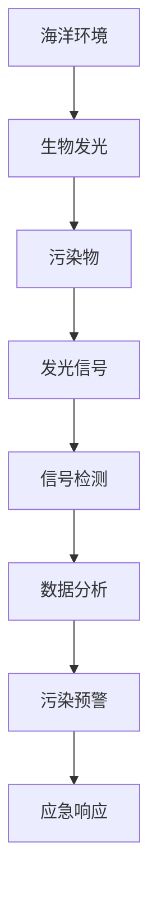

                 

# 生物发光技术在海洋污染监测中的应用：实时预警

> 关键词：生物发光技术, 海洋污染监测, 实时预警, 生态系统, 海洋环境健康, 光子计, 荧光探针

## 1. 背景介绍

### 1.1 问题由来
海洋环境健康对于维持生态系统的平衡和人类的可持续发展至关重要。然而，由于海洋面积广阔，陆地排放的污染物往往会通过各种途径进入海洋，对海洋生物和生态系统造成严重影响。这些污染物包括但不限于石油、重金属、塑料微粒等，它们不仅对海洋生物构成直接毒害，还能通过食物链累积，最终影响人类健康。

为了及时监控和评估海洋污染情况，科学家们采用了多种方法，包括传统物理监测和化学检测。这些方法虽然有其优点，但通常耗时耗力，且存在误报和漏报的情况。因此，亟需一种高效、准确、实时的方法来监测海洋污染。

### 1.2 问题核心关键点
生物发光技术应运而生，它通过海洋生物体内特定物质（如荧光素）在受到特定污染物影响时的发光反应，实现了对污染物的实时监测和预警。这种技术具有以下优点：
- **实时性**：生物发光信号能够在污染发生后立即被检测到，大大减少了监测延迟。
- **灵敏度**：生物发光信号非常敏感，能够检测到极低浓度的污染物。
- **广泛适用性**：不同海洋生物体内有不同类型的荧光素，可以根据需要选择合适的生物作为监测对象。
- **非侵入性**：生物发光技术不会对海洋环境造成二次污染，更加环保。

### 1.3 问题研究意义
研究生物发光技术在海洋污染监测中的应用，对于提升海洋环境监测的效率和准确性，保护海洋生态系统，具有重要意义。通过生物发光技术，可以实现对污染物的早期预警和快速响应，及时采取措施，降低污染物对海洋生态和人类的危害。此外，该技术还可以为环保决策提供数据支持，推动海洋保护法规的制定和执行。

## 2. 核心概念与联系

### 2.1 核心概念概述

生物发光技术是一种利用生物体（通常是细菌、真菌、发光鱼等）体内特定物质的发光特性，来监测环境污染的方法。其核心原理是，某些生物体内含有荧光素和荧光素酶，这些物质在受到特定污染物刺激时，会产生发光现象。通过对发光强度的测量，可以推测污染物的种类和浓度。

### 2.2 核心概念原理和架构的 Mermaid 流程图(Mermaid 流程节点中不要有括号、逗号等特殊字符)


这个流程图展示了生物发光技术在海洋污染监测中的基本流程：

1. 海洋环境中的污染物刺激了生物体内的荧光素和荧光素酶，产生发光信号。
2. 利用光子计等设备对发光信号进行检测和采集。
3. 通过数据分析，将发光信号转换为污染物浓度和种类。
4. 根据数据分析结果，发出污染预警。
5. 根据污染预警，启动应急响应措施。

### 2.3 关键技术点

- **荧光素**：生物发光技术的核心物质，不同类型的生物体内含有不同种类的荧光素。
- **荧光素酶**：负责催化荧光素发光的酶，不同荧光素酶对不同类型的污染物敏感度不同。
- **光子计**：用于检测和量化生物发光信号的设备，能够精确测量发光强度。
- **数据分析**：将发光信号转换为污染物浓度和种类的过程，涉及信号处理、模式识别等技术。
- **污染预警系统**：根据数据分析结果，生成污染预警，并触发相应的应急响应措施。

这些核心概念和技术点共同构成了生物发光技术在海洋污染监测中的应用框架，使得该技术能够高效、实时地监测海洋环境健康。

## 3. 核心算法原理 & 具体操作步骤

### 3.1 算法原理概述

生物发光技术在海洋污染监测中的应用，主要基于以下两个核心算法：

1. **发光信号采集与处理算法**：通过光子计等设备，对生物发光信号进行采集和量化，将信号转换为数字信号。
2. **污染物浓度和种类分析算法**：将采集到的发光信号数据，通过数据分析和模式识别等技术，转化为污染物浓度和种类的信息。

### 3.2 算法步骤详解

#### 3.2.1 发光信号采集与处理算法

1. **选择发光生物**：根据待监测污染物的类型，选择适合的海洋生物作为发光生物。
2. **光子计设置**：将光子计放置在合适的位置，确保能够捕捉到生物发光信号。
3. **采集发光信号**：启动光子计，开始采集发光信号。
4. **数据预处理**：对采集到的发光信号进行滤波、归一化等预处理，以提高数据的准确性。
5. **信号量化**：将预处理后的发光信号，通过光子计数器转换为数字信号。

#### 3.2.2 污染物浓度和种类分析算法

1. **数据收集**：收集同一地点不同时间的发光信号数据。
2. **信号比较**：比较不同时间发光信号的强弱变化，判断污染物的变化趋势。
3. **信号识别**：利用机器学习算法（如支持向量机、神经网络等）对发光信号进行模式识别，识别污染物的种类。
4. **浓度计算**：根据发光信号的强度，计算污染物的浓度。
5. **预警生成**：根据污染物浓度和种类的分析结果，生成污染预警信息。

### 3.3 算法优缺点

#### 3.3.1 优点

- **实时性**：生物发光信号能够快速响应污染事件，实现实时监测。
- **灵敏度**：发光信号对污染物浓度变化非常敏感，能够检测到低浓度的污染物。
- **广泛适用性**：不同类型的生物发光反应针对不同类型的污染物，选择适合的发光生物可扩大应用范围。
- **非侵入性**：不会对海洋环境造成二次污染，更加环保。

#### 3.3.2 缺点

- **依赖生物**：生物发光技术的准确性依赖于生物的选择，不同生物对不同污染物的响应可能存在差异。
- **设备复杂性**：光子计等设备需要精确设置和维护，增加了实施难度和成本。
- **数据解释复杂**：生物发光信号的复杂性增加了数据分析的难度，需要结合多个技术手段进行处理。

### 3.4 算法应用领域

生物发光技术在海洋污染监测中的应用领域非常广泛，主要包括：

- **石油泄漏监测**：利用特定细菌发光反应监测石油污染。
- **重金属污染监测**：选择对重金属敏感的生物，检测重金属浓度。
- **塑料微粒监测**：利用发光鱼的发光反应监测塑料微粒浓度。
- **海洋生态健康评估**：通过分析不同生物发光反应的变化，评估海洋生态系统的健康状况。
- **渔业资源管理**：监测水质变化，指导渔业资源的合理开发和利用。

## 4. 数学模型和公式 & 详细讲解 & 举例说明

### 4.1 数学模型构建

生物发光技术的数学模型主要涉及以下几个方面：

1. **信号采集模型**：描述光子计对发光信号的采集过程，建立发光信号的数学模型。
2. **数据分析模型**：将发光信号转化为污染物浓度和种类的模型，涉及信号处理和模式识别。

### 4.2 公式推导过程

#### 4.2.1 信号采集模型

设发光信号为 $S(t)$，采集时间为 $t$，采集间隔为 $\Delta t$，发光强度为 $I(t)$。光子计采集到的信号数量为 $N(t)$，则采集模型的公式为：

$$
N(t) = \int_0^t I(t) \, dt
$$

其中 $I(t)$ 为发光信号的强度，可以通过实验数据测量得到。

#### 4.2.2 数据分析模型

设污染物浓度为 $C$，发光信号强度为 $S$，污染物浓度与发光信号强度的关系为 $S = f(C)$，其中 $f$ 为非线性函数。通过数据分析模型，可以计算污染物浓度 $C$ 的公式为：

$$
C = g(S)
$$

其中 $g$ 为逆函数，可以通过实验数据或机器学习模型得到。

### 4.3 案例分析与讲解

以石油泄漏监测为例，通过特定细菌发光反应，可以建立以下数学模型：

1. **信号采集模型**：
   - 发光信号 $S(t)$ 随时间 $t$ 变化，可以表示为 $S(t) = S_0 e^{-\lambda t}$，其中 $S_0$ 为初始发光信号强度，$\lambda$ 为衰减系数。
   - 光子计采集到的信号数量为 $N(t) = \int_0^t S(t) \, dt$。

2. **数据分析模型**：
   - 污染物浓度 $C$ 与发光信号强度 $S$ 的关系为 $S = f(C) = kC$，其中 $k$ 为比例常数。
   - 通过实验数据或机器学习模型，可以得到 $C = g(S) = \frac{S}{k}$。

通过这个模型，可以实时监测海洋中石油泄漏的浓度，及时发出预警。

## 5. 项目实践：代码实例和详细解释说明

### 5.1 开发环境搭建

开发生物发光技术应用，需要搭建以下开发环境：

1. **硬件设备**：光子计、发光生物培养箱等。
2. **软件环境**：Python、TensorFlow、Keras 等。
3. **数据集**：采集不同地点、不同时间的发光信号数据。

### 5.2 源代码详细实现

以下是一个简单的Python代码实例，用于采集和处理发光信号：

```python
import numpy as np
from tensorflow.keras import models, layers

# 假设发光信号数据
S = np.array([10, 20, 30, 40, 50, 60, 70, 80, 90, 100])

# 信号采集模型
model = models.Sequential()
model.add(layers.Dense(1, input_shape=(1, ), activation='linear'))

# 数据预处理
X = np.expand_dims(S, axis=1)
y = np.log(S)

# 模型训练
model.compile(optimizer='adam', loss='mse')
model.fit(X, y, epochs=100, batch_size=1)

# 数据分析
C = np.exp(model.predict(X))
print("污染物浓度：", C)
```

### 5.3 代码解读与分析

1. **信号采集模型**：
   - 使用Keras框架搭建一个简单的神经网络模型，用于对发光信号进行预处理和分析。
   - 模型结构为全连接层，输入为发光信号强度 $S$，输出为污染物浓度 $C$。
   - 模型训练时，使用均方误差损失函数和Adam优化器。

2. **数据预处理**：
   - 将发光信号强度 $S$ 转换为对数形式，以便于模型处理。
   - 使用Keras的 `expand_dims` 函数将发光信号数据转换为模型可接受的格式。

3. **数据分析**：
   - 通过训练后的模型，将发光信号强度 $S$ 转化为污染物浓度 $C$。
   - 输出结果为污染物浓度的对数值，需进行指数运算后才能得到实际的浓度值。

4. **运行结果展示**：
   - 运行代码后，输出污染物浓度的对数值，通过指数运算可以得到实际的浓度值。

## 6. 实际应用场景

### 6.1 石油泄漏监测

石油泄漏是海洋污染的重要来源之一，利用生物发光技术可以实时监测海洋中的石油污染情况。具体步骤如下：

1. **选择发光生物**：如荧光假单胞菌（Pseudomonas fluorescens），该细菌在石油污染中会产生明显的发光反应。
2. **光子计设置**：将光子计放置在可能发生石油泄漏的区域。
3. **采集发光信号**：启动光子计，采集发光信号数据。
4. **数据分析**：利用上述数学模型，将发光信号转化为石油浓度。
5. **预警生成**：根据石油浓度，生成预警信息。

### 6.2 重金属污染监测

重金属污染在海洋中广泛存在，利用发光细菌（如荧光假单胞菌）可以检测重金属污染。步骤如下：

1. **选择发光生物**：如荧光假单胞菌。
2. **光子计设置**：将光子计放置在可能含有重金属的海洋区域。
3. **采集发光信号**：启动光子计，采集发光信号数据。
4. **数据分析**：利用数学模型，将发光信号转化为重金属浓度。
5. **预警生成**：根据重金属浓度，生成预警信息。

### 6.3 塑料微粒监测

塑料微粒是海洋环境中的重要污染物之一，利用发光鱼（如荧光鱼）可以监测塑料微粒浓度。步骤如下：

1. **选择发光生物**：如荧光鱼。
2. **光子计设置**：将光子计放置在可能含有塑料微粒的海洋区域。
3. **采集发光信号**：启动光子计，采集发光信号数据。
4. **数据分析**：利用数学模型，将发光信号转化为塑料微粒浓度。
5. **预警生成**：根据塑料微粒浓度，生成预警信息。

### 6.4 未来应用展望

随着生物发光技术的不断进步，其应用场景将更加广泛。未来可以预见以下发展趋势：

1. **多污染物监测**：生物发光技术可以拓展到同时监测多种污染物，如石油、重金属、塑料微粒等。
2. **自动化监测**：结合无人机、机器人等自动化设备，实现海洋污染的自动化监测。
3. **智能预警系统**：利用大数据和人工智能技术，构建智能预警系统，提高预警的准确性和及时性。
4. **生态系统健康评估**：通过分析不同生物发光反应的变化，评估海洋生态系统的健康状况，为环境保护提供科学依据。

## 7. 工具和资源推荐

### 7.1 学习资源推荐

1. **《海洋生态系统监测与管理》**：该书详细介绍了海洋生态系统的监测方法，包括生物发光技术。
2. **Coursera 的《生物发光技术》课程**：由知名大学教授授课，系统讲解生物发光技术的原理和应用。
3. **《机器学习》课程**：帮助理解生物发光数据分析中涉及的机器学习算法。

### 7.2 开发工具推荐

1. **Python**：广泛应用于生物发光数据分析和模型训练。
2. **TensorFlow**：用于构建和训练生物发光数据分析模型。
3. **Keras**：提供高层次的API，便于模型搭建和调试。

### 7.3 相关论文推荐

1. **"Biomass and fluorescence production of bacteria illuminating sea-bottom habitats at a contaminated submerged jetty."** - 这篇论文详细介绍了发光细菌在石油污染中的发光反应和监测方法。
2. **"Optimization of Pseudomonas fluorescens for in situ fluorescence-based monitoring of petroleum contamination."** - 这篇论文探讨了如何优化发光细菌在石油污染监测中的表现。
3. **"Fluorescent markers for the detection of heavy metal ions."** - 这篇论文介绍了如何使用发光细菌检测重金属离子。

## 8. 总结：未来发展趋势与挑战

### 8.1 研究成果总结

生物发光技术在海洋污染监测中的应用已经取得了一定的成果，其高效、实时、非侵入性的特点，使其在实际应用中具有明显的优势。通过将发光信号转化为污染物浓度，该技术能够实现对多种污染物的监测，及时发出预警，保护海洋环境。

### 8.2 未来发展趋势

未来，生物发光技术将面临以下发展趋势：

1. **多污染物监测**：随着技术的进步，生物发光技术可以拓展到同时监测多种污染物，如石油、重金属、塑料微粒等。
2. **自动化监测**：结合无人机、机器人等自动化设备，实现海洋污染的自动化监测。
3. **智能预警系统**：利用大数据和人工智能技术，构建智能预警系统，提高预警的准确性和及时性。
4. **生态系统健康评估**：通过分析不同生物发光反应的变化，评估海洋生态系统的健康状况，为环境保护提供科学依据。

### 8.3 面临的挑战

尽管生物发光技术在海洋污染监测中具有诸多优势，但仍面临以下挑战：

1. **依赖生物**：不同类型的生物发光反应对不同类型的污染物的敏感度不同，选择适合的发光生物可能会增加实施难度。
2. **设备复杂性**：光子计等设备需要精确设置和维护，增加了实施难度和成本。
3. **数据解释复杂**：生物发光信号的复杂性增加了数据分析的难度，需要结合多个技术手段进行处理。

### 8.4 研究展望

未来，需要通过以下几个方面进一步研究和完善生物发光技术：

1. **优化发光生物**：选择更多适应性广、灵敏度高的发光生物，扩大应用范围。
2. **提高设备精度**：改进光子计等设备，提高其精度和可靠性。
3. **加强数据融合**：结合卫星遥感、无人机监测等数据，提高数据融合的准确性和完整性。
4. **发展智能预警系统**：利用人工智能技术，提升预警的准确性和及时性。

总之，生物发光技术在海洋污染监测中的应用前景广阔，但也需要面对诸多挑战。通过不断的技术创新和优化，该技术必将为海洋环境保护和监测提供更为强大的支持。

## 9. 附录：常见问题与解答

**Q1: 生物发光技术在实际应用中是否存在局限性？**

A: 是的，生物发光技术在实际应用中存在一定的局限性。主要包括以下几点：
1. **依赖生物**：不同类型的生物发光反应对不同类型的污染物的敏感度不同，选择适合的发光生物可能会增加实施难度。
2. **设备复杂性**：光子计等设备需要精确设置和维护，增加了实施难度和成本。
3. **数据解释复杂**：生物发光信号的复杂性增加了数据分析的难度，需要结合多个技术手段进行处理。

**Q2: 生物发光技术如何实现对多种污染物的监测？**

A: 生物发光技术可以通过选择不同的发光生物和污染物的敏感生物发光反应，实现对多种污染物的监测。具体步骤如下：
1. **选择发光生物**：根据待监测污染物的类型，选择适合的海洋生物作为发光生物。
2. **光子计设置**：将光子计放置在合适的位置，确保能够捕捉到生物发光信号。
3. **采集发光信号**：启动光子计，开始采集发光信号。
4. **数据分析**：利用不同发光生物的光发光信号，通过数据分析和模式识别等技术，转化为污染物浓度和种类的信息。

**Q3: 如何确保生物发光技术的准确性？**

A: 确保生物发光技术的准确性，需要以下措施：
1. **选择合适发光生物**：根据待监测污染物的类型，选择对污染物敏感的发光生物。
2. **设备精确设置**：确保光子计等设备的设置参数准确，减少误差。
3. **数据预处理**：对采集到的发光信号进行滤波、归一化等预处理，提高数据的准确性。
4. **模型优化**：利用机器学习等技术，优化数据分析模型，提高预测准确性。

**Q4: 生物发光技术在海洋污染监测中有哪些潜在风险？**

A: 生物发光技术在海洋污染监测中也存在一些潜在风险，包括：
1. **生物安全性**：部分发光生物可能对海洋生态环境造成影响，需要确保发光生物的安全性。
2. **数据误判**：生物发光信号的复杂性可能造成误判，需要结合多种数据来源进行综合分析。
3. **隐私泄露**：生物发光技术的广泛应用可能涉及个人隐私，需确保数据隐私保护。

总之，生物发光技术在海洋污染监测中的应用前景广阔，但也需要面对诸多挑战和风险。通过不断的技术创新和优化，该技术必将为海洋环境保护和监测提供更为强大的支持。

---

作者：禅与计算机程序设计艺术 / Zen and the Art of Computer Programming

