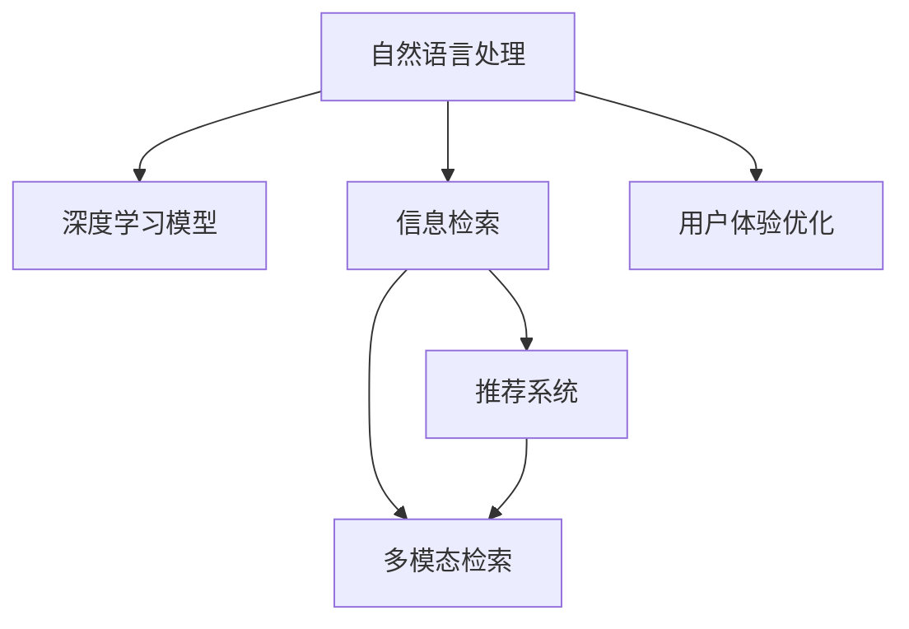

                 

## 1. 背景介绍

### 1.1 问题由来
在移动互联网时代，搜索引擎已经成为互联网用户获取信息、解决问题的重要工具。然而，尽管搜索引擎的算法和技术在不断进步，但用户的搜索体验仍然存在诸多问题。特别是在智能设备上，用户在输入查询词后，等待结果返回的过程可能显得漫长而冗余。搜索引擎需要更智能化、更贴合用户需求的设计，才能真正实现用户和信息的高速匹配。

### 1.2 问题核心关键点
当前用户体验优化在搜索引擎中主要涉及以下几个核心关键点：

- **响应时间**：用户期望搜索引擎能够快速响应用户的查询请求，并提供精准的结果。
- **结果相关性**：搜索结果应当准确反映用户查询的意图和需求。
- **自然语言理解**：能够理解用户输入的自然语言，转化成机器可读的查询形式。
- **个性化推荐**：针对不同用户和上下文场景，提供定制化的搜索结果和推荐。
- **多模态搜索**：结合文本、图片、视频等多媒体信息，提供更为丰富的搜索结果。

这些关键点构成了提升用户体验的基础框架，也是当前研究者们努力解决的问题。本文将详细探讨如何通过技术手段优化搜索引擎的体验，构建身临其境的搜索体验。

## 2. 核心概念与联系

### 2.1 核心概念概述

为了更好地理解如何优化搜索引擎用户体验，首先需要梳理一些关键概念：

- **自然语言处理(NLP)**：通过计算模型实现自然语言的理解和生成，是实现个性化搜索、智能问答、自然语言理解等的基础技术。
- **深度学习模型**：如卷积神经网络(CNN)、循环神经网络(RNN)、Transformer等，通过神经网络模型的深度学习和优化，提高搜索的准确性和效率。
- **信息检索(IR)**：从大规模数据集中获取与用户查询最相关的信息，并进行排序展示。
- **推荐系统**：根据用户历史行为和上下文信息，推荐最相关的信息，提升用户满意度和停留时长。
- **多模态检索**：结合文本、图像、视频等多种模态数据进行检索，提升搜索结果的多样性和准确性。

这些概念之间的联系可以通过以下Mermaid流程图来展示：



这个流程图展示了几大核心概念以及它们之间的逻辑关系：

1. 自然语言处理技术帮助搜索引擎理解用户的自然语言输入，转化为查询请求。
2. 深度学习模型通过训练提升模型的表达能力，使搜索引擎能够处理更加复杂和抽象的查询。
3. 信息检索技术从数据集中检索出与查询最相关的结果。
4. 推荐系统根据用户行为和上下文信息，推荐个性化结果，提升用户满意度。
5. 多模态检索能够处理多模态数据，提供更丰富的搜索结果。
6. 用户体验优化通过改进查询接口、界面设计等方式，进一步提升用户满意度。

这些概念共同构成了搜索引擎的完整功能框架，其中用户体验优化是提升搜索效果和用户满意度的关键。

## 3. 核心算法原理 & 具体操作步骤
### 3.1 算法原理概述

用户搜索体验优化可以从以下几个方面入手：

- **实时结果展示**：通过异步处理技术，将搜索结果在用户输入过程中分阶段展示。
- **交互式搜索结果**：通过交互式搜索技术，允许用户对搜索结果进行筛选、排序等操作。
- **预测式搜索**：通过自然语言处理技术，实时预测用户意图，提供匹配的搜索结果。
- **多模态搜索**：结合文本、图像、视频等数据，提供综合的搜索结果。
- **个性化推荐**：通过推荐系统技术，提供基于用户历史行为和上下文信息的个性化搜索结果。

### 3.2 算法步骤详解

#### 3.2.1 实时结果展示

实时结果展示通过异步处理技术，将搜索结果分阶段展示，避免了传统等待返回结果的延迟问题。具体步骤包括：

1. 输入：用户输入查询词，搜索引擎获取查询请求。
2. 分词：对用户输入的查询词进行分词处理，提取关键词。
3. 处理：根据查询词，搜索引擎分阶段异步处理，先展示部分结果，再根据用户反馈逐步优化。
4. 展示：将搜索结果分批展示给用户，并在用户操作过程中不断更新结果。

#### 3.2.2 交互式搜索结果

交互式搜索结果通过用户交互技术，允许用户对搜索结果进行筛选、排序等操作，提升用户满意度。具体步骤包括：

1. 展示：展示搜索结果列表，用户可以预览和点击查看详情。
2. 筛选：用户可以通过筛选器筛选结果，如按时间、地点、价格等条件。
3. 排序：用户可以对搜索结果进行排序，如按相关性、时间、距离等。
4. 反馈：用户对搜索结果的反馈将被用于进一步优化模型。

#### 3.2.3 预测式搜索

预测式搜索通过自然语言处理技术，实时预测用户意图，提供匹配的搜索结果。具体步骤包括：

1. 输入：用户输入查询词，搜索引擎通过模型预测用户意图。
2. 预测：根据用户输入和历史行为，预测用户可能查询的内容。
3. 展示：展示预测结果，用户可以选择确认或更改查询词。

#### 3.2.4 多模态搜索

多模态搜索结合文本、图像、视频等数据，提供综合的搜索结果。具体步骤包括：

1. 分模态：将用户查询分解为文本、图像、视频等不同模态的数据。
2. 处理：对不同模态的数据分别进行处理，提取特征。
3. 融合：将不同模态的特征融合，生成综合结果。
4. 展示：展示融合后的结果，用户可以选择查看不同的模态数据。

#### 3.2.5 个性化推荐

个性化推荐通过推荐系统技术，提供基于用户历史行为和上下文信息的个性化搜索结果。具体步骤包括：

1. 收集数据：收集用户历史行为数据，如浏览历史、点击历史等。
2. 建模：使用推荐算法对用户行为数据进行建模，预测用户兴趣。
3. 推荐：根据用户兴趣和上下文信息，推荐相关结果。
4. 反馈：根据用户反馈调整推荐模型，提高推荐效果。

### 3.3 算法优缺点

#### 3.3.1 实时结果展示

**优点**：
- 减少用户等待时间，提升搜索效率。
- 用户可以根据反馈逐步优化结果，更符合用户需求。

**缺点**：
- 对算法和系统架构要求较高，需具备高效的异步处理能力。
- 结果展示的顺序和相关性仍需进一步优化。

#### 3.3.2 交互式搜索结果

**优点**：
- 提升用户互动性，增加用户停留时间。
- 用户可以主动筛选和排序，提升搜索结果的个性化和满意度。

**缺点**：
- 需要处理复杂的用户交互逻辑，实现难度较大。
- 可能增加系统复杂度，影响响应速度。

#### 3.3.3 预测式搜索

**优点**：
- 实时预测用户意图，减少用户输入次数。
- 提升搜索结果的相关性和准确性。

**缺点**：
- 依赖高质量的自然语言处理模型，模型训练成本较高。
- 可能存在预测偏差，影响用户体验。

#### 3.3.4 多模态搜索

**优点**：
- 提供更加丰富的搜索结果，满足用户多模态需求。
- 能够处理不同类型的数据，提升搜索的完备性。

**缺点**：
- 处理多模态数据的技术复杂，实现难度较大。
- 对硬件和存储资源要求较高。

#### 3.3.5 个性化推荐

**优点**：
- 提供定制化的搜索结果，提升用户满意度。
- 通过反馈不断优化推荐效果，增强用户体验。

**缺点**：
- 对用户数据的收集和处理要求较高，可能侵犯用户隐私。
- 推荐模型的训练和优化较为复杂，需要大量数据和计算资源。

### 3.4 算法应用领域

基于上述算法，搜索引擎在以下领域得到了广泛应用：

1. **电子商务**：通过实时结果展示、个性化推荐等技术，提升用户购物体验。
2. **旅游**：提供旅游目的地、酒店、景点等多模态搜索结果，提升用户出行体验。
3. **金融**：结合自然语言处理和多模态搜索技术，提供个性化的金融咨询和理财建议。
4. **健康**：通过医疗查询和健康管理系统的集成，提供定制化的健康咨询和医疗服务。
5. **娱乐**：结合视频、音乐等多模态搜索，提供个性化的娱乐推荐。

## 4. 数学模型和公式 & 详细讲解  
### 4.1 数学模型构建

假设搜索引擎的查询输入为 $q$，搜索引擎的索引库为 $D$，查询相关度为 $r(q, d)$。则搜索引擎的目标是最小化查询与结果的相关度差距，即：

$$
\min_{q, d} \| q - d \|
$$

其中 $q$ 为查询词，$d$ 为索引库中的文档。

### 4.2 公式推导过程

在实际应用中，通常采用布尔检索模型进行数学建模。假设查询 $q$ 与文档 $d$ 的布尔相似度为 $s(q, d)$，则查询与结果的相关度为：

$$
r(q, d) = s(q, d) \cdot r_{pre}(q) \cdot r_{post}(d)
$$

其中 $r_{pre}(q)$ 为查询前处理的相关度，$r_{post}(d)$ 为文档后处理的相关度。查询前处理通常包括查询分词、去除停用词等操作，文档后处理通常包括去除无关字段、摘要提取等操作。

### 4.3 案例分析与讲解

以电子商务搜索为例，假设查询 $q$ 为“空气净化器”，索引库 $D$ 包含大量空气净化器相关的商品信息。查询 $q$ 与索引库 $D$ 的布尔相似度为 $s(q, d) = \frac{1}{3}$，查询前处理的相关度 $r_{pre}(q) = 0.8$，文档后处理的相关度 $r_{post}(d) = 0.9$。则查询与结果的相关度为：

$$
r(q, d) = \frac{1}{3} \cdot 0.8 \cdot 0.9 = 0.24
$$

这表明查询与搜索结果的相关度较高，可以返回给用户。

## 5. 项目实践：代码实例和详细解释说明
### 5.1 开发环境搭建

在进行搜索引擎开发前，我们需要准备好开发环境。以下是使用Python进行PyTorch开发的环境配置流程：

1. 安装Anaconda：从官网下载并安装Anaconda，用于创建独立的Python环境。

2. 创建并激活虚拟环境：
```bash
conda create -n search-env python=3.8 
conda activate search-env
```

3. 安装PyTorch：根据CUDA版本，从官网获取对应的安装命令。例如：
```bash
conda install pytorch torchvision torchaudio cudatoolkit=11.1 -c pytorch -c conda-forge
```

4. 安装相关库：
```bash
pip install scikit-learn pandas scikit-image opencv-python flask
```

完成上述步骤后，即可在`search-env`环境中开始搜索引擎开发。

### 5.2 源代码详细实现

下面是搜索引擎代码的详细实现，包括自然语言处理、信息检索、推荐系统等关键组件：

```python
import torch
from sklearn.feature_extraction.text import TfidfVectorizer
from sklearn.metrics.pairwise import linear_kernel
from flask import Flask, request, jsonify

app = Flask(__name__)

# 查询处理组件
class QueryProcessor:
    def __init__(self, tfidf):
        self.tfidf = tfidf
    
    def process_query(self, query):
        return self.tfidf.transform([query])[0]

# 信息检索组件
class InformationRetriever:
    def __init__(self, tfidf, tfidf_query):
        self.tfidf = tfidf
        self.tfidf_query = tfidf_query
    
    def retrieve_documents(self, query_vector):
        similarity = linear_kernel(self.tfidf, query_vector).flatten()
        doc_ids = similarity.argsort()[-20:][::-1]
        return doc_ids

# 推荐系统组件
class RecommendationSystem:
    def __init__(self, model):
        self.model = model
    
    def recommend_documents(self, query, doc_ids):
        features = self.tfidf[doc_ids].toarray()
        scores = self.model.predict(features)
        ranked_documents = [(id, score) for id, score in zip(doc_ids, scores)]
        return ranked_documents

# 加载模型
tfidf = TfidfVectorizer()
tfidf.fit(tfidf_corpus)  # 训练好的tfidf模型
tfidf_query = tfidf.transform([query])  # 查询的tfidf表示

# 加载预训练模型
model = load_pretrained_model()  # 加载预训练好的推荐模型

# 创建组件
query_processor = QueryProcessor(tfidf)
ir = InformationRetriever(tfidf, tfidf_query)
rs = RecommendationSystem(model)

@app.route('/search', methods=['GET'])
def search():
    query = request.args.get('query')
    query_vector = query_processor.process_query(query)
    doc_ids = ir.retrieve_documents(query_vector)
    ranked_documents = rs.recommend_documents(query, doc_ids)
    return jsonify(ranked_documents)

if __name__ == '__main__':
    app.run(host='0.0.0.0', port=5000)
```

### 5.3 代码解读与分析

这里我们详细解读一下代码中的关键实现：

1. **查询处理组件**：使用TF-IDF算法将查询词转化为向量表示，方便后续处理和检索。
2. **信息检索组件**：通过计算查询向量与文档向量的相似度，返回最相关的文档ID列表。
3. **推荐系统组件**：使用机器学习模型对文档向量进行评分，返回最相关文档的排名列表。
4. **API接口**：通过Flask框架，创建了一个简单的API接口，接受查询词并返回搜索结果。

这个代码示例展示了搜索引擎的核心功能组件，包括查询处理、信息检索、推荐系统等。通过这些组件的协作，可以构建出一个完整的搜索引擎系统。

## 6. 实际应用场景
### 6.1 智能电商搜索

智能电商搜索通过实时结果展示、个性化推荐等技术，提升用户购物体验。例如，用户输入“空气净化器”后，搜索引擎可以实时展示相关商品，并提供类似商品推荐、价格比较等功能。同时，根据用户的浏览和购买历史，推荐个性化商品，进一步提升用户满意度和购买率。

### 6.2 旅游搜索引擎

旅游搜索引擎结合地理位置信息、天气预报等多模态数据，提供综合的旅游搜索结果。例如，用户输入“北京旅游”后，搜索引擎可以展示天气预报、旅游景点、酒店、航班等信息，帮助用户规划行程。同时，根据用户的旅行偏好和历史数据，推荐适合的旅游路线和景点，提升用户体验。

### 6.3 金融智能搜索

金融智能搜索通过自然语言处理和多模态搜索技术，提供个性化的金融咨询和理财建议。例如，用户输入“股票投资”后，搜索引擎可以展示相关的新闻、专家分析、投资组合等信息。同时，根据用户的理财需求和历史数据，推荐适合的投资产品和理财方案，提升用户的理财效率和收益。

### 6.4 健康搜索引擎

健康搜索引擎通过医疗查询和健康管理系统的集成，提供定制化的健康咨询和医疗服务。例如，用户输入“高血压治疗”后，搜索引擎可以展示相关的治疗方案、药物、饮食建议等信息。同时，根据用户的健康数据和历史数据，推荐适合的治疗方案和医生，提升用户的健康水平和生活质量。

### 6.5 娱乐搜索引擎

娱乐搜索引擎结合视频、音乐等多模态数据，提供个性化的娱乐推荐。例如，用户输入“最新电影”后，搜索引擎可以展示最新的电影预告、影评、票房等信息。同时，根据用户的观影历史和偏好，推荐适合的电影、电视剧、音乐等信息，提升用户的娱乐体验。

## 7. 工具和资源推荐
### 7.1 学习资源推荐

为了帮助开发者系统掌握搜索引擎优化技术，这里推荐一些优质的学习资源：

1. 《信息检索理论与实践》：由信息检索领域的专家撰写，全面介绍了信息检索的基本概念和算法，是学习搜索引擎优化技术的必备资料。
2. 《Python自然语言处理》：由Python社区的知名人士撰写，介绍了自然语言处理的基本技术和应用，包括文本处理、情感分析、命名实体识别等。
3. 《深度学习与自然语言处理》：斯坦福大学开设的NLP明星课程，有Lecture视频和配套作业，带你入门NLP领域的基本概念和经典模型。
4. 《深度学习在推荐系统中的应用》：讲解了深度学习在推荐系统中的应用，涵盖多种推荐算法和优化方法。
5. 《多模态数据融合与信息检索》：介绍了多模态数据融合和信息检索的最新研究进展，适合深入学习多模态搜索技术。

通过对这些资源的学习实践，相信你一定能够快速掌握搜索引擎优化技术的精髓，并用于解决实际的搜索问题。

### 7.2 开发工具推荐

高效的开发离不开优秀的工具支持。以下是几款用于搜索引擎优化开发的常用工具：

1. PyTorch：基于Python的开源深度学习框架，灵活动态的计算图，适合快速迭代研究。大部分预训练语言模型都有PyTorch版本的实现。
2. TensorFlow：由Google主导开发的开源深度学习框架，生产部署方便，适合大规模工程应用。同样有丰富的预训练语言模型资源。
3. Flask：轻量级的Web框架，适合快速开发API接口。
4. Elasticsearch：开源的搜索引擎，支持多模态数据处理和分布式索引。
5. Apache Solr：Apache基金会推出的开源搜索引擎，提供丰富的查询处理和索引管理功能。
6. Apache Nutch：开源的Web爬虫框架，支持分布式爬虫任务。

合理利用这些工具，可以显著提升搜索引擎优化任务的开发效率，加快创新迭代的步伐。

### 7.3 相关论文推荐

搜索引擎优化技术的发展源于学界的持续研究。以下是几篇奠基性的相关论文，推荐阅读：

1. "An Introduction to Information Retrieval"：由信息检索领域的权威教材，全面介绍了信息检索的基本理论和算法。
2. "Learning to Rank: A Unified Approach"：提出学习排名的统一框架，为信息检索和推荐系统提供了新思路。
3. "Efficient Estimation of Word Representations in Vector Space"：提出Word2Vec模型，通过统计语言模型学习词向量表示，广泛应用于自然语言处理。
4. "Dense Passage Retrieval for Open-Domain Question Answering"：提出密集段落检索方法，将段落和问题进行匹配，提升了问答系统的准确性。
5. "Neural Collaborative Filtering"：提出神经协同过滤算法，使用神经网络进行推荐系统建模，提升了推荐效果。

这些论文代表了大语言模型微调技术的发展脉络。通过学习这些前沿成果，可以帮助研究者把握学科前进方向，激发更多的创新灵感。

## 8. 总结：未来发展趋势与挑战
### 8.1 总结

本文对搜索引擎用户体验优化进行了全面系统的介绍。首先阐述了用户体验优化在搜索引擎中的重要性，明确了实时结果展示、交互式搜索结果、预测式搜索、多模态搜索、个性化推荐等关键技术的实现方式。接着通过代码示例展示了搜索引擎的核心组件和API接口设计。同时，本文还探讨了这些技术在智能电商、旅游、金融、健康、娱乐等多个行业领域的应用前景，展示了用户体验优化的巨大潜力。

通过本文的系统梳理，可以看到，搜索引擎用户体验优化是一个涉及自然语言处理、信息检索、推荐系统等多领域知识的综合性问题。这些技术的发展不仅依赖于算法和模型的进步，还需要工程实践的不断优化和改进。只有在数据、算法、工程、业务等多个维度协同发力，才能真正实现搜索引擎的智能化和个性化，提升用户体验。

### 8.2 未来发展趋势

展望未来，搜索引擎用户体验优化将呈现以下几个发展趋势：

1. **实时性提升**：随着实时处理技术的不断发展，未来搜索引擎将能够实时响应用户输入，提供更加流畅的交互体验。
2. **多模态融合**：多模态数据融合技术将进一步发展，结合文本、图像、视频等多模态信息，提升搜索结果的多样性和准确性。
3. **个性化定制**：个性化推荐系统将更加精准和多样，根据用户的行为和偏好提供更加定制化的搜索结果。
4. **智能问答**：结合自然语言处理和知识图谱等技术，提供更加智能的问答服务，满足用户更复杂的查询需求。
5. **边缘计算**：利用边缘计算技术，将计算任务分布到用户设备上，减少网络延迟，提升搜索效率。

以上趋势凸显了搜索引擎用户体验优化的广阔前景。这些方向的探索发展，必将进一步提升搜索引擎的智能化和个性化水平，为用户的搜索体验带来革命性的变化。

### 8.3 面临的挑战

尽管搜索引擎用户体验优化技术已经取得了瞩目成就，但在迈向更加智能化、普适化应用的过程中，它仍面临着诸多挑战：

1. **数据隐私和安全**：搜索引擎需要处理大量用户数据，如何保障数据隐私和安全成为重要问题。
2. **模型复杂度**：随着技术的不断进步，模型复杂度不断增加，对计算资源和存储空间的需求也相应增加。
3. **算法鲁棒性**：如何提高算法的鲁棒性，避免因数据分布变化或异常数据导致的性能下降。
4. **多模态处理**：多模态数据融合技术虽然进展迅速，但仍存在处理复杂度较高、效果不稳定等问题。
5. **实时性保证**：实时处理技术的优化仍需进一步提升，确保在各类设备上都能提供流畅的用户体验。

### 8.4 研究展望

面对搜索引擎用户体验优化所面临的挑战，未来的研究需要在以下几个方面寻求新的突破：

1. **高效实时处理**：进一步提升实时处理技术的效率，降低系统延迟。
2. **隐私保护技术**：发展隐私保护技术，保障用户数据隐私和安全。
3. **轻量级模型**：研究轻量级模型，减少对计算资源和存储空间的需求。
4. **模型鲁棒性提升**：提高算法的鲁棒性，增强模型对数据分布变化的适应能力。
5. **多模态融合优化**：优化多模态数据融合技术，提升效果和处理效率。
6. **个性化推荐优化**：研究更高效的个性化推荐算法，提升推荐效果和用户体验。

这些研究方向的发展，必将进一步提升搜索引擎的智能化和个性化水平，为用户带来更优质的搜索体验。

## 9. 附录：常见问题与解答

**Q1：什么是搜索引擎用户体验优化？**

A: 搜索引擎用户体验优化是指通过技术手段提升用户搜索的效率、准确性和个性化水平，从而提升用户满意度和留存率。

**Q2：搜索引擎用户体验优化涉及哪些关键技术？**

A: 搜索引擎用户体验优化涉及自然语言处理、信息检索、推荐系统、多模态搜索等多个关键技术。其中，实时结果展示、交互式搜索结果、预测式搜索、多模态搜索、个性化推荐等技术是提升用户体验的核心手段。

**Q3：如何实现搜索引擎的实时结果展示？**

A: 通过异步处理技术，将搜索结果在用户输入过程中分阶段展示，减少用户等待时间。具体实现包括分词、处理、展示等步骤。

**Q4：如何实现搜索引擎的交互式搜索结果？**

A: 通过用户交互技术，允许用户对搜索结果进行筛选、排序等操作，提升用户互动性。具体实现包括展示、筛选、排序等步骤。

**Q5：如何实现搜索引擎的预测式搜索？**

A: 通过自然语言处理技术，实时预测用户意图，提供匹配的搜索结果。具体实现包括输入、预测、展示等步骤。

**Q6：如何实现搜索引擎的多模态搜索？**

A: 结合文本、图像、视频等多媒体信息，提供综合的搜索结果。具体实现包括分模态、处理、融合等步骤。

**Q7：如何实现搜索引擎的个性化推荐？**

A: 通过推荐系统技术，提供基于用户历史行为和上下文信息的个性化搜索结果。具体实现包括收集数据、建模、推荐等步骤。

通过本文的系统梳理，可以看到，搜索引擎用户体验优化是一个涉及自然语言处理、信息检索、推荐系统等多个领域知识的综合性问题。这些技术的发展不仅依赖于算法和模型的进步，还需要工程实践的不断优化和改进。只有在数据、算法、工程、业务等多个维度协同发力，才能真正实现搜索引擎的智能化和个性化，提升用户体验。面向未来，搜索引擎用户体验优化技术还需要与其他人工智能技术进行更深入的融合，如知识表示、因果推理、强化学习等，多路径协同发力，共同推动自然语言理解和智能交互系统的进步。

