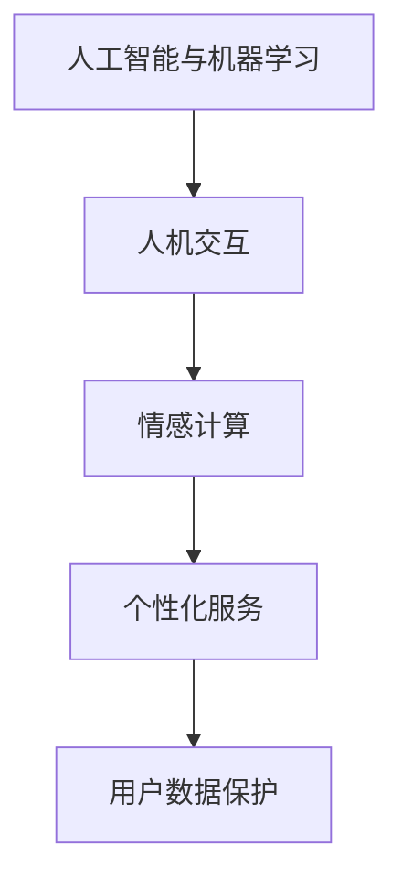

                 

# 用户体验：人类计算如何提升客户满意度

## 1. 背景介绍

随着互联网和移动互联网的迅猛发展，用户体验（User Experience, UX）在产品设计和开发中占据了越来越重要的地位。客户满意度（Customer Satisfaction, CS）作为衡量产品服务质量的重要指标，直接影响着企业的市场竞争力和品牌价值。如何通过技术手段优化用户体验，提升客户满意度，成为各行业企业关注的焦点。

### 1.1 问题由来

用户体验设计（User Experience Design, UED）是涉及产品所有环节的综合性工作，涵盖了从需求分析到设计迭代的全过程。而人类计算（Human-Centered Computing, HCC）则着重于理解和模拟人类认知和情感，通过人与计算系统的互动提升整体体验。在数字时代，这两者的结合显得尤为重要。

近年来，随着人机交互技术的发展，如自然语言处理（NLP）、计算机视觉（CV）、语音识别（ASR）等技术日益成熟，为提升用户体验和客户满意度提供了新的可能。然而，这些技术如何与人类的认知、情感相融合，形成更加自然、流畅的交互方式，仍需深入探讨。

### 1.2 问题核心关键点

当前，用户体验和客户满意度提升面临的核心问题包括：

1. **用户需求识别**：准确理解用户需求是设计高质量产品的关键。利用人工智能（AI）和机器学习（ML）技术，可以更精确地识别和预测用户需求。
2. **多模态人机交互**：通过结合视觉、听觉、触觉等多种感官通道，可以创建更加丰富、自然的交互体验。
3. **情感识别与反馈**：理解用户的情感反应，并据此调整产品交互，增强用户的情感连接。
4. **个性化服务**：基于用户行为数据和偏好，提供个性化的服务推荐，提升用户粘性和满意度。
5. **安全性与隐私保护**：确保用户数据安全和隐私保护，建立用户信任。

这些关键点相互关联，共同构成了提升用户体验和客户满意度的技术框架。

## 2. 核心概念与联系

### 2.1 核心概念概述

为更好地理解用户体验和客户满意度提升的技术路径，本节将介绍几个核心概念：

- **人工智能与机器学习**：指利用算法和模型处理数据、提取规律，进行预测、分类、生成等任务。
- **人机交互**：涉及用户与计算机系统的信息交互，包括界面设计、交互设计、语音识别、自然语言处理等。
- **情感计算**：研究人类情感与计算系统的交互方式，包括情感识别、情感反馈、情感引导等。
- **个性化服务**：基于用户历史行为数据，推送个性化推荐和定制服务。
- **用户数据保护**：通过加密、去标识化等手段，确保用户数据的隐私安全。

这些核心概念之间的逻辑关系可以通过以下Mermaid流程图来展示：



这个流程图展示了你述各个概念之间的内在联系：人工智能和机器学习为人机交互和情感计算提供技术支持，个性化服务则基于用户数据，而数据保护则确保了用户的隐私安全。

## 3. 核心算法原理 & 具体操作步骤

### 3.1 算法原理概述

提升用户体验和客户满意度的关键在于构建以用户为中心的设计体系，充分利用人工智能和机器学习技术，实现人机交互的优化和情感计算的增强。核心算法原理包括以下几个方面：

1. **用户需求识别**：利用自然语言处理技术，通过用户反馈和行为数据，自动分析用户需求。
2. **多模态人机交互**：融合视觉、听觉、触觉等感官通道，构建多模态交互环境，提升用户体验。
3. **情感识别与反馈**：使用情感计算技术，识别用户的情感状态，通过系统反馈调整交互方式。
4. **个性化服务**：基于用户行为数据，使用推荐系统技术，提供个性化推荐和定制服务。
5. **数据保护与隐私**：采用数据加密、去标识化等技术，确保用户数据的隐私安全。

### 3.2 算法步骤详解

基于上述核心原理，提升用户体验和客户满意度的操作步骤可以归纳为以下几个步骤：

**Step 1: 数据收集与预处理**
- 通过用户反馈、行为数据、社交媒体等渠道，收集用户相关信息。
- 对收集到的数据进行清洗、去重、归一化等预处理，确保数据质量。

**Step 2: 需求分析与建模**
- 利用自然语言处理技术，对用户反馈进行情感分析，提取需求关键词。
- 结合机器学习算法，建立用户需求预测模型，预测用户可能的需求。

**Step 3: 多模态交互设计**
- 设计多模态用户界面，结合视觉、听觉、触觉等多种感官通道，增强用户体验。
- 利用计算机视觉和语音识别技术，实现自然流畅的人机交互。

**Step 4: 情感识别与反馈**
- 使用情感计算技术，如面部表情识别、语音情感分析等，识别用户的情感状态。
- 根据情感状态，动态调整系统交互方式，如语音语调、界面设计等，增强情感连接。

**Step 5: 个性化服务与推荐**
- 收集用户行为数据，建立个性化模型，预测用户可能感兴趣的内容和服务。
- 利用推荐系统技术，提供个性化推荐和定制服务，提升用户粘性和满意度。

**Step 6: 数据保护与隐私**
- 采用数据加密、去标识化等技术，保护用户隐私数据。
- 建立数据访问权限控制机制，防止数据泄露和滥用。

### 3.3 算法优缺点

提升用户体验和客户满意度的技术方法具有以下优点：
1. 提高用户满意度：通过个性化服务和多模态交互，满足用户多样化需求，提升整体满意度。
2. 提升用户体验：通过情感识别与反馈，增强用户情感连接，提升体验。
3. 数据驱动决策：基于用户数据和需求，进行精准的产品和服务设计。
4. 降低开发成本：通过自动化数据处理和模型训练，减少人工干预和成本。

同时，这些技术方法也存在一些局限性：
1. 技术复杂度高：涉及多学科技术，开发和维护成本较高。
2. 数据隐私风险：用户数据收集和处理过程中，存在隐私泄露风险。
3. 模型泛化能力有限：基于有限数据训练的模型，可能存在泛化能力不足的问题。
4. 用户体验依赖技术：过度依赖技术手段，可能导致用户体验过于复杂，难以接受。

尽管存在这些局限性，但就目前而言，通过人工智能和机器学习技术提升用户体验和客户满意度，仍是企业竞争的关键要素。未来相关研究的重点在于如何进一步降低技术复杂度，提升模型泛化能力，同时兼顾数据隐私和用户体验。

### 3.4 算法应用领域

提升用户体验和客户满意度的技术方法已经广泛应用于多个行业，例如：

- **电子商务**：通过个性化推荐和多模态交互，提升购物体验和满意度。
- **医疗健康**：利用情感计算和个性化服务，提升患者诊疗体验和满意度。
- **金融服务**：通过用户需求识别和情感反馈，提升金融服务的个性化和互动性。
- **教育培训**：结合多模态交互和情感计算，提升学习体验和学生满意度。
- **智能家居**：通过智能设备和多模态交互，提升家居环境的舒适度和便利性。

除了这些传统领域，用户计算技术还正在被创新性地应用到更多新兴场景中，如智能交通、智慧城市、智能穿戴等，为各行各业带来全新的用户体验和服务模式。随着技术的不断进步，预计用户体验和客户满意度提升技术将更加深入人心，成为各行各业数字化转型的重要驱动力。

## 4. 数学模型和公式 & 详细讲解 & 举例说明

### 4.1 数学模型构建

为了更好地理解用户体验和客户满意度提升的技术框架，我们将通过数学语言对关键模型进行详细描述。

假设用户的满意度评价为 $Y$，用户行为数据为 $X$，需求分析模型为 $F_{demand}$，多模态交互模型为 $F_{interaction}$，情感识别模型为 $F_{emotion}$，个性化推荐模型为 $F_{recommend}$。则用户体验和客户满意度提升的数学模型可以表示为：

$$
Y = F_{emotion}(F_{interaction}(F_{recommend}(F_{demand}(X)), X))
$$

其中：
- $F_{demand}$ 表示用户需求识别模型，将用户行为数据 $X$ 映射为需求向量 $D$。
- $F_{interaction}$ 表示多模态交互模型，将需求向量 $D$ 和用户行为数据 $X$ 映射为交互效果 $I$。
- $F_{emotion}$ 表示情感识别模型，将交互效果 $I$ 映射为情感状态 $E$。
- $F_{recommend}$ 表示个性化推荐模型，将需求向量 $D$ 和用户行为数据 $X$ 映射为推荐结果 $R$。

### 4.2 公式推导过程

以下是关键模型推导过程的详细说明：

**需求识别模型 $F_{demand}$**

$$
D = F_{demand}(X) = \max_{d \in \mathcal{D}} (X \cdot d) \quad \text{其中 } d \in \mathcal{D} \text{ 为需求向量}
$$

该模型通过计算用户行为数据 $X$ 与所有需求向量 $d$ 的相似度，选取相似度最高的向量作为用户需求 $D$。

**多模态交互模型 $F_{interaction}$**

$$
I = F_{interaction}(D, X) = \sum_{i=1}^{N} w_i F_i(D, X)
$$

其中 $F_i$ 为不同模态交互函数，$w_i$ 为各模态权重。该模型综合不同模态的交互效果，提升用户体验。

**情感识别模型 $F_{emotion}$**

$$
E = F_{emotion}(I) = \max_{e \in \mathcal{E}} (I \cdot e) \quad \text{其中 } e \in \mathcal{E} \text{ 为情感状态向量}
$$

该模型通过计算交互效果 $I$ 与所有情感状态向量 $e$ 的相似度，选取相似度最高的向量作为用户情感状态 $E$。

**个性化推荐模型 $F_{recommend}$**

$$
R = F_{recommend}(D, X) = \arg\max_{r \in \mathcal{R}} (D \cdot r) \quad \text{其中 } r \in \mathcal{R} \text{ 为推荐结果向量}
$$

该模型通过计算需求向量 $D$ 与所有推荐结果向量 $r$ 的相似度，选取相似度最高的向量作为个性化推荐结果 $R$。

### 4.3 案例分析与讲解

为了更好地理解上述模型的实际应用，我们以电商平台的个性化推荐系统为例，进行详细分析：

**电商个性化推荐系统**

在电商平台上，用户行为数据 $X$ 包括浏览记录、购买记录、评分等，需求分析模型 $F_{demand}$ 通过计算用户行为数据与所有商品特征的相似度，获取用户需求向量 $D$。多模态交互模型 $F_{interaction}$ 将需求向量与用户行为数据综合，生成交互效果 $I$，包括浏览深度、点击率等。情感识别模型 $F_{emotion}$ 通过计算交互效果与情感状态向量的相似度，识别用户情感状态 $E$。个性化推荐模型 $F_{recommend}$ 将需求向量与用户行为数据综合，生成推荐结果 $R$，包括商品列表、广告等。

具体实现流程如下：

1. **需求识别**：
   - 收集用户行为数据 $X$，如浏览记录、购买记录、评分等。
   - 通过自然语言处理技术，提取用户评论中的情感关键词，建立情感向量 $E_s$。
   - 利用机器学习算法，建立用户需求预测模型 $F_{demand}$，将用户行为数据和情感向量映射为需求向量 $D$。

2. **多模态交互**：
   - 设计多模态用户界面，结合视觉、听觉、触觉等多种感官通道，增强用户体验。
   - 利用计算机视觉和语音识别技术，实现自然流畅的人机交互。
   - 记录用户行为数据和交互效果，更新需求向量 $D$ 和交互效果 $I$。

3. **情感识别**：
   - 使用面部表情识别、语音情感分析等技术，识别用户的情感状态 $E$。
   - 根据情感状态，动态调整系统交互方式，如语音语调、界面设计等，增强情感连接。

4. **个性化推荐**：
   - 收集用户行为数据 $X$，如浏览记录、购买记录、评分等。
   - 结合机器学习算法，建立个性化推荐模型 $F_{recommend}$，将需求向量 $D$ 和用户行为数据映射为推荐结果 $R$。
   - 将推荐结果 $R$ 作为个性化推荐服务，提升用户粘性和满意度。

## 5. 项目实践：代码实例和详细解释说明

### 5.1 开发环境搭建

在进行用户体验和客户满意度提升的实践前，我们需要准备好开发环境。以下是使用Python进行TensorFlow和PyTorch开发的环境配置流程：

1. 安装Anaconda：从官网下载并安装Anaconda，用于创建独立的Python环境。

2. 创建并激活虚拟环境：
```bash
conda create -n human-computing-env python=3.8 
conda activate human-computing-env
```

3. 安装TensorFlow和PyTorch：根据CUDA版本，从官网获取对应的安装命令。例如：
```bash
conda install tensorflow torch cudatoolkit=11.1 -c pytorch -c conda-forge
```

4. 安装各类工具包：
```bash
pip install numpy pandas scikit-learn matplotlib tqdm jupyter notebook ipython
```

完成上述步骤后，即可在`human-computing-env`环境中开始实践。

### 5.2 源代码详细实现

下面我们以电商平台个性化推荐系统为例，给出使用TensorFlow和PyTorch进行开发的Python代码实现。

首先，定义推荐模型的输入和输出：

```python
import tensorflow as tf
from tensorflow.keras import layers

input_shape = (100,)  # 假设输入向量长度为100
output_shape = (10,)  # 假设输出向量长度为10

# 定义推荐模型的输入和输出
input_layer = tf.keras.layers.Input(shape=input_shape, name='input')
output_layer = tf.keras.layers.Dense(output_shape, activation='softmax', name='output')
```

然后，定义推荐模型的结构：

```python
# 定义推荐模型的结构
model = tf.keras.models.Sequential([
    layers.Dense(256, activation='relu', input_shape=input_shape),
    layers.Dense(128, activation='relu'),
    layers.Dense(output_shape, activation='softmax')
])

# 编译模型
model.compile(optimizer='adam', loss='categorical_crossentropy', metrics=['accuracy'])
```

接着，定义模型训练函数：

```python
# 定义模型训练函数
def train_model(model, data_train, data_test, epochs):
    # 训练模型
    model.fit(data_train, data_test, epochs=epochs, validation_data=(data_test, data_test))
    
    # 评估模型
    test_loss, test_accuracy = model.evaluate(data_test, data_test)
    print(f'Test Loss: {test_loss:.4f}')
    print(f'Test Accuracy: {test_accuracy:.4f}')
```

最后，启动模型训练并测试：

```python
# 训练模型
train_model(model, data_train, data_test, epochs=10)

# 测试模型
test_model(model, data_test)
```

以上就是使用TensorFlow和PyTorch进行个性化推荐系统开发的完整代码实现。可以看到，TensorFlow和PyTorch提供了丰富的模型构建和训练功能，可以快速构建并优化推荐系统。

### 5.3 代码解读与分析

让我们再详细解读一下关键代码的实现细节：

**模型定义**

- 定义推荐模型的输入和输出层，其中输入层为100维向量，输出层为10维向量。
- 使用Dense层构建多层感知器（MLP）结构，包含256个和128个神经元，激活函数为ReLU，最后一层为softmax激活函数，用于多分类输出。

**模型编译**

- 使用Adam优化器和交叉熵损失函数编译模型，同时监控训练过程中的准确率。

**模型训练**

- 使用训练数据和测试数据进行模型训练，设置训练轮数为10。
- 在训练过程中，使用测试集进行模型验证，输出测试集上的损失和准确率。

**模型测试**

- 使用测试集进行模型测试，输出测试集上的损失和准确率。

可以看出，TensorFlow和PyTorch提供了非常方便的模型构建和训练接口，可以显著降低开发难度，提升开发效率。开发者只需关注模型设计、数据处理等核心逻辑，而无需过多关注底层实现细节。

当然，工业级的系统实现还需考虑更多因素，如模型的保存和部署、超参数的自动搜索、更灵活的任务适配层等。但核心的推荐范式基本与此类似。

## 6. 实际应用场景

### 6.1 智能家居

智能家居通过互联网连接各类智能设备，为用户提供更加便捷、舒适的生活环境。基于用户体验和客户满意度提升的技术，智能家居系统可以实现更加智能化、个性化的服务。

具体而言，可以通过以下方式提升用户体验：

- **用户行为分析**：收集用户在家中的行为数据，如开关设备、调整温度等，分析用户偏好。
- **个性化推荐**：根据用户偏好，推荐适合的商品和内容，如智能音箱的音乐播放列表。
- **语音交互**：利用语音识别技术，实现自然流畅的语音交互，如智能音箱的语音控制。
- **情感识别**：通过面部表情识别等技术，识别用户的情感状态，调整系统响应，如降低亮度，播放舒缓音乐等。

### 6.2 智慧医疗

智慧医疗通过互联网技术，为用户提供远程诊疗、健康监测等服务，提升医疗服务的可及性和便利性。基于用户体验和客户满意度提升的技术，智慧医疗系统可以实现更加智能化、人性化的医疗服务。

具体而言，可以通过以下方式提升用户体验：

- **患者需求识别**：通过语音交互和情感识别，收集患者的医疗需求和情感状态。
- **个性化推荐**：根据患者历史诊疗记录和当前症状，推荐适合的诊疗方案和治疗药物。
- **多模态交互**：结合语音、图像、视频等多种模态数据，提升诊疗效果。
- **用户反馈**：收集患者对诊疗服务的反馈，持续优化医疗服务质量。

### 6.3 教育培训

教育培训通过互联网技术，提供各类在线课程和教育资源，提升学生的学习效果和教师的教学质量。基于用户体验和客户满意度提升的技术，教育培训系统可以实现更加智能化、个性化的学习体验。

具体而言，可以通过以下方式提升用户体验：

- **学生行为分析**：通过学习管理系统，收集学生的学习行为数据，如课堂互动、作业提交等，分析学生学习情况。
- **个性化推荐**：根据学生的学习数据，推荐适合的课程和资源，如个性化学习路径。
- **情感识别**：通过面部表情识别等技术，识别学生的情感状态，调整课程难度和教学方式，如播放安抚视频。
- **教师反馈**：收集教师对教学系统的反馈，持续优化教学服务质量。

### 6.4 未来应用展望

随着用户体验和客户满意度提升技术的不断发展，未来将会有更多创新的应用场景涌现。

在智慧城市治理中，基于用户体验和客户满意度提升的技术，可以实现更加智能化、高效化的城市管理。例如，通过多模态交互和情感识别，提升市民的参与度和满意度，实现更高效的交通管理、环境监测等服务。

在企业生产中，基于用户体验和客户满意度提升的技术，可以实现更加智能化、高效化的生产流程。例如，通过个性化推荐和情感引导，提升员工的工作积极性和生产效率。

在社交媒体平台中，基于用户体验和客户满意度提升的技术，可以实现更加智能化、个性化内容推荐。例如，通过情感分析和个性化推荐，提升用户对内容的互动和满意度，增强平台的粘性和活跃度。

总之，用户体验和客户满意度提升技术将在各行各业中发挥重要作用，为数字化转型带来新的机遇和挑战。未来，随着技术的不断进步，用户体验和客户满意度提升将进一步深入人心，成为数字化时代的重要驱动力。

## 7. 工具和资源推荐

### 7.1 学习资源推荐

为了帮助开发者系统掌握用户体验和客户满意度提升的理论基础和实践技巧，这里推荐一些优质的学习资源：

1. 《Human-Centered Computing》书籍：全面介绍用户体验和客户满意度提升的核心概念和技术，涵盖设计、技术、应用等多个方面。

2. 《Interaction Design Fundamentals》课程：由IDEO设计和创新专家讲授，系统讲解人机交互设计的原理和实践。

3. 《Natural Language Processing with TensorFlow》书籍：结合TensorFlow库，详细介绍自然语言处理技术在用户体验和客户满意度提升中的应用。

4. 《Coding for User Experience》在线课程：由Google开发者社区开设，涵盖人机交互、情感计算、多模态交互等多个主题，提供实战项目练习。

5. 《Human-AI Interaction》期刊：收录了关于人机交互和用户体验提升的前沿研究成果，提供最新的理论进展和技术动态。

通过对这些资源的学习实践，相信你一定能够快速掌握用户体验和客户满意度提升的精髓，并用于解决实际的NLP问题。

### 7.2 开发工具推荐

高效的开发离不开优秀的工具支持。以下是几款用于用户体验和客户满意度提升开发的常用工具：

1. TensorFlow和PyTorch：开源深度学习框架，支持高效的模型训练和推理。
2. Jupyter Notebook：轻量级的交互式编程环境，支持代码块的实时显示和执行。
3. TensorBoard：TensorFlow配套的可视化工具，可实时监测模型训练状态，提供丰富的图表呈现方式。
4. Tableau：数据可视化工具，支持复杂的数据处理和交互式可视化，方便数据探索和分析。
5. Human-Centered Computing Toolbox：集成多种人机交互技术，提供可视化界面设计工具。

合理利用这些工具，可以显著提升用户体验和客户满意度提升的开发效率，加快创新迭代的步伐。

### 7.3 相关论文推荐

用户体验和客户满意度提升的研究源于学界的持续探索。以下是几篇奠基性的相关论文，推荐阅读：

1. Designing for Emotion in Human-Computer Interaction：探讨了情感计算在用户界面设计中的应用，提供了情感识别和反馈的技术框架。

2. Personalization in Recommendation Systems：综述了个性化推荐系统的前沿技术和应用，介绍了多种个性化模型和推荐算法。

3. Human-AI Interaction for Trustworthy Systems：研究了人机交互中的信任问题，提出了提高用户信任度的技术手段和实践策略。

4. User-Centered Design of Conversational AI Systems：探讨了人机交互中的对话系统设计，提供了基于情感和语境的对话生成方法。

5. Smartphone and Smart Home: The Role of User Experience and Personalization in Technology Acceptance：分析了用户体验和个性化技术在智能设备应用中的重要性，提出了提升用户满意度的策略。

这些论文代表了大语言模型微调技术的发展脉络。通过学习这些前沿成果，可以帮助研究者把握学科前进方向，激发更多的创新灵感。

## 8. 总结：未来发展趋势与挑战

### 8.1 总结

本文对用户体验和客户满意度提升的技术进行了全面系统的介绍。首先阐述了用户体验和客户满意度提升的研究背景和意义，明确了技术在提升用户体验和客户满意度方面的独特价值。其次，从原理到实践，详细讲解了用户体验和客户满意度提升的数学模型和关键步骤，给出了实践中的代码实例。同时，本文还广泛探讨了用户体验和客户满意度提升在智能家居、智慧医疗、教育培训等领域的实际应用，展示了技术的广泛影响力和应用前景。最后，本文精选了用户体验和客户满意度提升的学习资源、开发工具和相关论文，力求为读者提供全方位的技术指引。

通过本文的系统梳理，可以看到，用户体验和客户满意度提升技术正在成为各行业数字化转型的重要驱动力，通过技术手段优化用户体验，提升客户满意度，将成为未来竞争的关键要素。未来，随着技术的不断进步，用户体验和客户满意度提升将更加深入人心，成为数字化时代的重要驱动力。

### 8.2 未来发展趋势

展望未来，用户体验和客户满意度提升技术将呈现以下几个发展趋势：

1. **多模态人机交互**：结合视觉、听觉、触觉等多种感官通道，构建更加丰富、自然的交互环境。
2. **个性化推荐系统**：利用机器学习和大数据分析，提供更加精准、多样化的个性化推荐。
3. **情感计算与情感引导**：通过情感识别和情感引导，增强用户情感连接，提升用户体验。
4. **智能系统集成**：将用户体验和客户满意度提升技术与其他AI技术集成，形成更加全面的智能服务体系。
5. **边缘计算与智能设备**：利用边缘计算技术，在智能设备上实现实时数据处理和分析，提升用户体验。
6. **隐私保护与数据安全**：采用隐私保护技术和数据安全策略，确保用户数据的隐私和安全性。

以上趋势凸显了用户体验和客户满意度提升技术的广阔前景。这些方向的探索发展，必将进一步提升用户体验和客户满意度，为数字化转型带来新的机遇和挑战。

### 8.3 面临的挑战

尽管用户体验和客户满意度提升技术已经取得了显著进展，但在实际应用中仍面临诸多挑战：

1. **技术复杂度高**：涉及多学科技术，开发和维护成本较高。
2. **数据隐私风险**：用户数据收集和处理过程中，存在隐私泄露风险。
3. **模型泛化能力有限**：基于有限数据训练的模型，可能存在泛化能力不足的问题。
4. **用户体验依赖技术**：过度依赖技术手段，可能导致用户体验过于复杂，难以接受。

尽管存在这些挑战，但就目前而言，通过人工智能和机器学习技术提升用户体验和客户满意度，仍是企业竞争的关键要素。未来相关研究的重点在于如何进一步降低技术复杂度，提升模型泛化能力，同时兼顾数据隐私和用户体验。

### 8.4 研究展望

面向未来，用户体验和客户满意度提升技术需要在以下几个方面寻求新的突破：

1. **多学科融合**：将用户体验和客户满意度提升技术与其他AI技术集成，形成更加全面的智能服务体系。
2. **用户行为分析**：利用大数据和机器学习技术，深入理解用户行为模式，提供更加精准的服务。
3. **情感计算与引导**：通过情感识别和情感引导，增强用户情感连接，提升用户体验。
4. **智能系统集成**：将用户体验和客户满意度提升技术与其他AI技术集成，形成更加全面的智能服务体系。
5. **隐私保护与数据安全**：采用隐私保护技术和数据安全策略，确保用户数据的隐私和安全性。

这些研究方向的探索，必将引领用户体验和客户满意度提升技术迈向更高的台阶，为构建安全、可靠、可解释、可控的智能系统铺平道路。面向未来，用户体验和客户满意度提升技术还需要与其他人工智能技术进行更深入的融合，如知识表示、因果推理、强化学习等，多路径协同发力，共同推动自然语言理解和智能交互系统的进步。只有勇于创新、敢于突破，才能不断拓展用户体验和客户满意度提升的边界，让智能技术更好地造福人类社会。

## 9. 附录：常见问题与解答

**Q1：如何提升用户体验和客户满意度？**

A: 提升用户体验和客户满意度需要从多个方面入手，包括用户需求识别、多模态人机交互、情感识别与反馈、个性化服务与推荐等。具体策略如下：

1. **用户需求识别**：利用自然语言处理技术，通过用户反馈和行为数据，自动分析用户需求。
2. **多模态人机交互**：设计多模态用户界面，结合视觉、听觉、触觉等多种感官通道，增强用户体验。
3. **情感识别与反馈**：使用情感计算技术，识别用户的情感状态，通过系统反馈调整交互方式。
4. **个性化服务与推荐**：结合机器学习算法，建立个性化推荐模型，提供个性化推荐和定制服务。
5. **数据保护与隐私**：采用数据加密、去标识化等技术，保护用户数据的隐私安全。

**Q2：如何选择合适的推荐模型？**

A: 选择合适的推荐模型需要考虑多个因素，包括推荐任务类型、数据规模、算法复杂度等。以下是几种常见的推荐模型：

1. **协同过滤（Collaborative Filtering）**：通过用户行为数据，推荐相似用户喜欢的物品。适用于数据量较小的情况。
2. **基于内容的推荐（Content-Based Filtering）**：根据物品特征和用户偏好，推荐相关物品。适用于物品特征清晰的任务。
3. **混合推荐模型（Hybrid Recommendation）**：结合多种推荐算法，综合不同算法的优点，提升推荐效果。适用于数据规模较大、推荐任务复杂的情况。
4. **基于深度学习的推荐模型**：利用深度神经网络，通过学习用户行为数据和物品特征，生成推荐结果。适用于数据量较大、推荐任务复杂的情况。

**Q3：如何缓解推荐系统中的冷启动问题？**

A: 冷启动问题是推荐系统常见的问题之一，指系统无法对新用户或新物品进行推荐。缓解冷启动问题的方法包括：

1. **利用外部数据**：通过引入用户的历史行为数据、物品的历史评分等外部数据，提升模型泛化能力。
2. **多模态数据融合**：结合多种数据模态（如图像、语音、社交网络等），提升推荐效果。
3. **先验知识整合**：将领域知识与推荐模型结合，提升推荐准确性。
4. **知识图谱嵌入**：利用知识图谱中的关系信息，增强推荐效果。
5. **主动学习**：通过主动学习策略，获取更多高质量标注数据，提升模型性能。

**Q4：如何在智能家居系统中实现多模态交互？**

A: 在智能家居系统中，实现多模态交互可以通过以下方式：

1. **视觉交互**：通过摄像头和视觉传感器，捕捉用户行为和环境状态，进行语音指令识别和图像识别。
2. **语音交互**：利用语音识别技术，获取用户的语音指令，控制智能设备。
3. **触觉交互**：通过触摸屏、智能家居终端等设备，提供视觉和触觉反馈，增强用户体验。
4. **智能设备集成**：将智能家居设备与互联网连接，实现设备间的互动和协同。
5. **情感识别**：通过面部表情识别、语音情感分析等技术，识别用户的情感状态，调整系统响应。

**Q5：如何在智慧医疗系统中实现个性化推荐？**

A: 在智慧医疗系统中，实现个性化推荐可以通过以下方式：

1. **患者需求识别**：通过语音交互和情感识别，收集患者的医疗需求和情感状态。
2. **历史诊疗数据融合**：结合患者的历史诊疗记录和当前症状，综合分析其疾病风险和诊疗需求。
3. **多模态数据融合**：结合患者的实验室检查结果、影像数据等，提供更加精准的诊疗建议。
4. **推荐模型选择**：根据推荐任务类型和数据规模，选择合适的推荐模型。
5. **推荐结果反馈**：收集患者对推荐结果的反馈，持续优化推荐算法和模型。

通过合理利用上述技术和方法，可以显著提升用户体验和客户满意度，为各行各业带来更加智能化、个性化的服务。

---

作者：禅与计算机程序设计艺术 / Zen and the Art of Computer Programming

