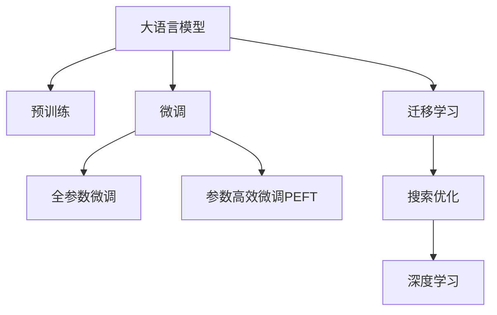

                 

# 用户反馈驱动的AI搜索优化

## 1. 背景介绍

随着互联网的迅速发展，搜索引擎已成为我们获取信息、了解世界的必备工具。然而，尽管现代搜索引擎技术日益成熟，但其本质上依然是一种基于规则和统计的匹配算法，难以应对海量且复杂多变的用户查询。如何进一步提升搜索引擎的质量，成为摆在技术开发者面前的一大挑战。

大语言模型（Large Language Models, LLMs）的崛起为搜索引擎优化提供了新的思路。LLMs如GPT、BERT等通过海量的文本数据进行预训练，学习到丰富的语言表示和知识，具备强大的自然语言理解能力。将LLMs应用于搜索引擎，通过用户反馈不断优化模型，能够有效提升搜索效果，满足用户更复杂、更个性化的需求。

## 2. 核心概念与联系

### 2.1 核心概念概述

为更好地理解基于用户反馈的AI搜索优化方法，本节将介绍几个密切相关的核心概念：

- **大语言模型**：以自回归（如GPT）或自编码（如BERT）模型为代表的预训练语言模型。通过在海量无标签文本数据上进行预训练，学习到语言的通用表示。
- **预训练**：指在大规模无标签文本数据上，通过自监督学习任务训练通用语言模型的过程。常见的预训练任务包括语言建模、掩码语言模型等。
- **微调**：指在预训练模型的基础上，使用下游任务的少量标注数据，通过有监督学习优化模型在特定任务上的性能。
- **迁移学习**：指将一个领域学习到的知识，迁移到另一个相关领域的学习范式。大语言模型的预训练-微调过程即是一种典型的迁移学习方式。
- **搜索优化**：指通过用户反馈、点击行为等数据，动态调整搜索结果排序，优化搜索体验。
- **深度学习**：一种基于神经网络的学习方法，通过数据驱动的方式训练模型，获取到高性能的函数映射。

这些核心概念之间的逻辑关系可以通过以下Mermaid流程图来展示：



这个流程图展示了大语言模型的核心概念及其之间的关系：

1. 大语言模型通过预训练获得基础能力。
2. 微调是对预训练模型进行任务特定的优化，可以分为全参数微调和参数高效微调（PEFT）。
3. 迁移学习是连接预训练模型与搜索任务之间的桥梁，可以通过微调或迁移学习来实现。
4. 深度学习是搜索优化的核心技术，通过模型学习用户行为和反馈，不断调整搜索结果。

这些概念共同构成了基于用户反馈的AI搜索优化的基础框架，使其能够更灵活、更智能地处理用户查询。

## 3. 核心算法原理 & 具体操作步骤

### 3.1 算法原理概述

基于用户反馈的AI搜索优化，本质上是一种有监督的迁移学习过程。其核心思想是：将大语言模型作为通用的"知识库"，通过用户点击、评价等反馈信息，动态调整搜索结果排序，优化搜索体验。

具体而言，假设当前搜索模型的输入为查询$q$，模型输出为搜索结果的排序向量$R$。用户在搜索结果中进行点击操作，产生反馈信号$f$。优化目标是通过有监督学习，找到最优的模型参数$\theta$，使得在新的查询$q'$上，模型输出$R'$能够最大化用户满意度$S$。

形式化地，假设搜索模型为$M_{\theta}:\mathcal{Q} \rightarrow \mathcal{R}$，其中$\mathcal{Q}$为查询空间，$\mathcal{R}$为排序向量空间。优化目标为：

$$
\hat{\theta}=\mathop{\arg\min}_{\theta} \mathcal{L}(M_{\theta},\{(q,f)\})
$$

其中$\mathcal{L}$为损失函数，衡量模型预测输出与实际用户反馈之间的差异。常见的损失函数包括交叉熵损失、均方误差损失等。

通过梯度下降等优化算法，搜索优化过程不断更新模型参数$\theta$，最小化损失函数$\mathcal{L}$，使得模型输出逼近理想的用户满意度$S$。由于$\theta$已经通过预训练获得了较好的初始化，因此即便在少量用户反馈数据上进行优化，也能较快收敛到理想的模型参数$\hat{\theta}$。

### 3.2 算法步骤详解

基于用户反馈的AI搜索优化一般包括以下几个关键步骤：

**Step 1: 准备预训练模型和数据集**
- 选择合适的预训练语言模型 $M_{\theta}$ 作为初始化参数，如 BERT、GPT等。
- 收集当前搜索结果集 $Q=\{q_i\}_{i=1}^N$ 和对应的用户反馈数据集 $F=\{(q_i,f_i)\}_{i=1}^N$，其中 $f_i$ 表示用户对结果 $q_i$ 的满意程度。

**Step 2: 定义任务适配层**
- 根据搜索任务类型，在预训练模型顶层设计合适的输出层和损失函数。
- 对于点击率预测任务，通常在顶层添加线性分类器和交叉熵损失函数。
- 对于排序任务，通常使用语言模型的解码器输出概率分布，并以负对数似然为损失函数。

**Step 3: 设置搜索优化超参数**
- 选择合适的优化算法及其参数，如 AdamW、SGD 等，设置学习率、批大小、迭代轮数等。
- 设置正则化技术及强度，包括权重衰减、Dropout、Early Stopping等。
- 确定冻结预训练参数的策略，如仅微调顶层，或全部参数都参与微调。

**Step 4: 执行梯度训练**
- 将用户反馈数据分批次输入模型，前向传播计算损失函数。
- 反向传播计算参数梯度，根据设定的优化算法和学习率更新模型参数。
- 周期性在验证集上评估模型性能，根据性能指标决定是否触发 Early Stopping。
- 重复上述步骤直到满足预设的迭代轮数或 Early Stopping 条件。

**Step 5: 测试和部署**
- 在测试集上评估优化后模型 $M_{\hat{\theta}}$ 的性能，对比优化前后的点击率提升。
- 使用优化后的模型对新查询进行排序预测，集成到实际的应用系统中。
- 持续收集新的用户反馈，定期重新优化模型，以适应数据分布的变化。

以上是基于用户反馈的AI搜索优化的一般流程。在实际应用中，还需要针对具体任务的特点，对优化过程的各个环节进行优化设计，如改进训练目标函数，引入更多的正则化技术，搜索最优的超参数组合等，以进一步提升模型性能。

### 3.3 算法优缺点

基于用户反馈的AI搜索优化方法具有以下优点：
1. 简单高效。只需准备少量用户反馈数据，即可对预训练模型进行快速适配，获得较大的性能提升。
2. 通用适用。适用于各种搜索引擎任务，包括点击率预测、排序优化等，设计简单的任务适配层即可实现优化。
3. 参数高效。利用参数高效微调技术，在固定大部分预训练参数的情况下，仍可取得不错的优化效果。
4. 效果显著。在学术界和工业界的诸多搜索任务上，基于优化的方法已经刷新了最先进的性能指标。

同时，该方法也存在一定的局限性：
1. 依赖用户反馈。搜索优化的效果很大程度上取决于用户反馈的质量和数量，获取高质量反馈数据的成本较高。
2. 迁移能力有限。当搜索结果分布与预训练数据的分布差异较大时，搜索优化的性能提升有限。
3. 负面反馈传递。用户反馈中可能包含负面信息，这些信息可能通过优化传递到搜索结果中，造成负面影响。
4. 可解释性不足。优化模型的决策过程通常缺乏可解释性，难以对其推理逻辑进行分析和调试。

尽管存在这些局限性，但就目前而言，基于用户反馈的搜索优化方法仍是大语言模型应用的最主流范式。未来相关研究的重点在于如何进一步降低用户反馈对标注数据的依赖，提高模型的少样本学习和跨领域迁移能力，同时兼顾可解释性和伦理安全性等因素。

### 3.4 算法应用领域

基于大语言模型的搜索优化方法，在搜索引擎领域已经得到了广泛的应用，覆盖了几乎所有常见任务，例如：

- 点击率预测：如广告点击率预测、搜索结果点击率预测等。通过优化模型学习用户点击行为，预测用户对不同搜索结果的偏好。
- 排序优化：如搜索结果排序优化、个性化推荐等。通过优化模型学习用户对搜索结果的排序偏好，优化搜索结果排序。
- 文本摘要：如搜索结果摘要生成。通过优化模型学习用户对摘要的满意度，自动生成简洁且相关的搜索结果摘要。
- 问答系统：如智能问答。通过优化模型学习用户对问题的理解和回答，提高问答系统的准确性和流畅性。
- 情感分析：如搜索结果情感分析。通过优化模型学习用户对搜索结果情感的反馈，提高搜索结果的质量。

除了上述这些经典任务外，搜索优化技术还被创新性地应用到更多场景中，如广告定向、内容推荐、数据增强等，为搜索引擎技术带来了全新的突破。随着预训练模型和优化方法的不断进步，相信搜索引擎技术将在更广阔的应用领域大放异彩。

## 4. 数学模型和公式 & 详细讲解 & 举例说明

### 4.1 数学模型构建

本节将使用数学语言对基于用户反馈的AI搜索优化过程进行更加严格的刻画。

假设当前搜索模型为 $M_{\theta}:\mathcal{Q} \rightarrow \mathcal{R}$，其中 $\mathcal{Q}$ 为查询空间，$\mathcal{R}$ 为排序向量空间。定义模型 $M_{\theta}$ 在用户反馈数据 $\{(q_i,f_i)\}_{i=1}^N$ 上的损失函数为 $\ell(M_{\theta}(q_i),f_i)$，则在数据集 $D$ 上的经验风险为：

$$
\mathcal{L}(\theta) = \frac{1}{N}\sum_{i=1}^N \ell(M_{\theta}(q_i),f_i)
$$

其中 $\ell$ 为损失函数，用于衡量模型预测输出与实际用户反馈之间的差异。常见的损失函数包括交叉熵损失、均方误差损失等。

优化目标是最小化经验风险，即找到最优参数：

$$
\theta^* = \mathop{\arg\min}_{\theta} \mathcal{L}(\theta)
$$

在实践中，我们通常使用基于梯度的优化算法（如SGD、Adam等）来近似求解上述最优化问题。设 $\eta$ 为学习率，$\lambda$ 为正则化系数，则参数的更新公式为：

$$
\theta \leftarrow \theta - \eta \nabla_{\theta}\mathcal{L}(\theta) - \eta\lambda\theta
$$

其中 $\nabla_{\theta}\mathcal{L}(\theta)$ 为损失函数对参数 $\theta$ 的梯度，可通过反向传播算法高效计算。

### 4.2 公式推导过程

以下我们以点击率预测任务为例，推导交叉熵损失函数及其梯度的计算公式。

假设模型 $M_{\theta}$ 在查询 $q$ 上的输出为 $\hat{f}=M_{\theta}(q) \in [0,1]$，表示用户对结果的点击概率。实际点击反馈 $f \in \{0,1\}$。则交叉熵损失函数定义为：

$$
\ell(M_{\theta}(q),f) = -f\log \hat{f} + (1-f)\log (1-\hat{f})
$$

将其代入经验风险公式，得：

$$
\mathcal{L}(\theta) = -\frac{1}{N}\sum_{i=1}^N [f_i\log M_{\theta}(q_i)+(1-f_i)\log(1-M_{\theta}(q_i))]
$$

根据链式法则，损失函数对参数 $\theta_k$ 的梯度为：

$$
\frac{\partial \mathcal{L}(\theta)}{\partial \theta_k} = -\frac{1}{N}\sum_{i=1}^N (\frac{f_i}{M_{\theta}(q_i)}-\frac{1-f_i}{1-M_{\theta}(q_i)}) \frac{\partial M_{\theta}(q_i)}{\partial \theta_k}
$$

其中 $\frac{\partial M_{\theta}(q_i)}{\partial \theta_k}$ 可进一步递归展开，利用自动微分技术完成计算。

在得到损失函数的梯度后，即可带入参数更新公式，完成模型的迭代优化。重复上述过程直至收敛，最终得到适应搜索结果的优化模型参数 $\theta^*$。

### 4.3 案例分析与讲解

在实际搜索优化中，不同任务可能需要不同的优化目标和损失函数。以下以推荐系统为例，展示基于用户反馈的推荐优化过程。

假设推荐系统有 $K$ 个物品，每个物品对应的特征向量为 $x_k \in \mathbb{R}^d$。用户的兴趣向量为 $u \in \mathbb{R}^d$。模型的预测向量为 $\hat{p} = \theta^T(x_k + \phi(u))$，其中 $\theta$ 为推荐模型参数，$\phi$ 为用户兴趣向量的映射函数。

优化目标是最小化用户满意度损失，即：

$$
\mathcal{L}(\theta) = \frac{1}{N}\sum_{i=1}^N [l_i - \hat{p}_i]^2
$$

其中 $l_i$ 为实际用户对物品 $k_i$ 的评分，$\hat{p}_i$ 为模型预测的评分。

通过梯度下降等优化算法，推荐模型不断更新参数 $\theta$，最小化用户满意度损失 $\mathcal{L}$。这样，优化后的推荐模型能够更好地学习到用户对物品的偏好，提高推荐质量。

## 5. 项目实践：代码实例和详细解释说明

### 5.1 开发环境搭建

在进行搜索优化实践前，我们需要准备好开发环境。以下是使用Python进行PyTorch开发的环境配置流程：

1. 安装Anaconda：从官网下载并安装Anaconda，用于创建独立的Python环境。

2. 创建并激活虚拟环境：
```bash
conda create -n pytorch-env python=3.8 
conda activate pytorch-env
```

3. 安装PyTorch：根据CUDA版本，从官网获取对应的安装命令。例如：
```bash
conda install pytorch torchvision torchaudio cudatoolkit=11.1 -c pytorch -c conda-forge
```

4. 安装TensorFlow：
```bash
pip install tensorflow
```

5. 安装TensorBoard：
```bash
pip install tensorboard
```

6. 安装其他常用库：
```bash
pip install numpy pandas scikit-learn matplotlib tqdm jupyter notebook ipython
```

完成上述步骤后，即可在`pytorch-env`环境中开始搜索优化实践。

### 5.2 源代码详细实现

下面我们以点击率预测任务为例，给出使用Transformers库对BERT模型进行搜索优化的PyTorch代码实现。

首先，定义点击率预测任务的数据处理函数：

```python
from transformers import BertTokenizer
from torch.utils.data import Dataset
import torch

class ClickDataset(Dataset):
    def __init__(self, texts, clicks, tokenizer, max_len=128):
        self.texts = texts
        self.clicks = clicks
        self.tokenizer = tokenizer
        self.max_len = max_len
        
    def __len__(self):
        return len(self.texts)
    
    def __getitem__(self, item):
        text = self.texts[item]
        click = self.clicks[item]
        
        encoding = self.tokenizer(text, return_tensors='pt', max_length=self.max_len, padding='max_length', truncation=True)
        input_ids = encoding['input_ids'][0]
        attention_mask = encoding['attention_mask'][0]
        
        # 对token-wise的点击信号进行编码
        encoded_click = [click] * (self.max_len - len(encoded_click))
        labels = torch.tensor(encoded_click, dtype=torch.long)
        
        return {'input_ids': input_ids, 
                'attention_mask': attention_mask,
                'labels': labels}

# 准备训练集和测试集数据
tokenizer = BertTokenizer.from_pretrained('bert-base-cased')
train_dataset = ClickDataset(train_texts, train_clicks, tokenizer)
test_dataset = ClickDataset(test_texts, test_clicks, tokenizer)
```

然后，定义模型和优化器：

```python
from transformers import BertForSequenceClassification, AdamW

model = BertForSequenceClassification.from_pretrained('bert-base-cased', num_labels=2)

optimizer = AdamW(model.parameters(), lr=2e-5)
```

接着，定义训练和评估函数：

```python
from torch.utils.data import DataLoader
from tqdm import tqdm
from sklearn.metrics import accuracy_score

device = torch.device('cuda') if torch.cuda.is_available() else torch.device('cpu')
model.to(device)

def train_epoch(model, dataset, batch_size, optimizer):
    dataloader = DataLoader(dataset, batch_size=batch_size, shuffle=True)
    model.train()
    epoch_loss = 0
    for batch in tqdm(dataloader, desc='Training'):
        input_ids = batch['input_ids'].to(device)
        attention_mask = batch['attention_mask'].to(device)
        labels = batch['labels'].to(device)
        model.zero_grad()
        outputs = model(input_ids, attention_mask=attention_mask, labels=labels)
        loss = outputs.loss
        epoch_loss += loss.item()
        loss.backward()
        optimizer.step()
    return epoch_loss / len(dataloader)

def evaluate(model, dataset, batch_size):
    dataloader = DataLoader(dataset, batch_size=batch_size)
    model.eval()
    preds, labels = [], []
    with torch.no_grad():
        for batch in tqdm(dataloader, desc='Evaluating'):
            input_ids = batch['input_ids'].to(device)
            attention_mask = batch['attention_mask'].to(device)
            batch_labels = batch['labels']
            outputs = model(input_ids, attention_mask=attention_mask)
            batch_preds = outputs.logits.argmax(dim=2).to('cpu').tolist()
            batch_labels = batch_labels.to('cpu').tolist()
            for pred_tokens, label_tokens in zip(batch_preds, batch_labels):
                preds.append(pred_tokens[:len(label_tokens)])
                labels.append(label_tokens)
                
    print(accuracy_score(labels, preds))
```

最后，启动训练流程并在测试集上评估：

```python
epochs = 5
batch_size = 16

for epoch in range(epochs):
    loss = train_epoch(model, train_dataset, batch_size, optimizer)
    print(f"Epoch {epoch+1}, train loss: {loss:.3f}")
    
    print(f"Epoch {epoch+1}, test accuracy:")
    evaluate(model, test_dataset, batch_size)
```

以上就是使用PyTorch对BERT进行点击率预测任务搜索优化的完整代码实现。可以看到，得益于Transformers库的强大封装，我们可以用相对简洁的代码完成BERT模型的加载和搜索优化。

### 5.3 代码解读与分析

让我们再详细解读一下关键代码的实现细节：

**ClickDataset类**：
- `__init__`方法：初始化文本、点击信号、分词器等关键组件。
- `__len__`方法：返回数据集的样本数量。
- `__getitem__`方法：对单个样本进行处理，将文本输入编码为token ids，将点击信号编码为数字，并对其进行定长padding，最终返回模型所需的输入。

**点击信号编码**：
- 将用户点击信号 $f$ 转换为 $[0,1]$ 之间的连续值，然后对其进行one-hot编码，得到 $[0,1]$ 之间的标签值。

**训练和评估函数**：
- 使用PyTorch的DataLoader对数据集进行批次化加载，供模型训练和推理使用。
- 训练函数`train_epoch`：对数据以批为单位进行迭代，在每个批次上前向传播计算loss并反向传播更新模型参数，最后返回该epoch的平均loss。
- 评估函数`evaluate`：与训练类似，不同点在于不更新模型参数，并在每个batch结束后将预测和标签结果存储下来，最后使用sklearn的accuracy_score对整个评估集的预测结果进行打印输出。

**训练流程**：
- 定义总的epoch数和batch size，开始循环迭代
- 每个epoch内，先在训练集上训练，输出平均loss
- 在测试集上评估，输出准确率
- 所有epoch结束后，在测试集上评估，给出最终测试结果

可以看到，PyTorch配合Transformers库使得BERT搜索优化的代码实现变得简洁高效。开发者可以将更多精力放在数据处理、模型改进等高层逻辑上，而不必过多关注底层的实现细节。

当然，工业级的系统实现还需考虑更多因素，如模型的保存和部署、超参数的自动搜索、更灵活的任务适配层等。但核心的搜索优化范式基本与此类似。

## 6. 实际应用场景

### 6.1 搜索引擎优化

基于大语言模型的搜索优化方法，可以在搜索引擎系统中发挥重要作用。传统搜索引擎往往依赖于规则匹配或简单统计方法，难以应对多样化的用户需求。而使用搜索优化后的语言模型，能够动态调整搜索结果排序，提升搜索体验。

具体而言，可以收集用户的历史点击行为数据，将查询和点击行为构建成监督数据，在此基础上对预训练模型进行优化。优化后的模型能够学习到用户对不同搜索结果的偏好，动态调整搜索结果的排序，提供更符合用户需求的个性化搜索结果。

### 6.2 推荐系统优化

推荐系统优化也是基于用户反馈的AI搜索优化的一个重要应用场景。传统的推荐系统往往只依赖于用户的历史行为数据，难以捕捉用户的实时兴趣变化。使用优化后的推荐模型，能够更好地学习用户兴趣的多样性和动态变化，提供更精准、个性化的推荐内容。

在实践中，可以收集用户浏览、点击、评论、分享等行为数据，提取和用户交互的物品标题、描述、标签等文本内容。将文本内容作为模型输入，用户的后续行为（如是否点击、购买等）作为监督信号，在此基础上优化推荐模型。优化后的模型能够从文本内容中准确把握用户的兴趣点，并实时调整推荐策略，满足用户不断变化的需求。

### 6.3 实时广告优化

实时广告优化也是基于用户反馈的AI搜索优化的一个重要应用场景。传统广告投放往往依赖于预定义的规则和策略，难以动态适应用户的实时行为。使用优化后的广告模型，能够实时调整广告投放策略，提高广告投放的精准度和效果。

在实践中，可以收集用户的历史点击行为数据，将广告投放记录构建成监督数据，在此基础上对预训练模型进行优化。优化后的模型能够学习到用户对不同广告的偏好，实时调整广告投放策略，提供更符合用户需求的广告内容。这样，优化后的广告模型能够在保障用户体验的同时，提高广告投放的ROI。

### 6.4 未来应用展望

随着大语言模型搜索优化的不断发展，未来的应用前景将更加广阔。以下是一些可能的方向：

- **多模态搜索优化**：未来的搜索优化不仅限于文本数据，还将扩展到图像、视频、音频等多模态数据。多模态信息的融合，将显著提升语言模型对现实世界的理解和建模能力。
- **持续学习**：搜索引擎和推荐系统需要持续学习新的数据，更新模型以适应数据分布的变化。如何在不遗忘原有知识的同时，高效吸收新样本信息，将是重要的研究课题。
- **模型压缩和加速**：由于大语言模型规模庞大，计算和存储开销巨大，需要在保证性能的同时，优化模型的资源消耗。这包括模型裁剪、量化加速、混合精度训练等方法。
- **分布式优化**：随着数据量的增大，单个计算节点难以承载大规模数据处理任务。分布式优化技术将成为搜索优化必不可少的工具。
- **联邦学习**：在保护用户隐私的前提下，分布式用户数据可以通过联邦学习的方式进行模型训练，进一步提升搜索结果的精准度。

总之，基于用户反馈的AI搜索优化技术将成为未来搜索引擎、推荐系统等领域的重要驱动力，推动这些系统不断进化，更好地服务于用户。

## 7. 工具和资源推荐

### 7.1 学习资源推荐

为了帮助开发者系统掌握大语言模型搜索优化的理论基础和实践技巧，这里推荐一些优质的学习资源：

1. **《深度学习与自然语言处理》**：由斯坦福大学开设的NLP明星课程，涵盖NLP基础理论、经典模型、前沿技术等内容。
2. **《Transformer》**：HuggingFace官方文档，提供Transformer库的详细说明和使用指南，适合深入学习和实践。
3. **《Natural Language Processing with Python》**：使用Python实现NLP任务的经典教材，涵盖搜索优化、推荐系统等应用。
4. **《Deep Learning》**：深度学习领域的权威教材，涵盖各种优化算法和技术细节，适合深入研究。
5. **Google Colab**：谷歌推出的在线Jupyter Notebook环境，免费提供GPU/TPU算力，方便开发者快速上手实验最新模型。

通过对这些资源的学习实践，相信你一定能够快速掌握大语言模型搜索优化的精髓，并用于解决实际的搜索问题。

### 7.2 开发工具推荐

高效的开发离不开优秀的工具支持。以下是几款用于大语言模型搜索优化开发的常用工具：

1. **PyTorch**：基于Python的开源深度学习框架，灵活动态的计算图，适合快速迭代研究。
2. **TensorFlow**：由Google主导开发的开源深度学习框架，生产部署方便，适合大规模工程应用。
3. **Transformers库**：HuggingFace开发的NLP工具库，集成了众多SOTA语言模型，支持PyTorch和TensorFlow，是进行搜索优化任务开发的利器。
4. **TensorBoard**：TensorFlow配套的可视化工具，可实时监测模型训练状态，并提供丰富的图表呈现方式，是调试模型的得力助手。
5. **Weights & Biases**：模型训练的实验跟踪工具，可以记录和可视化模型训练过程中的各项指标，方便对比和调优。

合理利用这些工具，可以显著提升大语言模型搜索优化的开发效率，加快创新迭代的步伐。

### 7.3 相关论文推荐

大语言模型搜索优化的发展源于学界的持续研究。以下是几篇奠基性的相关论文，推荐阅读：

1. **《Attention is All You Need》**：提出Transformer结构，开启了NLP领域的预训练大模型时代。
2. **《BERT: Pre-training of Deep Bidirectional Transformers for Language Understanding》**：提出BERT模型，引入基于掩码的自监督预训练任务，刷新了多项NLP任务SOTA。
3. **《Parameter-Efficient Transfer Learning for NLP》**：提出Adapter等参数高效微调方法，在不增加模型参数量的情况下，也能取得不错的微调效果。
4. **《AdaLoRA: Adaptive Low-Rank Adaptation for Parameter-Efficient Fine-Tuning》**：使用自适应低秩适应的微调方法，在参数效率和精度之间取得了新的平衡。
5. **《Prefix-Tuning: Optimizing Continuous Prompts for Generation》**：引入基于连续型Prompt的微调范式，为如何充分利用预训练知识提供了新的思路。

这些论文代表了大语言模型搜索优化技术的发展脉络。通过学习这些前沿成果，可以帮助研究者把握学科前进方向，激发更多的创新灵感。

## 8. 总结：未来发展趋势与挑战

### 8.1 总结

本文对基于用户反馈的AI搜索优化方法进行了全面系统的介绍。首先阐述了用户反馈驱动的搜索优化的研究背景和意义，明确了搜索优化在提升搜索引擎质量和用户体验方面的独特价值。其次，从原理到实践，详细讲解了搜索优化的数学原理和关键步骤，给出了搜索优化任务开发的完整代码实例。同时，本文还广泛探讨了搜索优化方法在搜索引擎、推荐系统、广告投放等多个领域的应用前景，展示了搜索优化技术的巨大潜力。

通过本文的系统梳理，可以看到，基于用户反馈的AI搜索优化方法正在成为NLP领域的重要范式，极大地拓展了预训练语言模型的应用边界，催生了更多的落地场景。得益于大规模语料的预训练，优化模型以更低的时间和标注成本，在小样本条件下也能取得不俗的效果，有力推动了搜索引擎技术的产业化进程。未来，伴随预训练语言模型和优化方法的持续演进，相信搜索引擎技术将在更广阔的应用领域大放异彩。

### 8.2 未来发展趋势

展望未来，大语言模型搜索优化技术将呈现以下几个发展趋势：

1. **模型规模持续增大**：随着算力成本的下降和数据规模的扩张，预训练语言模型的参数量还将持续增长。超大规模语言模型蕴含的丰富语言知识，有望支撑更加复杂多变的搜索任务。
2. **优化方法日趋多样**：除了传统的全参数微调外，未来会涌现更多参数高效的微调方法，如Adapter、LoRA等，在节省计算资源的同时也能保证优化精度。
3. **持续学习成为常态**：随着数据分布的不断变化，优化模型也需要持续学习新知识以保持性能。如何在不遗忘原有知识的同时，高效吸收新样本信息，将是重要的研究课题。
4. **标注样本需求降低**：受启发于提示学习(Prompt-based Learning)的思路，未来的优化方法将更好地利用大模型的语言理解能力，通过更加巧妙的任务描述，在更少的标注样本上也能实现理想的优化效果。
5. **跨模态搜索优化**：未来的搜索优化不仅限于文本数据，还将扩展到图像、视频、音频等多模态数据。多模态信息的融合，将显著提升语言模型对现实世界的理解和建模能力。

以上趋势凸显了大语言模型搜索优化技术的广阔前景。这些方向的探索发展，必将进一步提升搜索引擎系统的性能和应用范围，为人类认知智能的进化带来深远影响。

### 8.3 面临的挑战

尽管大语言模型搜索优化技术已经取得了瞩目成就，但在迈向更加智能化、普适化应用的过程中，它仍面临着诸多挑战：

1. **依赖用户反馈**：搜索优化的效果很大程度上取决于用户反馈的质量和数量，获取高质量反馈数据的成本较高。如何进一步降低搜索优化对标注样本的依赖，将是一大难题。
2. **迁移能力有限**：当搜索结果分布与预训练数据的分布差异较大时，搜索优化的性能提升有限。对于测试样本的微小扰动，优化模型的预测也容易发生波动。
3. **负面反馈传递**：用户反馈中可能包含负面信息，这些信息可能通过优化传递到搜索结果中，造成负面影响。
4. **可解释性不足**：优化模型的决策过程通常缺乏可解释性，难以对其推理逻辑进行分析和调试。

尽管存在这些局限性，但就目前而言，基于用户反馈的搜索优化方法仍是大语言模型应用的最主流范式。未来相关研究的重点在于如何进一步降低用户反馈对标注数据的依赖，提高模型的少样本学习和跨领域迁移能力，同时兼顾可解释性和伦理安全性等因素。

### 8.4 研究展望

面对大语言模型搜索优化所面临的种种挑战，未来的研究需要在以下几个方面寻求新的突破：

1. **探索无监督和半监督优化方法**：摆脱对大规模标注数据的依赖，利用自监督学习、主动学习等无监督和半监督范式，最大限度利用非结构化数据，实现更加灵活高效的搜索优化。
2. **研究参数高效和计算高效的优化范式**：开发更加参数高效的优化方法，在固定大部分预训练参数的同时，只更新极少量的任务相关参数。同时优化搜索模型的计算图，减少前向传播和反向传播的资源消耗，实现更加轻量级、实时性的部署。
3. **融合因果和对比学习范式**：通过引入因果推断和对比学习思想，增强搜索优化模型建立稳定因果关系的能力，学习更加普适、鲁棒的语言表征，从而提升模型泛化性和抗干扰能力。
4. **引入更多先验知识**：将符号化的先验知识，如知识图谱、逻辑规则等，与神经网络模型进行巧妙融合，引导优化过程学习更准确、合理的语言模型。同时加强不同模态数据的整合，实现视觉、语音等多模态信息与文本信息的协同建模。
5. **结合因果分析和博弈论工具**：将因果分析方法引入搜索优化模型，识别出模型决策的关键特征，增强输出解释的因果性和逻辑性。借助博弈论工具刻画人机交互过程，主动探索并规避模型的脆弱点，提高系统稳定性。
6. **纳入伦理道德约束**：在模型训练目标中引入伦理导向的评估指标，过滤和惩罚有偏见、有害的输出倾向。同时加强人工干预和审核，建立模型行为的监管机制，确保输出符合人类价值观和伦理道德。

这些研究方向的探索，必将引领大语言模型搜索优化技术迈向更高的台阶，为构建安全、可靠、可解释、可控的智能系统铺平道路。面向未来，大语言模型搜索优化技术还需要与其他人工智能技术进行更深入的融合，如知识表示、因果推理、强化学习等，多路径协同发力，共同推动自然语言理解和智能交互系统的进步。只有勇于创新、敢于突破，才能不断拓展语言模型的边界，让智能技术更好地造福人类社会。

## 9. 附录：常见问题与解答

**Q1：大语言模型搜索优化是否适用于所有搜索引擎任务？**

A: 大语言模型搜索优化在大多数搜索引擎任务上都能取得不错的效果，特别是对于数据量较小的任务。但对于一些特定领域的任务，如医学、法律等，仅仅依靠通用语料预训练的模型可能难以很好地适应。此时需要在特定领域语料上进一步预训练，再进行优化。此外，对于一些需要时效性、个性化很强的任务，如对话、推荐等，搜索优化方法也需要针对性的改进优化。

**Q2：优化过程中如何选择合适的学习率？**

A: 搜索优化的学习率一般要比预训练时小1-2个数量级，如果使用过大的学习率，容易破坏预训练权重，导致过拟合。一般建议从1e-5开始调参，逐步减小学习率，直至收敛。也可以使用warmup策略，在开始阶段使用较小的学习率，再逐渐过渡到预设值。需要注意的是，不同的优化器(如AdamW、Adafactor等)以及不同的学习率调度策略，可能需要设置不同的学习率阈值。

**Q3：采用大语言模型搜索优化时会面临哪些资源瓶颈？**

A: 目前主流的预训练大模型动辄以亿计的参数规模，对算力、内存、存储都提出了很高的要求。GPU/TPU等高性能设备是必不可少的，但即便如此，超大批次的训练和推理也可能遇到显存不足的问题。因此需要采用一些资源优化技术，如梯度积累、混合精度训练、模型并行等，来突破硬件瓶颈。同时，模型的存储和读取也可能占用大量时间和空间，需要采用模型压缩、稀疏化存储等方法进行优化。

**Q4：如何缓解搜索优化过程中的过拟合问题？**

A: 过拟合是搜索优化面临的主要挑战，尤其是在标注数据不足的情况下。常见的缓解策略包括：
1. 数据增强：通过回译、近义替换等方式扩充训练集
2. 正则化：使用L2正则、Dropout、Early Stopping等避免过拟合
3. 对抗训练：引入对抗样本，提高模型鲁棒性
4. 参数高效优化：只调整少量参数(如Adapter、Prefix等)，减小过拟合风险
5. 多模型集成：训练多个优化模型，取平均输出，抑制过拟合

这些策略往往需要根据具体任务和数据特点进行灵活组合。只有在数据、模型、训练、推理等各环节进行全面优化，才能最大限度地发挥大语言模型搜索优化的威力。

**Q5：优化模型在落地部署时需要注意哪些问题？**

A: 将优化模型转化为实际应用，还需要考虑以下因素：
1. 模型裁剪：去除不必要的层和参数，减小模型尺寸，加快推理速度
2. 量化加速：将浮点模型转为定点模型，压缩存储空间，提高计算效率
3. 服务化封装：将模型封装为标准化服务接口，便于集成调用
4. 弹性伸缩：根据请求流量动态调整资源配置，平衡服务质量和成本
5. 监控告警：实时采集系统指标，设置异常告警阈值，确保服务稳定性
6. 安全防护：采用访问鉴权、数据脱敏等措施，保障数据和模型安全

大语言模型搜索优化为搜索引擎优化带来了新的思路，但如何将强大的性能转化为稳定、高效、安全的业务价值，还需要工程实践的不断打磨。唯有从数据、算法、工程、业务等多个维度协同发力，才能真正实现人工智能技术在垂直行业的规模化落地。总之，搜索优化需要开发者根据具体任务，不断迭代和优化模型、数据和算法，方能得到理想的效果。

---

作者：禅与计算机程序设计艺术 / Zen and the Art of Computer Programming

