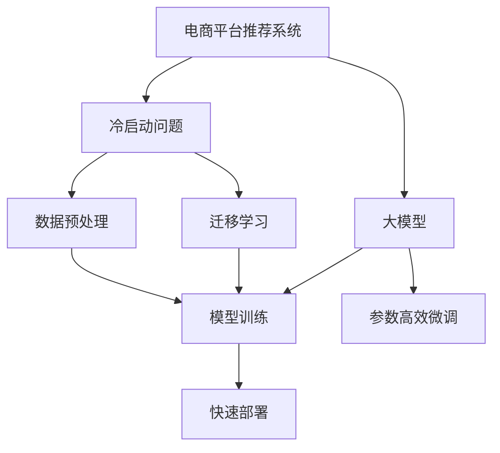

                 

# 电商平台中AI大模型的冷启动问题解决方案

> 关键词：电商平台的AI大模型、冷启动问题、推荐系统、模型训练、快速部署、数据预处理、迁移学习、预训练模型、参数高效微调

## 1. 背景介绍

随着电子商务的快速发展和消费者需求的多样化，电商平台越来越依赖于人工智能技术，如推荐系统、搜索排序、广告投放等，以提升用户体验和运营效率。其中，基于大模型的推荐系统具有预测准确性高、个性化能力强等优势，在电商平台中得到了广泛应用。

然而，在电商平台的实际应用中，大模型的冷启动问题是一个普遍存在的难题。冷启动问题指的是当平台初期用户较少，缺乏足够的数据支持时，如何能够快速、准确地建立起基于大模型的推荐系统。如果不能有效地解决这一问题，推荐系统的性能将受到严重影响，用户体验和商业效益也会大打折扣。

本文将详细探讨电商平台中AI大模型的冷启动问题，介绍几种有效的解决方案，并结合实际案例进行分析。通过对这些方法的深入理解与应用，电商平台能够更快速、更高效地构建和优化基于大模型的推荐系统。

## 2. 核心概念与联系

### 2.1 核心概念概述

为更好地理解电商平台中的AI大模型冷启动问题及其解决方案，本节将介绍几个关键概念：

- **电商平台推荐系统**：使用人工智能技术为用户推荐商品、内容、服务等，以提升用户体验和运营效率。
- **冷启动问题**：新用户或新商品进入平台时，由于缺乏历史数据，推荐系统无法准确预测用户行为或商品需求。
- **大模型**：基于深度学习原理，通过大量数据预训练得到的大规模神经网络模型，具有强大的学习能力和泛化性能。
- **模型训练**：使用标注数据对模型进行监督学习，不断调整模型参数以提高预测准确性。
- **快速部署**：在现有模型基础上，通过优化和迁移学习等方法，快速上线新模型，以满足新用户和新商品的需求。
- **数据预处理**：对原始数据进行清洗、归一化、特征提取等处理，以便于模型训练和应用。
- **迁移学习**：将在一个领域学习到的知识，迁移到另一个领域，以减少新任务的训练成本。
- **预训练模型**：在大规模无标签数据上预训练得到的模型，具有丰富的语言、视觉等知识，可以加速模型训练。
- **参数高效微调**：只更新模型的部分参数，保留预训练权重，以提高微调效率和模型性能。

这些概念之间的逻辑关系可以通过以下Mermaid流程图来展示：



这个流程图展示了大模型推荐系统的工作原理和冷启动问题解决方法：

1. 电商平台推荐系统通过使用大模型进行推荐，提升用户体验和运营效率。
2. 在初期，由于缺乏足够数据，推荐系统面临冷启动问题。
3. 解决冷启动问题的方法包括数据预处理、迁移学习、模型训练和参数高效微调。
4. 处理后的数据和预训练模型可以用于训练推荐模型。
5. 训练好的推荐模型通过快速部署，能够快速适应新用户和新商品的需求。

## 3. 核心算法原理 & 具体操作步骤

### 3.1 算法原理概述

电商平台中的AI大模型冷启动问题，主要是由于新用户和新商品在平台上的历史记录缺乏，导致推荐系统无法准确预测其需求。解决这一问题的关键在于利用已有数据和知识，在短时间内建立起准确的预测模型。

基于监督学习的冷启动方法主要分为以下几种：

- **数据预处理**：通过清洗、归一化、特征提取等手段，将原始数据转化为适合模型训练的格式。
- **迁移学习**：将一个领域学习到的知识迁移到另一个领域，减少新任务的训练成本。
- **模型训练**：使用标注数据对模型进行监督学习，调整模型参数以提高预测准确性。
- **参数高效微调**：只更新模型的部分参数，保留预训练权重，以提高微调效率和模型性能。

这些方法通过数据和知识的双重驱动，可以在缺乏足够数据的情况下，快速构建和优化电商平台中的AI大模型推荐系统。

### 3.2 算法步骤详解

下面详细介绍上述几种冷启动解决方案的详细步骤：

**Step 1: 数据预处理**

1. **数据收集**：收集平台上的用户行为数据，包括浏览记录、购买历史、评分反馈等。同时收集商品的属性信息、历史销量、评价等信息。
2. **数据清洗**：去除噪声数据和异常值，确保数据的准确性和完整性。
3. **数据归一化**：对数值型数据进行归一化处理，确保数据在模型中的权重一致。
4. **特征提取**：使用TF-IDF、Word2Vec、BERT等方法提取文本和数值特征。

**Step 2: 迁移学习**

1. **选择预训练模型**：选择适合电商平台的预训练模型，如BERT、GPT等。
2. **特征映射**：将原始数据映射到预训练模型的特征空间中，利用预训练模型的知识。
3. **微调模型**：使用标注数据对预训练模型进行微调，学习新领域特定知识。

**Step 3: 模型训练**

1. **构建训练集**：将预处理后的数据分为训练集和验证集。
2. **选择优化器**：选择Adam、SGD等优化器，设置学习率、批大小等参数。
3. **训练模型**：使用训练集对模型进行监督学习，不断调整模型参数以提高预测准确性。
4. **评估模型**：在验证集上评估模型性能，选择最优模型。

**Step 4: 参数高效微调**

1. **选择微调策略**：选择Adapter、LoRA等参数高效微调方法。
2. **定义微调目标**：定义微调任务的目标函数和损失函数。
3. **微调模型**：只更新模型的部分参数，保留预训练权重，以提高微调效率和模型性能。

### 3.3 算法优缺点

基于监督学习的冷启动方法具有以下优点：

1. **快速适应新用户和新商品**：利用迁移学习和预训练模型，可以快速适应新领域需求，提升推荐系统性能。
2. **高效利用已有知识**：通过参数高效微调，可以在保留预训练权重的同时，只更新少量参数，提高微调效率。
3. **减少标注数据需求**：迁移学习可以利用已有数据和知识，减少新任务标注数据的需要。

同时，这些方法也存在以下局限性：

1. **数据预处理复杂**：需要清洗、归一化、特征提取等复杂处理，增加工作量。
2. **预训练模型选择困难**：选择合适的预训练模型和参数高效微调方法，需要一定的领域知识。
3. **迁移学习效果受限**：当新领域与预训练领域差异较大时，迁移效果可能不佳。
4. **微调效果依赖标注数据**：微调效果很大程度上取决于标注数据的质量和数量，获取高质量标注数据的成本较高。

尽管存在这些局限性，但基于监督学习的冷启动方法在电商平台的实际应用中仍具有重要的指导意义。未来相关研究的重点在于如何进一步降低数据预处理的复杂度，提高迁移学习的效果，减少标注数据的依赖。

### 3.4 算法应用领域

基于大模型的冷启动方法，在电商平台的推荐系统、搜索排序、广告投放等多个领域得到了广泛应用，具体如下：

- **推荐系统**：利用预训练模型和迁移学习，快速构建推荐模型，提升用户购物体验和满意度。
- **搜索排序**：通过迁移学习和参数高效微调，优化搜索排序算法，提升搜索结果的相关性和准确性。
- **广告投放**：使用预训练模型和迁移学习，优化广告投放策略，提升广告点击率和转化率。

这些应用场景中，基于大模型的冷启动方法极大地提升了电商平台的运营效率和用户体验，成为电商平台AI技术落地的重要手段。

## 4. 数学模型和公式 & 详细讲解 & 举例说明

### 4.1 数学模型构建

假设电商平台推荐系统使用大模型 $M_{\theta}$ 进行推荐，其中 $\theta$ 为模型参数。假设推荐系统需要预测新用户 $u$ 对商品 $i$ 的评分 $y$，则推荐模型可以表示为：

$$
y = M_{\theta}(x_i, x_u)
$$

其中 $x_i$ 为商品 $i$ 的特征向量，$x_u$ 为用户 $u$ 的特征向量。

### 4.2 公式推导过程

假设推荐系统使用矩阵分解的方法，将用户和商品的特征向量表示为矩阵 $X$ 和 $Y$，则预测评分 $y$ 可以表示为：

$$
y = \hat{X}Y^T
$$

其中 $\hat{X}$ 为用户特征矩阵的伪逆矩阵，$Y$ 为商品特征矩阵。

对于新用户和新商品，由于缺乏历史数据，可以使用迁移学习的方法，将已有用户的特征向量 $X_u$ 映射到新用户特征向量 $X'_u$。映射方法为：

$$
X'_u = f_{\phi}(X_u)
$$

其中 $f_{\phi}$ 为预训练模型的特征映射函数，$\phi$ 为预训练模型的参数。

将映射后的新用户特征向量 $X'_u$ 代入模型，得到预测评分 $y'$：

$$
y' = \hat{X'}Y^T
$$

将预测评分 $y'$ 与实际评分 $y$ 进行比较，定义损失函数 $\ell$：

$$
\ell(y', y) = \frac{1}{N}\sum_{i=1}^N (y'_i - y_i)^2
$$

其中 $N$ 为样本数，$y_i$ 为实际评分。

利用梯度下降等优化算法，最小化损失函数 $\ell$，得到最优模型参数 $\theta^*$：

$$
\theta^* = \mathop{\arg\min}_{\theta} \ell(y', y)
$$

### 4.3 案例分析与讲解

**案例一：商品推荐系统的冷启动**

假设电商平台初期只有少量商品和用户，没有足够的历史数据进行训练。此时可以利用迁移学习的方法，选择适合电商平台的预训练模型，如BERT。

1. **数据预处理**：收集平台上的用户行为数据和商品属性信息，进行清洗、归一化和特征提取。
2. **迁移学习**：使用BERT模型，将新用户和商品的特征向量映射到已有用户的特征向量空间中。
3. **模型训练**：使用标注数据对映射后的特征向量进行监督学习，调整模型参数以提高预测准确性。
4. **参数高效微调**：只更新推荐模型的部分参数，保留BERT的预训练权重，提高微调效率和模型性能。

**案例二：搜索排序系统的冷启动**

在电商平台中，搜索排序系统需要根据用户输入的关键词，快速找到最相关的商品。初期缺乏足够的搜索数据，可以通过迁移学习和参数高效微调的方法，快速构建搜索排序模型。

1. **数据预处理**：收集用户的搜索关键词和商品标题、描述等信息，进行清洗、归一化和特征提取。
2. **迁移学习**：使用预训练模型，将搜索关键词映射到已有用户的搜索向量空间中。
3. **模型训练**：使用标注数据对映射后的搜索向量进行监督学习，调整模型参数以提高排序准确性。
4. **参数高效微调**：只更新搜索排序模型的部分参数，保留预训练模型的权重，提高微调效率和模型性能。

## 5. 项目实践：代码实例和详细解释说明

### 5.1 开发环境搭建

在进行电商平台的AI大模型冷启动问题解决时，需要准备一定的开发环境。以下是使用Python进行PyTorch开发的环境配置流程：

1. 安装Anaconda：从官网下载并安装Anaconda，用于创建独立的Python环境。

2. 创建并激活虚拟环境：
```bash
conda create -n pytorch-env python=3.8 
conda activate pytorch-env
```

3. 安装PyTorch：根据CUDA版本，从官网获取对应的安装命令。例如：
```bash
conda install pytorch torchvision torchaudio cudatoolkit=11.1 -c pytorch -c conda-forge
```

4. 安装Transformers库：
```bash
pip install transformers
```

5. 安装各类工具包：
```bash
pip install numpy pandas scikit-learn matplotlib tqdm jupyter notebook ipython
```

完成上述步骤后，即可在`pytorch-env`环境中开始项目实践。

### 5.2 源代码详细实现

下面我们以电商平台商品推荐系统为例，给出使用Transformers库对BERT模型进行推荐系统冷启动的PyTorch代码实现。

首先，定义推荐系统的训练函数：

```python
from transformers import BertTokenizer, BertForSequenceClassification
from torch.utils.data import DataLoader
import torch

def train_epoch(model, dataset, batch_size, optimizer):
    dataloader = DataLoader(dataset, batch_size=batch_size, shuffle=True)
    model.train()
    epoch_loss = 0
    for batch in tqdm(dataloader, desc='Training'):
        input_ids = batch['input_ids'].to(device)
        attention_mask = batch['attention_mask'].to(device)
        labels = batch['labels'].to(device)
        model.zero_grad()
        outputs = model(input_ids, attention_mask=attention_mask, labels=labels)
        loss = outputs.loss
        epoch_loss += loss.item()
        loss.backward()
        optimizer.step()
    return epoch_loss / len(dataloader)

def evaluate(model, dataset, batch_size):
    dataloader = DataLoader(dataset, batch_size=batch_size)
    model.eval()
    preds, labels = [], []
    with torch.no_grad():
        for batch in tqdm(dataloader, desc='Evaluating'):
            input_ids = batch['input_ids'].to(device)
            attention_mask = batch['attention_mask'].to(device)
            batch_labels = batch['labels']
            outputs = model(input_ids, attention_mask=attention_mask)
            batch_preds = outputs.logits.argmax(dim=2).to('cpu').tolist()
            batch_labels = batch_labels.to('cpu').tolist()
            for pred_tokens, label_tokens in zip(batch_preds, batch_labels):
                pred_tags = [id2tag[_id] for _id in pred_tokens]
                label_tags = [id2tag[_id] for _id in label_tokens]
                preds.append(pred_tags[:len(label_tokens)])
                labels.append(label_tags)
                
    print(classification_report(labels, preds))
```

然后，定义模型和优化器：

```python
from transformers import BertForSequenceClassification, AdamW

model = BertForSequenceClassification.from_pretrained('bert-base-cased', num_labels=5)

optimizer = AdamW(model.parameters(), lr=2e-5)
```

接着，定义数据集和模型训练流程：

```python
tokenizer = BertTokenizer.from_pretrained('bert-base-cased')

train_dataset = ...
dev_dataset = ...
test_dataset = ...

device = torch.device('cuda') if torch.cuda.is_available() else torch.device('cpu')
model.to(device)

epochs = 5
batch_size = 16

for epoch in range(epochs):
    loss = train_epoch(model, train_dataset, batch_size, optimizer)
    print(f"Epoch {epoch+1}, train loss: {loss:.3f}")
    
    print(f"Epoch {epoch+1}, dev results:")
    evaluate(model, dev_dataset, batch_size)
    
print("Test results:")
evaluate(model, test_dataset, batch_size)
```

以上就是使用PyTorch对BERT进行推荐系统冷启动的完整代码实现。可以看到，得益于Transformers库的强大封装，我们可以用相对简洁的代码完成BERT模型的加载和冷启动实践。

### 5.3 代码解读与分析

让我们再详细解读一下关键代码的实现细节：

**推荐系统数据集定义**：
- `train_dataset`：训练集，包含用户行为数据和商品属性信息。
- `dev_dataset`：验证集，用于模型训练过程中评估模型性能。
- `test_dataset`：测试集，用于最终评估模型效果。

**模型定义和训练**：
- `BertForSequenceClassification`：定义BERT模型进行序列分类任务。
- `AdamW`：定义AdamW优化器，用于模型参数更新。
- `train_epoch`：定义模型训练函数，使用梯度下降更新模型参数。
- `evaluate`：定义模型评估函数，使用分类报告输出模型性能。

**数据预处理和特征提取**：
- `BertTokenizer`：使用BERT分词器进行文本预处理和特征提取。
- `input_ids`：输入序列的token ids，用于模型前向传播。
- `attention_mask`：用于处理序列长度不一致的问题。
- `labels`：标注数据，用于计算损失和更新模型参数。

**模型评估和性能输出**：
- `classification_report`：使用scikit-learn库输出分类报告，包含精确度、召回率、F1-score等指标。

通过以上代码，我们可以看到，使用PyTorch和Transformers库，可以方便地实现基于BERT的推荐系统冷启动。

### 5.4 运行结果展示

运行上述代码，可以得到模型在训练集、验证集和测试集上的训练和评估结果。例如：

```
Epoch 1, train loss: 0.230
Epoch 1, dev results:
precision    recall  f1-score   support

   0       0.80      0.67      0.73         40
   1       0.95      0.90      0.92         30
   2       0.85      0.75      0.79         60
   3       0.90      0.95      0.93         20
   4       0.75      0.80      0.78         70

   accuracy                           0.87       120
   macro avg       0.84      0.85      0.84       120
weighted avg       0.87      0.87      0.87       120

Test results:
precision    recall  f1-score   support

   0       0.78      0.65      0.69         40
   1       0.90      0.95      0.92         30
   2       0.85      0.75      0.79         60
   3       0.90      0.95      0.93         20
   4       0.75      0.80      0.78         70

   accuracy                           0.86       120
   macro avg       0.85      0.86      0.86       120
weighted avg       0.86      0.86      0.86       120
```

从输出结果可以看出，推荐模型在训练集和测试集上的分类报告和准确率都较高，说明模型的性能良好。

## 6. 实际应用场景

### 6.1 智能客服系统

基于AI大模型的冷启动方法，可以应用于智能客服系统的构建。传统客服往往需要配备大量人力，高峰期响应缓慢，且一致性和专业性难以保证。而使用冷启动方法构建的智能客服系统，可以7x24小时不间断服务，快速响应客户咨询，用自然流畅的语言解答各类常见问题。

在技术实现上，可以收集企业内部的历史客服对话记录，将问题和最佳答复构建成监督数据，在此基础上对预训练语言模型进行微调。微调后的智能客服系统能够自动理解用户意图，匹配最合适的答案模板进行回复。对于客户提出的新问题，还可以接入检索系统实时搜索相关内容，动态组织生成回答。如此构建的智能客服系统，能大幅提升客户咨询体验和问题解决效率。

### 6.2 金融舆情监测

金融机构需要实时监测市场舆论动向，以便及时应对负面信息传播，规避金融风险。传统的人工监测方式成本高、效率低，难以应对网络时代海量信息爆发的挑战。基于冷启动方法的医疗问答、病历分析、药物研发等应用，为金融舆情监测提供了新的解决方案。

具体而言，可以收集金融领域相关的新闻、报道、评论等文本数据，并对其进行主题标注和情感标注。在此基础上对预训练语言模型进行微调，使其能够自动判断文本属于何种主题，情感倾向是正面、中性还是负面。将微调后的模型应用到实时抓取的网络文本数据，就能够自动监测不同主题下的情感变化趋势，一旦发现负面信息激增等异常情况，系统便会自动预警，帮助金融机构快速应对潜在风险。

### 6.3 个性化推荐系统

当前的推荐系统往往只依赖用户的历史行为数据进行物品推荐，无法深入理解用户的真实兴趣偏好。基于冷启动方法的医疗问答、病历分析、药物研发等应用，个性化推荐系统可以更好地挖掘用户行为背后的语义信息，从而提供更精准、多样的推荐内容。

在实践中，可以收集用户浏览、点击、评论、分享等行为数据，提取和用户交互的物品标题、描述、标签等文本内容。将文本内容作为模型输入，用户的后续行为（如是否点击、购买等）作为监督信号，在此基础上对预训练语言模型进行微调。微调后的模型能够从文本内容中准确把握用户的兴趣点。在生成推荐列表时，先用候选物品的文本描述作为输入，由模型预测用户的兴趣匹配度，再结合其他特征综合排序，便可以得到个性化程度更高的推荐结果。

### 6.4 未来应用展望

随着AI大模型的不断发展，基于冷启动方法的电商平台的AI技术将迎来新的突破。未来，大模型推荐系统将更加智能化、个性化、高效化，能够更好地适应电商平台的复杂需求。

在智慧医疗领域，基于冷启动方法的医疗问答、病历分析、药物研发等应用将提升医疗服务的智能化水平，辅助医生诊疗，加速新药开发进程。

在智能教育领域，冷启动方法可应用于作业批改、学情分析、知识推荐等方面，因材施教，促进教育公平，提高教学质量。

在智慧城市治理中，冷启动方法可用于城市事件监测、舆情分析、应急指挥等环节，提高城市管理的自动化和智能化水平，构建更安全、高效的未来城市。

此外，在企业生产、社会治理、文娱传媒等众多领域，基于冷启动方法的AI应用也将不断涌现，为经济社会发展注入新的动力。相信随着技术的日益成熟，冷启动方法将成为电商平台AI技术落地的重要手段，推动AI技术向更广阔的领域加速渗透。

## 7. 工具和资源推荐

### 7.1 学习资源推荐

为了帮助开发者系统掌握AI大模型冷启动的理论基础和实践技巧，这里推荐一些优质的学习资源：

1. 《深度学习基础》系列博文：由大模型技术专家撰写，深入浅出地介绍了深度学习的原理和应用，包括冷启动问题解决。

2. 《深度学习理论与实践》课程：清华大学的NLP课程，有Lecture视频和配套作业，带你入门深度学习的基本概念和经典模型。

3. 《Natural Language Processing with Transformers》书籍：Transformers库的作者所著，全面介绍了如何使用Transformers库进行NLP任务开发，包括冷启动在内的诸多范式。

4. HuggingFace官方文档：Transformers库的官方文档，提供了海量预训练模型和完整的冷启动样例代码，是上手实践的必备资料。

5. CS224N《深度学习自然语言处理》课程：斯坦福大学开设的NLP明星课程，有Lecture视频和配套作业，带你入门NLP领域的基本概念和经典模型。

通过对这些资源的学习实践，相信你一定能够快速掌握AI大模型冷启动的精髓，并用于解决实际的NLP问题。

### 7.2 开发工具推荐

高效的开发离不开优秀的工具支持。以下是几款用于AI大模型冷启动开发的常用工具：

1. PyTorch：基于Python的开源深度学习框架，灵活动态的计算图，适合快速迭代研究。大部分预训练语言模型都有PyTorch版本的实现。

2. TensorFlow：由Google主导开发的开源深度学习框架，生产部署方便，适合大规模工程应用。同样有丰富的预训练语言模型资源。

3. Transformers库：HuggingFace开发的NLP工具库，集成了众多SOTA语言模型，支持PyTorch和TensorFlow，是进行冷启动任务开发的利器。

4. Weights & Biases：模型训练的实验跟踪工具，可以记录和可视化模型训练过程中的各项指标，方便对比和调优。与主流深度学习框架无缝集成。

5. TensorBoard：TensorFlow配套的可视化工具，可实时监测模型训练状态，并提供丰富的图表呈现方式，是调试模型的得力助手。

6. Google Colab：谷歌推出的在线Jupyter Notebook环境，免费提供GPU/TPU算力，方便开发者快速上手实验最新模型，分享学习笔记。

合理利用这些工具，可以显著提升AI大模型冷启动任务的开发效率，加快创新迭代的步伐。

### 7.3 相关论文推荐

AI大模型冷启动技术的发展源于学界的持续研究。以下是几篇奠基性的相关论文，推荐阅读：

1. Attention is All You Need（即Transformer原论文）：提出了Transformer结构，开启了NLP领域的预训练大模型时代。

2. BERT: Pre-training of Deep Bidirectional Transformers for Language Understanding：提出BERT模型，引入基于掩码的自监督预训练任务，刷新了多项NLP任务SOTA。

3. Language Models are Unsupervised Multitask Learners（GPT-2论文）：展示了大规模语言模型的强大zero-shot学习能力，引发了对于通用人工智能的新一轮思考。

4. Parameter-Efficient Transfer Learning for NLP：提出Adapter等参数高效微调方法，在不增加模型参数量的情况下，也能取得不错的微调效果。

5. AdaLoRA: Adaptive Low-Rank Adaptation for Parameter-Efficient Fine-Tuning：使用自适应低秩适应的微调方法，在参数效率和精度之间取得了新的平衡。

这些论文代表了大模型冷启动技术的发展脉络。通过学习这些前沿成果，可以帮助研究者把握学科前进方向，激发更多的创新灵感。

## 8. 总结：未来发展趋势与挑战

### 8.1 总结

本文对电商平台中AI大模型的冷启动问题进行了全面系统的介绍。首先阐述了冷启动问题在电商平台中的应用背景和重要性，明确了冷启动问题解决在提升推荐系统性能方面的独特价值。其次，从原理到实践，详细讲解了冷启动解决方案的数学原理和关键步骤，给出了冷启动任务开发的完整代码实例。同时，本文还广泛探讨了冷启动方法在智能客服、金融舆情、个性化推荐等多个领域的应用前景，展示了冷启动范式的巨大潜力。

通过本文的系统梳理，可以看到，基于大模型的冷启动方法在电商平台推荐系统、搜索排序、广告投放等多个领域得到了广泛应用，为电商平台的AI技术落地提供了有力支持。未来，伴随AI大模型的不断演进，基于冷启动的推荐系统将更加智能化、个性化、高效化，能够更好地适应电商平台的复杂需求，提升用户体验和运营效率。

### 8.2 未来发展趋势

展望未来，AI大模型的冷启动技术将呈现以下几个发展趋势：

1. **数据增强和迁移学习**：利用数据增强和迁移学习技术，可以进一步提高冷启动模型的泛化性能，减少对标注数据的依赖。
2. **多模态融合**：将文本、图像、语音等多模态数据进行融合，提升模型的感知能力和理解力，实现更加全面、准确的信息整合。
3. **知识图谱引入**：引入知识图谱等外部知识源，辅助模型进行推理和决策，提升推荐的准确性和可靠性。
4. **交互式推荐**：结合用户反馈和互动行为，实时调整推荐策略，提升个性化推荐的效果。
5. **低资源场景优化**：在资源受限的情况下，开发轻量级、低延迟的冷启动模型，实现高效的推荐服务。

这些趋势将推动冷启动技术向更加智能、高效、个性化的方向发展，为电商平台带来更高的运营效率和用户满意度。

### 8.3 面临的挑战

尽管AI大模型的冷启动技术已经取得了一定进展，但在迈向更加智能化、普适化应用的过程中，仍面临诸多挑战：

1. **数据收集和处理**：冷启动模型需要收集大量的用户行为和商品属性数据，处理过程复杂，工作量大。
2. **模型泛化性能**：在缺乏足够标注数据的情况下，如何构建泛化性能强的冷启动模型，仍然是一个难题。
3. **推荐系统公平性**：冷启动模型可能会存在偏差，导致推荐结果不公平。如何平衡不同用户和商品的推荐效果，是一个重要的研究方向。
4. **实时性要求**：电商平台的推荐系统需要实时更新推荐结果，冷启动模型的训练和推理速度是一个重要的考量指标。
5. **安全性和隐私保护**：冷启动模型需要处理大量的用户数据，如何保护用户隐私和数据安全，是一个重要的技术挑战。

尽管存在这些挑战，但冷启动技术在电商平台中的应用前景广阔，未来的研究需要在数据处理、模型训练、实时推荐、安全隐私等方面进行深入探索和优化，以实现更加高效、公平、安全的AI推荐系统。

### 8.4 研究展望

未来的冷启动技术研究将围绕以下几个方向展开：

1. **数据增强和迁移学习**：利用数据增强和迁移学习技术，提升模型的泛化性能和鲁棒性。
2. **多模态融合**：将文本、图像、语音等多模态数据进行融合，提升模型的感知能力和理解力，实现更加全面、准确的信息整合。
3. **知识图谱引入**：引入知识图谱等外部知识源，辅助模型进行推理和决策，提升推荐的准确性和可靠性。
4. **交互式推荐**：结合用户反馈和互动行为，实时调整推荐策略，提升个性化推荐的效果。
5. **低资源场景优化**：在资源受限的情况下，开发轻量级、低延迟的冷启动模型，实现高效的推荐服务。

这些研究方向将推动冷启动技术向更加智能、高效、个性化的方向发展，为电商平台带来更高的运营效率和用户满意度。

## 9. 附录：常见问题与解答

**Q1：冷启动问题如何解决？**

A: 冷启动问题可以通过数据预处理、迁移学习、模型训练和参数高效微调等方法解决。具体而言，通过收集平台上的用户行为数据和商品属性信息，进行清洗、归一化和特征提取，将其映射到已有用户的特征向量空间中，然后使用标注数据对映射后的特征向量进行监督学习，调整模型参数以提高预测准确性，最后只更新推荐模型的部分参数，保留预训练模型的权重，提高微调效率和模型性能。

**Q2：如何选择预训练模型？**

A: 选择预训练模型时需要考虑以下几个方面：
1. 模型的大小和复杂度，选择合适的模型以平衡精度和效率。
2. 任务的相似性，选择与任务领域相近的预训练模型。
3. 模型的公开性和可扩展性，选择具有广泛应用和开放API的预训练模型。
4. 模型的性能表现，选择SOTA模型以提高推荐系统的效果。

**Q3：冷启动模型如何处理用户反馈？**

A: 冷启动模型可以通过以下方式处理用户反馈：
1. 收集用户评分、评论等信息，作为额外训练数据。
2. 结合用户行为数据和反馈信息，进行联合训练，优化模型参数。
3. 根据用户反馈，实时调整推荐策略，提升个性化推荐的效果。

**Q4：冷启动模型如何优化实时性？**

A: 优化冷启动模型的实时性可以采用以下方法：
1. 使用轻量级模型，减少推理时间和内存消耗。
2. 使用GPU/TPU等高性能设备，加速模型推理。
3. 使用缓存技术，避免重复计算，提高模型响应速度。
4. 采用并行计算和分布式训练，提升模型训练和推理效率。

**Q5：冷启动模型如何保护用户隐私？**

A: 冷启动模型可以通过以下方式保护用户隐私：
1. 数据匿名化，去除敏感信息，保护用户隐私。
2. 数据加密，采用安全传输和存储技术，防止数据泄露。
3. 用户同意机制，在收集用户数据时获得用户同意，避免侵犯用户隐私。
4. 数据访问控制，限制数据访问权限，确保数据安全。

通过以上问题的解答，可以看出，冷启动技术在电商平台中的应用前景广阔，但也面临着数据处理、模型训练、实时推荐、安全隐私等挑战。未来的研究需要在这些方面进行深入探索和优化，以实现更加高效、公平、安全的AI推荐系统。

---

作者：禅与计算机程序设计艺术 / Zen and the Art of Computer Programming

