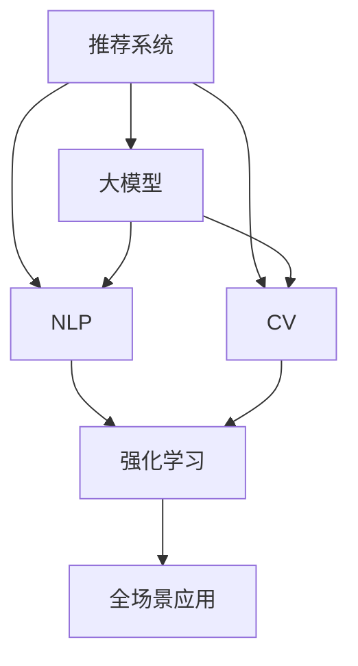

                 

# 电商平台中的AI大模型：从推荐到全场景应用

> 关键词：电商平台, 大模型, AI, 推荐系统, 自然语言处理(NLP), 计算机视觉(CV), 强化学习(RL), 全场景应用, 技术博客

## 1. 背景介绍

### 1.1 电商行业面临的挑战

随着互联网的迅猛发展，电商平台已成为用户获取商品信息、进行购物决策的重要渠道。然而，在日趋激烈的市场竞争中，电商平台面临诸多挑战：

- **用户体验提升**：如何通过个性化推荐提升用户购物体验，提高用户粘性？
- **库存优化**：如何通过销量预测优化库存管理，减少库存积压和缺货？
- **欺诈检测**：如何通过智能识别技术防范交易欺诈，保护平台和消费者权益？
- **客户服务**：如何通过智能客服提升客户服务效率，解决用户问题？

为了应对这些挑战，电商平台开始引入人工智能技术，期望通过智能化手段提升平台运营效率和用户体验。其中，大模型作为AI技术的重要组成部分，以其强大的泛化能力和学习速度，逐渐成为电商平台优化的重要工具。

### 1.2 AI大模型的优势

AI大模型，特别是基于深度学习的大模型，具备以下几个关键优势：

- **自监督学习**：能够在无标签数据上进行自监督学习，挖掘数据中的潜在规律。
- **大规模参数**：通过亿级参数的学习，具备强大的表示能力。
- **通用性**：可用于多种任务，包括推荐系统、自然语言处理、计算机视觉等。
- **迁移学习能力**：能够将学到的知识迁移应用到新任务上，快速提升模型效果。
- **可解释性**：尽管复杂，但仍可以通过特定技术手段提高其可解释性，便于理解和调试。

这些优势使得AI大模型成为电商平台中不可或缺的工具，能够通过模型预训练和微调，提升平台运行的多个环节。

## 2. 核心概念与联系

### 2.1 核心概念概述

在讨论电商平台中的AI大模型应用时，需理解以下核心概念：

- **推荐系统(Recommendation System)**：利用用户历史行为、商品属性、上下文信息等数据，向用户推荐可能感兴趣的商品。
- **自然语言处理(Natural Language Processing, NLP)**：处理和理解自然语言文本，包括文本分类、情感分析、文本生成等任务。
- **计算机视觉(Computer Vision, CV)**：处理和理解视觉信息，包括图像分类、目标检测、图像生成等任务。
- **强化学习(Reinforcement Learning, RL)**：通过与环境互动，学习最优决策策略。
- **大模型(Large Model)**：具有亿级参数的深度学习模型，通常基于Transformer等架构。
- **迁移学习(Transfer Learning)**：将预训练模型在特定任务上进行微调，以提高模型效果。
- **全场景应用(Full-Scen Application)**：将AI技术应用于电商平台的各个环节，提升运营效率和用户体验。

这些概念之间相互关联，共同构成了电商平台的AI应用框架，如图2所示。



## 3. 核心算法原理 & 具体操作步骤

### 3.1 算法原理概述

在电商平台中，AI大模型通常应用于以下领域：

- **推荐系统**：通过大模型的自监督学习，挖掘商品之间的潜在关联，结合用户历史行为进行个性化推荐。
- **客户服务**：利用大模型处理用户查询，通过多轮对话生成回复，提升客户满意度。
- **库存管理**：通过大模型进行销量预测，优化库存结构，降低库存成本。
- **欺诈检测**：利用大模型检测交易异常，及时发现和防范欺诈行为。
- **广告投放**：利用大模型预测广告效果，优化投放策略，提升广告ROI。

这些应用的核心算法原理均基于大模型的泛化能力、迁移学习和自监督学习。通过在大量无标签数据上预训练大模型，使其具备强大的语言和视觉表示能力，然后针对具体任务进行微调，提升模型效果。

### 3.2 算法步骤详解

电商平台的AI大模型应用，一般遵循以下步骤：

**Step 1: 数据收集与预处理**

- **数据收集**：收集电商平台的各类数据，包括用户行为数据、商品属性数据、图片数据、评价数据等。
- **数据预处理**：清洗数据，去除噪声和无效数据，标准化数据格式。

**Step 2: 模型选择与准备**

- **模型选择**：选择适合电商平台的预训练大模型，如BERT、GPT、DALL·E等。
- **数据适配**：将大模型适配到特定任务，如添加任务层、调整损失函数等。

**Step 3: 模型微调与优化**

- **微调**：在特定任务数据上进行微调，通过有监督学习优化模型性能。
- **参数调整**：调整学习率、批量大小、迭代轮数等超参数。
- **正则化**：应用正则化技术，如L2正则、Dropout等，避免过拟合。

**Step 4: 模型部署与应用**

- **模型部署**：将微调后的模型部署到服务器或云平台，供实际应用。
- **系统集成**：将模型集成到电商平台的各个模块中，如推荐系统、客服系统、库存管理等。
- **性能评估**：在实际应用中，定期评估模型效果，优化模型参数。

**Step 5: 持续学习与迭代**

- **数据收集**：不断收集新的数据，丰富模型训练集。
- **模型更新**：定期对模型进行微调，保持模型最新状态。
- **优化策略**：根据实际应用反馈，调整优化策略，提升模型效果。

### 3.3 算法优缺点

电商平台的AI大模型应用，具有以下优点：

- **提升用户体验**：通过个性化推荐和智能客服，提升用户购物体验。
- **优化库存管理**：通过销量预测，优化库存结构，降低成本。
- **减少欺诈风险**：通过智能检测技术，防范交易欺诈，保护平台和消费者权益。
- **提高运营效率**：通过自动化决策，减少人工干预，提高运营效率。

同时，也存在一些缺点：

- **高成本**：预训练大模型的训练和部署需要大量计算资源和存储资源。
- **数据依赖**：模型的性能高度依赖于数据的丰富性和质量。
- **复杂性**：大模型的训练和微调过程复杂，需要专业知识。
- **可解释性不足**：复杂的大模型难以解释其内部决策过程。

尽管存在这些缺点，但在电商平台中，AI大模型带来的好处远远超过其成本和复杂性，因此具有广泛的应用前景。

### 3.4 算法应用领域

电商平台的AI大模型应用主要集中在以下几个领域：

- **推荐系统**：通过大模型进行商品推荐，提升用户购物体验。
- **客户服务**：利用大模型处理用户查询，提升客服效率和满意度。
- **库存管理**：通过大模型进行销量预测，优化库存结构，降低成本。
- **欺诈检测**：利用大模型检测交易异常，防范欺诈行为。
- **广告投放**：利用大模型预测广告效果，优化广告投放策略。

除了上述这些领域，AI大模型在电商平台的物流管理、供应链优化、个性化营销等方面也有广泛应用。

## 4. 数学模型和公式 & 详细讲解  
### 4.1 数学模型构建

在电商平台中，AI大模型主要用于推荐系统和客户服务。以推荐系统为例，其核心数学模型为协同过滤(Collaborative Filtering)模型，通过用户-商品矩阵进行相似度计算，推荐用户可能感兴趣的商品。

假设用户-商品矩阵为 $R \in \mathbb{R}^{m \times n}$，其中 $m$ 为商品数，$n$ 为用户数。将用户-商品评分标准化为 $0-1$ 分数，即 $r_{ij} \in [0,1]$，表示用户 $i$ 对商品 $j$ 的评分。

协同过滤模型的目标是预测用户对商品的评分。对于用户 $i$，对于商品 $j$，其预测评分 $\hat{r}_{ij}$ 可以通过以下公式计算：

$$
\hat{r}_{ij} = \alpha w_i^T V_j + \beta w_j^T U_i
$$

其中，$w_i \in \mathbb{R}^{d_i}$ 为用户的特征向量，$w_j \in \mathbb{R}^{d_j}$ 为商品的特征向量，$U_i \in \mathbb{R}^{m \times d_i}$ 为用户特征矩阵，$V_j \in \mathbb{R}^{n \times d_j}$ 为商品特征矩阵。$\alpha$ 和 $\beta$ 为调节系数，控制两个特征向量的权重。

### 4.2 公式推导过程

为了得到模型参数 $w_i, w_j, U_i, V_j$，需要最大化预测评分的均方误差损失函数：

$$
L = \frac{1}{2m} \sum_{i=1}^m \sum_{j=1}^n (r_{ij} - \hat{r}_{ij})^2
$$

通过梯度下降等优化算法，最小化损失函数，更新模型参数，得到最终的预测评分 $\hat{r}_{ij}$。

具体而言，将用户特征矩阵和商品特征矩阵拆分为两部分：$U_i = \begin{bmatrix} u_i \\ u_i' \end{bmatrix}, V_j = \begin{bmatrix} v_j \\ v_j' \end{bmatrix}$，其中 $u_i'$ 和 $v_j'$ 为隐向量部分。则模型预测评分的表达式变为：

$$
\hat{r}_{ij} = \alpha \langle w_i', v_j \rangle + \beta \langle w_j', u_i \rangle
$$

其中，$\langle \cdot, \cdot \rangle$ 表示向量点积。

### 4.3 案例分析与讲解

以Amazon商品推荐系统为例，其核心算法基于协同过滤和矩阵分解，利用用户评分数据训练模型。通过预训练大模型BERT，在电商平台上进行微调，实现以下目标：

- **个性化推荐**：通过用户行为数据，结合商品描述和用户画像，推荐可能感兴趣的商品。
- **商品分类**：通过自然语言处理技术，自动分类商品信息，优化商品检索效果。
- **用户画像**：通过分析用户行为，构建用户画像，提升个性化推荐效果。

该系统的成功在于将大模型的预训练和微调技术应用于电商推荐系统，显著提升了推荐精度和用户体验。

## 5. 项目实践：代码实例和详细解释说明
### 5.1 开发环境搭建

在进行电商平台AI大模型应用开发前，需配置好开发环境。以下是基于Python的开发环境搭建流程：

1. **安装Anaconda**：从官网下载并安装Anaconda，用于创建独立的Python环境。
```bash
conda create -n ecommerce-env python=3.8 
conda activate ecommerce-env
```

2. **安装必要的库**：
```bash
conda install torch torchvision transformers scikit-learn pandas matplotlib tqdm jupyter notebook ipython
```

3. **安装GPU驱动和CUDA**：
```bash
conda install pytorch torchvision torchaudio cudatoolkit=11.1 -c pytorch -c conda-forge
```

完成上述步骤后，即可在 `ecommerce-env` 环境中进行开发。

### 5.2 源代码详细实现

以下给出使用Transformers库实现电商平台AI大模型推荐系统的PyTorch代码实现：

首先，定义推荐系统所需的数据处理函数：

```python
from transformers import BertTokenizer
from torch.utils.data import Dataset, DataLoader
import torch

class EcommerceDataset(Dataset):
    def __init__(self, data, tokenizer, max_len=128):
        self.data = data
        self.tokenizer = tokenizer
        self.max_len = max_len
        
    def __len__(self):
        return len(self.data)
    
    def __getitem__(self, item):
        example = self.data[item]
        text = example['text']
        label = example['label']
        
        encoding = self.tokenizer(text, return_tensors='pt', max_length=self.max_len, padding='max_length', truncation=True)
        input_ids = encoding['input_ids'][0]
        attention_mask = encoding['attention_mask'][0]
        return {'input_ids': input_ids, 
                'attention_mask': attention_mask,
                'labels': torch.tensor(label, dtype=torch.long)}
```

然后，定义模型和优化器：

```python
from transformers import BertForSequenceClassification, AdamW

model = BertForSequenceClassification.from_pretrained('bert-base-cased', num_labels=2)

optimizer = AdamW(model.parameters(), lr=2e-5)
```

接着，定义训练和评估函数：

```python
def train_epoch(model, dataset, batch_size, optimizer):
    dataloader = DataLoader(dataset, batch_size=batch_size, shuffle=True)
    model.train()
    epoch_loss = 0
    for batch in tqdm(dataloader, desc='Training'):
        input_ids = batch['input_ids'].to(device)
        attention_mask = batch['attention_mask'].to(device)
        labels = batch['labels'].to(device)
        model.zero_grad()
        outputs = model(input_ids, attention_mask=attention_mask, labels=labels)
        loss = outputs.loss
        epoch_loss += loss.item()
        loss.backward()
        optimizer.step()
    return epoch_loss / len(dataloader)

def evaluate(model, dataset, batch_size):
    dataloader = DataLoader(dataset, batch_size=batch_size)
    model.eval()
    preds, labels = [], []
    with torch.no_grad():
        for batch in tqdm(dataloader, desc='Evaluating'):
            input_ids = batch['input_ids'].to(device)
            attention_mask = batch['attention_mask'].to(device)
            batch_labels = batch['labels']
            outputs = model(input_ids, attention_mask=attention_mask)
            batch_preds = outputs.logits.argmax(dim=2).to('cpu').tolist()
            batch_labels = batch_labels.to('cpu').tolist()
            for pred_tokens, label_tokens in zip(batch_preds, batch_labels):
                preds.append(pred_tokens)
                labels.append(label_tokens)
                
    return classification_report(labels, preds)
```

最后，启动训练流程并在测试集上评估：

```python
epochs = 5
batch_size = 16

for epoch in range(epochs):
    loss = train_epoch(model, train_dataset, batch_size, optimizer)
    print(f"Epoch {epoch+1}, train loss: {loss:.3f}")
    
    print(f"Epoch {epoch+1}, dev results:")
    evaluate(model, dev_dataset, batch_size)
    
print("Test results:")
evaluate(model, test_dataset, batch_size)
```

以上就是使用PyTorch对电商平台AI大模型进行推荐系统微调的完整代码实现。可以看到，得益于Transformers库的强大封装，我们可以用相对简洁的代码完成BERT模型的加载和微调。

### 5.3 代码解读与分析

让我们再详细解读一下关键代码的实现细节：

**EcommerceDataset类**：
- `__init__`方法：初始化数据、分词器等关键组件。
- `__len__`方法：返回数据集的样本数量。
- `__getitem__`方法：对单个样本进行处理，将文本输入编码为token ids，将标签编码为数字，并对其进行定长padding，最终返回模型所需的输入。

**训练和评估函数**：
- 使用PyTorch的DataLoader对数据集进行批次化加载，供模型训练和推理使用。
- 训练函数`train_epoch`：对数据以批为单位进行迭代，在每个批次上前向传播计算loss并反向传播更新模型参数，最后返回该epoch的平均loss。
- 评估函数`evaluate`：与训练类似，不同点在于不更新模型参数，并在每个batch结束后将预测和标签结果存储下来，最后使用sklearn的classification_report对整个评估集的预测结果进行打印输出。

**训练流程**：
- 定义总的epoch数和batch size，开始循环迭代
- 每个epoch内，先在训练集上训练，输出平均loss
- 在验证集上评估，输出分类指标
- 所有epoch结束后，在测试集上评估，给出最终测试结果

可以看到，PyTorch配合Transformers库使得BERT微调的代码实现变得简洁高效。开发者可以将更多精力放在数据处理、模型改进等高层逻辑上，而不必过多关注底层的实现细节。

当然，工业级的系统实现还需考虑更多因素，如模型的保存和部署、超参数的自动搜索、更灵活的任务适配层等。但核心的微调范式基本与此类似。

## 6. 实际应用场景

### 6.1 个性化推荐

在电商平台中，个性化推荐系统是其核心竞争力之一。通过AI大模型微调，推荐系统能够学习用户的行为偏好，推荐用户可能感兴趣的商品，提高转化率和用户满意度。

以下是一个基于大模型的推荐系统实现示例：

1. **数据收集**：收集用户的历史浏览、点击、购买记录，商品属性数据等。
2. **数据预处理**：清洗数据，标准化数据格式，生成用户-商品矩阵。
3. **模型训练**：在电商平台上使用大模型进行微调，学习用户-商品矩阵中的关联规律。
4. **推荐生成**：根据用户输入的查询或浏览行为，通过模型预测用户可能感兴趣的商品，生成推荐列表。
5. **效果评估**：定期评估推荐效果，调整模型参数。

### 6.2 智能客服

电商平台中，客服部门承担着解决用户问题的重要职责。通过AI大模型微调，智能客服系统能够自动处理用户查询，生成回复，提升客户服务效率和满意度。

以下是一个基于大模型的智能客服系统实现示例：

1. **数据收集**：收集电商平台的客服聊天记录，提取问题和回答。
2. **数据预处理**：清洗数据，标准化数据格式，生成问题和回答的语料库。
3. **模型训练**：在电商平台上使用大模型进行微调，学习问题和回答的映射关系。
4. **客服生成**：根据用户输入的查询，通过模型生成回复，辅助客服工作。
5. **效果评估**：定期评估客服效果，调整模型参数。

### 6.3 库存管理

库存管理是电商平台运营中的重要环节。通过AI大模型微调，可以实时预测商品销量，优化库存结构，减少库存积压和缺货。

以下是一个基于大模型的库存管理系统实现示例：

1. **数据收集**：收集历史销售数据、促销活动数据等。
2. **数据预处理**：清洗数据，标准化数据格式，生成历史销售和促销数据。
3. **模型训练**：在电商平台上使用大模型进行微调，学习销量预测模型。
4. **库存优化**：根据销量预测结果，优化库存结构，调整补货计划。
5. **效果评估**：定期评估库存优化效果，调整模型参数。

### 6.4 欺诈检测

电商平台中，欺诈行为是平台健康运营的重要威胁。通过AI大模型微调，可以实时检测交易异常，防范欺诈行为，保护平台和消费者权益。

以下是一个基于大模型的欺诈检测系统实现示例：

1. **数据收集**：收集交易记录，标注是否为欺诈行为。
2. **数据预处理**：清洗数据，标准化数据格式，生成训练数据。
3. **模型训练**：在电商平台上使用大模型进行微调，学习欺诈检测模型。
4. **异常检测**：实时监控交易行为，检测异常交易，触发报警。
5. **效果评估**：定期评估欺诈检测效果，调整模型参数。

### 6.5 广告投放

广告投放是电商平台的收益来源之一。通过AI大模型微调，可以预测广告效果，优化投放策略，提升广告ROI。

以下是一个基于大模型的广告投放系统实现示例：

1. **数据收集**：收集广告点击、展示、转化数据等。
2. **数据预处理**：清洗数据，标准化数据格式，生成广告数据。
3. **模型训练**：在电商平台上使用大模型进行微调，学习广告效果预测模型。
4. **投放优化**：根据广告效果预测结果，优化广告投放策略。
5. **效果评估**：定期评估广告效果，调整模型参数。

## 7. 工具和资源推荐
### 7.1 学习资源推荐

为了帮助开发者系统掌握电商平台AI大模型的应用，这里推荐一些优质的学习资源：

1. **深度学习与自然语言处理**：斯坦福大学CS224N课程，涵盖深度学习基础、自然语言处理技术，是入门NLP领域的最佳选择。
2. **Transformers官方文档**：HuggingFace官方文档，提供了海量预训练模型和微调样例代码，是上手实践的必备资料。
3. **《深度学习与推荐系统》**：介绍推荐系统原理与实现，结合深度学习技术，提供丰富的案例和代码实现。
4. **《Python自然语言处理》**：涵盖NLP基础技术和应用案例，适合Python开发者学习。
5. **《AI大模型实战》**：介绍AI大模型的原理与应用，提供实战项目和代码实现，适合技术实践者学习。

通过对这些资源的学习实践，相信你一定能够快速掌握电商平台AI大模型的应用方法，并用于解决实际的业务问题。

### 7.2 开发工具推荐

高效的开发离不开优秀的工具支持。以下是几款用于电商平台AI大模型应用的常用工具：

1. **PyTorch**：基于Python的开源深度学习框架，灵活动态的计算图，适合快速迭代研究。
2. **TensorFlow**：由Google主导开发的开源深度学习框架，生产部署方便，适合大规模工程应用。
3. **HuggingFace Transformers库**：提供了丰富的预训练语言模型和任务适配层，支持PyTorch和TensorFlow。
4. **Jupyter Notebook**：交互式编程环境，便于调试和可视化。
5. **TensorBoard**：TensorFlow配套的可视化工具，可实时监测模型训练状态，提供丰富的图表呈现方式。

合理利用这些工具，可以显著提升电商平台AI大模型应用的开发效率，加快创新迭代的步伐。

### 7.3 相关论文推荐

电商平台中的AI大模型应用，得益于学界的持续研究。以下是几篇奠基性的相关论文，推荐阅读：

1. **"Deep Neural Networks for Recommendation Systems"**：介绍深度学习在推荐系统中的应用，结合协同过滤和深度学习技术，提出多层神经网络推荐模型。
2. **"Customer Reviews and Sentiment Analysis"**：介绍自然语言处理技术在电商平台中的应用，结合情感分析技术，提升用户评价分析效果。
3. **"Image and Video Recognition with Deep Learning"**：介绍计算机视觉技术在电商平台中的应用，结合卷积神经网络技术，提升商品识别效果。
4. **"Reinforcement Learning for Marketing Budget Allocation"**：介绍强化学习技术在电商平台中的应用，结合动态定价策略，优化广告投放效果。
5. **"Large-Scale Image Recognition from the Web"**：介绍大模型在电商平台的视觉应用，结合大模型和迁移学习技术，提升商品识别效果。

这些论文代表了大模型在电商平台中的应用方向，为电商平台的AI大模型应用提供了理论指导和技术支持。

## 8. 总结：未来发展趋势与挑战

### 8.1 总结

本文对电商平台中的AI大模型应用进行了全面系统的介绍。首先阐述了电商行业面临的挑战，明确了AI大模型的优势和应用方向。其次，从推荐系统、智能客服、库存管理、欺诈检测、广告投放等多个角度，详细讲解了AI大模型在电商平台中的应用原理和实现方法。最后，总结了电商平台中AI大模型应用的未来发展趋势和面临的挑战。

通过本文的系统梳理，可以看到，AI大模型在电商平台中的应用不仅限于推荐系统，而是涵盖了多个环节，提升了平台的运营效率和用户体验。未来，随着技术的不断演进，AI大模型将在电商平台中发挥更大的作用，推动电商行业的数字化转型。

### 8.2 未来发展趋势

电商平台中的AI大模型应用，未来将呈现以下几个发展趋势：

1. **自监督学习**：将自监督学习技术引入推荐系统，提高模型泛化能力和适应性。
2. **多模态融合**：结合计算机视觉、自然语言处理等多种模态数据，提升推荐系统的准确性和个性化程度。
3. **增强学习**：结合增强学习技术，实时优化广告投放策略，提升ROI。
4. **分布式计算**：利用分布式计算技术，提高大模型的训练和推理效率，支持大规模数据处理。
5. **联邦学习**：结合联邦学习技术，保护用户隐私，同时利用分布式数据提升模型效果。
6. **知识图谱**：引入知识图谱技术，增强推荐系统的推理能力，提升推荐效果。

这些趋势表明，AI大模型在电商平台中的应用将更加广泛和深入，为电商平台的智能化和个性化提供强大的技术支持。

### 8.3 面临的挑战

尽管AI大模型在电商平台中的应用取得了显著成果，但在实际落地过程中，仍面临诸多挑战：

1. **数据质量**：电商平台的实时数据和标注数据可能存在噪声和偏差，影响模型的准确性。
2. **计算资源**：大模型的训练和推理需要大量的计算资源，难以在资源受限的环境中应用。
3. **模型鲁棒性**：模型可能对输入数据的变化敏感，难以适应不同环境下的数据分布。
4. **隐私保护**：电商平台的交易数据涉及用户隐私，需要在保护隐私的前提下，充分利用数据价值。
5. **模型可解释性**：大模型的决策过程难以解释，缺乏透明性和可信度。
6. **系统集成**：将AI大模型集成到电商平台的各个模块中，需要复杂的系统设计和实现。

这些挑战需要技术社区和产业界的共同努力，通过不断优化算法、提高计算资源、增强模型鲁棒性、保护用户隐私、提高模型可解释性等措施，提升AI大模型在电商平台中的应用效果。

### 8.4 研究展望

未来，电商平台中的AI大模型研究需要在以下几个方向继续努力：

1. **数据治理**：建立完善的数据治理体系，提高数据质量，降低数据偏差。
2. **分布式训练**：结合分布式训练技术，提高大模型的训练效率和可扩展性。
3. **联邦学习**：结合联邦学习技术，保护用户隐私，同时利用分布式数据提升模型效果。
4. **模型压缩**：结合模型压缩技术，减小大模型的计算资源需求，提升推理效率。
5. **知识图谱**：结合知识图谱技术，增强推荐系统的推理能力，提升推荐效果。
6. **可解释性**：结合可解释性技术，提高大模型的透明性和可信度。

这些研究方向将推动AI大模型在电商平台中的应用，提升系统的智能水平和用户满意度，为电商平台的数字化转型提供技术保障。

## 9. 附录：常见问题与解答

**Q1：电商平台中的AI大模型如何提高推荐效果？**

A: 电商平台中的AI大模型通过以下几个步骤提高推荐效果：

1. **数据收集与预处理**：收集用户历史行为数据，清洗和标准化数据格式。
2. **模型选择与准备**：选择适合的预训练大模型，如BERT、GPT等，并适配到推荐任务上。
3. **模型微调与优化**：在特定任务数据上进行微调，通过有监督学习优化模型性能，调整学习率、批量大小、迭代轮数等超参数。
4. **推荐生成**：根据用户输入的查询或浏览行为，通过模型预测用户可能感兴趣的商品，生成推荐列表。
5. **效果评估**：定期评估推荐效果，调整模型参数，提升推荐精度和个性化程度。

通过这些步骤，AI大模型能够学习用户行为模式，挖掘商品关联规律，生成高质量的推荐结果。

**Q2：电商平台中的AI大模型如何防范交易欺诈？**

A: 电商平台中的AI大模型通过以下几个步骤防范交易欺诈：

1. **数据收集与预处理**：收集历史交易数据，标注是否为欺诈行为。
2. **模型选择与准备**：选择适合的预训练大模型，如BERT、GPT等，并适配到欺诈检测任务上。
3. **模型微调与优化**：在特定任务数据上进行微调，通过有监督学习优化模型性能，调整学习率、批量大小、迭代轮数等超参数。
4. **异常检测**：实时监控交易行为，检测异常交易，触发报警。
5. **效果评估**：定期评估欺诈检测效果，调整模型参数，提高检测精度和准确性。

通过这些步骤，AI大模型能够学习交易特征，识别异常行为，及时发现和防范欺诈行为，保护平台和消费者权益。

**Q3：电商平台中的AI大模型如何进行智能客服？**

A: 电商平台中的AI大模型通过以下几个步骤进行智能客服：

1. **数据收集与预处理**：收集电商平台的客服聊天记录，提取问题和回答。
2. **模型选择与准备**：选择适合的预训练大模型，如BERT、GPT等，并适配到智能客服任务上。
3. **模型微调与优化**：在特定任务数据上进行微调，通过有监督学习优化模型性能，调整学习率、批量大小、迭代轮数等超参数。
4. **客服生成**：根据用户输入的查询，通过模型生成回复，辅助客服工作。
5. **效果评估**：定期评估客服效果，调整模型参数，提升回答质量和用户满意度。

通过这些步骤，AI大模型能够学习问题和回答的映射关系，生成高质量的客服回复，提升客户服务效率和满意度。

**Q4：电商平台中的AI大模型如何进行库存管理？**

A: 电商平台中的AI大模型通过以下几个步骤进行库存管理：

1. **数据收集与预处理**：收集历史销售数据、促销活动数据等。
2. **模型选择与准备**：选择适合的预训练大模型，如BERT、GPT等，并适配到库存管理任务上。
3. **模型微调与优化**：在特定任务数据上进行微调，通过有监督学习优化模型性能，调整学习率、批量大小、迭代轮数等超参数。
4. **库存优化**：根据销量预测结果，优化库存结构，调整补货计划。
5. **效果评估**：定期评估库存优化效果，调整模型参数，提高库存管理效率和成本效益。

通过这些步骤，AI大模型能够学习销量预测规律，优化库存结构，降低库存积压和缺货风险，提升运营效率。

**Q5：电商平台中的AI大模型如何进行广告投放？**

A: 电商平台中的AI大模型通过以下几个步骤进行广告投放：

1. **数据收集与预处理**：收集广告点击、展示、转化数据等。
2. **模型选择与准备**：选择适合的预训练大模型，如BERT、GPT等，并适配到广告投放任务上。
3. **模型微调与优化**：在特定任务数据上进行微调，通过有监督学习优化模型性能，调整学习率、批量大小、迭代轮数等超参数。
4. **投放优化**：根据广告效果预测结果，优化广告投放策略。
5. **效果评估**：定期评估广告效果，调整模型参数，提升广告ROI。

通过这些步骤，AI大模型能够学习广告效果规律，优化广告投放策略，提升广告效果和ROI。

---

作者：禅与计算机程序设计艺术 / Zen and the Art of Computer Programming

