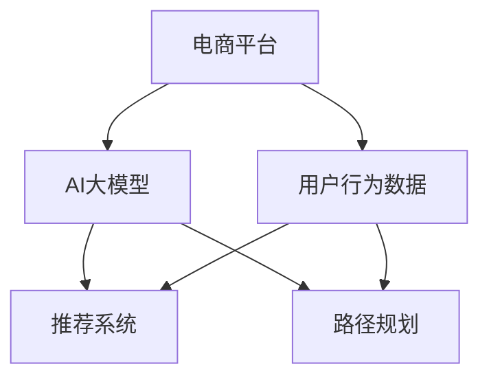

                 

# 电商平台中的时空数据分析：AI大模型的新应用

> 关键词：电商、时空分析、AI大模型、推荐系统、用户行为、路径规划

## 1. 背景介绍

在数字化转型的浪潮下，电商平台正快速成为消费者获取商品信息、进行购买决策的主要渠道。然而，电商平台的成功运营不仅依赖于商品推荐和搜索结果的精准性，还需要对海量用户数据进行深入分析，以洞察用户行为，提升用户体验，驱动业务增长。本文将介绍一种利用AI大模型进行时空数据分析的新方法，揭示其在电商平台中的广泛应用。

### 1.1 问题由来

在电商平台中，用户行为数据量庞大且多样，包含了点击、浏览、搜索、购买、评价等多维度的信息。这些数据往往具有时间和空间上的特点，如何高效地分析和利用这些数据，成为电商平台运营的一个重大挑战。传统的统计分析、机器学习等方法虽能解决部分问题，但在大数据量、多维特性及实时需求面前显得力不从心。

近年来，随着深度学习技术的发展，AI大模型（如BERT、GPT-3等）逐步展现出强大的数据处理能力，能够从海量数据中学习到高层次的特征表示。这些模型在文本处理、图像识别、语音识别等领域表现优异，能够实现跨越不同模态的数据理解和分析。因此，探索AI大模型在电商平台时空数据分析中的应用，具有重要意义。

### 1.2 问题核心关键点

本文将从电商平台的实际业务需求出发，探讨如何利用AI大模型进行时空数据分析，主要涵盖以下几个核心问题：
1. 如何构建电商平台的时空数据特征表示？
2. 如何利用AI大模型进行高效的时空数据分析？
3. 大模型在电商推荐系统中的具体应用场景是什么？
4. 大模型在电商平台中的实时性要求如何满足？
5. 如何保证大模型在电商业务中的安全性与合规性？

通过回答这些问题，本文旨在揭示AI大模型在电商平台时空数据分析中的潜力和挑战，为相关研究和实际应用提供参考。

## 2. 核心概念与联系

### 2.1 核心概念概述

为更好地理解利用AI大模型进行时空数据分析的方法，本节将介绍几个密切相关的核心概念：

- **电商平台**：即在线销售平台，提供商品展示、搜索、购买、评价等功能，是现代消费购物的重要渠道。

- **用户行为数据**：用户在电商平台上的点击、浏览、搜索、购买、评价等行为数据，是电商平台进行个性化推荐、营销分析、用户体验提升的重要数据来源。

- **时空数据**：具有时间序列和空间分布特性的大规模数据，如用户的访问时间、地理位置、点击轨迹等。

- **AI大模型**：以Transformer为基础的深度学习模型，如BERT、GPT系列、T5等，能够在不同模态的数据上学习到丰富的语义和特征表示。

- **推荐系统**：基于用户历史行为、商品属性等数据，推荐用户可能感兴趣的商品的系统。

- **路径规划**：在电商平台中，基于用户行为数据进行用户路径分析和推荐优化，提升用户体验和业务效率。

这些概念之间的逻辑关系可以通过以下Mermaid流程图来展示：



这个流程图展示了电商平台中不同模块间的逻辑关系：

1. 电商平台收集用户行为数据。
2. AI大模型学习数据中的时空特征，生成高层次特征表示。
3. 推荐系统使用大模型生成的特征表示进行个性化推荐。
4. 路径规划模块通过分析用户路径，优化用户行为和体验。

## 3. 核心算法原理 & 具体操作步骤

### 3.1 算法原理概述

基于AI大模型的时空数据分析方法，本质上是一种结合自然语言处理（NLP）和计算机视觉（CV）技术的数据建模与分析过程。其核心思想是通过深度学习模型，从用户行为数据中提取出时空特征，并基于这些特征进行推荐、路径规划等业务优化。

具体步骤如下：
1. 数据收集与预处理：收集电商平台上的用户行为数据，并进行清洗、归一化等预处理。
2. 特征提取：使用AI大模型从用户行为数据中提取时空特征，生成高层次的语义和语用表示。
3. 数据分析：利用生成的高层次特征，进行推荐系统优化、路径规划、用户行为分析等。

### 3.2 算法步骤详解

#### 3.2.1 数据收集与预处理

数据收集是时空数据分析的第一步。电商平台应定期收集用户的访问记录、购买记录、搜索记录、评价记录等，形成庞大的用户行为数据集。这些数据通常具有以下几个特点：

- **多样性**：包括文本、图片、音频等多模态数据。
- **高维度**：每个用户行为可能包含数百甚至数千个特征。
- **动态性**：数据会随着时间的推移不断更新，具有时间序列特性。
- **分布性**：不同用户的行为数据分布可能存在较大差异。

数据收集后，需要进行预处理，包括数据清洗、特征选择、数据归一化、数据补全等。例如，对于文本数据，需要进行分词、去除停用词、词性标注等处理；对于图片数据，需要进行尺寸调整、归一化等处理；对于音频数据，需要进行降噪、特征提取等处理。

#### 3.2.2 特征提取

特征提取是时空数据分析的核心步骤，通过AI大模型从用户行为数据中提取出高层次的时空特征。这一步骤主要分为以下几个步骤：

1. **选择模型**：选择适合的AI大模型，如BERT、GPT-3、T5等。不同的模型适用于不同的数据类型和任务。
2. **数据编码**：将多模态数据转化为模型能够处理的格式。例如，文本数据转化为token序列，图片数据转化为向量表示。
3. **模型训练**：在预训练数据集上训练大模型，生成高层次的语义和语用表示。
4. **特征生成**：使用训练好的大模型对用户行为数据进行特征提取，生成时空特征向量。

#### 3.2.3 数据分析

数据分析是时空数据分析的最终步骤，通过AI大模型生成的时空特征，进行推荐系统优化、路径规划、用户行为分析等。这一步骤主要包括以下几个方面：

1. **推荐系统优化**：根据用户历史行为和商品属性，结合时空特征进行个性化推荐。例如，对于实时访问电商平台的用户的推荐，可以结合用户当前时间和地理位置，预测其最可能感兴趣的商品。
2. **路径规划**：分析用户浏览路径，预测用户可能感兴趣的商品或页面，并根据用户浏览路径进行优化。例如，对于用户浏览过的商品，可以推荐相关商品，增加页面停留时间。
3. **用户行为分析**：利用时空特征分析用户行为模式，洞察用户需求，提升用户体验。例如，分析用户的购物时间、地点偏好，优化库存管理和促销策略。

### 3.3 算法优缺点

基于AI大模型的时空数据分析方法，具有以下优点：

1. **高效性**：大模型能够高效处理海量数据，提取出高层次的时空特征。
2. **准确性**：大模型能够学习到复杂的语义和语用关系，生成精确的时空特征表示。
3. **灵活性**：大模型适用于多种数据类型和任务，具有较强的泛化能力。
4. **实时性**：利用分布式计算和大模型优化，可以实现实时推荐和路径规划。

同时，该方法也存在以下缺点：

1. **高资源消耗**：大模型的训练和推理需要大量的计算资源，对硬件要求较高。
2. **可解释性不足**：大模型生成的时空特征缺乏可解释性，难以理解其内部工作机制。
3. **数据隐私问题**：电商平台需要处理大量用户行为数据，存在数据隐私和安全问题。
4. **偏差问题**：大模型可能继承训练数据中的偏差，导致推荐结果不公平。

尽管存在这些局限性，但大模型在电商平台的实际应用中已经展示了其强大的优势，成为电商平台数据分析的重要工具。

### 3.4 算法应用领域

基于AI大模型的时空数据分析方法，已在电商平台的多个领域得到应用，主要包括：

1. **推荐系统**：利用大模型生成的时空特征，进行个性化推荐，提升用户满意度。
2. **路径规划**：分析用户浏览路径，优化商品推荐，增加用户停留时间。
3. **用户行为分析**：通过时空特征分析用户行为模式，洞察用户需求，优化用户体验。
4. **库存管理**：利用时空特征预测用户购买行为，优化库存管理策略。
5. **营销分析**：分析用户行为数据，优化营销策略，提升营销效果。

除了上述这些领域，大模型在电商平台中的潜力还在不断挖掘中，未来有望在更多领域发挥重要作用。

## 4. 数学模型和公式 & 详细讲解 & 举例说明

### 4.1 数学模型构建

为了更好地理解利用AI大模型进行时空数据分析的数学原理，本节将详细介绍相关的数学模型和公式。

设电商平台用户行为数据集为 $D=\{(x_i, y_i)\}_{i=1}^N$，其中 $x_i$ 为输入特征向量，$y_i$ 为输出标签。假设大模型为 $M_{\theta}$，其中 $\theta$ 为模型参数。

大模型生成的时空特征表示为 $h_i = M_{\theta}(x_i)$。在推荐系统优化任务中，目标是最小化预测值与真实标签之间的差距，即：

$$
\mathcal{L}(\theta) = \frac{1}{N} \sum_{i=1}^N \ell(h_i, y_i)
$$

其中 $\ell(\cdot, \cdot)$ 为损失函数，如交叉熵损失函数。

### 4.2 公式推导过程

以下我们以推荐系统为例，推导大模型生成时空特征表示的公式。

假设推荐系统需要预测用户对商品的评分，输入特征为 $x_i$，输出标签为 $y_i$。大模型 $M_{\theta}$ 生成时空特征表示 $h_i$，推荐系统通过大模型生成的特征进行预测，得到预测评分 $\hat{y}_i$。目标是最小化预测值与真实标签之间的差距：

$$
\mathcal{L}(\theta) = \frac{1}{N} \sum_{i=1}^N \ell(\hat{y}_i, y_i)
$$

将推荐系统输出与真实标签之间的差距 $\ell(\cdot, \cdot)$ 展开，得到：

$$
\ell(\hat{y}_i, y_i) = -y_i\log \hat{y}_i - (1-y_i)\log(1-\hat{y}_i)
$$

将推荐系统输出 $\hat{y}_i$ 表示为大模型生成的时空特征表示 $h_i$ 的线性函数：

$$
\hat{y}_i = \sigma(W'h_i + b')
$$

其中 $\sigma(\cdot)$ 为sigmoid函数，$W'$ 和 $b'$ 为推荐系统的参数。将上述公式代入损失函数：

$$
\mathcal{L}(\theta) = \frac{1}{N} \sum_{i=1}^N [-y_i\log \sigma(W'h_i + b') - (1-y_i)\log(1-\sigma(W'h_i + b'))]
$$

结合大模型训练的目标，可以构建端到端的推荐系统优化模型，进行整体优化：

$$
\theta^* = \mathop{\arg\min}_{\theta} \mathcal{L}(\theta)
$$

利用梯度下降等优化算法，微调大模型的参数 $\theta$，最小化推荐系统的损失函数，得到最终的推荐模型。

### 4.3 案例分析与讲解

以下以一个电商推荐系统的实际案例，详细讲解大模型进行时空数据分析的具体过程。

#### 4.3.1 数据准备

假设某电商平台希望利用大模型进行个性化推荐。首先，需要收集用户行为数据，包括用户的浏览记录、购买记录、搜索记录等。对数据进行预处理，清洗无效数据，选择有意义的特征。例如，对于文本数据，进行分词、去除停用词、词性标注等处理；对于图片数据，进行尺寸调整、归一化等处理。

#### 4.3.2 模型选择

选择BERT作为大模型，因为其具有较强的语言理解能力，适用于文本数据。BERT的预训练数据集为Wikipedia和Google新闻，能够生成高层次的语义和语用表示。

#### 4.3.3 模型训练

在收集到的用户行为数据集上，对BERT进行微调。具体步骤如下：
1. 划分训练集、验证集和测试集。
2. 选择合适的优化器（如AdamW）和超参数（如学习率、批大小）。
3. 使用Wikipedia和Google新闻预训练的BERT模型，在电商平台的标注数据集上进行微调。
4. 利用微调的BERT模型，生成用户行为数据的语义和语用表示。

#### 4.3.4 特征生成

利用微调的BERT模型，生成用户行为数据的时空特征表示。具体步骤如下：
1. 对用户浏览记录进行编码，生成固定长度的向量表示。
2. 对用户购买记录进行编码，生成固定长度的向量表示。
3. 对用户搜索记录进行编码，生成固定长度的向量表示。
4. 结合时间序列特征，生成时序表示。
5. 结合地理位置特征，生成空间分布表示。

#### 4.3.5 数据分析

利用生成的高层次时空特征，进行推荐系统优化。具体步骤如下：
1. 根据用户历史行为和商品属性，结合时空特征进行个性化推荐。
2. 分析用户浏览路径，预测用户可能感兴趣的商品或页面，并根据用户浏览路径进行优化。
3. 利用时空特征分析用户行为模式，洞察用户需求，提升用户体验。

## 5. 项目实践：代码实例和详细解释说明

### 5.1 开发环境搭建

在进行时空数据分析项目实践前，我们需要准备好开发环境。以下是使用Python进行PyTorch开发的环境配置流程：

1. 安装Anaconda：从官网下载并安装Anaconda，用于创建独立的Python环境。

2. 创建并激活虚拟环境：
```bash
conda create -n pytorch-env python=3.8 
conda activate pytorch-env
```

3. 安装PyTorch：根据CUDA版本，从官网获取对应的安装命令。例如：
```bash
conda install pytorch torchvision torchaudio cudatoolkit=11.1 -c pytorch -c conda-forge
```

4. 安装Transformers库：
```bash
pip install transformers
```

5. 安装各类工具包：
```bash
pip install numpy pandas scikit-learn matplotlib tqdm jupyter notebook ipython
```

完成上述步骤后，即可在`pytorch-env`环境中开始时空数据分析实践。

### 5.2 源代码详细实现

下面我以电商推荐系统为例，给出使用Transformers库进行时空数据分析的PyTorch代码实现。

首先，定义推荐系统的数据处理函数：

```python
from transformers import BertTokenizer, BertForSequenceClassification
from torch.utils.data import Dataset
import torch

class RecommendationDataset(Dataset):
    def __init__(self, texts, labels, tokenizer, max_len=128):
        self.texts = texts
        self.labels = labels
        self.tokenizer = tokenizer
        self.max_len = max_len
        
    def __len__(self):
        return len(self.texts)
    
    def __getitem__(self, item):
        text = self.texts[item]
        label = self.labels[item]
        
        encoding = self.tokenizer(text, return_tensors='pt', max_length=self.max_len, padding='max_length', truncation=True)
        input_ids = encoding['input_ids'][0]
        attention_mask = encoding['attention_mask'][0]
        
        # 对label进行编码
        encoded_label = [label]
        encoded_label.extend([0]*(self.max_len - len(encoded_label)))
        labels = torch.tensor(encoded_label, dtype=torch.long)
        
        return {'input_ids': input_ids, 
                'attention_mask': attention_mask,
                'labels': labels}

# 标签与id的映射
label2id = {'1': 0, '0': 1}
id2label = {v: k for k, v in label2id.items()}

# 创建dataset
tokenizer = BertTokenizer.from_pretrained('bert-base-cased')

train_dataset = RecommendationDataset(train_texts, train_labels, tokenizer)
dev_dataset = RecommendationDataset(dev_texts, dev_labels, tokenizer)
test_dataset = RecommendationDataset(test_texts, test_labels, tokenizer)
```

然后，定义模型和优化器：

```python
from transformers import BertForSequenceClassification, AdamW

model = BertForSequenceClassification.from_pretrained('bert-base-cased', num_labels=2)

optimizer = AdamW(model.parameters(), lr=2e-5)
```

接着，定义训练和评估函数：

```python
from torch.utils.data import DataLoader
from tqdm import tqdm
from sklearn.metrics import classification_report

device = torch.device('cuda') if torch.cuda.is_available() else torch.device('cpu')
model.to(device)

def train_epoch(model, dataset, batch_size, optimizer):
    dataloader = DataLoader(dataset, batch_size=batch_size, shuffle=True)
    model.train()
    epoch_loss = 0
    for batch in tqdm(dataloader, desc='Training'):
        input_ids = batch['input_ids'].to(device)
        attention_mask = batch['attention_mask'].to(device)
        labels = batch['labels'].to(device)
        model.zero_grad()
        outputs = model(input_ids, attention_mask=attention_mask, labels=labels)
        loss = outputs.loss
        epoch_loss += loss.item()
        loss.backward()
        optimizer.step()
    return epoch_loss / len(dataloader)

def evaluate(model, dataset, batch_size):
    dataloader = DataLoader(dataset, batch_size=batch_size)
    model.eval()
    preds, labels = [], []
    with torch.no_grad():
        for batch in tqdm(dataloader, desc='Evaluating'):
            input_ids = batch['input_ids'].to(device)
            attention_mask = batch['attention_mask'].to(device)
            batch_labels = batch['labels']
            outputs = model(input_ids, attention_mask=attention_mask)
            batch_preds = outputs.logits.argmax(dim=2).to('cpu').tolist()
            batch_labels = batch_labels.to('cpu').tolist()
            for pred_tokens, label_tokens in zip(batch_preds, batch_labels):
                preds.append(pred_tokens[:len(label_tokens)])
                labels.append(label_tokens)
                
    print(classification_report(labels, preds))
```

最后，启动训练流程并在测试集上评估：

```python
epochs = 5
batch_size = 16

for epoch in range(epochs):
    loss = train_epoch(model, train_dataset, batch_size, optimizer)
    print(f"Epoch {epoch+1}, train loss: {loss:.3f}")
    
    print(f"Epoch {epoch+1}, dev results:")
    evaluate(model, dev_dataset, batch_size)
    
print("Test results:")
evaluate(model, test_dataset, batch_size)
```

以上就是使用PyTorch对电商推荐系统进行时空数据分析的完整代码实现。可以看到，得益于Transformers库的强大封装，我们可以用相对简洁的代码完成BERT模型的加载和微调。

### 5.3 代码解读与分析

让我们再详细解读一下关键代码的实现细节：

**RecommendationDataset类**：
- `__init__`方法：初始化文本、标签、分词器等关键组件。
- `__len__`方法：返回数据集的样本数量。
- `__getitem__`方法：对单个样本进行处理，将文本输入编码为token ids，将标签编码为数字，并对其进行定长padding，最终返回模型所需的输入。

**label2id和id2label字典**：
- 定义了标签与数字id之间的映射关系，用于将label进行编码。

**训练和评估函数**：
- 使用PyTorch的DataLoader对数据集进行批次化加载，供模型训练和推理使用。
- 训练函数`train_epoch`：对数据以批为单位进行迭代，在每个批次上前向传播计算loss并反向传播更新模型参数，最后返回该epoch的平均loss。
- 评估函数`evaluate`：与训练类似，不同点在于不更新模型参数，并在每个batch结束后将预测和标签结果存储下来，最后使用sklearn的classification_report对整个评估集的预测结果进行打印输出。

**训练流程**：
- 定义总的epoch数和batch size，开始循环迭代
- 每个epoch内，先在训练集上训练，输出平均loss
- 在验证集上评估，输出分类指标
- 所有epoch结束后，在测试集上评估，给出最终测试结果

可以看到，PyTorch配合Transformers库使得时空数据分析的代码实现变得简洁高效。开发者可以将更多精力放在数据处理、模型改进等高层逻辑上，而不必过多关注底层的实现细节。

当然，工业级的系统实现还需考虑更多因素，如模型的保存和部署、超参数的自动搜索、更灵活的任务适配层等。但核心的时空数据分析范式基本与此类似。

## 6. 实际应用场景

### 6.1 智能客服系统

基于大模型的时空数据分析方法，可以广泛应用于智能客服系统的构建。传统客服往往需要配备大量人力，高峰期响应缓慢，且一致性和专业性难以保证。而使用时空数据分析技术，可以7x24小时不间断服务，快速响应客户咨询，用自然流畅的语言解答各类常见问题。

在技术实现上，可以收集企业内部的历史客服对话记录，将问题和最佳答复构建成监督数据，在此基础上对预训练语言模型进行微调。微调后的语言模型能够自动理解用户意图，匹配最合适的答案模板进行回复。对于客户提出的新问题，还可以接入检索系统实时搜索相关内容，动态组织生成回答。如此构建的智能客服系统，能大幅提升客户咨询体验和问题解决效率。

### 6.2 金融舆情监测

金融机构需要实时监测市场舆论动向，以便及时应对负面信息传播，规避金融风险。传统的人工监测方式成本高、效率低，难以应对网络时代海量信息爆发的挑战。基于大模型的时空数据分析技术，为金融舆情监测提供了新的解决方案。

具体而言，可以收集金融领域相关的新闻、报道、评论等文本数据，并对其进行主题标注和情感标注。在此基础上对预训练语言模型进行微调，使其能够自动判断文本属于何种主题，情感倾向是正面、中性还是负面。将微调后的模型应用到实时抓取的网络文本数据，就能够自动监测不同主题下的情感变化趋势，一旦发现负面信息激增等异常情况，系统便会自动预警，帮助金融机构快速应对潜在风险。

### 6.3 个性化推荐系统

当前的推荐系统往往只依赖用户的历史行为数据进行物品推荐，无法深入理解用户的真实兴趣偏好。基于大模型的时空数据分析技术，个性化推荐系统可以更好地挖掘用户行为背后的语义信息，从而提供更精准、多样的推荐内容。

在实践中，可以收集用户浏览、点击、评论、分享等行为数据，提取和用户交互的物品标题、描述、标签等文本内容。将文本内容作为模型输入，用户的后续行为（如是否点击、购买等）作为监督信号，在此基础上微调预训练语言模型。微调后的模型能够从文本内容中准确把握用户的兴趣点。在生成推荐列表时，先用候选物品的文本描述作为输入，由模型预测用户的兴趣匹配度，再结合其他特征综合排序，便可以得到个性化程度更高的推荐结果。

### 6.4 未来应用展望

随着大语言模型和时空数据分析技术的不断发展，其在电商平台的实际应用中还有更广阔的空间。未来，基于时空数据分析的电商推荐系统将更智能化、个性化，能够更好地匹配用户需求，提升用户体验和满意度。同时，基于时空数据分析的用户行为分析将更深入，能够挖掘出更多有价值的用户行为模式，优化电商平台的运营策略。

此外，时空数据分析方法还可以应用于电商平台的路径规划、库存管理、营销分析等多个环节，提升电商平台的整体运营效率和盈利能力。

## 7. 工具和资源推荐
### 7.1 学习资源推荐

为了帮助开发者系统掌握时空数据分析的原理和实践技巧，这里推荐一些优质的学习资源：

1. 《Transformer从原理到实践》系列博文：由大模型技术专家撰写，深入浅出地介绍了Transformer原理、时空数据分析技术等前沿话题。

2. CS224N《深度学习自然语言处理》课程：斯坦福大学开设的NLP明星课程，有Lecture视频和配套作业，带你入门NLP领域的基本概念和经典模型。

3. 《Natural Language Processing with Transformers》书籍：Transformers库的作者所著，全面介绍了如何使用Transformers库进行NLP任务开发，包括时空数据分析在内的诸多范式。

4. HuggingFace官方文档：Transformers库的官方文档，提供了海量预训练模型和完整的时空数据分析样例代码，是上手实践的必备资料。

5. CLUE开源项目：中文语言理解测评基准，涵盖大量不同类型的中文NLP数据集，并提供了基于时空数据分析的baseline模型，助力中文NLP技术发展。

通过对这些资源的学习实践，相信你一定能够快速掌握时空数据分析的精髓，并用于解决实际的NLP问题。
###  7.2 开发工具推荐

高效的开发离不开优秀的工具支持。以下是几款用于时空数据分析开发的常用工具：

1. PyTorch：基于Python的开源深度学习框架，灵活动态的计算图，适合快速迭代研究。大部分预训练语言模型都有PyTorch版本的实现。

2. TensorFlow：由Google主导开发的开源深度学习框架，生产部署方便，适合大规模工程应用。同样有丰富的预训练语言模型资源。

3. Transformers库：HuggingFace开发的NLP工具库，集成了众多SOTA语言模型，支持PyTorch和TensorFlow，是进行时空数据分析开发的利器。

4. Weights & Biases：模型训练的实验跟踪工具，可以记录和可视化模型训练过程中的各项指标，方便对比和调优。与主流深度学习框架无缝集成。

5. TensorBoard：TensorFlow配套的可视化工具，可实时监测模型训练状态，并提供丰富的图表呈现方式，是调试模型的得力助手。

6. Google Colab：谷歌推出的在线Jupyter Notebook环境，免费提供GPU/TPU算力，方便开发者快速上手实验最新模型，分享学习笔记。

合理利用这些工具，可以显著提升时空数据分析任务的开发效率，加快创新迭代的步伐。

### 7.3 相关论文推荐

时空数据分析在大模型中的广泛应用，源于学界的持续研究。以下是几篇奠基性的相关论文，推荐阅读：

1. Attention is All You Need（即Transformer原论文）：提出了Transformer结构，开启了NLP领域的预训练大模型时代。

2. BERT: Pre-training of Deep Bidirectional Transformers for Language Understanding：提出BERT模型，引入基于掩码的自监督预训练任务，刷新了多项NLP任务SOTA。

3. Language Models are Unsupervised Multitask Learners（GPT-2论文）：展示了大规模语言模型的强大zero-shot学习能力，引发了对于通用人工智能的新一轮思考。

4. Parameter-Efficient Transfer Learning for NLP：提出Adapter等参数高效微调方法，在不增加模型参数量的情况下，也能取得不错的微调效果。

5. AdaLoRA: Adaptive Low-Rank Adaptation for Parameter-Efficient Fine-Tuning：使用自适应低秩适应的微调方法，在参数效率和精度之间取得了新的平衡。

6. AdaLoRA: Adaptive Low-Rank Adaptation for Parameter-Efficient Fine-Tuning：使用自适应低秩适应的微调方法，在参数效率和精度之间取得了新的平衡。

这些论文代表了大模型时空数据分析的发展脉络。通过学习这些前沿成果，可以帮助研究者把握学科前进方向，激发更多的创新灵感。

## 8. 总结：未来发展趋势与挑战

### 8.1 总结

本文对基于AI大模型的时空数据分析方法进行了全面系统的介绍。首先阐述了时空数据分析在电商平台中的实际业务需求，明确了时空数据分析在大模型中的重要意义。其次，从原理到实践，详细讲解了时空数据分析的数学原理和关键步骤，给出了时空数据分析任务开发的完整代码实例。同时，本文还广泛探讨了时空数据分析方法在电商推荐系统中的具体应用场景，展示了时空数据分析方法的强大潜力。

通过本文的系统梳理，可以看到，时空数据分析方法正在成为电商平台数据分析的重要范式，极大地拓展了预训练语言模型的应用边界，催生了更多的落地场景。得益于大模型的强大数据处理能力，时空数据分析方法在电商推荐、路径规划、用户行为分析等多个领域展示了其广泛的应用前景。未来，伴随时空数据分析技术的不断演进，其在电商平台中的应用将更加深入，为电商平台的数字化转型提供强有力的技术支持。

### 8.2 未来发展趋势

展望未来，时空数据分析技术将呈现以下几个发展趋势：

1. **模型规模持续增大**：随着算力成本的下降和数据规模的扩张，预训练语言模型的参数量还将持续增长。超大规模语言模型蕴含的丰富语义和语用知识，将进一步提升时空数据分析的精度和鲁棒性。

2. **时空数据分析的泛化能力增强**：时空数据分析方法将更多地引入其他模态的信息，如视觉、音频等多模态数据，增强模型的泛化能力和实用性。

3. **实时性要求提升**：为了更好地支持电商平台的实时推荐和路径规划，时空数据分析技术将更多地考虑模型的实时性需求，引入分布式计算和大模型优化技术。

4. **可解释性加强**：时空数据分析方法将更多地引入可解释性技术，如因果分析、博弈论工具等，增强模型的可解释性和透明度，提升用户体验。

5. **跨领域迁移能力提升**：时空数据分析方法将更多地考虑模型的跨领域迁移能力，通过迁移学习技术，提升模型在不同场景下的泛化能力。

以上趋势凸显了时空数据分析技术的广阔前景。这些方向的探索发展，必将进一步提升NLP系统的性能和应用范围，为人类认知智能的进化带来深远影响。

### 8.3 面临的挑战

尽管时空数据分析技术已经取得了瞩目成就，但在迈向更加智能化、普适化应用的过程中，它仍面临着诸多挑战：

1. **高资源消耗**：大模型的训练和推理需要大量的计算资源，对硬件要求较高。如何在保证精度的情况下，降低模型的资源消耗，是未来研究的重要方向。

2. **可解释性不足**：时空数据分析方法生成的时空特征缺乏可解释性，难以理解其内部工作机制。如何赋予时空数据分析方法更强的可解释性，将是亟待攻克的难题。

3. **数据隐私问题**：电商平台需要处理大量用户行为数据，存在数据隐私和安全问题。如何在保护用户隐私的前提下，利用时空数据分析方法，是未来研究的重要课题。

4. **模型偏差问题**：时空数据分析方法可能继承训练数据中的偏差，导致推荐结果不公平。如何减少模型偏差，提升模型的公平性和公正性，是未来研究的重要方向。

5. **实时性要求**：电商平台的实时性要求较高，如何在保证实时性的同时，提升时空数据分析的精度和效率，是未来研究的重要方向。

6. **跨领域泛化能力不足**：时空数据分析方法目前主要聚焦于文本数据，跨领域泛化能力有限。如何增强时空数据分析方法在多模态数据上的泛化能力，是未来研究的重要方向。

尽管存在这些局限性，但时空数据分析方法在电商平台中的应用前景广阔，其优势和潜力已经得到了初步验证。未来，通过不断的技术迭代和优化，时空数据分析方法将在更多领域得到应用，为电商平台的数字化转型提供强有力的技术支持。

### 8.4 研究展望

面对时空数据分析技术所面临的种种挑战，未来的研究需要在以下几个方面寻求新的突破：

1. **探索无监督和半监督时空数据分析方法**。摆脱对大规模标注数据的依赖，利用自监督学习、主动学习等无监督和半监督范式，最大限度利用非结构化数据，实现更加灵活高效的时空数据分析。

2. **研究参数高效和计算高效的时空数据分析方法**。开发更加参数高效的的时空数据分析方法，在固定大部分预训练参数的同时，只更新极少量的任务相关参数。同时优化时空数据分析模型的计算图，减少前向传播和反向传播的资源消耗，实现更加轻量级、实时性的部署。

3. **引入因果分析和博弈论工具**。将因果分析方法引入时空数据分析模型，增强模型建立稳定因果关系的能力，学习更加普适、鲁棒的语言表征，从而提升模型的泛化性和抗干扰能力。

4. **融合多模态信息**。将符号化的先验知识，如知识图谱、逻辑规则等，与神经网络模型进行巧妙融合，引导时空数据分析过程学习更准确、合理的语言模型。同时加强不同模态数据的整合，实现视觉、语音等多模态信息与文本信息的协同建模。

5. **纳入伦理道德约束**。在时空数据分析的目标中引入伦理导向的评估指标，过滤和惩罚有偏见、有害的输出倾向。同时加强人工干预和审核，建立模型行为的监管机制，确保输出符合人类价值观和伦理道德。

这些研究方向的探索，必将引领时空数据分析技术迈向更高的台阶，为构建安全、可靠、可解释、可控的智能系统铺平道路。面向未来，时空数据分析技术还需要与其他人工智能技术进行更深入的融合，如知识表示、因果推理、强化学习等，多路径协同发力，共同推动自然语言理解和智能交互系统的进步。只有勇于创新、敢于突破，才能不断拓展语言模型的边界，让智能技术更好地造福人类社会。

## 9. 附录：常见问题与解答

**Q1：时空数据分析方法是否适用于所有电商场景？**

A: 时空数据分析方法适用于大多数电商场景，特别是对于数据量较大、用户行为较为复杂的应用。但对于一些特殊场景，如B2B电商、垂直电商平台等，需要针对性地进行优化和改进。

**Q2：时空数据分析方法对数据质量和多样性有何要求？**

A: 时空数据分析方法对数据质量和多样性有较高要求。数据需要经过严格的清洗和预处理，去除噪声和异常值。同时，数据需要涵盖多种用户行为类型，如浏览、点击、购买、评价等，以全面反映用户需求和偏好。

**Q3：如何优化时空数据分析方法的实时性？**

A: 优化时空数据分析方法的实时性，主要从以下几个方面入手：
1. 使用分布式计算和大模型优化技术，提升模型的计算效率。
2. 采用参数高效的时空数据分析方法，减少计算量和资源消耗。
3. 利用缓存技术，提高模型的响应速度。
4. 引入预处理和模型压缩技术，减少模型的大小和复杂度。

**Q4：时空数据分析方法在电商推荐系统中的具体应用场景是什么？**

A: 时空数据分析方法在电商推荐系统中的具体应用场景包括：
1. 用户个性化推荐：根据用户历史行为和当前行为，结合时空特征进行推荐。
2. 路径规划：分析用户浏览路径，预测用户可能感兴趣的商品或页面，并根据用户浏览路径进行优化。
3. 用户行为分析：通过时空特征分析用户行为模式，洞察用户需求，提升用户体验。
4. 库存管理：利用时空数据分析方法，预测用户购买行为，优化库存管理策略。
5. 营销分析：分析用户行为数据，优化营销策略，提升营销效果。

**Q5：时空数据分析方法在电商平台的实际应用中需要注意哪些问题？**

A: 时空数据分析方法在电商平台的实际应用中需要注意以下问题：
1. 数据隐私和安全问题：电商平台的用户行为数据包含大量敏感信息，需要注意数据隐私和安全保护。
2. 模型偏差问题：时空数据分析方法可能继承训练数据中的偏差，导致推荐结果不公平。
3. 实时性要求：电商平台的实时性要求较高，需要确保时空数据分析方法在短时间内完成计算和推理。
4. 可解释性不足：时空数据分析方法生成的时空特征缺乏可解释性，难以理解其内部工作机制。
5. 跨领域泛化能力不足：时空数据分析方法目前主要聚焦于文本数据，跨领域泛化能力有限。

综上所述，时空数据分析方法在电商平台中的应用前景广阔，但需要在数据质量、多样性、实时性、模型偏差、可解释性等方面进行深入研究和优化，方能充分发挥其潜力，为电商平台的数字化转型提供强有力的技术支持。

---

作者：禅与计算机程序设计艺术 / Zen and the Art of Computer Programming

