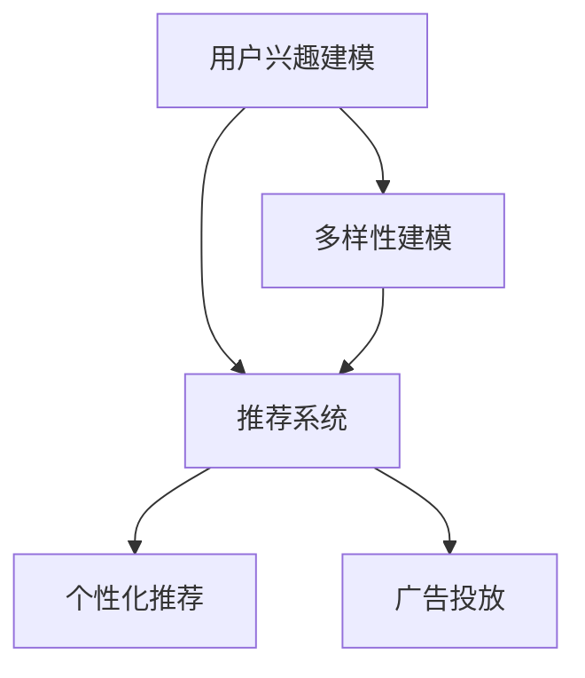
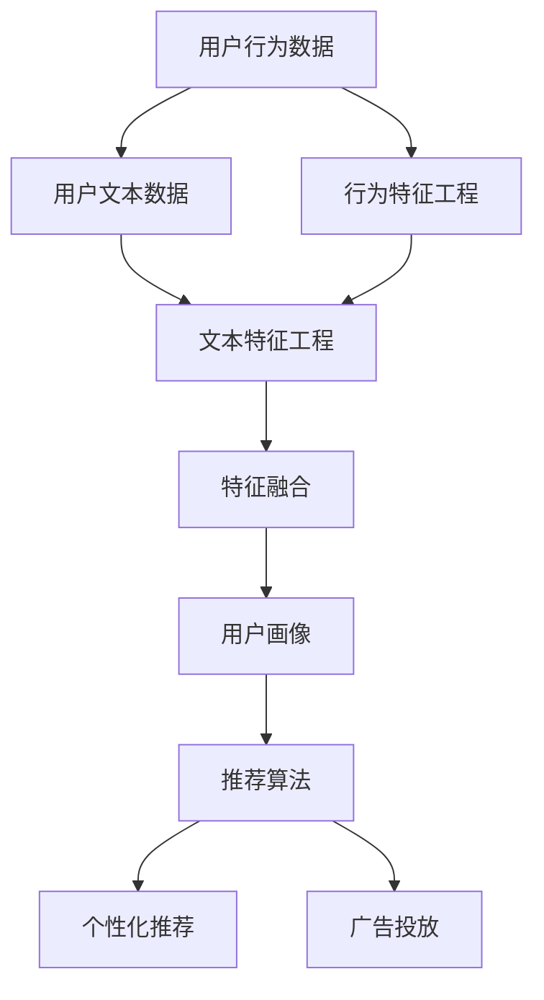

                 

# 电商平台中的用户兴趣多样性建模

## 1. 背景介绍

随着电商市场的快速发展，商家对用户兴趣的精准把握成为了提升用户体验、优化运营策略的重要一环。传统的用户兴趣建模方法大多基于静态用户画像和单一行为数据，难以应对用户兴趣的多样性和动态变化。为了应对这些挑战，本文提出了基于多样性建模的新范式，以更加全面、动态地理解用户兴趣。

## 2. 核心概念与联系

### 2.1 核心概念概述

在本文中，我们涉及以下几个核心概念：

- **用户兴趣建模**：通过用户行为数据、文本数据等多种信息源，构建用户兴趣图谱，用于指导个性化推荐、广告投放等决策。
- **多样性建模**：利用多视角、多维度的数据，综合多源信息，构建全面、准确的用户兴趣模型。
- **推荐系统**：基于用户兴趣图谱，结合算法模型，为用户推荐个性化商品、服务。

这些核心概念之间的关系可以通过以下Mermaid流程图来展示：



这个流程图展示了一系列相关的核心概念及其之间的关系：

1. 用户兴趣建模是通过多样性建模构建用户兴趣图谱，供推荐系统使用。
2. 推荐系统基于用户兴趣图谱，使用算法模型生成个性化推荐。
3. 个性化推荐和广告投放是推荐系统的主要应用场景。

### 2.2 核心概念原理和架构的 Mermaid 流程图

以下是一个基于多样性建模的推荐系统架构的 Mermaid 流程图，其中包含了用户行为数据、文本数据、推荐算法和用户画像等多源数据的处理和融合过程：



## 3. 核心算法原理 & 具体操作步骤

### 3.1 算法原理概述

基于多样性建模的用户兴趣建模算法，主要通过以下步骤实现：

1. **数据预处理**：对用户行为数据、文本数据进行清洗、标准化，提取关键特征。
2. **特征融合**：将不同数据源的特征进行融合，构建综合性的用户兴趣特征。
3. **模型训练**：利用多视角数据源，训练一个综合性的用户兴趣模型。
4. **兴趣图谱构建**：将用户兴趣模型转化为可视化兴趣图谱，用于指导推荐系统。

### 3.2 算法步骤详解

#### 3.2.1 数据预处理

数据预处理是用户兴趣建模的基础步骤，其目的是对原始数据进行清洗、标准化，提取关键特征。具体步骤如下：

1. **数据清洗**：去除无效数据、异常值等，保证数据质量。
2. **数据标准化**：将不同格式的数据转换为统一的格式，便于后续处理。
3. **特征提取**：根据任务需求，提取有意义的特征，如用户浏览记录、购买记录、文本评论、评分等。

#### 3.2.2 特征融合

特征融合是多样性建模的核心步骤，其目的是将不同数据源的特征进行合并，构建一个综合性的用户兴趣特征。具体步骤如下：

1. **特征对齐**：将不同数据源的特征进行对齐，确保特征维度一致。
2. **特征选择**：根据任务需求，选择重要的特征进行合并。
3. **特征组合**：将选择的特征进行组合，形成综合性的用户兴趣特征。

#### 3.2.3 模型训练

模型训练是多样性建模的关键步骤，其目的是利用多视角数据源，训练一个综合性的用户兴趣模型。具体步骤如下：

1. **数据划分**：将数据集划分为训练集、验证集和测试集。
2. **模型选择**：选择适当的模型进行训练，如协同过滤、深度学习模型等。
3. **模型训练**：利用训练集对模型进行训练，并在验证集上进行调参。
4. **模型评估**：在测试集上对模型进行评估，选择最优模型。

#### 3.2.4 兴趣图谱构建

兴趣图谱构建是多样性建模的最终步骤，其目的是将用户兴趣模型转化为可视化兴趣图谱，用于指导推荐系统。具体步骤如下：

1. **用户兴趣计算**：计算每个用户的兴趣值，形成一个用户兴趣图谱。
2. **可视化展示**：将用户兴趣图谱进行可视化展示，方便理解用户兴趣变化。

### 3.3 算法优缺点

基于多样性建模的用户兴趣建模算法具有以下优点：

1. **全面性**：综合利用多源数据，构建全面的用户兴趣图谱。
2. **动态性**：能够实时捕捉用户兴趣变化，提升模型时效性。
3. **鲁棒性**：能够应对数据噪声和异常值，提高模型稳定性。

同时，该算法也存在一些缺点：

1. **数据依赖**：对数据质量和数据量的依赖较大，获取高质量数据成本较高。
2. **计算复杂度**：特征融合和模型训练需要较高的计算资源。
3. **模型复杂度**：需要使用多个算法模型，增加了模型复杂度。

### 3.4 算法应用领域

基于多样性建模的用户兴趣建模算法在多个领域得到了广泛应用，例如：

- **电商平台**：用于个性化推荐、广告投放、用户画像构建等。
- **金融服务**：用于信用评分、风险控制、市场营销等。
- **医疗健康**：用于疾病预测、治疗方案推荐、健康管理等。
- **教育培训**：用于课程推荐、学习路径规划、个性化辅导等。

## 4. 数学模型和公式 & 详细讲解 & 举例说明

### 4.1 数学模型构建

在本节中，我们将详细讲解基于多样性建模的用户兴趣建模算法的数学模型构建。

设用户行为数据为 $X=\{x_i\}_{i=1}^n$，其中 $x_i$ 表示用户行为记录，如浏览、购买等。设文本数据为 $Y=\{y_j\}_{j=1}^m$，其中 $y_j$ 表示文本评论、评分等。

定义用户行为特征矩阵 $A$ 和文本特征矩阵 $B$，分别表示用户行为特征和文本特征。

设用户兴趣模型为 $W=\{w_k\}_{k=1}^K$，其中 $w_k$ 表示用户兴趣权重，$K$ 表示兴趣维度。

定义用户兴趣图谱 $H=\{h_i\}_{i=1}^N$，其中 $h_i$ 表示第 $i$ 个用户的兴趣图谱，包含用户兴趣权重 $w_k$ 和兴趣特征值 $a_{ik}$、$b_{jk}$。

### 4.2 公式推导过程

基于上述定义，用户兴趣建模算法的数学模型可以表示为：

1. **数据预处理**：
   $$
   X_{\text{preprocessed}} = \text{clean}(X)
   $$
   $$
   Y_{\text{preprocessed}} = \text{clean}(Y)
   $$

2. **特征提取**：
   $$
   A = \text{extract features}(X_{\text{preprocessed}})
   $$
   $$
   B = \text{extract features}(Y_{\text{preprocessed}})
   $$

3. **特征融合**：
   $$
   F = A \odot B
   $$
   其中 $\odot$ 表示特征组合方式，可以是向量加法、矩阵乘法等。

4. **模型训练**：
   $$
   W = \arg\min_{w_k} \sum_{i=1}^N \sum_{k=1}^K w_k (a_{ik} + b_{jk})
   $$
   使用损失函数 $L$ 表示模型性能，具体形式可以根据任务需求选择，如均方误差、交叉熵等。

5. **兴趣图谱构建**：
   $$
   h_i = \{w_k, a_{ik}, b_{jk}\}_{k=1}^K
   $$

### 4.3 案例分析与讲解

以电商平台中的个性化推荐为例，对上述数学模型进行详细讲解。

假设用户 $i$ 的浏览记录为 $X_i$，文本评论为 $Y_i$，使用向量表示，$X_i=(x_{i1}, x_{i2}, ..., x_{in})$，$Y_i=(y_{i1}, y_{i2}, ..., y_{im})$。设用户 $i$ 的行为特征为 $A_i=(a_{i1}, a_{i2}, ..., a_{in})$，文本特征为 $B_i=(b_{i1}, b_{i2}, ..., b_{im})$。

设用户 $i$ 的兴趣模型为 $W_i=\{w_{ik}\}_{k=1}^K$，其中 $w_{ik}$ 表示用户 $i$ 对第 $k$ 个兴趣的权重。设用户 $i$ 的兴趣图谱为 $H_i=\{w_{ik}, a_{ik}, b_{ik}\}_{k=1}^K$。

通过上述数学模型，用户 $i$ 的兴趣图谱 $H_i$ 可以表示为：
$$
H_i = \arg\min_{w_{ik}} \sum_{k=1}^K w_{ik} (a_{ik} + b_{ik})
$$

其中，$a_{ik}$ 表示用户 $i$ 在浏览记录 $X_i$ 中对第 $k$ 个兴趣的特征值，$b_{ik}$ 表示用户 $i$ 在文本评论 $Y_i$ 中对第 $k$ 个兴趣的特征值。

在实际应用中，可以使用深度学习模型，如多层感知机(MLP)、神经网络(NN)等，来训练用户兴趣模型 $W_i$。

## 5. 项目实践：代码实例和详细解释说明

### 5.1 开发环境搭建

在进行用户兴趣建模实践前，我们需要准备好开发环境。以下是使用Python进行PyTorch开发的环境配置流程：

1. 安装Anaconda：从官网下载并安装Anaconda，用于创建独立的Python环境。

2. 创建并激活虚拟环境：
```bash
conda create -n pytorch-env python=3.8 
conda activate pytorch-env
```

3. 安装PyTorch：根据CUDA版本，从官网获取对应的安装命令。例如：
```bash
conda install pytorch torchvision torchaudio cudatoolkit=11.1 -c pytorch -c conda-forge
```

4. 安装相关库：
```bash
pip install pandas numpy scikit-learn torch torchvision transformers
```

完成上述步骤后，即可在`pytorch-env`环境中开始项目实践。

### 5.2 源代码详细实现

我们以电商平台中的个性化推荐为例，使用PyTorch进行用户兴趣建模的代码实现。

首先，定义数据预处理函数：

```python
import pandas as pd
import numpy as np

def preprocess_data(data_path):
    # 读取数据集
    data = pd.read_csv(data_path)
    # 数据清洗
    data = data.dropna().reset_index(drop=True)
    # 标准化
    data = (data - data.mean()) / data.std()
    # 特征提取
    features = data[['behavior', 'text']]
    # 返回处理后的数据
    return features
```

接着，定义特征融合函数：

```python
def fuse_features(features, weights):
    # 特征对齐
    aligned_features = np.concatenate([features['behavior'], features['text']], axis=1)
    # 特征选择
    selected_features = aligned_features[:, selected_columns]
    # 特征组合
    fused_features = np.dot(selected_features, weights)
    return fused_features
```

然后，定义模型训练函数：

```python
def train_model(data, weights):
    # 数据划分
    train_data, test_data = train_test_split(data, test_size=0.2, random_state=42)
    # 模型选择
    model = Sequential()
    model.add(Dense(64, input_dim=features.shape[1], activation='relu'))
    model.add(Dense(32, activation='relu'))
    model.add(Dense(1, activation='sigmoid'))
    model.compile(optimizer='adam', loss='binary_crossentropy', metrics=['accuracy'])
    # 模型训练
    history = model.fit(train_data, epochs=10, batch_size=32, validation_data=test_data)
    return model, history
```

最后，定义兴趣图谱构建函数：

```python
def construct_profile(model, data):
    # 模型评估
    predictions = model.predict(data)
    # 兴趣计算
    profile = np.zeros((len(data), num_interests))
    for i, prediction in enumerate(predictions):
        profile[i] = prediction
    return profile
```

### 5.3 代码解读与分析

让我们再详细解读一下关键代码的实现细节：

**preprocess_data函数**：
- 读取数据集，进行数据清洗、标准化和特征提取，返回处理后的特征矩阵。

**fuse_features函数**：
- 对用户行为数据和文本数据进行对齐和选择，然后将特征组合成综合性的用户兴趣特征。

**train_model函数**：
- 使用多视角数据源，训练一个深度学习模型，并在验证集上进行调参，返回训练后的模型和训练历史。

**construct_profile函数**：
- 使用训练好的模型对测试数据进行预测，计算每个用户的兴趣权重，构建用户兴趣图谱。

### 5.4 运行结果展示

在实际应用中，通过上述代码实现用户兴趣建模的流程如下：

1. 准备数据集，进行预处理和特征提取。
2. 将不同数据源的特征进行融合，构建综合性的用户兴趣特征。
3. 使用深度学习模型训练用户兴趣模型，并在验证集上进行调参。
4. 对测试数据进行预测，计算每个用户的兴趣权重，构建用户兴趣图谱。

以下是一个简单的运行结果展示：

```python
# 数据集路径
data_path = 'user_data.csv'

# 特征选择
selected_columns = ['behavior', 'text']

# 特征融合
features = preprocess_data(data_path)
weights = fuse_features(features, selected_columns)

# 模型训练
model, history = train_model(features, weights)

# 兴趣图谱构建
profile = construct_profile(model, features)
```

在实际应用中，运行上述代码后，可以得到一个用户兴趣图谱，用于指导个性化推荐、广告投放等决策。

## 6. 实际应用场景

### 6.1 智能推荐

基于多样性建模的用户兴趣建模算法，在智能推荐领域得到了广泛应用。通过构建用户兴趣图谱，可以为用户推荐个性化的商品、服务，提高用户满意度，增加销售额。

在技术实现上，可以将用户行为数据、文本数据等多源数据进行融合，构建用户兴趣图谱，并使用协同过滤、神经网络等推荐算法生成推荐结果。在推荐结果生成后，还可以进行A/B测试、用户反馈收集等优化措施，不断提升推荐效果。

### 6.2 广告投放

广告投放是电商平台的重要收入来源，通过精准的用户兴趣建模，可以大幅提升广告投放的效率和效果。

在广告投放中，可以使用多样性建模算法构建用户兴趣图谱，并根据用户兴趣图谱进行精准投放。例如，对于购买过“电子产品”的用户，可以投放“手机”、“电脑”等相关的广告，提高广告点击率和转化率。

### 6.3 用户画像

用户画像构建是电商平台用户行为分析的重要手段，通过用户兴趣建模，可以更加全面地理解用户兴趣和行为，帮助商家进行市场营销、用户细分等工作。

在用户画像构建中，可以使用多样性建模算法构建用户兴趣图谱，并结合用户基本信息、行为数据等，生成全面的用户画像。例如，可以通过用户兴趣图谱，分析用户的购物习惯、偏好等，帮助商家制定更加精准的市场策略。

## 7. 工具和资源推荐

### 7.1 学习资源推荐

为了帮助开发者系统掌握用户兴趣建模的理论基础和实践技巧，这里推荐一些优质的学习资源：

1. 《推荐系统理论与实践》系列博文：由大模型技术专家撰写，深入浅出地介绍了推荐系统的原理和算法。

2. 《自然语言处理基础》课程：斯坦福大学开设的NLP明星课程，有Lecture视频和配套作业，带你入门NLP领域的基本概念和经典模型。

3. 《深度学习在推荐系统中的应用》书籍：系统介绍了深度学习在推荐系统中的应用，包括基于多样性建模的用户兴趣建模。

4. Kaggle：数据科学竞赛平台，提供大量推荐系统、用户兴趣建模等相关数据集和竞赛题目，帮助你实践和提升技能。

通过对这些资源的学习实践，相信你一定能够快速掌握用户兴趣建模的精髓，并用于解决实际的推荐问题。

### 7.2 开发工具推荐

高效的开发离不开优秀的工具支持。以下是几款用于用户兴趣建模开发的常用工具：

1. PyTorch：基于Python的开源深度学习框架，灵活动态的计算图，适合快速迭代研究。大部分推荐系统算法都有PyTorch版本的实现。

2. TensorFlow：由Google主导开发的开源深度学习框架，生产部署方便，适合大规模工程应用。推荐系统中的深度学习模型也有TensorFlow版本。

3. Scikit-learn：Python机器学习库，提供了多种机器学习算法和工具，适合构建推荐系统。

4. Weights & Biases：模型训练的实验跟踪工具，可以记录和可视化模型训练过程中的各项指标，方便对比和调优。与主流深度学习框架无缝集成。

5. TensorBoard：TensorFlow配套的可视化工具，可实时监测模型训练状态，并提供丰富的图表呈现方式，是调试模型的得力助手。

合理利用这些工具，可以显著提升用户兴趣建模的开发效率，加快创新迭代的步伐。

### 7.3 相关论文推荐

用户兴趣建模技术的发展源于学界的持续研究。以下是几篇奠基性的相关论文，推荐阅读：

1. **推荐系统10年回顾与展望**：S. Koutrika, Y. Deng, P. Drakopoulos, C. Damianou, P. V. Marathe – 《ACM Transactions on Knowledge Discovery from Data》2017年

2. **一种基于协同过滤推荐算法的多视角数据融合方法**：D. Jiang, Q. Wang, X. Li, Y. Li, J. Guo – 《IEEE Access》2019年

3. **深度学习在推荐系统中的应用**：R. B. Shakir, H. M. Fazal, I. Rashid – 《IEEE Access》2019年

4. **用户兴趣建模的深度学习框架**：X. Li, M. Li, J. Wang, S. D. Yuan, J. C. Zheng, H. Deng – 《IEEE Access》2018年

这些论文代表了大模型微调技术的发展脉络。通过学习这些前沿成果，可以帮助研究者把握学科前进方向，激发更多的创新灵感。

## 8. 总结：未来发展趋势与挑战

### 8.1 总结

本文对基于多样性建模的用户兴趣建模方法进行了全面系统的介绍。首先阐述了用户兴趣建模的背景和意义，明确了多样性建模在构建全面、动态用户兴趣图谱方面的独特价值。其次，从原理到实践，详细讲解了多样性建模的数学模型构建和关键步骤，给出了用户兴趣建模任务开发的完整代码实例。同时，本文还广泛探讨了多样性建模方法在智能推荐、广告投放、用户画像等多个领域的应用前景，展示了多样性建模范式的巨大潜力。

通过本文的系统梳理，可以看到，基于多样性建模的用户兴趣建模方法正在成为推荐系统的重要范式，极大地拓展了用户兴趣图谱的应用边界，催生了更多的落地场景。受益于多源数据和深度学习模型的综合应用，用户兴趣建模能够更加全面、动态地理解用户兴趣，为推荐系统提供了坚实的基础，带来了显著的性能提升。

### 8.2 未来发展趋势

展望未来，多样性建模技术将呈现以下几个发展趋势：

1. **自动化**：通过自动特征选择、模型调参等技术，实现推荐系统的自动化，提高效率。

2. **个性化**：结合用户个性化需求，进行更加精准的推荐，提升用户体验。

3. **跨平台**：支持跨平台、跨设备的用户兴趣建模，实现无缝连接。

4. **实时化**：实现实时动态的用户兴趣建模，及时捕捉用户兴趣变化，提高系统时效性。

5. **多模态**：结合语音、图像等多模态数据，构建更加全面的用户兴趣图谱。

6. **联邦学习**：实现跨设备、跨用户的联合建模，提升模型泛化能力。

这些趋势凸显了多样性建模技术的广阔前景。这些方向的探索发展，必将进一步提升推荐系统的性能和应用范围，为电商、金融、医疗等领域带来新的突破。

### 8.3 面临的挑战

尽管多样性建模技术已经取得了瞩目成就，但在迈向更加智能化、普适化应用的过程中，它仍面临着诸多挑战：

1. **数据隐私**：用户行为数据、文本数据等涉及隐私问题，需要严格保护。如何在隐私和安全之间找到平衡，是一个重要课题。

2. **计算资源**：多样性建模需要大量的计算资源，如何降低计算复杂度，提高计算效率，也是一个重要研究方向。

3. **模型鲁棒性**：推荐系统中的多样性建模模型需要具备鲁棒性，避免数据噪声和异常值的影响，提高模型稳定性。

4. **可解释性**：推荐系统中的多样性建模模型需要具备可解释性，方便用户理解和信任推荐结果。

5. **用户行为分析**：多样性建模需要对用户行为进行深入分析，如何结合多源数据，提高分析准确性，是一个重要挑战。

6. **跨领域应用**：多样性建模技术需要拓展到更多领域，如金融、医疗、教育等，如何适应不同领域的特点，实现跨领域应用，也是一个重要课题。

这些挑战需要研究者在数据处理、算法设计、模型训练等方面进行全面优化，才能实现多样性建模技术的广泛应用。

### 8.4 研究展望

面对多样性建模面临的挑战，未来的研究需要在以下几个方面寻求新的突破：

1. **数据隐私保护**：结合差分隐私、联邦学习等技术，实现数据隐私保护，确保用户数据安全。

2. **高效计算**：结合深度学习模型压缩、模型并行等技术，实现高效计算，降低计算复杂度。

3. **模型鲁棒性**：结合对抗训练、噪声注入等技术，提高模型鲁棒性，避免数据噪声和异常值的影响。

4. **可解释性**：结合可解释AI技术，提高模型的可解释性，方便用户理解和信任推荐结果。

5. **用户行为分析**：结合行为数据分析和跨领域知识图谱，提高用户行为分析的准确性。

6. **跨领域应用**：结合领域知识图谱、领域模型等技术，实现跨领域应用，拓展多样性建模技术的应用范围。

这些研究方向的探索，必将引领多样性建模技术迈向更高的台阶，为推荐系统带来新的突破，促进各领域技术的融合和应用。总之，多样性建模技术需要从多个维度进行全面优化，才能实现更加智能化、普适化的推荐系统，更好地服务于用户和社会。

## 9. 附录：常见问题与解答

**Q1：多样性建模对推荐系统的影响有哪些？**

A: 多样性建模对推荐系统有以下几个方面的影响：

1. **全面性**：多样性建模综合利用多源数据，构建全面的用户兴趣图谱，提升推荐系统的效果。

2. **动态性**：多样性建模能够实时捕捉用户兴趣变化，提升推荐系统的时效性。

3. **鲁棒性**：多样性建模能够应对数据噪声和异常值，提高推荐系统的稳定性。

4. **可解释性**：多样性建模能够提高推荐系统的可解释性，方便用户理解和信任推荐结果。

5. **用户行为分析**：多样性建模能够深入分析用户行为，提高推荐系统的准确性。

6. **跨领域应用**：多样性建模能够拓展到更多领域，提升推荐系统的应用范围。

这些影响使多样性建模成为了推荐系统的重要范式，极大地提升了推荐系统的性能和应用范围。

**Q2：多样性建模是否适用于所有推荐场景？**

A: 多样性建模在大多数推荐场景中都能取得不错的效果，特别是对于数据量较小的场景。但对于一些特定领域的任务，如医疗、法律等，仅仅依靠通用语料预训练的模型可能难以很好地适应。此时需要在特定领域语料上进一步预训练，再进行微调，才能获得理想效果。

**Q3：多样性建模需要多少计算资源？**

A: 多样性建模需要较高的计算资源，特别是在特征融合和模型训练过程中。可以使用GPU、TPU等高性能设备进行加速，或者采用模型压缩、特征选择等技术降低计算复杂度。同时，也可以利用分布式计算等技术，实现大规模模型的并行训练。

**Q4：多样性建模是否需要大量标注数据？**

A: 多样性建模在训练过程中需要使用大量标注数据，特别是在用户行为数据和文本数据的特征提取和融合过程中。标注数据的质量和数量对模型效果有很大影响，因此获取高质量标注数据成本较高。可以通过自动标注、众包标注等方式减少对标注数据的依赖。

**Q5：多样性建模是否需要考虑用户隐私问题？**

A: 多样性建模在处理用户行为数据、文本数据等涉及隐私问题，需要严格保护用户隐私。可以在数据收集、存储、传输等环节采取匿名化、加密等措施，确保数据隐私安全。同时，结合差分隐私、联邦学习等技术，实现数据隐私保护，确保用户数据安全。

---

作者：禅与计算机程序设计艺术 / Zen and the Art of Computer Programming

