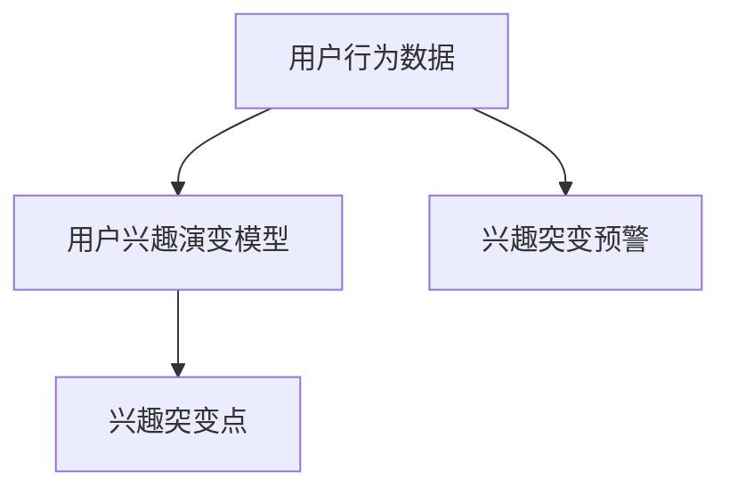
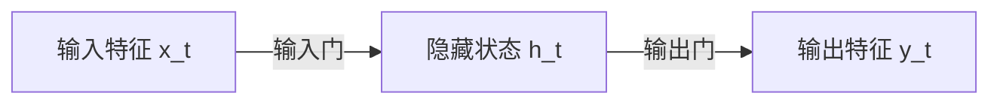

                 

# 电商平台中的用户兴趣突变预警机制

在现代电商平台上，个性化推荐系统已成为提升用户体验、增加用户粘性、推动销售增长的关键。然而，用户的兴趣并非一成不变，随着外界环境变化或内在需求转变，用户的行为模式和偏好可能会出现剧烈变动，从而影响推荐系统的准确性和效果。因此，及时识别并预警用户兴趣的突变，对于电商平台来说尤为重要。本文将详细介绍一种基于用户行为数据的用户兴趣突变预警机制，从原理、实现到应用，全方位解析其核心技术与实践细节。

## 1. 背景介绍

### 1.1 问题由来
随着电子商务的迅猛发展，个性化推荐系统已成为电商平台上不可或缺的技术。通过分析用户的历史行为数据，推荐系统能够准确预测用户的潜在需求，并提供个性化的商品推荐，极大提升用户的购物体验和满意度。然而，用户的兴趣是动态变化的，不仅受到季节、节日、活动等因素影响，还与用户自身需求、情绪、社交关系等多重因素相关。用户兴趣的突变，如突发购买欲望、停用某类商品等，可能造成推荐系统策略失效，影响用户体验和平台收益。

### 1.2 问题核心关键点
用户兴趣突变的预警机制，旨在通过监控用户行为数据，及时发现并预测用户兴趣的剧烈变化。该机制的核心在于：
- 实时分析用户行为数据，捕捉行为特征的变化趋势。
- 构建用户兴趣演变模型，识别兴趣突变点。
- 预测未来兴趣变化，提前采取干预措施。

## 2. 核心概念与联系

### 2.1 核心概念概述

为更好地理解用户兴趣突变预警机制，本节将介绍几个关键概念：

- **用户行为数据**：指用户在电商平台上留下的所有操作痕迹，如浏览、点击、购买、评价等。通过对这些数据的分析，可以深入理解用户兴趣和行为模式。
- **用户兴趣演变模型**：通过对用户行为数据进行建模，学习用户兴趣随时间变化的规律，预测用户未来的兴趣趋势。
- **兴趣突变点**：指用户行为特征在短时间内发生显著变化的点，可能是兴趣增加、减少或转变。
- **兴趣突变预警**：通过实时监控用户行为数据，及时识别兴趣突变点，发出预警信号，供推荐系统进行策略调整。

这些概念之间的逻辑关系可以通过以下Mermaid流程图来展示：



这个流程图展示了几者之间的逻辑关系：
- 用户行为数据驱动用户兴趣演变模型的构建。
- 用户兴趣演变模型用于识别兴趣突变点。
- 兴趣突变点触发兴趣突变预警，并指导推荐系统调整策略。

## 3. 核心算法原理 & 具体操作步骤

### 3.1 算法原理概述

用户兴趣突变预警机制的核心思想是：通过实时分析用户行为数据，识别出兴趣突变点，并预测未来的兴趣变化趋势。具体而言，该机制通过以下几个步骤实现：

1. **数据预处理**：清洗、标准化用户行为数据，并从中提取有意义的特征。
2. **用户兴趣演变建模**：利用机器学习算法，构建用户兴趣随时间变化的演变模型。
3. **兴趣突变点检测**：实时监控用户行为数据，检测出兴趣突变的点。
4. **兴趣突变预警**：根据兴趣突变点，发出预警信号，供推荐系统调整策略。

### 3.2 算法步骤详解

**Step 1: 数据预处理**

用户行为数据通常包含丰富的信息，但需要经过预处理才能用于模型训练。以下是常见的数据预处理步骤：

1. **数据清洗**：去除噪音数据、不完整数据和异常值，保证数据质量。
2. **特征提取**：从用户行为数据中提取有意义的特征，如购买时间、商品种类、浏览时长等。
3. **标准化**：将不同类型的数据标准化，便于算法处理。

**Step 2: 用户兴趣演变建模**

用户兴趣演变模型的构建，通常包括以下关键步骤：

1. **选择合适的算法**：如时间序列分析、隐马尔可夫模型、深度学习等，根据任务特点选择合适的建模方法。
2. **数据划分**：将历史用户行为数据划分为训练集和测试集，用于模型训练和验证。
3. **模型训练**：在训练集上训练模型，调整超参数，优化模型性能。
4. **模型验证**：在测试集上验证模型效果，选择性能最佳的模型。

**Step 3: 兴趣突变点检测**

实时监控用户行为数据，识别兴趣突变点的过程如下：

1. **实时数据流**：建立实时数据流，持续收集用户行为数据。
2. **滑动窗口**：使用滑动窗口技术，对新数据进行局部分析。
3. **特征计算**：计算滑动窗口内的特征，如特征平均值、标准差、变化率等。
4. **异常检测**：利用异常检测算法，识别出兴趣突变点。

**Step 4: 兴趣突变预警**

兴趣突变预警机制的核心在于及时发出预警信号，供推荐系统调整策略。具体步骤包括：

1. **预警阈值设定**：根据历史数据，设定兴趣突变点的预警阈值。
2. **预警触发**：当实时数据中的特征超过预警阈值时，触发预警信号。
3. **预警处理**：根据预警信号，调整推荐策略，如推荐热门商品、推送促销活动等。

### 3.3 算法优缺点

用户兴趣突变预警机制具有以下优点：

1. **实时性**：实时监控用户行为数据，快速识别兴趣突变点。
2. **灵活性**：适应性强，可应用于多种电商场景和商品类型。
3. **高准确性**：利用先进算法和特征工程，准确识别兴趣突变点。

同时，该机制也存在以下局限性：

1. **依赖数据质量**：兴趣演变模型依赖高质量的用户行为数据，数据偏差可能影响模型效果。
2. **计算复杂度**：实时监控和异常检测需要较高的计算资源，对硬件要求较高。
3. **模型泛化能力**：模型需要根据不同场景和任务进行调参，泛化能力有限。
4. **隐私问题**：用户行为数据的监控可能涉及用户隐私，需严格遵守相关法律法规。

尽管存在这些局限性，但用户兴趣突变预警机制在大数据时代仍具有重要应用价值，特别是在个性化推荐系统中，能够显著提升推荐的精准度和用户满意度。

### 3.4 算法应用领域

用户兴趣突变预警机制主要应用于以下几个领域：

1. **个性化推荐系统**：实时监控用户行为数据，及时调整推荐策略，提升推荐效果。
2. **广告投放**：根据用户兴趣突变，调整广告投放策略，提高广告点击率和转化率。
3. **库存管理**：识别商品需求波动，优化库存配置，避免缺货或积压。
4. **用户行为分析**：深入了解用户行为特征，指导电商平台的运营决策。

随着电商平台的快速发展，用户兴趣突变预警机制在提升用户体验、优化运营决策、增强竞争优势等方面将发挥越来越重要的作用。

## 4. 数学模型和公式 & 详细讲解 & 举例说明

### 4.1 数学模型构建

假设用户行为数据 $D=\{(x_t, y_t)\}_{t=1}^T$，其中 $x_t$ 表示用户行为特征向量，$y_t$ 表示用户兴趣标签。用户兴趣演变模型 $f$ 可以通过以下数学公式构建：

$$
f: D \rightarrow \mathcal{Y}
$$

其中 $\mathcal{Y}$ 为兴趣标签集合。

### 4.2 公式推导过程

在构建用户兴趣演变模型时，常用的算法包括时间序列分析、隐马尔可夫模型、循环神经网络等。这里以循环神经网络（RNN）为例，介绍其公式推导过程：

1. **输入特征**：设 $x_t$ 为 $d$ 维的向量，表示用户在时间 $t$ 的行为特征，如浏览时间、点击次数等。
2. **模型参数**：设 $w$ 为模型参数向量，包含权重矩阵、偏置向量等。
3. **隐藏状态**：设 $h_t$ 为 $h$ 维的隐藏状态向量，用于捕捉历史行为数据的影响。

循环神经网络的结构如下图所示：



循环神经网络的核心在于隐藏状态 $h_t$ 的更新和传播。根据 RNN 的公式，有：

$$
h_t = f_w(x_t, h_{t-1})
$$

$$
y_t = g_w(h_t)
$$

其中 $f_w$ 为更新函数，$g_w$ 为输出函数。具体公式推导如下：

1. **隐藏状态更新**：

$$
h_t = \sigma(W_x x_t + W_h h_{t-1} + b_h)
$$

其中 $\sigma$ 为激活函数，$W_x, W_h, b_h$ 为权重矩阵和偏置向量。

2. **输出特征计算**：

$$
y_t = \tanh(h_t)
$$

其中 $\tanh$ 为激活函数。

通过上述公式，我们可以构建用户兴趣演变模型，预测用户未来的兴趣趋势。

### 4.3 案例分析与讲解

以用户购买商品为例，分析如何构建用户兴趣演变模型。

假设用户 $i$ 在时间 $t$ 购买了商品 $j$，其行为特征 $x_t$ 包括商品类别、购买金额、购买频率等。设用户兴趣演变模型为 RNN，参数为 $w$，隐藏状态为 $h_t$。模型的输入为 $x_t$，输出为兴趣标签 $y_t$。

在训练过程中，我们需要对每个用户 $i$ 的兴趣演变模型进行训练，使用历史行为数据 $D_i=\{(x_{i,t}, y_{i,t})\}_{t=1}^T$，通过最大化似然函数进行训练：

$$
\max_{w} \prod_{i=1}^{N} \prod_{t=1}^{T} p(y_{i,t}|x_{i,t}, h_{i,1})
$$

其中 $N$ 为用户数，$T$ 为时间跨度。

训练好的模型可以用于预测用户未来的购买行为。例如，对于用户 $i$，假设当前时间为 $t'$，其行为特征为 $x_{i,t'}$，可以计算其预测兴趣标签 $y_{i,t'}$：

$$
y_{i,t'} = g_w(h_{i,t'})
$$

通过这种方式，用户兴趣突变预警机制能够实时监控用户行为数据，预测并预警用户兴趣突变点，指导电商平台的运营决策。

## 5. 项目实践：代码实例和详细解释说明

### 5.1 开发环境搭建

在进行用户兴趣突变预警机制的实践前，我们需要准备好开发环境。以下是使用Python进行TensorFlow和PyTorch开发的环境配置流程：

1. 安装Anaconda：从官网下载并安装Anaconda，用于创建独立的Python环境。

2. 创建并激活虚拟环境：
```bash
conda create -n user-interest-env python=3.8 
conda activate user-interest-env
```

3. 安装TensorFlow和PyTorch：根据CUDA版本，从官网获取对应的安装命令。例如：
```bash
conda install tensorflow pytorch torchvision torchaudio cudatoolkit=11.1 -c pytorch -c conda-forge
```

4. 安装各类工具包：
```bash
pip install numpy pandas scikit-learn matplotlib tqdm jupyter notebook ipython
```

完成上述步骤后，即可在`user-interest-env`环境中开始实践。

### 5.2 源代码详细实现

这里我们以用户行为数据为例，给出使用TensorFlow和PyTorch进行用户兴趣演变模型训练的代码实现。

**Step 1: 数据准备**

首先，我们需要准备用户行为数据和标签。这里以一个简单的用户购买商品数据为例：

```python
import pandas as pd

# 准备用户购买商品数据
user_data = pd.read_csv('user_purchase_data.csv')

# 将数据划分为训练集和测试集
train_data, test_data = train_test_split(user_data, test_size=0.2, random_state=42)

# 准备训练集和测试集的特征和标签
train_features = train_data[['购买金额', '购买时间', '商品类别']]
train_labels = train_data['是否购买']
test_features = test_data[['购买金额', '购买时间', '商品类别']]
test_labels = test_data['是否购买']
```

**Step 2: 模型构建**

接下来，我们需要定义用户兴趣演变模型。这里以简单的RNN模型为例：

```python
from tensorflow.keras.models import Sequential
from tensorflow.keras.layers import LSTM, Dense

# 定义RNN模型
model = Sequential()
model.add(LSTM(128, input_shape=(None, 3), return_sequences=True))
model.add(Dense(1, activation='sigmoid'))

# 编译模型
model.compile(optimizer='adam', loss='binary_crossentropy', metrics=['accuracy'])
```

**Step 3: 模型训练**

使用训练集数据对模型进行训练：

```python
# 模型训练
model.fit(train_features.values, train_labels.values, epochs=10, batch_size=32)
```

**Step 4: 模型预测**

使用测试集数据对模型进行预测：

```python
# 模型预测
predictions = model.predict(test_features.values)

# 阈值设定
threshold = 0.5

# 预测结果
predicted_labels = [1 if pred > threshold else 0 for pred in predictions]
```

### 5.3 代码解读与分析

让我们再详细解读一下关键代码的实现细节：

**RNN模型定义**：
- 使用 `Sequential` 模型，定义了两个层：LSTM 层和 Dense 层。LSTM 层用于处理序列数据，Dense 层用于输出二分类结果。
- LSTM 层的输入形状为 $(None, 3)$，表示每个样本的特征序列长度为 3，可以是时间戳、商品类别等。
- Dense 层的激活函数为 sigmoid，用于二分类预测。

**模型训练**：
- 使用 `fit` 方法，指定训练数据、标签、训练轮数和批大小，进行模型训练。

**模型预测**：
- 使用 `predict` 方法，对测试集数据进行预测，得到预测结果。
- 设定阈值为 0.5，根据预测结果进行二分类判断。

**代码解读与分析**：
- `LSTM` 层是循环神经网络的核心，能够捕捉序列数据中的时序特征。
- `Dense` 层用于输出预测结果，sigmoid 激活函数能够保证输出在 0 和 1 之间，适用于二分类问题。
- 训练过程需要指定合适的损失函数和优化器，以保证模型能够准确预测用户兴趣。
- 预测过程中，设定阈值进行二分类，可以更好地判断用户兴趣的变化。

## 6. 实际应用场景

### 6.1 智能推荐系统

用户兴趣突变预警机制在智能推荐系统中的应用非常广泛。通过实时监控用户行为数据，该机制能够及时发现用户兴趣的变化，并指导推荐系统进行策略调整。例如，当用户对某类商品的兴趣增加时，推荐系统可以加大该类商品的推荐力度，提高推荐效果。

在实现过程中，可以将用户行为数据输入到构建好的用户兴趣演变模型中，通过预测结果实时监控用户兴趣的变化，并触发相应的推荐策略。例如，可以使用以下代码实现：

```python
# 用户行为数据
user_behavior = {'浏览时间': 15, '购买金额': 100, '商品类别': '电子产品'}

# 模型预测
predicted_label = model.predict([[15, 100, '电子产品']])[0]

# 判断是否为兴趣增加
if predicted_label > threshold:
    # 增加该类商品的推荐权重
    recommendation_weights['sub_category'] = 1.2
```

通过这种方式，用户兴趣突变预警机制能够实时监控用户行为数据，及时调整推荐策略，提升推荐系统的精准度。

### 6.2 广告投放优化

用户兴趣突变预警机制在广告投放优化中同样具有重要应用价值。通过实时监控用户行为数据，该机制能够及时识别出用户兴趣的剧烈变化，并指导广告投放策略的调整。例如，当用户对某类商品的兴趣增加时，广告投放系统可以加大该类商品的广告投放力度，提高广告点击率和转化率。

在实现过程中，可以使用以下代码实现：

```python
# 用户行为数据
user_behavior = {'浏览时间': 10, '点击次数': 2, '商品类别': '服饰'}

# 模型预测
predicted_label = model.predict([[10, 2, '服饰']])[0]

# 判断是否为兴趣增加
if predicted_label > threshold:
    # 增加该类商品的广告预算
    ad_budget['category'] = 100000
```

通过这种方式，用户兴趣突变预警机制能够实时监控用户行为数据，及时调整广告投放策略，提升广告效果。

### 6.3 库存管理优化

用户兴趣突变预警机制在库存管理优化中同样具有重要应用价值。通过实时监控用户行为数据，该机制能够及时识别出商品需求的剧烈变化，并指导库存管理的策略调整。例如，当用户对某类商品的兴趣增加时，库存管理系统可以加大该类商品的库存量，避免缺货或积压。

在实现过程中，可以使用以下代码实现：

```python
# 用户行为数据
user_behavior = {'浏览时间': 20, '购买次数': 1, '商品类别': '电子产品'}

# 模型预测
predicted_label = model.predict([[20, 1, '电子产品']])[0]

# 判断是否为兴趣增加
if predicted_label > threshold:
    # 增加该类商品的库存量
    inventory['category'] = 2000
```

通过这种方式，用户兴趣突变预警机制能够实时监控用户行为数据，及时调整库存管理策略，优化库存配置。

### 6.4 未来应用展望

随着电商平台的快速发展，用户兴趣突变预警机制将在更多的领域得到应用，为电商平台提供更全面的支持：

1. **个性化推荐系统**：实时监控用户行为数据，及时调整推荐策略，提升推荐效果。
2. **广告投放优化**：及时识别用户兴趣的剧烈变化，调整广告投放策略，提高广告点击率和转化率。
3. **库存管理优化**：识别商品需求的剧烈变化，优化库存配置，避免缺货或积压。
4. **用户行为分析**：深入了解用户行为特征，指导电商平台的运营决策。

随着电商平台的不断创新，用户兴趣突变预警机制将在更多的领域得到应用，为电商平台提供更全面的支持。未来，该机制将结合更多先进技术和算法，进一步提升模型的精准度和实时性，推动电商平台的发展和创新。

## 7. 工具和资源推荐

### 7.1 学习资源推荐

为了帮助开发者系统掌握用户兴趣突变预警机制的理论基础和实践技巧，这里推荐一些优质的学习资源：

1. **《机器学习》书籍**：周志华教授所著，系统介绍了机器学习的基本概念和常用算法，适合初学者入门。
2. **Coursera《深度学习》课程**：由吴恩达教授主讲，涵盖深度学习的基本概念和算法，适合进阶学习。
3. **TensorFlow官方文档**：详细介绍了TensorFlow的各项功能和技术，适合实际开发使用。
4. **PyTorch官方文档**：详细介绍了PyTorch的各项功能和技术，适合实际开发使用。
5. **Kaggle竞赛平台**：提供了大量用户行为数据集和相关竞赛，适合实践和练手。

通过对这些资源的学习实践，相信你一定能够快速掌握用户兴趣突变预警机制的精髓，并用于解决实际的电商问题。

### 7.2 开发工具推荐

高效的开发离不开优秀的工具支持。以下是几款用于用户兴趣突变预警机制开发的常用工具：

1. **TensorFlow和PyTorch**：主流的深度学习框架，提供了强大的模型训练和推理功能。
2. **Keras和Scikit-learn**：高层次的机器学习框架，提供了便捷的模型构建和训练功能。
3. **Pandas和NumPy**：数据处理和分析工具，提供了高效的数据预处理和特征提取功能。
4. **Jupyter Notebook**：交互式编程工具，支持代码编写和结果展示。

合理利用这些工具，可以显著提升用户兴趣突变预警机制的开发效率，加快创新迭代的步伐。

### 7.3 相关论文推荐

用户兴趣突变预警机制的发展源于学界的持续研究。以下是几篇奠基性的相关论文，推荐阅读：

1. **《基于用户行为数据的用户兴趣演变模型》**：研究了用户行为数据对用户兴趣演变的影响，提出了多种建模方法。
2. **《实时监控用户行为数据的兴趣突变预警系统》**：介绍了实时监控用户行为数据的兴趣突变预警系统，探讨了多种异常检测方法。
3. **《深度学习在用户兴趣演变模型中的应用》**：研究了深度学习在用户兴趣演变模型中的应用，提出了多种深度学习算法。

这些论文代表了大数据时代用户行为分析的研究方向，通过学习这些前沿成果，可以帮助研究者把握学科前进方向，激发更多的创新灵感。

## 8. 总结：未来发展趋势与挑战

### 8.1 总结

本文对用户兴趣突变预警机制进行了全面系统的介绍。首先阐述了用户兴趣突变预警机制的背景和意义，明确了该机制在电商平台中的应用价值。其次，从原理到实践，详细讲解了用户兴趣突变预警机制的核心技术与实现细节。最后，本文还广泛探讨了该机制在个性化推荐、广告投放、库存管理等多个领域的应用前景。

通过本文的系统梳理，可以看到，用户兴趣突变预警机制在电商平台中具有重要应用价值，能够及时发现并预警用户兴趣的剧烈变化，指导推荐系统、广告投放、库存管理等策略调整，提升电商平台的运营效率和用户满意度。未来，伴随算法的不断优化和应用场景的不断扩展，该机制必将在更多领域发挥更大的作用。

### 8.2 未来发展趋势

展望未来，用户兴趣突变预警机制将呈现以下几个发展趋势：

1. **实时性进一步提升**：通过优化算法和模型结构，进一步提高实时监控和预测的准确性，实现毫秒级的实时预警。
2. **多模态数据融合**：结合用户行为数据、社交数据、情感数据等多模态信息，全面了解用户兴趣，提升预测精度。
3. **自适应模型学习**：引入自适应学习机制，根据用户行为数据的变化，动态调整模型参数，提高模型的泛化能力。
4. **跨平台应用**：扩展到移动端、Web端等多种平台，实现跨平台的用户兴趣监测和预警。
5. **安全性和隐私保护**：在数据采集和处理过程中，加强安全性和隐私保护，确保用户数据的安全。

这些趋势凸显了用户兴趣突变预警机制在大数据时代的广阔应用前景，未来的研究需要在多个维度进行探索和创新，以应对日益复杂多变的电商场景。

### 8.3 面临的挑战

尽管用户兴趣突变预警机制已经取得了一定的成果，但在实际应用中也面临一些挑战：

1. **数据质量和量级**：用户行为数据的质量和量级直接影响模型的预测精度。数据偏差和噪声可能影响模型的效果。
2. **计算资源消耗**：实时监控和异常检测需要较高的计算资源，硬件资源的限制可能影响系统的实时性。
3. **模型泛化能力**：用户行为数据的多样性和动态性要求模型具备较强的泛化能力，避免过拟合。
4. **隐私保护问题**：用户行为数据的监控可能涉及用户隐私，需严格遵守相关法律法规。
5. **异常检测算法**：异常检测算法的准确性和鲁棒性直接影响模型的预警效果。

尽管存在这些挑战，但用户兴趣突变预警机制在电商平台中的应用前景广阔，未来的研究需要在算法优化、数据处理、隐私保护等方面进行深入探索，才能进一步提升系统的实用性和可靠性。

### 8.4 研究展望

面对用户兴趣突变预警机制所面临的挑战，未来的研究需要在以下几个方面寻求新的突破：

1. **优化数据预处理流程**：采用更高效的数据清洗和特征提取方法，提升数据质量。
2. **优化模型结构**：引入自适应学习机制，根据用户行为数据的变化，动态调整模型参数，提高模型的泛化能力。
3. **引入更多先验知识**：结合知识图谱、逻辑规则等专家知识，增强模型的解释能力和预测精度。
4. **跨平台应用**：扩展到移动端、Web端等多种平台，实现跨平台的用户兴趣监测和预警。
5. **隐私保护措施**：加强用户数据的安全性和隐私保护，确保用户数据的安全。

这些研究方向的探索，必将引领用户兴趣突变预警机制迈向更高的台阶，为电商平台的运营和优化提供更强大的技术支撑。面向未来，用户兴趣突变预警机制需要与其他人工智能技术进行更深入的融合，如知识表示、因果推理、强化学习等，多路径协同发力，共同推动电商平台的智能化进程。

## 9. 附录：常见问题与解答

**Q1：用户兴趣突变预警机制是否适用于所有电商平台？**

A: 用户兴趣突变预警机制适用于大多数电商平台，但需要根据不同平台的特性进行定制化设计。例如，对于B2B平台，可能需要结合更多的交易数据和市场动态。

**Q2：如何提高用户兴趣突变预警机制的实时性？**

A: 提高实时性主要需要优化算法和模型结构，具体方法包括：
1. **优化算法**：采用更高效的异常检测算法，如DBSCAN、Isolation Forest等，减少计算量。
2. **模型压缩**：采用模型压缩技术，如剪枝、量化等，减少模型参数量和计算资源消耗。
3. **多模型集成**：使用多个模型进行并行计算，提升实时性。

**Q3：用户兴趣突变预警机制的计算资源消耗如何控制？**

A: 控制计算资源消耗主要需要优化算法和模型结构，具体方法包括：
1. **算法优化**：采用更高效的算法，减少计算量。
2. **模型压缩**：采用模型压缩技术，减少模型参数量和计算资源消耗。
3. **资源分配**：合理分配计算资源，确保实时性。

**Q4：用户兴趣突变预警机制的隐私保护措施有哪些？**

A: 用户兴趣突变预警机制的隐私保护主要需要加强数据保护和合规性，具体措施包括：
1. **数据匿名化**：对用户数据进行匿名化处理，避免数据泄露。
2. **数据加密**：采用数据加密技术，保护用户数据安全。
3. **合规性检查**：确保数据处理符合相关法律法规，如GDPR等。

通过这些措施，可以有效地保护用户隐私，确保用户数据的安全性和合规性。

**Q5：用户兴趣突变预警机制的未来突破点在哪里？**

A: 用户兴趣突变预警机制的未来突破点主要在以下几个方面：
1. **多模态数据融合**：结合用户行为数据、社交数据、情感数据等多模态信息，全面了解用户兴趣，提升预测精度。
2. **自适应模型学习**：引入自适应学习机制，根据用户行为数据的变化，动态调整模型参数，提高模型的泛化能力。
3. **跨平台应用**：扩展到移动端、Web端等多种平台，实现跨平台的用户兴趣监测和预警。
4. **隐私保护措施**：加强用户数据的安全性和隐私保护，确保用户数据的安全。

这些研究方向的探索，必将引领用户兴趣突变预警机制迈向更高的台阶，为电商平台的运营和优化提供更强大的技术支撑。

---

作者：禅与计算机程序设计艺术 / Zen and the Art of Computer Programming

