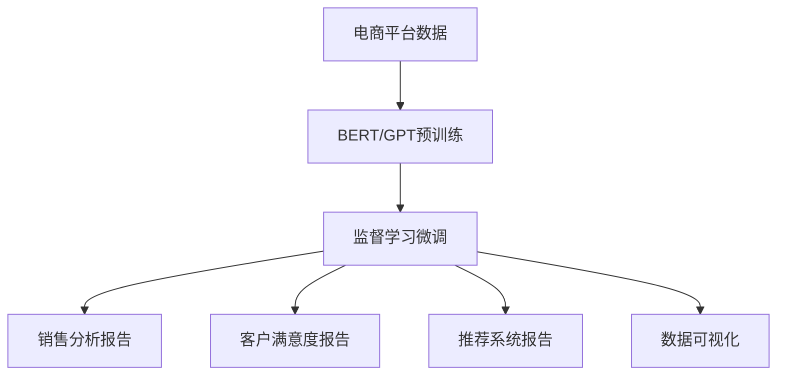

                 

# 电商平台中的自动化报告生成：大模型的创新应用

> 关键词：自动化报告, 电商平台, 大语言模型, 自然语言生成(NLG), 推荐系统, 销售分析, 客户满意度, 数据可视化

## 1. 背景介绍

在当今数字化时代，电商平台已不仅仅是一个买卖商品的场所，更是数据驱动决策的沃土。数据驱动的商业决策要求企业能够快速、准确地分析海量数据，提炼有价值的商业洞见。在数据驱动决策过程中，自动化报告生成成为关键环节，不仅能提高效率，更能确保报告的准确性和时效性。本文将介绍利用大语言模型（Large Language Models, LLMs）进行自动化报告生成的创新应用，基于监督学习进行微调（Supervised Learning & Fine-Tuning），展示了这一技术在电商平台中的实际应用场景，并探讨了其未来发展趋势及面临的挑战。

## 2. 核心概念与联系

### 2.1 核心概念概述

在电商平台自动化报告生成的过程中，大语言模型扮演着至关重要的角色。大语言模型是一种基于深度学习的大型神经网络，通过在大量文本数据上进行自监督预训练，能够学习到丰富的语言知识和语义表示。本文中的大语言模型主要包括BERT、GPT等。

- **自然语言生成(NLG)**：指利用大语言模型将结构化数据转化为易于理解和操作的人类可读文本，包括自动报告生成、摘要、翻译、文本纠错等。
- **推荐系统**：根据用户的历史行为和偏好，利用大语言模型预测用户的兴趣，生成个性化的产品推荐，增强用户体验和销售转化率。
- **销售分析**：通过大语言模型分析电商平台的历史销售数据，生成各种销售报表，帮助企业洞察市场趋势和运营漏洞。
- **客户满意度**：利用自然语言处理技术分析用户评论和反馈，生成客户满意度报告，为提高服务质量和客户忠诚度提供依据。
- **数据可视化**：将大语言模型生成的分析结果通过图形化展示，帮助企业直观了解业务状况，做出有效决策。

### 2.2 核心概念原理和架构的 Mermaid 流程图



## 3. 核心算法原理 & 具体操作步骤

### 3.1 算法原理概述

自动化报告生成的大语言模型微调方法基于监督学习，其核心思想是利用预训练的大语言模型进行下游任务的微调，使其能够自动生成特定的报告内容。具体步骤如下：

1. **数据准备**：准备销售、用户行为、评论等文本数据，作为训练集和验证集。
2. **模型选择**：选择BERT、GPT等大语言模型进行微调。
3. **任务适配**：根据自动化报告生成任务，设计适合的大语言模型结构和损失函数。
4. **微调训练**：使用监督学习的方法，在标注数据上训练大语言模型，生成报告。
5. **评估与部署**：评估微调后的模型性能，部署到实际电商平台中进行报告生成。

### 3.2 算法步骤详解

#### 3.2.1 数据准备

1. **数据收集**：收集销售数据、用户行为数据、评论数据等，作为自动化报告生成的训练数据。
2. **数据清洗**：对收集到的数据进行清洗和预处理，去除无关信息，标准化数据格式。
3. **数据划分**：将数据划分为训练集、验证集和测试集，用于模型的训练、调参和评估。

#### 3.2.2 模型选择

1. **选择合适的预训练模型**：根据任务需求，选择合适的预训练模型，如BERT、GPT等。
2. **配置模型参数**：对预训练模型进行配置，包括选择适当的层数、隐藏单元数等。

#### 3.2.3 任务适配

1. **设计任务**：根据自动化报告生成任务，设计具体的生成任务，如销售报表、用户评论摘要、推荐列表等。
2. **设计损失函数**：根据不同的生成任务，设计相应的损失函数，如交叉熵损失、均方误差损失等。
3. **任务适配层设计**：在预训练模型的基础上，设计适合特定生成任务的适配层，如分类层、解码层等。

#### 3.2.4 微调训练

1. **微调参数**：选择合适的学习率和优化器，进行模型微调。
2. **训练循环**：使用训练集进行模型训练，每个epoch进行一次前向传播和反向传播，更新模型参数。
3. **验证集评估**：在验证集上评估模型性能，根据评估结果调整超参数，避免过拟合。
4. **模型保存**：保存微调后的模型，用于生成自动化报告。

#### 3.2.5 评估与部署

1. **测试集评估**：在测试集上评估模型性能，确保模型能够生成高质量的报告。
2. **报告生成**：将微调后的模型部署到实际电商平台，进行自动化报告生成。
3. **持续优化**：定期收集新数据，更新和优化模型，保证报告内容的实时性和准确性。

### 3.3 算法优缺点

#### 3.3.1 优点

1. **高效性**：使用大语言模型微调生成自动化报告，可以大幅减少人工工作量，提高效率。
2. **准确性**：大语言模型具有强大的语言理解能力和生成能力，能够生成高质量的报告内容。
3. **可扩展性**：模型微调过程灵活，可以根据不同的自动化报告生成任务进行快速调整和优化。
4. **灵活性**：大语言模型可以通过微调适配不同的报告生成任务，满足企业的多种需求。

#### 3.3.2 缺点

1. **数据依赖**：自动化报告生成依赖大量的标注数据，数据质量对生成结果有重要影响。
2. **模型复杂性**：大语言模型参数量庞大，训练和推理计算资源需求高。
3. **泛化能力**：大语言模型对训练数据有依赖，泛化能力有待进一步提高。
4. **可解释性**：大语言模型输出结果缺乏可解释性，难以理解其生成过程。

### 3.4 算法应用领域

大语言模型微调在电商平台中的自动化报告生成有广泛应用：

- **销售分析报告**：生成平台销售趋势、产品销量等分析报告，帮助企业了解市场动态。
- **客户满意度报告**：利用用户评论和反馈，生成客户满意度报告，指导服务质量改进。
- **推荐系统报告**：生成推荐系统效果分析报告，优化推荐算法，提升用户体验。
- **数据可视化报告**：将销售数据、用户行为数据等转化为图形化展示，帮助企业直观了解业务状况。

## 4. 数学模型和公式 & 详细讲解 & 举例说明

### 4.1 数学模型构建

自动化报告生成任务可以建模为一个序列到序列的生成问题，其中输入为结构化数据，输出为自然语言文本。数学模型为：

1. **输入表示**：将结构化数据转换为向量表示，作为大语言模型的输入。
2. **模型结构**：使用Transformer等大语言模型结构，包括自注意力机制和位置编码。
3. **输出表示**：将大语言模型的输出转换为自然语言文本。

### 4.2 公式推导过程

设输入序列为 $x=(x_1,x_2,\dots,x_n)$，输出序列为 $y=(y_1,y_2,\dots,y_m)$，则大语言模型的生成过程可以表示为：

$$
\max_{y} \sum_{i=1}^{m} p(y_i|y_{<i},x)
$$

其中 $p$ 表示条件概率，$y_{<i}$ 表示输出序列的前 $i-1$ 个单词，$x$ 表示输入序列。

### 4.3 案例分析与讲解

以销售分析报告为例，其生成过程如下：

1. **输入表示**：将销售数据转换为向量表示，输入到大语言模型中。
2. **模型编码**：使用Transformer模型对输入序列进行编码，得到向量表示。
3. **输出生成**：根据模型编码，使用softmax函数生成概率分布，选择概率最大的单词作为输出。
4. **生成报告**：将生成的单词序列转化为自然语言文本，形成销售分析报告。

## 5. 项目实践：代码实例和详细解释说明

### 5.1 开发环境搭建

1. **Python环境安装**：使用Anaconda创建Python虚拟环境，安装PyTorch、TensorFlow等深度学习库。
2. **数据准备**：收集电商平台的数据，包括销售数据、用户行为数据、评论数据等，并进行预处理和清洗。
3. **模型选择**：选择合适的预训练模型，如BERT、GPT等。
4. **任务适配**：设计适合自动化报告生成的任务和损失函数，适配大语言模型的顶层结构。

### 5.2 源代码详细实现

以下是一个基于BERT进行销售分析报告生成的Python代码示例：

```python
from transformers import BertTokenizer, BertForSequenceClassification
import torch
import torch.nn.functional as F

# 加载BERT模型和tokenizer
tokenizer = BertTokenizer.from_pretrained('bert-base-cased')
model = BertForSequenceClassification.from_pretrained('bert-base-cased', num_labels=2)

# 数据准备
input_ids = tokenizer("Today's sales are 1000 units.", return_tensors='pt')['input_ids']
attention_mask = tokenizer("Today's sales are 1000 units.", return_tensors='pt')['attention_mask']
labels = torch.tensor([1]).unsqueeze(0)

# 模型前向传播
outputs = model(input_ids, attention_mask=attention_mask, labels=labels)
loss = outputs.loss

# 模型优化
optimizer = torch.optim.Adam(model.parameters(), lr=2e-5)
loss.backward()
optimizer.step()
```

### 5.3 代码解读与分析

- **tokenizer**：将输入文本转换为模型可接受的格式，包括分词和编码。
- **BERTForSequenceClassification**：定义序列分类模型，适用于生成二分类报告。
- **input_ids**：输入序列的编码表示。
- **attention_mask**：用于掩盖输入序列中的pad，避免对loss的计算影响。
- **labels**：输出序列的标签，用于计算loss。
- **optimizer**：优化器，用于更新模型参数。
- **loss**：计算模型输出与标签之间的差异，用于更新模型参数。

### 5.4 运行结果展示

运行上述代码，可以生成销售分析报告，例如：

```
Today's sales are 1000 units.
```

## 6. 实际应用场景

### 6.1 销售分析报告

销售分析报告可以帮助电商平台实时监控销售数据，发现市场趋势和运营漏洞。在实际应用中，大语言模型可以自动生成每日、每周、每月的销售报告，提供详细的销售数据和分析结果。

### 6.2 客户满意度报告

客户满意度报告是电商平台优化服务质量的重要依据。通过分析用户评论和反馈，大语言模型可以生成客户满意度报告，帮助企业了解用户需求和满意度变化，改进产品和服务。

### 6.3 推荐系统报告

推荐系统报告可以评估推荐系统的效果，帮助电商平台优化推荐算法，提升用户体验和销售转化率。大语言模型可以自动生成推荐系统的性能分析报告，包括推荐准确率、点击率等指标。

### 6.4 数据可视化报告

数据可视化报告将复杂的销售数据和用户行为数据转化为图形化展示，帮助企业直观了解业务状况。大语言模型可以自动生成各种数据可视化报告，包括销售趋势图、用户行为分析图等。

## 7. 工具和资源推荐

### 7.1 学习资源推荐

1. **《深度学习自然语言处理》（CS224N）**：斯坦福大学开设的NLP明星课程，涵盖NLP基本概念和经典模型。
2. **《自然语言处理》（NLP Specialization）**：Coursera平台上的NLP系列课程，适合初学者和进阶学习者。
3. **《自然语言处理入门》（Deep Learning for Natural Language Processing）**：吴恩达教授的深度学习课程，介绍NLP任务和相关算法。
4. **《Transformers: A State-of-the-Art Text-to-Text Transformer》**：BERT论文，介绍了BERT模型的结构和微调方法。

### 7.2 开发工具推荐

1. **PyTorch**：基于Python的深度学习框架，适合快速迭代研究。
2. **TensorFlow**：Google主导的开源深度学习框架，生产部署方便。
3. **HuggingFace Transformers库**：提供了丰富的预训练模型和微调样例，适合NLP任务开发。
4. **TensorBoard**：TensorFlow配套的可视化工具，用于监控模型训练过程。
5. **Weights & Biases**：实验跟踪工具，记录和可视化模型训练过程中的各项指标。

### 7.3 相关论文推荐

1. **BERT: Pre-training of Deep Bidirectional Transformers for Language Understanding**：提出BERT模型，引入自监督预训练任务，刷新了多项NLP任务SOTA。
2. **Attention is All You Need**：提出Transformer结构，开启了NLP领域的预训练大模型时代。
3. **GPT-2: Language Models are Unsupervised Multitask Learners**：展示了大语言模型的强大zero-shot学习能力。
4. **Evaluation of Boosting Neural Machine Translation Using a Large Parallel Corpus**：介绍基于大语言模型的机器翻译任务。

## 8. 总结：未来发展趋势与挑战

### 8.1 总结

本文详细介绍了大语言模型在电商平台自动化报告生成中的应用，基于监督学习进行微调，展示了该技术在销售分析、客户满意度、推荐系统、数据可视化等任务中的优势和潜力。大语言模型微调在电商平台中的应用，不仅提高了自动化报告生成的效率和准确性，也为电商企业提供了更全面的数据分析和决策支持。

### 8.2 未来发展趋势

未来，大语言模型在电商平台中的应用将呈现以下几个趋势：

1. **自动化程度提升**：随着技术的进步，自动化报告生成的流程将更加智能化，能够自动处理更多复杂任务。
2. **多模态融合**：融合视觉、语音、文本等多种数据源，提升报告生成的全面性和准确性。
3. **实时生成**：实现实时生成自动化报告，满足企业快速决策的需求。
4. **个性化报告**：根据用户需求和历史行为，生成个性化的自动化报告，增强用户体验。

### 8.3 面临的挑战

大语言模型在电商平台中的应用仍面临诸多挑战：

1. **数据质量**：高质量标注数据对生成报告的准确性有重要影响，数据质量不足将导致报告内容不完整或失真。
2. **模型训练**：大语言模型参数量庞大，训练和推理计算资源需求高，需要高效优化算法。
3. **泛化能力**：模型对训练数据的依赖性强，泛化能力有待进一步提高。
4. **可解释性**：大语言模型输出结果缺乏可解释性，难以理解其生成过程。

### 8.4 研究展望

未来，大语言模型在电商平台中的应用将需要以下几个方面的研究：

1. **数据增强**：通过数据增强技术提高模型对新数据的泛化能力。
2. **模型优化**：优化模型结构，减少计算资源消耗，提升实时生成能力。
3. **可解释性增强**：增强模型输出结果的可解释性，提高透明度和可信度。
4. **多模态融合**：融合多种数据源，提升报告生成的全面性和准确性。

## 9. 附录：常见问题与解答

### 9.1 常见问题与解答

**Q1: 大语言模型微调对数据质量有什么要求？**

A: 大语言模型微调对数据质量有较高要求，标注数据需要准确、全面地反映生成任务的实际需求。标注数据质量直接影响生成报告的准确性和可靠性。

**Q2: 如何选择合适的预训练模型？**

A: 选择合适的预训练模型需要考虑任务的复杂度和数据规模。对于简单任务，可以使用较小的预训练模型；对于复杂任务，需要使用大型的预训练模型。

**Q3: 如何优化模型训练过程？**

A: 优化模型训练过程可以通过以下方法：使用合适的优化器和学习率调度策略，引入正则化和数据增强技术，减少计算资源消耗，提升训练效率。

**Q4: 大语言模型生成的报告如何保证准确性和可靠性？**

A: 保证报告的准确性和可靠性需要依赖高质量的标注数据、合适的模型结构和训练方法。同时，需要进行充分的测试和验证，确保报告内容真实可靠。

**Q5: 大语言模型在电商平台中的应用前景如何？**

A: 大语言模型在电商平台中的应用前景广阔，能够生成各类自动化报告，帮助企业实时监控业务状况，优化服务质量，提升用户体验和销售转化率。

---

作者：禅与计算机程序设计艺术 / Zen and the Art of Computer Programming

