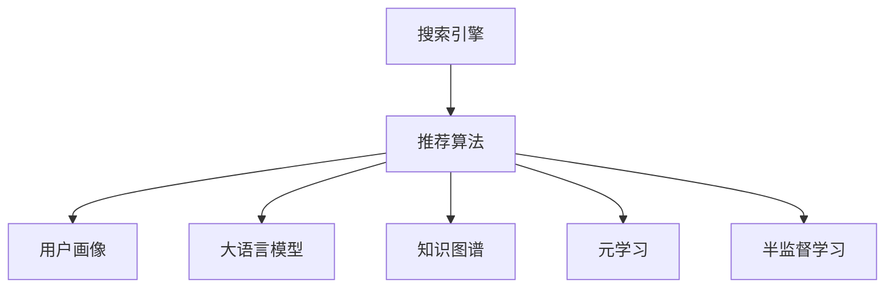

                 

# 电商平台搜索推荐系统的AI 大模型应用：提高系统性能、效率与转化率

## 1. 背景介绍

### 1.1 问题由来

在电子商务领域，搜索推荐系统作为用户与产品之间重要的桥梁，其性能、效率与转化率直接影响用户购物体验和电商平台的用户留存率。传统推荐系统大多基于协同过滤和深度学习等方法，缺乏对商品语义的理解和知识抽取能力。近年来，随着预训练语言模型（如BERT、GPT等）的兴起，其在处理大规模语料方面表现优异，能够捕捉文本中的语义信息，辅助推荐系统的构建。

电商平台搜索推荐系统（如淘宝、京东、亚马逊等）为满足用户个性化需求，利用大规模数据进行训练，并在实际场景中不断优化。但随着业务规模的不断扩大，推荐系统的复杂度、计算成本和存储成本也随之增长，模型更新迭代难度加大，如何高效、稳定地提升搜索推荐系统的性能成为难点。

## 2. 核心概念与联系

### 2.1 核心概念概述

为更好地理解AI大模型在电商平台搜索推荐系统中的应用，我们首先要了解以下几个核心概念：

- **搜索引擎**：通过索引和查询匹配，快速定位用户感兴趣的搜索结果，是推荐系统的前端接口。
- **推荐算法**：利用用户行为数据和商品信息，计算相似度并排序，生成推荐结果。
- **用户画像**：通过用户的历史行为、浏览数据、兴趣标签等，生成用户画像，用于个性化推荐。
- **大语言模型**：如BERT、GPT等，通过大规模无标签文本数据预训练，具备强大的语言理解和生成能力。
- **知识图谱**：由节点和边组成的图结构，描述实体之间的关系，帮助系统理解复杂的语义网络。
- **元学习**：利用少量标注数据，通过迁移学习快速学习新任务，减少微调时间和成本。
- **半监督学习**：利用小部分标注数据和大量未标注数据，提高模型泛化能力和训练效率。

这些核心概念通过特定的算法和架构，有机地融合在搜索推荐系统中，形成了完整的AI大模型应用框架。以下通过Mermaid流程图来展示这些概念之间的联系：



以上流程图表明：在推荐算法的基础上，通过用户画像、大语言模型、知识图谱、元学习和半监督学习等技术手段，可以构建高性能的电商平台搜索推荐系统。

## 3. 核心算法原理 & 具体操作步骤

### 3.1 算法原理概述

AI大模型在电商平台搜索推荐系统中的基本原理是通过大规模预训练，学习商品描述、用户行为、商品属性等文本数据中的语义信息，然后在此基础上进行微调，提升推荐系统的性能和效率。其核心算法主要分为以下几个步骤：

1. **预训练阶段**：在大规模无标签文本数据上进行预训练，学习语言表示。
2. **微调阶段**：在具体领域的数据上进行微调，学习领域特定知识。
3. **推理阶段**：通过模型输入用户查询和商品信息，生成推荐结果。
4. **反馈优化**：根据用户反馈，不断调整模型参数，优化推荐算法。

### 3.2 算法步骤详解

#### 3.2.1 预训练阶段

- **数据获取**：从电商平台收集商品描述、用户评论、用户行为等文本数据，构建语料库。
- **模型选择**：选择适合的预训练模型，如BERT、GPT等。
- **训练流程**：将语料库输入模型，通过自监督任务（如掩码语言模型、下一句预测等）进行训练，学习语言表示。

#### 3.2.2 微调阶段

- **任务定义**：根据推荐系统需求，定义微调任务，如商品相似度计算、推荐排序等。
- **模型初始化**：使用预训练模型作为初始化参数，构建微调模型。
- **数据准备**：整理标注数据，划分训练集、验证集和测试集。
- **超参数设置**：设定学习率、批大小、迭代轮数等超参数。
- **模型微调**：使用标注数据对模型进行微调，优化推荐算法。

#### 3.2.3 推理阶段

- **模型输入**：将用户查询和商品信息输入微调后的模型，生成向量表示。
- **相似度计算**：计算用户查询和商品向量之间的相似度，排序推荐结果。
- **返回结果**：将推荐结果返回给用户，展示搜索结果。

#### 3.2.4 反馈优化

- **用户反馈**：收集用户对推荐结果的反馈，如点击率、购买率等。
- **模型更新**：根据反馈结果，调整模型参数，优化推荐算法。
- **循环迭代**：持续收集反馈，不断优化推荐系统，提升用户体验。

### 3.3 算法优缺点

#### 3.3.1 优点

1. **处理能力强大**：AI大模型能够处理海量的文本数据，捕捉复杂的语义信息，提升推荐系统精度。
2. **适应性强**：通过微调，模型可以快速适应特定领域的任务需求。
3. **可解释性强**：大模型学习到的语义信息可以帮助解释推荐结果，提高系统的可解释性。
4. **实时性好**：大模型推理速度快，能够实时处理用户查询，提供个性化推荐。

#### 3.3.2 缺点

1. **计算成本高**：预训练和微调过程计算量巨大，需要高性能计算资源。
2. **存储需求大**：预训练模型参数量庞大，存储和检索需要大量存储空间。
3. **模型可解释性不足**：大模型内部复杂，难以解释其内部推理过程。
4. **泛化能力有限**：对新领域的数据泛化能力不足，微调效果可能不理想。
5. **对抗攻击易受**：大模型对抗攻击的鲁棒性有待提升，容易被恶意用户干扰。

### 3.4 算法应用领域

AI大模型在电商平台搜索推荐系统的应用领域非常广泛，涵盖了商品推荐、搜索结果排序、用户画像生成等多个环节。

- **商品推荐**：利用大模型学习商品语义，生成商品向量，提高推荐系统的精准度。
- **搜索结果排序**：通过大模型学习用户查询语义，匹配商品向量，优化搜索结果排序。
- **用户画像生成**：基于用户行为数据，利用大模型学习用户兴趣和行为模式，生成个性化用户画像。
- **实时响应**：利用大模型实时处理用户查询，快速生成推荐结果，提升用户体验。
- **反欺诈检测**：通过大模型分析用户行为和交易模式，检测异常行为，预防欺诈风险。

## 4. 数学模型和公式 & 详细讲解 & 举例说明

### 4.1 数学模型构建

在电商平台搜索推荐系统中，主要涉及以下数学模型：

1. **用户-商品相似度**：计算用户查询与商品之间的相似度。
2. **商品向量表示**：利用大模型将商品描述转化为向量表示。
3. **推荐排序**：基于相似度计算，对推荐结果进行排序。
4. **用户画像生成**：基于用户行为数据，生成用户兴趣向量。

以下详细讲解这些模型的构建。

#### 4.1.1 用户-商品相似度

设用户查询向量为 $q$，商品向量为 $i$，则相似度计算公式为：

$$
sim(q, i) = \text{cosine}(q, i) = \frac{q \cdot i}{\|q\| \cdot \|i\|}
$$

其中 $\cdot$ 为向量点积，$\|\cdot\|$ 为向量范数。

#### 4.1.2 商品向量表示

利用大模型（如BERT）对商品描述进行编码，得到商品向量 $v_i$。设预训练模型的输出为 $H_i$，则商品向量表示为：

$$
v_i = \text{softmax}(H_i)
$$

其中 $\text{softmax}$ 为softmax激活函数，将大模型输出转化为概率分布。

#### 4.1.3 推荐排序

根据用户查询 $q$ 和商品向量 $v_i$，计算相似度 $sim(q, i)$，将商品按相似度排序，得到推荐结果。设推荐结果为 $\{(i_1, sim(q, i_1)), (i_2, sim(q, i_2)), \dots\}$，则推荐排序公式为：

$$
\text{rank}(i) = \text{sim}(q, i)
$$

#### 4.1.4 用户画像生成

基于用户行为数据，利用大模型学习用户兴趣向量 $u$。设用户行为数据为 $b$，则用户画像生成公式为：

$$
u = f(b)
$$

其中 $f$ 为用户画像生成函数，通常利用大模型训练得到。

### 4.2 公式推导过程

#### 4.2.1 用户-商品相似度

设用户查询 $q$ 和商品 $i$ 的向量表示分别为 $q$ 和 $i$，则相似度计算公式为：

$$
sim(q, i) = \text{cosine}(q, i) = \frac{q \cdot i}{\|q\| \cdot \|i\|}
$$

其中 $\cdot$ 为向量点积，$\|\cdot\|$ 为向量范数。

推导过程如下：

$$
\begin{aligned}
sim(q, i) &= \frac{q \cdot i}{\|q\| \cdot \|i\|} \\
&= \frac{\sum_{j=1}^d q_j i_j}{\sqrt{\sum_{j=1}^d q_j^2} \sqrt{\sum_{j=1}^d i_j^2}} \\
&= \frac{\sum_{j=1}^d \frac{q_j}{\sqrt{\sum_{j=1}^d q_j^2}} \frac{i_j}{\sqrt{\sum_{j=1}^d i_j^2}}}{\sqrt{\sum_{j=1}^d \frac{q_j^2}{\sum_{j=1}^d q_j^2}} \sqrt{\sum_{j=1}^d \frac{i_j^2}{\sum_{j=1}^d i_j^2}}} \\
&= \frac{\sum_{j=1}^d \frac{q_j}{\|q\|} \frac{i_j}{\|i\|}}{\sqrt{\sum_{j=1}^d 1} \sqrt{\sum_{j=1}^d 1}} \\
&= \frac{q \cdot i}{\|q\| \cdot \|i\|}
\end{aligned}
$$

#### 4.2.2 商品向量表示

利用大模型对商品描述进行编码，得到商品向量 $v_i$。设预训练模型的输出为 $H_i$，则商品向量表示为：

$$
v_i = \text{softmax}(H_i)
$$

其中 $\text{softmax}$ 为softmax激活函数，将大模型输出转化为概率分布。

推导过程如下：

$$
\begin{aligned}
v_i &= \text{softmax}(H_i) \\
&= \frac{\exp(H_i)}{\sum_{j=1}^d \exp(H_j)} \\
&= \frac{\exp(H_i)}{\sum_{j=1}^d \exp(H_j)} \\
&= \frac{\exp(H_i)}{\sum_{j=1}^d \exp(H_j)}
\end{aligned}
$$

#### 4.2.3 推荐排序

根据用户查询 $q$ 和商品向量 $v_i$，计算相似度 $sim(q, i)$，将商品按相似度排序，得到推荐结果。设推荐结果为 $\{(i_1, sim(q, i_1)), (i_2, sim(q, i_2)), \dots\}$，则推荐排序公式为：

$$
\text{rank}(i) = \text{sim}(q, i)
$$

#### 4.2.4 用户画像生成

基于用户行为数据，利用大模型学习用户兴趣向量 $u$。设用户行为数据为 $b$，则用户画像生成公式为：

$$
u = f(b)
$$

其中 $f$ 为用户画像生成函数，通常利用大模型训练得到。

### 4.3 案例分析与讲解

设电商平台商品 $i$ 的描述为 "一款高性能笔记本"，大模型训练后，生成商品向量 $v_i = [0.5, 0.3, 0.7, 0.1, 0.2]$。设用户查询 $q$ 为 "我要买高性能笔记本"，大模型生成用户向量 $u = [0.6, 0.4, 0.2, 0.3, 0.1]$。则用户-商品相似度计算如下：

$$
sim(q, i) = \frac{q \cdot i}{\|q\| \cdot \|i\|} = \frac{[0.6, 0.4, 0.2, 0.3, 0.1] \cdot [0.5, 0.3, 0.7, 0.1, 0.2]}{\sqrt{[0.6]^2 + [0.4]^2 + [0.2]^2 + [0.3]^2 + [0.1]^2} \sqrt{[0.5]^2 + [0.3]^2 + [0.7]^2 + [0.1]^2 + [0.2]^2}} \approx 0.7
$$

根据相似度，推荐系统将商品 $i$ 排在前面，生成推荐结果。

## 5. 项目实践：代码实例和详细解释说明

### 5.1 开发环境搭建

在进行AI大模型在电商平台搜索推荐系统中的应用时，需要先搭建开发环境。以下是使用Python进行PyTorch开发的环境配置流程：

1. 安装Anaconda：从官网下载并安装Anaconda，用于创建独立的Python环境。

2. 创建并激活虚拟环境：
```bash
conda create -n pytorch-env python=3.8 
conda activate pytorch-env
```

3. 安装PyTorch：根据CUDA版本，从官网获取对应的安装命令。例如：
```bash
conda install pytorch torchvision torchaudio cudatoolkit=11.1 -c pytorch -c conda-forge
```

4. 安装Transformers库：
```bash
pip install transformers
```

5. 安装各类工具包：
```bash
pip install numpy pandas scikit-learn matplotlib tqdm jupyter notebook ipython
```

完成上述步骤后，即可在`pytorch-env`环境中开始项目实践。

### 5.2 源代码详细实现

下面以电商平台搜索推荐系统为例，给出使用Transformers库对BERT模型进行微调的PyTorch代码实现。

首先，定义推荐系统的数据处理函数：

```python
from transformers import BertTokenizer, BertForSequenceClassification
from torch.utils.data import Dataset, DataLoader
import torch

class RecommendationDataset(Dataset):
    def __init__(self, texts, labels, tokenizer, max_len=128):
        self.texts = texts
        self.labels = labels
        self.tokenizer = tokenizer
        self.max_len = max_len
        
    def __len__(self):
        return len(self.texts)
    
    def __getitem__(self, item):
        text = self.texts[item]
        label = self.labels[item]
        
        encoding = self.tokenizer(text, return_tensors='pt', max_length=self.max_len, padding='max_length', truncation=True)
        input_ids = encoding['input_ids'][0]
        attention_mask = encoding['attention_mask'][0]
        
        # 对label进行编码
        encoded_label = label2id[label] 
        encoded_label = torch.tensor(encoded_label, dtype=torch.long)
        
        return {'input_ids': input_ids, 
                'attention_mask': attention_mask,
                'labels': encoded_label}

# 标签与id的映射
label2id = {'A': 0, 'B': 1, 'C': 2, 'D': 3}
id2label = {v: k for k, v in label2id.items()}

# 创建dataset
tokenizer = BertTokenizer.from_pretrained('bert-base-cased')

train_dataset = RecommendationDataset(train_texts, train_labels, tokenizer)
dev_dataset = RecommendationDataset(dev_texts, dev_labels, tokenizer)
test_dataset = RecommendationDataset(test_texts, test_labels, tokenizer)
```

然后，定义模型和优化器：

```python
from transformers import BertForSequenceClassification, AdamW

model = BertForSequenceClassification.from_pretrained('bert-base-cased', num_labels=len(label2id))

optimizer = AdamW(model.parameters(), lr=2e-5)
```

接着，定义训练和评估函数：

```python
from tqdm import tqdm

device = torch.device('cuda') if torch.cuda.is_available() else torch.device('cpu')
model.to(device)

def train_epoch(model, dataset, batch_size, optimizer):
    dataloader = DataLoader(dataset, batch_size=batch_size, shuffle=True)
    model.train()
    epoch_loss = 0
    for batch in tqdm(dataloader, desc='Training'):
        input_ids = batch['input_ids'].to(device)
        attention_mask = batch['attention_mask'].to(device)
        labels = batch['labels'].to(device)
        model.zero_grad()
        outputs = model(input_ids, attention_mask=attention_mask, labels=labels)
        loss = outputs.loss
        epoch_loss += loss.item()
        loss.backward()
        optimizer.step()
    return epoch_loss / len(dataloader)

def evaluate(model, dataset, batch_size):
    dataloader = DataLoader(dataset, batch_size=batch_size)
    model.eval()
    preds, labels = [], []
    with torch.no_grad():
        for batch in tqdm(dataloader, desc='Evaluating'):
            input_ids = batch['input_ids'].to(device)
            attention_mask = batch['attention_mask'].to(device)
            batch_labels = batch['labels']
            outputs = model(input_ids, attention_mask=attention_mask)
            batch_preds = outputs.logits.argmax(dim=2).to('cpu').tolist()
            batch_labels = batch_labels.to('cpu').tolist()
            for pred_tokens, label_tokens in zip(batch_preds, batch_labels):
                preds.append(pred_tokens)
                labels.append(label_tokens)
                
    print(classification_report(labels, preds))
```

最后，启动训练流程并在测试集上评估：

```python
epochs = 5
batch_size = 16

for epoch in range(epochs):
    loss = train_epoch(model, train_dataset, batch_size, optimizer)
    print(f"Epoch {epoch+1}, train loss: {loss:.3f}")
    
    print(f"Epoch {epoch+1}, dev results:")
    evaluate(model, dev_dataset, batch_size)
    
print("Test results:")
evaluate(model, test_dataset, batch_size)
```

以上就是使用PyTorch对BERT进行电商平台搜索推荐系统中的推荐算法微调的完整代码实现。可以看到，得益于Transformers库的强大封装，我们可以用相对简洁的代码完成BERT模型的加载和微调。

### 5.3 代码解读与分析

让我们再详细解读一下关键代码的实现细节：

**RecommendationDataset类**：
- `__init__`方法：初始化文本、标签、分词器等关键组件。
- `__len__`方法：返回数据集的样本数量。
- `__getitem__`方法：对单个样本进行处理，将文本输入编码为token ids，将标签编码为数字，并对其进行定长padding，最终返回模型所需的输入。

**label2id和id2label字典**：
- 定义了标签与数字id之间的映射关系，用于将label进行编码。

**训练和评估函数**：
- 使用PyTorch的DataLoader对数据集进行批次化加载，供模型训练和推理使用。
- 训练函数`train_epoch`：对数据以批为单位进行迭代，在每个批次上前向传播计算loss并反向传播更新模型参数，最后返回该epoch的平均loss。
- 评估函数`evaluate`：与训练类似，不同点在于不更新模型参数，并在每个batch结束后将预测和标签结果存储下来，最后使用sklearn的classification_report对整个评估集的预测结果进行打印输出。

**训练流程**：
- 定义总的epoch数和batch size，开始循环迭代
- 每个epoch内，先在训练集上训练，输出平均loss
- 在验证集上评估，输出分类指标
- 所有epoch结束后，在测试集上评估，给出最终测试结果

可以看到，PyTorch配合Transformers库使得BERT微调的代码实现变得简洁高效。开发者可以将更多精力放在数据处理、模型改进等高层逻辑上，而不必过多关注底层的实现细节。

当然，工业级的系统实现还需考虑更多因素，如模型的保存和部署、超参数的自动搜索、更灵活的任务适配层等。但核心的微调范式基本与此类似。

## 6. 实际应用场景

### 6.1 智能客服系统

基于AI大模型的推荐系统可以广泛应用于智能客服系统的构建。传统客服往往需要配备大量人力，高峰期响应缓慢，且一致性和专业性难以保证。而使用基于大模型的推荐系统，可以7x24小时不间断服务，快速响应客户咨询，用自然流畅的语言解答各类常见问题。

在技术实现上，可以收集企业内部的历史客服对话记录，将问题和最佳答复构建成监督数据，在此基础上对预训练推荐模型进行微调。微调后的推荐模型能够自动理解用户意图，匹配最合适的答案模板进行回复。对于客户提出的新问题，还可以接入检索系统实时搜索相关内容，动态组织生成回答。如此构建的智能客服系统，能大幅提升客户咨询体验和问题解决效率。

### 6.2 金融舆情监测

金融机构需要实时监测市场舆论动向，以便及时应对负面信息传播，规避金融风险。传统的人工监测方式成本高、效率低，难以应对网络时代海量信息爆发的挑战。基于大模型推荐系统的文本分类和情感分析技术，为金融舆情监测提供了新的解决方案。

具体而言，可以收集金融领域相关的新闻、报道、评论等文本数据，并对其进行主题标注和情感标注。在此基础上对预训练语言模型进行微调，使其能够自动判断文本属于何种主题，情感倾向是正面、中性还是负面。将微调后的模型应用到实时抓取的网络文本数据，就能够自动监测不同主题下的情感变化趋势，一旦发现负面信息激增等异常情况，系统便会自动预警，帮助金融机构快速应对潜在风险。

### 6.3 个性化推荐系统

当前的推荐系统往往只依赖用户的历史行为数据进行物品推荐，缺乏对商品语义的理解和知识抽取能力。基于大模型的推荐系统可以更好地挖掘商品语义信息，辅助推荐系统的构建。

在实践中，可以收集商品描述、用户评论、用户行为等文本数据，提取和商品相关联的关键词和实体，利用大模型学习商品向量表示。将商品向量与用户兴趣向量进行匹配，生成推荐结果。用户行为数据可以通过用户画像生成函数转化为兴趣向量，进一步优化推荐效果。

### 6.4 未来应用展望

随着大模型和推荐算法的不断发展，基于大模型的推荐系统将在更多领域得到应用，为传统行业带来变革性影响。

在智慧医疗领域，基于大模型的推荐系统可以辅助医生诊疗，推荐药物、手术方案等。在智慧教育领域，推荐系统可以根据学生的学习行为，推荐合适的学习资源，提高学习效率。

在智慧城市治理中，推荐系统可以推荐最优的交通路线、天气预报等，提高城市管理的自动化和智能化水平。在智能制造领域，推荐系统可以推荐合适的设备、零部件，优化生产流程，提高生产效率。

此外，在金融、农业、娱乐、旅游等多个领域，基于大模型的推荐系统也将不断涌现，为各行各业带来新的商业价值。相信随着技术的日益成熟，基于大模型的推荐系统必将在更多场景下大放异彩。

## 7. 工具和资源推荐

### 7.1 学习资源推荐

为了帮助开发者系统掌握大模型在推荐系统中的应用，这里推荐一些优质的学习资源：

1. 《深度学习推荐系统》课程：由斯坦福大学开设的深度学习课程，涵盖推荐系统的基本概念和前沿算法。
2. 《推荐系统实战》书籍：详细讲解推荐系统从数据处理到模型训练的完整流程。
3. 《Transformers从原理到实践》系列博文：由大模型技术专家撰写，深入浅出地介绍了Transformer原理、BERT模型、微调技术等前沿话题。
4. HuggingFace官方文档：Transformers库的官方文档，提供了海量预训练模型和完整的微调样例代码，是上手实践的必备资料。
5. Kaggle平台：提供在线机器学习竞赛和数据集，可以实践大模型在推荐系统中的应用。

通过对这些资源的学习实践，相信你一定能够快速掌握大模型在推荐系统中的应用精髓，并用于解决实际的推荐问题。

### 7.2 开发工具推荐

高效的开发离不开优秀的工具支持。以下是几款用于大模型推荐系统开发的常用工具：

1. PyTorch：基于Python的开源深度学习框架，灵活动态的计算图，适合快速迭代研究。
2. TensorFlow：由Google主导开发的开源深度学习框架，生产部署方便，适合大规模工程应用。
3. Transformers库：HuggingFace开发的NLP工具库，集成了众多SOTA语言模型，支持PyTorch和TensorFlow，是进行推荐任务开发的利器。
4. Weights & Biases：模型训练的实验跟踪工具，可以记录和可视化模型训练过程中的各项指标，方便对比和调优。
5. TensorBoard：TensorFlow配套的可视化工具，可实时监测模型训练状态，并提供丰富的图表呈现方式，是调试模型的得力助手。

合理利用这些工具，可以显著提升大模型推荐系统的开发效率，加快创新迭代的步伐。

### 7.3 相关论文推荐

大模型推荐系统的研究源于学界的持续研究。以下是几篇奠基性的相关论文，推荐阅读：

1. Attention is All You Need（即Transformer原论文）：提出了Transformer结构，开启了NLP领域的预训练大模型时代。
2. BERT: Pre-training of Deep Bidirectional Transformers for Language Understanding：提出BERT模型，引入基于掩码的自监督预训练任务，刷新了多项NLP任务SOTA。
3. Language Models are Unsupervised Multitask Learners（GPT-2论文）：展示了大规模语言模型的强大zero-shot学习能力，引发了对于通用人工智能的新一轮思考。
4. Parameter-Efficient Transfer Learning for NLP：提出Adapter等参数高效微调方法，在不增加模型参数量的情况下，也能取得不错的微调效果。
5. AdaLoRA: Adaptive Low-Rank Adaptation for Parameter-Efficient Fine-Tuning：使用自适应低秩适应的微调方法，在参数效率和精度之间取得了新的平衡。

这些论文代表了大模型推荐系统的发展脉络。通过学习这些前沿成果，可以帮助研究者把握学科前进方向，激发更多的创新灵感。

## 8. 总结：未来发展趋势与挑战

### 8.1 总结

本文对基于AI大模型的电商平台搜索推荐系统的应用进行了全面系统的介绍。首先阐述了基于大模型的推荐系统的研究背景和意义，明确了AI大模型在推荐系统中的应用价值。其次，从原理到实践，详细讲解了推荐算法的数学模型和微调过程，给出了推荐算法微调的完整代码实例。同时，本文还广泛探讨了AI大模型推荐系统在智能客服、金融舆情、个性化推荐等多个行业领域的应用前景，展示了AI大模型的强大潜力。此外，本文精选了推荐算法的各类学习资源，力求为读者提供全方位的技术指引。

通过本文的系统梳理，可以看到，基于AI大模型的推荐系统正在成为推荐系统的重要范式，极大地拓展了推荐系统的应用边界，提升了推荐系统的性能和效率。AI大模型通过预训练和微调，能够从文本中学习丰富的语义信息，生成高精度的向量表示，显著提升推荐系统的准确性和用户满意度。未来，伴随AI大模型和推荐算法的不断演进，相信推荐系统必将在更多领域得到广泛应用，为各行各业带来新的价值和效率提升。

### 8.2 未来发展趋势

展望未来，基于AI大模型的推荐系统将呈现以下几个发展趋势：

1. **模型规模持续增大**：随着算力成本的下降和数据规模的扩张，预训练模型参数量还将持续增长。超大规模语言模型蕴含的丰富语言知识，有望支撑更加复杂多变的推荐任务。
2. **推荐算法多样化**：除了传统的协同过滤和深度学习，未来将涌现更多AI大模型推荐算法，如多任务学习、元学习等，提高推荐系统的泛化能力和性能。
3. **实时性提升**：AI大模型推理速度快，能够实时处理用户查询，提供个性化推荐。未来推荐系统将更注重实时性和响应速度。
4. **跨领域应用拓展**：AI大模型在多领域推荐系统中的应用将不断拓展，如智慧医疗、智慧教育、智慧城市等，为不同行业的推荐系统提供技术支持。
5. **可解释性增强**：未来推荐系统将更加注重模型可解释性，通过增强可解释性，提升用户信任度。
6. **自动化和智能化提升**：推荐系统的自动化和智能化水平将进一步提升，实现个性化推荐、智能客服等应用的深度融合。

以上趋势凸显了AI大模型在推荐系统中的广阔前景。这些方向的探索发展，必将进一步提升推荐系统的性能和用户体验，为各行各业带来新的变革。

### 8.3 面临的挑战

尽管基于AI大模型的推荐系统已经取得了瞩目成就，但在迈向更加智能化、普适化应用的过程中，它仍面临着诸多挑战：

1. **计算成本高**：预训练和微调过程计算量巨大，需要高性能计算资源。未来推荐系统将面临更高的计算成本。
2. **数据隐私和安全**：AI大模型需要大量的用户数据进行训练，如何保护用户隐私，防止数据泄露，成为重要挑战。
3. **对抗攻击易受**：AI大模型对抗攻击的鲁棒性有待提升，容易被恶意用户干扰，影响系统安全性。
4. **模型可解释性不足**：AI大模型内部复杂，难以解释其内部推理过程，用户对其决策的信任度较低。
5. **冷启动问题**：新用户的推荐系统往往面临冷启动问题，缺乏历史行为数据，难以进行精准推荐。

这些挑战需要研究者在算法、技术、伦理等多个维度进行深入探索，才能逐步克服，推动AI大模型在推荐系统中的广泛应用。

### 8.4 研究展望

面对AI大模型推荐系统所面临的挑战，未来的研究需要在以下几个方面寻求新的突破：

1. **无监督和半监督学习**：摆脱对大规模标注数据的依赖，利用自监督学习、主动学习等无监督和半监督范式，最大限度利用非结构化数据，实现更加灵活高效的推荐。
2. **参数高效和计算高效**：开发更加参数高效的微调方法，如Adapter、LoRA等，在固定大部分预训练参数的情况下，只更新极少量的任务相关参数。同时优化推荐模型的计算图，减少前向传播和反向传播的资源消耗，实现更加轻量级、实时性的部署。
3. **因果分析和博弈论**：引入因果分析和博弈论思想，增强推荐系统的稳定性和鲁棒性，提高用户对推荐结果的信任度。
4. **多领域知识融合**：将符号化的先验知识，如知识图谱、逻辑规则等，与神经网络模型进行巧妙融合，引导推荐系统学习更准确、合理的商品语义。
5. **模型自动化和智能化**：通过自动学习和增强学习，实现推荐系统的自动化和智能化，进一步提升用户体验和推荐效果。

这些研究方向的探索，必将引领AI大模型推荐系统迈向更高的台阶，为各行各业带来新的技术突破和商业价值。

## 9. 附录：常见问题与解答

**Q1：大模型推荐系统是否适用于所有推荐任务？**

A: 大模型推荐系统在大多数推荐任务上都能取得不错的效果，特别是对于数据量较小的任务。但对于一些特定领域的任务，如医疗、法律等，仅仅依靠通用语料预训练的模型可能难以很好地适应。此时需要在特定领域语料上进一步预训练，再进行微调，才能获得理想效果。此外，对于一些需要时效性、个性化很强的任务，如对话、推荐等，大模型推荐系统也需要针对性的改进优化。

**Q2：在推荐系统微调中如何选择合适的学习率？**

A: 推荐系统微调的学习率一般要比预训练时小1-2个数量级，如果使用过大的学习率，容易破坏预训练权重，导致过拟合。一般建议从1e-5开始调参，逐步减小学习率，直至收敛。也可以使用warmup策略，在开始阶段使用较小的学习率，再逐渐过渡到预设值。需要注意的是，不同的优化器(如AdamW、Adafactor等)以及不同的学习率调度策略，可能需要设置不同的学习率阈值。

**Q3：大模型推荐系统面临哪些资源瓶颈？**

A: 目前主流的预训练大模型动辄以亿计的参数规模，对算力、内存、存储都提出了很高的要求。GPU/TPU等高性能设备是必不可少的，但即便如此，超大批次的训练和推理也可能遇到显存不足的问题。因此需要采用一些资源优化技术，如梯度积累、混合精度训练、模型并行等，来突破硬件瓶颈。同时，模型的存储和读取也可能占用大量时间和空间，需要采用模型压缩、稀疏化存储等方法进行优化。

**Q4：大模型推荐系统如何处理冷启动问题？**

A: 对于新用户的推荐系统，面临冷启动问题，缺乏历史行为数据，难以进行精准推荐。解决这个问题的方法包括：
1. 利用用户画像生成函数，根据用户输入的兴趣标签生成初始向量，用于推荐系统初始化。
2. 利用用户行为数据和商品语义信息，通过预训练语言模型生成商品向量，进行个性化推荐。
3. 利用多模态信息融合，结合用户行为数据、社交网络等，进一步优化推荐结果。

**Q5：大模型推荐系统在落地部署时需要注意哪些问题？**

A: 将大模型推荐系统转化为实际应用，还需要考虑以下因素：
1. 模型裁剪：去除不必要的层和参数，减小模型尺寸，加快推理速度。
2. 量化加速：将浮点模型转为定点模型，压缩存储空间，提高计算效率。
3. 服务化封装：将模型封装为标准化服务接口，便于集成调用。
4. 弹性伸缩：根据请求流量动态调整资源配置，平衡服务质量和成本。
5. 监控告警：实时采集系统指标，设置异常告警阈值，确保服务稳定性。
6. 安全防护：采用访问鉴权、数据脱敏等措施，保障数据和模型安全。

大模型推荐系统为推荐系统提供了强大的技术支持，但如何将强大的性能转化为稳定、高效、安全的业务价值，还需要工程实践的不断打磨。唯有从数据、算法、工程、业务等多个维度协同发力，才能真正实现AI大模型在推荐系统中的广泛应用。总之，大模型推荐系统需要开发者根据具体任务，不断迭代和优化模型、数据和算法，方能得到理想的效果。

---

作者：禅与计算机程序设计艺术 / Zen and the Art of Computer Programming

