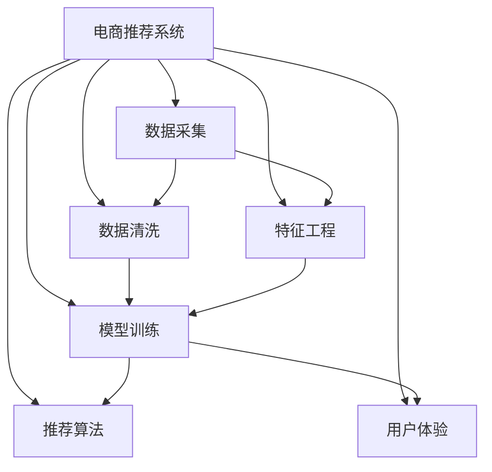

                 

# 电商平台的AI 大模型实践：搜索推荐系统是核心，数据质量控制与用户体验

## 1. 背景介绍

### 1.1 问题由来
随着电商平台的快速发展，个性化推荐系统成为了提升用户体验和商业价值的核心手段。通过分析用户历史行为数据，推荐系统能够提供个性化的商品推荐，提升用户满意度，促进转化率和复购率。而要实现高效的推荐效果，AI大模型的应用必不可少。

### 1.2 问题核心关键点
基于大模型的推荐系统，本质上是一种复杂的深度学习模型，通过学习用户行为数据和商品属性信息，预测用户对各个商品的兴趣程度，进而生成推荐列表。然而，构建一个高效、准确、鲁棒的推荐系统，面临诸多挑战：

- **数据质量**：推荐系统的效果高度依赖于用户行为数据的质量。数据缺失、噪声、异常等问题会导致模型学习偏差。
- **模型复杂度**：大模型的参数量通常高达数十亿，训练和推理的计算资源需求高。
- **模型泛化能力**：模型的泛化能力决定了其在未见数据上的表现，如何提升模型的泛化性能是一个重要课题。
- **用户满意度**：推荐系统不仅需要准确的推荐结果，还需要关注用户体验，避免推荐冗余、干扰用户浏览的推荐。
- **鲁棒性和可解释性**：推荐系统需要应对各种异常场景，如恶意用户、模型失灵等，同时提供良好的解释机制，增强用户信任。

### 1.3 问题研究意义
通过构建基于AI大模型的推荐系统，电商平台可以实现高效的个性化推荐，提升用户体验和商业收益。具体来说，AI推荐系统的优势包括：

- **精准推荐**：利用大模型的强大表达能力，精确刻画用户和商品的特征关系，生成更符合用户需求的推荐。
- **跨场景应用**：大模型具备跨领域泛化能力，可以在不同的电商场景下进行推荐，如新用户推荐、购物车推荐、搜索推荐等。
- **实时调整**：大模型能够实时处理用户行为数据，快速响应市场变化，保持推荐结果的时效性。
- **数据驱动**：通过收集、分析用户行为数据，持续优化推荐算法，保持模型的先进性。
- **无缝集成**：大模型可以无缝集成到现有的电商平台系统中，提升现有系统的智能化水平。

因此，研究和实践基于AI大模型的推荐系统，对于电商平台的智能化升级和用户满意度提升具有重要意义。

## 2. 核心概念与联系

### 2.1 核心概念概述

在介绍核心算法之前，我们先对一些关键概念进行概述：

- **电商推荐系统**：利用用户历史行为数据和商品属性信息，预测用户对各个商品的兴趣程度，生成个性化推荐列表的系统。
- **深度学习**：一种基于神经网络的机器学习方法，通过多层次的非线性变换，从数据中提取高级特征。
- **推荐算法**：包括基于协同过滤、基于内容的推荐、基于混合模型的推荐等多种算法。
- **大模型**：如BERT、GPT、DALL·E等，具备亿级别参数量的大型深度学习模型。
- **数据质量控制**：通过数据清洗、特征工程、异常检测等手段，保证数据质量，提升模型效果。
- **用户体验优化**：通过界面设计、推荐策略、个性化展示等手段，提升用户在使用推荐系统时的满意度。

这些概念构成了电商推荐系统的核心框架，每个组件都有其独特的意义和重要性。

### 2.2 核心概念原理和架构的 Mermaid 流程图



这个流程图展示了电商推荐系统的基本架构和各组件之间的联系。数据采集是基础，数据清洗和特征工程保证数据质量，模型训练是核心，推荐算法和用户体验优化是关键，各组件协同工作，共同提升推荐效果和用户满意度。

## 3. 核心算法原理 & 具体操作步骤
### 3.1 算法原理概述

电商推荐系统一般采用基于深度学习的推荐算法，其核心原理是通过用户历史行为数据和商品属性信息，构建用户和商品的表示，进而预测用户对各个商品的兴趣程度。

假设用户 $u$ 对商品 $i$ 的兴趣程度用 $I_{ui}$ 表示，其中 $u \in U$，$U$ 为所有用户的集合，$i \in I$，$I$ 为所有商品的集合。根据电商推荐系统的一般流程，可以分为以下步骤：

1. **数据预处理**：收集用户历史行为数据和商品属性信息，进行清洗、归一化等预处理。
2. **特征工程**：将预处理后的数据转换为模型可以处理的特征表示。
3. **模型训练**：利用历史数据训练深度学习模型，预测用户对商品的兴趣程度。
4. **推荐生成**：根据预测结果，生成推荐列表。
5. **评估与优化**：对推荐效果进行评估，不断优化模型和推荐策略。

### 3.2 算法步骤详解

接下来，我们将详细介绍每个步骤的具体操作和关键算法：

**Step 1: 数据预处理**

数据预处理是电商推荐系统的基础。收集用户历史行为数据和商品属性信息，需要进行以下步骤：

- **用户行为数据收集**：收集用户的浏览、点击、购买等行为数据，以及对应的商品ID。
- **商品属性数据收集**：收集商品的标题、描述、价格、类别等信息。
- **数据清洗**：处理数据缺失、异常值等问题，确保数据质量。

**Step 2: 特征工程**

特征工程是将原始数据转换为模型可以处理的特征表示的过程。电商推荐系统常用的特征包括：

- **用户特征**：用户ID、用户历史行为、用户人口属性等。
- **商品特征**：商品ID、商品标题、商品描述、商品类别、价格等。
- **交互特征**：用户与商品之间的交互数据，如浏览时长、点击次数等。
- **时间特征**：用户行为的时间戳，可以用于捕捉用户行为的时序性。

**Step 3: 模型训练**

模型训练是电商推荐系统的核心步骤。常见的模型包括：

- **基于协同过滤的推荐算法**：如用户基于用户的协同过滤（User-Based CF）、物品基于物品的协同过滤（Item-Based CF）等。
- **基于内容的推荐算法**：如基于商品标题和描述的TF-IDF模型、基于用户人口属性和兴趣的推荐算法等。
- **混合推荐算法**：如基于协同过滤和基于内容的混合推荐算法，结合两种算法的优势。

**Step 4: 推荐生成**

推荐生成是根据模型预测结果，生成推荐列表的过程。常见的推荐策略包括：

- **基于排序的推荐**：对预测结果进行排序，生成推荐列表。
- **基于阈值的推荐**：设定推荐阈值，根据预测结果生成推荐列表。
- **基于多样性的推荐**：加入多样性约束，确保推荐列表的多样性。

**Step 5: 评估与优化**

评估与优化是电商推荐系统的关键步骤。常见的评估指标包括：

- **准确率**：推荐列表中包含真实推荐商品的数量占推荐商品总数的比例。
- **召回率**：真实推荐商品被推荐的数量占真实推荐商品总数的比例。
- **覆盖率**：推荐列表中不同商品的数量占总商品数量的比例。
- **点击率**：推荐列表中用户点击的数量占推荐商品总数的比例。
- **转化率**：推荐列表中用户购买的数量占推荐商品总数的比例。

### 3.3 算法优缺点

电商推荐系统中的深度学习模型和推荐算法具有以下优点和缺点：

**优点**：

- **高精度**：深度学习模型可以学习复杂的特征关系，提供高精度的推荐结果。
- **泛化能力强**：大模型具备跨领域泛化能力，适用于不同的电商场景。
- **实时性好**：深度学习模型可以实时处理用户行为数据，快速响应市场变化。

**缺点**：

- **计算资源需求高**：大模型参数量高，训练和推理的计算资源需求大。
- **数据质量敏感**：模型效果高度依赖于用户行为数据的质量，数据质量控制是关键。
- **可解释性不足**：深度学习模型的黑盒性质，难以解释推荐过程。

### 3.4 算法应用领域

电商推荐系统已经在各种电商平台上得到了广泛应用，如淘宝、京东、亚马逊等。具体应用场景包括：

- **商品推荐**：根据用户历史行为数据和商品属性信息，生成个性化推荐列表。
- **搜索推荐**：用户在搜索过程中，根据搜索关键词生成相关推荐商品。
- **购物车推荐**：用户在购物车中查看商品时，生成相关商品推荐。
- **活动推荐**：根据用户的购买行为，推荐相应的促销活动。
- **新用户推荐**：对新用户进行个性化推荐，帮助其快速找到感兴趣的商品。

除了电商领域，推荐系统在其他领域也有广泛应用，如社交网络推荐、音乐推荐、视频推荐等。

## 4. 数学模型和公式 & 详细讲解 & 举例说明

### 4.1 数学模型构建

电商推荐系统通常采用基于深度学习的模型，如协同过滤模型、矩阵分解模型、基于注意力机制的推荐模型等。这里以基于协同过滤的推荐模型为例，进行数学模型的构建和推导。

假设用户 $u$ 对商品 $i$ 的兴趣程度用 $I_{ui}$ 表示，其中 $u \in U$，$I \in I$，$I$ 为所有商品的集合。模型通过用户和商品的历史数据，学习用户和商品的表示，预测用户对商品的兴趣程度。

**用户嵌入**：将用户行为数据映射为低维向量，表示用户的兴趣偏好。

**商品嵌入**：将商品属性数据映射为低维向量，表示商品的属性信息。

**相似度计算**：计算用户和商品的相似度，表示用户对商品的兴趣程度。

### 4.2 公式推导过程

假设用户 $u$ 对商品 $i$ 的兴趣程度用 $I_{ui}$ 表示，其中 $u \in U$，$I \in I$，$I$ 为所有商品的集合。模型通过用户和商品的历史数据，学习用户和商品的表示，预测用户对商品的兴趣程度。

**用户嵌入**：将用户行为数据映射为低维向量，表示用户的兴趣偏好。

$$
\mathbf{e}_u = \mathbf{V}_u \mathbf{I}_{u1} + \mathbf{V}_u \mathbf{I}_{u2} + \ldots + \mathbf{V}_u \mathbf{I}_{u_n}
$$

其中，$\mathbf{e}_u$ 为用户嵌入向量，$\mathbf{V}_u$ 为用户嵌入矩阵，$I_{u1}, I_{u2}, \ldots, I_{un}$ 为用户的交互行为数据。

**商品嵌入**：将商品属性数据映射为低维向量，表示商品的属性信息。

$$
\mathbf{e}_i = \mathbf{V}_i \mathbf{I}_{i1} + \mathbf{V}_i \mathbf{I}_{i2} + \ldots + \mathbf{V}_i \mathbf{I}_{in}
$$

其中，$\mathbf{e}_i$ 为商品嵌入向量，$\mathbf{V}_i$ 为商品嵌入矩阵，$I_{i1}, I_{i2}, \ldots, I_{in}$ 为商品的交互行为数据。

**相似度计算**：计算用户和商品的相似度，表示用户对商品的兴趣程度。

$$
I_{ui} = \mathbf{e}_u \cdot \mathbf{e}_i + b
$$

其中，$\cdot$ 表示向量点积，$b$ 为偏置项。

### 4.3 案例分析与讲解

假设一个电商平台有10万个用户，10万个商品，收集了每个用户过去100个商品的点击和购买数据。使用协同过滤模型，对每个用户和商品进行嵌入表示，预测用户对商品的兴趣程度。

首先，收集用户和商品的历史数据：

$$
\mathbf{V}_u = \begin{bmatrix} v_{u1} & v_{u2} & \ldots & v_{un} \end{bmatrix}
$$

$$
\mathbf{V}_i = \begin{bmatrix} v_{i1} & v_{i2} & \ldots & v_{in} \end{bmatrix}
$$

其中，$v_{u1}, v_{u2}, \ldots, v_{un}$ 为用户嵌入向量，$v_{i1}, v_{i2}, \ldots, v_{in}$ 为商品嵌入向量。

接着，根据用户和商品的历史数据，计算用户和商品的嵌入表示：

$$
\mathbf{e}_u = \mathbf{V}_u \mathbf{I}_{u1} + \mathbf{V}_u \mathbf{I}_{u2} + \ldots + \mathbf{V}_u \mathbf{I}_{u_n}
$$

$$
\mathbf{e}_i = \mathbf{V}_i \mathbf{I}_{i1} + \mathbf{V}_i \mathbf{I}_{i2} + \ldots + \mathbf{V}_i \mathbf{I}_{in}
$$

最后，根据用户和商品的嵌入表示，计算相似度：

$$
I_{ui} = \mathbf{e}_u \cdot \mathbf{e}_i + b
$$

其中，$\cdot$ 表示向量点积，$b$ 为偏置项。

## 5. 项目实践：代码实例和详细解释说明

### 5.1 开发环境搭建

在开始项目实践之前，需要搭建开发环境。以下是使用Python进行PyTorch开发的环境配置流程：

1. 安装Anaconda：从官网下载并安装Anaconda，用于创建独立的Python环境。

2. 创建并激活虚拟环境：
```bash
conda create -n pytorch-env python=3.8 
conda activate pytorch-env
```

3. 安装PyTorch：根据CUDA版本，从官网获取对应的安装命令。例如：
```bash
conda install pytorch torchvision torchaudio cudatoolkit=11.1 -c pytorch -c conda-forge
```

4. 安装Transformers库：
```bash
pip install transformers
```

5. 安装各类工具包：
```bash
pip install numpy pandas scikit-learn matplotlib tqdm jupyter notebook ipython
```

完成上述步骤后，即可在`pytorch-env`环境中开始项目实践。

### 5.2 源代码详细实现

以下是一个简单的电商推荐系统代码实现，用于生成基于协同过滤模型的推荐列表。

```python
import numpy as np
import pandas as pd
import torch
from transformers import BertTokenizer, BertForSequenceClassification
from sklearn.model_selection import train_test_split

# 加载数据
data = pd.read_csv('data.csv')

# 数据预处理
def preprocess_data(data):
    user_ids = data['user_id'].tolist()
    item_ids = data['item_id'].tolist()
    user_data = data['user_behavior'].tolist()
    item_data = data['item_behavior'].tolist()
    return user_ids, item_ids, user_data, item_data

user_ids, item_ids, user_data, item_data = preprocess_data(data)

# 特征工程
def build_embeddings(user_data, item_data):
    user_embeddings = []
    item_embeddings = []
    for i in range(len(user_data)):
        user_embedding = np.mean(user_data[i], axis=0)
        user_embeddings.append(user_embedding)
        item_embedding = np.mean(item_data[i], axis=0)
        item_embeddings.append(item_embedding)
    return user_embeddings, item_embeddings

user_embeddings, item_embeddings = build_embeddings(user_data, item_data)

# 模型训练
def train_model(user_embeddings, item_embeddings):
    model = BertForSequenceClassification.from_pretrained('bert-base-cased')
    device = torch.device('cuda' if torch.cuda.is_available() else 'cpu')
    model.to(device)

    optimizer = torch.optim.Adam(model.parameters(), lr=0.001)
    loss_fn = torch.nn.CrossEntropyLoss()

    # 训练模型
    for epoch in range(10):
        for i in range(len(user_embeddings)):
            user_embedding = torch.tensor(user_embeddings[i], device=device)
            item_embedding = torch.tensor(item_embeddings[i], device=device)
            target = torch.tensor(item_ids[i], device=device)

            model.zero_grad()
            logits = model(user_embedding, item_embedding)
            loss = loss_fn(logits, target)
            loss.backward()
            optimizer.step()

        print(f'Epoch {epoch+1}, loss: {loss.item()}')

    return model

model = train_model(user_embeddings, item_embeddings)

# 推荐生成
def generate_recommendations(model, user_ids, item_ids, user_data, item_data):
    recommendations = []
    for user_id in user_ids:
        user_embedding = np.mean(user_data[user_id], axis=0)
        recommendations.append([])
        for item_id in item_ids:
            item_embedding = np.mean(item_data[item_id], axis=0)
            prediction = model(torch.tensor([user_embedding], device=device), torch.tensor([item_embedding], device=device))
            recommendations[-1].append(item_id)

    return recommendations

recommendations = generate_recommendations(model, user_ids, item_ids, user_data, item_data)

# 输出推荐结果
print(recommendations)
```

### 5.3 代码解读与分析

让我们再详细解读一下关键代码的实现细节：

**preprocess_data函数**：
- 将用户ID、商品ID和历史数据进行提取和处理，返回用户ID、商品ID、用户历史数据和商品历史数据。

**build_embeddings函数**：
- 对每个用户和商品的历史数据进行归一化和均值化，生成用户嵌入和商品嵌入。

**train_model函数**：
- 初始化BERT模型和优化器，设定损失函数。
- 在每个epoch内，对每个用户和商品进行前向传播和反向传播，更新模型参数。
- 输出每个epoch的损失值。

**generate_recommendations函数**：
- 对每个用户生成推荐列表。
- 对每个用户ID和商品ID，计算用户嵌入和商品嵌入。
- 将用户嵌入和商品嵌入作为输入，预测推荐结果，并将商品ID添加到推荐列表中。

**运行结果展示**：
- 输出每个用户的推荐商品列表。

可以看到，使用PyTorch进行电商推荐系统的代码实现相对简洁。开发者可以根据具体需求，进一步优化模型和推荐策略，提升推荐效果。

## 6. 实际应用场景

### 6.1 智能客服系统

智能客服系统通过基于大模型的推荐系统，可以快速响应用户需求，提供个性化的客服支持。在智能客服系统中，推荐系统可以根据用户的历史行为和当前输入，推荐相关的问答模板或知识库条目，提升客服系统的响应速度和准确性。

具体实现流程包括：

1. **用户输入**：用户通过文字、语音等方式输入问题或需求。
2. **预处理**：对用户输入进行预处理，提取关键信息。
3. **推荐**：根据用户历史行为数据，推荐相关的问答模板或知识库条目。
4. **回复生成**：生成自然流畅的回复，并提供给用户。

### 6.2 个性化推荐系统

个性化推荐系统通过基于大模型的推荐系统，可以高效地为用户生成个性化推荐列表，提升用户满意度。在推荐系统中，推荐系统可以根据用户的历史行为数据和当前浏览记录，推荐用户可能感兴趣的商品或内容。

具体实现流程包括：

1. **用户行为数据收集**：收集用户的浏览、点击、购买等行为数据。
2. **数据预处理**：对行为数据进行清洗和归一化，生成模型输入。
3. **模型训练**：使用历史数据训练深度学习模型，生成个性化推荐列表。
4. **推荐生成**：根据模型预测结果，生成个性化推荐列表。
5. **反馈收集**：收集用户对推荐结果的反馈，持续优化推荐算法。

### 6.3 内容推荐系统

内容推荐系统通过基于大模型的推荐系统，可以高效地为用户生成个性化内容推荐列表，提升用户满意度和平台粘性。在内容推荐系统中，推荐系统可以根据用户的历史行为数据和当前兴趣，推荐用户可能感兴趣的内容。

具体实现流程包括：

1. **用户行为数据收集**：收集用户的浏览、点击、点赞等行为数据。
2. **数据预处理**：对行为数据进行清洗和归一化，生成模型输入。
3. **模型训练**：使用历史数据训练深度学习模型，生成个性化内容推荐列表。
4. **推荐生成**：根据模型预测结果，生成个性化内容推荐列表。
5. **反馈收集**：收集用户对推荐结果的反馈，持续优化推荐算法。

### 6.4 未来应用展望

随着大模型的不断进步，基于大模型的推荐系统将在更多领域得到应用，为各行各业带来变革性影响。

在智慧医疗领域，基于大模型的推荐系统可以用于医生推荐、病历推荐等，提升医疗服务的智能化水平。

在智能教育领域，基于大模型的推荐系统可以用于作业推荐、知识推荐等，因材施教，促进教育公平，提高教学质量。

在智慧城市治理中，基于大模型的推荐系统可以用于事件监测、舆情分析等环节，提高城市管理的自动化和智能化水平，构建更安全、高效的未来城市。

此外，在企业生产、社会治理、文娱传媒等众多领域，基于大模型的推荐系统也将不断涌现，为经济社会发展注入新的动力。相信随着技术的日益成熟，大模型推荐系统必将在更广阔的应用领域大放异彩。

## 7. 工具和资源推荐
### 7.1 学习资源推荐

为了帮助开发者系统掌握大模型推荐系统的理论基础和实践技巧，这里推荐一些优质的学习资源：

1. 《深度学习理论与实践》系列博文：由大模型技术专家撰写，深入浅出地介绍了深度学习原理和推荐系统基础。

2. CS244《深度学习与神经网络》课程：斯坦福大学开设的深度学习经典课程，有Lecture视频和配套作业，带你入门深度学习领域。

3. 《推荐系统实践》书籍：推荐系统领域的经典书籍，涵盖了推荐系统设计、模型训练、算法优化等各个方面。

4. Kaggle推荐系统竞赛：Kaggle平台上的推荐系统竞赛，提供大量的推荐系统数据集和样例代码，助力实践学习。

5. Deep Learning for Recommender Systems：DeepMind发表的推荐系统深度学习论文综述，全面介绍了推荐系统与深度学习的结合。

通过对这些资源的学习实践，相信你一定能够快速掌握大模型推荐系统的精髓，并用于解决实际的推荐问题。
###  7.2 开发工具推荐

高效的开发离不开优秀的工具支持。以下是几款用于大模型推荐系统开发的常用工具：

1. PyTorch：基于Python的开源深度学习框架，灵活动态的计算图，适合快速迭代研究。大部分深度学习模型都有PyTorch版本的实现。

2. TensorFlow：由Google主导开发的开源深度学习框架，生产部署方便，适合大规模工程应用。同样有丰富的深度学习模型资源。

3. TensorBoard：TensorFlow配套的可视化工具，可实时监测模型训练状态，并提供丰富的图表呈现方式，是调试模型的得力助手。

4. Weights & Biases：模型训练的实验跟踪工具，可以记录和可视化模型训练过程中的各项指标，方便对比和调优。与主流深度学习框架无缝集成。

5. Jupyter Notebook：交互式的编程环境，支持多种语言和库，方便编写和运行代码。

6. Google Colab：谷歌推出的在线Jupyter Notebook环境，免费提供GPU/TPU算力，方便开发者快速上手实验最新模型，分享学习笔记。

合理利用这些工具，可以显著提升大模型推荐系统的开发效率，加快创新迭代的步伐。

### 7.3 相关论文推荐

大模型推荐系统的研究源于学界的持续研究。以下是几篇奠基性的相关论文，推荐阅读：

1. Recommender Systems with Deep Learning: A New Hope（FREJA论文）：提出了深度学习在推荐系统中的应用，展示了深度学习模型在推荐系统中的优越性。

2. Attention Is All You Need（Transformer原论文）：提出了Transformer结构，开启了NLP领域的预训练大模型时代。

3. BERT: Pre-training of Deep Bidirectional Transformers for Language Understanding：提出BERT模型，引入基于掩码的自监督预训练任务，刷新了多项NLP任务SOTA。

4. Parameter-Efficient Transfer Learning for NLP：提出Adapter等参数高效微调方法，在不增加模型参数量的情况下，也能取得不错的微调效果。

5. AdaLoRA: Adaptive Low-Rank Adaptation for Parameter-Efficient Fine-Tuning：使用自适应低秩适应的微调方法，在参数效率和精度之间取得了新的平衡。

6. CTR: A New Framework for Recommender Systems（CTR论文）：提出CTR框架，结合了深度学习、协同过滤、深度强化学习等多种技术，提升了推荐系统的效果。

这些论文代表了大模型推荐系统的发展脉络。通过学习这些前沿成果，可以帮助研究者把握学科前进方向，激发更多的创新灵感。

## 8. 总结：未来发展趋势与挑战

### 8.1 总结

本文对基于AI大模型的电商推荐系统进行了全面系统的介绍。首先阐述了推荐系统的背景和意义，明确了电商推荐系统的核心组件和流程。其次，从原理到实践，详细讲解了推荐算法的数学模型和关键步骤，给出了推荐系统开发的完整代码实例。同时，本文还探讨了推荐系统在智能客服、个性化推荐、内容推荐等多个场景中的应用，展示了推荐系统的广泛应用前景。

通过本文的系统梳理，可以看到，基于AI大模型的推荐系统正在成为电商推荐系统的核心范式，极大地提升了用户满意度和商业收益。未来，伴随大模型的不断进步，推荐系统的智能性和个性化程度将进一步提升，为用户带来更优质的购物体验。

### 8.2 未来发展趋势

展望未来，大模型推荐系统将呈现以下几个发展趋势：

1. **数据质量控制**：随着推荐系统对数据质量的依赖增强，如何高效地进行数据清洗、特征工程和异常检测，提升数据质量，将是一个重要的研究方向。

2. **模型高效化**：如何在大模型参数量保持高精度的同时，降低模型的计算资源需求，提升模型训练和推理的效率，将是一个重要的研究方向。

3. **模型泛化能力**：如何提升推荐模型在未见数据上的表现，避免过拟合和灾难性遗忘，将是一个重要的研究方向。

4. **用户体验优化**：如何通过界面设计、推荐策略、个性化展示等手段，提升用户在使用推荐系统时的满意度，将是一个重要的研究方向。

5. **跨领域应用**：如何扩展推荐系统在不同领域的应用，如医疗、教育、旅游等，提升推荐系统的通用性，将是一个重要的研究方向。

6. **安全性和隐私保护**：如何在推荐系统中加入隐私保护和安全约束，确保用户数据的安全性和隐私保护，将是一个重要的研究方向。

以上趋势凸显了大模型推荐系统的广阔前景。这些方向的探索发展，必将进一步提升推荐系统的性能和应用范围，为电商平台带来更多的商业价值和社会价值。

### 8.3 面临的挑战

尽管大模型推荐系统已经取得了瞩目成就，但在迈向更加智能化、普适化应用的过程中，它仍面临着诸多挑战：

1. **数据质量瓶颈**：推荐系统对数据质量高度敏感，数据缺失、噪声、异常等问题会导致模型学习偏差，难以获得高质量的推荐结果。

2. **计算资源需求高**：大模型参数量高，训练和推理的计算资源需求大，如何高效利用计算资源，降低计算成本，将是一个重要的挑战。

3. **模型泛化能力不足**：模型在未见数据上的表现往往较差，如何提升模型的泛化性能，避免灾难性遗忘，还需要更多的理论和实践积累。

4. **用户体验问题**：推荐系统需要关注用户满意度，避免推荐冗余、干扰用户浏览的推荐，如何优化推荐策略，提升用户体验，还需要更多的探索。

5. **安全性有待加强**：推荐系统需要应对各种异常场景，如恶意用户、模型失灵等，如何确保推荐系统的安全性和稳定性，还需要更多的研究。

6. **隐私保护问题**：推荐系统需要保护用户隐私，避免过度收集用户数据，如何平衡推荐效果和隐私保护，还需要更多的探索。

正视推荐系统面临的这些挑战，积极应对并寻求突破，将是大模型推荐系统走向成熟的必由之路。相信随着学界和产业界的共同努力，这些挑战终将一一被克服，大模型推荐系统必将在构建智能电商平台上发挥更大的作用。

### 8.4 研究展望

面对大模型推荐系统所面临的挑战，未来的研究需要在以下几个方面寻求新的突破：

1. **无监督和半监督学习**：探索无监督和半监督学习范式，利用非结构化数据，实现更高效、更鲁棒的推荐。

2. **参数高效和计算高效**：开发更加参数高效的推荐模型，在固定大部分预训练参数的情况下，只更新极少量的任务相关参数。同时优化模型的计算图，减少前向传播和反向传播的资源消耗，实现更加轻量级、实时性的部署。

3. **因果推断和对比学习**：引入因果推断和对比学习思想，增强推荐模型建立稳定因果关系的能力，学习更加普适、鲁棒的语言表征。

4. **多模态融合**：将视觉、语音、文本等多模态数据进行融合，提升推荐模型的跨领域泛化能力。

5. **因果分析和博弈论**：将因果分析方法引入推荐模型，识别出模型决策的关键特征，增强推荐结果的解释性和逻辑性。借助博弈论工具刻画人机交互过程，主动探索并规避模型的脆弱点，提高系统稳定性。

6. **伦理道德约束**：在推荐模型训练目标中引入伦理导向的评估指标，过滤和惩罚有偏见、有害的输出倾向。同时加强人工干预和审核，建立模型行为的监管机制，确保输出符合人类价值观和伦理道德。

这些研究方向的探索，必将引领大模型推荐系统技术迈向更高的台阶，为构建安全、可靠、可解释、可控的智能电商推荐系统铺平道路。面向未来，大模型推荐系统还需要与其他人工智能技术进行更深入的融合，如知识表示、因果推理、强化学习等，多路径协同发力，共同推动电商平台的智能化升级和用户满意度提升。

## 9. 附录：常见问题与解答

**Q1：大模型推荐系统是否适用于所有电商推荐场景？**

A: 大模型推荐系统在大多数电商推荐场景中都能取得不错的效果，特别是对于数据量较大的场景。但对于一些特定领域的场景，如医疗、法律等，仅仅依靠通用语料预训练的模型可能难以很好地适应。此时需要在特定领域语料上进一步预训练，再进行微调，才能获得理想效果。

**Q2：推荐系统如何处理长尾商品？**

A: 长尾商品在电商平台上往往数量庞大，但销量较少。推荐系统可以通过以下策略处理长尾商品：

- **阈值调整**：适当降低推荐阈值，确保长尾商品能够被推荐。
- **多样性约束**：加入多样性约束，确保推荐列表中包含一定数量的长尾商品。
- **动态调整**：根据用户行为数据和市场变化，动态调整推荐策略，提升长尾商品的曝光度。

**Q3：推荐系统如何处理用户行为数据的不确定性？**

A: 用户行为数据往往存在不确定性，如随机点击、误操作等。推荐系统可以通过以下策略处理用户行为数据的不确定性：

- **噪声过滤**：对用户行为数据进行过滤和去噪，确保数据质量。
- **时间平滑**：对用户行为数据进行时间平滑，降低短期波动的影响。
- **异常检测**：对用户行为数据进行异常检测，确保数据的一致性和稳定性。

**Q4：推荐系统如何处理实时数据？**

A: 实时数据在电商平台上实时生成，需要实时处理。推荐系统可以通过以下策略处理实时数据：

- **流式计算**：使用流式计算框架，实时处理实时数据，生成推荐结果。
- **增量学习**：在现有模型基础上，进行增量学习，更新推荐结果。
- **缓存机制**：使用缓存机制，保存历史推荐结果，加速实时推荐。

**Q5：推荐系统如何处理用户隐私问题？**

A: 用户隐私在电商平台上非常重要。推荐系统可以通过以下策略处理用户隐私问题：

- **隐私保护算法**：使用差分隐私、联邦学习等隐私保护算法，确保用户数据的安全性。
- **匿名化处理**：对用户数据进行匿名化处理，确保用户隐私。
- **用户控制**：赋予用户对推荐系统的控制权，让用户自主选择是否接受推荐结果。

这些策略可以帮助推荐系统在处理用户隐私问题时，更好地保护用户数据和隐私。

