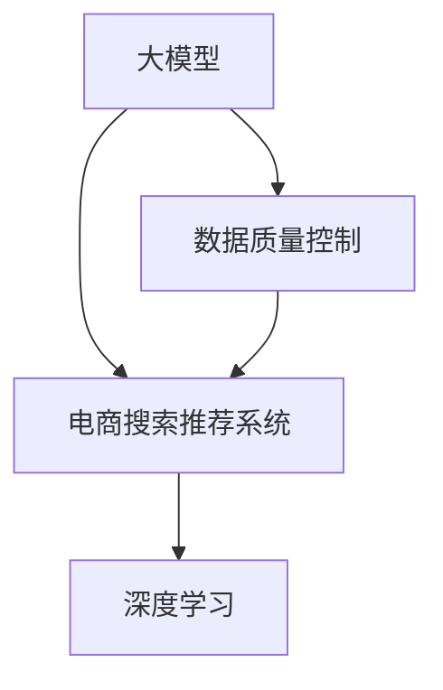

                 

# 电商平台的AI 大模型实践：搜索推荐系统是核心，数据质量控制是关键

> 关键词：人工智能(AI), 大模型, 电商搜索推荐系统, 数据质量控制, 深度学习, 数据增强, 特征工程, 模型优化, 模型评估

## 1. 背景介绍

随着人工智能(AI)技术的不断进步，电商平台逐渐开始将AI技术融入其核心功能中，以提升用户体验和增加销售。尤其是搜索推荐系统，通过理解和预测用户需求，为用户推荐最符合其兴趣的商品，已成为电商平台的必备功能。然而，尽管搜索推荐系统的重要性日益凸显，但其中存在的诸多挑战仍需我们深入理解和解决。

本文章将探讨如何在大模型基础上构建和优化电商平台的搜索推荐系统，并阐述数据质量控制在这个过程中扮演的关键角色。我们将通过系统性的介绍大模型在电商搜索推荐系统中的应用，深入挖掘其中蕴含的数据增强、特征工程和模型优化等关键技术，并提出针对数据质量控制的实际策略。

## 2. 核心概念与联系

### 2.1 核心概念概述

为更好地理解大模型在电商平台搜索推荐系统中的应用，本节将介绍几个关键概念：

- **大模型**：以自回归模型如GPT-3、BERT等为代表，通过在大量无标签数据上进行预训练，学习到丰富的语言和视觉表示的模型。
- **电商搜索推荐系统**：利用用户行为数据、商品信息等多源数据，预测用户对商品的兴趣，并推荐符合用户需求的商品。
- **数据质量控制**：通过识别和消除数据中的噪声、错误或不完整部分，提升数据可用性和模型训练效果的过程。
- **深度学习**：一种通过多层神经网络进行数据表示学习的方法，被广泛应用于计算机视觉、自然语言处理和推荐系统等领域。

这些概念之间的联系可以通过以下Mermaid流程图来展示：



这个流程图展示了大模型、电商搜索推荐系统和数据质量控制之间的紧密联系：

1. 大模型通过预训练学习到丰富的知识，为推荐系统提供强有力的表示学习。
2. 电商搜索推荐系统基于大模型的表示，进行用户兴趣预测和商品推荐。
3. 数据质量控制则通过确保数据质量，进一步提升推荐系统的性能。

## 3. 核心算法原理 & 具体操作步骤

### 3.1 算法原理概述

大模型在电商搜索推荐系统中的应用，本质上是一个基于深度学习的推理和优化过程。其核心思想是：将大模型作为特征提取器，利用其表示能力，通过用户行为数据和商品信息进行有监督或无监督的训练，以预测用户对商品的兴趣，并推荐最符合用户兴趣的商品。

形式化地，假设电商平台的数据集为 $D=\{(x_i, y_i)\}_{i=1}^N$，其中 $x_i$ 为输入（例如用户行为、商品信息等），$y_i$ 为输出（例如用户是否点击了商品）。微调的目标是找到最优的参数 $\theta^*$，使得模型在测试集上的预测性能达到最优：

$$
\theta^* = \mathop{\arg\min}_{\theta} \mathcal{L}(M_{\theta},D)
$$

其中 $\mathcal{L}$ 为损失函数，通常为交叉熵损失或均方误差损失。

### 3.2 算法步骤详解

基于深度学习的大模型在电商平台搜索推荐系统中的应用，通常包括以下几个关键步骤：

**Step 1: 准备数据集**

- **数据收集**：收集用户行为数据（如点击、浏览、购买等）和商品信息（如商品描述、属性、评分等）。
- **数据预处理**：对数据进行清洗、归一化、分词等预处理操作。
- **特征提取**：将数据转换为模型的输入格式，如将文本数据转化为词嵌入向量，图像数据转化为卷积神经网络(CNN)可处理的张量。

**Step 2: 训练大模型**

- **选择模型**：选择合适的深度学习模型，如Transformer、BERT等。
- **模型初始化**：使用预训练的模型参数初始化，减少从头训练所需的时间和计算资源。
- **模型微调**：在电商平台数据集上进行微调，调整模型参数，以适应电商平台的特定需求。

**Step 3: 模型评估**

- **性能指标**：定义合适的评价指标，如准确率、召回率、F1分数等，评估模型的预测性能。
- **A/B测试**：在真实电商平台上进行A/B测试，对比新模型和老模型在实际用户行为上的表现差异。

**Step 4: 推荐系统优化**

- **推荐算法**：结合模型预测结果和业务逻辑，设计推荐算法，如协同过滤、基于内容的推荐、混合推荐等。
- **推荐系统部署**：将模型和推荐算法集成到电商平台上，提供实时推荐服务。

### 3.3 算法优缺点

基于深度学习的大模型在电商平台搜索推荐系统中的应用，具有以下优点：

- **广泛适用**：大模型能够处理多种数据类型，适用于不同的电商业务场景。
- **性能提升**：通过深度学习模型，推荐系统的预测性能可以显著提升。
- **可解释性**：大模型通常具有较好的可解释性，方便开发人员理解模型的决策过程。

但同时，也存在一些缺点：

- **高成本**：深度学习模型的训练和优化需要大量的计算资源和时间。
- **高风险**：模型的过拟合问题可能导致在实际应用中表现不佳。
- **数据需求大**：深度学习模型需要大量的标注数据进行训练和优化，且对数据质量要求较高。

### 3.4 算法应用领域

大模型在电商平台的搜索推荐系统中的应用，已经广泛应用于多个领域，包括但不限于：

- **商品推荐**：根据用户的历史行为，推荐可能感兴趣的商品。
- **用户画像构建**：通过分析用户行为数据，构建用户画像，实现个性化推荐。
- **库存管理**：利用推荐系统预测商品的销售趋势，优化库存管理。
- **广告投放**：通过推荐系统预测用户对广告的兴趣，优化广告投放策略。

此外，大模型还被应用于电商平台的智能客服、产品优化、营销活动等领域，助力电商平台的智能化转型。

## 4. 数学模型和公式 & 详细讲解 & 举例说明

### 4.1 数学模型构建

在大模型应用于电商平台搜索推荐系统的过程中，通常会使用一些经典的数学模型，如协同过滤、基于内容的推荐等。以协同过滤为例，其基本思想是通过用户-商品评分矩阵，找到与用户兴趣最相似的邻居用户，进而推荐邻居用户喜欢的商品。

设用户集合为 $U$，商品集合为 $I$，用户-商品评分矩阵为 $R \in \mathbb{R}^{m \times n}$，其中 $m$ 为商品数，$n$ 为用户数。协同过滤模型的目标是最大化用户-商品评分矩阵中的预测值和实际评分值的相似度。

### 4.2 公式推导过程

协同过滤模型的目标函数可以定义为：

$$
\max_{R} \sum_{i=1}^m \sum_{j=1}^n R_{ij}^2 - \lambda \sum_{i=1}^m \sum_{j=1}^n (R_{ij} - \hat{R}_{ij})^2
$$

其中 $\lambda$ 为正则化参数，$\hat{R}_{ij}$ 为模型的预测评分。

利用梯度下降算法，通过反向传播更新模型参数，最小化目标函数，得到最优的协同过滤模型。

### 4.3 案例分析与讲解

以京东平台为例，其搜索推荐系统通过深度学习模型和协同过滤模型相结合的方式，对用户进行画像，并预测用户对商品的兴趣。具体步骤如下：

1. **数据收集**：收集用户在京东上的浏览、购买、收藏等行为数据，以及商品的属性信息、价格、评分等数据。
2. **特征提取**：对用户行为数据进行分词、提取特征，将商品信息转换为词嵌入向量。
3. **模型训练**：使用BERT等深度学习模型对用户行为数据进行训练，提取用户兴趣表示，并结合协同过滤模型进行推荐。
4. **模型评估**：在测试集上评估推荐模型的准确率和召回率，并进行A/B测试，对比新模型和老模型在实际用户行为上的表现。

## 5. 项目实践：代码实例和详细解释说明

### 5.1 开发环境搭建

在进行电商搜索推荐系统的开发前，需要先搭建好开发环境。以下是使用Python进行PyTorch开发的环境配置流程：

1. 安装Anaconda：从官网下载并安装Anaconda，用于创建独立的Python环境。

2. 创建并激活虚拟环境：
```bash
conda create -n pytorch-env python=3.8 
conda activate pytorch-env
```

3. 安装PyTorch：根据CUDA版本，从官网获取对应的安装命令。例如：
```bash
conda install pytorch torchvision torchaudio cudatoolkit=11.1 -c pytorch -c conda-forge
```

4. 安装Transformers库：
```bash
pip install transformers
```

5. 安装各类工具包：
```bash
pip install numpy pandas scikit-learn matplotlib tqdm jupyter notebook ipython
```

完成上述步骤后，即可在`pytorch-env`环境中开始微调实践。

### 5.2 源代码详细实现

这里我们以京东平台的推荐系统为例，给出使用Transformers库对BERT模型进行微调的PyTorch代码实现。

首先，定义推荐任务的数据处理函数：

```python
from transformers import BertTokenizer
from torch.utils.data import Dataset
import torch

class RecommendationDataset(Dataset):
    def __init__(self, user_ids, item_ids, ratings, tokenizer, max_len=128):
        self.user_ids = user_ids
        self.item_ids = item_ids
        self.ratings = ratings
        self.tokenizer = tokenizer
        self.max_len = max_len
        
    def __len__(self):
        return len(self.user_ids)
    
    def __getitem__(self, item):
        user_id = self.user_ids[item]
        item_id = self.item_ids[item]
        rating = self.ratings[item]
        
        user_input = tokenizer([f"User {user_id} is interested in item {item_id}."], max_length=self.max_len, padding='max_length', truncation=True)
        item_input = tokenizer([f"Item {item_id} is rated {rating} by user {user_id}."], max_length=self.max_len, padding='max_length', truncation=True)
        
        input_ids = torch.tensor([item_input['input_ids'] + user_input['input_ids']], dtype=torch.long)
        attention_mask = torch.tensor([item_input['attention_mask'] + user_input['attention_mask']], dtype=torch.long)
        return {'input_ids': input_ids, 
                'attention_mask': attention_mask,
                'labels': torch.tensor([rating], dtype=torch.float)}
```

然后，定义模型和优化器：

```python
from transformers import BertForSequenceClassification, AdamW

model = BertForSequenceClassification.from_pretrained('bert-base-cased', num_labels=1)
optimizer = AdamW(model.parameters(), lr=2e-5)
```

接着，定义训练和评估函数：

```python
from torch.utils.data import DataLoader
from tqdm import tqdm
from sklearn.metrics import mean_squared_error

device = torch.device('cuda') if torch.cuda.is_available() else torch.device('cpu')
model.to(device)

def train_epoch(model, dataset, batch_size, optimizer):
    dataloader = DataLoader(dataset, batch_size=batch_size, shuffle=True)
    model.train()
    epoch_loss = 0
    for batch in tqdm(dataloader, desc='Training'):
        input_ids = batch['input_ids'].to(device)
        attention_mask = batch['attention_mask'].to(device)
        labels = batch['labels'].to(device)
        model.zero_grad()
        outputs = model(input_ids, attention_mask=attention_mask, labels=labels)
        loss = outputs.loss
        epoch_loss += loss.item()
        loss.backward()
        optimizer.step()
    return epoch_loss / len(dataloader)

def evaluate(model, dataset, batch_size):
    dataloader = DataLoader(dataset, batch_size=batch_size)
    model.eval()
    preds, labels = [], []
    with torch.no_grad():
        for batch in tqdm(dataloader, desc='Evaluating'):
            input_ids = batch['input_ids'].to(device)
            attention_mask = batch['attention_mask'].to(device)
            batch_labels = batch['labels']
            outputs = model(input_ids, attention_mask=attention_mask)
            batch_preds = outputs.logits.squeeze().cpu().tolist()
            batch_labels = batch_labels.to('cpu').tolist()
            for pred, label in zip(batch_preds, batch_labels):
                preds.append(pred)
                labels.append(label)
                
    return mean_squared_error(labels, preds)
```

最后，启动训练流程并在测试集上评估：

```python
epochs = 5
batch_size = 16

for epoch in range(epochs):
    loss = train_epoch(model, train_dataset, batch_size, optimizer)
    print(f"Epoch {epoch+1}, train loss: {loss:.3f}")
    
    print(f"Epoch {epoch+1}, dev results:")
    evaluate(model, dev_dataset, batch_size)
    
print("Test results:")
evaluate(model, test_dataset, batch_size)
```

以上就是使用PyTorch对BERT进行推荐系统微调的完整代码实现。可以看到，得益于Transformers库的强大封装，我们可以用相对简洁的代码完成BERT模型的加载和微调。

### 5.3 代码解读与分析

让我们再详细解读一下关键代码的实现细节：

**RecommendationDataset类**：
- `__init__`方法：初始化用户ID、商品ID和评分等关键组件。
- `__len__`方法：返回数据集的样本数量。
- `__getitem__`方法：对单个样本进行处理，将用户和商品描述作为输入，将评分作为标签，并进行文本数据的编码和处理。

**模型定义**：
- 选择BERT模型作为推荐模型的初始化参数，指定输出层为二分类任务，损失函数为回归损失。

**训练和评估函数**：
- 使用PyTorch的DataLoader对数据集进行批次化加载，供模型训练和推理使用。
- 训练函数`train_epoch`：对数据以批为单位进行迭代，在每个批次上前向传播计算损失函数。
- 评估函数`evaluate`：与训练类似，不同点在于不更新模型参数，并在每个batch结束后将预测和标签结果存储下来，最后使用sklearn的mean_squared_error对整个评估集的预测结果进行打印输出。

**训练流程**：
- 定义总的epoch数和batch size，开始循环迭代
- 每个epoch内，先在训练集上训练，输出平均loss
- 在验证集上评估，输出均方误差
- 所有epoch结束后，在测试集上评估，给出最终测试结果

可以看到，PyTorch配合Transformers库使得BERT微调的代码实现变得简洁高效。开发者可以将更多精力放在数据处理、模型改进等高层逻辑上，而不必过多关注底层的实现细节。

当然，工业级的系统实现还需考虑更多因素，如模型的保存和部署、超参数的自动搜索、更灵活的任务适配层等。但核心的微调范式基本与此类似。

## 6. 实际应用场景

### 6.1 电商平台搜索推荐

基于大模型微调的推荐系统，可以广泛应用于电商平台的搜索推荐。传统推荐系统通常只依赖用户的历史行为数据进行推荐，难以理解用户的深层兴趣和需求。通过深度学习模型，电商平台的推荐系统能够更好地挖掘用户行为背后的语义信息，从而提供更精准、多样的推荐内容。

在技术实现上，可以收集用户浏览、点击、评论、分享等行为数据，提取和商品交互的物品标题、描述、标签等文本内容。将文本内容作为模型输入，用户的后续行为（如是否点击、购买等）作为监督信号，在此基础上微调预训练语言模型。微调后的模型能够从文本内容中准确把握用户的兴趣点。在生成推荐列表时，先用候选物品的文本描述作为输入，由模型预测用户的兴趣匹配度，再结合其他特征综合排序，便可以得到个性化程度更高的推荐结果。

### 6.2 智能客服系统

智能客服系统通过大模型微调，可以提升客户咨询体验和问题解决效率。传统的客服系统往往需要配备大量人力，高峰期响应缓慢，且一致性和专业性难以保证。而使用微调后的对话模型，可以7x24小时不间断服务，快速响应客户咨询，用自然流畅的语言解答各类常见问题。

在技术实现上，可以收集企业内部的历史客服对话记录，将问题和最佳答复构建成监督数据，在此基础上对预训练对话模型进行微调。微调后的对话模型能够自动理解用户意图，匹配最合适的答案模板进行回复。对于客户提出的新问题，还可以接入检索系统实时搜索相关内容，动态组织生成回答。如此构建的智能客服系统，能大幅提升客户咨询体验和问题解决效率。

### 6.3 金融舆情监测

金融机构需要实时监测市场舆论动向，以便及时应对负面信息传播，规避金融风险。传统的人工监测方式成本高、效率低，难以应对网络时代海量信息爆发的挑战。基于大语言模型微调的文本分类和情感分析技术，为金融舆情监测提供了新的解决方案。

具体而言，可以收集金融领域相关的新闻、报道、评论等文本数据，并对其进行主题标注和情感标注。在此基础上对预训练语言模型进行微调，使其能够自动判断文本属于何种主题，情感倾向是正面、中性还是负面。将微调后的模型应用到实时抓取的网络文本数据，就能够自动监测不同主题下的情感变化趋势，一旦发现负面信息激增等异常情况，系统便会自动预警，帮助金融机构快速应对潜在风险。

### 6.4 未来应用展望

随着大语言模型和微调方法的不断发展，基于微调范式将在更多领域得到应用，为传统行业带来变革性影响。

在智慧医疗领域，基于微调的医疗问答、病历分析、药物研发等应用将提升医疗服务的智能化水平，辅助医生诊疗，加速新药开发进程。

在智能教育领域，微调技术可应用于作业批改、学情分析、知识推荐等方面，因材施教，促进教育公平，提高教学质量。

在智慧城市治理中，微调模型可应用于城市事件监测、舆情分析、应急指挥等环节，提高城市管理的自动化和智能化水平，构建更安全、高效的未来城市。

此外，在企业生产、社会治理、文娱传媒等众多领域，基于大模型微调的人工智能应用也将不断涌现，为经济社会发展注入新的动力。相信随着预训练语言模型和微调方法的持续演进，搜索推荐技术必将在更广阔的应用领域大放异彩，深刻影响人类的生产生活方式。

## 7. 工具和资源推荐
### 7.1 学习资源推荐

为了帮助开发者系统掌握大模型在电商平台搜索推荐系统中的应用，这里推荐一些优质的学习资源：

1. 《Transformers: A Survey on the Model Architecture, Dataset & Applications》系列博文：由大模型技术专家撰写，深入浅出地介绍了Transformer原理、BERT模型、微调技术等前沿话题。

2. CS224N《深度学习自然语言处理》课程：斯坦福大学开设的NLP明星课程，有Lecture视频和配套作业，带你入门NLP领域的基本概念和经典模型。

3. 《Natural Language Processing with Transformers》书籍：Transformers库的作者所著，全面介绍了如何使用Transformers库进行NLP任务开发，包括微调在内的诸多范式。

4. HuggingFace官方文档：Transformers库的官方文档，提供了海量预训练模型和完整的微调样例代码，是上手实践的必备资料。

5. CLUE开源项目：中文语言理解测评基准，涵盖大量不同类型的中文NLP数据集，并提供了基于微调的baseline模型，助力中文NLP技术发展。

通过对这些资源的学习实践，相信你一定能够快速掌握大模型在电商平台搜索推荐系统中的应用，并用于解决实际的NLP问题。
###  7.2 开发工具推荐

高效的开发离不开优秀的工具支持。以下是几款用于大模型微调开发的常用工具：

1. PyTorch：基于Python的开源深度学习框架，灵活动态的计算图，适合快速迭代研究。大部分预训练语言模型都有PyTorch版本的实现。

2. TensorFlow：由Google主导开发的开源深度学习框架，生产部署方便，适合大规模工程应用。同样有丰富的预训练语言模型资源。

3. Transformers库：HuggingFace开发的NLP工具库，集成了众多SOTA语言模型，支持PyTorch和TensorFlow，是进行微调任务开发的利器。

4. Weights & Biases：模型训练的实验跟踪工具，可以记录和可视化模型训练过程中的各项指标，方便对比和调优。与主流深度学习框架无缝集成。

5. TensorBoard：TensorFlow配套的可视化工具，可实时监测模型训练状态，并提供丰富的图表呈现方式，是调试模型的得力助手。

6. Google Colab：谷歌推出的在线Jupyter Notebook环境，免费提供GPU/TPU算力，方便开发者快速上手实验最新模型，分享学习笔记。

合理利用这些工具，可以显著提升大模型微调的开发效率，加快创新迭代的步伐。

### 7.3 相关论文推荐

大模型和微调技术的发展源于学界的持续研究。以下是几篇奠基性的相关论文，推荐阅读：

1. Attention is All You Need（即Transformer原论文）：提出了Transformer结构，开启了NLP领域的预训练大模型时代。

2. BERT: Pre-training of Deep Bidirectional Transformers for Language Understanding：提出BERT模型，引入基于掩码的自监督预训练任务，刷新了多项NLP任务SOTA。

3. Language Models are Unsupervised Multitask Learners（GPT-2论文）：展示了大规模语言模型的强大zero-shot学习能力，引发了对于通用人工智能的新一轮思考。

4. Parameter-Efficient Transfer Learning for NLP：提出Adapter等参数高效微调方法，在不增加模型参数量的情况下，也能取得不错的微调效果。

5. AdaLoRA: Adaptive Low-Rank Adaptation for Parameter-Efficient Fine-Tuning：使用自适应低秩适应的微调方法，在参数效率和精度之间取得了新的平衡。

6. Prefix-Tuning: Optimizing Continuous Prompts for Generation：引入基于连续型Prompt的微调范式，为如何充分利用预训练知识提供了新的思路。

这些论文代表了大模型微调技术的发展脉络。通过学习这些前沿成果，可以帮助研究者把握学科前进方向，激发更多的创新灵感。

## 8. 总结：未来发展趋势与挑战

### 8.1 总结

本文对大模型在电商平台搜索推荐系统中的应用进行了全面系统的介绍。首先阐述了大模型和微调技术的研究背景和意义，明确了微调在拓展预训练模型应用、提升下游任务性能方面的独特价值。其次，从原理到实践，详细讲解了深度学习在电商推荐系统中的应用，深入挖掘了其中蕴含的数据增强、特征工程和模型优化等关键技术，并提出了针对数据质量控制的实际策略。

通过本文的系统梳理，可以看到，大模型微调在电商平台的搜索推荐系统中具有广泛的应用前景。基于深度学习模型，推荐系统能够更好地理解用户需求，提供个性化、多样化的商品推荐。同时，数据质量控制在这个过程中扮演了关键角色，通过识别和消除数据中的噪声、错误或不完整部分，提升数据可用性和模型训练效果。

### 8.2 未来发展趋势

展望未来，大模型在电商平台搜索推荐系统中的应用将呈现以下几个发展趋势：

1. 模型规模持续增大。随着算力成本的下降和数据规模的扩张，预训练语言模型的参数量还将持续增长。超大规模语言模型蕴含的丰富语言知识，有望支撑更加复杂多变的推荐系统。

2. 推荐算法多样化。推荐算法将更加多样化，如协同过滤、基于内容的推荐、混合推荐等，能够提供更多维度的推荐依据。

3. 数据增强技术发展。数据增强技术如回译、近义替换等，将使得推荐系统能够更好地利用有限标注数据，提升推荐效果。

4. 深度学习模型优化。深度学习模型将继续优化，以更高效、更稳定、更可靠的方式服务于推荐系统。

5. 数据质量控制技术提升。数据质量控制技术将更加成熟，能够更好地识别和消除数据中的噪声、错误，提升模型训练效果。

### 8.3 面临的挑战

尽管大模型在电商平台搜索推荐系统中的应用已经取得了显著进展，但在迈向更加智能化、普适化应用的过程中，仍面临诸多挑战：

1. 标注成本瓶颈。尽管微调大大降低了标注数据的需求，但对于长尾应用场景，难以获得充足的高质量标注数据，成为制约微调性能的瓶颈。如何进一步降低微调对标注样本的依赖，将是一大难题。

2. 模型鲁棒性不足。当前微调模型面对域外数据时，泛化性能往往大打折扣。对于测试样本的微小扰动，微调模型的预测也容易发生波动。如何提高微调模型的鲁棒性，避免灾难性遗忘，还需要更多理论和实践的积累。

3. 推理效率有待提高。大规模语言模型虽然精度高，但在实际部署时往往面临推理速度慢、内存占用大等效率问题。如何在保证性能的同时，简化模型结构，提升推理速度，优化资源占用，将是重要的优化方向。

4. 可解释性亟需加强。当前微调模型更像是"黑盒"系统，难以解释其内部工作机制和决策逻辑。对于医疗、金融等高风险应用，算法的可解释性和可审计性尤为重要。如何赋予微调模型更强的可解释性，将是亟待攻克的难题。

5. 安全性有待保障。预训练语言模型难免会学习到有偏见、有害的信息，通过微调传递到下游任务，产生误导性、歧视性的输出，给实际应用带来安全隐患。如何从数据和算法层面消除模型偏见，避免恶意用途，确保输出的安全性，也将是重要的研究课题。

6. 知识整合能力不足。现有的微调模型往往局限于任务内数据，难以灵活吸收和运用更广泛的先验知识。如何让微调过程更好地与外部知识库、规则库等专家知识结合，形成更加全面、准确的信息整合能力，还有很大的想象空间。

正视微调面临的这些挑战，积极应对并寻求突破，将是大模型微调走向成熟的必由之路。相信随着学界和产业界的共同努力，这些挑战终将一一被克服，大模型微调必将在构建人机协同的智能时代中扮演越来越重要的角色。

### 8.4 研究展望

面对大模型在电商平台搜索推荐系统中的应用，未来的研究需要在以下几个方面寻求新的突破：

1. 探索无监督和半监督微调方法。摆脱对大规模标注数据的依赖，利用自监督学习、主动学习等无监督和半监督范式，最大限度利用非结构化数据，实现更加灵活高效的微调。

2. 研究参数高效和计算高效的微调范式。开发更加参数高效的微调方法，在固定大部分预训练参数的同时，只更新极少量的任务相关参数。同时优化微调模型的计算图，减少前向传播和反向传播的资源消耗，实现更加轻量级、实时性的部署。

3. 融合因果和对比学习范式。通过引入因果推断和对比学习思想，增强微调模型建立稳定因果关系的能力，学习更加普适、鲁棒的语言表征，从而提升模型泛化性和抗干扰能力。

4. 引入更多先验知识。将符号化的先验知识，如知识图谱、逻辑规则等，与神经网络模型进行巧妙融合，引导微调过程学习更准确、合理的语言模型。同时加强不同模态数据的整合，实现视觉、语音等多模态信息与文本信息的协同建模。

5. 结合因果分析和博弈论工具。将因果分析方法引入微调模型，识别出模型决策的关键特征，增强输出解释的因果性和逻辑性。借助博弈论工具刻画人机交互过程，主动探索并规避模型的脆弱点，提高系统稳定性。

6. 纳入伦理道德约束。在模型训练目标中引入伦理导向的评估指标，过滤和惩罚有偏见、有害的输出倾向。同时加强人工干预和审核，建立模型行为的监管机制，确保输出符合人类价值观和伦理道德。

这些研究方向的探索，必将引领大模型在电商平台的搜索推荐系统中的应用进入新的阶段，为电商平台的智能化转型提供更强大的技术支持。

