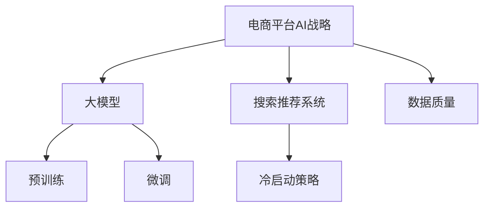

                 

# 电商平台的AI 大模型战略：搜索推荐系统是核心，冷启动策略与数据质量并重

> 关键词：电商，AI，大模型，搜索推荐系统，冷启动策略，数据质量

## 1. 背景介绍

在电商领域，搜索推荐系统是提升用户体验、增加交易转化率的关键。传统搜索引擎以关键词匹配为基础，存在冷启动问题、精度不高、泛化能力弱等缺点。近年来，基于大模型的推荐系统在电商行业逐渐流行起来，由于其强大的泛化能力和学习能力，为用户提供了更加精准的搜索推荐服务。本文将从电商平台的AI战略、搜索推荐系统以及冷启动策略和数据质量两个维度，探讨大模型在电商推荐中的应用。

## 2. 核心概念与联系

### 2.1 核心概念概述

电商平台的AI战略，主要集中在通过人工智能技术，如深度学习、自然语言处理、计算机视觉等，来提升电商平台的运营效率和用户体验。大模型是指在大型语料库上预训练的深度学习模型，具有强大的语言理解和生成能力，可以应用于多种NLP任务，如情感分析、命名实体识别、问答系统、机器翻译、文本摘要等。

搜索推荐系统（Search and Recommendation System）是电商平台上用户获取商品信息、发现商品推荐的关键技术。传统的关键词搜索存在冷启动问题、召回率低等缺点。近年来，基于大模型的推荐系统，特别是基于预训练语言模型的推荐系统，通过在预训练的基础上，微调特定任务的模型，可以更好地解决这些问题。

冷启动策略（Cold-start Strategy）是推荐系统中的一个重要概念，指用户在平台初期没有足够的历史行为数据时，推荐系统如何为其推荐相关商品的问题。传统推荐系统往往通过依靠少量静态特征或者用户信息进行推荐，效果有限。而基于大模型的推荐系统可以学习用户与商品的复杂关系，更高效地解决冷启动问题。

数据质量（Data Quality）指的是推荐系统使用的数据样本的准确性、全面性和多样性。数据质量的好坏直接影响了推荐系统的效果。

这些概念之间的关系可以通过以下Mermaid流程图来展示：



这个流程图展示了核心概念之间的逻辑关系：

1. 电商平台的AI战略涵盖了包括大模型在内的多种AI技术，提升电商平台的运营效率和用户体验。
2. 大模型通过预训练获得基础的语言表示，再通过微调应用到特定的推荐任务。
3. 搜索推荐系统是大模型在电商领域的主要应用场景。
4. 冷启动策略和大数据质量是搜索推荐系统成功的关键。

## 3. 核心算法原理 & 具体操作步骤
### 3.1 算法原理概述

基于大模型的推荐系统，通常采用Encoder-Decoder架构。其中Encoder负责将用户的输入（如搜索查询、历史行为、静态特征等）编码成低维度的向量表示，Decoder则通过这些向量生成推荐结果。在训练过程中，模型会根据历史的用户行为数据进行优化，使得模型能够更好地预测用户的未来行为。

在电商推荐系统中，模型往往需要将用户的输入和商品特征进行拼接，然后经过多层的Transformer结构进行处理，最后输出商品的预测评分或者推荐列表。模型的训练目标通常是最大化预测结果与实际行为的匹配程度，如通过交叉熵损失函数来最小化预测值与真实标签之间的差距。

### 3.2 算法步骤详解

1. **数据预处理**：收集电商平台的交易数据、用户行为数据、商品描述数据、用户画像数据等，并将这些数据进行清洗、去重、归一化等处理。

2. **模型选择与构建**：选择合适的预训练模型（如BERT、GPT、RoBERTa等），并根据电商推荐系统的需求构建Encoder和Decoder模块。在Encoder中，可以将用户输入和商品特征拼接为一个向量，然后通过多个Transformer层进行处理。在Decoder中，可以设计一个全连接层将Encoder的输出映射成推荐评分。

3. **微调与优化**：在构建好模型后，将其在大规模标注数据上进行微调，最小化预测结果与实际行为的差距。可以使用Adam、SGD等优化器，并设置合适的学习率、批大小、迭代轮数等超参数。

4. **冷启动策略**：对于新用户或者新商品，推荐系统需要通过一些冷启动策略来弥补数据不足的问题。常见的方法包括基于商品特征的推荐、基于用户画像的推荐、基于相关性计算的推荐等。

5. **数据质量提升**：推荐系统的效果很大程度上取决于数据的质量，因此需要不断优化数据收集、清洗、存储等环节，提高数据的准确性、全面性和多样性。

### 3.3 算法优缺点

基于大模型的推荐系统具有以下优点：

- 精度高：通过预训练获得广泛的语言知识，微调后的模型能够更准确地理解用户需求和商品特性。
- 泛化能力强：大模型能够处理多种NLP任务，应用于推荐系统时也能适应不同的用户行为模式。
- 参数高效：可以通过参数高效微调方法（如Adapter、LoRA等）减少模型规模，提升推理效率。

但同时，这些系统也存在以下缺点：

- 数据依赖性强：推荐系统的效果很大程度上依赖于数据的质量和多样性，数据采集和处理成本高。
- 冷启动问题：对于新用户和新商品，推荐系统需要一些冷启动策略来解决数据不足的问题。
- 模型复杂度高：大规模模型的计算和存储成本高，推理速度较慢。

### 3.4 算法应用领域

大模型的推荐系统在电商领域有着广泛的应用，包括：

- 商品搜索：用户输入查询词，推荐系统根据查询词和商品特征生成推荐结果。
- 商品推荐：根据用户的历史行为和静态特征，推荐系统输出相关商品。
- 广告推荐：根据用户的浏览行为和兴趣偏好，推荐系统推荐广告内容。
- 个性化推荐：根据用户画像和行为数据，推荐系统输出个性化推荐结果。
- 活动推荐：根据用户的购物行为和历史数据，推荐系统推荐促销活动。

这些应用场景中，大模型通过微调，能够从大量的数据中学习到用户和商品的复杂关系，从而提供更加精准和个性化的推荐服务。

## 4. 数学模型和公式 & 详细讲解
### 4.1 数学模型构建

基于大模型的推荐系统可以表示为：

$$
\begin{aligned}
\hat{y} &= f_\theta(x_i, \mathbf{f}_1, \mathbf{f}_2, \dots, \mathbf{f}_n) \\
\text{loss} &= \frac{1}{N}\sum_{i=1}^N \ell(\hat{y}_i, y_i)
\end{aligned}
$$

其中，$f_\theta$表示模型在给定输入和商品特征向量时，预测商品评分或推荐结果的函数；$x_i$表示用户输入，如搜索查询、浏览记录等；$\mathbf{f}_i$表示商品特征向量；$\ell$表示损失函数，如均方误差、交叉熵等。

### 4.2 公式推导过程

以交叉熵损失函数为例，其计算公式如下：

$$
\text{loss} = -\frac{1}{N}\sum_{i=1}^N \sum_{j=1}^{C} y_{ij}\log \hat{y}_{ij}
$$

其中，$y_{ij}$表示样本$i$的真实标签（0或1），$\hat{y}_{ij}$表示模型预测的样本$i$在类别$j$上的概率。

在实际应用中，我们通常将用户输入和商品特征拼接为一个向量$x_{i,j}$，然后通过Encoder模块得到低维表示，再将其输入Decoder模块进行预测。具体的数学公式如下：

$$
\begin{aligned}
h_{i,j} &= f_\theta(x_{i,j}, \mathbf{f}_i) \\
\hat{y}_{ij} &= \sigma(W h_{i,j}) \\
\text{loss} &= -\frac{1}{N}\sum_{i=1}^N \sum_{j=1}^{C} y_{ij}\log \hat{y}_{ij}
\end{aligned}
$$

其中，$W$表示Decoder中的全连接层权重矩阵，$\sigma$表示激活函数。

### 4.3 案例分析与讲解

以电商推荐系统为例，假设用户输入查询词“运动鞋”，模型通过拼接查询词和商品特征向量生成低维表示，再输入Decoder进行评分预测。假设模型输出三个推荐商品，每个商品有一个评分，计算损失函数如下：

$$
\text{loss} = -\frac{1}{3}\left( \log \hat{y}_{1} + \log \hat{y}_{2} + \log \hat{y}_{3} \right)
$$

在实际应用中，为了提升模型的泛化能力，我们通常会将模型在大规模标注数据上微调。例如，假设有一批用户的搜索查询和商品评分数据，其中每个用户有10个搜索查询，每个查询对应3个商品评分。我们可以将查询和商品特征拼接为一个向量，输入模型进行训练。在训练过程中，模型会根据实际评分进行反向传播，最小化预测评分与真实评分之间的差距。

## 5. 项目实践：代码实例和详细解释说明
### 5.1 开发环境搭建

在进行大模型推荐系统开发前，我们需要准备好开发环境。以下是使用Python进行PyTorch开发的环境配置流程：

1. 安装Anaconda：从官网下载并安装Anaconda，用于创建独立的Python环境。

2. 创建并激活虚拟环境：
```bash
conda create -n pytorch-env python=3.8 
conda activate pytorch-env
```

3. 安装PyTorch：根据CUDA版本，从官网获取对应的安装命令。例如：
```bash
conda install pytorch torchvision torchaudio cudatoolkit=11.1 -c pytorch -c conda-forge
```

4. 安装TensorFlow：由Google主导开发的开源深度学习框架，生产部署方便，适合大规模工程应用。同样有丰富的预训练语言模型资源。

5. 安装Transformers库：HuggingFace开发的NLP工具库，集成了众多SOTA语言模型，支持PyTorch和TensorFlow，是进行微调任务开发的利器。

6. 安装各类工具包：
```bash
pip install numpy pandas scikit-learn matplotlib tqdm jupyter notebook ipython
```

完成上述步骤后，即可在`pytorch-env`环境中开始微调实践。

### 5.2 源代码详细实现

下面以推荐系统为例，给出使用PyTorch实现的大模型推荐系统代码实现。

首先，定义推荐系统的数据处理函数：

```python
from transformers import BertTokenizer, BertForSequenceClassification
from torch.utils.data import Dataset
import torch

class RecommendationDataset(Dataset):
    def __init__(self, texts, features, labels, tokenizer, max_len=128):
        self.texts = texts
        self.features = features
        self.labels = labels
        self.tokenizer = tokenizer
        self.max_len = max_len
        
    def __len__(self):
        return len(self.texts)
    
    def __getitem__(self, item):
        text = self.texts[item]
        features = self.features[item]
        labels = self.labels[item]
        
        encoding = self.tokenizer(text, return_tensors='pt', max_length=self.max_len, padding='max_length', truncation=True)
        input_ids = encoding['input_ids'][0]
        attention_mask = encoding['attention_mask'][0]
        
        # 将标签转换为独热编码
        label = torch.zeros(2)
        label[0] = labels[item]
        
        return {'input_ids': input_ids, 
                'attention_mask': attention_mask,
                'labels': label}

# 创建dataset
tokenizer = BertTokenizer.from_pretrained('bert-base-cased')
train_dataset = RecommendationDataset(train_texts, train_features, train_labels, tokenizer)
dev_dataset = RecommendationDataset(dev_texts, dev_features, dev_labels, tokenizer)
test_dataset = RecommendationDataset(test_texts, test_features, test_labels, tokenizer)
```

然后，定义模型和优化器：

```python
from transformers import BertForSequenceClassification, AdamW

model = BertForSequenceClassification.from_pretrained('bert-base-cased', num_labels=2)

optimizer = AdamW(model.parameters(), lr=2e-5)
```

接着，定义训练和评估函数：

```python
from torch.utils.data import DataLoader
from tqdm import tqdm
from sklearn.metrics import classification_report

device = torch.device('cuda') if torch.cuda.is_available() else torch.device('cpu')
model.to(device)

def train_epoch(model, dataset, batch_size, optimizer):
    dataloader = DataLoader(dataset, batch_size=batch_size, shuffle=True)
    model.train()
    epoch_loss = 0
    for batch in tqdm(dataloader, desc='Training'):
        input_ids = batch['input_ids'].to(device)
        attention_mask = batch['attention_mask'].to(device)
        labels = batch['labels'].to(device)
        model.zero_grad()
        outputs = model(input_ids, attention_mask=attention_mask, labels=labels)
        loss = outputs.loss
        epoch_loss += loss.item()
        loss.backward()
        optimizer.step()
    return epoch_loss / len(dataloader)

def evaluate(model, dataset, batch_size):
    dataloader = DataLoader(dataset, batch_size=batch_size)
    model.eval()
    preds, labels = [], []
    with torch.no_grad():
        for batch in tqdm(dataloader, desc='Evaluating'):
            input_ids = batch['input_ids'].to(device)
            attention_mask = batch['attention_mask'].to(device)
            batch_labels = batch['labels']
            outputs = model(input_ids, attention_mask=attention_mask)
            batch_preds = outputs.logits.argmax(dim=2).to('cpu').tolist()
            batch_labels = batch_labels.to('cpu').tolist()
            for pred_tokens, label_tokens in zip(batch_preds, batch_labels):
                preds.append(pred_tokens[:len(label_tokens)])
                labels.append(label_tokens)
                
    print(classification_report(labels, preds))
```

最后，启动训练流程并在测试集上评估：

```python
epochs = 5
batch_size = 16

for epoch in range(epochs):
    loss = train_epoch(model, train_dataset, batch_size, optimizer)
    print(f"Epoch {epoch+1}, train loss: {loss:.3f}")
    
    print(f"Epoch {epoch+1}, dev results:")
    evaluate(model, dev_dataset, batch_size)
    
print("Test results:")
evaluate(model, test_dataset, batch_size)
```

以上就是使用PyTorch对BERT进行推荐系统微调的完整代码实现。可以看到，得益于Transformers库的强大封装，我们可以用相对简洁的代码完成BERT模型的加载和微调。

### 5.3 代码解读与分析

让我们再详细解读一下关键代码的实现细节：

**RecommendationDataset类**：
- `__init__`方法：初始化文本、特征、标签、分词器等关键组件。
- `__len__`方法：返回数据集的样本数量。
- `__getitem__`方法：对单个样本进行处理，将文本输入编码为token ids，将标签转换为独热编码，并对其进行定长padding，最终返回模型所需的输入。

**tokenizer**：
- 定义了查询和商品特征的拼接方式，用于将输入文本编码为token ids。

**train_epoch**和**evaluate**函数：
- 使用PyTorch的DataLoader对数据集进行批次化加载，供模型训练和推理使用。
- 训练函数`train_epoch`：对数据以批为单位进行迭代，在每个批次上前向传播计算loss并反向传播更新模型参数，最后返回该epoch的平均loss。
- 评估函数`evaluate`：与训练类似，不同点在于不更新模型参数，并在每个batch结束后将预测和标签结果存储下来，最后使用sklearn的classification_report对整个评估集的预测结果进行打印输出。

**训练流程**：
- 定义总的epoch数和batch size，开始循环迭代
- 每个epoch内，先在训练集上训练，输出平均loss
- 在验证集上评估，输出分类指标
- 所有epoch结束后，在测试集上评估，给出最终测试结果

可以看到，PyTorch配合Transformers库使得BERT微调的代码实现变得简洁高效。开发者可以将更多精力放在数据处理、模型改进等高层逻辑上，而不必过多关注底层的实现细节。

当然，工业级的系统实现还需考虑更多因素，如模型的保存和部署、超参数的自动搜索、更灵活的任务适配层等。但核心的微调范式基本与此类似。

## 6. 实际应用场景
### 6.1 智能客服系统

基于大语言模型微调的推荐系统，可以广泛应用于智能客服系统的构建。传统客服往往需要配备大量人力，高峰期响应缓慢，且一致性和专业性难以保证。而使用微调后的推荐系统，可以7x24小时不间断服务，快速响应客户咨询，用自然流畅的语言进行推荐和对话。

在技术实现上，可以收集企业内部的历史客服对话记录，将问题-商品推荐对作为微调数据，训练模型学习匹配推荐商品。对于客户提出的新问题，还可以接入检索系统实时搜索相关商品，动态生成推荐答案。如此构建的智能客服系统，能大幅提升客户咨询体验和问题解决效率。

### 6.2 金融舆情监测

金融机构需要实时监测市场舆论动向，以便及时应对负面信息传播，规避金融风险。传统的人工监测方式成本高、效率低，难以应对网络时代海量信息爆发的挑战。基于大语言模型微调的文本分类和情感分析技术，为金融舆情监测提供了新的解决方案。

具体而言，可以收集金融领域相关的新闻、报道、评论等文本数据，并对其进行主题标注和情感标注。在此基础上对预训练语言模型进行微调，使其能够自动判断文本属于何种主题，情感倾向是正面、中性还是负面。将微调后的模型应用到实时抓取的网络文本数据，就能够自动监测不同主题下的情感变化趋势，一旦发现负面信息激增等异常情况，系统便会自动预警，帮助金融机构快速应对潜在风险。

### 6.3 个性化推荐系统

当前的推荐系统往往只依赖用户的历史行为数据进行物品推荐，无法深入理解用户的真实兴趣偏好。基于大语言模型微调的推荐系统，可以更好地挖掘用户行为背后的语义信息，从而提供更精准、多样的推荐内容。

在实践中，可以收集用户浏览、点击、评论、分享等行为数据，提取和用户交互的物品标题、描述、标签等文本内容。将文本内容作为模型输入，用户的后续行为（如是否点击、购买等）作为监督信号，在此基础上微调预训练语言模型。微调后的模型能够从文本内容中准确把握用户的兴趣点。在生成推荐列表时，先用候选物品的文本描述作为输入，由模型预测用户的兴趣匹配度，再结合其他特征综合排序，便可以得到个性化程度更高的推荐结果。

### 6.4 未来应用展望

随着大语言模型和微调方法的不断发展，基于微调范式将在更多领域得到应用，为传统行业带来变革性影响。

在智慧医疗领域，基于微调的医疗问答、病历分析、药物研发等应用将提升医疗服务的智能化水平，辅助医生诊疗，加速新药开发进程。

在智能教育领域，微调技术可应用于作业批改、学情分析、知识推荐等方面，因材施教，促进教育公平，提高教学质量。

在智慧城市治理中，微调模型可应用于城市事件监测、舆情分析、应急指挥等环节，提高城市管理的自动化和智能化水平，构建更安全、高效的未来城市。

此外，在企业生产、社会治理、文娱传媒等众多领域，基于大模型微调的人工智能应用也将不断涌现，为NLP技术带来了全新的突破。相信随着预训练语言模型和微调方法的持续演进，大语言模型微调必将在构建人机协同的智能时代中扮演越来越重要的角色。

## 7. 工具和资源推荐
### 7.1 学习资源推荐

为了帮助开发者系统掌握大模型微调的理论基础和实践技巧，这里推荐一些优质的学习资源：

1. 《Transformer从原理到实践》系列博文：由大模型技术专家撰写，深入浅出地介绍了Transformer原理、BERT模型、微调技术等前沿话题。

2. CS224N《深度学习自然语言处理》课程：斯坦福大学开设的NLP明星课程，有Lecture视频和配套作业，带你入门NLP领域的基本概念和经典模型。

3. 《Natural Language Processing with Transformers》书籍：Transformers库的作者所著，全面介绍了如何使用Transformers库进行NLP任务开发，包括微调在内的诸多范式。

4. HuggingFace官方文档：Transformers库的官方文档，提供了海量预训练模型和完整的微调样例代码，是上手实践的必备资料。

5. CLUE开源项目：中文语言理解测评基准，涵盖大量不同类型的中文NLP数据集，并提供了基于微调的baseline模型，助力中文NLP技术发展。

通过对这些资源的学习实践，相信你一定能够快速掌握大模型微调的精髓，并用于解决实际的NLP问题。
###  7.2 开发工具推荐

高效的开发离不开优秀的工具支持。以下是几款用于大模型微调开发的常用工具：

1. PyTorch：基于Python的开源深度学习框架，灵活动态的计算图，适合快速迭代研究。大部分预训练语言模型都有PyTorch版本的实现。

2. TensorFlow：由Google主导开发的开源深度学习框架，生产部署方便，适合大规模工程应用。同样有丰富的预训练语言模型资源。

3. Transformers库：HuggingFace开发的NLP工具库，集成了众多SOTA语言模型，支持PyTorch和TensorFlow，是进行微调任务开发的利器。

4. Weights & Biases：模型训练的实验跟踪工具，可以记录和可视化模型训练过程中的各项指标，方便对比和调优。与主流深度学习框架无缝集成。

5. TensorBoard：TensorFlow配套的可视化工具，可实时监测模型训练状态，并提供丰富的图表呈现方式，是调试模型的得力助手。

6. Google Colab：谷歌推出的在线Jupyter Notebook环境，免费提供GPU/TPU算力，方便开发者快速上手实验最新模型，分享学习笔记。

合理利用这些工具，可以显著提升大模型微调任务的开发效率，加快创新迭代的步伐。

### 7.3 相关论文推荐

大语言模型和微调技术的发展源于学界的持续研究。以下是几篇奠基性的相关论文，推荐阅读：

1. Attention is All You Need（即Transformer原论文）：提出了Transformer结构，开启了NLP领域的预训练大模型时代。

2. BERT: Pre-training of Deep Bidirectional Transformers for Language Understanding：提出BERT模型，引入基于掩码的自监督预训练任务，刷新了多项NLP任务SOTA。

3. Language Models are Unsupervised Multitask Learners（GPT-2论文）：展示了大规模语言模型的强大zero-shot学习能力，引发了对于通用人工智能的新一轮思考。

4. Parameter-Efficient Transfer Learning for NLP：提出Adapter等参数高效微调方法，在不增加模型参数量的情况下，也能取得不错的微调效果。

5. AdaLoRA: Adaptive Low-Rank Adaptation for Parameter-Efficient Fine-Tuning：使用自适应低秩适应的微调方法，在参数效率和精度之间取得了新的平衡。

这些论文代表了大语言模型微调技术的发展脉络。通过学习这些前沿成果，可以帮助研究者把握学科前进方向，激发更多的创新灵感。

## 8. 总结：未来发展趋势与挑战
### 8.1 总结

本文对基于大模型的电商推荐系统进行了全面系统的介绍。首先阐述了电商平台的AI战略、搜索推荐系统以及冷启动策略和数据质量两个维度，探讨大模型在电商推荐中的应用。具体而言，通过深入分析大模型在电商推荐系统中的构建原理和操作步骤，揭示了其强大的泛化能力和学习能力。同时，我们也展示了冷启动策略和数据质量在大模型推荐系统中的重要性和处理方式。

通过本文的系统梳理，可以看到，基于大模型的电商推荐系统能够有效提升用户搜索和推荐体验，助力电商平台提高交易转化率。但面对高昂的数据采集和处理成本，冷启动问题和数据质量挑战依然亟需解决。随着技术的不断进步，相信这些难题终将一一被攻克，大模型推荐系统必将在电商领域发挥更大的作用。

### 8.2 未来发展趋势

展望未来，大模型推荐系统在电商领域将呈现以下几个发展趋势：

1. 模型规模持续增大。随着算力成本的下降和数据规模的扩张，预训练语言模型的参数量还将持续增长。超大规模语言模型蕴含的丰富语言知识，有望支撑更加复杂多变的推荐任务。

2. 推荐模型多样化。除了传统的基于搜索查询的推荐模型，未来的推荐系统可能会引入更多模态的数据，如视觉、语音、时间序列等，以提升推荐的多样性和个性化。

3. 用户画像精细化。未来的推荐系统将更注重用户画像的构建，通过动态更新用户画像，实时生成推荐结果，提升推荐的相关性和时效性。

4. 推荐效果实时化。随着实时计算技术的发展，推荐系统将能够动态调整推荐策略，根据用户行为实时生成个性化推荐结果。

5. 推荐系统智能化。未来的推荐系统将融合更多智能化的技术，如因果推断、知识图谱等，提升推荐决策的合理性和透明性。

以上趋势凸显了大模型推荐系统在电商领域的发展潜力。这些方向的探索发展，必将进一步提升推荐系统的精度和效果，为电商平台带来更大的商业价值。

### 8.3 面临的挑战

尽管大模型推荐系统在电商领域展现了强大的潜力，但在迈向更加智能化、普适化应用的过程中，它仍面临着诸多挑战：

1. 数据依赖性强。推荐系统的效果很大程度上依赖于数据的质量和多样性，数据采集和处理成本高。

2. 冷启动问题。对于新用户和新商品，推荐系统需要一些冷启动策略来解决数据不足的问题。

3. 模型复杂度高。大规模模型的计算和存储成本高，推理速度较慢。

4. 数据隐私和安全。推荐系统需要收集和处理大量的用户数据，如何保护用户隐私和数据安全，是一个重要的挑战。

5. 公平性和偏见。大模型推荐系统需要避免推荐偏倚，确保所有用户都能获得公平的推荐结果。

6. 模型鲁棒性。面对恶意攻击和数据扰动，推荐系统需要具备足够的鲁棒性，确保推荐的稳定性和准确性。

以上挑战使得大模型推荐系统在电商领域的应用仍需不断优化和改进。唯有从数据、算法、工程、业务等多个维度协同发力，才能真正实现智能推荐系统在电商平台的落地。

### 8.4 研究展望

面对大模型推荐系统所面临的挑战，未来的研究需要在以下几个方面寻求新的突破：

1. 探索无监督和半监督微调方法。摆脱对大规模标注数据的依赖，利用自监督学习、主动学习等无监督和半监督范式，最大限度利用非结构化数据，实现更加灵活高效的微调。

2. 研究参数高效和计算高效的微调范式。开发更加参数高效的微调方法，在固定大部分预训练参数的同时，只更新极少量的任务相关参数。同时优化微调模型的计算图，减少前向传播和反向传播的资源消耗，实现更加轻量级、实时性的部署。

3. 融合因果和对比学习范式。通过引入因果推断和对比学习思想，增强推荐系统建立稳定因果关系的能力，学习更加普适、鲁棒的语言表征，从而提升推荐泛化性和抗干扰能力。

4. 引入更多先验知识。将符号化的先验知识，如知识图谱、逻辑规则等，与神经网络模型进行巧妙融合，引导微调过程学习更准确、合理的语言模型。同时加强不同模态数据的整合，实现视觉、语音等多模态信息与文本信息的协同建模。

5. 结合因果分析和博弈论工具。将因果分析方法引入推荐系统，识别出推荐决策的关键特征，增强推荐输出的解释性和逻辑性。借助博弈论工具刻画人机交互过程，主动探索并规避推荐的脆弱点，提高系统稳定性。

6. 纳入伦理道德约束。在推荐系统训练目标中引入伦理导向的评估指标，过滤和惩罚有偏见、有害的输出倾向。同时加强人工干预和审核，建立推荐行为的监管机制，确保推荐符合人类价值观和伦理道德。

这些研究方向的探索，必将引领大模型推荐系统在电商领域迈向更高的台阶，为电商平台带来更大的商业价值。未来，随着技术的不断进步，大模型推荐系统必将在电商领域发挥更大的作用。

## 9. 附录：常见问题与解答

**Q1：大语言模型推荐系统是否适用于所有电商推荐场景？**

A: 大语言模型推荐系统在电商推荐中具有强大的泛化能力和学习能力，适用于大多数电商推荐场景。但对于一些特殊领域或小众商品，由于缺乏足够的数据，推荐系统可能无法提供理想的推荐结果。此时需要在特定领域或小众商品上，引入更多的先验知识和数据，以提升推荐效果。

**Q2：在推荐系统中如何缓解冷启动问题？**

A: 冷启动问题是推荐系统中的一个重要挑战，常见的方法包括基于商品特征的推荐、基于用户画像的推荐、基于相关性计算的推荐等。

1. 基于商品特征的推荐：利用商品的属性、品牌、价格等静态特征进行推荐，适用于商品信息丰富的场景。
2. 基于用户画像的推荐：通过用户的基本信息、历史行为、兴趣偏好等动态特征进行推荐，适用于用户行为数据丰富的场景。
3. 基于相关性计算的推荐：利用用户与商品之间的相似度进行推荐，适用于推荐精度要求高的场景。

此外，还可以引入主动学习和强化学习等技术，通过与用户交互，逐步学习用户的兴趣偏好，动态调整推荐策略。

**Q3：推荐系统如何提高数据质量？**

A: 推荐系统的效果很大程度上取决于数据的质量，因此需要不断优化数据收集、清洗、存储等环节，提高数据的准确性、全面性和多样性。

1. 数据采集：采集高质量的数据源，如电商平台交易数据、用户行为数据、商品描述数据等。
2. 数据清洗：对采集到的数据进行去重、去噪、归一化等处理，保证数据的准确性和一致性。
3. 数据标注：对于关键特征和标签进行手动标注，保证数据的可靠性和真实性。
4. 数据扩展：通过数据增强技术，如近义词替换、同义词生成等，丰富数据的多样性和全面性。

合理利用以上方法，可以有效提升推荐系统的数据质量，从而提升推荐效果。

**Q4：如何确保推荐系统的公平性和偏见？**

A: 推荐系统需要避免推荐偏倚，确保所有用户都能获得公平的推荐结果。常见的方法包括：

1. 数据平衡：采集均衡的数据源，避免某些用户或商品的数据过少。
2. 模型公平性：在模型训练目标中引入公平性导向的评估指标，过滤和惩罚有偏见、有害的输出倾向。
3. 人工干预：加强人工干预和审核，建立推荐行为的监管机制，确保推荐符合人类价值观和伦理道德。

这些方法可以有效地提高推荐系统的公平性和偏见，提升推荐系统的可信度和用户满意度。

---

作者：禅与计算机程序设计艺术 / Zen and the Art of Computer Programming

