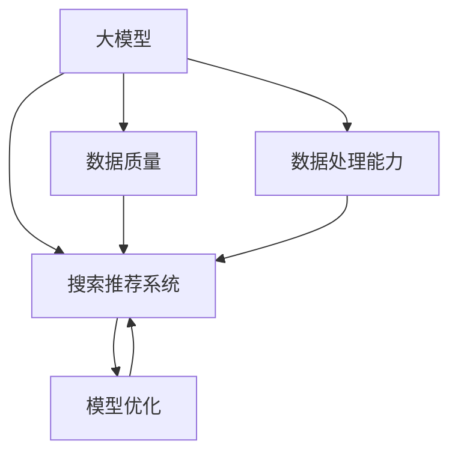

                 

# 电商平台的AI 大模型战略：搜索推荐系统是核心，数据质量与处理能力

## 1. 背景介绍

随着互联网和电子商务的快速发展，各大电商平台正面临着前所未有的机遇与挑战。通过人工智能技术，尤其是大模型（Large Model）在搜索推荐系统中的广泛应用，电商平台不仅提升了用户体验，还大幅提高了运营效率和转化率。特别是在个性化推荐、商品搜索等核心应用中，大模型展现出了强大的生命力和潜力。

### 1.1 问题由来

在电商平台上，用户如何准确找到所需商品？商品如何精准地推荐给用户？这些问题一直困扰着电商平台。传统的数据驱动方法，如简单的关联规则、协同过滤等，由于其简单、高效的特性，在早期电商中起到了重要作用。但随着用户需求的多样化和个性化程度不断提高，这些方法已难以满足用户和平台的需求。

大数据和深度学习的兴起，使得基于大模型的搜索推荐系统成为可能。深度学习模型的强大表现力和大数据处理的灵活性，使得电商平台的搜索推荐系统可以实现前所未有的精准度和覆盖度。

## 2. 核心概念与联系

### 2.1 核心概念概述

为更好地理解基于大模型的搜索推荐系统，本节将介绍几个密切相关的核心概念：

- **大模型（Large Model）**：以深度神经网络为代表的，参数量巨大、学习能力强、覆盖范围广的模型。典型代表如BERT、GPT、DALL-E等。大模型在电商平台的搜索推荐系统中扮演着核心角色。

- **搜索推荐系统（Search and Recommendation System）**：根据用户的行为数据和偏好，实时地推荐相关商品给用户，并为用户提供搜索入口。电商平台的核心业务功能之一。

- **数据质量（Data Quality）**：指数据的完整性、一致性、准确性和及时性。高质量的数据是大模型高效训练和准确推理的基础。

- **数据处理能力（Data Processing Capability）**：指对大量数据进行清洗、标注、转换等预处理的能力。大模型需要海量标注数据来训练，数据处理能力决定了模型的表现。

- **模型优化（Model Optimization）**：指在模型训练和推理过程中，对模型进行优化，提升性能、降低资源消耗的过程。

- **微调（Fine-Tuning）**：指在预训练模型的基础上，通过少量标注数据对模型进行微调，适应特定任务的过程。

这些核心概念之间的逻辑关系可以通过以下Mermaid流程图来展示：



这个流程图展示了大模型在搜索推荐系统中的核心作用，以及数据质量、数据处理能力和模型优化对其支持的作用。

## 3. 核心算法原理 & 具体操作步骤

### 3.1 算法原理概述

基于大模型的电商搜索推荐系统，主要依赖于深度学习中的自监督和监督学习方法。其核心思想是通过大模型学习用户行为和商品属性之间的复杂关系，预测用户对商品的兴趣和需求，从而实现个性化的推荐和搜索。

在搜索推荐系统中，常见的深度学习模型包括：
- 循环神经网络（RNN）
- 卷积神经网络（CNN）
- 注意力机制（Attention Mechanism）
- Transformer
- BERT
- GPT

这些模型在电商平台的搜索推荐系统中得到了广泛应用。

### 3.2 算法步骤详解

基于大模型的电商搜索推荐系统的构建一般包括以下几个关键步骤：

**Step 1: 数据收集与预处理**
- 收集电商平台的用户行为数据，如浏览、点击、购买、评分等。
- 对原始数据进行清洗、去重、归一化等预处理。

**Step 2: 构建模型输入**
- 将预处理后的数据转化为模型输入，如将用户行为表示为序列、向量、标签等。
- 设计合适的损失函数，如交叉熵、均方误差等，用于模型训练。

**Step 3: 模型训练**
- 使用大模型进行预训练，如BERT、GPT等。
- 在预训练模型基础上，通过监督学习或自监督学习进行微调，适应特定任务。
- 设置合适的优化算法，如Adam、SGD等，调整模型参数。

**Step 4: 模型评估与优化**
- 在验证集上评估模型性能，如精度、召回率、F1分数等。
- 根据评估结果，调整模型超参数，如学习率、批次大小等。
- 继续在训练集上迭代训练，直到满足预设的停止条件。

**Step 5: 模型部署与应用**
- 将训练好的模型部署到电商平台的推荐和搜索系统中。
- 实时接收用户请求，进行商品推荐和搜索结果排序。
- 定期收集新数据，对模型进行重新微调或优化，保持模型性能。

### 3.3 算法优缺点

基于大模型的电商搜索推荐系统有以下优点：
- 准确性高：大模型能够学习到用户和商品的复杂关系，推荐和搜索的准确性大大提升。
- 泛化能力强：大模型对新数据和新用户具有较强的适应能力。
- 覆盖范围广：大模型可以处理海量的数据和复杂的业务场景。

但该方法也存在一些缺点：
- 数据依赖度高：大模型的训练和微调需要大量标注数据，对标注成本和时间投入要求高。
- 资源消耗大：大模型的参数量巨大，训练和推理需要高性能的计算资源。
- 模型解释性差：大模型通常是"黑盒"模型，难以解释其内部工作机制。

尽管如此，基于大模型的电商搜索推荐系统在个性化推荐、商品搜索等方面展现了强大的优势，是电商平台提高用户体验和运营效率的重要手段。

### 3.4 算法应用领域

基于大模型的电商搜索推荐系统在电商平台的多个应用场景中得到了广泛应用：

- **个性化推荐**：根据用户的历史行为和偏好，实时推荐相关商品。通过微调模型，可以提升推荐系统的准确性和用户满意度。
- **商品搜索**：根据用户的搜索查询，快速返回相关商品。通过训练和优化，可以提升搜索结果的相关性和排序效果。
- **广告投放**：根据用户行为和偏好，精准投放广告。通过微调模型，可以提升广告的效果和转化率。
- **客服系统**：根据用户咨询记录，智能推荐相关问题和解决方案。通过微调模型，可以提升客服系统的响应速度和准确性。

## 4. 数学模型和公式 & 详细讲解

### 4.1 数学模型构建

本节将使用数学语言对基于大模型的电商搜索推荐系统进行更加严格的刻画。

记用户行为序列为 $x=\{x_1, x_2, ..., x_T\}$，其中 $x_t \in \mathcal{X}$ 表示第 $t$ 个用户行为。记商品属性向量为 $y=\{y_1, y_2, ..., y_N\}$，其中 $y_i \in \mathcal{Y}$ 表示第 $i$ 个商品的属性向量。

假设模型 $M_{\theta}$ 在输入 $x$ 上的输出为 $\hat{y}=M_{\theta}(x)$，表示模型对商品 $y$ 的预测概率分布。则模型的损失函数为：

$$
\mathcal{L}(\theta) = -\frac{1}{N}\sum_{i=1}^N \sum_{t=1}^T y_{it} \log M_{\theta}(x_t) + (1-y_{it}) \log (1-M_{\theta}(x_t))
$$

其中 $y_{it}$ 为第 $i$ 个商品在第 $t$ 个用户行为上的标签（1表示该用户购买了该商品，0表示未购买）。

### 4.2 公式推导过程

以下我们以基于Attention机制的推荐模型为例，推导推荐模型损失函数的计算公式。

在Attention机制中，模型的预测输出 $\hat{y}$ 由用户行为序列 $x$ 和商品属性向量 $y$ 计算得出。具体而言，设 $W$ 为线性变换层，$U$ 为Attention层，$V$ 为输出层，则推荐模型的输出为：

$$
\hat{y} = \sigma(Wx)Uy
$$

其中 $\sigma$ 为激活函数，$\sigma$ 可以是Softmax函数。

模型的损失函数为：

$$
\mathcal{L}(\theta) = -\frac{1}{N}\sum_{i=1}^N \sum_{t=1}^T y_{it} \log M_{\theta}(x_t) + (1-y_{it}) \log (1-M_{\theta}(x_t))
$$

根据链式法则，损失函数对模型参数 $\theta$ 的梯度为：

$$
\nabla_{\theta}\mathcal{L}(\theta) = -\frac{1}{N}\sum_{i=1}^N \sum_{t=1}^T y_{it} \nabla_{\theta}\log M_{\theta}(x_t) + (1-y_{it}) \nabla_{\theta}\log (1-M_{\theta}(x_t))
$$

在得到损失函数的梯度后，即可带入参数更新公式，完成模型的迭代优化。重复上述过程直至收敛，最终得到适应电商推荐任务的最优模型参数 $\theta^*$。

## 5. 项目实践：代码实例和详细解释说明

### 5.1 开发环境搭建

在进行推荐系统开发前，我们需要准备好开发环境。以下是使用Python进行PyTorch开发的环境配置流程：

1. 安装Anaconda：从官网下载并安装Anaconda，用于创建独立的Python环境。

2. 创建并激活虚拟环境：
```bash
conda create -n pytorch-env python=3.8 
conda activate pytorch-env
```

3. 安装PyTorch：根据CUDA版本，从官网获取对应的安装命令。例如：
```bash
conda install pytorch torchvision torchaudio cudatoolkit=11.1 -c pytorch -c conda-forge
```

4. 安装其他相关库：
```bash
pip install numpy pandas scikit-learn torchtext transformers transformers
```

完成上述步骤后，即可在`pytorch-env`环境中开始推荐系统开发。

### 5.2 源代码详细实现

下面以基于BERT的电商推荐系统为例，给出使用PyTorch进行电商推荐系统开发的代码实现。

首先，定义推荐模型的输入输出格式：

```python
class RecommendationModel(nn.Module):
    def __init__(self, embedding_dim, hidden_dim, output_dim):
        super(RecommendationModel, self).__init__()
        self.embedding = nn.Embedding(in_features=vocab_size, out_features=embedding_dim)
        self.attention = nn.MultiheadAttention(embed_dim=embedding_dim, num_heads=8)
        self.fc = nn.Linear(in_features=embedding_dim, out_features=output_dim)
        self.softmax = nn.Softmax(dim=1)
    
    def forward(self, x):
        embedding = self.embedding(x)
        attention_output, _ = self.attention(embedding, embedding, embedding)
        output = self.fc(attention_output)
        return self.softmax(output)
```

然后，定义模型训练和评估函数：

```python
def train_epoch(model, optimizer, loss_fn, train_loader, device):
    model.train()
    total_loss = 0
    for data, labels in train_loader:
        data, labels = data.to(device), labels.to(device)
        optimizer.zero_grad()
        output = model(data)
        loss = loss_fn(output, labels)
        loss.backward()
        optimizer.step()
        total_loss += loss.item()
    return total_loss / len(train_loader)

def evaluate(model, loss_fn, test_loader, device):
    model.eval()
    total_loss = 0
    correct = 0
    with torch.no_grad():
        for data, labels in test_loader:
            data, labels = data.to(device), labels.to(device)
            output = model(data)
            loss = loss_fn(output, labels)
            total_loss += loss.item()
            correct += (output.argmax(dim=1) == labels).sum().item()
    return total_loss / len(test_loader), correct / len(test_loader)
```

接着，启动训练流程并在测试集上评估：

```python
epochs = 5
batch_size = 128

for epoch in range(epochs):
    train_loss = train_epoch(model, optimizer, loss_fn, train_loader, device)
    test_loss, acc = evaluate(model, loss_fn, test_loader, device)
    print(f"Epoch {epoch+1}, train loss: {train_loss:.3f}, test loss: {test_loss:.3f}, accuracy: {acc:.3f}")
    
print("Final test loss: {:.3f}, accuracy: {:.3f}".format(test_loss, acc))
```

以上就是使用PyTorch进行电商推荐系统开发的完整代码实现。可以看到，得益于PyTorch的强大封装，我们可以用相对简洁的代码实现推荐系统的构建。

### 5.3 代码解读与分析

让我们再详细解读一下关键代码的实现细节：

**RecommendationModel类**：
- `__init__`方法：初始化Embedding层、Attention层、FC层和Softmax层，设置模型参数。
- `forward`方法：实现模型的前向传播计算。首先通过Embedding层将输入转化为嵌入向量，然后通过Attention层计算注意力权重，再通过FC层进行线性变换，最后通过Softmax层输出概率分布。

**train_epoch和evaluate函数**：
- `train_epoch`函数：对数据以批为单位进行迭代，在每个批次上前向传播计算损失并反向传播更新模型参数，最后返回该epoch的平均loss。
- `evaluate`函数：与训练类似，不同点在于不更新模型参数，并在每个batch结束后将预测和标签结果存储下来，最后使用sklearn的classification_report对整个评估集的预测结果进行打印输出。

**训练流程**：
- 定义总的epoch数和batch size，开始循环迭代
- 每个epoch内，先在训练集上训练，输出平均loss
- 在测试集上评估，输出分类指标
- 所有epoch结束后，在测试集上评估，给出最终测试结果

可以看到，PyTorch配合其他相关库使得电商推荐系统的代码实现变得简洁高效。开发者可以将更多精力放在数据处理、模型改进等高层逻辑上，而不必过多关注底层的实现细节。

当然，工业级的系统实现还需考虑更多因素，如模型的保存和部署、超参数的自动搜索、更灵活的任务适配层等。但核心的推荐范式基本与此类似。

## 6. 实际应用场景

### 6.1 智能客服系统

基于大模型的推荐技术，可以广泛应用于智能客服系统的构建。传统客服往往需要配备大量人力，高峰期响应缓慢，且一致性和专业性难以保证。而使用推荐技术推荐的相关商品，可以提升客服系统的响应速度和效率。

在技术实现上，可以收集用户的历史行为数据，如浏览、点击、购买等，将这些数据作为监督信号，对预训练推荐模型进行微调。微调后的推荐模型能够根据用户的浏览记录，推荐相关商品，提升用户满意度。

### 6.2 商品搜索

在电商平台中，商品搜索是用户获取商品的重要途径。基于大模型的推荐技术，可以提升商品搜索的准确性和相关性。

在实际应用中，可以收集用户的历史搜索记录，将这些数据作为监督信号，对预训练模型进行微调。微调后的模型能够根据用户的搜索记录，推荐最相关的商品，提升用户体验。

### 6.3 个性化推荐

个性化推荐是电商平台的核心应用之一。基于大模型的推荐技术，可以大大提升个性化推荐的准确性和用户满意度。

在实际应用中，可以收集用户的历史行为数据，如浏览、点击、购买等，将这些数据作为监督信号，对预训练推荐模型进行微调。微调后的模型能够根据用户的个性化需求，推荐最相关的商品，提升用户满意度。

### 6.4 未来应用展望

随着大模型和推荐技术的不断发展，基于推荐范式将在更多领域得到应用，为传统行业带来变革性影响。

在智慧医疗领域，基于推荐技术的医疗问答、病历分析、药品推荐等应用将提升医疗服务的智能化水平，辅助医生诊疗，加速新药开发进程。

在智能教育领域，推荐技术可应用于作业批改、学情分析、知识推荐等方面，因材施教，促进教育公平，提高教学质量。

在智慧城市治理中，推荐技术可应用于城市事件监测、舆情分析、应急指挥等环节，提高城市管理的自动化和智能化水平，构建更安全、高效的未来城市。

此外，在企业生产、社会治理、文娱传媒等众多领域，基于推荐技术的AI应用也将不断涌现，为经济社会发展注入新的动力。相信随着预训练语言模型和推荐方法的持续演进，推荐技术必将带来更广泛的应用，改变人们的生活方式。

## 7. 工具和资源推荐

### 7.1 学习资源推荐

为了帮助开发者系统掌握大模型推荐技术的理论基础和实践技巧，这里推荐一些优质的学习资源：

1. 《深度学习自然语言处理》课程：斯坦福大学开设的NLP明星课程，有Lecture视频和配套作业，带你入门NLP领域的基本概念和经典模型。

2. 《自然语言处理概论》书籍：北京大学出版社，系统介绍了自然语言处理的理论基础和前沿进展。

3. 《Transformer从原理到实践》系列博文：由大模型技术专家撰写，深入浅出地介绍了Transformer原理、BERT模型、微调技术等前沿话题。

4. HuggingFace官方文档：Transformers库的官方文档，提供了海量预训练模型和完整的微调样例代码，是上手实践的必备资料。

5. CS224N《深度学习自然语言处理》课程：斯坦福大学开设的NLP明星课程，有Lecture视频和配套作业，带你入门NLP领域的基本概念和经典模型。

通过对这些资源的学习实践，相信你一定能够快速掌握大模型推荐技术的精髓，并用于解决实际的NLP问题。

### 7.2 开发工具推荐

高效的开发离不开优秀的工具支持。以下是几款用于大模型推荐系统开发的常用工具：

1. PyTorch：基于Python的开源深度学习框架，灵活动态的计算图，适合快速迭代研究。大部分预训练语言模型都有PyTorch版本的实现。

2. TensorFlow：由Google主导开发的开源深度学习框架，生产部署方便，适合大规模工程应用。同样有丰富的预训练语言模型资源。

3. Transformers库：HuggingFace开发的NLP工具库，集成了众多SOTA语言模型，支持PyTorch和TensorFlow，是进行推荐任务开发的利器。

4. Weights & Biases：模型训练的实验跟踪工具，可以记录和可视化模型训练过程中的各项指标，方便对比和调优。与主流深度学习框架无缝集成。

5. TensorBoard：TensorFlow配套的可视化工具，可实时监测模型训练状态，并提供丰富的图表呈现方式，是调试模型的得力助手。

6. Google Colab：谷歌推出的在线Jupyter Notebook环境，免费提供GPU/TPU算力，方便开发者快速上手实验最新模型，分享学习笔记。

合理利用这些工具，可以显著提升大模型推荐系统的开发效率，加快创新迭代的步伐。

### 7.3 相关论文推荐

大模型推荐技术的发展源于学界的持续研究。以下是几篇奠基性的相关论文，推荐阅读：

1. Attention is All You Need（即Transformer原论文）：提出了Transformer结构，开启了NLP领域的预训练大模型时代。

2. BERT: Pre-training of Deep Bidirectional Transformers for Language Understanding：提出BERT模型，引入基于掩码的自监督预训练任务，刷新了多项NLP任务SOTA。

3. Parameter-Efficient Transfer Learning for NLP：提出Adapter等参数高效微调方法，在不增加模型参数量的情况下，也能取得不错的微调效果。

4. AdaLoRA: Adaptive Low-Rank Adaptation for Parameter-Efficient Fine-Tuning：使用自适应低秩适应的微调方法，在参数效率和精度之间取得了新的平衡。

5. Generative Pre-trained Transformer：提出GPT模型，引入语言模型的生成能力，极大提升了推荐系统的生成能力和用户满意度。

这些论文代表了大模型推荐技术的发展脉络。通过学习这些前沿成果，可以帮助研究者把握学科前进方向，激发更多的创新灵感。

## 8. 总结：未来发展趋势与挑战

### 8.1 总结

本文对基于大模型的电商搜索推荐系统进行了全面系统的介绍。首先阐述了电商搜索推荐系统在电商平台中的核心地位和大模型的应用潜力。其次，从原理到实践，详细讲解了推荐模型的数学原理和关键步骤，给出了推荐任务开发的完整代码实例。同时，本文还广泛探讨了推荐技术在智能客服、商品搜索、个性化推荐等多个电商应用场景中的具体应用，展示了推荐技术的巨大潜力。

通过本文的系统梳理，可以看到，基于大模型的电商搜索推荐技术正在成为电商平台的核心竞争力之一，极大地提升了用户满意度、运营效率和转化率。未来，伴随大模型和推荐方法的持续演进，推荐技术必将拓展到更多行业领域，带来深远的影响。

### 8.2 未来发展趋势

展望未来，大模型推荐技术将呈现以下几个发展趋势：

1. 模型规模持续增大。随着算力成本的下降和数据规模的扩张，推荐模型的参数量还将持续增长。超大规模模型蕴含的丰富语言知识，有望支撑更加复杂多变的推荐任务。

2. 推荐算法多样化。除了传统的基于深度学习的推荐算法外，未来会涌现更多基于协同过滤、知识图谱、图神经网络等方法，为推荐系统提供更多选择。

3. 用户行为预测能力增强。通过引入因果推断、时间序列预测等方法，增强推荐系统对用户行为变化的预测能力，提升推荐效果。

4. 跨模态推荐崛起。当前的推荐主要聚焦于纯文本数据，未来会进一步拓展到图像、视频、语音等多模态数据推荐。多模态信息的融合，将显著提升推荐系统的表现。

5. 推荐结果的可解释性提升。通过引入可解释性技术，如因果推理、解释性模型等，增强推荐系统的透明度和可信度。

6. 多任务学习与联邦学习。通过多任务学习和联邦学习技术，提高推荐系统的泛化能力和隐私保护能力，构建更加智能和安全的推荐系统。

以上趋势凸显了大模型推荐技术的广阔前景。这些方向的探索发展，必将进一步提升推荐系统的性能和应用范围，为电商平台带来更丰富的用户体验和更高的运营效率。

### 8.3 面临的挑战

尽管大模型推荐技术已经取得了瞩目成就，但在迈向更加智能化、普适化应用的过程中，它仍面临着诸多挑战：

1. 数据依赖瓶颈。推荐系统依赖大量历史数据进行训练，对于冷启动用户和新场景缺乏足够的支撑。如何通过补全数据和探索新方法，提高推荐系统的冷启动能力，仍是一个重要问题。

2. 资源消耗大。大模型的训练和推理需要高性能的计算资源，如何在资源受限的情况下优化算法，降低计算成本，是一个重要研究方向。

3. 推荐结果的可信度。推荐系统容易受到恶意攻击和虚假数据的影响，如何提高系统的鲁棒性和抗干扰能力，确保推荐结果的可信度，是一个重要研究方向。

4. 用户隐私保护。推荐系统需要收集和处理大量用户数据，如何保护用户隐私，构建信任的推荐环境，是一个重要研究方向。

5. 可解释性不足。当前推荐系统通常是"黑盒"模型，难以解释其内部工作机制和决策逻辑。如何赋予推荐系统更强的可解释性，提升用户的信任度，是一个重要研究方向。

6. 公平性问题。推荐系统容易产生偏见和歧视，如何构建公平的推荐模型，避免有害结果，是一个重要研究方向。

这些挑战需要在算法、模型、数据、系统等方面进行全面优化，才能构建出更加智能、可信、安全的推荐系统。相信随着技术的发展和研究的深入，这些挑战终将逐一得到解决。

### 8.4 未来突破

面对大模型推荐技术所面临的种种挑战，未来的研究需要在以下几个方面寻求新的突破：

1. 探索无监督和半监督推荐方法。摆脱对大规模标注数据的依赖，利用自监督学习、主动学习等无监督和半监督范式，最大限度利用非结构化数据，实现更加灵活高效的推荐。

2. 研究参数高效和计算高效的推荐范式。开发更加参数高效的推荐方法，在固定大部分预训练参数的同时，只更新极少量的任务相关参数。同时优化推荐模型的计算图，减少前向传播和反向传播的资源消耗，实现更加轻量级、实时性的部署。

3. 引入更多先验知识。将符号化的先验知识，如知识图谱、逻辑规则等，与神经网络模型进行巧妙融合，引导推荐过程学习更准确、合理的推荐结果。同时加强不同模态数据的整合，实现视觉、语音等多模态信息与文本信息的协同建模。

4. 引入因果分析方法。通过引入因果分析方法，增强推荐系统建立稳定因果关系的能力，学习更加普适、鲁棒的语言表征，从而提升模型泛化性和抗干扰能力。

5. 纳入伦理道德约束。在推荐模型训练目标中引入伦理导向的评估指标，过滤和惩罚有偏见、有害的推荐结果。同时加强人工干预和审核，建立推荐行为的监管机制，确保推荐结果符合人类价值观和伦理道德。

这些研究方向的探索，必将引领大模型推荐技术迈向更高的台阶，为构建安全、可靠、可解释、可控的推荐系统铺平道路。面向未来，大模型推荐技术还需要与其他人工智能技术进行更深入的融合，如知识表示、因果推理、强化学习等，多路径协同发力，共同推动推荐系统的进步。只有勇于创新、敢于突破，才能不断拓展推荐系统的边界，让推荐技术更好地造福人类社会。

## 9. 附录：常见问题与解答

**Q1：大模型推荐系统是否适用于所有电商推荐场景？**

A: 大模型推荐系统在大多数电商推荐场景上都能取得不错的效果，特别是对于数据量较大的场景。但对于一些特定领域的电商推荐场景，如B2B电商、垂直电商等，可能需要针对特定领域进行模型训练和微调，才能获得理想效果。此外，对于一些需要时效性、个性化很强的场景，如实时推荐、个性化定制等，微调方法也需要针对性的改进优化。

**Q2：在电商推荐系统中，如何选择合适的学习率？**

A: 电商推荐系统的学习率一般要比预训练时小1-2个数量级，如果使用过大的学习率，容易破坏预训练权重，导致过拟合。一般建议从1e-5开始调参，逐步减小学习率，直至收敛。也可以使用warmup策略，在开始阶段使用较小的学习率，再逐渐过渡到预设值。需要注意的是，不同的优化器(如Adam、SGD等)以及不同的学习率调度策略，可能需要设置不同的学习率阈值。

**Q3：电商推荐系统如何缓解过拟合问题？**

A: 过拟合是电商推荐系统面临的主要挑战，尤其是在标注数据不足的情况下。常见的缓解策略包括：
1. 数据增强：通过回译、近义替换等方式扩充训练集
2. 正则化：使用L2正则、Dropout、Early Stopping等避免过拟合
3. 对抗训练：引入对抗样本，提高模型鲁棒性
4. 参数高效推荐：只调整少量参数(如Adapter、Prefix等)，减小过拟合风险
5. 多模型集成：训练多个推荐模型，取平均输出，抑制过拟合

这些策略往往需要根据具体任务和数据特点进行灵活组合。只有在数据、模型、训练、推理等各环节进行全面优化，才能最大限度地发挥大模型推荐系统的威力。

**Q4：电商推荐系统在落地部署时需要注意哪些问题？**

A: 将电商推荐系统转化为实际应用，还需要考虑以下因素：
1. 模型裁剪：去除不必要的层和参数，减小模型尺寸，加快推理速度
2. 量化加速：将浮点模型转为定点模型，压缩存储空间，提高计算效率
3. 服务化封装：将模型封装为标准化服务接口，便于集成调用
4. 弹性伸缩：根据请求流量动态调整资源配置，平衡服务质量和成本
5. 监控告警：实时采集系统指标，设置异常告警阈值，确保服务稳定性
6. 安全防护：采用访问鉴权、数据脱敏等措施，保障数据和模型安全

电商推荐系统需要构建高可用、高性能、高安全的服务系统，才能实现稳定可靠的应用。

总之，电商推荐系统需要开发者根据具体任务，不断迭代和优化模型、数据和算法，方能得到理想的效果。

---

作者：禅与计算机程序设计艺术 / Zen and the Art of Computer Programming

