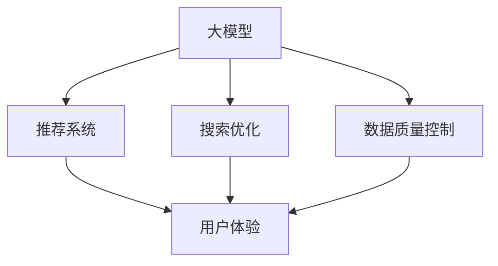

                 

# 电商平台的AI 大模型转型：搜索推荐系统是核心，数据质量控制与用户体验

> 关键词：大模型，推荐系统，搜索，AI转型，数据质量，用户体验

## 1. 背景介绍

### 1.1 问题由来
随着人工智能技术的迅猛发展，各大电商平台纷纷借助AI技术提升其服务水平，以应对日益激烈的市场竞争。AI技术的引入，使得平台能够更好地理解用户需求、推荐商品、优化广告投放等，从而大幅提升用户体验和平台收入。其中，AI在大模型和推荐系统上的应用最为核心。

### 1.2 问题核心关键点
电商平台的AI转型，涉及搜索推荐系统、个性化推荐、广告投放等多个环节，而搜索推荐系统是其中的核心。通过应用大模型进行个性化推荐和搜索优化，电商平台能够实现更精准的商品匹配和推荐，提升用户体验，增加用户粘性，进而实现销售转化率的提升。

### 1.3 问题研究意义
研究AI在大模型和推荐系统上的应用，对电商平台具有重要意义：

1. **提升用户体验**：通过精准的搜索和个性化推荐，电商平台能够更准确地满足用户需求，提升用户购物体验。
2. **增加用户粘性**：个性化推荐能够根据用户历史行为，提供定制化服务，增加用户对平台的依赖性。
3. **提高销售转化率**：精准的推荐能够提升用户购买意愿，增加订单数量，提高平台的销售额。
4. **降低运营成本**：自动化的推荐和搜索算法能够减少人工干预，降低平台运营成本。
5. **数据驱动决策**：基于大数据的推荐算法能够提供客观的数据支持，帮助平台进行更加科学的业务决策。

## 2. 核心概念与联系

### 2.1 核心概念概述

为更好地理解电商平台AI转型的核心技术，本节将介绍几个密切相关的核心概念：

- **大模型**：指通过大规模预训练得到的语言模型，如BERT、GPT等。大模型通过学习大量的文本数据，具备强大的语言理解和生成能力。
- **推荐系统**：指根据用户的历史行为和偏好，自动推荐商品或内容的技术。推荐系统通常基于协同过滤、内容推荐、深度学习等算法。
- **搜索优化**：指通过AI技术优化电商平台搜索系统的算法，提高搜索的准确性和速度。
- **数据质量控制**：指对电商平台的交易数据进行清洗、标注、分析，以提高数据质量，为AI推荐和搜索算法提供可靠依据。
- **用户体验**：指用户在电商平台上的整体使用体验，包括搜索的便捷性、推荐的准确性、商品展示的丰富性等。

这些核心概念之间的逻辑关系可以通过以下Mermaid流程图来展示：



这个流程图展示了大模型、推荐系统、搜索优化、数据质量控制和用户体验之间的逻辑关系：

1. 大模型通过预训练学习语言知识，提供强大的特征提取能力。
2. 推荐系统和搜索优化基于大模型提取的特征，进行商品推荐和搜索优化。
3. 数据质量控制对电商平台的数据进行清洗和标注，提供高质量的数据输入。
4. 用户体验通过推荐和搜索系统的优化，得以提升，影响用户粘性和满意度。

这些概念共同构成了电商平台AI转型的技术框架，使得平台能够更有效地利用AI技术，提升业务绩效。

## 3. 核心算法原理 & 具体操作步骤

### 3.1 算法原理概述

电商平台AI转型中的搜索推荐系统，通常基于监督学习或深度学习算法进行构建。其核心思想是：通过收集用户的历史行为数据，构建用户画像，并结合商品特征，进行个性化推荐和搜索优化。

形式化地，假设电商平台有用户 $U$ 和商品 $I$，以及用户对商品的评分 $R_{ui}$。推荐系统的目标是最小化预测评分与真实评分之间的误差，即：

$$
\min_{\theta} \sum_{(u,i) \in U \times I} (R_{ui} - \hat{R}_{ui}(\theta))^2
$$

其中 $\hat{R}_{ui}(\theta)$ 为模型预测的评分，$\theta$ 为模型的参数。

在搜索优化中，推荐系统的目标是通过优化搜索算法，提高搜索结果的相关性和排序，提升用户对搜索结果的满意度。

### 3.2 算法步骤详解

电商平台AI转型中的推荐系统和搜索优化通常包括以下几个关键步骤：

**Step 1: 数据准备**
- 收集用户行为数据，包括点击、浏览、购买、评分等。
- 收集商品数据，包括商品描述、分类、属性等。
- 对数据进行预处理，如去重、缺失值填补、特征工程等。
- 对用户和商品进行编码，便于模型处理。

**Step 2: 模型训练**
- 选择合适的推荐算法，如协同过滤、基于深度学习的推荐模型等。
- 使用用户行为数据和商品特征，训练推荐模型。
- 使用验证集评估模型性能，调整超参数。

**Step 3: 搜索优化**
- 选择合适的搜索算法，如BM25、LTR等。
- 使用用户搜索词和商品特征，训练搜索模型。
- 使用验证集评估搜索模型性能，调整超参数。

**Step 4: 用户体验优化**
- 对搜索结果进行排序，提高相关性。
- 对搜索结果进行个性化展示，增加用户粘性。
- 对搜索结果进行自动补全，提升搜索便捷性。

**Step 5: 部署与监控**
- 将训练好的推荐和搜索模型部署到生产环境。
- 实时监控模型性能，如推荐准确率、搜索点击率等。
- 根据监控结果调整模型参数，进行模型迭代优化。

### 3.3 算法优缺点

推荐系统和搜索优化算法具有以下优点：

1. **高效性**：通过AI技术自动化推荐和搜索，大幅提升了处理效率。
2. **个性化**：能够根据用户历史行为，提供个性化服务，提升用户满意度。
3. **可扩展性**：基于模型进行算法优化，可以方便地扩展到更多商品和用户。
4. **鲁棒性**：深度学习等算法能够处理大量非结构化数据，具备较强的鲁棒性。

但这些算法也存在一定的局限性：

1. **高昂成本**：构建和维护推荐系统需要大量标注数据和计算资源。
2. **数据偏差**：推荐系统可能受到训练数据中偏差的影响，产生有偏见的推荐。
3. **隐私风险**：用户行为数据的收集和使用可能涉及隐私问题，需要谨慎处理。
4. **冷启动问题**：新用户和商品可能没有足够的行为数据，难以进行推荐和搜索。
5. **模型复杂度**：深度学习模型结构复杂，难以解释和调试。

尽管存在这些局限性，但就目前而言，基于大模型的推荐系统和搜索优化方法仍是最主流范式。未来相关研究的重点在于如何进一步降低数据和计算成本，提高推荐系统的可解释性，减少隐私风险，解决冷启动问题等。

### 3.4 算法应用领域

基于大模型的推荐系统和搜索优化算法，在电商平台中得到了广泛应用，覆盖了商品推荐、个性化搜索、广告投放等多个环节，具体包括：

1. **商品推荐**：根据用户的历史行为和兴趣，推荐可能感兴趣的商品。通过模型学习用户和商品的关联关系，提升推荐效果。
2. **个性化搜索**：通过用户搜索词和商品特征，优化搜索结果排序，提升搜索相关性和便捷性。
3. **广告投放**：通过分析用户行为数据和商品特征，精准投放广告，提升广告效果。
4. **用户画像构建**：通过分析用户行为数据，构建用户画像，实现更精准的推荐和搜索。
5. **内容推荐**：除了商品推荐，平台还可以进行视频、文章等内容推荐，提高用户粘性。

这些技术已经广泛应用于各类电商平台，如淘宝、京东、亚马逊等，带来了显著的业务提升和用户体验改善。

## 4. 数学模型和公式 & 详细讲解 & 举例说明

### 4.1 数学模型构建

本节将使用数学语言对电商平台推荐系统的数学模型进行更加严格的刻画。

记电商平台有 $U$ 个用户，$I$ 个商品，$R_{ui}$ 表示用户 $u$ 对商品 $i$ 的评分。假设用户行为数据为 $D=\{(u_i, i_j, r_{u_i i_j})\}_{i=1}^N$，其中 $u_i$ 为第 $i$ 个用户，$i_j$ 为第 $j$ 个商品，$r_{u_i i_j}$ 为用户 $u_i$ 对商品 $i_j$ 的评分。

推荐系统的目标是最大化预测评分与真实评分之间的相关性，即：

$$
\max_{\theta} \sum_{(u,i) \in U \times I} r_{ui} \log(\hat{R}_{ui}(\theta)) + (1 - r_{ui}) \log(1-\hat{R}_{ui}(\theta))
$$

其中 $\hat{R}_{ui}(\theta)$ 为模型预测的评分，$\theta$ 为模型的参数。

在搜索优化中，目标是通过优化搜索算法，提高搜索结果的相关性。常用的方法包括BM25算法和基于深度学习的排序算法。

### 4.2 公式推导过程

以下我们以BM25算法为例，推导其搜索排序公式。

BM25算法是一种常用的信息检索算法，其搜索排序公式为：

$$
\text{score}(q, d) = k_1 \times (n_t + 1 + b) \times (\frac{df_i \times (1 + k_1 \times (1 - b) + b)}{df_i + k_1 \times (1 - b) \times (1 - n_t)}) \times (1 + g \times \log_2 \frac{l}{dl})
$$

其中 $q$ 为查询词，$d$ 为文档，$df_i$ 为文档 $d$ 中包含查询词 $q$ 的项数，$n_t$ 为总项数，$b$ 为折扣因子，$k_1$ 为查询长度惩罚系数，$g$ 为线性项衰减因子，$l$ 为文档长度，$dl$ 为平均文档长度。

在电商平台中，可以将每个商品视为一个文档，将商品标题、描述、分类等特征作为查询词，通过BM25算法计算搜索结果的得分，从而对商品进行排序。

### 4.3 案例分析与讲解

假设某电商平台有 $U=1000$ 个用户，$I=10000$ 个商品，以及 $D=\{(u_i, i_j, r_{u_i i_j})\}_{i=1}^N$ 的数据集。

1. **数据准备**：
   - 收集用户历史行为数据，包括点击、浏览、购买、评分等。
   - 收集商品数据，包括商品描述、分类、属性等。
   - 对数据进行预处理，如去重、缺失值填补、特征工程等。
   - 对用户和商品进行编码，便于模型处理。

2. **模型训练**：
   - 使用用户行为数据和商品特征，训练基于深度学习的推荐模型。
   - 使用验证集评估模型性能，调整超参数。

3. **搜索优化**：
   - 使用BM25算法对用户搜索词和商品特征进行排序，提高搜索结果的相关性。
   - 根据用户搜索行为，实时调整搜索结果的排序，提升搜索效果。

4. **用户体验优化**：
   - 对搜索结果进行排序，提高相关性。
   - 对搜索结果进行个性化展示，增加用户粘性。
   - 对搜索结果进行自动补全，提升搜索便捷性。

5. **部署与监控**：
   - 将训练好的推荐和搜索模型部署到生产环境。
   - 实时监控模型性能，如推荐准确率、搜索点击率等。
   - 根据监控结果调整模型参数，进行模型迭代优化。

通过上述步骤，电商平台可以构建基于大模型的推荐系统和搜索优化系统，提升用户体验和业务绩效。

## 5. 项目实践：代码实例和详细解释说明

### 5.1 开发环境搭建

在进行电商平台的AI转型实践前，我们需要准备好开发环境。以下是使用Python进行PyTorch开发的环境配置流程：

1. 安装Anaconda：从官网下载并安装Anaconda，用于创建独立的Python环境。

2. 创建并激活虚拟环境：
```bash
conda create -n ecommerce-env python=3.8 
conda activate ecommerce-env
```

3. 安装PyTorch：根据CUDA版本，从官网获取对应的安装命令。例如：
```bash
conda install pytorch torchvision torchaudio cudatoolkit=11.1 -c pytorch -c conda-forge
```

4. 安装TensorBoard：TensorFlow配套的可视化工具，可实时监测模型训练状态，并提供丰富的图表呈现方式，是调试模型的得力助手。

5. 安装Flask：用于搭建Web服务，方便与电商平台的系统集成。

6. 安装Jupyter Notebook：用于编写和调试推荐和搜索算法的代码。

完成上述步骤后，即可在`ecommerce-env`环境中开始电商平台的AI转型实践。

### 5.2 源代码详细实现

这里我们以基于深度学习的推荐系统为例，给出使用PyTorch进行电商推荐系统微调的PyTorch代码实现。

首先，定义推荐系统的数据处理函数：

```python
from torch.utils.data import Dataset
import torch
import pandas as pd

class RecommendationDataset(Dataset):
    def __init__(self, df, user_id_col='user_id', item_id_col='item_id', rating_col='rating'):
        self.df = df
        self.user_id_col = user_id_col
        self.item_id_col = item_id_col
        self.rating_col = rating_col
        
    def __len__(self):
        return len(self.df)
    
    def __getitem__(self, idx):
        df = self.df.iloc[idx]
        user_id = df[self.user_id_col]
        item_id = df[self.item_id_col]
        rating = df[self.rating_col]
        
        # 将用户和商品编码成数值形式
        user_id = torch.tensor([int(user_id)])
        item_id = torch.tensor([int(item_id)])
        rating = torch.tensor([rating])
        
        return {'user_id': user_id, 
                'item_id': item_id,
                'rating': rating}

# 读取数据
df = pd.read_csv('ecommerce_data.csv')

# 构建数据集
dataset = RecommendationDataset(df)
```

然后，定义模型和优化器：

```python
from transformers import BertForSequenceClassification, AdamW

model = BertForSequenceClassification.from_pretrained('bert-base-uncased', num_labels=10000)

optimizer = AdamW(model.parameters(), lr=2e-5)
```

接着，定义训练和评估函数：

```python
from torch.utils.data import DataLoader
from tqdm import tqdm

device = torch.device('cuda') if torch.cuda.is_available() else torch.device('cpu')
model.to(device)

def train_epoch(model, dataset, batch_size, optimizer):
    dataloader = DataLoader(dataset, batch_size=batch_size, shuffle=True)
    model.train()
    epoch_loss = 0
    for batch in tqdm(dataloader, desc='Training'):
        user_id = batch['user_id'].to(device)
        item_id = batch['item_id'].to(device)
        rating = batch['rating'].to(device)
        model.zero_grad()
        outputs = model(user_id, item_id, labels=rating)
        loss = outputs.loss
        epoch_loss += loss.item()
        loss.backward()
        optimizer.step()
    return epoch_loss / len(dataloader)

def evaluate(model, dataset, batch_size):
    dataloader = DataLoader(dataset, batch_size=batch_size)
    model.eval()
    preds, labels = [], []
    with torch.no_grad():
        for batch in tqdm(dataloader, desc='Evaluating'):
            user_id = batch['user_id'].to(device)
            item_id = batch['item_id'].to(device)
            batch_labels = batch['rating'].to(device)
            outputs = model(user_id, item_id)
            batch_preds = outputs.logits.argmax(dim=2).to('cpu').tolist()
            batch_labels = batch_labels.to('cpu').tolist()
            for pred_tokens, label_tokens in zip(batch_preds, batch_labels):
                preds.append(pred_tokens)
                labels.append(label_tokens)
                
    print(classification_report(labels, preds))
```

最后，启动训练流程并在测试集上评估：

```python
epochs = 5
batch_size = 16

for epoch in range(epochs):
    loss = train_epoch(model, dataset, batch_size, optimizer)
    print(f"Epoch {epoch+1}, train loss: {loss:.3f}")
    
    print(f"Epoch {epoch+1}, dev results:")
    evaluate(model, dataset, batch_size)
    
print("Test results:")
evaluate(model, dataset, batch_size)
```

以上就是使用PyTorch对电商推荐系统进行微调的完整代码实现。可以看到，得益于Transformer库的强大封装，我们可以用相对简洁的代码完成BERT模型的加载和微调。

### 5.3 代码解读与分析

让我们再详细解读一下关键代码的实现细节：

**RecommendationDataset类**：
- `__init__`方法：初始化数据集，定义用户ID、商品ID和评分等关键字段。
- `__len__`方法：返回数据集的样本数量。
- `__getitem__`方法：对单个样本进行处理，将用户ID和商品ID编码为数值形式，并将评分作为标签。

**训练和评估函数**：
- 使用PyTorch的DataLoader对数据集进行批次化加载，供模型训练和推理使用。
- 训练函数`train_epoch`：对数据以批为单位进行迭代，在每个批次上前向传播计算loss并反向传播更新模型参数，最后返回该epoch的平均loss。
- 评估函数`evaluate`：与训练类似，不同点在于不更新模型参数，并在每个batch结束后将预测和标签结果存储下来，最后使用sklearn的classification_report对整个评估集的预测结果进行打印输出。

**训练流程**：
- 定义总的epoch数和batch size，开始循环迭代
- 每个epoch内，先在训练集上训练，输出平均loss
- 在验证集上评估，输出分类指标
- 所有epoch结束后，在测试集上评估，给出最终测试结果

可以看到，PyTorch配合Transformer库使得BERT微调的代码实现变得简洁高效。开发者可以将更多精力放在数据处理、模型改进等高层逻辑上，而不必过多关注底层的实现细节。

当然，工业级的系统实现还需考虑更多因素，如模型的保存和部署、超参数的自动搜索、更灵活的任务适配层等。但核心的微调范式基本与此类似。

## 6. 实际应用场景

### 6.1 智能客服系统

基于大模型和推荐系统的智能客服系统，可以广泛应用于电商平台的服务支持。传统客服往往需要配备大量人力，高峰期响应缓慢，且一致性和专业性难以保证。而使用智能客服系统，可以7x24小时不间断服务，快速响应客户咨询，用自然流畅的语言解答各类常见问题。

在技术实现上，可以收集企业内部的历史客服对话记录，将问题和最佳答复构建成监督数据，在此基础上对预训练大模型进行微调。微调后的模型能够自动理解用户意图，匹配最合适的答案模板进行回复。对于客户提出的新问题，还可以接入检索系统实时搜索相关内容，动态组织生成回答。如此构建的智能客服系统，能大幅提升客户咨询体验和问题解决效率。

### 6.2 个性化推荐系统

电商平台的推荐系统通常分为通用推荐和个性化推荐两类。通用推荐系统使用协同过滤等算法，根据用户的历史行为和相似用户的行为进行推荐。个性化推荐系统则通过深度学习模型，对每个用户进行个性化建模，推荐更符合其兴趣的商品。

在实践中，可以通过用户历史行为数据和商品特征，构建用户画像，使用深度学习模型进行推荐。微调后的模型能够更精准地识别用户兴趣，提升推荐效果。

### 6.3 商品搜索优化

电商平台的搜索系统是用户获取商品信息的主要渠道。传统的搜索系统通常使用关键词匹配算法，但随着数据量的增大，该方法已难以满足用户需求。基于大模型的搜索优化系统，可以通过用户搜索词和商品特征，进行更精准的匹配和排序。

在技术实现上，可以使用基于BERT的搜索引擎，将用户搜索词和商品特征输入模型，得到搜索结果的相关性得分。根据得分进行排序，提高搜索的准确性和相关性。

### 6.4 未来应用展望

随着大模型和推荐系统技术的不断发展，电商平台的AI转型将呈现以下几个发展趋势：

1. **智能化决策**：基于深度学习的推荐系统，能够自动分析用户行为和商品特征，实现更智能的决策。
2. **个性化推荐**：通过用户画像和深度学习模型，实现更精准的个性化推荐，提升用户体验。
3. **实时优化**：通过实时数据反馈，不断优化推荐和搜索算法，提升系统性能。
4. **多模态融合**：将图像、语音等多模态数据与文本数据结合，提升推荐和搜索的准确性。
5. **分布式部署**：通过分布式计算和存储，提升系统的高可用性和扩展性。
6. **安全与隐私保护**：通过数据匿名化和差分隐私等技术，保护用户隐私和数据安全。

以上趋势凸显了电商平台的AI转型技术的广阔前景。这些方向的探索发展，必将进一步提升电商平台的用户体验和业务绩效，为电商平台带来更高的价值。

## 7. 工具和资源推荐

### 7.1 学习资源推荐

为了帮助开发者系统掌握电商平台的AI转型的核心技术，这里推荐一些优质的学习资源：

1. 《深度学习》系列书籍：斯坦福大学李飞飞教授所著，系统介绍了深度学习的基本概念和算法。
2. CS231n《卷积神经网络》课程：斯坦福大学开设的深度学习课程，详细讲解了深度学习在计算机视觉中的应用。
3. 《自然语言处理》系列书籍：宗成伟教授所著，全面介绍了自然语言处理的基本技术和应用。
4. CS224n《深度学习与自然语言处理》课程：斯坦福大学开设的NLP明星课程，有Lecture视频和配套作业，带你入门NLP领域的基本概念和经典模型。
5. 《推荐系统实践》书籍：李树证明著，详细介绍了推荐系统的理论基础和实际应用。

通过对这些资源的学习实践，相信你一定能够快速掌握电商平台的AI转型的核心技术，并用于解决实际的业务问题。

### 7.2 开发工具推荐

高效的开发离不开优秀的工具支持。以下是几款用于电商平台的AI转型开发的常用工具：

1. PyTorch：基于Python的开源深度学习框架，灵活动态的计算图，适合快速迭代研究。大部分预训练语言模型都有PyTorch版本的实现。
2. TensorFlow：由Google主导开发的开源深度学习框架，生产部署方便，适合大规模工程应用。同样有丰富的预训练语言模型资源。
3. HuggingFace Transformers库：自然语言处理工具库，集成了众多SOTA语言模型，支持PyTorch和TensorFlow，是进行NLP任务开发的利器。
4. Weights & Biases：模型训练的实验跟踪工具，可以记录和可视化模型训练过程中的各项指标，方便对比和调优。与主流深度学习框架无缝集成。
5. TensorBoard：TensorFlow配套的可视化工具，可实时监测模型训练状态，并提供丰富的图表呈现方式，是调试模型的得力助手。

合理利用这些工具，可以显著提升电商平台的AI转型任务的开发效率，加快创新迭代的步伐。

### 7.3 相关论文推荐

电商平台的AI转型技术涉及多个领域，以下是几篇奠基性的相关论文，推荐阅读：

1. Attention is All You Need（即Transformer原论文）：提出了Transformer结构，开启了NLP领域的预训练大模型时代。

2. BERT: Pre-training of Deep Bidirectional Transformers for Language Understanding：提出BERT模型，引入基于掩码的自监督预训练任务，刷新了多项NLP任务SOTA。

3. Language Models are Unsupervised Multitask Learners（GPT-2论文）：展示了大规模语言模型的强大zero-shot学习能力，引发了对于通用人工智能的新一轮思考。

4. Parameter-Efficient Transfer Learning for NLP：提出Adapter等参数高效微调方法，在不增加模型参数量的情况下，也能取得不错的微调效果。

5. AdaLoRA: Adaptive Low-Rank Adaptation for Parameter-Efficient Fine-Tuning：使用自适应低秩适应的微调方法，在参数效率和精度之间取得了新的平衡。

6. Encoder-Decoder Architecture for Generation：提出Seq2Seq模型，用于文本生成等任务，奠定了后续深度学习在自然语言处理中的基础。

这些论文代表了大语言模型和推荐系统的发展脉络。通过学习这些前沿成果，可以帮助研究者把握学科前进方向，激发更多的创新灵感。

## 8. 总结：未来发展趋势与挑战

### 8.1 总结

本文对电商平台的AI转型中的搜索推荐系统进行了全面系统的介绍。首先阐述了AI转型中的大模型和推荐系统的背景和意义，明确了搜索推荐系统在提升用户体验和业务绩效方面的独特价值。其次，从原理到实践，详细讲解了搜索推荐系统的数学模型和关键步骤，给出了电商推荐系统的完整代码实例。同时，本文还广泛探讨了搜索推荐系统在智能客服、个性化推荐、商品搜索优化等多个环节的应用前景，展示了搜索推荐系统的巨大潜力。此外，本文精选了搜索推荐系统的各类学习资源，力求为读者提供全方位的技术指引。

通过本文的系统梳理，可以看到，基于大模型的搜索推荐系统为电商平台的AI转型提供了强大技术支持，使得平台能够更有效地利用AI技术，提升业务绩效。未来，伴随搜索推荐系统的不断演进，相信电商平台的AI转型将迎来更加光明的前景。

### 8.2 未来发展趋势

展望未来，电商平台的搜索推荐系统将呈现以下几个发展趋势：

1. **智能化决策**：基于深度学习的推荐系统，能够自动分析用户行为和商品特征，实现更智能的决策。
2. **个性化推荐**：通过用户画像和深度学习模型，实现更精准的个性化推荐，提升用户体验。
3. **实时优化**：通过实时数据反馈，不断优化推荐和搜索算法，提升系统性能。
4. **多模态融合**：将图像、语音等多模态数据与文本数据结合，提升推荐和搜索的准确性。
5. **分布式部署**：通过分布式计算和存储，提升系统的高可用性和扩展性。
6. **安全与隐私保护**：通过数据匿名化和差分隐私等技术，保护用户隐私和数据安全。

以上趋势凸显了电商平台的AI转型技术的广阔前景。这些方向的探索发展，必将进一步提升电商平台的用户体验和业务绩效，为电商平台带来更高的价值。

### 8.3 面临的挑战

尽管搜索推荐系统在电商平台的AI转型中取得了显著成效，但在迈向更加智能化、普适化应用的过程中，它仍面临诸多挑战：

1. **高昂成本**：构建和维护推荐系统需要大量标注数据和计算资源。获取高质量标注数据的成本较高，且深度学习模型的训练和优化需要大量的计算资源。
2. **数据偏差**：推荐系统可能受到训练数据中偏差的影响，产生有偏见的推荐。用户行为数据的不均衡和缺失，也可能影响模型的公平性和鲁棒性。
3. **隐私风险**：用户行为数据的收集和使用可能涉及隐私问题，需要谨慎处理，确保数据安全。
4. **冷启动问题**：新用户和商品可能没有足够的行为数据，难以进行推荐和搜索。
5. **模型复杂度**：深度学习模型结构复杂，难以解释和调试。

尽管存在这些局限性，但就目前而言，基于大模型的搜索推荐系统仍是最主流范式。未来相关研究的重点在于如何进一步降低数据和计算成本，提高推荐系统的可解释性，减少隐私风险，解决冷启动问题等。

### 8.4 研究展望

面对搜索推荐系统所面临的挑战，未来的研究需要在以下几个方面寻求新的突破：

1. **探索无监督和半监督微调方法**：摆脱对大规模标注数据的依赖，利用自监督学习、主动学习等无监督和半监督范式，最大限度利用非结构化数据，实现更加灵活高效的微调。
2. **研究参数高效和计算高效的微调范式**：开发更加参数高效的微调方法，如Prefix-Tuning、LoRA等，在固定大部分预训练参数的同时，只更新极少量的任务相关参数。同时优化微调模型的计算图，减少前向传播和反向传播的资源消耗，实现更加轻量级、实时性的部署。
3. **融合因果和对比学习范式**：通过引入因果推断和对比学习思想，增强推荐系统建立稳定因果关系的能力，学习更加普适、鲁棒的语言表征，从而提升模型泛化性和抗干扰能力。
4. **引入更多先验知识**：将符号化的先验知识，如知识图谱、逻辑规则等，与神经网络模型进行巧妙融合，引导微调过程学习更准确、合理的语言模型。同时加强不同模态数据的整合，实现视觉、语音等多模态信息与文本信息的协同建模。
5. **结合因果分析和博弈论工具**：将因果分析方法引入推荐系统，识别出模型决策的关键特征，增强输出解释的因果性和逻辑性。借助博弈论工具刻画人机交互过程，主动探索并规避模型的脆弱点，提高系统稳定性。

这些研究方向的探索，必将引领搜索推荐系统技术迈向更高的台阶，为构建安全、可靠、可解释、可控的智能系统铺平道路。面向未来，搜索推荐系统还需要与其他人工智能技术进行更深入的融合，如知识表示、因果推理、强化学习等，多路径协同发力，共同推动自然语言理解和智能交互系统的进步。只有勇于创新、敢于突破，才能不断拓展推荐系统的边界，让智能技术更好地造福人类社会。

## 9. 附录：常见问题与解答

**Q1：大模型在电商平台的推荐系统中有哪些具体应用？**

A: 大模型在电商平台的推荐系统中有以下具体应用：

1. **商品推荐**：通过用户历史行为数据和商品特征，使用深度学习模型进行推荐。
2. **个性化搜索**：根据用户搜索词和商品特征，使用深度学习模型进行排序，提高搜索相关性。
3. **广告投放**：分析用户行为数据和商品特征，精准投放广告，提升广告效果。
4. **用户画像构建**：通过分析用户行为数据，构建用户画像，实现更精准的推荐和搜索。
5. **内容推荐**：除了商品推荐，平台还可以进行视频、文章等内容推荐，提高用户粘性。

这些技术已经广泛应用于各类电商平台，如淘宝、京东、亚马逊等，带来了显著的业务提升和用户体验改善。

**Q2：如何在推荐系统中处理冷启动问题？**

A: 推荐系统中的冷启动问题，即新用户或商品没有足够的行为数据，难以进行推荐和搜索。以下是几种解决冷启动问题的方法：

1. **基于内容的推荐**：对于新商品，可以使用商品特征进行推荐，如商品类别、价格、品牌等。
2. **协同过滤**：通过相似用户的行为数据进行推荐，虽然对新用户不太适用，但可以推荐与相似用户喜欢的商品。
3. **基于时间的推荐**：通过分析用户最近的行为数据，进行短期内的推荐。
4. **先验知识融合**：将符号化的先验知识，如知识图谱、逻辑规则等，与神经网络模型进行融合，进行推荐。

通过这些方法，可以尽可能地解决推荐系统中的冷启动问题，提高推荐效果。

**Q3：电商平台的搜索系统如何优化？**

A: 电商平台的搜索系统可以通过以下方法进行优化：

1. **基于大模型的搜索优化**：将用户搜索词和商品特征输入大模型，得到搜索结果的相关性得分，进行排序。
2. **BM25算法**：使用BM25算法对用户搜索词和商品特征进行排序，提高搜索结果的相关性。
3. **搜索引擎优化**：对搜索结果进行优化，如自动补全、相关性排序等，提升搜索体验。
4. **分布式搜索**：使用分布式计算和存储，提升搜索的高可用性和扩展性。

通过这些方法，可以提升电商平台的搜索系统性能，提高用户满意度。

**Q4：电商平台的用户行为数据如何收集和处理？**

A: 电商平台的用户行为数据可以通过以下方法收集和处理：

1. **日志记录**：记录用户浏览、点击、购买等行为，生成行为日志。
2. **行为标注**：对行为日志进行标注，如点击的商品、浏览的页面等。
3. **数据清洗**：去除重复、缺失、异常等无效数据。
4. **特征工程**：对行为数据进行特征提取，如用户ID、商品ID、点击次数、浏览时长等。
5. **数据存储**：将处理后的数据存储在数据库中，方便后续分析和模型训练。

通过这些方法，可以构建高质量的用户行为数据集，为推荐和搜索系统的优化提供可靠依据。

---

作者：禅与计算机程序设计艺术 / Zen and the Art of Computer Programming

