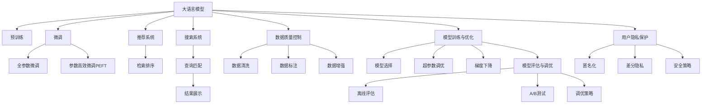

                 

# 电商平台的AI 大模型转型：搜索推荐系统是核心，数据质量控制是关键

## 1. 背景介绍

### 1.1 问题由来

近年来，随着电商行业的蓬勃发展，用户对购物体验的期望不断提高。为了更好地满足用户需求，电商平台纷纷引入人工智能技术，实现个性化推荐、智能搜索等应用。其中，大语言模型（Large Language Model, LLM）因其强大的语言理解能力和生成能力，在电商平台的AI转型中扮演了重要角色。

然而，尽管大模型在推荐和搜索方面表现出色，但实际应用中仍面临诸多挑战。例如，如何构建高效、准确、可解释的推荐和搜索模型，如何确保数据的质量和一致性，如何在用户隐私保护和模型性能之间找到平衡点。这些问题需要电商企业在大模型的应用中认真对待和解决。

### 1.2 问题核心关键点

1. **搜索推荐系统**：大语言模型在电商平台的核心应用场景是搜索推荐系统，其目标是基于用户的历史行为和上下文信息，预测用户可能感兴趣的商品或信息，提供个性化的搜索结果和推荐内容。

2. **数据质量控制**：数据是模型的基础，电商平台的推荐和搜索系统依赖于用户行为、商品信息等数据，这些数据的质量直接影响模型的性能。

3. **模型训练与优化**：大模型需要大量的标注数据进行训练，如何在保证数据质量的前提下，快速高效地训练和优化模型，是平台应用大模型的关键。

4. **模型部署与应用**：如何将训练好的模型部署到实际应用中，保障模型的实时性和稳定性，是模型应用中的重要环节。

5. **用户隐私保护**：电商平台需要平衡个性化推荐带来的便利与用户隐私保护之间的关系，确保用户数据的安全性。

6. **模型评估与调优**：通过科学合理的评估指标和调优策略，持续提升推荐和搜索系统的性能。

## 2. 核心概念与联系

### 2.1 核心概念概述

1. **大语言模型**：如GPT、BERT等，通过大规模无标签文本数据的预训练，学习通用语言表示，具备强大的自然语言理解和生成能力。

2. **预训练与微调**：预训练指在大规模无标签数据上进行自监督学习，微调指在预训练模型的基础上，通过有监督学习任务优化模型，适应具体的应用场景。

3. **推荐系统**：利用用户行为、商品信息等数据，预测用户可能感兴趣的商品或信息，并提供个性化推荐。

4. **搜索系统**：基于用户输入的查询，从海量的商品信息中检索出最相关的结果，并提供详细的搜索结果页面。

5. **数据质量控制**：包括数据清洗、去重、标注等环节，确保数据的一致性、准确性和完整性。

6. **模型训练与优化**：涉及模型选择、超参数调优、梯度下降等过程，以提高模型的性能。

7. **模型部署与应用**：将训练好的模型部署到实际应用环境中，确保模型的实时性和稳定性。

8. **用户隐私保护**：采用匿名化、差分隐私等技术，保护用户数据隐私。

9. **模型评估与调优**：使用A/B测试、离线评估等方法，定期评估模型的性能，并进行调优。

### 2.2 核心概念原理和架构的 Mermaid 流程图



这个流程图展示了从大语言模型到实际应用中的各个关键环节，以及它们之间的联系。预训练和微调是大模型应用的基础，而推荐和搜索系统则是实际应用中的核心。数据质量控制和模型训练与优化则是保障系统性能的关键，用户隐私保护和模型评估与调优则是平台健康运行的重要环节。

## 3. 核心算法原理 & 具体操作步骤

### 3.1 算法原理概述

大语言模型在电商平台中的应用主要体现在推荐系统和搜索系统中。推荐系统通过预测用户可能感兴趣的商品或信息，提供个性化推荐；搜索系统则基于用户输入的查询，从海量的商品信息中检索出最相关的结果，并提供详细的搜索结果页面。

具体来说，推荐系统包括两个核心模块：

1. **用户兴趣建模**：通过分析用户的历史行为、偏好、社交关系等信息，构建用户兴趣模型，预测用户对商品或信息的兴趣程度。
2. **商品相似度计算**：基于商品属性、用户评价、热门度等特征，计算商品间的相似度，找出与用户兴趣最相关的商品。

搜索系统也包括两个核心模块：

1. **查询理解**：解析用户输入的查询，提取出关键信息，理解用户的查询意图。
2. **结果检索与排序**：基于查询信息，检索出最相关的商品信息，并按照一定的排序规则展示搜索结果。

### 3.2 算法步骤详解

#### 3.2.1 推荐系统算法步骤

1. **用户兴趣建模**：
   - 收集用户的历史行为数据，如浏览、点击、购买记录等。
   - 对数据进行清洗、去重和标注，确保数据的准确性和一致性。
   - 使用大语言模型对用户行为数据进行编码，得到用户兴趣表示。

2. **商品相似度计算**：
   - 收集商品的特征信息，如商品描述、价格、评分等。
   - 对商品特征进行编码，得到商品表示。
   - 使用大语言模型计算商品表示之间的相似度，找出与用户兴趣最相关的商品。

3. **推荐结果生成**：
   - 将用户兴趣表示和商品表示进行匹配，计算推荐结果。
   - 根据用户的反馈和行为数据，对推荐结果进行实时调整和优化。

#### 3.2.2 搜索系统算法步骤

1. **查询理解**：
   - 解析用户输入的查询，提取出关键信息，如查询词、查询时间、位置等。
   - 使用大语言模型对查询进行编码，得到查询表示。

2. **结果检索与排序**：
   - 收集商品的特征信息，对商品特征进行编码，得到商品表示。
   - 计算查询表示和商品表示之间的相似度，找出最相关的商品。
   - 根据相似度排序，展示最相关的搜索结果。

### 3.3 算法优缺点

**优点**：
1. **高效**：使用大语言模型可以高效地处理大量自然语言数据，提供快速、准确的推荐和搜索服务。
2. **个性化**：大语言模型可以学习到用户的个性化兴趣，提供更精准的推荐和搜索结果。
3. **鲁棒性**：大语言模型具备较强的泛化能力，能够适应不同场景和数据分布。
4. **可解释性**：大语言模型可以通过自然语言生成，提供更直观的解释和建议。

**缺点**：
1. **数据依赖**：大语言模型依赖高质量标注数据进行训练，数据质量影响模型性能。
2. **资源消耗**：大语言模型需要大量的计算资源进行训练和推理，成本较高。
3. **可解释性不足**：大语言模型的决策过程缺乏可解释性，难以理解和调试。
4. **隐私问题**：大语言模型需要处理用户的个人信息，存在隐私泄露风险。
5. **鲁棒性不足**：大语言模型对噪声和异常数据敏感，可能产生误导性输出。

### 3.4 算法应用领域

大语言模型在电商平台中的应用主要包括以下几个方面：

1. **个性化推荐**：通过分析用户行为数据，预测用户可能感兴趣的商品，提供个性化推荐。
2. **智能搜索**：基于用户输入的查询，从海量的商品信息中检索出最相关的结果。
3. **问答系统**：解答用户的疑问，提升用户购物体验。
4. **情感分析**：分析用户的情感倾向，优化用户购物体验。
5. **广告推荐**：根据用户兴趣推荐个性化广告，提升广告效果。

## 4. 数学模型和公式 & 详细讲解 & 举例说明

### 4.1 数学模型构建

推荐系统常用的数学模型包括协同过滤、基于内容的推荐、混合推荐等。这里以协同过滤模型为例，构建推荐系统的数学模型。

假设用户集合为 $U=\{u_1, u_2, ..., u_m\}$，商品集合为 $I=\{i_1, i_2, ..., i_n\}$，用户对商品的评分矩阵为 $R \in \mathbb{R}^{m \times n}$，其中 $R_{ui}$ 表示用户 $u$ 对商品 $i$ 的评分。用户 $u$ 的兴趣向量为 $p_u \in \mathbb{R}^{n}$，商品 $i$ 的特征向量为 $q_i \in \mathbb{R}^{n}$。

推荐模型可以表示为：
$$
\hat{R}_{ui} = p_u \cdot q_i
$$

其中 $\cdot$ 表示向量点积。

### 4.2 公式推导过程

以协同过滤模型为例，推荐模型的推导过程如下：

1. **用户兴趣建模**：
   - 对用户历史行为数据进行编码，得到用户兴趣表示 $p_u$。
   - 对商品特征进行编码，得到商品表示 $q_i$。

2. **商品相似度计算**：
   - 计算用户兴趣表示和商品表示的点积，得到推荐得分 $\hat{R}_{ui}$。
   - 根据推荐得分对商品进行排序，展示最相关的商品。

### 4.3 案例分析与讲解

假设有一个电商平台，收集了用户的历史行为数据和商品的特征信息。使用协同过滤模型进行推荐时，可以按照以下步骤：

1. **用户兴趣建模**：
   - 对用户历史行为数据进行编码，得到用户兴趣向量 $p_u$。
   - 对商品特征进行编码，得到商品特征向量 $q_i$。

2. **商品相似度计算**：
   - 计算用户兴趣向量 $p_u$ 和商品特征向量 $q_i$ 的点积，得到推荐得分 $\hat{R}_{ui}$。
   - 根据推荐得分对商品进行排序，展示最相关的商品。

## 5. 项目实践：代码实例和详细解释说明

### 5.1 开发环境搭建

在进行项目实践前，需要先准备好开发环境。以下是使用Python进行TensorFlow开发的环境配置流程：

1. 安装Anaconda：从官网下载并安装Anaconda，用于创建独立的Python环境。

2. 创建并激活虚拟环境：
```bash
conda create -n tf-env python=3.8 
conda activate tf-env
```

3. 安装TensorFlow：根据CUDA版本，从官网获取对应的安装命令。例如：
```bash
conda install tensorflow-gpu -c conda-forge -c pytorch -c anaconda
```

4. 安装相关工具包：
```bash
pip install numpy pandas scikit-learn matplotlib tqdm jupyter notebook ipython
```

完成上述步骤后，即可在`tf-env`环境中开始项目实践。

### 5.2 源代码详细实现

下面是使用TensorFlow进行协同过滤推荐模型的代码实现。

首先，定义协同过滤模型的类：

```python
import tensorflow as tf

class CollaborativeFiltering(tf.keras.Model):
    def __init__(self, embedding_dim, num_users, num_items):
        super(CollaborativeFiltering, self).__init__()
        self.user_embeddings = tf.keras.layers.Embedding(num_users, embedding_dim)
        self.item_embeddings = tf.keras.layers.Embedding(num_items, embedding_dim)
        self.dot_product = tf.keras.layers.Dot(axes=(1, 1), normalize=True)

    def call(self, inputs):
        user_ids, item_ids = inputs
        user_embeddings = self.user_embeddings(user_ids)
        item_embeddings = self.item_embeddings(item_ids)
        dot_product = self.dot_product([user_embeddings, item_embeddings])
        return dot_product
```

然后，定义数据集和模型训练函数：

```python
def load_dataset():
    # 加载用户行为数据和商品信息
    user_ids, item_ids, ratings = ...
    return user_ids, item_ids, ratings

def train_model(model, user_ids, item_ids, ratings, epochs, batch_size, learning_rate):
    # 构建数据集
    train_dataset = tf.data.Dataset.from_tensor_slices((user_ids, item_ids))
    train_dataset = train_dataset.shuffle(10000).batch(batch_size)

    # 定义优化器
    optimizer = tf.keras.optimizers.Adam(learning_rate=learning_rate)

    # 定义损失函数
    def loss_fn(model, user_ids, item_ids, ratings):
        dot_product = model(user_ids, item_ids)
        mse_loss = tf.losses.mean_squared_error(ratings, dot_product)
        return mse_loss

    # 训练模型
    for epoch in range(epochs):
        total_loss = 0.0
        for user_ids, item_ids in train_dataset:
            with tf.GradientTape() as tape:
                dot_product = model(user_ids, item_ids)
                loss = loss_fn(model, user_ids, item_ids, ratings)
            gradients = tape.gradient(loss, model.trainable_variables)
            optimizer.apply_gradients(zip(gradients, model.trainable_variables))
            total_loss += loss.numpy()
        print(f"Epoch {epoch+1}, loss: {total_loss/len(train_dataset)}")

# 加载数据集
user_ids, item_ids, ratings = load_dataset()

# 定义模型
embedding_dim = 32
num_users = len(set(user_ids))
num_items = len(set(item_ids))
model = CollaborativeFiltering(embedding_dim, num_users, num_items)

# 训练模型
train_model(model, user_ids, item_ids, ratings, epochs=10, batch_size=128, learning_rate=0.01)
```

最后，定义推荐函数：

```python
def recommend(model, user_ids, item_ids, ratings, top_k=10):
    # 构建数据集
    train_dataset = tf.data.Dataset.from_tensor_slices((user_ids, item_ids))
    train_dataset = train_dataset.shuffle(10000).batch(128)

    # 获取用户嵌入
    user_embeddings = model.user_embeddings(user_ids)

    # 计算推荐得分
    dot_product = model(user_ids, item_ids)
    scores = dot_product.numpy()

    # 获取最相关的商品
    top_items = [item_ids[i] for i in np.argsort(scores)[-top_k:][::-1]]

    return top_items
```

可以看到，TensorFlow使得协同过滤推荐模型的实现变得简洁高效。开发者可以将更多精力放在数据处理、模型改进等高层逻辑上，而不必过多关注底层的实现细节。

### 5.3 代码解读与分析

让我们再详细解读一下关键代码的实现细节：

**CollaborativeFiltering类**：
- `__init__`方法：初始化用户嵌入层和商品嵌入层。
- `call`方法：计算用户嵌入和商品嵌入的点积，得到推荐得分。

**load_dataset函数**：
- 从数据集中加载用户行为数据和商品信息。

**train_model函数**：
- 构建数据集，定义优化器和损失函数。
- 使用Adam优化器进行模型训练，迭代优化模型参数。

**recommend函数**：
- 构建数据集，获取用户嵌入。
- 计算推荐得分，获取最相关的商品。

## 6. 实际应用场景

### 6.1 智能推荐系统

智能推荐系统是电商平台的核心功能之一，旨在通过分析用户行为，提供个性化推荐，提升用户满意度和平台转化率。大语言模型在推荐系统中可以：

1. **用户兴趣建模**：通过对用户历史行为数据的编码，构建用户兴趣模型，预测用户对商品或信息的兴趣程度。
2. **商品相似度计算**：基于商品属性、用户评价、热门度等特征，计算商品间的相似度，找出与用户兴趣最相关的商品。
3. **推荐结果生成**：将用户兴趣表示和商品表示进行匹配，计算推荐结果，根据用户的反馈和行为数据，对推荐结果进行实时调整和优化。

### 6.2 智能搜索系统

智能搜索系统是电商平台的重要功能，旨在通过解析用户输入的查询，从海量的商品信息中检索出最相关的结果，并提供详细的搜索结果页面。大语言模型在搜索系统中可以：

1. **查询理解**：解析用户输入的查询，提取出关键信息，理解用户的查询意图。
2. **结果检索与排序**：基于查询信息，检索出最相关的商品信息，并按照一定的排序规则展示搜索结果。

## 7. 工具和资源推荐

### 7.1 学习资源推荐

为了帮助开发者系统掌握大语言模型在推荐和搜索系统中的应用，这里推荐一些优质的学习资源：

1. 《推荐系统实战》系列博文：由大模型技术专家撰写，深入浅出地介绍了推荐系统的工作原理和优化技巧。

2. CS229《机器学习》课程：斯坦福大学开设的机器学习明星课程，涵盖推荐系统、搜索系统等NLP任务。

3. 《Deep Learning for Recommendation Systems》书籍：推荐系统领域的经典书籍，介绍了深度学习在推荐系统中的应用。

4. HuggingFace官方文档：TensorFlow库的官方文档，提供了海量预训练模型和完整的推荐系统样例代码，是上手实践的必备资料。

5. KDD Cup比赛数据集：涵盖了多种推荐和搜索系统的数据集，并提供了基于大模型的推荐系统baseline模型，助力推荐系统技术发展。

通过对这些资源的学习实践，相信你一定能够快速掌握大语言模型在推荐和搜索系统中的应用，并用于解决实际的NLP问题。

### 7.2 开发工具推荐

高效的开发离不开优秀的工具支持。以下是几款用于推荐系统开发的常用工具：

1. TensorFlow：基于Python的开源深度学习框架，灵活动态的计算图，适合快速迭代研究。大多数推荐系统模型都有TensorFlow版本的实现。

2. PyTorch：基于Python的开源深度学习框架，灵活的动态计算图，适合快速原型设计和实验验证。

3. TensorFlow Serving：TensorFlow配套的服务框架，支持模型部署和推理加速，适合大规模生产部署。

4. Apache Spark：分布式计算框架，支持大规模数据处理和机器学习任务，适合处理海量数据。

5. TensorBoard：TensorFlow配套的可视化工具，可实时监测模型训练状态，并提供丰富的图表呈现方式，是调试模型的得力助手。

6. Weights & Biases：模型训练的实验跟踪工具，可以记录和可视化模型训练过程中的各项指标，方便对比和调优。

合理利用这些工具，可以显著提升推荐系统的开发效率，加快创新迭代的步伐。

### 7.3 相关论文推荐

推荐系统和大搜索技术的发展源于学界的持续研究。以下是几篇奠基性的相关论文，推荐阅读：

1. Implicit Feedback Modeling Using Matrix Factorization：提出了矩阵分解算法，用于协同过滤推荐系统。

2. Topic Models for Recommender Systems：提出主题模型，用于协同过滤推荐系统。

3. BERT for Recommendation Systems：将BERT模型应用于推荐系统，提升了推荐性能。

4. Deep Representation Learning for Recommendation：提出深度表示学习，用于推荐系统。

5. Attention is All You Need：提出Transformer结构，用于推荐系统中的注意力机制。

这些论文代表了大语言模型在推荐和搜索系统中的应用方向。通过学习这些前沿成果，可以帮助研究者把握学科前进方向，激发更多的创新灵感。

## 8. 总结：未来发展趋势与挑战

### 8.1 总结

本文对基于大语言模型的电商平台的推荐和搜索系统进行了全面系统的介绍。首先阐述了推荐和搜索系统在大平台中的应用，明确了其在提升用户体验和平台价值方面的重要作用。其次，从原理到实践，详细讲解了推荐和搜索系统的核心算法，提供了完整的代码实现。同时，本文还广泛探讨了推荐和搜索系统在实际应用中的各类优化策略和挑战，展示了微调范式的巨大潜力。

通过本文的系统梳理，可以看到，基于大语言模型的推荐和搜索系统正在成为电商平台的重要应用范式，极大地提升了大模型应用的经济价值和用户体验。未来，伴随预训练语言模型和微调方法的持续演进，推荐和搜索系统必将在电商领域不断突破和创新。

### 8.2 未来发展趋势

展望未来，大语言模型在推荐和搜索系统中的应用将呈现以下几个发展趋势：

1. **多模态推荐**：将视觉、语音、文本等多种模态的信息融合，提升推荐系统的效果。
2. **跨领域推荐**：结合商品、内容、社交等多种领域的推荐信息，提供更加全面、精准的推荐。
3. **深度学习优化**：引入深度学习技术，提升推荐和搜索系统的性能。
4. **实时推荐**：通过在线学习机制，实时调整推荐策略，提升用户体验。
5. **个性化推荐**：利用用户的行为、心理、环境等信息，提供更加个性化的推荐服务。
6. **可解释推荐**：通过可视化、解释性技术，提高推荐系统的透明度和可信度。

以上趋势凸显了大语言模型在推荐和搜索系统中的应用前景。这些方向的探索发展，必将进一步提升推荐和搜索系统的性能和用户体验，为电商平台的智能化转型提供新的动力。

### 8.3 面临的挑战

尽管大语言模型在推荐和搜索系统中的应用取得了瞩目成就，但在迈向更加智能化、普适化应用的过程中，仍面临诸多挑战：

1. **数据依赖**：推荐和搜索系统依赖高质量标注数据进行训练，数据质量影响模型性能。
2. **资源消耗**：大语言模型需要大量的计算资源进行训练和推理，成本较高。
3. **可解释性不足**：大语言模型的决策过程缺乏可解释性，难以理解和调试。
4. **隐私问题**：推荐和搜索系统需要处理用户的个人信息，存在隐私泄露风险。
5. **鲁棒性不足**：大语言模型对噪声和异常数据敏感，可能产生误导性输出。

### 8.4 研究展望

面对推荐和搜索系统面临的挑战，未来的研究需要在以下几个方面寻求新的突破：

1. **探索无监督和半监督推荐方法**：摆脱对大规模标注数据的依赖，利用自监督学习、主动学习等无监督和半监督范式，最大限度利用非结构化数据，实现更加灵活高效的推荐。

2. **研究参数高效和计算高效的推荐方法**：开发更加参数高效的推荐方法，在固定大部分预训练参数的同时，只更新极少量的任务相关参数。同时优化推荐模型的计算图，减少前向传播和反向传播的资源消耗，实现更加轻量级、实时性的部署。

3. **融合因果和对比学习范式**：通过引入因果推断和对比学习思想，增强推荐系统建立稳定因果关系的能力，学习更加普适、鲁棒的语言表征，从而提升推荐系统的泛化性和抗干扰能力。

4. **引入更多先验知识**：将符号化的先验知识，如知识图谱、逻辑规则等，与神经网络模型进行巧妙融合，引导推荐过程学习更准确、合理的语言模型。同时加强不同模态数据的整合，实现视觉、语音等多模态信息与文本信息的协同建模。

5. **结合因果分析和博弈论工具**：将因果分析方法引入推荐系统，识别出推荐决策的关键特征，增强推荐系统的解释性。借助博弈论工具刻画用户与平台的交互过程，主动探索并规避推荐系统的脆弱点，提高系统稳定性。

6. **纳入伦理道德约束**：在推荐系统训练目标中引入伦理导向的评估指标，过滤和惩罚有偏见、有害的推荐内容。同时加强人工干预和审核，建立推荐系统的监管机制，确保推荐内容符合人类价值观和伦理道德。

这些研究方向的探索，必将引领推荐系统技术迈向更高的台阶，为电商平台的智能化转型提供新的动力。相信随着学界和产业界的共同努力，这些挑战终将一一被克服，推荐系统必将在电商领域不断突破和创新。

## 9. 附录：常见问题与解答

**Q1：推荐系统是如何实现个性化推荐的？**

A: 推荐系统通过分析用户的历史行为数据，构建用户兴趣模型，预测用户对商品或信息的兴趣程度。同时，对商品进行特征编码，计算商品间的相似度，找出与用户兴趣最相关的商品，生成推荐结果。推荐系统还具备实时调整和优化功能，根据用户的反馈和行为数据，动态调整推荐策略，提升推荐效果。

**Q2：如何确保推荐系统的鲁棒性？**

A: 推荐系统可以通过引入正则化技术、对抗训练等方法，增强模型的鲁棒性。同时，合理设计损失函数和优化算法，减少模型对噪声和异常数据的敏感性。此外，利用用户反馈数据，对推荐结果进行实时调整，避免误导性推荐。

**Q3：推荐系统如何处理海量数据？**

A: 推荐系统可以通过分布式计算框架，如Apache Spark，处理海量数据。同时，利用矩阵分解、向量量化等技术，对数据进行压缩和优化，减少内存和计算资源消耗。

**Q4：推荐系统如何进行实时推荐？**

A: 推荐系统可以通过在线学习机制，实时调整推荐策略。在每次用户点击、浏览等行为发生后，立即更新模型参数，重新计算推荐结果，提升推荐效果。

**Q5：推荐系统如何保护用户隐私？**

A: 推荐系统可以通过数据匿名化、差分隐私等技术，保护用户隐私。同时，对用户的个人信息进行严格加密和保护，避免泄露敏感数据。

通过对这些问题的解答，相信你能够更好地理解推荐系统的原理和实现细节，为实际应用中的问题提供有力的技术支持。

