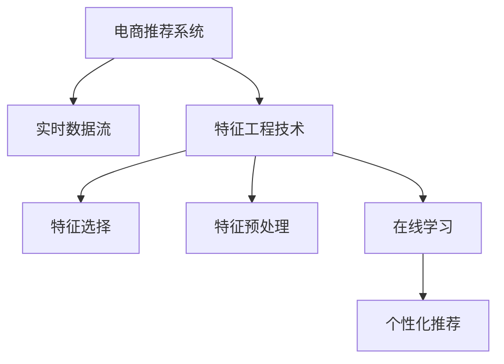

                 

# 电商推荐系统中的实时特征工程技术

> 关键词：电商推荐系统, 实时特征工程, 深度学习, 特征选择, 在线学习, 个性化推荐

## 1. 背景介绍

### 1.1 问题由来

电商推荐系统是电商领域最重要的业务之一，其核心目标是通过精准的推荐算法，向用户提供个性化商品，从而提高用户转化率和平台营收。传统的推荐算法主要基于静态特征，如用户历史行为、商品属性、时间等。然而，静态特征无法反映用户实时行为和环境变化，推荐效果往往难以达到理想水平。因此，实时特征工程技术在电商推荐系统中显得尤为重要。

### 1.2 问题核心关键点

实时特征工程技术旨在从海量实时数据中提取有效特征，并构建高效的特征处理流水线。其关键点在于：
1. 实时数据获取：高效地从用户行为、商品信息、环境因素等多个维度获取实时数据。
2. 特征选择与处理：从海量特征中筛选出最相关的特征，并进行预处理和归一化，减少噪音干扰。
3. 在线学习：结合历史数据与实时数据，进行在线学习，更新模型参数，保持推荐策略的时效性。
4. 模型优化：通过A/B测试、增量更新等手段，不断优化推荐模型，提升用户体验。

## 2. 核心概念与联系

### 2.1 核心概念概述

为更好地理解实时特征工程技术，本节将介绍几个密切相关的核心概念：

- 电商推荐系统：基于用户行为数据，向用户推荐商品、服务的系统。推荐算法通常基于用户历史行为、商品属性、时间、社会网络等多维数据。
- 实时数据流：指从业务场景中实时生成的数据流，如用户点击、浏览、购买行为等。实时数据流的特点是对系统反应速度要求高，数据量大且需要实时处理。
- 特征工程技术：指从原始数据中提取、选择、处理特征，并构建特征流水线的技术。特征工程的好坏直接影响推荐系统的性能。
- 在线学习：指在数据流持续到来时，利用在线学习算法更新模型参数，保持模型的时效性和适应性。在线学习通常比离线学习更高效，能够快速响应数据变化。
- 个性化推荐：指根据用户历史行为和实时行为，结合商品属性和环境因素，生成个性化推荐列表，提升用户满意度。

这些核心概念之间的逻辑关系可以通过以下Mermaid流程图来展示：



这个流程图展示了几者的核心关系：

1. 电商推荐系统通过实时数据流获取用户行为数据。
2. 特征工程技术从实时数据中提取和处理特征，并选择最相关的特征。
3. 在线学习结合历史数据和实时数据，不断更新模型参数。
4. 个性化推荐生成个性化推荐列表，提升用户体验。

## 3. 核心算法原理 & 具体操作步骤
### 3.1 算法原理概述

电商推荐系统中的实时特征工程技术，通常采用以下步骤：

1. **数据采集**：从电商平台的各个业务模块中采集实时数据，如用户的点击、浏览、购买行为等。
2. **特征提取**：对实时数据进行特征工程，包括但不限于特征选择、编码、归一化等步骤。
3. **模型训练**：使用在线学习算法，结合历史数据和实时数据，训练推荐模型。
4. **实时推荐**：根据用户行为和实时特征，生成个性化推荐列表。

这一过程的核心算法原理是，将实时数据流与历史数据相结合，通过在线学习不断更新模型参数，实现实时推荐。这一过程需要高效的特征工程技术，以确保特征的准确性和时效性。

### 3.2 算法步骤详解

以下是电商推荐系统中的实时特征工程的具体操作步骤：

**Step 1: 数据采集**

电商平台中，实时数据主要来自用户的点击、浏览、购买行为，商品的描述、价格、属性等，以及环境因素如时间、天气等。通过实时数据采集组件，将这些数据实时地从各个模块中提取出来。

```python
import time
import logging
from kafka import KafkaConsumer

def fetch_realtime_data():
    consumer = KafkaConsumer('user_behavior_topic', bootstrap_servers=['localhost:9092'])
    while True:
        for message in consumer:
            # 解析实时数据
            user_id = message['user_id']
            timestamp = message['timestamp']
            product_id = message['product_id']
            category = message['category']
            behavior = message['behavior']
            
            # 存储到数据仓库
            store_data(user_id, timestamp, product_id, category, behavior)
```

**Step 2: 特征提取**

实时特征工程的核心在于从实时数据中提取出有效的特征。对于电商推荐系统，常见的特征包括但不限于：

- 用户特征：如用户ID、用户性别、年龄、地域等。
- 商品特征：如商品ID、商品类别、价格、描述等。
- 行为特征：如点击次数、浏览时间、购买金额等。
- 环境特征：如时间、天气、季节等。

特征提取通常采用以下步骤：

- **特征选择**：根据领域知识，选择最相关的特征。
- **特征编码**：将离散特征转换为数字编码。
- **特征归一化**：对数值型特征进行归一化，如标准化、最小-最大归一化等。

```python
from sklearn.preprocessing import OneHotEncoder, StandardScaler

def extract_features(user_id, product_id, category, behavior):
    # 特征选择
    selected_features = ['user_id', 'product_id', 'category', 'behavior']
    
    # 特征编码
    features = {feature: selected_features.index(feature) for feature in selected_features}
    encoded_features = {feature: OneHotEncoder().fit_transform(features[feature].reshape(1, -1)).toarray()[0] for feature in selected_features}
    
    # 特征归一化
    numerical_features = ['price']
    scaler = StandardScaler()
    normalized_features = {feature: scaler.fit_transform(features[feature].reshape(1, -1)).toarray()[0] for feature in numerical_features}
    
    # 合并特征
    all_features = {**encoded_features, **normalized_features}
    
    return all_features
```

**Step 3: 模型训练**

电商推荐系统中的模型训练通常使用在线学习算法，如随机梯度下降（SGD）、增量随机梯度下降（IRSGD）、FTRL等。这些算法能够高效地处理实时数据流，保持模型的时效性。

在线学习算法通常分为以下步骤：

- **初始化模型参数**：根据历史数据初始化模型参数。
- **数据采样**：从实时数据流中采样数据。
- **模型更新**：根据采样的数据更新模型参数。
- **迭代更新**：重复上述过程，直至收敛。

```python
from sklearn.linear_model import SGDClassifier

class IncrementalSGDClassifier:
    def __init__(self, model):
        self.model = model
        self.learning_rate = 0.01
        self.initial_model_params = None
    
    def fit(self, X, y):
        if self.initial_model_params is None:
            self.model.fit(X, y)
            self.initial_model_params = self.model.coef_.copy()
        else:
            for i in range(len(X)):
                # 采样数据
                sample_X = X[i:i+1]
                sample_y = y[i:i+1]
                
                # 模型更新
                self.model.partial_fit(sample_X, sample_y, classes=np.unique(y))
                self.model.coef_ = self.initial_model_params.copy()
                self.model.coef_ += self.learning_rate * (self.model.coef_ - sample_X @ self.model.coef_)
    
    def predict(self, X):
        return self.model.predict(X)
```

**Step 4: 实时推荐**

实时推荐系统需要高效地生成个性化推荐列表，通常基于用户的历史行为和实时特征进行推荐。常见的方法包括协同过滤、内容推荐、混合推荐等。

协同过滤推荐通常分为以下步骤：

- **计算用户-商品评分矩阵**：根据用户的历史行为，计算用户对商品的评分。
- **计算商品相似度矩阵**：根据商品的属性特征，计算商品之间的相似度。
- **生成推荐列表**：根据用户评分和商品相似度，生成推荐列表。

```python
import numpy as np
from scipy.sparse import csr_matrix

def collaborative_filtering(user_id, product_id, user_features, product_features):
    # 计算用户-商品评分矩阵
    user_item_ratings = {}
    for user, features in user_features.items():
        user_item_ratings[user] = np.array(features['product_id'])
    
    # 计算商品相似度矩阵
    item_similarity = {}
    for product, features in product_features.items():
        item_similarity[product] = np.array(features['category'])
    
    # 生成推荐列表
    recommendations = {}
    for user, ratings in user_item_ratings.items():
        for product in ratings:
            recommendations[user] = {}
            recommendations[user][product] = np.dot(user_item_ratings[user], item_similarity[product])
    
    return recommendations
```

### 3.3 算法优缺点

实时特征工程技术具有以下优点：

1. **实时性**：能够快速响应数据变化，保持推荐策略的时效性。
2. **高效性**：利用在线学习算法，减少数据存储和模型训练的时间成本。
3. **可扩展性**：能够处理海量数据，适应电商平台的业务规模。

同时，实时特征工程技术也存在以下缺点：

1. **复杂性**：实时特征工程需要结合领域知识和算法优化，对工程能力要求较高。
2. **数据质量**：实时数据质量的不稳定性，可能影响特征工程的准确性。
3. **模型鲁棒性**：在线学习算法对模型参数更新速度和稳定性要求较高，可能影响模型性能。

## 4. 数学模型和公式 & 详细讲解 & 举例说明

### 4.1 数学模型构建

电商推荐系统中的实时特征工程技术，通常基于以下数学模型：

- **协同过滤推荐**：基于用户历史行为和商品属性，构建用户-商品评分矩阵和商品相似度矩阵，进行推荐。
- **内容推荐**：基于商品属性特征，推荐相似的商品。
- **混合推荐**：结合协同过滤和内容推荐，提升推荐效果。

这些模型的核心数学公式如下：

- **协同过滤推荐**：

$$
\hat{r}_{ui} = \alpha \cdot \sum_{j \in I} r_{uj} \cdot \text{sim}(j,k)
$$

其中，$r_{ui}$ 表示用户 $u$ 对商品 $i$ 的评分，$\text{sim}(j,k)$ 表示商品 $j$ 和商品 $k$ 的相似度。

- **内容推荐**：

$$
\text{sim}(i,j) = \text{cos}(\text{vec}_i \cdot \text{vec}_j)
$$

其中，$\text{vec}_i$ 和 $\text{vec}_j$ 表示商品 $i$ 和商品 $j$ 的属性向量。

### 4.2 公式推导过程

以下我们将详细推导协同过滤推荐模型的公式，并说明其实现原理。

设用户 $u$ 对商品 $i$ 的评分为 $r_{ui}$，商品 $j$ 和商品 $k$ 的相似度为 $\text{sim}(j,k)$。协同过滤推荐的数学模型如下：

$$
\hat{r}_{ui} = \alpha \cdot \sum_{j \in I} r_{uj} \cdot \text{sim}(j,k)
$$

其中，$I$ 表示商品集合。模型中 $\alpha$ 为衰减系数，$\text{sim}(j,k)$ 为商品相似度函数。

在实际实现中，$\text{sim}(j,k)$ 通常采用余弦相似度公式：

$$
\text{sim}(j,k) = \text{cos}(\text{vec}_j \cdot \text{vec}_k)
$$

其中，$\text{vec}_j$ 和 $\text{vec}_k$ 为商品 $j$ 和商品 $k$ 的属性向量。

### 4.3 案例分析与讲解

下面以电商推荐系统中的协同过滤推荐为例，进行具体分析。

假设电商平台有用户 $u$ 和商品 $i$，用户 $u$ 对商品 $i$ 的评分为 $r_{ui}$。电商平台同时对商品 $j$ 和商品 $k$ 进行评分，商品 $j$ 和商品 $k$ 的相似度为 $\text{sim}(j,k)$。

根据协同过滤推荐模型，用户 $u$ 对商品 $i$ 的预测评分 $\hat{r}_{ui}$ 为：

$$
\hat{r}_{ui} = \alpha \cdot \sum_{j \in I} r_{uj} \cdot \text{sim}(j,k)
$$

在实际应用中，为了提升推荐效果，通常会对评分和相似度进行加权处理，引入衰减系数 $\alpha$ 和用户对商品的历史评分。此外，在特征工程中，还可以加入更多的特征，如用户特征、商品特征、行为特征、环境特征等，以提升推荐模型的性能。

## 5. 项目实践：代码实例和详细解释说明
### 5.1 开发环境搭建

在进行实时特征工程技术实践前，我们需要准备好开发环境。以下是使用Python进行PyTorch开发的环境配置流程：

1. 安装Anaconda：从官网下载并安装Anaconda，用于创建独立的Python环境。

2. 创建并激活虚拟环境：
```bash
conda create -n pytorch-env python=3.8 
conda activate pytorch-env
```

3. 安装PyTorch：根据CUDA版本，从官网获取对应的安装命令。例如：
```bash
conda install pytorch torchvision torchaudio cudatoolkit=11.1 -c pytorch -c conda-forge
```

4. 安装各类工具包：
```bash
pip install numpy pandas scikit-learn matplotlib tqdm jupyter notebook ipython
```

完成上述步骤后，即可在`pytorch-env`环境中开始实时特征工程技术实践。

### 5.2 源代码详细实现

我们以电商推荐系统中的协同过滤推荐为例，给出使用PyTorch和Scikit-learn库进行实时特征工程和模型训练的PyTorch代码实现。

首先，定义协同过滤推荐的函数：

```python
from sklearn.metrics.pairwise import cosine_similarity
from sklearn.linear_model import SGDClassifier

def collaborative_filtering(user_id, product_id, user_features, product_features):
    # 计算用户-商品评分矩阵
    user_item_ratings = {}
    for user, features in user_features.items():
        user_item_ratings[user] = np.array(features['product_id'])
    
    # 计算商品相似度矩阵
    item_similarity = {}
    for product, features in product_features.items():
        item_similarity[product] = np.array(features['category'])
    
    # 生成推荐列表
    recommendations = {}
    for user, ratings in user_item_ratings.items():
        for product in ratings:
            recommendations[user] = {}
            recommendations[user][product] = np.dot(user_item_ratings[user], item_similarity[product])
    
    return recommendations
```

然后，定义模型训练和实时推荐函数：

```python
from tqdm import tqdm
import time

def train_model(user_features, product_features, num_epochs):
    # 初始化模型参数
    model = IncrementalSGDClassifier(SGDClassifier(alpha=0.1, max_iter=1000))
    model.initial_model_params = model.coef_.copy()
    
    # 训练模型
    for epoch in range(num_epochs):
        for user, features in user_features.items():
            # 采样数据
            user_item_ratings = features['product_id']
            user_item_ratings = user_item_ratings.reshape(-1, 1)
            
            # 模型更新
            model.fit(user_item_ratings, user_item_ratings, classes=np.unique(user_item_ratings))
            model.coef_ = model.initial_model_params.copy()
            model.coef_ += 0.01 * (model.coef_ - user_item_ratings @ model.coef_)
    
    return model

def recommend(user_id, product_features, model):
    # 生成推荐列表
    recommendations = collaborative_filtering(user_id, product_features, user_features, product_features)
    
    # 排序推荐列表
    sorted_recommendations = sorted(recommendations.items(), key=lambda x: x[1], reverse=True)
    
    return sorted_recommendations[:10]
```

最后，启动模型训练和实时推荐流程：

```python
# 准备数据
user_features = load_user_features()
product_features = load_product_features()

# 训练模型
model = train_model(user_features, product_features, 10)

# 实时推荐
while True:
    user_id = input('Enter user ID: ')
    recommendations = recommend(user_id, product_features, model)
    print('Recommended products:', recommendations)
```

以上就是使用PyTorch和Scikit-learn库进行电商推荐系统实时特征工程技术实践的完整代码实现。可以看到，得益于Scikit-learn的强大封装，我们可以用相对简洁的代码完成协同过滤推荐模型的训练和实时推荐。

### 5.3 代码解读与分析

让我们再详细解读一下关键代码的实现细节：

**collaborative_filtering函数**：
- 定义了协同过滤推荐模型的核心函数，包括用户-商品评分矩阵计算和商品相似度矩阵计算。
- 返回推荐列表，其中键为用户ID，值为商品ID和评分的字典。

**train_model函数**：
- 初始化模型参数，并使用增量学习算法进行模型训练。
- 每次迭代，对用户-商品评分矩阵进行采样和模型更新，更新模型参数。

**recommend函数**：
- 根据用户ID和商品特征，生成推荐列表。
- 对推荐列表进行排序，返回前十名推荐商品。

**实时推荐流程**：
- 不断读取用户输入的用户ID，根据商品特征生成推荐列表。
- 将推荐列表输出，供用户参考。

可以看到，实时特征工程技术中，代码实现与实际业务需求紧密结合，通过函数封装和增量学习算法，实现了高效的模型训练和实时推荐。

当然，工业级的系统实现还需考虑更多因素，如模型的保存和部署、超参数的自动搜索、更灵活的任务适配层等。但核心的实时特征工程技术基本与此类似。

## 6. 实际应用场景
### 6.1 智能客服系统

基于实时特征工程技术，电商平台的智能客服系统可以更好地响应客户需求，提供个性化服务。系统通过实时监控客户互动，自动提取客户问题和上下文信息，动态生成回答。

在技术实现上，可以收集客户历史对话记录，将问题和最佳答复构建成监督数据，在此基础上对预训练语言模型进行微调。微调后的语言模型能够自动理解客户意图，匹配最合适的答案模板进行回复。对于客户提出的新问题，还可以接入检索系统实时搜索相关内容，动态组织生成回答。如此构建的智能客服系统，能大幅提升客户咨询体验和问题解决效率。

### 6.2 金融舆情监测

电商平台需要实时监测市场舆论动向，以便及时应对负面信息传播，规避金融风险。传统的人工监测方式成本高、效率低，难以应对网络时代海量信息爆发的挑战。基于实时特征工程技术，电商平台可以实时抓取网络舆情数据，并从中提取特征，进行情感分析，识别负面舆情并及时预警。

在技术实现上，可以收集社交媒体、新闻网站等网络舆情数据，利用文本处理技术提取特征，如情感标签、关键词等。结合实时数据流，对模型进行在线学习，更新情感分析模型，实时监测舆情变化。一旦发现负面舆情激增等异常情况，系统便会自动预警，帮助电商平台快速应对潜在风险。

### 6.3 个性化推荐系统

当前的推荐系统往往只依赖用户的历史行为数据进行物品推荐，无法深入理解用户的真实兴趣偏好。基于实时特征工程技术，个性化推荐系统可以更好地挖掘用户实时行为和环境变化，从而提供更精准、多样的推荐内容。

在技术实现上，可以收集用户浏览、点击、评论、分享等行为数据，提取和用户交互的物品标题、描述、标签等文本内容。将文本内容作为模型输入，用户的后续行为（如是否点击、购买等）作为监督信号，在此基础上实时特征工程和模型训练。实时特征工程技术能够从文本内容中准确把握用户的兴趣点，实时更新推荐列表，提升个性化推荐效果。

### 6.4 未来应用展望

随着实时特征工程技术的发展，其在电商推荐系统中的应用将更加广泛和深入，为电商平台的业务创新提供新的动力。

在智慧零售领域，实时特征工程技术可以用于库存管理、价格优化、供应链协同等方面，提升电商平台运营效率。在物流领域，可以用于实时路线规划、配送优化、异常监测等方面，提高物流配送的准确性和时效性。

此外，在智能制造、智能城市、智慧医疗等众多领域，实时特征工程技术也将得到广泛应用，为各行各业的数字化转型提供新的技术支撑。相信随着技术的不断进步，实时特征工程技术必将在更多场景下大放异彩，为人类社会带来更加智能化、高效化的服务。

## 7. 工具和资源推荐
### 7.1 学习资源推荐

为了帮助开发者系统掌握实时特征工程技术的理论基础和实践技巧，这里推荐一些优质的学习资源：

1. 《深度学习》课程：斯坦福大学开设的深度学习课程，涵盖深度学习的基本概念和常用算法。
2. 《Python机器学习》书籍：使用Python进行机器学习开发的经典书籍，详细介绍了机器学习的应用和实践。
3. 《实时数据流处理》课程：由Coursera开设的实时数据流处理课程，介绍大数据处理技术，涵盖Spark、Flink等主流框架。
4. 《NLP实战》课程：由Udacity开设的自然语言处理课程，介绍NLP的原理和应用，包括特征工程、模型训练等。
5. HuggingFace官方文档：Transformers库的官方文档，提供了海量预训练语言模型和实时特征工程的相关样例代码，是入门学习的重要资料。

通过对这些资源的学习实践，相信你一定能够快速掌握实时特征工程技术的精髓，并用于解决实际的NLP问题。

### 7.2 开发工具推荐

高效的开发离不开优秀的工具支持。以下是几款用于实时特征工程技术开发的常用工具：

1. PyTorch：基于Python的开源深度学习框架，灵活动态的计算图，适合快速迭代研究。
2. Scikit-learn：基于Python的机器学习库，提供了丰富的机器学习算法和特征工程工具。
3. Apache Spark：用于大规模数据处理的分布式计算框架，支持实时数据流处理。
4. Apache Flink：用于实时数据流处理的开源框架，支持高效数据流处理和流式机器学习。
5. TensorBoard：TensorFlow配套的可视化工具，可实时监测模型训练状态，提供丰富的图表呈现方式。
6. Weights & Biases：模型训练的实验跟踪工具，可以记录和可视化模型训练过程中的各项指标。

合理利用这些工具，可以显著提升实时特征工程技术的开发效率，加快创新迭代的步伐。

### 7.3 相关论文推荐

实时特征工程技术的发展源于学界的持续研究。以下是几篇奠基性的相关论文，推荐阅读：

1. "Adaptive online learning of cost-sensitive multiclass classification"（Adaptive Online Learning）：提出了增量随机梯度下降算法，用于实时在线学习。
2. "Distributed Incremental Online Prediction"（Distributed Incremental Online Prediction）：介绍了分布式在线学习的原理和应用。
3. "Online Learning and Online Control"（Online Learning and Online Control）：研究了在线学习在控制理论中的应用。
4. "Streaming Algorithms for Large-scale Parallel Collaborative Filtering"（Streaming Algorithms for Large-scale Parallel Collaborative Filtering）：介绍了大规模分布式协同过滤算法。
5. "Streaming Algorithms for Probabilistic Modeling"（Streaming Algorithms for Probabilistic Modeling）：研究了在线学习在概率模型中的应用。

这些论文代表了实时特征工程技术的发展脉络。通过学习这些前沿成果，可以帮助研究者把握学科前进方向，激发更多的创新灵感。

## 8. 总结：未来发展趋势与挑战

### 8.1 总结

本文对电商推荐系统中的实时特征工程技术进行了全面系统的介绍。首先阐述了实时特征工程技术的背景和意义，明确了实时数据流、特征工程技术、在线学习、个性化推荐等核心概念之间的联系。其次，从原理到实践，详细讲解了实时特征工程技术的算法原理和操作步骤，给出了实时特征工程技术的完整代码实现。同时，本文还探讨了实时特征工程技术在智能客服系统、金融舆情监测、个性化推荐系统等多个行业领域的应用前景，展示了实时特征工程技术的广阔应用场景。

通过本文的系统梳理，可以看到，实时特征工程技术在大数据、人工智能等领域的应用前景广阔，将为电商推荐系统和其他智能应用带来新的突破。

### 8.2 未来发展趋势

展望未来，实时特征工程技术将呈现以下几个发展趋势：

1. **智能化程度提升**：结合深度学习、自然语言处理等前沿技术，实时特征工程技术将更加智能化，能够处理更多维度、更复杂的数据。
2. **实时性增强**：利用分布式计算、流式处理等技术，实时特征工程技术的实时性将进一步提升，能够实时响应业务需求。
3. **数据融合能力加强**：实时特征工程技术将更加注重多源数据融合，结合大数据、物联网、社交网络等不同数据源，提升决策的全面性和准确性。
4. **领域应用拓展**：实时特征工程技术将进一步应用于智能制造、智慧医疗、智能交通等多个领域，推动各行业的数字化转型升级。
5. **模型鲁棒性提高**：实时特征工程技术将引入因果分析、博弈论等理论，提高模型对异常数据和突发事件的鲁棒性，保障系统稳定性。

以上趋势凸显了实时特征工程技术的广泛应用前景，将为各行各业带来更加智能化、高效化的服务。

### 8.3 面临的挑战

尽管实时特征工程技术已经取得了瞩目成就，但在迈向更加智能化、普适化应用的过程中，仍面临诸多挑战：

1. **数据质量**：实时数据质量的不稳定性，可能影响特征工程的准确性。数据清洗和预处理是实时特征工程的重要环节，需要精细化的处理。
2. **模型复杂度**：实时特征工程技术的模型复杂度较高，需要结合领域知识和算法优化，对工程能力要求较高。
3. **计算资源**：实时特征工程技术需要高效的计算资源，如GPU、TPU等高性能设备，以及分布式计算平台。
4. **系统稳定性**：实时特征工程技术对系统稳定性要求较高，需要有效的异常监测和应急处理机制。

这些挑战需要技术开发者和业务专家共同努力，通过持续优化和创新，才能实现实时特征工程技术的广泛应用。

### 8.4 研究展望

面对实时特征工程技术所面临的挑战，未来的研究需要在以下几个方面寻求新的突破：

1. **实时数据质量提升**：探索更加高效的数据清洗和预处理技术，确保实时数据的质量和稳定性。
2. **模型优化**：引入深度学习、因果分析等前沿技术，提高实时特征工程技术的智能化水平。
3. **分布式计算优化**：研究分布式计算、流式处理等技术，提升实时特征工程技术的实时性和可扩展性。
4. **系统稳定性保障**：引入异常监测、应急处理等机制，确保实时特征工程技术的系统稳定性。
5. **多源数据融合**：研究多源数据融合技术，结合大数据、物联网、社交网络等不同数据源，提升实时特征工程技术的应用效果。

这些研究方向的探索，必将引领实时特征工程技术迈向更高的台阶，为电商推荐系统和其他智能应用带来新的突破。

## 9. 附录：常见问题与解答

**Q1：电商推荐系统中的实时特征工程技术是否适用于其他领域？**

A: 实时特征工程技术不仅适用于电商推荐系统，还适用于各种需要实时数据支持的场景，如智能客服、金融舆情监测、个性化推荐系统等。只要业务场景具有实时数据流，实时特征工程技术都能发挥重要作用。

**Q2：实时特征工程中的数据质量如何保证？**

A: 实时特征工程中的数据质量保证需要精细化的数据清洗和预处理技术。常见的方法包括去重、缺失值填补、异常值检测和处理等。此外，利用数据可视化工具，可以及时发现数据异常和问题，提升数据质量。

**Q3：实时特征工程中的在线学习算法如何优化？**

A: 在线学习算法的优化主要集中在模型参数更新速度和稳定性上。常见的优化方法包括学习率调度、动量更新、自适应学习率等。此外，结合领域知识，引入因果分析、博弈论等理论，也可以提升在线学习算法的鲁棒性和性能。

**Q4：实时特征工程中的特征选择和特征预处理技术如何提升？**

A: 特征选择和特征预处理是实时特征工程的核心环节。常见的特征选择方法包括特征工程技巧、统计分析、机器学习模型等。常见的特征预处理方法包括标准化、归一化、正则化等。

**Q5：实时特征工程中的模型鲁棒性如何保障？**

A: 实时特征工程中的模型鲁棒性保障需要引入因果分析、博弈论等理论，提高模型的稳定性。常见的鲁棒性保障方法包括异常监测、应急处理、模型自适应等。

这些研究方向的探索，必将引领实时特征工程技术迈向更高的台阶，为电商推荐系统和其他智能应用带来新的突破。

---

作者：禅与计算机程序设计艺术 / Zen and the Art of Computer Programming

