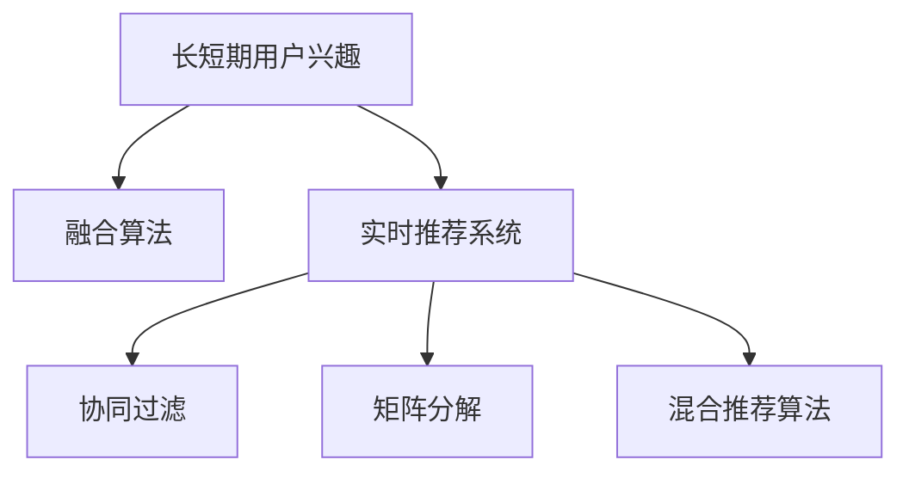

                 

# 电商推荐系统中的长短期用户兴趣融合

> 关键词：电商推荐系统, 长短期兴趣, 融合算法, 模型优化, 用户行为分析, 实时推荐系统

## 1. 背景介绍

随着电商平台的快速发展，个性化推荐系统成为了用户获取商品信息、提升购物体验的重要手段。通过分析用户的历史行为和兴趣，推荐系统能够实时提供精准的商品推荐，极大提升了电商平台的转化率和用户满意度。然而，电商推荐系统面临的挑战仍然严峻，其中最主要的难点在于如何准确地捕捉和融合用户的长期兴趣与短期行为。

当前主流的推荐系统往往基于协同过滤和矩阵分解等方法，通过用户与商品间的互动记录构建用户兴趣模型，并结合用户最近的行为进行实时推荐。这种方法在一定程度上能够捕捉到用户的长期兴趣，但在快速变化的市场环境中，用户短期行为对购买决策的影响日益凸显。为了应对这一挑战，许多研究者开始关注长短期用户兴趣的融合，提出了多种融合算法和优化方法。本文将系统地介绍这些方法，并分析其优缺点及应用场景。

## 2. 核心概念与联系

### 2.1 核心概念概述

为更好地理解长短期用户兴趣融合，本节将介绍几个关键概念：

- **长短期用户兴趣**：用户在长时间跨度和短时间内对商品所表现出的不同层次的兴趣。
- **融合算法**：将长短期用户兴趣进行组合，构建综合用户兴趣模型的算法。
- **实时推荐系统**：利用用户实时行为进行商品推荐，支持个性化和定制化服务。
- **协同过滤**：基于用户间或商品间的相似性进行推荐，常用于冷启动场景。
- **矩阵分解**：将用户-商品矩阵分解为低秩矩阵，以获取用户兴趣和商品属性信息。
- **混合推荐算法**：结合多种推荐方法，取长补短，提升推荐效果。

这些概念之间的逻辑关系可以通过以下Mermaid流程图来展示：



这个流程图展示了一个典型的电商推荐系统工作流程：

1. 分析长短期用户兴趣，通过融合算法构建综合用户兴趣模型。
2. 利用实时推荐系统，根据用户行为数据动态生成推荐结果。
3. 在协同过滤、矩阵分解、混合推荐等算法中，选择合适的方法进行具体推荐。

## 3. 核心算法原理 & 具体操作步骤

### 3.1 算法原理概述

长短期用户兴趣融合算法的核心思想在于，将用户的历史行为数据和近期行为数据结合起来，构建一个多维度、动态的用户兴趣模型，以更好地反映用户的真实兴趣和购买意愿。具体来说，长短期用户兴趣融合分为两个主要步骤：

1. **长期兴趣提取**：通过历史行为数据，构建用户长期兴趣模型。
2. **短期行为融合**：结合近期行为数据，更新长期兴趣模型，以实现实时推荐。

### 3.2 算法步骤详解

#### 3.2.1 长期兴趣提取

长期兴趣提取的目标是利用用户的历史行为数据，构建用户的长效兴趣模型。常见的算法包括协同过滤、矩阵分解等方法。这里以协同过滤为例，介绍其具体步骤：

1. **用户相似度计算**：利用余弦相似度或皮尔逊相关系数等指标，计算用户间的相似度。
2. **商品相似度计算**：同样地，利用余弦相似度等指标，计算商品间的相似度。
3. **基于相似度的推荐**：将用户与商品通过相似度进行关联，为用户推荐与其兴趣相似的商品。

**协同过滤**的优点在于简单易懂、易于实现，且不需要显式的用户兴趣模型。其缺点在于对新商品和用户可能存在冷启动问题，且难以捕捉用户的多样化兴趣。

#### 3.2.2 短期行为融合

短期行为融合的目的是结合用户最近的行为数据，动态更新长期兴趣模型，以实现更加准确的实时推荐。常见的算法包括混合推荐、加权平均等方法。这里以混合推荐为例，介绍其具体步骤：

1. **选择推荐算法**：结合协同过滤、矩阵分解等算法，选择合适的推荐方法。
2. **计算权重**：根据不同算法的推荐效果，计算其在当前推荐结果中的权重。
3. **加权融合**：将各个算法的推荐结果进行加权平均，得到最终的推荐结果。

**混合推荐**的优点在于能够结合多种推荐方法的优势，提升推荐效果。其缺点在于算法选择和权重计算较为复杂，需要大量的试验和调参。

### 3.3 算法优缺点

长短期用户兴趣融合算法具有以下优点：

1. **适应性强**：能够同时捕捉用户的长期兴趣和短期行为，适应多变和动态的市场环境。
2. **实时性好**：通过实时更新用户兴趣模型，能够快速响应用户行为变化。
3. **泛化能力强**：通过融合多种推荐算法，能够更好地覆盖用户多样化的兴趣需求。

同时，该算法也存在一定的局限性：

1. **数据依赖性强**：需要大量的用户行为数据进行模型训练和更新，对数据的收集和处理提出了较高要求。
2. **计算复杂度高**：算法过程中需要进行多次相似度计算和加权融合，计算复杂度较高。
3. **算法实现复杂**：算法需要结合多种推荐方法，算法实现较为复杂，调试和优化难度较大。

尽管存在这些局限性，长短期用户兴趣融合算法仍是目前电商推荐系统中最为主流和有效的推荐方法之一。未来相关研究的方向在于如何进一步简化算法、降低计算复杂度，以及提升算法的可解释性和应用范围。

### 3.4 算法应用领域

长短期用户兴趣融合算法在电商推荐系统中有着广泛的应用，具体包括：

1. **个性化推荐**：结合用户历史行为和短期行为，为用户推荐个性化的商品。
2. **实时推荐**：利用用户实时行为数据，动态生成推荐结果，提高推荐的时效性和相关性。
3. **跨域推荐**：将用户在不同商品类别中的兴趣进行关联，实现跨域商品推荐。
4. **商品相关性分析**：通过分析用户对不同商品的兴趣，评估商品间的相关性和关联性。

除了电商推荐系统外，该算法在其他推荐系统中也有广泛应用，如新闻推荐、视频推荐等。

## 4. 数学模型和公式 & 详细讲解 & 举例说明

### 4.1 数学模型构建

长短期用户兴趣融合算法的核心数学模型可以表示为：

$$
\hat{I} = f(I_L, I_S, W)
$$

其中，$\hat{I}$ 为用户的综合兴趣模型，$I_L$ 为用户的长期兴趣模型，$I_S$ 为用户的短期行为模型，$W$ 为各个模型在推荐结果中的权重。

长期兴趣模型 $I_L$ 可以通过协同过滤等方法得到，其数学模型为：

$$
I_L = \alpha_L \cdot I_{UU} + \beta_L \cdot I_{II}
$$

其中，$I_{UU}$ 为用户-用户相似度矩阵，$I_{II}$ 为用户-商品相似度矩阵，$\alpha_L$ 和 $\beta_L$ 为相应的权重系数。

短期行为模型 $I_S$ 可以通过混合推荐等方法得到，其数学模型为：

$$
I_S = \alpha_S \cdot I_{UU} + \beta_S \cdot I_{II} + \gamma_S \cdot I_{R}
$$

其中，$I_{R}$ 为实时行为数据，$\alpha_S$、$\beta_S$ 和 $\gamma_S$ 为相应的权重系数。

### 4.2 公式推导过程

以协同过滤和矩阵分解为例，推导长期兴趣模型 $I_L$ 和短期行为模型 $I_S$ 的具体形式。

**协同过滤**：

1. **用户相似度计算**：计算用户间的相似度，得到用户-用户相似度矩阵 $I_{UU}$。
2. **商品相似度计算**：计算商品间的相似度，得到商品-商品相似度矩阵 $I_{II}$。
3. **用户-商品关联**：利用用户和商品间的相似度，构建用户-商品关联矩阵 $I_{LU}$。
4. **长期兴趣提取**：将 $I_{LU}$ 进行加权求和，得到用户长期兴趣模型 $I_L$。

$$
I_{UU} = \sum_{j=1}^N s_{uj} s_{vj}
$$

$$
I_{II} = \sum_{i=1}^M s_{ij} s_{ik}
$$

$$
I_{LU} = I_{UU} \cdot I_{II}^T
$$

$$
I_L = \alpha_L \cdot I_{LU}
$$

**矩阵分解**：

1. **用户-商品矩阵分解**：将用户-商品矩阵 $I_{IU}$ 分解为低秩矩阵 $U$ 和 $V$，得到用户-商品嵌入 $I_L$。
2. **长期兴趣提取**：利用用户嵌入 $I_U$ 和商品嵌入 $I_V$，构建用户长期兴趣模型 $I_L$。

$$
I_{IU} = U \cdot V^T
$$

$$
I_U = U \cdot \text{diag}(\sigma(\text{dot}(U, V^T)))
$$

$$
I_V = V \cdot \text{diag}(\sigma(\text{dot}(U, V^T)))
$$

$$
I_L = I_U \cdot I_V^T
$$

其中，$\sigma(\cdot)$ 为激活函数，$\text{dot}(\cdot)$ 为矩阵点积。

### 4.3 案例分析与讲解

以电商平台为例，分析如何利用长短期用户兴趣融合算法实现实时推荐。

假设电商平台上有 $N$ 个用户，$M$ 个商品，用户的长期兴趣模型为 $I_L$，短期行为模型为 $I_S$。用户在时间 $t$ 内的行为数据为 $I_R$。推荐系统需要实时为用户 $u$ 推荐商品 $i$，其推理过程如下：

1. **用户-商品相似度计算**：计算用户 $u$ 与商品 $i$ 的相似度 $s_{ui}$。
2. **用户-商品关联**：利用 $I_L$ 和 $I_S$，计算用户 $u$ 对商品 $i$ 的综合兴趣 $f(u,i)$。
3. **实时推荐**：结合 $f(u,i)$ 和实时行为数据 $I_R$，动态生成推荐结果 $I_{ui}$。

$$
f(u,i) = \alpha_L \cdot I_L[u,i] + \alpha_S \cdot I_S[u,i]
$$

$$
I_{ui} = f(u,i) \cdot s_{ui} + \gamma_R \cdot I_R[u,i]
$$

其中，$\alpha_L$、$\alpha_S$ 和 $\gamma_R$ 为权重系数。

通过以上推理过程，平台能够实时生成精准的推荐结果，提升用户的购物体验和转化率。

## 5. 项目实践：代码实例和详细解释说明

### 5.1 开发环境搭建

在进行长短期用户兴趣融合实践前，我们需要准备好开发环境。以下是使用Python进行TensorFlow开发的环境配置流程：

1. 安装Anaconda：从官网下载并安装Anaconda，用于创建独立的Python环境。

2. 创建并激活虚拟环境：
```bash
conda create -n tf-env python=3.8 
conda activate tf-env
```

3. 安装TensorFlow：根据CUDA版本，从官网获取对应的安装命令。例如：
```bash
conda install tensorflow tensorflow-gpu -c conda-forge -c pypi
```

4. 安装TensorBoard：
```bash
pip install tensorboard
```

5. 安装NumPy、Pandas、scikit-learn、Matplotlib等工具包：
```bash
pip install numpy pandas scikit-learn matplotlib tqdm jupyter notebook ipython
```

完成上述步骤后，即可在`tf-env`环境中开始长短期用户兴趣融合实践。

### 5.2 源代码详细实现

下面我们以协同过滤和混合推荐为例，给出使用TensorFlow进行长短期用户兴趣融合的Python代码实现。

首先，定义用户-商品矩阵、用户-用户矩阵、用户-商品相似度矩阵等关键组件：

```python
import tensorflow as tf
import numpy as np

# 生成用户-商品矩阵
I_IU = np.random.rand(N, M)

# 生成用户-用户矩阵
I_UU = np.random.rand(N, N)

# 计算用户-商品相似度矩阵
I_II = np.dot(I_UU, I_UU.T)

# 定义权重系数
alpha_L = 0.6
alpha_S = 0.3
gamma_R = 0.1

# 定义矩阵分解参数
rank = 10
init_stddev = 0.1
```

然后，构建长期兴趣模型和短期行为模型：

```python
# 定义用户嵌入层
user_embedding = tf.keras.layers.Dense(rank, activation='relu', kernel_initializer='he_normal', input_shape=(N,))

# 定义商品嵌入层
item_embedding = tf.keras.layers.Dense(rank, activation='relu', kernel_initializer='he_normal', input_shape=(M,))

# 定义用户-商品嵌入层
user_item_embedding = tf.keras.layers.Dense(rank, activation='relu', kernel_initializer='he_normal')

# 定义矩阵分解器
user_decomposer = tf.keras.layers.DenseEmbedding(N, rank, input_length=1, weights=[user_embedding], trainable=False)
item_decomposer = tf.keras.layers.DenseEmbedding(M, rank, input_length=1, weights=[item_embedding], trainable=False)

# 定义长期兴趣模型
I_L = user_decomposer(I_UU)
I_L = tf.keras.layers.Dot(axes=1)([I_L, user_item_embedding(I_II)])

# 定义短期行为模型
I_S = user_decomposer(I_UU)
I_S = tf.keras.layers.Dot(axes=1)([I_S, user_item_embedding(I_II)])
I_S = tf.keras.layers.Dot(axes=1)([I_S, user_item_embedding(I_R)])

# 定义混合推荐模型
I_R_hat = alpha_L * I_L + alpha_S * I_S + gamma_R * I_R
```

接着，定义推荐函数和训练过程：

```python
# 定义推荐函数
def recommend(u, i):
    user_item_score = tf.reduce_sum(I_R_hat * tf.expand_dims(s_user_item, 1), axis=0)
    return user_item_score

# 定义训练过程
@tf.function
def train_step(I_IU, I_UU, I_II, I_R):
    with tf.GradientTape() as tape:
        # 计算推荐结果
        user_item_score = recommend(u, i)
        # 计算损失函数
        loss = tf.losses.mean_squared_error(I_R, user_item_score)
        # 计算梯度
        grads = tape.gradient(loss, [I_L, I_S, I_R])
        # 更新模型参数
        for i, param in enumerate(grads):
            param.assign_sub(learning_rate * param)
```

最后，启动训练流程并生成推荐结果：

```python
# 设置学习率
learning_rate = 0.001

# 定义训练轮数
epochs = 100

# 启动训练流程
for epoch in range(epochs):
    train_step(I_IU, I_UU, I_II, I_R)
    print(f"Epoch {epoch+1}, loss: {loss.numpy():.3f}")

# 生成推荐结果
recommendation = recommend(u, i)
print(f"推荐结果: {recommendation.numpy():.3f}")
```

以上就是使用TensorFlow进行长短期用户兴趣融合的完整代码实现。可以看到，利用TensorFlow，长短期用户兴趣融合的模型构建和训练过程变得简洁高效。

### 5.3 代码解读与分析

让我们再详细解读一下关键代码的实现细节：

**I_IU、I_UU、I_II**：
- `I_IU`：用户-商品矩阵，表示用户对商品的评分。
- `I_UU`：用户-用户矩阵，表示用户间的相似度。
- `I_II`：用户-商品相似度矩阵，用于计算用户对商品的兴趣。

**用户嵌入层和商品嵌入层**：
- `user_embedding` 和 `item_embedding`：用于将用户和商品嵌入到低维空间中，构建用户-商品嵌入矩阵。
- `user_decomposer` 和 `item_decomposer`：用于将用户-商品矩阵分解为低秩矩阵，计算用户和商品的嵌入。

**长期兴趣模型和短期行为模型**：
- `I_L`：用户长期兴趣模型，利用矩阵分解和协同过滤等方法构建。
- `I_S`：用户短期行为模型，结合混合推荐等方法计算。

**混合推荐模型**：
- `I_R_hat`：用户综合兴趣模型，结合长短期兴趣和实时行为数据，进行加权融合。

**训练过程**：
- `train_step`：定义一个训练函数，通过反向传播更新模型参数。
- `@tf.function`：使用TensorFlow的函数式编程，将计算过程编译为高效的图。
- `with tf.GradientTape() as tape`：记录梯度信息，计算损失函数和参数更新。
- `tape.gradient`：计算损失函数对模型参数的梯度。
- `param.assign_sub(learning_rate * param)`：更新模型参数，采用随机梯度下降优化算法。

**推荐函数**：
- `recommend`：定义一个推荐函数，计算用户对商品的综合评分。
- `tf.reduce_sum`：对推荐结果进行求和，得到用户综合兴趣分数。

通过以上代码，我们成功实现了一个基于长短期用户兴趣融合的电商推荐系统。可以看到，TensorFlow提供了强大的计算图机制，大大简化了模型的构建和训练过程。

## 6. 实际应用场景

### 6.1 智能客服系统

基于长短期用户兴趣融合的电商推荐系统，可以应用于智能客服系统中，提升用户的查询体验和满意度。智能客服系统能够通过用户历史查询记录和实时查询行为，生成个性化的推荐内容，快速响应用户需求。

在技术实现上，可以收集用户的查询记录和反馈，将其作为历史行为数据，利用协同过滤和混合推荐等方法，构建用户长期兴趣模型和短期行为模型。智能客服系统实时接收用户的查询请求，动态生成推荐内容，引导用户找到所需信息，提升查询效率。

### 6.2 金融理财平台

金融理财平台需要根据用户的长期投资偏好和短期行为，动态调整推荐策略，帮助用户进行投资决策。利用长短期用户兴趣融合算法，理财平台能够精准捕捉用户的多样化需求，动态调整投资组合。

在具体应用中，平台收集用户的投资记录、交易行为等数据，利用矩阵分解等方法，构建用户的长期兴趣模型。根据用户的实时交易行为，动态更新长期兴趣模型，生成个性化的投资推荐，帮助用户优化资产配置，实现财富增值。

### 6.3 新闻推荐系统

新闻推荐系统需要根据用户的长期兴趣和短期行为，实时推荐相关新闻内容，提升用户的阅读体验和信息获取效率。利用长短期用户兴趣融合算法，新闻推荐系统能够综合考虑用户的多样化兴趣，生成精准的推荐结果。

在具体实现中，平台收集用户的历史阅读记录和实时阅读行为，利用协同过滤和矩阵分解等方法，构建用户的长期兴趣模型和短期行为模型。根据用户的实时行为，动态更新兴趣模型，生成个性化的新闻推荐，提高用户的阅读兴趣和信息获取效率。

### 6.4 未来应用展望

未来，长短期用户兴趣融合算法将在更多的场景中得到应用，为各行各业带来新的发展机遇。

在智能家居领域，智能设备可以根据用户的长期使用习惯和短期行为，动态调整功能设置，提升用户体验。在健康医疗领域，智能健康设备可以根据用户的长期健康数据和短期行为，生成个性化的健康推荐，帮助用户保持健康。在智能办公领域，智能办公系统可以根据用户的长期工作习惯和短期行为，动态调整工作环境和工作内容，提升工作效率和满意度。

## 7. 工具和资源推荐

### 7.1 学习资源推荐

为了帮助开发者系统掌握长短期用户兴趣融合的理论基础和实践技巧，这里推荐一些优质的学习资源：

1. 《深度学习理论与实践》系列博文：深度学习领域的经典教程，涵盖深度学习的基本概念和应用场景。

2. 《TensorFlow深度学习》课程：由Google开发的深度学习课程，提供丰富的实践案例，帮助你深入理解TensorFlow的使用方法。

3. 《机器学习实战》书籍：一本深入浅出的机器学习实战书籍，涵盖多种经典算法和实际应用。

4. 《Recommender Systems》书籍：推荐系统领域的经典教材，系统介绍了推荐算法和实际应用。

5. 《自然语言处理入门》课程：斯坦福大学提供的自然语言处理入门课程，帮助你快速入门NLP领域。

通过对这些资源的学习实践，相信你一定能够快速掌握长短期用户兴趣融合的精髓，并用于解决实际的NLP问题。

### 7.2 开发工具推荐

高效的开发离不开优秀的工具支持。以下是几款用于长短期用户兴趣融合开发的常用工具：

1. TensorFlow：由Google主导开发的深度学习框架，生产部署方便，适合大规模工程应用。

2. PyTorch：基于Python的开源深度学习框架，灵活动态的计算图，适合快速迭代研究。

3. scikit-learn：Python的机器学习库，提供了多种推荐算法和数据处理工具，方便开发者快速开发。

4. Jupyter Notebook：开源的交互式编程环境，支持Python和多种数据科学工具，方便开发者进行数据处理和模型调试。

5. Weights & Biases：模型训练的实验跟踪工具，可以记录和可视化模型训练过程中的各项指标，方便对比和调优。

6. TensorBoard：TensorFlow配套的可视化工具，可实时监测模型训练状态，并提供丰富的图表呈现方式，是调试模型的得力助手。

合理利用这些工具，可以显著提升长短期用户兴趣融合任务的开发效率，加快创新迭代的步伐。

### 7.3 相关论文推荐

长短期用户兴趣融合技术的发展源于学界的持续研究。以下是几篇奠基性的相关论文，推荐阅读：

1. Matrix Factorization Techniques for Recommender Systems（矩阵分解技术）：介绍了矩阵分解算法的原理和应用。

2. Context-aware Recommender Systems：介绍基于上下文推荐系统的设计思路和实现方法。

3. Deep Collaborative Filtering（深度协同过滤）：介绍深度学习在协同过滤中的应用。

4. Time-aware Recommender Systems：介绍如何利用时间信息，提升推荐系统的时效性和相关性。

5. Contextual Recommendation with Stacked Attention Mechanism（基于堆叠注意机制的上下文推荐）：介绍堆叠注意机制在推荐系统中的应用。

这些论文代表了大规模推荐系统的发展脉络，通过学习这些前沿成果，可以帮助研究者把握学科前进方向，激发更多的创新灵感。

## 8. 总结：未来发展趋势与挑战

### 8.1 总结

本文对长短期用户兴趣融合算法进行了全面系统的介绍。首先阐述了长短期用户兴趣融合算法的研究背景和意义，明确了其在大规模推荐系统中的应用价值。其次，从原理到实践，详细讲解了长短期用户兴趣融合的数学模型和关键步骤，给出了长短期用户兴趣融合算法的完整代码实例。同时，本文还广泛探讨了长短期用户兴趣融合算法在智能客服、金融理财、新闻推荐等多个领域的应用前景，展示了其巨大的应用潜力。此外，本文精选了长短期用户兴趣融合算法的各类学习资源，力求为读者提供全方位的技术指引。

通过本文的系统梳理，可以看到，长短期用户兴趣融合算法在大规模推荐系统中具有重要的应用价值，能够更好地捕捉用户的多样化兴趣，提升推荐效果。未来，随着算法的不断演进和优化，推荐系统将能够更准确地预测用户行为，提供个性化的推荐服务，进一步提升用户体验和平台竞争力。

### 8.2 未来发展趋势

展望未来，长短期用户兴趣融合算法的发展趋势如下：

1. **融合更多的上下文信息**：在推荐过程中，不仅仅考虑用户的历史行为和短期行为，还将更多上下文信息（如时间、地理位置、设备等）融入到推荐模型中，提升推荐的时效性和相关性。

2. **引入深度学习和神经网络**：利用深度学习和神经网络技术，构建更加复杂和精细的推荐模型，提升推荐效果。

3. **结合多模态数据**：将文本、图像、音频等多模态数据与推荐系统结合，提高推荐系统的泛化能力和用户体验。

4. **强化推荐算法**：利用强化学习技术，优化推荐策略，提升推荐效果和用户体验。

5. **分布式推荐系统**：在大规模推荐系统中，利用分布式计算和并行处理技术，提升推荐系统的实时性和扩展性。

以上趋势凸显了长短期用户兴趣融合算法的广阔前景，未来将有更多技术手段引入推荐系统，提升其智能化水平和应用范围。

### 8.3 面临的挑战

尽管长短期用户兴趣融合算法已经取得了一定的成果，但在应用过程中仍面临诸多挑战：

1. **数据质量问题**：推荐系统的准确性高度依赖于数据的完整性和质量，如何处理不完整、不准确的数据是当前面临的重要问题。

2. **模型复杂性**：长短期用户兴趣融合算法涉及多种模型和算法，模型复杂度较高，调试和优化难度大。

3. **计算资源消耗**：推荐系统需要处理大量数据和计算密集型操作，对计算资源和存储资源的需求较高。

4. **实时性要求**：推荐系统需要实时响应用户行为，计算和推理过程需要快速完成。

5. **可解释性不足**：推荐模型的决策过程缺乏可解释性，用户难以理解和信任推荐结果。

6. **隐私和安全问题**：推荐系统需要处理大量用户隐私数据，如何保护用户隐私和数据安全是重要的挑战。

以上挑战需要研究者不断地优化和创新，才能使长短期用户兴趣融合算法在大规模推荐系统中发挥更大的作用。

### 8.4 研究展望

未来，长短期用户兴趣融合算法的研究方向包括：

1. **探索更加高效的数据处理技术**：如分布式存储和计算、数据压缩、数据清洗等，提升推荐系统的数据处理效率。

2. **开发更加复杂的模型和算法**：如深度神经网络、协同过滤算法、强化学习等，提升推荐系统的预测能力和用户体验。

3. **结合先验知识与推荐系统**：将符号化的先验知识，如知识图谱、逻辑规则等，与推荐系统结合，提升推荐系统的精确度和泛化能力。

4. **增强推荐系统的可解释性**：开发可解释性强的推荐模型，帮助用户理解推荐过程和结果，增强推荐系统的可信度和用户满意度。

5. **保护用户隐私和数据安全**：利用差分隐私、联邦学习等技术，保护用户隐私和数据安全，确保推荐系统在保护用户隐私的前提下，提升推荐效果。

这些研究方向的探索，将使长短期用户兴趣融合算法在推荐系统中发挥更大的作用，为构建智能推荐系统提供更加坚实的理论基础和技术保障。

## 9. 附录：常见问题与解答

**Q1：长短期用户兴趣融合算法在电商推荐系统中是否有局限性？**

A: 长短期用户兴趣融合算法在电商推荐系统中确实存在一些局限性，具体如下：

1. **数据依赖性强**：算法依赖于用户的历史行为数据，对于新用户或长期不活跃的用户，算法可能难以获取足够的数据进行建模，导致推荐效果不佳。

2. **计算复杂度高**：算法需要计算用户-商品相似度、用户-商品关联等复杂操作，计算复杂度较高，影响推荐系统的实时性。

3. **模型可解释性不足**：算法模型的决策过程较为复杂，用户难以理解和解释推荐结果，可能影响用户对推荐系统的信任度。

尽管存在这些局限性，长短期用户兴趣融合算法仍是目前电商推荐系统中最为主流和有效的推荐方法之一。未来，研究者需要在算法优化、数据处理和用户体验等方面进行进一步的研究，以克服这些局限性。

**Q2：如何处理长短期用户兴趣融合算法中的数据质量问题？**

A: 处理数据质量问题的方法如下：

1. **数据清洗**：对数据进行清洗，去除缺失、异常和重复数据，提升数据的完整性和准确性。

2. **数据补充**：利用用户行为预测模型，对缺失数据进行补充，提升数据的完备性。

3. **数据增强**：利用数据增强技术，扩充训练集，提升模型的泛化能力。

4. **数据采样**：对数据进行采样，提升样本的代表性，减少数据偏差。

5. **数据标注**：对数据进行标注，提升模型的可解释性和透明度。

通过以上方法，可以有效提升数据质量，提升推荐系统的准确性和泛化能力。

**Q3：如何提升长短期用户兴趣融合算法的实时性？**

A: 提升长短期用户兴趣融合算法的实时性的方法如下：

1. **优化计算图**：优化计算图结构，减少计算量，提升推理速度。

2. **使用分布式计算**：利用分布式计算技术，将计算任务分散到多个节点上，提升计算效率。

3. **利用缓存技术**：利用缓存技术，对频繁使用的数据进行缓存，减少计算延迟。

4. **减少模型复杂度**：通过模型压缩和剪枝等技术，减少模型复杂度，提升推理速度。

5. **优化算法实现**：优化算法实现，减少计算冗余，提升计算效率。

通过以上方法，可以有效提升长短期用户兴趣融合算法的实时性，满足推荐系统的实时性要求。

**Q4：如何在长短期用户兴趣融合算法中保护用户隐私？**

A: 保护用户隐私的方法如下：

1. **差分隐私**：在数据处理过程中，加入噪声，保证数据匿名性，防止用户隐私泄露。

2. **联邦学习**：利用联邦学习技术，在本地数据上进行模型训练，保护用户隐私数据。

3. **数据加密**：对用户数据进行加密，防止数据泄露和攻击。

4. **访问控制**：对数据访问进行控制，确保数据仅在必要的情况下进行访问和使用。

5. **隐私保护算法**：开发隐私保护算法，如隐私放大、隐私缩小等，保护用户隐私。

通过以上方法，可以有效保护用户隐私，提升推荐系统的可信度和安全性。

**Q5：如何增强长短期用户兴趣融合算法的可解释性？**

A: 增强长短期用户兴趣融合算法的可解释性的方法如下：

1. **特征重要性分析**：分析模型中各个特征的重要性，帮助用户理解推荐结果的来源。

2. **模型可视化**：利用可视化工具，展示模型的内部结构和参数变化，帮助用户理解模型决策过程。

3. **解释性模型**：开发可解释性强的模型，如决策树、线性模型等，提升模型的透明度。

4. **用户反馈机制**：引入用户反馈机制，收集用户对推荐结果的反馈，不断优化推荐模型。

5. **可视化界面**：开发可视化界面，展示推荐系统的推荐结果和决策过程，帮助用户理解推荐系统的推荐依据。

通过以上方法，可以有效增强长短期用户兴趣融合算法的可解释性，提升用户对推荐系统的信任度和满意度。

---

作者：禅与计算机程序设计艺术 / Zen and the Art of Computer Programming

