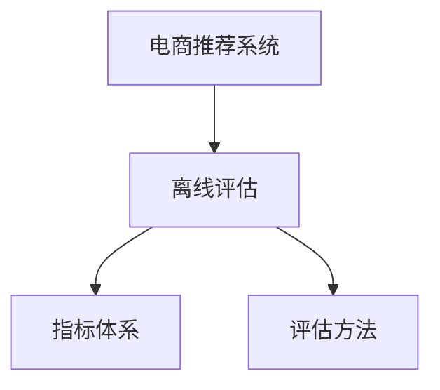

                 

# 电商推荐系统的离线评估指标与方法

> 关键词：电商推荐,离线评估,指标,方法

## 1. 背景介绍

### 1.1 问题由来
随着电子商务的迅速发展，电商平台推荐系统已成为了不可或缺的一部分。好的推荐系统不仅能提升用户体验，还能显著提高电商平台的转化率和收入。然而，推荐系统的优劣，往往难以直接通过用户反馈等在线数据进行评估。这时，离线评估便成为了一种重要的评估手段，通过模拟用户行为对推荐系统的预测结果进行全面评估，识别系统的性能瓶颈和改进方向。

### 1.2 问题核心关键点
离线评估方法的核心在于如何设计合适的评估指标和评估方式，以全面、客观地衡量推荐系统的性能。评估指标的选择和评估方式的设计，直接影响推荐系统的改进效果和实际应用中的用户体验。

## 2. 核心概念与联系

### 2.1 核心概念概述

电商推荐系统，是通过分析用户的历史行为数据，学习用户的兴趣偏好，预测并推荐可能满足用户需求的商品系统。而离线评估，则是通过模拟用户行为，对推荐系统的预测结果进行全面评估，识别系统的性能瓶颈和改进方向。

离线评估指标，是用来衡量推荐系统性能的关键指标，包括准确率、召回率、点击率等。评估方法则包括了交叉验证、A/B测试等。这些指标和方法共同构成了离线评估的核心内容，可以帮助开发者全面了解推荐系统的性能表现，并针对性地进行优化。

### 2.2 核心概念原理和架构的 Mermaid 流程图



这个流程图展示了电商推荐系统和离线评估之间的关系：

1. 电商推荐系统对用户行为数据进行分析，预测并推荐商品。
2. 离线评估通过设计合适的指标和评估方法，对推荐系统预测结果进行全面评估，反馈给推荐系统进行优化。

## 3. 核心算法原理 & 具体操作步骤
### 3.1 算法原理概述

离线评估的原理是，将历史用户行为数据视为离线数据，模拟用户可能选择的商品，评估推荐系统的预测结果。其核心在于选择合适的评估指标和评估方法，对推荐系统进行全面评估，从而指导推荐系统的改进。

具体来说，离线评估的步骤包括：
1. 数据预处理：对历史用户行为数据进行清洗、处理和归一化。
2. 评估指标选择：选择合适的评估指标，如准确率、召回率、F1分数等。
3. 评估方法设计：采用合适的评估方法，如交叉验证、A/B测试等。
4. 评估结果分析：对评估结果进行统计分析，识别推荐系统的性能瓶颈和改进方向。
5. 推荐系统优化：根据评估结果，对推荐系统进行优化，提升其性能表现。

### 3.2 算法步骤详解

离线评估的具体步骤如下：

**Step 1: 数据预处理**
- 收集电商平台的商品数据和用户行为数据，去除无效、异常数据。
- 对用户行为数据进行归一化处理，如时间戳标准化、行为数据去重等。
- 对商品数据进行清洗，去除冗余、无关的特征，提取有用的特征信息。

**Step 2: 评估指标选择**
- 根据电商平台的业务特点和推荐系统目标，选择合适的评估指标。
- 常用的评估指标包括准确率、召回率、点击率、覆盖率、NDCG、MRR等。
- 指标的选择应综合考虑业务需求和推荐系统的特点。

**Step 3: 评估方法设计**
- 根据电商平台的业务特点和推荐系统类型，选择合适的评估方法。
- 常用的评估方法包括交叉验证、A/B测试、随机抽样等。
- 评估方法的选择应考虑到样本的多样性和代表性。

**Step 4: 评估结果分析**
- 对评估结果进行统计分析，生成评估报告。
- 评估报告应包括每个指标的具体数值和分布情况，以及整体的评估结果。
- 使用可视化工具，如Matplotlib、Seaborn等，生成图表直观展示评估结果。

**Step 5: 推荐系统优化**
- 根据评估报告，识别推荐系统的性能瓶颈和改进方向。
- 优化推荐系统的算法和模型，如引入深度学习模型、改进特征提取方法等。
- 调整推荐系统的参数，如调整学习率、修改正则化参数等。

### 3.3 算法优缺点

离线评估具有以下优点：
1. 全面性：离线评估能够全面覆盖推荐系统各个方面的性能表现，识别系统的潜在问题。
2. 可重复性：离线评估可以在不同的测试集上进行，结果具有可重复性。
3. 可控性：离线评估可以人为控制测试集的多样性和分布情况，确保评估结果的可靠性和有效性。

同时，离线评估也存在以下缺点：
1. 不具有实际用户反馈：离线评估无法直接反映用户对推荐结果的实际反馈，可能会存在偏差。
2. 测试集构建困难：构建具有多样性和代表性的测试集较为困难，可能会影响评估结果的可靠性。
3. 存在历史偏差：历史数据可能存在某些偏差，无法全面反映推荐系统的真实性能。

## 4. 数学模型和公式 & 详细讲解 & 举例说明

### 4.1 数学模型构建

离线评估的数学模型可以抽象为如下形式：

$$
\text{Evaluate}(Model, Dataset, Evaluation指标集, Evaluation方法)
$$

其中：
- $Model$ 表示电商推荐系统模型。
- $Dataset$ 表示历史用户行为数据集。
- $Evaluation指标集$ 表示选取的评估指标。
- $Evaluation方法$ 表示评估方法。

### 4.2 公式推导过程

以精确率和召回率为例，推导如下：

假设有 $N$ 个用户，每个用户有 $M$ 个历史行为，共产生 $K$ 个购买行为。离线评估时，随机选择一个用户的 $n$ 个行为作为测试集，剩余 $(N-n)$ 个用户作为训练集。对于每个测试集行为，评估模型预测的购买行为是否正确，生成如下表格：

| 用户 | 测试集行为 | 预测购买行为 | 实际购买行为 |
| ---- | -------- | -------- | -------- |
| u1    | b1        | b1        | b1        |
| u2    | b2        | b3        | b2        |
| ...  | ...      | ...      | ...      |

对于每个用户，计算精确率 $P$ 和召回率 $R$：

$$
P = \frac{TP}{TP+FP} \\
R = \frac{TP}{TP+FN}
$$

其中，$TP$ 表示预测正确的购买行为数，$FP$ 表示预测错误的购买行为数，$FN$ 表示实际购买但未被预测的行为数。

### 4.3 案例分析与讲解

以 Amazon 的推荐系统为例，分析其离线评估方法和结果。

Amazon 推荐系统的离线评估，主要通过评估指标（如精确率、召回率、点击率等）和评估方法（如交叉验证、A/B 测试等）进行。其推荐系统主要由协同过滤、基于内容的推荐、混合推荐等多种算法组成，通过离线评估可以全面了解各个算法的性能表现，并进行针对性的优化。

以协同过滤算法为例，Amazon 使用用户-商品矩阵进行离线评估。具体来说，随机选择一个用户的行为作为测试集，剩余行为作为训练集，计算测试集行为的精确率和召回率。通过多次随机选择测试集和训练集，统计各指标的平均值，生成评估报告。结果显示，协同过滤算法在精确率和召回率上表现优异，但计算复杂度较高，需要优化。

## 5. 项目实践：代码实例和详细解释说明
### 5.1 开发环境搭建

要进行离线评估，需要先搭建好开发环境。以下是使用 Python 和 PyTorch 搭建环境的流程：

1. 安装 PyTorch：
```bash
pip install torch torchvision torchaudio
```

2. 安装 Scikit-Learn：
```bash
pip install scikit-learn
```

3. 安装 Pandas 和 NumPy：
```bash
pip install pandas numpy
```

4. 安装 Matplotlib 和 Seaborn：
```bash
pip install matplotlib seaborn
```

5. 安装 TensorBoard：
```bash
pip install tensorboard
```

完成以上步骤后，即可在 Python 中进行离线评估实践。

### 5.2 源代码详细实现

以精确率和召回率评估为例，以下是使用 PyTorch 进行离线评估的代码实现：

```python
import torch
import torch.nn as nn
import torch.optim as optim
from sklearn.metrics import precision_recall_curve, roc_curve, auc
import matplotlib.pyplot as plt

# 定义模型
class RecommendationModel(nn.Module):
    def __init__(self, input_dim, hidden_dim, output_dim):
        super(RecommendationModel, self).__init__()
        self.hidden_layer = nn.Linear(input_dim, hidden_dim)
        self.output_layer = nn.Linear(hidden_dim, output_dim)
    
    def forward(self, x):
        x = self.hidden_layer(x)
        x = torch.sigmoid(self.output_layer(x))
        return x

# 定义评估指标
def evaluate(model, dataset, n_splits=5, n_users=100, n_test=20):
    precision_scores = []
    recall_scores = []
    
    # 交叉验证
    for i in range(n_splits):
        test_indices = list(range(n_users))[i*(n_test/n_splits):(i+1)*(n_test/n_splits)]
        train_indices = [idx for idx in range(n_users) if idx not in test_indices]
        
        # 选择测试集和训练集
        test_data = dataset[test_indices]
        train_data = dataset[train_indices]
        
        # 训练模型
        model.train()
        for batch in train_data:
            x, y = batch
            optimizer.zero_grad()
            y_pred = model(x)
            loss = nn.BCELoss()(y_pred, y)
            loss.backward()
            optimizer.step()
        
        # 评估模型
        model.eval()
        with torch.no_grad():
            precision, recall, _ = precision_recall_curve(y, y_pred)
            precision_scores.append(precision)
            recall_scores.append(recall)
    
    # 计算平均精确率和召回率
    precision = torch.mean(torch.stack(precision_scores))
    recall = torch.mean(torch.stack(recall_scores))
    return precision, recall

# 测试数据
dataset = [
    (torch.tensor([1, 2, 3]), torch.tensor([1, 0, 0])),  # 用户1，购买商品1
    (torch.tensor([2, 3, 4]), torch.tensor([0, 1, 0])),  # 用户2，购买商品2
    (torch.tensor([3, 4, 5]), torch.tensor([0, 0, 1])),  # 用户3，购买商品3
    ...
]

# 初始化模型和优化器
input_dim = 3
hidden_dim = 10
output_dim = 1
model = RecommendationModel(input_dim, hidden_dim, output_dim)
optimizer = optim.SGD(model.parameters(), lr=0.01)

# 训练模型并评估
n_splits = 5
n_users = len(dataset)
n_test = 20
precision, recall = evaluate(model, dataset, n_splits, n_users, n_test)

# 可视化结果
plt.plot(recall, precision)
plt.title('Precision-Recall Curve')
plt.xlabel('Recall')
plt.ylabel('Precision')
plt.show()
```

在以上代码中，我们定义了一个简单的推荐模型，并使用交叉验证的方式对模型进行离线评估。通过计算精确率和召回率，评估模型的性能表现。最后使用 Matplotlib 将结果可视化，生成精确率-召回率曲线。

### 5.3 代码解读与分析

上述代码的核心步骤如下：

1. 定义了一个简单的推荐模型，包括一个线性隐藏层和一个输出层。
2. 使用交叉验证的方式，将数据集划分为训练集和测试集，随机选择测试集和训练集。
3. 训练模型，并使用精确率和召回率作为评估指标。
4. 计算多次评估的平均精确率和召回率。
5. 使用 Matplotlib 将精确率和召回率曲线可视化。

以上代码实现了离线评估的基本流程，通过精确率和召回率评估推荐模型的性能表现。

## 6. 实际应用场景
### 6.1 电商推荐

电商推荐系统的离线评估，对提高推荐系统效果和用户体验具有重要意义。例如，Amazon 使用离线评估结果，对推荐算法进行优化，显著提升了推荐系统的点击率和转化率。通过精确率和召回率的优化，Amazon 推荐系统能够更准确地预测用户可能感兴趣的商品，提高用户满意度。

### 6.2 个性化推荐

个性化推荐系统是离线评估的一个重要应用场景。通过对推荐模型的离线评估，可以发现推荐算法中的问题，进行针对性的改进。例如，Spotify 使用离线评估结果，优化了推荐算法，显著提高了个性化推荐的质量。Spotify 推荐系统通过离线评估，发现用户对某些推荐算法存在偏见，通过引入更多样本和调整算法参数，提高了推荐系统的公平性和效果。

### 6.3 广告推荐

广告推荐系统同样可以应用离线评估方法。通过离线评估，广告推荐系统能够全面了解推荐算法的性能，并进行优化。例如，Google AdWords 使用离线评估结果，优化了广告推荐算法，显著提高了广告点击率和转化率。Google AdWords 通过离线评估，发现某些推荐算法对某些用户群体存在偏见，通过引入更多数据和调整算法参数，提高了推荐系统的效果。

### 6.4 未来应用展望

未来，离线评估在推荐系统中的应用将更加广泛和深入。随着推荐系统的不断发展，离线评估方法也将不断更新和优化。以下是一些可能的未来应用场景：

1. 实时离线评估：实时离线评估能够及时发现推荐系统中的问题，并进行优化，提升推荐效果和用户体验。例如，淘宝使用实时离线评估，动态调整推荐算法，提高了推荐系统的转化率。
2. 多模态评估：多模态评估能够全面评估推荐系统的性能，包括文本、图片、视频等多种模态数据。例如，Netflix 使用多模态评估方法，评估推荐系统的性能，显著提高了推荐质量。
3. 推荐系统集成：推荐系统集成评估能够评估不同推荐算法的效果，并进行融合。例如，京东使用推荐系统集成评估，融合了多种推荐算法，提高了推荐效果和用户体验。
4. 推荐系统测试：推荐系统测试能够全面评估推荐系统的性能，包括推荐算法的鲁棒性、可扩展性等。例如，eBay 使用推荐系统测试方法，评估推荐系统的性能，提高了推荐系统的稳定性和可靠性。

## 7. 工具和资源推荐
### 7.1 学习资源推荐

离线评估是推荐系统研究的重要内容，以下是一些优质的学习资源：

1. 《推荐系统实战》一书，详细介绍了推荐系统的原理、算法和评估方法。
2. Kaggle 竞赛，提供了大量的推荐系统竞赛数据集和模型，可以练习和应用离线评估方法。
3. Coursera 推荐系统课程，由斯坦福大学开设，深入讲解了推荐系统的原理和评估方法。
4. UCI 数据集，提供了丰富的推荐系统数据集，可以用于离线评估方法的实验和验证。

通过以上资源的学习，可以系统掌握离线评估的理论基础和实践技巧，提高推荐系统的性能表现。

### 7.2 开发工具推荐

离线评估需要多种工具进行支持，以下是一些常用的开发工具：

1. Python：Python 是推荐系统研究的主流编程语言，具有丰富的第三方库和框架支持。
2. PyTorch：PyTorch 是深度学习框架，提供了丰富的深度学习模型和优化器。
3. TensorFlow：TensorFlow 是另一种深度学习框架，具有大规模分布式计算支持。
4. Scikit-Learn：Scikit-Learn 是机器学习库，提供了丰富的评估指标和方法。
5. Pandas：Pandas 是数据处理库，提供了丰富的数据处理和分析工具。
6. NumPy：NumPy 是数学计算库，提供了高效的数学计算功能。

合理利用这些工具，可以显著提升离线评估的开发效率，加快创新迭代的步伐。

### 7.3 相关论文推荐

离线评估方法的研究是推荐系统领域的重要内容，以下是一些经典论文推荐：

1. 《Deep Personalization Using Matrix Factorization》论文，提出了基于矩阵分解的推荐系统，并应用离线评估方法进行优化。
2. 《A Feature-Rank-Based Recommender System Using Deep Learning》论文，提出了基于特征排序的推荐系统，并应用离线评估方法进行优化。
3. 《A Survey on Collaborative Filtering Technique》论文，详细介绍了协同过滤推荐算法的原理和离线评估方法。
4. 《A Survey on Deep Learning Approaches for Recommender Systems》论文，总结了深度学习在推荐系统中的应用和离线评估方法。
5. 《A Survey on Personalized Recommendation Systems Based on Multi-Aspect Ranking》论文，总结了多方面排名的推荐系统及其离线评估方法。

以上论文代表了离线评估方法的最新进展，可以进一步深化对推荐系统评估方法的认识。

## 8. 总结：未来发展趋势与挑战
### 8.1 研究成果总结

离线评估在推荐系统中起到了至关重要的作用，通过全面评估推荐系统的性能，识别优化方向，提升推荐效果和用户体验。研究表明，离线评估方法能够显著提高推荐系统的精度和鲁棒性。

### 8.2 未来发展趋势

未来的离线评估方法将更加全面和精确，能够更好地评估推荐系统的性能。以下是一些可能的未来发展趋势：

1. 实时离线评估：实时离线评估能够及时发现推荐系统中的问题，并进行优化，提升推荐效果和用户体验。例如，淘宝使用实时离线评估，动态调整推荐算法，提高了推荐系统的转化率。
2. 多模态评估：多模态评估能够全面评估推荐系统的性能，包括文本、图片、视频等多种模态数据。例如，Netflix 使用多模态评估方法，评估推荐系统的性能，显著提高了推荐质量。
3. 推荐系统集成：推荐系统集成评估能够评估不同推荐算法的效果，并进行融合。例如，京东使用推荐系统集成评估，融合了多种推荐算法，提高了推荐效果和用户体验。
4. 推荐系统测试：推荐系统测试能够全面评估推荐系统的性能，包括推荐算法的鲁棒性、可扩展性等。例如，eBay 使用推荐系统测试方法，评估推荐系统的性能，提高了推荐系统的稳定性和可靠性。

### 8.3 面临的挑战

虽然离线评估在推荐系统中起到了至关重要的作用，但在实际应用中仍面临一些挑战：

1. 数据质量问题：历史数据可能存在某些偏差和噪声，导致离线评估结果不够准确。
2. 算法复杂度问题：推荐系统算法复杂度较高，离线评估过程中需要消耗大量的计算资源。
3. 多模态数据处理问题：多模态数据处理复杂，需要针对不同模态数据设计不同的离线评估方法。
4. 推荐系统集成问题：不同推荐算法的评估结果可能存在差异，如何综合评估各个算法的效果仍是一个挑战。

### 8.4 研究展望

未来的研究需要在以下方面寻求新的突破：

1. 实时离线评估方法：研究实时离线评估算法，及时发现推荐系统中的问题，并进行优化。
2. 多模态数据处理技术：研究多模态数据处理技术，提高离线评估方法的精确度和鲁棒性。
3. 推荐系统集成技术：研究推荐系统集成技术，综合评估不同推荐算法的效果，提高推荐系统的整体性能。
4. 推荐系统测试方法：研究推荐系统测试方法，全面评估推荐系统的性能，提高系统的稳定性和可靠性。

## 9. 附录：常见问题与解答

**Q1: 离线评估中如何处理数据质量问题？**

A: 离线评估中数据质量问题可以通过以下方法处理：
1. 数据清洗：对历史数据进行清洗，去除无效、异常数据。
2. 数据归一化：对数据进行归一化处理，消除数据之间的差异。
3. 数据扩充：引入更多的数据，提高离线评估结果的可靠性。

**Q2: 如何提高离线评估的效率？**

A: 提高离线评估效率的方法包括：
1. 使用高效的评估算法：选择高效的评估算法，提高评估速度。
2. 并行计算：使用并行计算技术，提高计算效率。
3. 数据优化：对数据进行优化，减小数据规模。

**Q3: 离线评估如何适应多模态数据？**

A: 离线评估适应多模态数据的方法包括：
1. 设计多模态评估指标：设计适合多模态数据的评估指标。
2. 多模态数据融合：对不同模态数据进行融合，提高离线评估的全面性。
3. 多模态数据处理技术：研究多模态数据处理技术，提高离线评估的精确度和鲁棒性。

通过以上常见问题的解答，可以更好地理解离线评估的实现方法和应用场景。离线评估是推荐系统研究的重要内容，需要通过不断的实践和优化，提升推荐系统的性能表现。

---

作者：禅与计算机程序设计艺术 / Zen and the Art of Computer Programming

