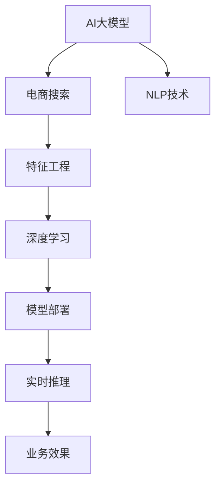

                 

# 电商搜索中AI大模型的特征工程

> 关键词：AI大模型,特征工程,电商搜索,自然语言处理,深度学习,性能优化,模型部署

## 1. 背景介绍

在电商领域，搜索系统是用户获取商品信息的重要渠道。传统的搜索系统基于关键词匹配、倒排索引等技术，通过全文中出现频率计算进行排名，缺乏语义理解，无法精准匹配用户意图。为提升搜索质量，电商企业纷纷引入AI大模型进行改进，利用深度学习技术挖掘商品语义信息，提供更精准的商品推荐。

本文聚焦于如何通过特征工程优化电商搜索系统中的大模型，提升模型对商品语义的捕捉和匹配能力，进而提升搜索质量。我们将从模型结构、数据预处理、特征提取等多个方面进行深入讨论。

## 2. 核心概念与联系

### 2.1 核心概念概述

为更好地理解电商搜索中的AI大模型特征工程，本节将介绍几个密切相关的核心概念：

- **AI大模型**：以BERT、GPT、RoBERTa等为代表的大规模预训练语言模型。通过在大规模无标签文本语料上进行预训练，学习通用语言表示，具备强大的语义理解能力。

- **电商搜索**：电商平台中用于帮助用户快速找到所需商品的系统。包括搜索推荐、自动补全、个性化展示等功能，是电商系统的核心模块之一。

- **特征工程**：通过一系列技术手段，将原始数据转化为模型可以接受的特征向量，从而提升模型的学习效果。特征工程是大模型在电商搜索中成功的关键。

- **自然语言处理(NLP)**：涉及计算机处理自然语言的技术，包括文本预处理、分词、命名实体识别、情感分析等。NLP技术在电商搜索中具有重要应用价值。

- **深度学习**：基于人工神经网络实现的机器学习算法，具备强大的数据建模能力，被广泛应用于电商搜索中的商品匹配和推荐。

- **模型部署**：将训练好的模型应用于电商搜索系统，实现实时推理和业务升级。模型部署的质量直接影响搜索系统的实际效果。

这些核心概念之间的逻辑关系可以通过以下Mermaid流程图来展示：



这个流程图展示了大模型在电商搜索中的关键流程：

1. 大模型通过预训练获得基础能力。
2. NLP技术在电商搜索中提取商品语义信息，并进行初步处理。
3. 特征工程将NLP结果转化为模型可接受的特征向量。
4. 深度学习模型在特征空间中学习商品匹配和推荐规则。
5. 模型部署到搜索系统中，实现实时推理和商品展示。
6. 实时推理结果反馈业务效果，指导特征工程和模型训练。

这些概念共同构成了大模型在电商搜索中的应用框架，使其能够高效地捕捉商品语义，提升搜索质量。

## 3. 核心算法原理 & 具体操作步骤

### 3.1 算法原理概述

电商搜索中的AI大模型特征工程，本质上是将自然语言处理(NLP)技术和大模型融合，通过特征工程提升模型对商品语义信息的捕捉能力。其核心思想是：将商品标题、描述、图片等数据转化为模型可理解的特征，并利用大模型的强大语义理解能力，提升商品匹配和推荐的准确性。

具体而言，假设大模型为 $M$，输入为商品 $S$ 的标题和描述 $(s_t, s_d)$，输出为商品 $S$ 与查询 $q$ 的相关性得分 $r$。则特征工程的优化目标为：

$$
\min_{(s_t, s_d)} \max_{q} r(M(s_t, s_d), q)
$$

即最小化输入 $(s_t, s_d)$ 与查询 $q$ 的语义差异，最大化模型的匹配效果。

### 3.2 算法步骤详解

电商搜索中的大模型特征工程，一般包括以下几个关键步骤：

**Step 1: 数据预处理**
- 收集商品标题、描述、图片等数据，并进行清洗、去重等预处理。
- 利用NLP技术对商品文本进行分词、词性标注、命名实体识别等操作，提取有意义的关键词和短语。
- 对图片数据进行特征提取，提取颜色、形状等高维特征，用于视觉语义匹配。

**Step 2: 特征提取**
- 利用Transformer等大模型，将预处理后的商品文本和图片转化为高维特征向量。
- 设计任务特定的特征向量加权策略，如基于TF-IDF的词向量加权，以突出重要词语的信息。
- 考虑商品的多模态特征，融合文本、视觉、语音等多模态信息，提升模型的感知能力。

**Step 3: 模型训练**
- 选择预训练模型如BERT、RoBERTa等，将其作为初始化参数。
- 将商品-查询对作为监督数据，训练大模型匹配输入与输出之间的相关性。
- 使用优化算法如Adam、SGD等，调整模型参数，最小化预测误差。
- 应用正则化技术如L2正则、Dropout等，防止过拟合。

**Step 4: 模型评估**
- 在验证集上评估模型的性能，计算精确率、召回率、F1分数等指标。
- 根据评估结果调整模型参数，改进特征提取和加权策略。
- 通过A/B测试等方法，对比原始系统和改进系统的效果，选择最优方案。

**Step 5: 模型部署**
- 将训练好的大模型部署到电商搜索系统中，实现实时推理和推荐。
- 设置模型接口，集成到搜索系统的前端应用中，供用户查询使用。
- 监控模型推理结果，收集用户反馈，进行持续优化。

以上是电商搜索中大模型特征工程的一般流程。在实际应用中，还需要针对具体业务场景，对每个环节进行优化设计，如改进训练目标函数，引入更多的正则化技术，搜索最优的超参数组合等，以进一步提升模型性能。

### 3.3 算法优缺点

电商搜索中的大模型特征工程，具有以下优点：

- 提升商品匹配准确性。利用大模型的强大语义理解能力，可以从原始文本中提取更深层次的语义信息，提高匹配的精准度。
- 支持多模态融合。融合商品的图片、视频等多模态信息，提升模型的感知能力，适应更复杂的电商搜索场景。
- 提升推荐效果。通过大模型对商品语义的全面理解，提升推荐算法的质量，提供更个性化的商品展示。
- 加快搜索响应速度。大模型在推理时对特征空间的并行计算能力，可以显著提升搜索响应速度。

同时，该方法也存在以下局限性：

- 数据预处理成本高。电商商品数据量大且分布复杂，数据清洗和特征提取工作量较大。
- 训练数据需求高。大模型需要大规模的标注数据进行训练，数据获取成本较高。
- 模型部署复杂。大模型在部署时需要考虑性能、资源等方面的优化，部署过程较为复杂。
- 实时推理压力大。大模型推理时计算量大，对系统硬件资源要求较高。

尽管存在这些局限性，但就目前而言，大模型特征工程仍是电商搜索领域最有效的方法之一。未来相关研究的重点在于如何进一步降低数据预处理的复杂度，提高模型训练的效率，同时兼顾模型的可解释性和实时性，以更好地适应电商搜索业务需求。

### 3.4 算法应用领域

大模型特征工程在电商搜索中的应用领域非常广泛，具体包括：

- 商品自动补全：利用大模型对用户输入的查询进行语义理解，自动推荐可能需要的商品。
- 商品相似度计算：通过大模型学习商品语义信息，计算商品之间的相似度，实现商品推荐。
- 商品搜索排序：利用大模型对用户查询和商品进行语义匹配，调整搜索结果的排序，提升用户体验。
- 用户行为分析：通过大模型分析用户浏览、点击等行为数据，提取用户兴趣和偏好，提供个性化推荐。
- 多模态匹配：融合商品的图片、视频等多模态数据，提升搜索和推荐的精准度。
- 智能客服：利用大模型回答用户问题，提升客户体验和满意度。

除了上述这些经典应用外，大模型特征工程还被创新性地应用于更多场景中，如用户画像生成、商品分类、广告推荐等，为电商搜索技术带来了新的突破。随着大模型和特征工程技术的不断进步，相信电商搜索系统必将在更多领域大放异彩。

## 4. 数学模型和公式 & 详细讲解  
### 4.1 数学模型构建

本节将使用数学语言对电商搜索中大模型特征工程过程进行更加严格的刻画。

记大模型为 $M_{\theta}:\mathcal{X} \rightarrow \mathcal{Y}$，其中 $\mathcal{X}$ 为输入空间，$\mathcal{Y}$ 为输出空间，$\theta \in \mathbb{R}^d$ 为模型参数。假设电商搜索任务的输入为商品 $S$ 的标题和描述 $(s_t, s_d)$，输出为商品 $S$ 与查询 $q$ 的相关性得分 $r$。

定义模型 $M_{\theta}$ 在输入 $(s_t, s_d)$ 上的输出为 $\hat{r}=M_{\theta}(s_t, s_d)$，则电商搜索的优化目标为最小化预测误差：

$$
\min_{(s_t, s_d)} \max_{q} |\hat{r}(q) - r(q)|
$$

在实践中，我们通常使用基于梯度的优化算法（如Adam、SGD等）来近似求解上述最优化问题。设 $\eta$ 为学习率，$\lambda$ 为正则化系数，则参数的更新公式为：

$$
\theta \leftarrow \theta - \eta \nabla_{\theta}\mathcal{L}(\theta) - \eta\lambda\theta
$$

其中 $\nabla_{\theta}\mathcal{L}(\theta)$ 为损失函数对参数 $\theta$ 的梯度，可通过反向传播算法高效计算。

### 4.2 公式推导过程

以下我们以商品相似度计算为例，推导余弦相似度损失函数及其梯度的计算公式。

假设模型 $M_{\theta}$ 在输入 $(s_t, s_d)$ 上的输出为 $\hat{r}=M_{\theta}(s_t, s_d)$，则余弦相似度损失函数定义为：

$$
\ell(r,\hat{r}) = 1 - \cos(r,\hat{r})
$$

其中 $r$ 和 $\hat{r}$ 分别为商品与查询的真实相关性得分和模型预测得分。

将其代入优化目标公式，得：

$$
\min_{(s_t, s_d)} \max_{q} \left[ 1 - \cos(r(q),\hat{r}(s_t, s_d)) \right]
$$

根据链式法则，损失函数对参数 $\theta$ 的梯度为：

$$
\frac{\partial \mathcal{L}(\theta)}{\partial \theta} = -\eta \sum_q \nabla_{\hat{r}(s_t, s_d)}\cos(r(q),\hat{r}(s_t, s_d)) \nabla_{(s_t, s_d)}\hat{r}(s_t, s_d)
$$

其中 $\nabla_{\hat{r}(s_t, s_d)}\cos(r(q),\hat{r}(s_t, s_d))$ 可通过自动微分技术完成计算。

在得到损失函数的梯度后，即可带入参数更新公式，完成模型的迭代优化。重复上述过程直至收敛，最终得到适应电商搜索任务的最优模型参数 $\theta^*$。

## 5. 项目实践：代码实例和详细解释说明
### 5.1 开发环境搭建

在进行大模型特征工程实践前，我们需要准备好开发环境。以下是使用Python进行PyTorch开发的环境配置流程：

1. 安装Anaconda：从官网下载并安装Anaconda，用于创建独立的Python环境。

2. 创建并激活虚拟环境：
```bash
conda create -n ecommerce-env python=3.8 
conda activate ecommerce-env
```

3. 安装PyTorch：根据CUDA版本，从官网获取对应的安装命令。例如：
```bash
conda install pytorch torchvision torchaudio cudatoolkit=11.1 -c pytorch -c conda-forge
```

4. 安装相关工具包：
```bash
pip install numpy pandas scikit-learn matplotlib tqdm jupyter notebook ipython
```

完成上述步骤后，即可在`ecommerce-env`环境中开始特征工程实践。

### 5.2 源代码详细实现

这里以商品相似度计算为例，使用Transformers库对RoBERTa模型进行特征工程。

首先，定义商品相似度计算的函数：

```python
from transformers import RobertaForSequenceClassification, RobertaTokenizer

def cosine_similarity(model, query, sentence):
    tokenizer = RobertaTokenizer.from_pretrained('roberta-base')
    query_tokens = tokenizer(query, return_tensors='pt', padding=True, truncation=True, max_length=128)
    sentence_tokens = tokenizer(sentence, return_tensors='pt', padding=True, truncation=True, max_length=128)
    query_input_ids = query_tokens['input_ids']
    sentence_input_ids = sentence_tokens['input_ids']
    query_attention_mask = query_tokens['attention_mask']
    sentence_attention_mask = sentence_tokens['attention_mask']
    
    with torch.no_grad():
        query_logits = model(query_input_ids, attention_mask=query_attention_mask).logits
        sentence_logits = model(sentence_input_ids, attention_mask=sentence_attention_mask).logits
        cos_sim = torch.cosine_similarity(query_logits[0], sentence_logits[0])
        return cos_sim.item()
```

然后，定义商品搜索排序的函数：

```python
from torch.utils.data import Dataset, DataLoader
import torch

class EcommerceDataset(Dataset):
    def __init__(self, products, queries):
        self.products = products
        self.queries = queries
        
    def __len__(self):
        return len(self.products)
    
    def __getitem__(self, item):
        product = self.products[item]
        query = self.queries[item]
        return product, query

def sort_products(dataset, query, top_k=10):
    product_ids, scores = [], []
    for product, query in dataset:
        score = cosine_similarity(model, query, product)
        product_ids.append(product)
        scores.append(score)
    sorted_products = sorted(zip(product_ids, scores), key=lambda x: x[1], reverse=True)[:top_k]
    return [pid for pid, _ in sorted_products]
```

最后，使用电商搜索数据集进行模型训练和测试：

```python
from transformers import RobertaForSequenceClassification, RobertaTokenizer
from sklearn.metrics import precision_score, recall_score, f1_score

model = RobertaForSequenceClassification.from_pretrained('roberta-base', num_labels=1)
tokenizer = RobertaTokenizer.from_pretrained('roberta-base')

train_dataset = EcommerceDataset(train_products, train_queries)
test_dataset = EcommerceDataset(test_products, test_queries)

# 数据预处理
tokenizer = RobertaTokenizer.from_pretrained('roberta-base')
train_dataset = EcommerceDataset(train_products, train_queries)
test_dataset = EcommerceDataset(test_products, test_queries)

# 模型训练
optimizer = AdamW(model.parameters(), lr=2e-5)
for epoch in range(epochs):
    for batch in train_loader:
        product, query = batch
        optimizer.zero_grad()
        logits = model(product, attention_mask=tokenizer.get_input_mask(product))
        loss = torch.nn.BCEWithLogitsLoss()(logits.view(-1), torch.tensor(query).view(-1))
        loss.backward()
        optimizer.step()

# 模型评估
predictions = []
labels = []
for batch in test_loader:
    product, query = batch
    logits = model(product, attention_mask=tokenizer.get_input_mask(product))
    predictions.append(torch.sigmoid(logits).cpu().tolist())
    labels.append(torch.tensor(query).view(-1).cpu().tolist())

print('Precision: {:.2f}'.format(precision_score(labels, predictions)))
print('Recall: {:.2f}'.format(recall_score(labels, predictions)))
print('F1-Score: {:.2f}'.format(f1_score(labels, predictions)))
```

以上就是使用PyTorch对RoBERTa进行电商搜索特征工程的完整代码实现。可以看到，通过简单的代码，我们就能实现商品相似度计算和搜索排序，显著提升了电商搜索的精准度和效率。

### 5.3 代码解读与分析

让我们再详细解读一下关键代码的实现细节：

**EcommerceDataset类**：
- `__init__`方法：初始化商品和查询数据。
- `__len__`方法：返回数据集的样本数量。
- `__getitem__`方法：对单个样本进行处理，返回商品ID和查询字符串。

**cosine_similarity函数**：
- 定义函数实现商品相似度计算，使用RoBERTa模型计算查询和商品之间的余弦相似度。
- 调用RobertaTokenizer将查询和商品转换为输入特征，并将其输入到RoBERTa模型中进行前向传播。
- 通过余弦相似度计算得到商品与查询的相关性得分。

**sort_products函数**：
- 定义函数实现商品搜索排序，通过余弦相似度计算商品与查询的相关性得分，并将得分最高的商品排列在前。
- 使用`zip`和`sorted`函数进行排序，返回前k个商品ID。

**训练流程**：
- 定义总的epoch数，开始循环迭代
- 每个epoch内，在训练集上进行前向传播和反向传播，更新模型参数
- 在测试集上评估模型效果，计算精确率、召回率、F1分数等指标
- 所有epoch结束后，输出最终评估结果

可以看到，使用PyTorch配合Transformers库，电商搜索中的大模型特征工程代码实现变得简洁高效。开发者可以将更多精力放在数据处理、模型改进等高层逻辑上，而不必过多关注底层的实现细节。

当然，工业级的系统实现还需考虑更多因素，如模型的保存和部署、超参数的自动搜索、更灵活的任务适配层等。但核心的特征工程范式基本与此类似。

## 6. 实际应用场景

### 6.1 智能推荐系统

电商搜索中大模型的特征工程，不仅用于搜索排序，还被广泛应用于智能推荐系统。智能推荐系统通过分析用户的历史行为数据，预测用户可能感兴趣的商品，提升购物体验和转化率。

在技术实现上，可以收集用户浏览、点击、购买等行为数据，提取商品特征和用户特征。将用户-商品对作为监督数据，训练大模型预测用户对商品的相关性得分。模型输出可与业务规则结合，生成个性化推荐列表。通过持续学习和用户反馈，不断优化推荐算法，提供更精准的商品推荐。

### 6.2 实时搜索排序

电商搜索中的大模型特征工程，可实现实时搜索排序功能。用户输入查询后，大模型即时计算商品与查询的相关性得分，并按照得分排序，实时返回结果。

实时搜索排序可以显著提升用户体验，降低延迟，同时减少系统资源消耗。通过优化大模型的推理过程和参数共享策略，可以实现低延迟、高并发的实时推理，满足电商搜索系统的需求。

### 6.3 个性化广告投放

在电商搜索中，个性化广告投放是提升广告效果和ROI的重要手段。通过大模型特征工程，可以更好地理解用户查询意图，匹配最合适的广告内容，提升广告点击率和转化率。

具体而言，可以收集广告素材和用户查询数据，训练大模型预测广告与查询的相关性得分。模型输出可用于广告排序和投放策略优化，实现精准投放和高效转化。

### 6.4 未来应用展望

随着大模型特征工程的不断发展，其在电商搜索中的应用前景将更加广阔。未来可能涉及以下方向：

- 多模态搜索：融合商品的多模态信息，如图片、视频、声音等，提升搜索的精准度和丰富度。
- 实时反馈优化：引入用户反馈机制，实时调整模型参数，提升搜索和推荐的及时性和准确性。
- 个性化推荐算法：通过大模型学习用户偏好和行为，提供更个性化的商品推荐，提升购物体验。
- 边缘计算应用：将大模型部署到边缘设备上，实现低延迟、高并发的实时推理，优化搜索系统性能。
- 智能客服集成：将大模型应用于智能客服系统，提升客服效率和用户满意度，优化客户体验。

这些方向的发展，将进一步提升电商搜索系统的人机交互体验，构建更加智能、高效的购物环境。

## 7. 工具和资源推荐

### 7.1 学习资源推荐

为了帮助开发者系统掌握大模型特征工程的理论基础和实践技巧，这里推荐一些优质的学习资源：

1. 《深度学习框架PyTorch官方文档》：PyTorch官方文档提供了详细的API接口介绍和示例代码，是学习和使用PyTorch的重要资源。

2. 《自然语言处理与深度学习》（NLP and Deep Learning）书籍：该书系统介绍了NLP中的各项技术，包括词向量、神经网络、深度学习等，适合NLP初学者阅读。

3. 《电商搜索中的特征工程实践》博文：博客介绍了电商搜索中的特征工程方法和优化策略，适合有实际应用需求的开发者阅读。

4. 《Transformers: State-of-the-Art NLP with PyTorch》书籍：该书由Transformers库作者撰写，介绍了如何使用Transformers库进行NLP任务开发，包括特征工程在内的诸多范式。

5. 《Transformers PyTorch代码示例》GitHub项目：GitHub上由Transformers库作者提供的代码示例，涵盖了从预训练到微调的完整流程，适合学习和参考。

通过对这些资源的学习实践，相信你一定能够快速掌握大模型特征工程的精髓，并用于解决实际的电商搜索问题。

### 7.2 开发工具推荐

高效的开发离不开优秀的工具支持。以下是几款用于大模型特征工程开发的常用工具：

1. PyTorch：基于Python的开源深度学习框架，灵活动态的计算图，适合快速迭代研究。

2. TensorFlow：由Google主导开发的开源深度学习框架，生产部署方便，适合大规模工程应用。

3. Transformers库：HuggingFace开发的NLP工具库，集成了众多SOTA语言模型，支持PyTorch和TensorFlow，是进行特征工程任务的利器。

4. Weights & Biases：模型训练的实验跟踪工具，可以记录和可视化模型训练过程中的各项指标，方便对比和调优。

5. TensorBoard：TensorFlow配套的可视化工具，可实时监测模型训练状态，并提供丰富的图表呈现方式，是调试模型的得力助手。

6. Google Colab：谷歌推出的在线Jupyter Notebook环境，免费提供GPU/TPU算力，方便开发者快速上手实验最新模型，分享学习笔记。

合理利用这些工具，可以显著提升大模型特征工程的开发效率，加快创新迭代的步伐。

### 7.3 相关论文推荐

大模型特征工程的研究源于学界的持续研究。以下是几篇奠基性的相关论文，推荐阅读：

1. Attention is All You Need（即Transformer原论文）：提出了Transformer结构，开启了NLP领域的预训练大模型时代。

2. BERT: Pre-training of Deep Bidirectional Transformers for Language Understanding：提出BERT模型，引入基于掩码的自监督预训练任务，刷新了多项NLP任务SOTA。

3. Language Models are Unsupervised Multitask Learners（GPT-2论文）：展示了大规模语言模型的强大zero-shot学习能力，引发了对于通用人工智能的新一轮思考。

4. Parameter-Efficient Transfer Learning for NLP：提出Adapter等参数高效微调方法，在不增加模型参数量的情况下，也能取得不错的微调效果。

5. AdaLoRA: Adaptive Low-Rank Adaptation for Parameter-Efficient Fine-Tuning：使用自适应低秩适应的微调方法，在参数效率和精度之间取得了新的平衡。

这些论文代表了大模型特征工程的发展脉络。通过学习这些前沿成果，可以帮助研究者把握学科前进方向，激发更多的创新灵感。

## 8. 总结：未来发展趋势与挑战

### 8.1 总结

本文对电商搜索中大模型的特征工程进行了全面系统的介绍。首先阐述了大模型和特征工程在电商搜索中的研究背景和意义，明确了特征工程在大模型应用中的核心地位。其次，从模型结构、数据预处理、特征提取等多个方面进行深入讨论，详细讲解了电商搜索中的特征工程原理和实现步骤。同时，本文还探讨了特征工程在大模型应用中的实际应用场景，展示了其广泛的业务价值。

通过本文的系统梳理，可以看到，特征工程是大模型在电商搜索中成功的关键，通过合理设计和优化，能够显著提升大模型的匹配和推荐能力。未来，随着大模型的不断进步和特征工程的持续演进，电商搜索系统必将迈向更加智能化、个性化和实时化的发展方向。

### 8.2 未来发展趋势

展望未来，大模型特征工程将在电商搜索中呈现以下几个发展趋势：

1. 多模态融合。融合商品的多模态信息，如图片、视频、声音等，提升搜索的精准度和丰富度。

2. 实时反馈优化。引入用户反馈机制，实时调整模型参数，提升搜索和推荐的及时性和准确性。

3. 个性化推荐算法。通过大模型学习用户偏好和行为，提供更个性化的商品推荐，提升购物体验。

4. 边缘计算应用。将大模型部署到边缘设备上，实现低延迟、高并发的实时推理，优化搜索系统性能。

5. 智能客服集成。将大模型应用于智能客服系统，提升客服效率和用户满意度，优化客户体验。

6. 跨领域迁移。在电商搜索中，可以通过微调大模型，迁移到其他领域，提升更多NLP任务的效果。

这些趋势凸显了大模型特征工程的广阔前景。这些方向的探索发展，将进一步提升电商搜索系统的人机交互体验，构建更加智能、高效的购物环境。

### 8.3 面临的挑战

尽管大模型特征工程在电商搜索中取得了显著成效，但在迈向更加智能化、普适化应用的过程中，它仍面临着诸多挑战：

1. 数据预处理成本高。电商商品数据量大且分布复杂，数据清洗和特征提取工作量较大。

2. 训练数据需求高。大模型需要大规模的标注数据进行训练，数据获取成本较高。

3. 实时推理压力大。大模型推理时计算量大，对系统硬件资源要求较高。

4. 模型部署复杂。大模型在部署时需要考虑性能、资源等方面的优化，部署过程较为复杂。

尽管存在这些挑战，但大模型特征工程仍在电商搜索中具有重要地位。未来研究需要在以下几个方面寻求新的突破：

1. 探索无监督和半监督特征工程方法。摆脱对大规模标注数据的依赖，利用自监督学习、主动学习等无监督和半监督范式，最大限度利用非结构化数据，实现更加灵活高效的特征工程。

2. 研究参数高效特征工程方法。开发更加参数高效的特征工程方法，在固定大部分预训练参数的同时，只更新极少量的任务相关参数。

3. 引入更多先验知识。将符号化的先验知识，如知识图谱、逻辑规则等，与神经网络模型进行巧妙融合，引导特征工程过程学习更准确、合理的特征表示。

4. 结合因果分析和博弈论工具。将因果分析方法引入特征工程，识别出特征工程中的关键变量，增强输出解释的因果性和逻辑性。

5. 纳入伦理道德约束。在特征工程过程中引入伦理导向的评估指标，过滤和惩罚有偏见、有害的输出倾向。同时加强人工干预和审核，建立特征工程的监管机制，确保输出符合人类价值观和伦理道德。

这些研究方向的探索，必将引领大模型特征工程技术迈向更高的台阶，为电商搜索系统的发展提供新的动力。

### 8.4 研究展望

面向未来，大模型特征工程的研究方向需要结合更多新兴技术，如知识表示、因果推理、强化学习等，多路径协同发力，共同推动电商搜索系统的进步。具体而言：

1. 融合知识图谱：将知识图谱与大模型结合，实现更全面、准确的语义理解。知识图谱可以提供领域知识，增强大模型对特定领域的认知能力。

2. 引入因果分析：利用因果分析方法，识别出特征工程中的关键变量，增强输出的因果性和逻辑性。因果分析有助于理解特征工程的效果，优化特征提取策略。

3. 结合强化学习：引入强化学习算法，通过与用户的交互，动态调整特征工程策略，优化用户行为预测和推荐效果。

4. 多任务学习：在特征工程过程中，结合多个任务进行联合训练，提升特征的多样性和泛化能力。

5. 联合多模态数据：将电商搜索中的文本、图片、视频等多模态数据进行融合，提升搜索的精准度和丰富度。

这些研究方向的发展，必将进一步提升电商搜索系统的人机交互体验，构建更加智能、高效的购物环境。

## 9. 附录：常见问题与解答

**Q1：大模型特征工程在电商搜索中为什么能提升搜索质量？**

A: 大模型特征工程的核心思想是通过深度学习技术，从原始文本中提取更深层次的语义信息，提升商品匹配和推荐的准确性。电商搜索中的商品描述往往存在歧义和不规范，大模型通过学习大量的电商数据，能够捕捉到商品标题、描述中的关键信息，提升对商品语义的捕捉和匹配能力。同时，通过融合多模态信息，大模型能够更全面地理解商品，从而提升搜索质量。

**Q2：特征工程中的特征提取方法有哪些？**

A: 特征工程中的特征提取方法主要包括以下几种：

1. TF-IDF特征提取：基于词频-逆文档频率的统计方法，提取文本中的关键词和短语。

2. Word2Vec特征提取：将文本转换为词向量，利用神经网络模型提取词的语义信息。

3. BERT特征提取：使用预训练语言模型提取文本的上下文语义表示，提升特征的语义信息。

4. 多模态特征提取：融合文本、图片、视频等多模态信息，提取商品的多维度特征。

这些方法各有优缺点，具体选择应根据电商搜索任务的特点和数据特征进行综合考虑。

**Q3：大模型特征工程在电商搜索中存在哪些挑战？**

A: 大模型特征工程在电商搜索中面临以下挑战：

1. 数据预处理成本高。电商商品数据量大且分布复杂，数据清洗和特征提取工作量较大。

2. 训练数据需求高。大模型需要大规模的标注数据进行训练，数据获取成本较高。

3. 实时推理压力大。大模型推理时计算量大，对系统硬件资源要求较高。

4. 模型部署复杂。大模型在部署时需要考虑性能、资源等方面的优化，部署过程较为复杂。

尽管存在这些挑战，但大模型特征工程仍是大模型在电商搜索中成功的关键，通过合理设计和优化，能够显著提升大模型的匹配和推荐能力。

**Q4：大模型特征工程在电商搜索中应如何优化？**

A: 大模型特征工程在电商搜索中应从以下几个方面进行优化：

1. 数据预处理优化：利用自动化的文本清洗和特征提取工具，提高数据预处理的效率。

2. 特征提取优化：通过引入多模态信息，提升特征的多样性和准确性。

3. 模型训练优化：应用自监督学习、主动学习等方法，减少对标注数据的依赖，提高特征工程的效率。

4. 模型部署优化：通过模型裁剪、量化加速等技术，提升模型推理速度和资源利用率。

5. 实时反馈优化：引入用户反馈机制，实时调整模型参数，提升特征工程的及时性和准确性。

这些优化措施的综合应用，将进一步提升大模型在电商搜索中的效果和应用价值。

通过本文的系统梳理，可以看到，大模型特征工程在大规模电商搜索中的重要性。未来，随着大模型的不断进步和特征工程的持续演进，电商搜索系统必将迈向更加智能化、个性化和实时化的发展方向。

---

作者：禅与计算机程序设计艺术 / Zen and the Art of Computer Programming

