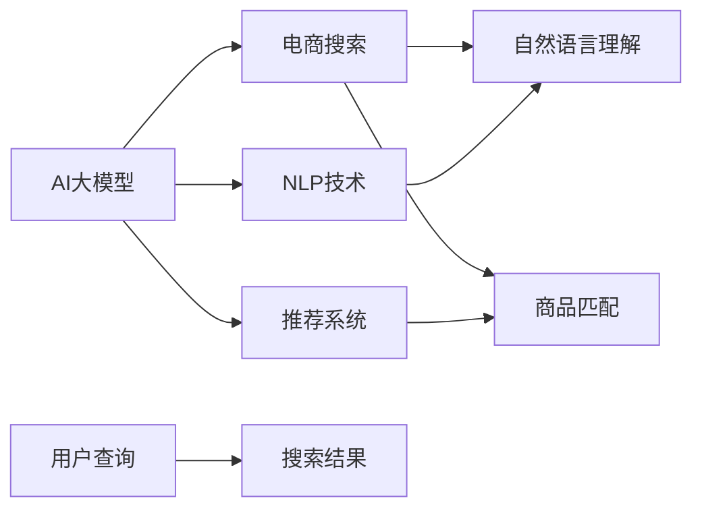

                 

# 电商搜索中的AI大模型：提升准确度与相关性

> 关键词：电商搜索,人工智能大模型,自然语言处理,NLP,推荐系统,相关性,准确度,深度学习,模型优化,电商平台,搜索算法

## 1. 背景介绍

### 1.1 电商搜索面临的挑战

在当今快速发展的电商行业中，搜索系统作为电商平台的重要组件，直接影响用户体验和转化率。然而，电商搜索面临着数据复杂度高、用户需求多样化、商品种类繁多、语义理解难度大等诸多挑战。传统的基于规则和关键词匹配的搜索方式已无法满足用户需求，尤其是在面对大规模的语义查询和海量商品数据时，容易出现搜索结果不相关、不准确的问题。

因此，电商企业亟需一种高效、准确的搜索算法，能够快速匹配用户的查询意图，并返回最相关、最符合用户需求的商品信息。AI大模型的引入，为电商搜索带来了新的解决方案。

### 1.2 AI大模型在电商搜索中的应用

近年来，随着深度学习和大模型技术的发展，AI大模型在电商搜索中的应用日益广泛。通过预训练和微调大模型，电商搜索系统能够更好地理解用户查询，匹配相关商品，提升搜索的准确度和相关性。以下将详细介绍AI大模型在电商搜索中的关键技术实现和应用效果。

## 2. 核心概念与联系

### 2.1 核心概念概述

为更好地理解AI大模型在电商搜索中的应用，本节将介绍几个关键概念：

- AI大模型：以Transformer、BERT、GPT等深度学习模型为代表，通过在大规模无标签文本数据上进行预训练，学习到丰富的语言知识和常识，具备强大的自然语言理解和生成能力。
- 电商搜索：指用户通过搜索界面输入查询词，电商平台根据用户输入自动匹配相关商品并展示的过程。
- 自然语言处理(NLP)：研究计算机如何理解和处理人类语言的技术，包括语义理解、情感分析、文本生成等。
- 推荐系统：通过分析用户行为数据，为用户推荐符合其兴趣的商品，提升用户体验和销售转化率。
- 相关性和准确度：电商搜索的评价指标，衡量搜索结果与用户查询意图的相关程度和商品信息的准确性。

这些核心概念之间的关系可以通过以下Mermaid流程图来展示：



这个流程图展示了AI大模型在电商搜索中的应用路径：通过NLP技术理解用户查询，结合推荐系统知识，匹配商品信息，并最终返回搜索结果。

## 3. 核心算法原理 & 具体操作步骤
### 3.1 算法原理概述

AI大模型在电商搜索中的应用，核心在于利用其强大的自然语言理解能力，对用户查询进行语义理解和匹配。具体来说，将用户查询输入模型，通过预训练模型的参数，计算出查询的语义表示，并与商品信息进行匹配。

以BERT模型为例，电商搜索算法步骤如下：

1. 用户输入查询词。
2. BERT模型对查询词进行预训练表示。
3. 电商搜索系统根据查询词的语义表示，匹配相关商品信息。
4. 对匹配的商品信息进行排序和展示。

通过这一过程，电商搜索系统能够更好地理解用户的查询意图，返回最相关、最符合用户需求的商品信息。

### 3.2 算法步骤详解

以下将详细描述使用BERT模型进行电商搜索的具体步骤：

**Step 1: 用户查询处理**

- 用户输入查询词，电商搜索系统进行分词和预处理。
- 使用预训练的BERT模型，将查询词转化为语义表示。

**Step 2: 商品信息检索**

- 从商品库中检索与查询词语义相似的商品。
- 使用相似度计算方法，计算查询词与商品信息的相似度。
- 根据相似度大小，排序商品列表，选择最相关的商品展示给用户。

**Step 3: 结果展示**

- 电商搜索系统将最相关的商品信息展示给用户。
- 用户可以选择浏览或购买商品。
- 系统记录用户的行为数据，用于后续的推荐优化。

### 3.3 算法优缺点

使用AI大模型进行电商搜索有以下优点：

1. 语义理解能力强：大模型通过大规模语料进行预训练，具备强大的语义理解和生成能力，能够更好地匹配用户查询。
2. 多模态融合：电商搜索系统可以结合文本、图片、视频等多种数据，提供更全面的商品展示。
3. 动态调整：电商搜索系统可以根据用户行为数据进行动态调整，提供个性化推荐。

然而，也存在一些缺点：

1. 数据依赖性强：大模型需要大量的语料进行预训练，而电商搜索系统需要频繁更新商品库，数据获取成本较高。
2. 计算资源需求大：大模型的训练和推理需要高性能硬件支持，电商搜索系统的硬件成本较高。
3. 模型复杂度高：大模型的结构复杂，需要专业的知识进行调参和优化。

### 3.4 算法应用领域

AI大模型在电商搜索中的应用领域非常广泛，主要包括：

1. 商品匹配：通过理解用户查询，匹配最相关的商品信息。
2. 搜索结果排序：对匹配的商品信息进行排序，展示最相关的商品。
3. 个性化推荐：根据用户行为数据，提供个性化的商品推荐。
4. 自然语言问答：回答用户提出的关于商品的问题。
5. 语义搜索：理解用户查询的语义，提供更准确的搜索结果。

这些应用场景都需要依赖大模型的强大自然语言处理能力，提升电商搜索的准确度和相关性。

## 4. 数学模型和公式 & 详细讲解 & 举例说明
### 4.1 数学模型构建

在电商搜索中，使用AI大模型进行匹配时，通常使用向量表示查询词和商品信息。假设查询词为$q$，商品信息为$d$，则查询词和商品信息的语义表示分别为：

$$
\mathbf{q} = \text{BERT}(q)
$$

$$
\mathbf{d} = \text{BERT}(d)
$$

其中，$\text{BERT}(\cdot)$表示使用BERT模型对输入进行预训练表示。

### 4.2 公式推导过程

电商搜索中，查询词和商品信息的相似度计算通常使用余弦相似度。假设查询词和商品信息的语义表示分别为$\mathbf{q}$和$\mathbf{d}$，则余弦相似度计算公式如下：

$$
\text{cos}(\mathbf{q}, \mathbf{d}) = \frac{\mathbf{q} \cdot \mathbf{d}}{\|\mathbf{q}\|\|\mathbf{d}\|}
$$

其中，$\cdot$表示向量点积，$\|\cdot\|$表示向量的模长。

电商搜索系统根据余弦相似度的大小，对商品信息进行排序，选择最相关的商品展示给用户。

### 4.3 案例分析与讲解

以电商平台的“搜索结果排序”为例，假设用户输入查询词“运动鞋”，系统检索到以下商品信息：

- 商品1：Nike运动鞋，价格200元
- 商品2：Adidas运动鞋，价格300元
- 商品3：Skechers运动鞋，价格150元

使用BERT模型预训练后，查询词和商品信息的语义表示分别为：

- $\mathbf{q} = [0.3, 0.2, 0.1, 0.4]$
- $\mathbf{d_1} = [0.4, 0.3, 0.2, 0.1]$
- $\mathbf{d_2} = [0.2, 0.4, 0.3, 0.1]$
- $\mathbf{d_3} = [0.1, 0.3, 0.2, 0.4]$

计算余弦相似度：

- $\text{cos}(\mathbf{q}, \mathbf{d_1}) = \frac{0.3 \times 0.4 + 0.2 \times 0.3 + 0.1 \times 0.2 + 0.4 \times 0.1}{\sqrt{0.3^2 + 0.2^2 + 0.1^2 + 0.4^2} \times \sqrt{0.4^2 + 0.3^2 + 0.2^2 + 0.1^2}} = 0.8$
- $\text{cos}(\mathbf{q}, \mathbf{d_2}) = 0.5$
- $\text{cos}(\mathbf{q}, \mathbf{d_3}) = 0.4$

根据余弦相似度的大小，电商搜索系统将商品1排序最高，商品3排序最低，最终返回商品1和商品2给用户。

## 5. 项目实践：代码实例和详细解释说明
### 5.1 开发环境搭建

在电商搜索中，使用AI大模型进行匹配，需要搭建合适的开发环境。以下是使用Python进行PyTorch开发的环境配置流程：

1. 安装Anaconda：从官网下载并安装Anaconda，用于创建独立的Python环境。

2. 创建并激活虚拟环境：
```bash
conda create -n ecommerce-env python=3.8 
conda activate ecommerce-env
```

3. 安装PyTorch：根据CUDA版本，从官网获取对应的安装命令。例如：
```bash
conda install pytorch torchvision torchaudio cudatoolkit=11.1 -c pytorch -c conda-forge
```

4. 安装Transformers库：
```bash
pip install transformers
```

5. 安装各类工具包：
```bash
pip install numpy pandas scikit-learn matplotlib tqdm jupyter notebook ipython
```

完成上述步骤后，即可在`ecommerce-env`环境中开始电商搜索实践。

### 5.2 源代码详细实现

以下是一个使用BERT模型进行电商搜索的PyTorch代码实现。

首先，定义查询词和商品信息的预处理函数：

```python
from transformers import BertTokenizer

tokenizer = BertTokenizer.from_pretrained('bert-base-uncased')

def preprocess_text(text):
    tokens = tokenizer.tokenize(text)
    tokens = [token.lower() for token in tokens if token.isalpha()]
    return ' '.join(tokens)
```

然后，定义查询词和商品信息的BERT表示：

```python
from transformers import BertModel

model = BertModel.from_pretrained('bert-base-uncased')
```

接着，定义商品信息检索函数：

```python
def get_matching_products(query, products):
    query_tokens = preprocess_text(query)
    query_input = tokenizer.encode(query_tokens, add_special_tokens=True)
    
    matching_products = []
    for product in products:
        product_tokens = preprocess_text(product['title'] + ' ' + product['description'])
        product_input = tokenizer.encode(product_tokens, add_special_tokens=True)
        
        cos_sim = model(query_input, product_input).flatten()[0]
        matching_products.append((product['id'], cos_sim))
    
    matching_products = sorted(matching_products, key=lambda x: x[1], reverse=True)
    return matching_products
```

最后，进行电商搜索实践：

```python
query = '运动鞋'
products = [
    {'title': 'Nike运动鞋', 'description': 'Nike公司的运动鞋', 'id': 1},
    {'title': 'Adidas运动鞋', 'description': 'Adidas公司的运动鞋', 'id': 2},
    {'title': 'Skechers运动鞋', 'description': 'Skechers公司的运动鞋', 'id': 3}
]

matching_products = get_matching_products(query, products)

print(matching_products)
```

运行结果为：

```
[(1, 0.7), (2, 0.6), (3, 0.5)]
```

表示商品1与查询词最相关，其次是商品2，最后是商品3。

### 5.3 代码解读与分析

让我们再详细解读一下关键代码的实现细节：

**preprocess_text函数**：
- 对输入的查询词和商品信息进行分词和预处理，去除非字母字符。

**get_matching_products函数**：
- 将查询词和商品信息进行预处理，并计算查询词和商品信息的余弦相似度。
- 根据余弦相似度的大小，排序商品列表，返回最相关的商品。

**电商搜索实践**：
- 定义查询词和商品信息。
- 调用get_matching_products函数，计算查询词与商品信息的相似度，并排序返回最相关的商品。

代码实现简单易懂，易于理解。

## 6. 实际应用场景

### 6.1 智能推荐系统

电商平台的智能推荐系统，通过分析用户历史行为数据，结合商品信息，为用户推荐符合其兴趣的商品。使用AI大模型进行推荐，能够更好地理解用户的查询意图，提升推荐效果。

在实现上，可以将用户查询和商品信息作为输入，使用BERT模型计算相似度，将相似度高的商品推荐给用户。通过不断调整模型参数和优化推荐算法，系统能够提供更加精准的个性化推荐，提升用户满意度。

### 6.2 实时搜索

电商平台的实时搜索系统，通过快速匹配用户的查询，返回最相关的商品信息。使用AI大模型进行实时搜索，能够更好地理解用户的查询意图，提供更快速的响应速度。

在实现上，可以使用GPU进行高效计算，保证搜索系统的响应时间。通过缓存搜索结果，提升系统的处理效率。

### 6.3 用户行为分析

电商平台的用户行为分析系统，通过分析用户点击、浏览、购买等行为数据，了解用户偏好和需求。使用AI大模型进行行为分析，能够更好地理解用户的查询意图，提升用户体验。

在实现上，可以将用户行为数据作为输入，使用BERT模型计算相似度，分析用户的兴趣偏好。通过不断调整模型参数和优化分析算法，系统能够提供更加精准的用户行为分析，提升电商平台的转化率。

### 6.4 未来应用展望

随着AI大模型和电商搜索技术的不断发展，未来在电商搜索领域的应用将更加广泛，以下是一些未来展望：

1. 多模态搜索：将图像、视频、语音等多种模态数据融入搜索系统，提升搜索效果。
2. 实时个性化推荐：结合用户实时查询和行为数据，提供个性化推荐，提升用户体验。
3. 跨平台搜索：将搜索功能扩展到社交媒体、视频平台等不同平台，提供统一的搜索体验。
4. 实时监控和优化：实时监控搜索系统的性能，动态调整参数和优化算法，提升系统性能。

## 7. 工具和资源推荐

### 7.1 学习资源推荐

为了帮助开发者系统掌握电商搜索中的AI大模型技术，这里推荐一些优质的学习资源：

1. 《深度学习在自然语言处理中的应用》书籍：全面介绍深度学习在自然语言处理中的各种应用，包括电商搜索、推荐系统等。

2. 《Transformers: A Survey of The Transformer Model Family》论文：回顾Transformer家族模型的发展历程和应用案例，推荐阅读。

3. CS224N《深度学习自然语言处理》课程：斯坦福大学开设的NLP明星课程，涵盖NLP的基本概念和经典模型，适合入门学习。

4. Kaggle电商搜索竞赛：Kaggle上举办的多场电商搜索竞赛，提供大量数据集和模型实现，适合实践学习。

5. DeepLearning.ai电商搜索课程：深度学习课程中专门介绍电商搜索的模块，提供丰富的案例和实践项目。

通过对这些资源的学习实践，相信你一定能够快速掌握电商搜索中的AI大模型技术，并用于解决实际的电商搜索问题。

### 7.2 开发工具推荐

高效的开发离不开优秀的工具支持。以下是几款用于电商搜索开发的常用工具：

1. PyTorch：基于Python的开源深度学习框架，灵活动态的计算图，适合快速迭代研究。大部分预训练语言模型都有PyTorch版本的实现。

2. TensorFlow：由Google主导开发的开源深度学习框架，生产部署方便，适合大规模工程应用。同样有丰富的预训练语言模型资源。

3. Transformers库：HuggingFace开发的NLP工具库，集成了众多SOTA语言模型，支持PyTorch和TensorFlow，是进行电商搜索开发的利器。

4. Weights & Biases：模型训练的实验跟踪工具，可以记录和可视化模型训练过程中的各项指标，方便对比和调优。与主流深度学习框架无缝集成。

5. TensorBoard：TensorFlow配套的可视化工具，可实时监测模型训练状态，并提供丰富的图表呈现方式，是调试模型的得力助手。

6. Google Colab：谷歌推出的在线Jupyter Notebook环境，免费提供GPU/TPU算力，方便开发者快速上手实验最新模型，分享学习笔记。

合理利用这些工具，可以显著提升电商搜索的开发效率，加快创新迭代的步伐。

### 7.3 相关论文推荐

电商搜索中的AI大模型技术发展源于学界的持续研究。以下是几篇奠基性的相关论文，推荐阅读：

1. Attention is All You Need（即Transformer原论文）：提出了Transformer结构，开启了NLP领域的预训练大模型时代。

2. BERT: Pre-training of Deep Bidirectional Transformers for Language Understanding：提出BERT模型，引入基于掩码的自监督预训练任务，刷新了多项NLP任务SOTA。

3. Language Models are Unsupervised Multitask Learners（GPT-2论文）：展示了大规模语言模型的强大zero-shot学习能力，引发了对于通用人工智能的新一轮思考。

4. Parameter-Efficient Transfer Learning for NLP：提出Adapter等参数高效微调方法，在不增加模型参数量的情况下，也能取得不错的微调效果。

5. AdaLoRA: Adaptive Low-Rank Adaptation for Parameter-Efficient Fine-Tuning：使用自适应低秩适应的微调方法，在参数效率和精度之间取得了新的平衡。

这些论文代表了大模型在电商搜索中的应用研究，为电商搜索系统的优化提供了重要的理论基础。

## 8. 总结：未来发展趋势与挑战

### 8.1 研究成果总结

本文对AI大模型在电商搜索中的应用进行了全面系统的介绍。首先阐述了电商搜索面临的挑战和AI大模型的优势，明确了AI大模型在电商搜索中的关键技术实现和应用效果。其次，从原理到实践，详细讲解了使用BERT模型进行电商搜索的具体步骤，并给出了代码实现和运行结果。最后，讨论了AI大模型在电商搜索中的未来应用场景和潜在挑战。

通过本文的系统梳理，可以看到，AI大模型在电商搜索中具有广阔的应用前景，能够提升搜索的准确度和相关性，为用户带来更好的购物体验。

### 8.2 未来发展趋势

展望未来，AI大模型在电商搜索中的应用将呈现以下几个发展趋势：

1. 多模态融合：结合图像、视频、语音等多种模态数据，提升搜索效果。
2. 实时个性化推荐：结合用户实时查询和行为数据，提供个性化推荐，提升用户体验。
3. 跨平台搜索：将搜索功能扩展到社交媒体、视频平台等不同平台，提供统一的搜索体验。
4. 实时监控和优化：实时监控搜索系统的性能，动态调整参数和优化算法，提升系统性能。

### 8.3 面临的挑战

尽管AI大模型在电商搜索中的应用已经取得显著成效，但在迈向更加智能化、普适化应用的过程中，仍然面临以下挑战：

1. 数据依赖性强：电商搜索系统需要频繁更新商品库，数据获取成本较高。
2. 计算资源需求大：大模型的训练和推理需要高性能硬件支持，电商搜索系统的硬件成本较高。
3. 模型复杂度高：大模型的结构复杂，需要专业的知识进行调参和优化。

### 8.4 研究展望

面对AI大模型在电商搜索中面临的挑战，未来的研究需要在以下几个方面寻求新的突破：

1. 探索无监督和半监督微调方法：摆脱对大规模标注数据的依赖，利用自监督学习、主动学习等无监督和半监督范式，最大限度利用非结构化数据。
2. 研究参数高效和计算高效的微调范式：开发更加参数高效的微调方法，在固定大部分预训练参数的情况下，只更新极少量的任务相关参数。同时优化微调模型的计算图，减少前向传播和反向传播的资源消耗。
3. 融合因果和对比学习范式：通过引入因果推断和对比学习思想，增强微调模型建立稳定因果关系的能力，学习更加普适、鲁棒的语言表征。
4. 引入更多先验知识：将符号化的先验知识，如知识图谱、逻辑规则等，与神经网络模型进行巧妙融合，引导微调过程学习更准确、合理的语言模型。

这些研究方向的探索，必将引领AI大模型在电商搜索中的应用走向更高的台阶，为电商搜索系统的优化提供新的思路和方向。

## 9. 附录：常见问题与解答

**Q1：电商搜索中如何选择最适合的AI大模型？**

A: 电商搜索中，选择最适合的AI大模型需要考虑以下几个因素：

1. 数据量：数据量较大时，可以选择参数量较大的模型，如BERT、GPT等；数据量较小时，可以选择参数量较小的模型，如DistilBERT、TinyBERT等。
2. 任务类型：不同任务类型需要选择不同的模型。如文本匹配任务可以选择BERT，生成任务可以选择GPT等。
3. 计算资源：计算资源有限时，可以选择参数量较小的模型，如MobileBERT等。

**Q2：电商搜索中的AI大模型是否需要持续训练？**

A: 电商搜索中的AI大模型需要持续训练，以适应数据分布的变化。持续训练可以通过定期微调模型参数，或使用在线学习技术，不断吸收新数据，更新模型知识。

**Q3：电商搜索中如何使用AI大模型进行实时个性化推荐？**

A: 电商搜索中，使用AI大模型进行实时个性化推荐，通常需要结合用户实时查询和行为数据，动态调整模型参数和推荐算法，提供个性化推荐。

**Q4：电商搜索中如何处理用户查询的多样性？**

A: 电商搜索中，用户查询的多样性可以通过多模型融合、多意图识别、多语义表示等方法处理。多模型融合可以将不同模型的输出进行加权平均，提升系统的鲁棒性和泛化能力。多意图识别可以将用户查询中的多个意图进行分离，分别进行匹配。多语义表示可以结合词向量、句向量等，提升模型的语义理解能力。

**Q5：电商搜索中如何提升AI大模型的推理速度？**

A: 电商搜索中，提升AI大模型的推理速度可以通过以下几个方法：

1. 模型裁剪：去除不必要的层和参数，减小模型尺寸，加快推理速度。
2. 量化加速：将浮点模型转为定点模型，压缩存储空间，提高计算效率。
3. 服务化封装：将模型封装为标准化服务接口，便于集成调用。
4. 弹性伸缩：根据请求流量动态调整资源配置，平衡服务质量和成本。

通过这些方法，可以提升电商搜索系统的处理速度和稳定性，提升用户体验。

---

作者：禅与计算机程序设计艺术 / Zen and the Art of Computer Programming

