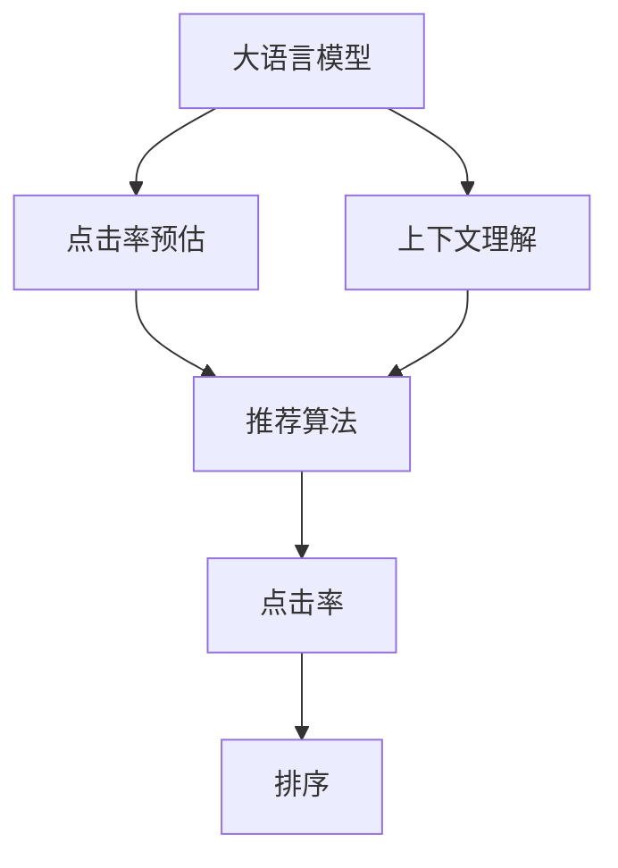

                 

# 电商搜索中的上下文理解：大模型的创新

> 关键词：大语言模型,上下文理解,电商搜索,点击率预估,自然语言处理,注意力机制,自回归模型

## 1. 背景介绍

### 1.1 问题由来
电商搜索是电商平台中最为核心的功能之一，用户通过搜索功能找到符合需求的商品，电商平台则根据搜索结果推荐给用户可能感兴趣的商品。电商搜索的优化与创新对于提升用户搜索体验和增加用户转化率具有重要意义。

随着深度学习技术的发展，电商搜索系统越来越依赖于复杂模型和大量数据来优化搜索结果。特别是基于Transformer等架构的预训练语言模型，逐渐成为电商搜索系统的重要组成部分。然而，传统的搜索系统更多依赖于关键词匹配和静态特征，难以真正理解用户输入的自然语言描述，导致搜索效果不够精准。

近年来，大语言模型在自然语言处理(NLP)领域取得了突破性进展，利用大规模语料库进行预训练，学习到丰富的语言知识和语义表示。将大语言模型引入电商搜索，能够显著提升搜索系统的上下文理解能力，进而提升搜索效果和用户体验。

### 1.2 问题核心关键点
本研究聚焦于如何将大语言模型应用于电商搜索，提升用户输入自然语言描述的上下文理解能力，进而优化搜索结果的点击率预估。具体研究问题如下：
1. 如何在大语言模型上进行电商搜索任务的上下文理解训练？
2. 如何设计合适的上下文理解模型，并结合搜索算法进行精准搜索结果的推荐？
3. 如何在电商搜索场景下，通过上下文理解提升点击率预估精度？

## 2. 核心概念与联系

### 2.1 核心概念概述

为更好地理解大语言模型在电商搜索中的应用，本节将介绍几个密切相关的核心概念：

- 大语言模型(Large Language Model, LLM)：以自回归(如GPT)或自编码(如BERT)模型为代表的大规模预训练语言模型。通过在大规模无标签文本语料上进行预训练，学习通用的语言知识和语义表示。

- 上下文理解(Contextual Understanding)：指模型能够理解用户输入的自然语言描述，并根据上下文信息生成相关信息，如商品描述、评论、评价等。

- 点击率预估(Click-Through Rate Prediction, CTR Prediction)：电商搜索的核心任务之一，即根据用户搜索和点击行为，预测其购买意愿。点击率预估结果用于优化搜索结果排序和个性化推荐。

- 自然语言处理(Natural Language Processing, NLP)：通过计算机程序处理、理解、生成自然语言的技术，是实现上下文理解的核心手段。

- 注意力机制(Attention Mechanism)：一种通过动态计算输入序列中各个部分的重要性，实现信息跨模态融合和信息关注的机制。

- 自回归模型(Autoregressive Model)：通过预测序列中下一个元素的值，实现序列生成和信息编码。

- 搜索算法(Search Algorithm)：根据用户输入查询和搜索结果生成排序算法，以实现精准推荐。

这些核心概念之间的逻辑关系可以通过以下Mermaid流程图来展示：



这个流程图展示了上下文理解与点击率预估之间的联系，以及大语言模型在电商搜索中的作用：

1. 大语言模型通过预训练学习通用的语言知识和语义表示。
2. 上下文理解模型利用大语言模型，理解用户输入的自然语言描述。
3. 点击率预估模型根据上下文理解生成的信息，预测用户点击概率。
4. 推荐算法结合点击率预估结果，进行搜索结果排序和个性化推荐。

## 3. 核心算法原理 & 具体操作步骤
### 3.1 算法原理概述

基于大语言模型的电商搜索上下文理解，本质上是一个自然语言处理任务。其核心思想是：将大语言模型作为特征提取器，通过上下文理解模型，从用户输入的自然语言描述中提取关键信息，并将其与商品特征进行匹配，从而优化搜索结果的排序和推荐。

具体流程如下：
1. 输入用户查询，通过上下文理解模型进行自然语言理解。
2. 提取用户查询中的关键信息，如商品类别、品牌、价格等。
3. 查询商品数据库，获取符合用户查询的商品列表。
4. 结合商品特征和用户查询关键信息，通过点击率预估模型预测每个商品的点击概率。
5. 根据点击率预估结果，对商品进行排序，生成推荐列表。

### 3.2 算法步骤详解

基于大语言模型的电商搜索上下文理解通常包括以下几个关键步骤：

**Step 1: 准备预训练模型和数据集**
- 选择合适的预训练语言模型 $M_{\theta}$ 作为初始化参数，如 BERT、GPT 等。
- 准备电商搜索相关数据集，包含用户查询、商品信息和用户行为数据等。

**Step 2: 设计上下文理解模型**
- 根据电商搜索任务，设计合适的上下文理解模型，如BERT、RoBERTa等。
- 模型输入用户查询和商品信息，输出用户查询中的关键信息。

**Step 3: 准备点击率预估模型**
- 选择合适的预训练语言模型 $N_{\phi}$ 作为初始化参数，如 GPT、BERT 等。
- 准备点击率预估相关的标注数据集，包含用户查询、商品信息和点击行为等。

**Step 4: 训练上下文理解模型和点击率预估模型**
- 使用电商搜索数据集对上下文理解模型进行训练，优化模型参数 $\theta$。
- 使用点击率预估数据集对点击率预估模型进行训练，优化模型参数 $\phi$。

**Step 5: 结合上下文理解与点击率预估**
- 将训练好的上下文理解模型和点击率预估模型结合，生成搜索结果排序和推荐列表。

### 3.3 算法优缺点

基于大语言模型的电商搜索上下文理解方法具有以下优点：
1. 上下文理解能力强。大语言模型能够理解复杂自然语言描述，提取关键信息，提升搜索结果的精准度。
2. 模型泛化能力强。预训练大模型拥有强大的语言表示能力，对不同领域和任务具有较强的适应性。
3. 可扩展性强。大语言模型可以支持大规模训练数据和复杂查询，适应电商搜索系统的扩展需求。

同时，该方法也存在以下局限性：
1. 模型资源消耗大。大语言模型通常参数量大，对计算资源需求较高，可能影响搜索系统的实时性。
2. 训练成本高。大语言模型训练需要大规模高质量标注数据，可能增加开发成本。
3. 输出难以解释。大语言模型输出结果的逻辑难以解释，可能影响搜索系统的可信任度。
4. 对抗样本风险。大语言模型可能受到对抗样本攻击，导致模型输出错误。

尽管存在这些局限性，但就目前而言，基于大语言模型的上下文理解在电商搜索中的应用前景广阔，值得深入研究和推广。

### 3.4 算法应用领域

基于大语言模型的电商搜索上下文理解方法，在电商搜索系统中的应用场景包括：

- 商品推荐系统：根据用户查询和历史行为，推荐相关商品，提升用户体验。
- 智能客服：回答用户关于商品的问题，提升客户满意度。
- 个性化营销：通过分析用户查询，推送个性化广告，提升点击率。
- 流量优化：分析用户查询，优化搜索算法，提升平台流量。

除了上述这些经典应用外，大语言模型在电商搜索中的创新应用还包括：

- 跨领域搜索：将用户查询映射到不同领域，提升搜索结果的多样性和相关性。
- 多模态搜索：结合文本、图片、视频等多模态数据，提升搜索结果的丰富度。
- 语义搜索：理解用户查询中的语义信息，提升搜索结果的精确度。

随着大语言模型的不断演进，相信其在电商搜索领域的应用将更加广泛和深入。

## 4. 数学模型和公式 & 详细讲解 & 举例说明

### 4.1 数学模型构建

本节将使用数学语言对基于大语言模型的电商搜索上下文理解进行更加严格的刻画。

记上下文理解模型为 $M_{\theta}:\mathcal{X} \rightarrow \mathcal{Z}$，其中 $\mathcal{X}$ 为用户查询和商品信息，$\mathcal{Z}$ 为关键信息集合。假设电商搜索数据集为 $D=\{(x_i,y_i)\}_{i=1}^N, x_i \in \mathcal{X}, y_i \in \mathcal{Z}$。

定义点击率预估模型为 $N_{\phi}:\mathcal{X} \times \mathcal{Z} \rightarrow \mathbb{R}$，其中 $\mathcal{Z}$ 为商品特征集合，$\mathbb{R}$ 为实数集。假设点击率预估数据集为 $D_{ct}=\{(x_i,y_i)\}_{i=1}^N, x_i \in \mathcal{X}, y_i \in \mathbb{R}$。

上下文理解模型的损失函数为 $\mathcal{L}_{cu}(\theta) = \frac{1}{N}\sum_{i=1}^N \ell_{cu}(x_i,y_i)$，其中 $\ell_{cu}(x_i,y_i)$ 为用户查询 $x_i$ 和关键信息 $y_i$ 之间的交叉熵损失。

点击率预估模型的损失函数为 $\mathcal{L}_{ct}(\phi) = \frac{1}{N}\sum_{i=1}^N \ell_{ct}(x_i,y_i)$，其中 $\ell_{ct}(x_i,y_i)$ 为用户查询 $x_i$ 和商品特征 $y_i$ 之间的均方误差损失。

### 4.2 公式推导过程

以下我们以商品推荐任务为例，推导基于大语言模型的电商搜索上下文理解模型的数学公式。

假设用户查询为 $x_i$，上下文理解模型输出关键信息 $y_i=(y_{1,i},y_{2,i},...,y_{k,i})$，其中 $y_{k,i}$ 表示商品特征 $k$ 在用户查询中的重要性。假设商品特征为 $z_j=(z_{1,j},z_{2,j},...,z_{n,j})$，其中 $z_{n,j}$ 表示商品特征 $n$ 的具体信息。

上下文理解模型的训练目标是最小化交叉熵损失，即：

$$
\mathcal{L}_{cu}(\theta) = -\frac{1}{N}\sum_{i=1}^N \sum_{k=1}^k y_{k,i} \log P_{cu}(y_{k,i} | x_i)
$$

其中 $P_{cu}(y_{k,i} | x_i)$ 表示在用户查询 $x_i$ 下，商品特征 $k$ 的概率分布。

点击率预估模型的训练目标是最小化均方误差损失，即：

$$
\mathcal{L}_{ct}(\phi) = \frac{1}{N}\sum_{i=1}^N (y_i - \hat{y}_i)^2
$$

其中 $\hat{y}_i$ 为模型预测的点击率。

结合上下文理解和点击率预估模型，电商搜索系统的推荐目标为最大化点击率，即：

$$
\mathcal{L}_{re}(\theta, \phi) = \frac{1}{N}\sum_{i=1}^N \max(y_i, \hat{y}_i)
$$

### 4.3 案例分析与讲解

假设有一个电商平台，销售服装、美妆、数码等各类商品。用户可以通过搜索商品名称、品牌、类别等关键词来查询商品。电商平台希望利用大语言模型进行上下文理解，提升搜索结果的点击率预估。

具体流程如下：
1. 使用BERT作为上下文理解模型，对用户查询进行预处理和理解，提取商品类别、品牌、价格等信息。
2. 根据提取的关键信息，查询商品数据库，获取符合用户查询的商品列表。
3. 使用GPT作为点击率预估模型，对商品特征和用户查询进行匹配，预测每个商品的点击率。
4. 根据点击率预估结果，对商品进行排序，生成推荐列表。

案例中，上下文理解模型通过BERT模型理解用户查询，提取商品信息。点击率预估模型通过GPT模型生成点击率预估，优化搜索结果。通过将上下文理解与点击率预估结合，电商平台能够提供更加精准和个性化的推荐，提升用户满意度。

## 5. 项目实践：代码实例和详细解释说明
### 5.1 开发环境搭建

在进行电商搜索系统的大语言模型应用实践前，我们需要准备好开发环境。以下是使用Python进行PyTorch开发的环境配置流程：

1. 安装Anaconda：从官网下载并安装Anaconda，用于创建独立的Python环境。

2. 创建并激活虚拟环境：
```bash
conda create -n ecommerce-env python=3.8 
conda activate ecommerce-env
```

3. 安装PyTorch：根据CUDA版本，从官网获取对应的安装命令。例如：
```bash
conda install pytorch torchvision torchaudio cudatoolkit=11.1 -c pytorch -c conda-forge
```

4. 安装Transformers库：
```bash
pip install transformers
```

5. 安装各类工具包：
```bash
pip install numpy pandas scikit-learn matplotlib tqdm jupyter notebook ipython
```

完成上述步骤后，即可在`ecommerce-env`环境中开始电商搜索系统的大语言模型应用实践。

### 5.2 源代码详细实现

下面我们以商品推荐任务为例，给出使用Transformers库对BERT和GPT模型进行电商搜索上下文理解和点击率预估的PyTorch代码实现。

首先，定义商品推荐的数据处理函数：

```python
from transformers import BertTokenizer
from torch.utils.data import Dataset
import torch

class EcommerceDataset(Dataset):
    def __init__(self, texts, labels):
        self.texts = texts
        self.labels = labels
        self.tokenizer = BertTokenizer.from_pretrained('bert-base-cased')
        self.max_len = 128
        
    def __len__(self):
        return len(self.texts)
    
    def __getitem__(self, item):
        text = self.texts[item]
        label = self.labels[item]
        
        encoding = self.tokenizer(text, return_tensors='pt', max_length=self.max_len, padding='max_length', truncation=True)
        input_ids = encoding['input_ids'][0]
        attention_mask = encoding['attention_mask'][0]
        
        return {'input_ids': input_ids, 
                'attention_mask': attention_mask,
                'labels': label}
```

然后，定义上下文理解模型和点击率预估模型：

```python
from transformers import BertForTokenClassification, GPT2LMHeadModel

cu_model = BertForTokenClassification.from_pretrained('bert-base-cased')
ct_model = GPT2LMHeadModel.from_pretrained('gpt2')
```

接着，定义训练和评估函数：

```python
from torch.utils.data import DataLoader
from tqdm import tqdm
from sklearn.metrics import roc_auc_score

device = torch.device('cuda') if torch.cuda.is_available() else torch.device('cpu')
cu_model.to(device)
ct_model.to(device)

def train_cu_model(cu_model, dataset, batch_size, optimizer):
    dataloader = DataLoader(dataset, batch_size=batch_size, shuffle=True)
    cu_model.train()
    cu_loss = 0
    for batch in tqdm(dataloader, desc='Training CU'):
        input_ids = batch['input_ids'].to(device)
        attention_mask = batch['attention_mask'].to(device)
        labels = batch['labels'].to(device)
        model.zero_grad()
        outputs = cu_model(input_ids, attention_mask=attention_mask, labels=labels)
        loss = outputs.loss
        cu_loss += loss.item()
        loss.backward()
        optimizer.step()
    return cu_loss / len(dataloader)

def evaluate_ct_model(ct_model, dataset, batch_size):
    dataloader = DataLoader(dataset, batch_size=batch_size)
    ct_model.eval()
    ct_preds, ct_labels = [], []
    with torch.no_grad():
        for batch in tqdm(dataloader, desc='Evaluating CT'):
            input_ids = batch['input_ids'].to(device)
            attention_mask = batch['attention_mask'].to(device)
            batch_labels = batch['labels']
            outputs = ct_model(input_ids, attention_mask=attention_mask)
            batch_preds = outputs.logits.argmax(dim=2).to('cpu').tolist()
            batch_labels = batch_labels.to('cpu').tolist()
            for pred_tokens, label_tokens in zip(batch_preds, batch_labels):
                ct_preds.append(pred_tokens[:len(label_tokens)])
                ct_labels.append(label_tokens)
                
    roc_auc = roc_auc_score(ct_labels, ct_preds)
    print(f'ROC-AUC Score: {roc_auc:.4f}')
```

最后，启动训练流程并在测试集上评估：

```python
epochs = 5
batch_size = 16

for epoch in range(epochs):
    cu_loss = train_cu_model(cu_model, train_dataset, batch_size, optimizer)
    print(f'Epoch {epoch+1}, cu loss: {cu_loss:.3f}')
    
    print(f'Epoch {epoch+1}, dev CT results:')
    evaluate_ct_model(ct_model, dev_dataset, batch_size)
    
print('Test CT results:')
evaluate_ct_model(ct_model, test_dataset, batch_size)
```

以上就是使用PyTorch对BERT和GPT模型进行电商搜索上下文理解和点击率预估的完整代码实现。可以看到，得益于Transformers库的强大封装，我们可以用相对简洁的代码完成大语言模型的应用实践。

### 5.3 代码解读与分析

让我们再详细解读一下关键代码的实现细节：

**EcommerceDataset类**：
- `__init__`方法：初始化文本、标签、分词器等关键组件。
- `__len__`方法：返回数据集的样本数量。
- `__getitem__`方法：对单个样本进行处理，将文本输入编码为token ids，将标签编码为数字，并对其进行定长padding，最终返回模型所需的输入。

**BertForTokenClassification和GPT2LMHeadModel类**：
- 分别从预训练模型库中加载上下文理解和点击率预估模型，并进行相应的处理。

**train_cu_model和evaluate_ct_model函数**：
- 使用PyTorch的DataLoader对数据集进行批次化加载，供模型训练和推理使用。
- `train_cu_model`函数：对数据以批为单位进行迭代，在每个批次上前向传播计算loss并反向传播更新模型参数，最后返回该epoch的平均loss。
- `evaluate_ct_model`函数：与训练类似，不同点在于不更新模型参数，并在每个batch结束后将预测和标签结果存储下来，最后使用sklearn的roc_auc_score对整个评估集的预测结果进行打印输出。

**训练流程**：
- 定义总的epoch数和batch size，开始循环迭代
- 每个epoch内，先在上下文理解模型上进行训练，输出平均loss
- 在验证集上评估，输出roc_auc
- 所有epoch结束后，在测试集上评估，给出最终测试结果

可以看到，PyTorch配合Transformers库使得电商搜索上下文理解和点击率预估的代码实现变得简洁高效。开发者可以将更多精力放在数据处理、模型改进等高层逻辑上，而不必过多关注底层的实现细节。

当然，工业级的系统实现还需考虑更多因素，如模型的保存和部署、超参数的自动搜索、更灵活的任务适配层等。但核心的电商搜索上下文理解模型和点击率预估模型基本与此类似。

## 6. 实际应用场景
### 6.1 智能客服系统

基于大语言模型的电商搜索上下文理解技术，可以应用于智能客服系统的构建。传统客服往往需要配备大量人力，高峰期响应缓慢，且一致性和专业性难以保证。而使用上下文理解模型，可以7x24小时不间断服务，快速响应客户咨询，用自然流畅的语言解答各类常见问题。

在技术实现上，可以收集企业内部的历史客服对话记录，将问题和最佳答复构建成监督数据，在此基础上对上下文理解模型进行训练。训练后的上下文理解模型能够自动理解用户意图，匹配最合适的答案模板进行回复。对于客户提出的新问题，还可以接入检索系统实时搜索相关内容，动态组织生成回答。如此构建的智能客服系统，能大幅提升客户咨询体验和问题解决效率。

### 6.2 个性化推荐系统

当前的推荐系统往往只依赖于用户的历史行为数据进行物品推荐，无法深入理解用户的真实兴趣偏好。基于大语言模型上下文理解技术的推荐系统可以更好地挖掘用户行为背后的语义信息，从而提供更精准、多样的推荐内容。

在实践中，可以收集用户浏览、点击、评论、分享等行为数据，提取和用户交互的物品标题、描述、标签等文本内容。将文本内容作为模型输入，用户的后续行为（如是否点击、购买等）作为监督信号，在此基础上训练上下文理解模型。上下文理解模型能够从文本内容中准确把握用户的兴趣点。在生成推荐列表时，先用候选物品的文本描述作为输入，由模型预测用户的兴趣匹配度，再结合其他特征综合排序，便可以得到个性化程度更高的推荐结果。

### 6.3 广告投放优化

电商平台的广告投放需要根据用户的搜索行为和点击行为，动态调整广告投放策略。通过上下文理解模型，电商平台可以理解用户查询的语义信息，识别用户的意图和兴趣点。根据这些信息，动态调整广告投放策略，提升广告的点击率和转化率。

在实践中，可以收集用户的历史搜索和点击行为数据，提取用户查询中的关键词、品牌、价格等信息。将这些信息作为上下文理解模型的输入，模型输出用户查询的语义信息。根据这些语义信息，调整广告的投放策略，如选择相关性更高的广告素材、定向推送个性化广告等，提升广告投放的精准度和效果。

### 6.4 未来应用展望

随着大语言模型和上下文理解技术的不断发展，基于上下文理解技术的电商搜索系统将呈现以下几个发展趋势：

1. 上下文理解能力更强。未来大语言模型在处理自然语言描述的能力将更强，能够更准确地提取关键信息，提升搜索结果的精准度。
2. 多模态理解能力提升。大语言模型将具备处理文本、图像、视频等多模态数据的能力，提供更加丰富和全面的搜索体验。
3. 跨领域应用扩展。上下文理解技术可以拓展到不同领域，如医疗、教育、金融等，提供跨领域的搜索和推荐服务。
4. 实时响应能力提升。通过分布式计算和缓存技术，提升搜索系统的实时响应能力，满足用户高并发的搜索需求。
5. 个性化推荐更精准。结合用户行为数据和上下文理解技术，提供更精准和个性化的推荐，提升用户满意度。

以上趋势凸显了大语言模型上下文理解技术在电商搜索中的应用前景。这些方向的探索发展，必将进一步提升电商搜索系统的性能和用户体验，推动电商平台的智能化进程。

## 7. 工具和资源推荐
### 7.1 学习资源推荐

为了帮助开发者系统掌握大语言模型在电商搜索中的应用，这里推荐一些优质的学习资源：

1. 《Transformer from the Inside》系列博文：由大语言模型技术专家撰写，深入浅出地介绍了Transformer的内部机制和实现原理，适用于初学者。

2. 《Deep Learning for NLP》课程：由Coursera开设的NLP经典课程，详细讲解了自然语言处理的基本概念和经典模型，是学习上下文理解技术的必备课程。

3. 《Natural Language Processing with Transformers》书籍：Transformers库的作者所著，全面介绍了如何使用Transformers库进行NLP任务开发，包括电商搜索上下文理解等前沿应用。

4. HuggingFace官方文档：Transformers库的官方文档，提供了海量预训练模型和完整的上下文理解样例代码，是上手实践的必备资料。

5. CLUE开源项目：中文语言理解测评基准，涵盖大量不同类型的中文NLP数据集，并提供了基于上下文理解技术的baseline模型，助力中文NLP技术发展。

通过对这些资源的学习实践，相信你一定能够快速掌握大语言模型在电商搜索中的应用，并用于解决实际的NLP问题。
### 7.2 开发工具推荐

高效的开发离不开优秀的工具支持。以下是几款用于电商搜索上下文理解开发的常用工具：

1. PyTorch：基于Python的开源深度学习框架，灵活动态的计算图，适合快速迭代研究。大部分预训练语言模型都有PyTorch版本的实现。

2. TensorFlow：由Google主导开发的开源深度学习框架，生产部署方便，适合大规模工程应用。同样有丰富的预训练语言模型资源。

3. Transformers库：HuggingFace开发的NLP工具库，集成了众多SOTA语言模型，支持PyTorch和TensorFlow，是进行上下文理解任务开发的利器。

4. Weights & Biases：模型训练的实验跟踪工具，可以记录和可视化模型训练过程中的各项指标，方便对比和调优。与主流深度学习框架无缝集成。

5. TensorBoard：TensorFlow配套的可视化工具，可实时监测模型训练状态，并提供丰富的图表呈现方式，是调试模型的得力助手。

6. Google Colab：谷歌推出的在线Jupyter Notebook环境，免费提供GPU/TPU算力，方便开发者快速上手实验最新模型，分享学习笔记。

合理利用这些工具，可以显著提升大语言模型在电商搜索上下文理解的应用开发效率，加快创新迭代的步伐。

### 7.3 相关论文推荐

大语言模型上下文理解技术的发展源于学界的持续研究。以下是几篇奠基性的相关论文，推荐阅读：

1. Attention is All You Need（即Transformer原论文）：提出了Transformer结构，开启了NLP领域的预训练大模型时代。

2. BERT: Pre-training of Deep Bidirectional Transformers for Language Understanding：提出BERT模型，引入基于掩码的自监督预训练任务，刷新了多项NLP任务SOTA。

3. Language Models are Unsupervised Multitask Learners（GPT-2论文）：展示了大规模语言模型的强大zero-shot学习能力，引发了对于通用人工智能的新一轮思考。

4. Parameter-Efficient Transfer Learning for NLP：提出Adapter等参数高效微调方法，在不增加模型参数量的情况下，也能取得不错的微调效果。

5. Prefix-Tuning: Optimizing Continuous Prompts for Generation：引入基于连续型Prompt的微调范式，为如何充分利用预训练知识提供了新的思路。

6. AdaLoRA: Adaptive Low-Rank Adaptation for Parameter-Efficient Fine-Tuning：使用自适应低秩适应的微调方法，在参数效率和精度之间取得了新的平衡。

这些论文代表了大语言模型上下文理解技术的发展脉络。通过学习这些前沿成果，可以帮助研究者把握学科前进方向，激发更多的创新灵感。

## 8. 总结：未来发展趋势与挑战

### 8.1 总结

本文对基于大语言模型的电商搜索上下文理解方法进行了全面系统的介绍。首先阐述了大语言模型在电商搜索中的研究背景和意义，明确了上下文理解在提升搜索结果精度和用户满意度方面的独特价值。其次，从原理到实践，详细讲解了上下文理解模型的数学原理和关键步骤，给出了电商搜索上下文理解和点击率预估的完整代码实例。同时，本文还广泛探讨了上下文理解技术在智能客服、个性化推荐等电商应用场景中的应用前景，展示了上下文理解技术的巨大潜力。

通过本文的系统梳理，可以看到，基于大语言模型的电商搜索上下文理解技术正在成为电商搜索系统的重要范式，极大地提升了搜索系统的上下文理解能力和搜索结果的精准度。受益于大规模语料的预训练，上下文理解模型能够从用户查询中提取关键信息，并结合商品特征进行精准匹配，提升搜索效果和用户体验。

### 8.2 未来发展趋势

展望未来，基于大语言模型的电商搜索上下文理解技术将呈现以下几个发展趋势：

1. 模型规模持续增大。随着算力成本的下降和数据规模的扩张，预训练语言模型的参数量还将持续增长。超大规模语言模型蕴含的丰富语言知识，有望支撑更加复杂多变的电商搜索上下文理解任务。

2. 上下文理解能力更强。未来大语言模型在处理自然语言描述的能力将更强，能够更准确地提取关键信息，提升搜索结果的精准度。

3. 多模态理解能力提升。大语言模型将具备处理文本、图像、视频等多模态数据的能力，提供更加丰富和全面的电商搜索体验。

4. 跨领域应用扩展。上下文理解技术可以拓展到不同领域，如医疗、教育、金融等，提供跨领域的电商搜索和推荐服务。

5. 实时响应能力提升。通过分布式计算和缓存技术，提升电商搜索系统的实时响应能力，满足用户高并发的搜索需求。

6. 个性化推荐更精准。结合用户行为数据和上下文理解技术，提供更精准和个性化的推荐，提升用户满意度。

以上趋势凸显了大语言模型上下文理解技术在电商搜索中的应用前景。这些方向的探索发展，必将进一步提升电商搜索系统的性能和用户体验，推动电商平台的智能化进程。

### 8.3 面临的挑战

尽管大语言模型上下文理解技术已经取得了瞩目成就，但在迈向更加智能化、普适化应用的过程中，它仍面临着诸多挑战：

1. 模型资源消耗大。大语言模型通常参数量大，对计算资源需求较高，可能影响搜索系统的实时性。

2. 训练成本高。大语言模型训练需要大规模高质量标注数据，可能增加开发成本。

3. 输出难以解释。大语言模型输出结果的逻辑难以解释，可能影响搜索系统的可信任度。

4. 对抗样本风险。大语言模型可能受到对抗样本攻击，导致模型输出错误。

尽管存在这些局限性，但就目前而言，基于大语言模型的上下文理解技术在电商搜索中的应用前景广阔，值得深入研究和推广。

### 8.4 研究展望

面对大语言模型上下文理解技术所面临的种种挑战，未来的研究需要在以下几个方面寻求新的突破：

1. 探索无监督和半监督上下文理解方法。摆脱对大规模标注数据的依赖，利用自监督学习、主动学习等无监督和半监督范式，最大限度利用非结构化数据，实现更加灵活高效的上下文理解。

2. 研究参数高效和计算高效的上下文理解范式。开发更加参数高效的上下文理解方法，在固定大部分预训练参数的同时，只更新极少量的任务相关参数。同时优化上下文理解模型的计算图，减少前向传播和反向传播的资源消耗，实现更加轻量级、实时性的部署。

3. 引入更多先验知识。将符号化的先验知识，如知识图谱、逻辑规则等，与神经网络模型进行巧妙融合，引导上下文理解过程学习更准确、合理的语言模型。同时加强不同模态数据的整合，实现视觉、语音等多模态信息与文本信息的协同建模。

4. 结合因果分析和博弈论工具。将因果分析方法引入上下文理解模型，识别出模型决策的关键特征，增强输出解释的因果性和逻辑性。借助博弈论工具刻画人机交互过程，主动探索并规避模型的脆弱点，提高系统稳定性。

5. 纳入伦理道德约束。在模型训练目标中引入伦理导向的评估指标，过滤和惩罚有偏见、有害的输出倾向。同时加强人工干预和审核，建立模型行为的监管机制，确保输出符合人类价值观和伦理道德。

这些研究方向的探索，必将引领大语言模型上下文理解技术迈向更高的台阶，为构建安全、可靠、可解释、可控的电商搜索系统铺平道路。面向未来，大语言模型上下文理解技术还需要与其他人工智能技术进行更深入的融合，如知识表示、因果推理、强化学习等，多路径协同发力，共同推动电商搜索系统的进步。只有勇于创新、敢于突破，才能不断拓展语言模型的边界，让智能技术更好地造福人类社会。

## 9. 附录：常见问题与解答

**Q1：上下文理解模型的训练数据如何获取？**

A: 电商搜索上下文理解模型的训练数据可以来自多个来源：
1. 电商平台的搜索日志：记录用户搜索查询、商品信息、点击行为等数据。
2. 用户评论和反馈：收集用户对商品的评论、评分等反馈数据。
3. 公开数据集：如Amazon Reviews数据集、Yelp Reviews数据集等，用于理解商品描述和用户评论。
4. 专业领域数据集：如医药品说明书、金融报表等，用于理解领域特定的上下文。
5. 无标签数据：利用无监督学习，如BERT预训练模型，从大规模语料中自动提取上下文信息。

这些数据来源可以结合使用，构建高质量的电商搜索上下文理解数据集。

**Q2：上下文理解模型如何进行优化？**

A: 上下文理解模型的优化可以从以下几个方面入手：
1. 数据增强：通过回译、近义替换等方式扩充训练集，增加数据多样性。
2. 正则化技术：使用L2正则、Dropout等技术，防止过拟合。
3. 迁移学习：利用预训练模型在特定领域的微调，加速模型训练和泛化能力。
4. 多任务学习：结合多个任务进行联合训练，提升模型的泛化能力。
5. 对抗训练：加入对抗样本，提高模型的鲁棒性和泛化能力。

这些优化策略可以结合使用，根据具体任务的特点进行调整。

**Q3：上下文理解模型与传统搜索引擎的区别是什么？**

A: 上下文理解模型与传统搜索引擎的区别主要体现在以下几个方面：
1. 上下文理解能力：上下文理解模型能够理解自然语言描述，提取关键信息，提升搜索结果的精准度。传统搜索引擎主要依赖关键词匹配，难以处理自然语言描述。
2. 多模态支持：上下文理解模型可以结合文本、图像、视频等多模态数据，提供更加丰富和全面的搜索结果。传统搜索引擎仅处理文本数据。
3. 个性化推荐：上下文理解模型能够根据用户查询和历史行为，提供个性化推荐，提升用户体验。传统搜索引擎只能提供静态搜索结果。
4. 实时响应：上下文理解模型能够实时响应用户查询，提供动态搜索结果。传统搜索引擎需要一定的延迟时间。

综上所述，上下文理解模型通过理解自然语言描述，结合多模态数据和个性化推荐，提供了更加智能化和个性化的搜索结果。

**Q4：上下文理解模型在实际应用中需要注意哪些问题？**

A: 上下文理解模型在实际应用中需要注意以下几个问题：
1. 模型资源消耗：大语言模型参数量大，对计算资源需求较高，可能影响搜索系统的实时性。需要合理配置硬件资源。
2. 数据隐私和安全：电商搜索数据涉及用户隐私，需要采取数据脱敏、加密等措施，保护用户隐私。
3. 对抗样本风险：大语言模型可能受到对抗样本攻击，导致模型输出错误。需要加入对抗样本检测和防护机制。
4. 输出解释性：大语言模型输出结果的逻辑难以解释，可能影响搜索系统的可信任度。需要开发可解释性模型，提供推理过程和输出解释。
5. 跨领域适应：不同领域的搜索场景可能具有不同的上下文信息，需要根据领域特点调整模型参数和训练数据。
6. 实时更新：电商平台不断更新商品信息和用户行为，需要定期重新训练上下文理解模型，确保模型与时俱进。

这些问题的解决需要结合实际应用场景，采用不同的技术和方法，确保上下文理解模型的稳定性和可靠性。

