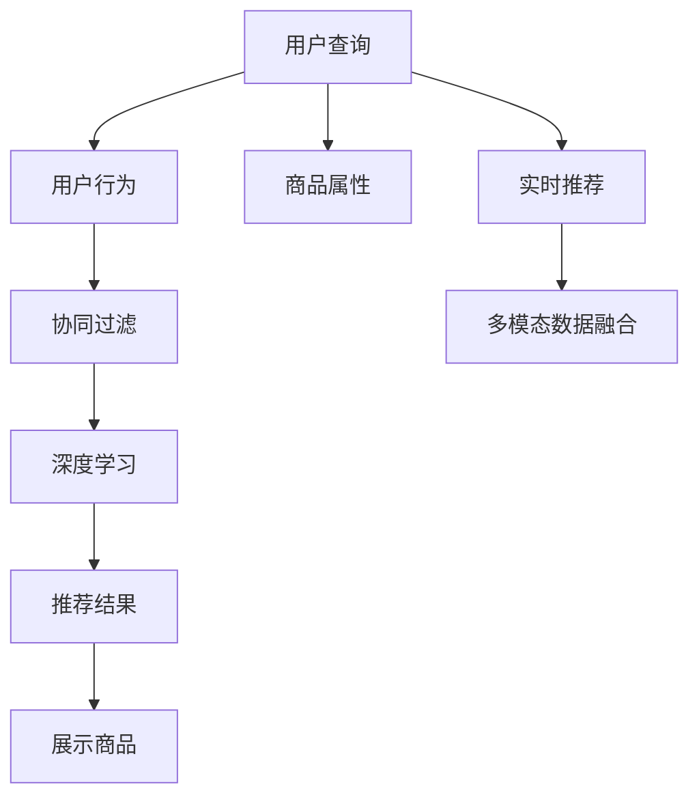

                 

# 电商搜索中的个性化排序模型优化

在现代电商平台上，个性化搜索排序算法不仅影响用户体验，更关乎用户的购买决策和平台的转化率。本文旨在探索如何通过优化算法，提升电商搜索的个性化推荐效果，满足用户多样化的购物需求。

## 1. 背景介绍

### 1.1 问题由来

电商平台的搜索功能是用户获取商品信息、进行购买的入口，搜索体验直接影响用户满意度。传统的搜索排序算法往往基于用户的查询历史、浏览记录等行为数据进行推荐，忽略了用户即时输入的查询意图的独特性和实时性。这样的推荐方式往往导致搜索结果的泛泛化，无法满足用户个性化的需求。

### 1.2 问题核心关键点

个性化搜索排序算法需要解决的核心问题包括：
1. **实时性**：用户输入查询时，快速响应用户需求，提供最相关的商品。
2. **多样性**：搜索结果多样化，涵盖不同类型、不同价格的商品，避免单一商品垄断搜索结果。
3. **公平性**：每个商品在搜索结果中的展示机会均等，避免某些商品长期被边缘化。
4. **时效性**：商品信息更新及时，确保用户看到的商品信息是最新的。
5. **可解释性**：用户可以了解推荐结果的依据，提升信任感。

## 2. 核心概念与联系

### 2.1 核心概念概述

为更好地理解个性化搜索排序算法的优化方法，本节将介绍几个密切相关的核心概念：

- **个性化搜索排序**：通过分析用户查询历史、行为数据，利用机器学习算法实时推荐商品列表，提升用户体验和转化率。
- **推荐系统**：通过分析用户行为和商品属性，预测用户可能感兴趣的商品，并提供个性化推荐。
- **协同过滤**：利用用户和商品之间的相似性，推荐用户未交互过的商品。
- **深度学习**：使用神经网络模型，通过大量数据训练学习商品和用户的隐式关系，进行推荐。
- **实时推荐**：在用户输入查询后，快速响应用户需求，生成推荐结果。
- **多模态数据融合**：融合文本、图片、价格等多模态数据，提升推荐效果。

这些核心概念之间的逻辑关系可以通过以下Mermaid流程图来展示：



这个流程图展示了个性化搜索排序的关键概念及其之间的关系：

1. 用户输入查询，系统分析用户行为数据。
2. 通过协同过滤、深度学习等算法，预测用户可能感兴趣的商品。
3. 实时推荐系统快速响应用户需求，生成推荐结果。
4. 多模态数据融合提升推荐效果。
5. 推荐结果展示给用户，完成搜索闭环。

## 3. 核心算法原理 & 具体操作步骤
### 3.1 算法原理概述

个性化搜索排序的核心算法是推荐系统中的协同过滤（Collaborative Filtering, CF）和深度学习模型（Deep Learning Model），二者的结合能够有效提升推荐结果的准确性和多样性。

**协同过滤**：基于用户-商品矩阵，通过计算用户和商品之间的相似性，推荐未交互过的商品。算法包括基于用户的协同过滤（User-Based CF）和基于商品的协同过滤（Item-Based CF）。

**深度学习模型**：使用神经网络模型，通过大量数据训练学习商品和用户的隐式关系，进行推荐。常见的深度学习模型包括基于注意力机制的推荐模型、基于神经网络的推荐模型等。

在具体应用中，通常先使用协同过滤模型进行预筛选，再使用深度学习模型对预筛选结果进行进一步优化，最终生成推荐结果。

### 3.2 算法步骤详解

个性化搜索排序的优化步骤主要包括以下几个关键步骤：

**Step 1: 数据准备与预处理**

- 收集用户查询历史、浏览记录、购买记录等数据，构建用户-商品矩阵。
- 对数据进行清洗、归一化、特征工程等预处理，生成适合输入模型的特征向量。

**Step 2: 协同过滤模型训练**

- 选择合适的协同过滤算法（User-Based CF或Item-Based CF），训练模型。
- 评估模型在验证集上的表现，优化模型参数。

**Step 3: 深度学习模型训练**

- 选择适合的深度学习模型，构建模型架构。
- 使用预筛选的协同过滤结果作为输入，训练深度学习模型。
- 评估模型在验证集上的表现，优化模型参数。

**Step 4: 实时推荐**

- 接收用户输入查询，使用协同过滤和深度学习模型生成推荐结果。
- 融合多模态数据（如商品图片、价格、用户评价等），提升推荐效果。
- 对推荐结果进行排序，选择最相关的商品展示给用户。

**Step 5: 反馈收集与模型优化**

- 收集用户对推荐结果的反馈，包括点击率、购买率等指标。
- 使用反馈数据优化模型参数，提升推荐效果。

### 3.3 算法优缺点

个性化搜索排序算法具有以下优点：
1. 实时性高：通过快速响应用户查询，提供最相关的商品。
2. 精准度高：结合协同过滤和深度学习，推荐效果更加精准。
3. 可扩展性强：模型架构灵活，可拓展至更多模态数据。
4. 用户满意度提升：个性化推荐满足用户多样化需求。

同时，该算法也存在一定的局限性：
1. 数据质量要求高：需要大量的用户行为数据进行训练，数据质量直接影响推荐效果。
2. 模型复杂度高：深度学习模型参数量大，训练复杂度高。
3. 过度拟合风险：模型复杂度高，容易过拟合。
4. 实时计算资源需求高：实时推荐需要高性能计算资源支持。

尽管存在这些局限性，但个性化搜索排序算法仍然是当前电商搜索推荐系统的主要范式，能够有效提升用户体验和转化率。未来相关研究的重点在于如何进一步降低数据需求，提高模型的鲁棒性和实时性，同时兼顾可解释性和伦理安全性等因素。

### 3.4 算法应用领域

个性化搜索排序算法广泛应用于电商平台的商品推荐、广告投放、内容推荐等多个领域，极大地提升了用户购物体验和平台转化率。

在电商搜索中，个性化排序算法可以显著提升用户的购物体验，让用户快速找到所需商品，提高平台的用户留存率和购买率。此外，在广告投放中，个性化排序算法可以精准推荐用户感兴趣的广告，提升广告的点击率和转化率。在内容推荐中，个性化排序算法可以推荐用户感兴趣的内容，提升平台的用户黏性和使用时长。

## 4. 数学模型和公式 & 详细讲解  
### 4.1 数学模型构建

本节将使用数学语言对个性化搜索排序的优化过程进行更加严格的刻画。

记用户查询为 $q$，用户-商品矩阵为 $U$，商品特征向量为 $I$。设 $U_{ij}$ 为第 $i$ 个用户对第 $j$ 个商品的评分（-1到1），$I_{jk}$ 为第 $j$ 个商品的第 $k$ 个特征值。设 $q$ 的嵌入表示为 $q^k$，第 $i$ 个用户对商品 $j$ 的评分预测为 $\hat{U}_{ij}$。

定义损失函数为交叉熵损失，即：

$$
L = -\sum_{i,j} U_{ij} \log \hat{U}_{ij}
$$

通过反向传播算法，优化模型的参数，使得 $\hat{U}_{ij}$ 逼近 $U_{ij}$，从而提升推荐效果。

### 4.2 公式推导过程

以基于用户的协同过滤算法为例，假设用户-商品矩阵 $U$ 和用户-商品评分矩阵 $R$ 已知，用户 $i$ 的评分向量为 $u_i = (u_{i1}, u_{i2}, ..., u_{in})^T$，商品 $j$ 的评分向量为 $v_j = (v_{j1}, v_{j2}, ..., v_{jm})^T$。则协同过滤的目标是求出用户 $i$ 对商品 $j$ 的预测评分 $\hat{u}_j^T u_i$。

具体来说，协同过滤的目标函数为：

$$
\min_{U} \| U - R \|
$$

其中 $\| \|$ 表示矩阵的 Frobenius 范数。利用矩阵分解方法，可以将目标函数转化为矩阵分解问题：

$$
\min_{U} \| U - R \| = \min_{U} \| UU^T - RR^T \|
$$

通过奇异值分解（SVD），可以将 $UU^T$ 和 $RR^T$ 分解为：

$$
UU^T = \sum_k \sigma_k^2 u_k u_k^T, \quad RR^T = \sum_k \sigma_k^2 v_k v_k^T
$$

其中 $\sigma_k$ 为矩阵的奇异值，$u_k$ 和 $v_k$ 为对应的奇异向量。则目标函数进一步简化为：

$$
\min_{U} \sum_k (\sigma_k^2 - r_k^2)^2
$$

其中 $r_k$ 为商品 $j$ 在用户 $i$ 上的真实评分。

通过上述推导，我们可以看到，协同过滤算法的优化目标是使得用户和商品的评分矩阵尽可能拟合真实评分矩阵，从而提升推荐效果。

## 5. 项目实践：代码实例和详细解释说明
### 5.1 开发环境搭建

在进行个性化搜索排序实践前，我们需要准备好开发环境。以下是使用Python进行TensorFlow开发的环境配置流程：

1. 安装Anaconda：从官网下载并安装Anaconda，用于创建独立的Python环境。

2. 创建并激活虚拟环境：
```bash
conda create -n tf-env python=3.8 
conda activate tf-env
```

3. 安装TensorFlow：根据CUDA版本，从官网获取对应的安装命令。例如：
```bash
conda install tensorflow -c pytorch -c conda-forge
```

4. 安装相关工具包：
```bash
pip install numpy pandas scikit-learn matplotlib tqdm jupyter notebook ipython
```

完成上述步骤后，即可在`tf-env`环境中开始微调实践。

### 5.2 源代码详细实现

这里我们以电商搜索中的商品推荐为例，给出使用TensorFlow进行个性化搜索排序的代码实现。

首先，定义协同过滤模型的函数：

```python
import tensorflow as tf

def collaborative_filtering(user_rated_matrix):
    # 构建用户-商品评分矩阵
    user_matrix = tf.cast(user_rated_matrix, tf.float32)
    
    # 构建商品-商品评分矩阵
    item_matrix = tf.transpose(user_matrix)
    
    # 对评分矩阵进行矩阵分解
    num_users = user_matrix.shape[0]
    num_items = user_matrix.shape[1]
    num_factors = 10
    user_factors = tf.Variable(tf.random.normal([num_users, num_factors]))
    item_factors = tf.Variable(tf.random.normal([num_items, num_factors]))
    
    user_item_scores = tf.matmul(user_factors, item_factors, transpose_b=True)
    user_item_scores = tf.reduce_sum(user_item_scores * tf.cast(user_matrix, tf.float32), axis=1)
    
    return user_item_scores
```

然后，定义深度学习模型的函数：

```python
def deep_learning_model(user_item_scores, item_features):
    # 定义模型架构
    input_layer = tf.keras.layers.Input(shape=(num_factors,))
    hidden_layer = tf.keras.layers.Dense(64, activation='relu')(input_layer)
    output_layer = tf.keras.layers.Dense(1)(hidden_layer)
    
    # 编译模型
    model = tf.keras.Model(inputs=input_layer, outputs=output_layer)
    model.compile(optimizer='adam', loss='mean_squared_error')
    
    # 训练模型
    model.fit(user_item_scores, user_matrix, epochs=10, batch_size=128)
    
    return model.predict(item_features)
```

最后，集成协同过滤和深度学习模型的推荐系统：

```python
def recommendation_system(user_rated_matrix, item_features):
    # 协同过滤预筛选
    user_item_scores = collaborative_filtering(user_rated_matrix)
    
    # 深度学习模型优化
    predicted_scores = deep_learning_model(user_item_scores, item_features)
    
    return predicted_scores
```

这样，我们就完成了基于协同过滤和深度学习模型的电商搜索排序算法的代码实现。可以看到，TensorFlow提供的高效计算图和丰富的API，使得模型构建和训练过程变得非常简洁。

### 5.3 代码解读与分析

让我们再详细解读一下关键代码的实现细节：

**collaborative_filtering函数**：
- 构建用户-商品评分矩阵 $U$ 和商品-商品评分矩阵 $V^T$。
- 使用奇异值分解（SVD），将 $UU^T$ 和 $VV^T$ 分解为奇异值和奇异向量。
- 计算用户对商品的评分预测。

**deep_learning_model函数**：
- 定义深度学习模型的输入层、隐藏层和输出层。
- 编译模型，设置优化器和损失函数。
- 使用预测评分作为输入，训练模型并返回预测结果。

**recommendation_system函数**：
- 调用协同过滤模型预筛选用户对商品的评分预测。
- 调用深度学习模型对预筛选结果进行优化。
- 返回最终推荐得分。

**协同过滤**：
- 通过用户和商品的评分矩阵，进行矩阵分解，计算用户对商品的评分预测。

**深度学习模型**：
- 使用神经网络模型，通过大量数据训练学习商品和用户的隐式关系。

通过以上代码实现，我们可以快速构建并优化电商搜索排序系统。在实际应用中，还需要考虑更多的因素，如模型融合、实时计算、多模态数据融合等，以实现更优的推荐效果。

## 6. 实际应用场景
### 6.1 智能客服系统

个性化搜索排序算法在智能客服系统中的应用，可以显著提升客户服务体验。传统的客服系统往往需要配备大量人力，高峰期响应缓慢，且一致性和专业性难以保证。通过个性化搜索排序算法，可以自动理解客户需求，快速匹配最佳回答，实现7x24小时不间断服务。

在技术实现上，可以收集历史客服对话记录，将问题和最佳答复构建成监督数据，在此基础上对深度学习模型进行微调。微调后的模型能够自动理解客户意图，匹配最合适的答案模板进行回复。对于客户提出的新问题，还可以接入检索系统实时搜索相关内容，动态组织生成回答。如此构建的智能客服系统，能大幅提升客户咨询体验和问题解决效率。

### 6.2 金融舆情监测

在金融领域，个性化搜索排序算法可以用于实时监测市场舆情，帮助机构快速应对负面信息传播，规避金融风险。通过收集金融领域相关的新闻、报道、评论等文本数据，并对其进行主题标注和情感标注，构建监督数据集。在此基础上对深度学习模型进行微调，使其能够自动判断文本属于何种主题，情感倾向是正面、中性还是负面。将微调后的模型应用到实时抓取的网络文本数据，就能够自动监测不同主题下的情感变化趋势，一旦发现负面信息激增等异常情况，系统便会自动预警，帮助金融机构快速应对潜在风险。

### 6.3 个性化推荐系统

个性化搜索排序算法在个性化推荐系统中的应用，可以显著提升推荐效果。传统的推荐系统往往只依赖用户的历史行为数据进行物品推荐，难以深入理解用户的真实兴趣偏好。通过个性化搜索排序算法，可以更好地挖掘用户行为背后的语义信息，从而提供更精准、多样的推荐内容。

在实践中，可以收集用户浏览、点击、评论、分享等行为数据，提取和用户交互的物品标题、描述、标签等文本内容。将文本内容作为模型输入，用户的后续行为（如是否点击、购买等）作为监督信号，在此基础上微调深度学习模型。微调后的模型能够从文本内容中准确把握用户的兴趣点。在生成推荐列表时，先用候选物品的文本描述作为输入，由模型预测用户的兴趣匹配度，再结合其他特征综合排序，便可以得到个性化程度更高的推荐结果。

### 6.4 未来应用展望

随着个性化搜索排序算法的不断发展，其在电商搜索中的应用前景将更加广阔。未来，算法将在以下方面取得进一步突破：

1. **实时性进一步提升**：通过优化计算图和分布式计算，进一步提升推荐系统的响应速度。
2. **模型复杂度降低**：通过剪枝、量化等技术，减小模型尺寸，降低计算复杂度。
3. **多模态数据融合**：融合商品图片、价格、用户评价等多模态数据，提升推荐效果。
4. **联邦学习**：利用联邦学习技术，保护用户隐私的同时提升推荐效果。
5. **可解释性增强**：通过引入可解释性模型，提高推荐系统的透明度和可信度。
6. **跨领域迁移**：利用迁移学习技术，提升推荐系统在不同场景下的适应能力。

## 7. 工具和资源推荐
### 7.1 学习资源推荐

为了帮助开发者系统掌握个性化搜索排序算法的理论基础和实践技巧，这里推荐一些优质的学习资源：

1. **《推荐系统实战》书籍**：系统介绍了推荐系统从原理到实践的全过程，涵盖协同过滤、深度学习等多种推荐算法。
2. **《深度学习理论与实践》课程**：斯坦福大学开设的深度学习课程，涵盖了深度学习的基本概念和前沿应用。
3. **TensorFlow官方文档**：提供了丰富的API和实例代码，帮助开发者快速上手TensorFlow框架。
4. **Kaggle竞赛平台**：提供了多种推荐系统竞赛，帮助开发者实践和检验推荐效果。

通过对这些资源的学习实践，相信你一定能够快速掌握个性化搜索排序算法的精髓，并用于解决实际的推荐问题。

### 7.2 开发工具推荐

高效的开发离不开优秀的工具支持。以下是几款用于个性化搜索排序开发的常用工具：

1. **TensorFlow**：谷歌主导的深度学习框架，提供了丰富的API和强大的计算图优化能力。
2. **Keras**：基于TensorFlow的高层API，提供了快速搭建深度学习模型的能力。
3. **Jupyter Notebook**：开源的交互式笔记本，支持代码编写、数据可视化和实时调试。
4. **PyTorch**：Facebook开发的深度学习框架，提供了动态计算图和高效的GPU加速。
5. **TensorBoard**：TensorFlow配套的可视化工具，可以实时监测模型训练状态，并提供丰富的图表呈现方式。

合理利用这些工具，可以显著提升个性化搜索排序任务的开发效率，加快创新迭代的步伐。

### 7.3 相关论文推荐

个性化搜索排序算法的研究源于学界的持续研究。以下是几篇奠基性的相关论文，推荐阅读：

1. **"Collaborative Filtering for Recommender Systems"**：Wang等人所著，系统介绍了协同过滤算法的原理和应用。
2. **"Deep Learning for Recommender Systems: A Review and Outlook"**：Zhou等人所著，系统总结了深度学习在推荐系统中的应用。
3. **"Neural Collaborative Filtering"**：He等人所著，提出了一种基于神经网络的协同过滤算法，取得了较好的推荐效果。

这些论文代表了个性化搜索排序算法的发展脉络。通过学习这些前沿成果，可以帮助研究者把握学科前进方向，激发更多的创新灵感。

## 8. 总结：未来发展趋势与挑战
### 8.1 研究成果总结

本文对基于协同过滤和深度学习的个性化搜索排序算法进行了全面系统的介绍。首先阐述了个性化搜索排序算法的背景和意义，明确了其在提升用户体验和转化率方面的重要价值。其次，从原理到实践，详细讲解了协同过滤和深度学习算法的数学模型和优化方法，给出了算法实现的完整代码实例。同时，本文还广泛探讨了算法在智能客服、金融舆情、个性化推荐等多个领域的应用前景，展示了算法范式的巨大潜力。此外，本文精选了算法优化的方法，力求为开发者提供全方位的技术指引。

通过本文的系统梳理，可以看到，个性化搜索排序算法正在成为电商搜索推荐系统的重要范式，极大地提升了用户体验和转化率。未来，伴随预训练语言模型和微调方法的持续演进，相信NLP技术将在更广阔的应用领域大放异彩，深刻影响人类的生产生活方式。

### 8.2 未来发展趋势

展望未来，个性化搜索排序算法将呈现以下几个发展趋势：

1. **模型规模持续增大**：随着算力成本的下降和数据规模的扩张，推荐系统的模型参数量还将持续增长。超大规模推荐模型蕴含的丰富用户关系，有望支撑更加复杂多变的推荐任务。
2. **推荐范式多样化**：除了传统的协同过滤和深度学习，未来会涌现更多推荐范式，如基于图结构的推荐、基于知识图谱的推荐等，提供更多维度的推荐视角。
3. **实时性进一步提升**：通过优化计算图和分布式计算，进一步提升推荐系统的响应速度。
4. **多模态数据融合**：融合商品图片、价格、用户评价等多模态数据，提升推荐效果。
5. **联邦学习**：利用联邦学习技术，保护用户隐私的同时提升推荐效果。
6. **可解释性增强**：通过引入可解释性模型，提高推荐系统的透明度和可信度。
7. **跨领域迁移**：利用迁移学习技术，提升推荐系统在不同场景下的适应能力。

以上趋势凸显了个性化搜索排序算法的广阔前景。这些方向的探索发展，必将进一步提升推荐系统的性能和应用范围，为电商平台的持续创新提供新的动力。

### 8.3 面临的挑战

尽管个性化搜索排序算法已经取得了瞩目成就，但在迈向更加智能化、普适化应用的过程中，它仍面临着诸多挑战：

1. **数据质量瓶颈**：推荐系统依赖大量的用户行为数据进行训练，数据质量直接影响推荐效果。如何获取高质量的用户行为数据，仍是一个难题。
2. **模型复杂度高**：深度学习模型参数量大，训练复杂度高。如何降低模型复杂度，提高训练效率，是一个重要的研究方向。
3. **实时计算资源需求高**：实时推荐需要高性能计算资源支持。如何优化计算图，降低计算复杂度，是一个重要的研究方向。
4. **模型泛化能力不足**：推荐系统对新用户和新商品的处理能力不足，容易导致推荐效果下降。如何提升模型的泛化能力，是一个重要的研究方向。
5. **用户隐私保护**：推荐系统需要收集用户行为数据，如何保护用户隐私，是一个重要的研究方向。

尽管存在这些挑战，但个性化搜索排序算法仍然是当前电商搜索推荐系统的主要范式，能够有效提升用户体验和转化率。未来相关研究的重点在于如何进一步降低数据需求，提高模型的鲁棒性和实时性，同时兼顾可解释性和伦理安全性等因素。

### 8.4 研究展望

面对个性化搜索排序算法所面临的种种挑战，未来的研究需要在以下几个方面寻求新的突破：

1. **探索无监督和半监督推荐方法**：摆脱对大量标注数据的依赖，利用自监督学习、主动学习等无监督和半监督范式，最大限度利用非结构化数据，实现更加灵活高效的推荐。
2. **研究参数高效和计算高效的推荐范式**：开发更加参数高效的推荐方法，在固定大部分预训练参数的同时，只更新极少量的任务相关参数。同时优化推荐模型的计算图，减少前向传播和反向传播的资源消耗，实现更加轻量级、实时性的部署。
3. **融合因果和对比学习范式**：通过引入因果推断和对比学习思想，增强推荐模型建立稳定因果关系的能力，学习更加普适、鲁棒的用户关系，从而提升模型泛化性和抗干扰能力。
4. **引入更多先验知识**：将符号化的先验知识，如知识图谱、逻辑规则等，与神经网络模型进行巧妙融合，引导推荐过程学习更准确、合理的用户关系。同时加强不同模态数据的整合，实现视觉、语音等多模态信息与文本信息的协同建模。
5. **结合因果分析和博弈论工具**：将因果分析方法引入推荐模型，识别出推荐结果的关键特征，增强输出解释的因果性和逻辑性。借助博弈论工具刻画人机交互过程，主动探索并规避推荐系统的脆弱点，提高系统稳定性。
6. **纳入伦理道德约束**：在推荐目标中引入伦理导向的评估指标，过滤和惩罚有偏见、有害的推荐结果，确保推荐内容符合人类价值观和伦理道德。

这些研究方向的探索，必将引领个性化搜索排序算法技术迈向更高的台阶，为电商平台的持续创新提供新的动力。面向未来，个性化搜索排序算法还需要与其他人工智能技术进行更深入的融合，如知识表示、因果推理、强化学习等，多路径协同发力，共同推动推荐系统的进步。只有勇于创新、敢于突破，才能不断拓展推荐系统的边界，让推荐系统更好地服务人类社会。

## 9. 附录：常见问题与解答

**Q1：个性化搜索排序算法是否适用于所有电商推荐场景？**

A: 个性化搜索排序算法在大多数电商推荐场景中都能取得不错的效果，特别是对于数据量较大的场景。但对于一些特定领域的电商推荐，如医药、奢侈品等，由于商品数量巨大且用户行为数据稀缺，可能需要结合商品属性等其他特征进行优化。此外，对于少数特殊用户群体，如新用户或高价值用户，也可能需要特别定制推荐策略。

**Q2：如何评估个性化搜索排序算法的推荐效果？**

A: 推荐效果通常通过以下几个指标进行评估：
1. **点击率**：用户点击推荐商品的次数与总推荐商品次数的比率。
2. **购买率**：用户购买推荐商品的次数与总推荐商品次数的比率。
3. **转化率**：用户完成购买、使用等行为的次数与总推荐商品次数的比率。
4. **覆盖率**：推荐系统中不同商品之间的多样性，避免单一商品垄断推荐结果。
5. **满意度**：用户对推荐结果的满意度，通常通过问卷调查、评分等方式进行评估。

通过这些指标，可以全面评估推荐系统的性能和用户满意度。

**Q3：在个性化搜索排序中，如何处理冷启动问题？**

A: 冷启动问题是推荐系统中常见的难题，指新用户或新商品没有历史行为数据的情况。为解决冷启动问题，可以采用以下方法：
1. **基于内容的推荐**：利用商品属性、用户画像等非行为数据，进行推荐。
2. **基于模式的推荐**：通过分析用户行为模式，进行相似用户或商品推荐。
3. **基于社交的推荐**：利用用户社交关系进行推荐，如朋友、家人、社区等。
4. **基于知识的推荐**：利用领域知识、专家规则等进行推荐。

这些方法可以有效提升推荐系统的性能，缓解冷启动问题。

**Q4：如何平衡推荐系统的个性化和多样性？**

A: 推荐系统需要平衡个性化和多样性，通常采用以下策略：
1. **多臂赌博机算法**：在推荐多个商品时，根据点击率等指标动态调整推荐商品数量，实现个性化和多样性的平衡。
2. **对抗性学习**：引入对抗样本，提升模型对多样性样本的识别能力。
3. **模型融合**：将多种推荐模型进行融合，综合不同模型的优点，提升推荐效果。
4. **用户反馈**：收集用户反馈数据，动态调整推荐策略，提升用户体验。

通过以上策略，可以有效平衡推荐系统的个性化和多样性，提升推荐效果。

**Q5：如何降低推荐系统的计算复杂度？**

A: 推荐系统计算复杂度高，可以通过以下方法进行优化：
1. **模型剪枝**：去除不必要的神经网络层和参数，减小模型规模。
2. **量化加速**：将浮点模型转为定点模型，压缩存储空间，提高计算效率。
3. **分布式计算**：利用多台计算机并行计算，提升计算速度。
4. **近似计算**：引入近似计算技术，降低计算复杂度。

这些方法可以有效降低推荐系统的计算复杂度，提高计算效率。

**Q6：推荐系统中，如何处理噪声数据？**

A: 噪声数据是推荐系统中常见的问题，可以通过以下方法进行处理：
1. **数据清洗**：通过清洗、去重、去噪等方式，提升数据质量。
2. **异常检测**：利用异常检测算法，识别并过滤噪声数据。
3. **噪声注入**：在推荐模型中引入噪声注入技术，提高模型的鲁棒性。
4. **模型融合**：通过融合多个推荐模型，降低噪声对推荐效果的影响。

这些方法可以有效处理推荐系统中的噪声数据，提升推荐效果。

---

作者：禅与计算机程序设计艺术 / Zen and the Art of Computer Programming

