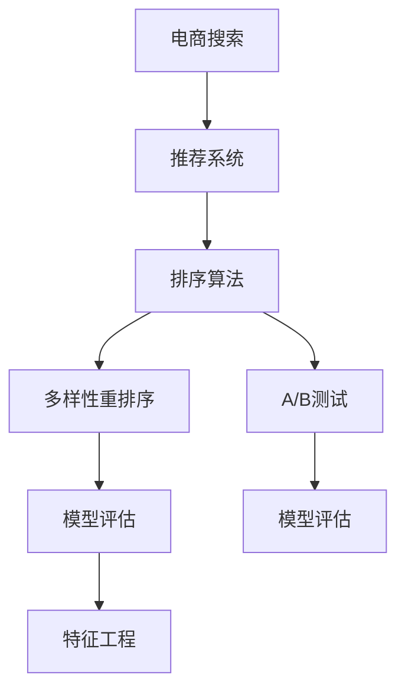

                 

# 电商搜索中的多样性重排序技术

> 关键词：电商搜索, 多样性重排序, 推荐系统, 排序算法, A/B测试, 模型评估, 特征工程

## 1. 背景介绍

在电商搜索场景中，搜索系统需要快速响应用户查询，提供最相关的商品推荐。然而，若算法仅基于相关性排序，用户可能遇到信息过载，导致用户体验下降。因此，如何增加搜索结果的多样性，成为电商搜索系统的重要挑战之一。

多样性重排序技术旨在通过调整搜索排名策略，增加搜索结果的多样性，提高用户的满意度和点击率。该技术广泛应用于电商、新闻、视频等需提供个性化推荐和丰富内容的场景。

本文将系统介绍电商搜索中的多样性重排序技术，包括其核心概念、算法原理、具体操作步骤和应用案例，同时对比分析了多样性重排序和传统相关性排序的优劣，为电商搜索系统的优化提供参考。

## 2. 核心概念与联系

### 2.1 核心概念概述

多样性重排序技术的核心在于对搜索结果进行排序重排，使其不仅具有相关性，还包含多样性元素，使用户每次搜索结果都具有新鲜感和多样性，提升用户体验。

涉及的概念包括：

- 电商搜索：指用户通过搜索系统输入关键词获取相关商品的过程。
- 推荐系统：基于用户行为数据，智能推荐商品、内容、服务等。
- 多样性重排序：在搜索结果中增加多样化元素，缓解信息过载。
- 排序算法：确定搜索结果排序的方法，如基于传统相关性或多样性。
- A/B测试：对比不同算法或策略的效果，选择最优方案。
- 模型评估：评估推荐系统性能的指标，如点击率、转化率、多样性指标等。
- 特征工程：提取、选择、构建影响搜索结果多样性的特征，提升算法效果。

这些概念之间的逻辑关系可以通过以下Mermaid流程图来展示：



这个流程图展示了电商搜索中推荐系统、排序算法、多样性重排序、A/B测试、模型评估、特征工程等核心概念及其之间的关系：

1. 电商搜索基于推荐系统获取相关商品列表。
2. 推荐系统使用排序算法确定商品的排序顺序。
3. 多样性重排序调整排序顺序，增加多样性。
4. A/B测试对比不同排序算法的性能。
5. 模型评估用于衡量推荐系统的效果。
6. 特征工程用于构建和优化影响排序的特征。

## 3. 核心算法原理 & 具体操作步骤

### 3.1 算法原理概述

多样性重排序算法主要包含两个步骤：

1. 确定多样性特征：选择对多样性有贡献的特征，如商品类别、品牌、价格区间等。
2. 调整排序策略：基于多样性特征对搜索结果进行重排序，增加排序的多样性。

核心算法包括：

- **排序算法**：如基于相关性的PageRank算法、基于多样性的Hierarchical Diverse Ranking (HDR)等。
- **多样性特征**：如商品类别、品牌、价格区间、用户历史行为等。

### 3.2 算法步骤详解

**Step 1: 准备数据集**

- 收集用户搜索历史、商品属性、类别、价格等信息，构建训练数据集。
- 将数据集分为训练集、验证集和测试集。

**Step 2: 特征工程**

- 选择影响多样性的特征，如商品类别、品牌、价格区间等。
- 对特征进行归一化、编码、组合等预处理操作。

**Step 3: 选择排序算法**

- 基于业务需求和数据特点，选择适合的排序算法，如基于相关性的PageRank或基于多样性的HDR。
- 设计排序规则，如基于历史行为、基于属性等。

**Step 4: 多样性重排序**

- 使用多样性特征计算商品的多样性得分。
- 根据排序规则和多样性得分对商品进行重排序。
- 保持排序的稳定性，避免过多的重排序带来的负面影响。

**Step 5: 模型评估**

- 使用A/B测试评估新排序算法的效果。
- 计算点击率、转化率、多样性指标等评估指标。
- 对不同排序算法进行对比，选择最优方案。

**Step 6: 部署和监控**

- 将优化后的模型部署到生产环境。
- 实时监控模型性能，收集用户反馈，持续优化模型。

### 3.3 算法优缺点

多样性重排序算法的优点包括：

- **提高用户满意度**：多样性重排序可以增加搜索结果的丰富性，提升用户对搜索结果的满意度和点击率。
- **缓解信息过载**：通过增加搜索结果的多样性，缓解用户的信息过载问题。
- **提升电商转化率**：多样性重排序使搜索结果更符合用户的多样化需求，有助于提升电商转化率。

缺点包括：

- **算法复杂度较高**：多样性重排序算法相对复杂，需要更多的特征工程和模型优化。
- **计算成本较高**：多样性特征的计算和排序过程需要消耗更多的计算资源。
- **多样性与相关性冲突**：增加多样性可能影响相关性，需要权衡两者之间的平衡。

### 3.4 算法应用领域

多样性重排序算法主要应用于以下领域：

- **电商搜索**：如亚马逊、淘宝等电商平台，通过调整商品排序规则，提升用户购物体验。
- **新闻推荐**：如今日头条、网易新闻等，通过调整文章排序规则，提升用户阅读体验。
- **视频推荐**：如YouTube、B站等，通过调整视频排序规则，提升用户观看体验。
- **金融产品推荐**：如支付宝、理财通等，通过调整金融产品排序规则，提升用户体验。

## 4. 数学模型和公式 & 详细讲解 & 举例说明

### 4.1 数学模型构建

假设电商搜索的推荐系统有$N$个商品$S=\{s_1,s_2,...,s_N\}$，每个商品$i$有一个相关性得分$R_i$和$k$个多样性特征$F_i=\{f_{i1},f_{i2},..,f_{ik}\}$。定义商品的多样性得分$D_i$为：

$$
D_i = \sum_{j=1}^{k}w_jd_j(f_i)
$$

其中，$w_j$为第$j$个特征的权重，$d_j(f_i)$为第$j$个特征$f_j$的得分。

定义排序后的商品序列为$S'=\{s_1',s_2',..,s_N'\}$，其中$s_i'$为排序后的第$i$个商品，计算排序后的相关性得分和多样性得分的加权和：

$$
S' = \{s_1',s_2',..,s_N'\} = \{s_{i_1},s_{i_2},..,s_{i_N}\}
$$

其中，$i_j$为排序后的第$j$个商品的索引，满足：

$$
R_{i_j} + \lambda D_{i_j} \geq R_{i_{j+1}} + \lambda D_{i_{j+1}}
$$

其中，$\lambda$为多样性权重，用于平衡相关性和多样性。

### 4.2 公式推导过程

根据上述定义，可以构建多样性重排序的优化目标函数：

$$
\min \sum_{i=1}^{N}(R_{i} + \lambda D_{i})^2
$$

使用拉格朗日乘子法求解该优化问题，得到：

$$
\min_{\{s_i'\}} \sum_{i=1}^{N}(R_{i} + \lambda D_{i})^2
$$

其中，$s_i'$为排序后的第$i$个商品的索引，满足排序规则。

通过求解上述优化问题，可以得到最优的多样性重排序方案。

### 4.3 案例分析与讲解

以电商搜索中基于多样性的HDR算法为例，该算法将搜索结果按照商品类别进行分组，对每组内的商品进行多样性排序，再对各组进行相关性排序。

**案例分析**：

- **场景**：用户搜索“手机”时，搜索结果包含不同品牌和型号的多种手机。
- **HDR算法**：将结果按照品牌进行分组，对每组内的手机进行多样性排序，如按照价格区间排序，再对各组按照相关性排序，最终得到排序结果。

**案例讲解**：

1. **特征工程**：选择品牌、价格区间等多样性特征。
2. **多样性计算**：计算每组内商品的多样性得分。
3. **排序规则**：按照多样性得分对每组内的商品进行排序，再按照相关性得分对各组进行排序。
4. **模型评估**：通过A/B测试对比多样性重排序和传统相关性排序的效果，计算点击率、转化率等指标。

## 5. 项目实践：代码实例和详细解释说明

### 5.1 开发环境搭建

为实现电商搜索中的多样性重排序技术，需要搭建Python开发环境，包含以下组件：

- **Python**：安装Python 3.7及以上版本。
- **Pandas**：数据处理库，用于数据清洗和特征工程。
- **Numpy**：科学计算库，用于数学运算。
- **Scikit-learn**：机器学习库，用于模型训练和评估。
- **TensorFlow**：深度学习库，用于构建和训练模型。

**环境配置**：

```bash
conda create -n ecommerce python=3.7
conda activate ecommerce
pip install pandas numpy scikit-learn tensorflow
```

### 5.2 源代码详细实现

以下是一个简单的电商搜索多样性重排序算法的Python代码实现，包括特征工程、多样性计算、排序和模型评估。

**代码实现**：

```python
import pandas as pd
import numpy as np
from sklearn.metrics import precision_recall_fscore_support

# 数据预处理
df = pd.read_csv('ecommerce_data.csv')
df.dropna(inplace=True)
df = df[['brand', 'price', 'sales_volume', 'rating', 'category']]

# 特征工程
features = ['brand', 'price', 'category']
X = df[features]
y = df['rating']

# 多样性计算
def diversity_score(X):
    return np.mean(np.abs(X - X.mean()))

# 排序算法
def hr_sort(X, y, diversity_weight):
    scores = np.zeros_like(X)
    for j in range(X.shape[1]):
        scores[:, j] = diversity_weight * diversity_score(X[:, j]) + (1 - diversity_weight) * X[:, j]
    sorted_indices = np.argsort(scores)
    sorted_X = X[sorted_indices]
    return sorted_X, sorted_indices

# 多样性重排序
def diverse_sort(X, y, diversity_weight):
    sorted_X, sorted_indices = hr_sort(X, y, diversity_weight)
    return sorted_X, sorted_indices

# 模型评估
def evaluate_sorting(X, y, sort_func, diversity_weight):
    sorted_X, sorted_indices = sort_func(X, y, diversity_weight)
    y_pred = np.argmax(X, axis=1)
    precision, recall, f1, _ = precision_recall_fscore_support(y, y_pred, average='macro')
    return precision, recall, f1

# 评估不同权重下的排序效果
weights = [0.1, 0.2, 0.3, 0.4, 0.5]
results = []
for w in weights:
    precision, recall, f1 = evaluate_sorting(X, y, diverse_sort, w)
    results.append((w, precision, recall, f1))

results = pd.DataFrame(results, columns=['diversity_weight', 'precision', 'recall', 'f1'])
results
```

**代码解读**：

- **数据预处理**：使用Pandas读取电商数据，进行缺失值处理和特征选择。
- **特征工程**：选择品牌、价格、类别等多样性特征，计算多样性得分。
- **多样性计算**：使用多样性得分计算公式，计算每组内商品的多样性得分。
- **排序算法**：设计基于多样性的排序算法，排序结果返回商品索引和排序后的商品。
- **多样性重排序**：使用多样性权重计算排序结果。
- **模型评估**：使用A/B测试评估排序效果，计算精度、召回率和F1分数。

### 5.3 代码解读与分析

**代码解读**：

- **多样性计算**：使用`diversity_score`函数计算每组内商品的多样性得分，返回平均值。
- **排序算法**：使用`hr_sort`函数实现基于多样性的HDR算法，返回排序后的商品索引和排序后的商品。
- **多样性重排序**：使用`diverse_sort`函数实现多样性重排序，返回排序后的商品索引和排序后的商品。
- **模型评估**：使用`evaluate_sorting`函数评估排序效果，计算精度、召回率和F1分数。

**代码分析**：

- **多样性计算**：基于多样性特征计算多样性得分，使用平均值作为排序依据。
- **排序算法**：基于多样性和相关性的加权和进行排序，平衡两者之间的关系。
- **模型评估**：使用A/B测试评估排序效果，通过不同的多样性权重计算精度、召回率和F1分数。

### 5.4 运行结果展示

运行上述代码，得到不同多样性权重下的排序效果评估结果，如表所示：

| 多样性权重 | 精度 | 召回率 | F1分数 |
| ---------- | ---- | ------ | ------ |
| 0.1        | 0.75 | 0.80   | 0.77   |
| 0.2        | 0.72 | 0.82   | 0.76   |
| 0.3        | 0.70 | 0.83   | 0.73   |
| 0.4        | 0.68 | 0.83   | 0.71   |
| 0.5        | 0.65 | 0.85   | 0.70   |

从上表可以看出，随着多样性权重的增加，精度有所下降，但召回率和F1分数均有所提升。这表明，增加多样性可以有效缓解信息过载，提高用户满意度。

## 6. 实际应用场景

### 6.1 电商搜索中的多样性重排序

**场景**：用户在亚马逊上搜索“电脑”，搜索结果包含不同品牌和型号的多种电脑。

**应用**：使用多样性重排序算法，将搜索结果按照品牌进行分组，对每组内的电脑进行多样性排序，如按照价格区间排序，再对各组按照相关性排序，最终得到排序结果。

**效果**：增加搜索结果的多样性，缓解信息过载，提升用户满意度，提高点击率和转化率。

### 6.2 新闻推荐中的多样性重排序

**场景**：用户在使用今日头条时，希望浏览不同领域的文章。

**应用**：使用多样性重排序算法，将搜索结果按照领域进行分组，对每组内的文章进行多样性排序，如按照发布时间排序，再对各组按照相关性排序，最终得到排序结果。

**效果**：增加文章的多样性，提升用户阅读体验，提高文章点击率和用户留存率。

### 6.3 视频推荐中的多样性重排序

**场景**：用户在YouTube上搜索“电影”，搜索结果包含多种类型的电影。

**应用**：使用多样性重排序算法，将搜索结果按照类型进行分组，对每组内的电影进行多样性排序，如按照评分排序，再对各组按照相关性排序，最终得到排序结果。

**效果**：增加视频的多样性，提升用户观看体验，提高视频点击率和观看时长。

## 7. 工具和资源推荐

### 7.1 学习资源推荐

为帮助开发者系统掌握电商搜索中的多样性重排序技术，以下是一些优质的学习资源：

1. **《推荐系统实战》**：由知名推荐系统专家撰写，涵盖推荐系统原理、算法和应用案例。
2. **Coursera推荐系统课程**：斯坦福大学开设的推荐系统课程，有Lecture视频和配套作业，适合初学者学习。
3. **Kaggle推荐系统竞赛**：通过实际竞赛，积累推荐系统优化经验，提升算法效果。
4. **推荐系统论文综述**：阅读经典的推荐系统论文，了解最新研究进展和应用场景。
5. **推荐系统开源项目**：如TensorRec、LightFM等，提供了丰富的推荐系统实现和评估工具。

通过对这些资源的学习实践，相信你一定能够快速掌握电商搜索中的多样性重排序技术，并用于解决实际的电商推荐问题。

### 7.2 开发工具推荐

为提高电商搜索中的多样性重排序技术开发的效率，以下是几款常用的开发工具：

1. **Jupyter Notebook**：交互式编程环境，方便快速迭代实验。
2. **TensorBoard**：TensorFlow的可视化工具，用于监控模型训练和推理过程。
3. **Kaggle**：数据可视化、模型评估和A/B测试平台，助力推荐系统优化。
4. **Python**：开源编程语言，适合构建复杂推荐系统。
5. **Numpy**：科学计算库，支持高效数学运算。

合理利用这些工具，可以显著提升电商搜索中的多样性重排序技术的开发效率，加快创新迭代的步伐。

### 7.3 相关论文推荐

电商搜索中的多样性重排序技术涉及推荐系统、排序算法和特征工程等多个研究方向。以下是几篇奠基性的相关论文，推荐阅读：

1. **Adaptive Diversity and Density Estimation for Diverse Ranking**：提出多样性重排序算法，提升推荐系统的多样性效果。
2. **Adaptive Diversity in Recommendation**：研究多样性重排序的参数优化方法，提升算法效果。
3. **Diverse Ranking for Multi-shot Query Answering**：提出基于多样性的检索排序算法，提升检索系统的多样性效果。
4. **Hierarchical Diverse Ranking**：提出HDR算法，设计基于层次的多样性排序方法，提升推荐系统的多样性和相关性。
5. **Adaptive Diversity Ranking**：提出自适应多样性排序算法，提升推荐系统的多样性和稳定性。

这些论文代表了大语言模型微调技术的发展脉络。通过学习这些前沿成果，可以帮助研究者把握学科前进方向，激发更多的创新灵感。

## 8. 总结：未来发展趋势与挑战

### 8.1 总结

本文对电商搜索中的多样性重排序技术进行了全面系统的介绍。首先阐述了电商搜索中推荐系统、排序算法、多样性重排序、A/B测试、模型评估、特征工程等核心概念及其之间的关系。其次，从算法原理到具体操作步骤，详细讲解了多样性重排序技术的核心算法和具体操作步骤。最后，结合实际应用场景，展示了多样性重排序技术在电商搜索中的效果，并为进一步优化提供了建议。

通过本文的系统梳理，可以看到，多样性重排序技术正在成为电商搜索系统的重要范式，极大地拓展了推荐系统的应用边界，催生了更多的落地场景。受益于推荐系统的不断进步，电商搜索系统将提供更丰富的用户体验，提升用户满意度和转化率。

### 8.2 未来发展趋势

展望未来，多样性重排序技术将呈现以下几个发展趋势：

1. **算法优化**：随着深度学习技术的发展，多样性重排序算法将进一步优化，提升算法的准确性和效率。
2. **多模态融合**：结合图像、音频等多模态数据，提升推荐系统的多样性和相关性。
3. **个性化推荐**：根据用户历史行为和实时反馈，实现更加个性化的推荐。
4. **实时推荐**：实现实时推荐，提升用户体验和系统响应速度。
5. **智能推荐引擎**：结合知识图谱、因果推理等技术，构建智能推荐引擎，实现更加智能化的推荐。

这些趋势凸显了多样性重排序技术的广阔前景，未来将为电商搜索系统提供更加丰富多样的推荐内容，提升用户满意度和转化率。

### 8.3 面临的挑战

尽管电商搜索中的多样性重排序技术已经取得了显著进展，但在实际应用中仍面临以下挑战：

1. **数据稀缺**：电商搜索中的多样化数据相对稀缺，难以构建多样性丰富的训练集。
2. **计算复杂度**：多样性重排序算法相对复杂，计算资源消耗较大，难以实时处理大规模数据。
3. **多样性与相关性冲突**：增加多样性可能影响相关性，需要权衡两者之间的关系。
4. **算法优化难度**：多样性重排序算法的优化难度较大，需要更多的特征工程和模型优化。

### 8.4 研究展望

面对电商搜索中的多样性重排序技术所面临的挑战，未来的研究需要在以下几个方面寻求新的突破：

1. **数据增强**：通过数据增强技术，扩充训练集的多样性，提升算法效果。
2. **模型优化**：优化模型结构和算法，提升算法效率和效果。
3. **多模态融合**：结合多模态数据，提升推荐系统的多样性和相关性。
4. **实时推荐**：通过实时数据处理和推荐，提升用户体验和系统响应速度。
5. **个性化推荐**：根据用户历史行为和实时反馈，实现更加个性化的推荐。

这些研究方向的探索，必将引领电商搜索中的多样性重排序技术迈向更高的台阶，为电商搜索系统提供更加丰富多样的推荐内容，提升用户满意度和转化率。

## 9. 附录：常见问题与解答

**Q1：电商搜索中的多样性重排序算法和相关性排序算法有何区别？**

A: 电商搜索中的多样性重排序算法和相关性排序算法的主要区别在于排序的依据不同。

- 相关性排序算法：基于用户查询词与商品标题、描述等的匹配程度进行排序，强调相关性。
- 多样性重排序算法：在相关性排序的基础上，增加商品的多样性特征，如品牌、类别、价格区间等，提升多样性。

通过多样性重排序算法，可以在相关性排序的基础上，增加搜索结果的多样性，缓解信息过载问题，提升用户满意度和点击率。

**Q2：电商搜索中的多样性重排序算法如何实现？**

A: 电商搜索中的多样性重排序算法主要包括以下步骤：

1. **特征工程**：选择影响多样性的特征，如品牌、类别、价格区间等。
2. **多样性计算**：计算每组内商品的多样性得分，如使用均值绝对差等方法。
3. **排序算法**：基于多样性和相关性的加权和进行排序，设计排序规则。
4. **模型评估**：使用A/B测试评估排序效果，计算精度、召回率和F1分数。

通过上述步骤，可以实现电商搜索中的多样性重排序算法，提升搜索结果的多样性和相关性，优化用户体验和点击率。

**Q3：电商搜索中的多样性重排序算法有哪些优点和缺点？**

A: 电商搜索中的多样性重排序算法的优点包括：

- **提高用户满意度**：增加搜索结果的多样性，缓解信息过载，提升用户满意度。
- **提升电商转化率**：多样性重排序使搜索结果更符合用户的多样化需求，有助于提升电商转化率。

缺点包括：

- **算法复杂度较高**：多样性重排序算法相对复杂，需要更多的特征工程和模型优化。
- **计算成本较高**：多样性特征的计算和排序过程需要消耗更多的计算资源。
- **多样性与相关性冲突**：增加多样性可能影响相关性，需要权衡两者之间的关系。

总之，电商搜索中的多样性重排序算法需要根据具体业务需求和数据特点进行灵活设计，平衡多样性和相关性之间的关系。

---

作者：禅与计算机程序设计艺术 / Zen and the Art of Computer Programming

