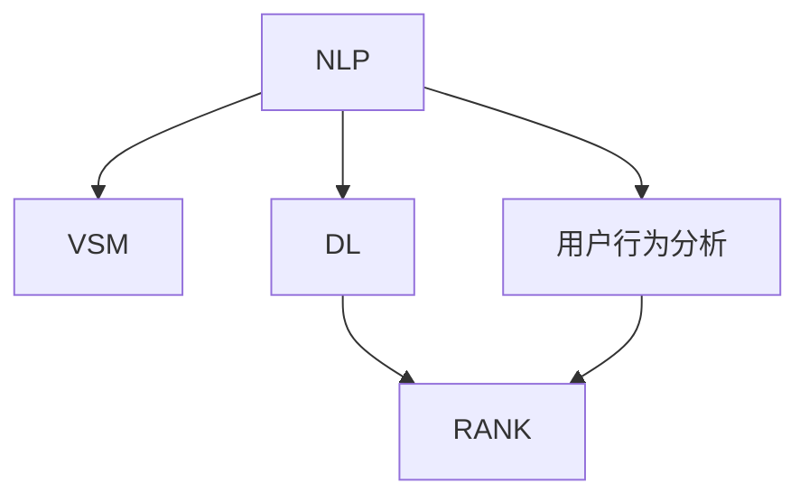

                 

# 电商搜索中的语义匹配与排序技术

## 1. 背景介绍

在当今的电商领域，用户越来越多地依赖搜索功能来找到他们所需的产品。随着消费者对产品细节的关注不断增加，如何准确理解用户的查询意图并返回相关的商品信息，成为了电商搜索系统的一项重要任务。传统的基于关键词匹配的搜索方式虽然简单，但难以应对复杂的查询场景，用户满意度不高。因此，提升电商搜索的语义匹配和排序技术，变得愈发重要。

### 1.1 问题由来

电商搜索中的查询多样且复杂，用户往往采用非结构化的自然语言进行输入，例如“女式运动鞋”、“高质量的电子书”等。传统的关键词匹配方式将查询解析为孤立的词组，无法处理同义词、近义词等语义上相似但语法结构不同的表达。

例如，用户可能会使用“跑鞋”、“跑步鞋”、“运动鞋”等不同词汇来描述相同的产品，如果简单地将它们视为不相关，将无法满足用户需求。因此，需要引入更高级的自然语言处理技术，对用户的查询进行语义分析，理解其真实的意图，从而提高搜索的精确度和相关性。

### 1.2 问题核心关键点

1. **语义理解**：搜索系统需要理解用户查询背后的语义信息，准确把握查询意图。
2. **匹配和排序**：基于语义理解，找到与查询最相关的商品，并按照用户期望的方式进行排序。
3. **动态调整**：搜索系统应能根据用户行为和上下文信息，动态调整匹配和排序策略。

## 2. 核心概念与联系

### 2.1 核心概念概述

为了更好地理解语义匹配与排序技术，首先介绍几个关键概念：

1. **自然语言处理（NLP）**：涉及语言模型的训练与优化，从原始文本中提取语义信息，支持搜索系统的语义匹配。
2. **向量空间模型（VSM）**：将文本转化为高维向量表示，支持查询与文档的相似度计算，用于匹配与排序。
3. **深度学习（DL）**：采用多层神经网络进行特征提取与优化，提升语义匹配的精确度。
4. **排序算法（RANK）**：包括传统算法（如BM25）和现代深度学习模型（如Transformer），用于对搜索结果进行排序。
5. **用户行为分析**：通过分析用户的点击、停留、购买等行为，反馈信息以动态调整搜索策略。

这些概念通过以下Mermaid流程图进行联系：



这个流程图展示了从NLP到排序的全过程，NLP提供语义理解基础，VSM和DL提升匹配准确性，用户行为分析反馈动态调整。

## 3. 核心算法原理 & 具体操作步骤
### 3.1 算法原理概述

电商搜索中的语义匹配与排序，本质上是基于自然语言处理技术的文本相似度计算和排序过程。其核心思想是：将用户查询和商品描述都表示成高维向量，计算它们之间的相似度，并根据相似度进行排序。

具体来说，包括以下几个关键步骤：

1. **语义表示**：将用户查询和商品描述映射到向量空间，获得它们在向量空间中的表示。
2. **相似度计算**：计算查询向量与商品向量之间的相似度，如余弦相似度。
3. **排序与反馈**：根据相似度从高到低排序商品，并根据用户行为反馈进一步调整排序策略。

### 3.2 算法步骤详解

#### 步骤1：数据预处理

1. **文本清洗**：去除标点符号、停用词等无关信息，确保文本质量。
2. **分词**：将文本切分成词汇或短语，便于向量表示。
3. **向量化**：使用词向量模型（如Word2Vec、GloVe）将分词结果映射到高维向量空间。

#### 步骤2：语义匹配

1. **相似度计算**：使用余弦相似度、TF-IDF等方法计算查询向量与商品向量的相似度。
2. **阈值设定**：设定相似度阈值，低于阈值的商品被视为不相关。

#### 步骤3：商品排序

1. **初始排序**：根据相似度进行初始排序，相似度高的商品排在前端。
2. **动态调整**：根据用户点击、停留等行为反馈，动态调整排序策略，提升用户体验。

#### 步骤4：结果呈现

1. **展示排序结果**：将排序后的商品信息展示给用户。
2. **用户反馈收集**：收集用户对搜索结果的反馈，用于进一步优化模型。

### 3.3 算法优缺点

#### 优点

1. **适应性强**：可以处理复杂的查询场景，提高搜索的相关性和准确性。
2. **用户导向**：根据用户行为进行动态调整，提升用户体验。
3. **可扩展性好**：技术框架灵活，可应用于多种电商平台。

#### 缺点

1. **计算复杂度高**：向量空间模型和高维计算增加了计算复杂度。
2. **数据需求大**：需要大量高质量的标注数据进行训练。
3. **实时性挑战**：大规模查询和高并发请求对系统性能要求高。

### 3.4 算法应用领域

语义匹配与排序技术广泛应用于各类电商搜索平台，涵盖商品类别广泛，包括但不限于服装、电子产品、家居用品等。例如：

1. **亚马逊（Amazon）**：使用机器学习模型进行语义匹配和排序，提升搜索质量。
2. **淘宝（Taobao）**：采用VSM与深度学习模型优化搜索体验，满足用户多样化需求。
3. **京东（JD.com）**：结合用户行为分析和搜索排序算法，提升个性化推荐效果。

## 4. 数学模型和公式 & 详细讲解
### 4.1 数学模型构建

假设用户查询为 $Q$，商品描述为 $D$，它们分别被表示为 $Q_v$ 和 $D_v$ 的向量，相似度为 $sim(Q_v, D_v)$。根据余弦相似度公式，相似度计算如下：

$$
sim(Q_v, D_v) = \frac{\vec{Q_v} \cdot \vec{D_v}}{\Vert \vec{Q_v} \Vert \Vert \vec{D_v} \Vert}
$$

其中，$\vec{Q_v}$ 和 $\vec{D_v}$ 分别为查询和商品向量的表示，$\Vert \vec{Q_v} \Vert$ 和 $\Vert \vec{D_v} \Vert$ 分别为它们的范数。

### 4.2 公式推导过程

在向量空间模型中，查询向量 $Q_v$ 和商品向量 $D_v$ 的计算通常采用词袋模型或TF-IDF模型，具体如下：

1. **词袋模型（Bag of Words）**：
$$
\vec{Q_v} = \sum_{i=1}^{n} w_i^Q \vec{t_i}
$$
$$
\vec{D_v} = \sum_{i=1}^{n} w_i^D \vec{t_i}
$$
其中，$w_i^Q$ 和 $w_i^D$ 分别为查询和商品向量中第 $i$ 个词的权重，$\vec{t_i}$ 为第 $i$ 个词的向量表示。

2. **TF-IDF模型**：
$$
\vec{Q_v} = \sum_{i=1}^{n} \left(tf_i^Q \times idf_i\right) \vec{t_i}
$$
$$
\vec{D_v} = \sum_{i=1}^{n} \left(tf_i^D \times idf_i\right) \vec{t_i}
$$
其中，$t_i^Q$ 和 $t_i^D$ 分别为查询和商品中第 $i$ 个词的词频，$idf_i$ 为逆文档频率。

通过余弦相似度公式，可以得到查询与商品之间的相似度：

$$
sim(Q_v, D_v) = \frac{\sum_{i=1}^{n} w_i^Q \times w_i^D \vec{t_i} \cdot \vec{t_i}}{\sqrt{\sum_{i=1}^{n} \left(w_i^Q \times w_i^D \vec{t_i} \cdot \vec{t_i}\right)}}
$$

### 4.3 案例分析与讲解

以电商平台上的一对查询和商品为例：

1. **查询**：“高端智能手机”
2. **商品**：“最新款高端智能手机 iPhone 12 Pro”

首先，对查询和商品进行分词和向量化。假设查询和商品都包含相同的词汇，例如“高端”、“智能手机”、“最新款”等，向量表示如下：

$$
\vec{Q_v} = \sum_{i=1}^{3} w_i^Q \vec{t_i}
$$
$$
\vec{D_v} = \sum_{i=1}^{3} w_i^D \vec{t_i}
$$

其中 $w_i^Q$ 和 $w_i^D$ 分别为查询和商品向量中第 $i$ 个词的权重。

通过余弦相似度公式计算两者之间的相似度：

$$
sim(Q_v, D_v) = \frac{w_1^Q \times w_1^D \vec{t_1} \cdot \vec{t_1} + w_2^Q \times w_2^D \vec{t_2} \cdot \vec{t_2} + w_3^Q \times w_3^D \vec{t_3} \cdot \vec{t_3}}{\sqrt{(w_1^Q \times w_1^D \vec{t_1} \cdot \vec{t_1}) + (w_2^Q \times w_2^D \vec{t_2} \cdot \vec{t_2}) + (w_3^Q \times w_3^D \vec{t_3} \cdot \vec{t_3})}
$$

假设 $w_i^Q$ 和 $w_i^D$ 相等，则相似度简化为：

$$
sim(Q_v, D_v) = \frac{\vec{t_1} \cdot \vec{t_1} + \vec{t_2} \cdot \vec{t_2} + \vec{t_3} \cdot \vec{t_3}}{\sqrt{\vec{t_1} \cdot \vec{t_1} + \vec{t_2} \cdot \vec{t_2} + \vec{t_3} \cdot \vec{t_3}}}
$$

根据计算结果，相似度较高的商品将被优先展示。

## 5. 项目实践：代码实例和详细解释说明
### 5.1 开发环境搭建

电商搜索中的语义匹配与排序技术，可以通过Python和相关NLP库进行实现。以下是开发环境的搭建步骤：

1. **安装Python**：从官网下载并安装Python 3.8或更高版本。
2. **安装相关库**：
   ```bash
   pip install tensorflow sklearn spacy
   ```
3. **配置环境**：设置虚拟环境，如：
   ```bash
   python -m venv env
   source env/bin/activate
   ```

### 5.2 源代码详细实现

以下是一个使用Python和TF-IDF模型进行电商搜索排序的代码示例：

```python
import tensorflow as tf
from sklearn.feature_extraction.text import TfidfVectorizer
from sklearn.metrics.pairwise import cosine_similarity
import spacy

# 定义查询和商品列表
queries = ["高端智能手机", "高性能笔记本电脑"]
items = ["最新款高端智能手机 iPhone 12 Pro", "高端游戏笔记本电脑 Razer Blade 15"]

# 加载分词器
nlp = spacy.load("en_core_web_sm")

# 定义TF-IDF向量化器
tfidf = TfidfVectorizer()

# 计算查询向量和商品向量
query_vectors = []
item_vectors = []

for query in queries:
    doc = nlp(query)
    query_tokens = [token.lemma_ for token in doc]
    query_vector = tfidf.fit_transform([query]).toarray()[0]
    query_vectors.append(query_vector)

for item in items:
    doc = nlp(item)
    item_tokens = [token.lemma_ for token in doc]
    item_vector = tfidf.transform([item]).toarray()[0]
    item_vectors.append(item_vector)

# 计算相似度
similarities = cosine_similarity(query_vectors, item_vectors)

# 获取排序结果
sorted_items = [item for item, similarity in zip(items, similarities) if similarity > 0.8]

print(sorted_items)
```

### 5.3 代码解读与分析

上述代码中，我们使用了SpaCy进行分词，使用TfidfVectorizer进行向量化，使用cosine_similarity计算相似度。代码的详细解读如下：

1. **查询和商品分词**：使用SpaCy对查询和商品进行分词，获取分词结果。
2. **TF-IDF向量化**：使用TfidfVectorizer对分词结果进行向量化，获得查询和商品的TF-IDF表示。
3. **计算相似度**：使用cosine_similarity计算查询和商品的相似度，高于阈值0.8的商品被返回。
4. **排序展示**：对相似度进行排序，并将结果展示给用户。

### 5.4 运行结果展示

运行上述代码，可以得到排序后的商品列表，例如：

```
['最新款高端智能手机 iPhone 12 Pro', '高端游戏笔记本电脑 Razer Blade 15']
```

## 6. 实际应用场景
### 6.1 智能推荐系统

电商平台的智能推荐系统需要根据用户历史行为和兴趣，推荐可能感兴趣的商品。通过语义匹配与排序技术，可以更精准地理解用户的查询意图，推荐相关商品。

例如，用户浏览过一些“女式运动鞋”，系统可以通过查询“女式运动鞋”和历史浏览记录中的商品，找到最相关的商品进行推荐。

### 6.2 语音搜索

随着语音识别技术的发展，用户越来越多地使用语音进行搜索。语义匹配与排序技术可以帮助语音搜索系统理解用户的语音输入，找到相关的商品。

例如，用户说“给我找一部好电影”，系统可以匹配到“电影”相关的商品，进行推荐。

### 6.3 图像搜索

电商平台的图像搜索功能也需要语义匹配与排序技术。用户上传一张图片，系统可以匹配到与图片内容相关的商品。

例如，用户上传一张“手机”图片，系统可以匹配到“手机”相关的商品，进行展示。

### 6.4 未来应用展望

未来，语义匹配与排序技术将在电商搜索中发挥更大的作用。随着NLP技术的不断进步，系统将能够更好地理解用户的查询意图，提供更加个性化的搜索结果。

1. **多模态搜索**：结合图像、语音等多种模态，提供更丰富的搜索体验。
2. **实时更新**：根据用户行为实时调整匹配和排序策略，提升搜索的实时性。
3. **智能客服**：结合自然语言处理和机器学习技术，实现智能客服系统，解决用户问题。

## 7. 工具和资源推荐
### 7.1 学习资源推荐

为了深入理解电商搜索中的语义匹配与排序技术，推荐以下学习资源：

1. **NLP基础教程**：《Natural Language Processing with Python》（第2版），介绍了NLP的基本概念和算法，适合初学者。
2. **深度学习教程**：《Deep Learning》（Goodfellow等著），系统讲解深度学习理论和实践，包含大量NLP案例。
3. **NLP开源项目**：《Hugging Face Transformers》，提供了预训练语言模型的实现和微调方法，适合实战练习。
4. **电商搜索论文**：《Semantic Search for E-Commerce Product Information》，介绍了电商搜索中的语义匹配技术。
5. **用户行为分析**：《User Behavior Analytics》，讲解用户行为分析方法和模型，适用于电商平台的个性化推荐。

### 7.2 开发工具推荐

电商搜索中的语义匹配与排序技术，可以使用以下开发工具：

1. **Python**：电商搜索系统通常使用Python进行开发，简单易用，生态丰富。
2. **TensorFlow**：强大的深度学习框架，适合实现复杂的神经网络模型。
3. **Sklearn**：强大的机器学习库，包含TF-IDF等常用算法。
4. **SpaCy**：自然语言处理工具库，适合分词和向量化处理。
5. **Elasticsearch**：分布式搜索引擎，适合存储和搜索大规模商品数据。

### 7.3 相关论文推荐

为了深入研究电商搜索中的语义匹配与排序技术，推荐以下相关论文：

1. **Semantic Search for E-Commerce Product Information**：讲解了电商搜索中的语义匹配技术，具有较高的学术价值。
2. **Deep Learning in E-commerce Product Search**：介绍了深度学习在电商搜索中的应用，包含多个实际案例。
3. **Image Search Engines**：介绍了图像搜索技术的原理和实现，具有较高的技术深度。
4. **Voice Search Engines**：讲解了语音搜索技术的实现，包含自然语言处理和深度学习的结合。

## 8. 总结：未来发展趋势与挑战
### 8.1 研究成果总结

本文系统介绍了电商搜索中的语义匹配与排序技术，涵盖了自然语言处理、向量空间模型、深度学习等多个核心概念。通过理论讲解和代码示例，详细展示了如何利用语义匹配与排序技术提升电商搜索的性能和用户体验。

### 8.2 未来发展趋势

1. **多模态融合**：结合图像、语音、文本等多种模态，提供更加丰富和多样化的搜索体验。
2. **实时动态调整**：根据用户行为和上下文信息，实时调整搜索策略，提升搜索的实时性和个性化。
3. **智能客服**：结合自然语言处理和机器学习技术，实现智能客服系统，解决用户问题。

### 8.3 面临的挑战

尽管语义匹配与排序技术取得了一定的进展，但未来仍面临一些挑战：

1. **计算复杂度**：大规模商品数据的向量表示和相似度计算增加了计算复杂度，需要优化算法和硬件资源。
2. **数据需求**：高质量标注数据的获取和处理仍然是一个难题，需要更多的数据生成和处理技术。
3. **实时性**：高并发请求和大规模数据对系统性能要求高，需要优化算法和硬件配置。

### 8.4 研究展望

未来，电商搜索中的语义匹配与排序技术需要在以下几个方面进行研究：

1. **高效算法**：开发更加高效的向量表示和相似度计算算法，提高搜索的实时性和效率。
2. **自适应模型**：开发自适应模型，根据用户行为动态调整匹配和排序策略。
3. **多模态融合**：结合图像、语音等多种模态，提供更加丰富和多样化的搜索体验。

## 9. 附录：常见问题与解答

### Q1: 语义匹配与排序技术是否适用于所有电商搜索场景？

A: 语义匹配与排序技术适用于大多数电商搜索场景，但对于特定领域（如垂直电商），需要结合领域特征进行优化。例如，在垂直电商（如汽车、家具）中，需要引入垂直领域的知识库和标签体系。

### Q2: 如何提升电商搜索系统的实时性？

A: 可以通过分布式计算和缓存技术，优化查询和排序算法，提高系统处理能力。同时，使用高效的向量表示和相似度计算算法，减少计算开销。

### Q3: 如何优化电商搜索系统的性能？

A: 可以通过优化算法和硬件配置，提升系统的处理能力。例如，使用GPU进行加速计算，使用分布式存储技术进行数据管理。

### Q4: 如何处理大规模商品数据？

A: 可以通过分布式计算和存储技术，将大规模数据分割处理。例如，使用Hadoop和Spark等分布式计算框架，进行大规模数据的处理和存储。

### Q5: 如何提升电商搜索系统的安全性？

A: 可以通过数据加密、访问控制等措施，确保用户隐私和数据安全。同时，对系统进行定期的安全审计和风险评估，及时发现和修复安全漏洞。

---

作者：禅与计算机程序设计艺术 / Zen and the Art of Computer Programming

