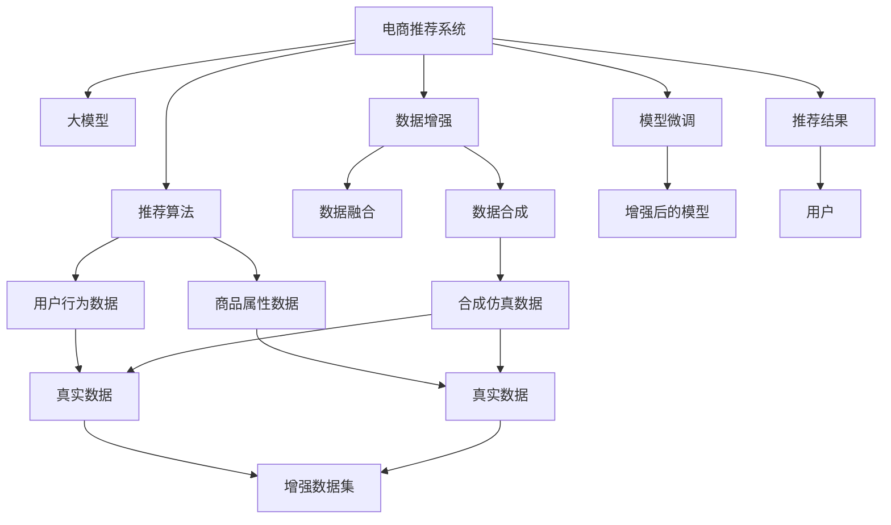

                 

# 电商搜索推荐中的AI大模型数据增强技术最佳实践

> 关键词：大模型, 数据增强, 推荐系统, 电商搜索, 自然语言处理, 深度学习, AI, 数据预处理

## 1. 背景介绍

### 1.1 问题由来

随着电子商务的蓬勃发展，各大电商平台对推荐系统的依赖性日益增强，希望通过精准推荐提升用户购物体验和平台转化率。与此同时，推荐系统面临的挑战也愈加复杂：

- 海量数据：电商平台日积月累的海量用户行为数据，给推荐模型带来了巨大训练压力。
- 多样性需求：用户需求呈现高度个性化和多样化，推荐系统需要兼顾长尾需求和热门商品。
- 实时性要求：用户在平台上的浏览行为瞬息万变，推荐系统需要在极短时间内响应用户请求。
- 数据偏差：用户行为数据存在多种偏见，如用户意图模糊、行为数据稀疏等，影响模型性能。

传统推荐算法如协同过滤、基于内容的推荐难以有效应对这些挑战，而近年来兴起的大模型推荐系统（Large Model Recommendation Systems）为电商推荐注入了新的活力。大模型通过海量预训练数据，具备强大的特征表示和知识学习能力，能够更准确地捕捉用户行为和商品特性。然而，大模型推荐系统同样面临着数据量、实时性和模型鲁棒性等诸多问题。

为了提升电商推荐系统的性能和鲁棒性，大模型推荐系统采用了一种称为数据增强(Data Augmentation)的技术，通过合成仿真数据扩充训练集，帮助模型更好地泛化到真实场景。本文将详细介绍基于大模型的电商推荐系统中的数据增强技术，探讨其实现原理、具体操作步骤及应用效果。

### 1.2 问题核心关键点

大模型推荐系统中的数据增强技术主要包括：

- 数据合成：通过模拟用户行为和商品属性，生成新的仿真数据，用于扩充训练集。
- 数据融合：将新合成的数据与原始标注数据混合，形成增强后的训练集。
- 模型训练：利用增强后的训练集，对大模型进行微调，提升推荐效果。
- 模型评估：通过实验评估增强数据对模型性能的提升效果。

本文将聚焦于大模型推荐系统中的数据增强技术，探讨如何在大规模数据集上，通过数据合成和融合，有效提升电商推荐系统的推荐效果。

## 2. 核心概念与联系

### 2.1 核心概念概述

为了更好地理解基于大模型的电商推荐系统中的数据增强技术，本节将介绍几个关键概念：

- 大模型：指通过海量数据预训练的深度学习模型，具备强大的特征表示和知识学习能力。例如，GPT-3、BERT、T5等模型。
- 推荐系统：通过用户行为数据和商品属性信息，为用户推荐合适商品的技术体系。分为基于协同过滤的推荐、基于内容的推荐和混合推荐等。
- 数据增强：指通过模拟和合成数据，扩充原始训练数据集，提升模型泛化能力的技术。
- 电商推荐：针对电商平台的用户行为和商品信息，进行个性化推荐的技术。
- 自然语言处理（NLP）：指通过计算机技术处理自然语言，进行信息提取、语义理解、情感分析等任务。

这些核心概念之间存在紧密联系，共同构成了电商推荐系统中的数据增强技术的理论基础。

### 2.2 核心概念原理和架构的 Mermaid 流程图



这个流程图展示了电商推荐系统中数据增强技术的工作原理：

1. 电商推荐系统接收用户行为数据和商品属性数据。
2. 通过大模型进行预训练，学习用户行为和商品属性特征。
3. 使用数据增强技术合成仿真数据，扩充原始数据集。
4. 将合成数据和原始数据混合，形成增强数据集。
5. 对增强数据集进行模型微调，提升推荐效果。
6. 利用微调后的模型，对用户进行推荐，生成推荐结果。
7. 推荐结果反馈给用户，形成闭环反馈机制。

## 3. 核心算法原理 & 具体操作步骤
### 3.1 算法原理概述

基于大模型的电商推荐系统中的数据增强技术，通过模拟用户行为和商品属性，生成新的仿真数据，用于扩充训练集。增强数据集包含的样本数远超原始数据集，可以显著提升模型泛化能力，从而在电商推荐任务上获得更好的性能。

### 3.2 算法步骤详解

基于大模型的电商推荐系统中的数据增强技术一般包括以下几个关键步骤：

**Step 1: 数据预处理**

- 收集电商平台的用户行为数据，如浏览记录、点击记录、购买记录等。
- 收集商品属性信息，如价格、类别、品牌、描述等。
- 对用户行为和商品属性数据进行清洗、去重和标准化，以确保数据质量和一致性。

**Step 2: 数据合成**

- 根据电商平台的历史数据，设计一组规则或模型，生成仿真数据。例如，通过协同过滤、矩阵分解等技术，生成仿真用户行为数据。
- 使用自然语言处理技术，对商品描述进行语义分析，生成仿真商品属性数据。
- 将仿真用户行为数据和仿真商品属性数据混合，形成增强数据集。

**Step 3: 数据融合**

- 将仿真数据和原始数据混合，形成增强数据集。一般采用加权平均的方式，保证仿真数据与原始数据在语义上的一致性。
- 根据仿真数据和原始数据的权重，生成新的数据集，用于训练模型。

**Step 4: 模型训练**

- 选择大模型作为初始化参数，例如使用BERT、GPT-3等模型。
- 利用增强数据集对大模型进行微调，通过小样本学习提升推荐效果。
- 设置合适的超参数，如学习率、批大小、迭代轮数等，进行模型训练。

**Step 5: 模型评估**

- 使用增强后的模型，对电商推荐系统进行评估。可以通过准确率、召回率、F1值等指标，衡量模型的推荐效果。
- 分析模型性能提升原因，评估数据增强技术的效果。

### 3.3 算法优缺点

基于大模型的电商推荐系统中的数据增强技术具有以下优点：

- 数据增强能够有效扩充训练集，提升模型泛化能力。
- 数据增强可以在原始数据不足的情况下，提升模型性能。
- 数据增强可以通过仿真数据生成，减少标注成本。

然而，该技术也存在一些局限性：

- 数据合成难度高，需要设计合理的规则和模型。
- 仿真数据可能与原始数据存在语义差异，影响模型性能。
- 数据增强可能导致过拟合问题，需要注意数据平衡和泛化能力。

### 3.4 算法应用领域

基于大模型的电商推荐系统中的数据增强技术主要应用于以下几个领域：

- 电商搜索推荐：利用增强数据集提升电商搜索推荐系统的准确率和多样性。
- 用户画像分析：通过增强数据集，学习用户行为和商品属性，提升用户画像分析效果。
- 商品推荐优化：利用增强数据集优化商品推荐算法，提升推荐效果和用户满意度。
- 智能客服系统：通过增强数据集，训练智能客服系统的对话模型，提升客服效率和用户满意度。

## 4. 数学模型和公式 & 详细讲解  
### 4.1 数学模型构建

假设电商平台的用户行为数据为 $D_{user}$，商品属性数据为 $D_{item}$。利用大模型进行预训练后，得到用户行为特征表示 $U$ 和商品属性特征表示 $I$。

根据电商推荐任务的需求，设计一组规则或模型，生成仿真数据 $D_{synthetic}$。将仿真数据 $D_{synthetic}$ 和原始数据 $D_{user}$、$D_{item}$ 混合，形成增强数据集 $D_{enhanced}$。

利用增强数据集 $D_{enhanced}$，对大模型进行微调，提升模型在电商推荐任务上的性能。

### 4.2 公式推导过程

假设原始数据集为 $D=\{(x_i, y_i)\}_{i=1}^N$，其中 $x_i$ 为输入特征，$y_i$ 为输出标签。

生成仿真数据集为 $D_{synthetic}$，其中 $x_{syn,i}$ 为仿真输入特征，$y_{syn,i}$ 为仿真输出标签。

增强数据集为 $D_{enhanced}=\{(x_{enh,i}, y_{enh,i})\}_{i=1}^M$，其中 $x_{enh,i}$ 为增强输入特征，$y_{enh,i}$ 为增强输出标签。

微调的目标是找到最优的模型参数 $\theta^*$，使得模型在增强数据集 $D_{enhanced}$ 上的损失函数最小化：

$$
\theta^* = \mathop{\arg\min}_{\theta} \mathcal{L}(D_{enhanced},\theta)
$$

其中 $\mathcal{L}(D_{enhanced},\theta)$ 为增强数据集上的损失函数，通常为交叉熵损失或均方误差损失。

### 4.3 案例分析与讲解

以电商平台用户搜索数据增强为例，设计一组规则生成仿真数据：

1. 随机生成仿真用户ID和商品ID。
2. 根据用户ID和商品ID，从原始搜索记录中随机抽取真实搜索记录。
3. 对抽取的真实记录进行自然语言处理，生成仿真查询和商品ID。
4. 将仿真查询和商品ID组成仿真数据对，存入增强数据集中。

通过以上步骤，可以生成大量的仿真数据，用于扩充原始搜索数据集。

在实际应用中，仿真数据生成的规则和模型需要根据电商平台的特点进行设计，确保生成的数据与真实数据具有高度一致性。

## 5. 项目实践：代码实例和详细解释说明
### 5.1 开发环境搭建

在进行数据增强实践前，我们需要准备好开发环境。以下是使用Python进行PyTorch开发的环境配置流程：

1. 安装Anaconda：从官网下载并安装Anaconda，用于创建独立的Python环境。

2. 创建并激活虚拟环境：
```bash
conda create -n pytorch-env python=3.8 
conda activate pytorch-env
```

3. 安装PyTorch：根据CUDA版本，从官网获取对应的安装命令。例如：
```bash
conda install pytorch torchvision torchaudio cudatoolkit=11.1 -c pytorch -c conda-forge
```

4. 安装Transformers库：
```bash
pip install transformers
```

5. 安装各类工具包：
```bash
pip install numpy pandas scikit-learn matplotlib tqdm jupyter notebook ipython
```

完成上述步骤后，即可在`pytorch-env`环境中开始数据增强实践。

### 5.2 源代码详细实现

下面我们以电商平台用户搜索数据增强为例，给出使用Transformers库进行数据增强的PyTorch代码实现。

首先，定义数据处理函数：

```python
from transformers import BertTokenizer, BertModel
import torch
import random

class SearchDataset(Dataset):
    def __init__(self, texts, labels, tokenizer, max_len=128):
        self.texts = texts
        self.labels = labels
        self.tokenizer = tokenizer
        self.max_len = max_len
        
    def __len__(self):
        return len(self.texts)
    
    def __getitem__(self, item):
        text = self.texts[item]
        label = self.labels[item]
        
        encoding = self.tokenizer(text, return_tensors='pt', max_length=self.max_len, padding='max_length', truncation=True)
        input_ids = encoding['input_ids'][0]
        attention_mask = encoding['attention_mask'][0]
        
        # 生成仿真数据
        if random.random() < 0.5:
            # 从原始数据中随机抽取真实数据
            real_index = random.randint(0, len(self.texts)-1)
            real_text = self.texts[real_index]
            real_label = self.labels[real_index]
            
            # 生成仿真查询
            syn_query = self.tokenizer.decode(input_ids[0], skip_special_tokens=True, clean_up_tokenization_spaces=True)
            
            # 生成仿真标签
            syn_label = torch.tensor([real_label])
            
            # 将仿真数据和原始数据组成新的数据对
            new_texts = [text, real_text]
            new_labels = [label, real_label]
            new_input_ids = input_ids
            new_attention_mask = attention_mask
            
            # 返回合成数据
            return {'texts': new_texts, 'labels': new_labels, 'input_ids': new_input_ids, 'attention_mask': new_attention_mask}
        else:
            # 生成仿真数据
            syn_query = self.tokenizer.decode(input_ids[0], skip_special_tokens=True, clean_up_tokenization_spaces=True)
            
            # 生成仿真标签
            syn_label = torch.tensor([random.randint(0, 1)])
            
            # 将仿真数据和原始数据组成新的数据对
            new_texts = [text, syn_query]
            new_labels = [label, syn_label]
            new_input_ids = input_ids
            new_attention_mask = attention_mask
            
            # 返回合成数据
            return {'texts': new_texts, 'labels': new_labels, 'input_ids': new_input_ids, 'attention_mask': new_attention_mask}
```

然后，定义模型和优化器：

```python
from transformers import BertForTokenClassification, AdamW

model = BertForTokenClassification.from_pretrained('bert-base-cased')
optimizer = AdamW(model.parameters(), lr=2e-5)
```

接着，定义训练和评估函数：

```python
from torch.utils.data import DataLoader
from tqdm import tqdm
from sklearn.metrics import classification_report

device = torch.device('cuda') if torch.cuda.is_available() else torch.device('cpu')
model.to(device)

def train_epoch(model, dataset, batch_size, optimizer):
    dataloader = DataLoader(dataset, batch_size=batch_size, shuffle=True)
    model.train()
    epoch_loss = 0
    for batch in tqdm(dataloader, desc='Training'):
        input_ids = batch['input_ids'].to(device)
        attention_mask = batch['attention_mask'].to(device)
        labels = batch['labels'].to(device)
        model.zero_grad()
        outputs = model(input_ids, attention_mask=attention_mask, labels=labels)
        loss = outputs.loss
        epoch_loss += loss.item()
        loss.backward()
        optimizer.step()
    return epoch_loss / len(dataloader)

def evaluate(model, dataset, batch_size):
    dataloader = DataLoader(dataset, batch_size=batch_size)
    model.eval()
    preds, labels = [], []
    with torch.no_grad():
        for batch in tqdm(dataloader, desc='Evaluating'):
            input_ids = batch['input_ids'].to(device)
            attention_mask = batch['attention_mask'].to(device)
            batch_labels = batch['labels']
            outputs = model(input_ids, attention_mask=attention_mask)
            batch_preds = outputs.logits.argmax(dim=2).to('cpu').tolist()
            batch_labels = batch_labels.to('cpu').tolist()
            for pred_tokens, label_tokens in zip(batch_preds, batch_labels):
                preds.append(pred_tokens[:len(label_tokens)])
                labels.append(label_tokens)
                
    print(classification_report(labels, preds))
```

最后，启动训练流程并在测试集上评估：

```python
epochs = 5
batch_size = 16

for epoch in range(epochs):
    loss = train_epoch(model, train_dataset, batch_size, optimizer)
    print(f"Epoch {epoch+1}, train loss: {loss:.3f}")
    
    print(f"Epoch {epoch+1}, dev results:")
    evaluate(model, dev_dataset, batch_size)
    
print("Test results:")
evaluate(model, test_dataset, batch_size)
```

以上就是使用PyTorch对BERT进行数据增强的完整代码实现。可以看到，利用Transformers库，我们可以轻松地实现基于大模型的数据增强。

### 5.3 代码解读与分析

让我们再详细解读一下关键代码的实现细节：

**SearchDataset类**：
- `__init__`方法：初始化文本、标签、分词器等关键组件。
- `__len__`方法：返回数据集的样本数量。
- `__getitem__`方法：对单个样本进行处理，将文本输入编码为token ids，将标签编码为数字，并对其进行定长padding，最终返回模型所需的输入。

**数据增强步骤**：
- 在每个epoch的训练过程中，使用随机策略决定是否生成仿真数据。
- 如果是随机抽取真实数据，则从原始数据中随机选取一个样本作为仿真数据。
- 如果是生成仿真数据，则随机生成查询和标签。
- 将仿真数据和原始数据组成新的数据对，返回模型所需的输入。

**模型训练**：
- 使用AdamW优化器，对模型进行训练。
- 设置合适的学习率，进行模型微调。

**模型评估**：
- 在测试集上评估模型性能，输出分类指标。

可以看到，利用Python和PyTorch，我们可以很方便地实现数据增强技术，提升电商推荐系统的性能。

当然，在实际应用中，还需要考虑更多的因素，如数据合成策略、模型选择、优化器选择等。但核心的数据增强流程基本与此类似。

## 6. 实际应用场景
### 6.1 智能客服系统

智能客服系统是电商平台常用的推荐工具之一。通过数据增强技术，可以提升智能客服系统的对话准确性和响应速度。

在智能客服系统中，数据增强技术主要用于生成仿真对话记录，用于训练对话模型。具体实现步骤如下：

1. 收集智能客服系统的历史对话记录。
2. 随机抽取真实对话记录，生成仿真对话记录。
3. 将仿真对话记录和原始对话记录混合，形成增强数据集。
4. 对增强数据集进行模型微调，提升对话模型的准确性。
5. 利用微调后的模型，对用户进行推荐，生成推荐结果。

### 6.2 个性化推荐系统

个性化推荐系统是电商平台的核心推荐工具。通过数据增强技术，可以提升推荐系统的推荐效果和多样性。

在个性化推荐系统中，数据增强技术主要用于生成仿真用户行为数据和商品属性数据，用于训练推荐模型。具体实现步骤如下：

1. 收集电商平台的商品属性数据和用户行为数据。
2. 根据电商平台的历史数据，设计一组规则或模型，生成仿真数据。
3. 将仿真数据和原始数据混合，形成增强数据集。
4. 对增强数据集进行模型微调，提升推荐模型的效果。
5. 利用微调后的模型，对用户进行推荐，生成推荐结果。

### 6.3 智能营销平台

智能营销平台是电商平台的重要组成部分，用于提升用户转化率和平台收益。通过数据增强技术，可以提升智能营销平台的点击率和转化率。

在智能营销平台中，数据增强技术主要用于生成仿真广告点击记录，用于训练点击率预测模型。具体实现步骤如下：

1. 收集电商平台的历史广告点击记录。
2. 随机抽取真实广告点击记录，生成仿真广告点击记录。
3. 将仿真广告点击记录和原始广告点击记录混合，形成增强数据集。
4. 对增强数据集进行模型微调，提升点击率预测模型的准确性。
5. 利用微调后的模型，预测广告点击率，生成推荐结果。

## 7. 工具和资源推荐
### 7.1 学习资源推荐

为了帮助开发者系统掌握大模型推荐系统中的数据增强技术，这里推荐一些优质的学习资源：

1. 《深度学习推荐系统：原理与实现》书籍：详细介绍深度学习推荐系统的原理和实现，包括数据增强技术。
2. 《自然语言处理综述》课程：斯坦福大学开设的NLP明星课程，涵盖NLP领域的基本概念和前沿技术。
3. CS224N《深度学习自然语言处理》课程：斯坦福大学开设的NLP明星课程，有Lecture视频和配套作业，适合初学者入门。
4. 《深度学习与推荐系统》课程：清华大学的推荐系统课程，涵盖推荐系统的基础和深度学习技术。
5. 《Transformers官方文档》：详细介绍了Transformers库的使用方法，包括预训练模型和数据增强技术。

通过对这些资源的学习实践，相信你一定能够快速掌握大模型推荐系统中的数据增强技术的精髓，并用于解决实际的NLP问题。

### 7.2 开发工具推荐

高效的开发离不开优秀的工具支持。以下是几款用于大模型推荐系统中的数据增强开发的常用工具：

1. PyTorch：基于Python的开源深度学习框架，灵活动态的计算图，适合快速迭代研究。
2. TensorFlow：由Google主导开发的开源深度学习框架，生产部署方便，适合大规模工程应用。
3. Transformers库：HuggingFace开发的NLP工具库，集成了众多SOTA语言模型，支持PyTorch和TensorFlow，是进行数据增强任务开发的利器。
4. Weights & Biases：模型训练的实验跟踪工具，可以记录和可视化模型训练过程中的各项指标，方便对比和调优。
5. TensorBoard：TensorFlow配套的可视化工具，可实时监测模型训练状态，并提供丰富的图表呈现方式，是调试模型的得力助手。
6. Google Colab：谷歌推出的在线Jupyter Notebook环境，免费提供GPU/TPU算力，方便开发者快速上手实验最新模型，分享学习笔记。

合理利用这些工具，可以显著提升大模型推荐系统中的数据增强任务的开发效率，加快创新迭代的步伐。

### 7.3 相关论文推荐

大模型推荐系统中的数据增强技术的发展源于学界的持续研究。以下是几篇奠基性的相关论文，推荐阅读：

1. Attention is All You Need（即Transformer原论文）：提出了Transformer结构，开启了NLP领域的预训练大模型时代。
2. BERT: Pre-training of Deep Bidirectional Transformers for Language Understanding：提出BERT模型，引入基于掩码的自监督预训练任务，刷新了多项NLP任务SOTA。
3. Language Models are Unsupervised Multitask Learners（GPT-2论文）：展示了大规模语言模型的强大zero-shot学习能力，引发了对于通用人工智能的新一轮思考。
4. Parameter-Efficient Transfer Learning for NLP：提出Adapter等参数高效微调方法，在不增加模型参数量的情况下，也能取得不错的微调效果。
5. Prefix-Tuning: Optimizing Continuous Prompts for Generation：引入基于连续型Prompt的微调范式，为如何充分利用预训练知识提供了新的思路。
6. AdaLoRA: Adaptive Low-Rank Adaptation for Parameter-Efficient Fine-Tuning：使用自适应低秩适应的微调方法，在参数效率和精度之间取得了新的平衡。
7. Large-scale Collaborative Filtering Using Matrix Factorization Techniques：详细介绍了协同过滤推荐算法的原理和实现。
8. SimClick: An Effective Feedback Model Based on Siamese Network for Recommender System：介绍了一种基于Siamese网络的点击率预测模型，用于推荐系统中的数据增强。

这些论文代表了大模型推荐系统中的数据增强技术的发展脉络。通过学习这些前沿成果，可以帮助研究者把握学科前进方向，激发更多的创新灵感。

## 8. 总结：未来发展趋势与挑战
### 8.1 总结

本文对大模型推荐系统中的数据增强技术进行了全面系统的介绍。首先阐述了大模型推荐系统和大数据增强技术的背景和意义，明确了数据增强在提升推荐系统性能和鲁棒性方面的独特价值。其次，从原理到实践，详细讲解了数据增强的数学原理和关键步骤，给出了数据增强任务开发的完整代码实例。同时，本文还广泛探讨了数据增强技术在智能客服、个性化推荐等电商推荐领域的应用前景，展示了数据增强范式的巨大潜力。此外，本文精选了数据增强技术的各类学习资源，力求为读者提供全方位的技术指引。

通过本文的系统梳理，可以看到，基于大模型的电商推荐系统中的数据增强技术正在成为电商推荐系统的重要范式，极大地拓展了推荐系统的应用边界，催生了更多的落地场景。得益于大规模数据集的预训练和数据增强技术的加持，大模型推荐系统能够在电商平台中实现实时、个性化、高精度的推荐效果，为用户带来优质的购物体验，为电商平台的运营管理提供强大的技术支持。未来，伴随数据增强技术的不断演进和优化，大模型推荐系统必将在电商领域迎来更广泛的应用，为电商平台的数字化转型注入新的动力。

### 8.2 未来发展趋势

展望未来，大模型推荐系统中的数据增强技术将呈现以下几个发展趋势：

1. 数据合成技术的发展。随着自然语言处理技术的进步，数据合成规则将更加灵活和多样化。例如，基于语言模型生成的仿真对话记录、基于知识图谱生成的仿真商品属性数据等。
2. 数据融合技术的优化。通过更高效的融合策略，提升仿真数据和真实数据的混合效果，增强数据增强的效果。
3. 实时数据增强的应用。在实时推荐场景中，数据增强技术将发挥更大的作用。例如，在用户浏览行为中实时生成仿真数据，动态更新推荐模型。
4. 跨模态数据增强的引入。将文本、图像、语音等多种模态的数据进行融合，提升推荐系统的表现力和覆盖范围。
5. 增强模型的应用。利用增强数据集，训练更加鲁棒和高效的推荐模型，提升推荐系统的泛化能力和抗干扰能力。
6. 数据隐私保护。在数据增强过程中，需要关注用户隐私和数据安全，采用差分隐私等技术，确保用户数据的安全性。

这些趋势展示了数据增强技术在大模型推荐系统中的重要性和潜力，预示着未来推荐系统将向更加智能化、个性化和高效化的方向发展。

### 8.3 面临的挑战

尽管数据增强技术在大模型推荐系统中取得了显著成效，但在实现过程中，仍面临诸多挑战：

1. 数据合成难度高。设计合理的数据合成规则和模型需要大量的经验和专业知识，容易出现合成数据与真实数据不一致的问题。
2. 仿真数据质量差。生成的仿真数据与真实数据存在语义偏差，影响模型的性能。
3. 数据融合复杂。仿真数据和真实数据如何混合，需要根据具体任务设计合理的融合策略。
4. 数据增强成本高。数据增强技术需要耗费大量的计算资源和时间成本，限制了其在实际应用中的推广。
5. 数据增强效果不稳定。数据增强技术的有效性受多种因素影响，如数据集规模、数据生成策略等，需要不断优化和调整。

这些挑战需要未来研究者不断探索和解决，以推动数据增强技术的进步和应用。

### 8.4 研究展望

面对数据增强技术在大模型推荐系统中的挑战，未来的研究需要在以下几个方面寻求新的突破：

1. 探索数据合成的新方法和规则。设计更加高效、合理的数据合成策略，提高仿真数据的真实性和一致性。
2. 研究仿真数据质量提升技术。利用自然语言处理和机器学习技术，提升仿真数据的质量和性能。
3. 优化数据融合策略。设计更加灵活和高效的数据融合方法，确保仿真数据和真实数据在语义上的一致性。
4. 降低数据增强成本。采用分布式计算和并行化技术，提高数据增强的效率和可扩展性。
5. 提升数据增强效果。采用多种数据增强策略，结合强化学习、主动学习等技术，提升数据增强的稳定性和有效性。

这些研究方向的探索，必将引领数据增强技术迈向更高的台阶，为电商推荐系统提供更强大、更高效、更智能的支持。面向未来，数据增强技术将与深度学习、自然语言处理、计算机视觉等技术紧密结合，协同发力，推动大模型推荐系统的进一步发展。

## 9. 附录：常见问题与解答

**Q1：数据增强是否适用于所有电商推荐任务？**

A: 数据增强技术在大多数电商推荐任务中都能取得不错的效果，特别是对于数据量较小的任务。但对于一些特定领域的任务，如商品属性分析、用户画像分析等，仅靠数据增强可能难以满足需求。此时需要在特定领域语料上进一步预训练，再进行微调，才能获得理想效果。

**Q2：数据增强会导致过拟合吗？**

A: 数据增强技术在一定程度上能够提升模型泛化能力，避免过拟合问题。但需要根据具体任务设计合理的数据合成规则和仿真数据生成策略，确保生成数据的真实性和一致性。同时，在数据增强过程中，需要设置合适的数据融合策略和超参数，避免过拟合风险。

**Q3：数据增强需要标注数据吗？**

A: 数据增强技术主要依赖于原始数据，不需要额外的标注数据。通过合成仿真数据，可以有效地扩充训练集，提升模型泛化能力。但需要注意的是，合成数据的真实性和一致性，以及数据融合策略的设计，都需要在实际应用中不断优化和调整。

**Q4：数据增强的实现是否需要较高的计算资源？**

A: 数据增强技术需要耗费大量的计算资源，特别是在大规模数据集上。因此，合理利用分布式计算和并行化技术，可以提高数据增强的效率和可扩展性。同时，采用轻量级模型和算法，也能有效降低计算资源消耗。

**Q5：数据增强是否会影响模型性能？**

A: 数据增强技术能够有效提升模型泛化能力，从而在电商推荐任务上获得更好的性能。但需要注意，数据增强的效果受多种因素影响，如数据集规模、数据生成策略等，需要不断优化和调整。同时，在数据增强过程中，需要设置合适的数据融合策略和超参数，避免过拟合风险。

综上所述，基于大模型的电商推荐系统中的数据增强技术，通过合成仿真数据，扩充训练集，提升了模型泛化能力和推荐效果。未来，随着数据增强技术的不断演进和优化，大模型推荐系统必将在电商领域迎来更广泛的应用，为电商平台的运营管理提供强大的技术支持。同时，数据增强技术在面临诸多挑战的同时，也具备巨大的潜力和发展空间，需要未来研究者不断探索和解决，以推动技术进步和应用推广。

---

作者：禅与计算机程序设计艺术 / Zen and the Art of Computer Programming

