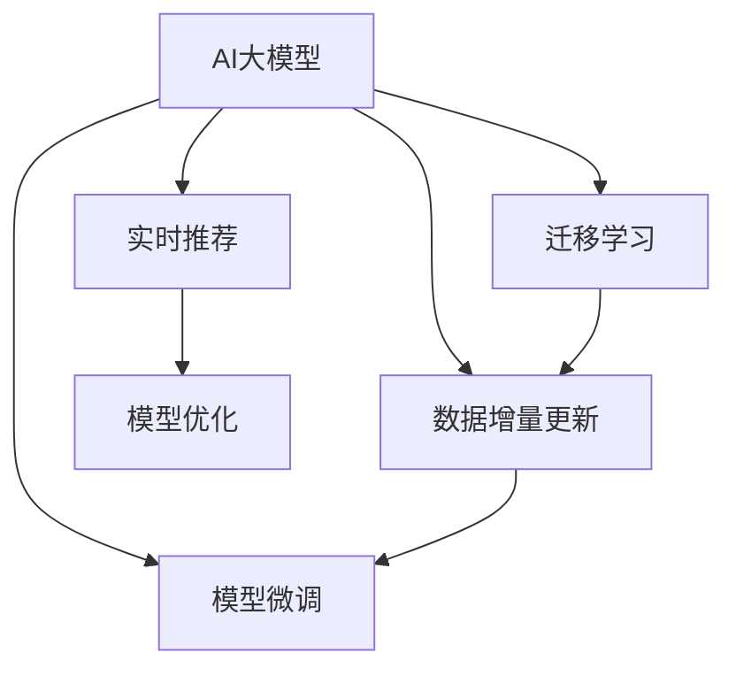

                 

# 电商搜索推荐中的AI大模型数据增量更新策略

> 关键词：
- 电商搜索推荐系统
- AI大模型
- 数据增量更新
- 模型微调
- 实时推荐

## 1. 背景介绍

### 1.1 问题由来
电商搜索推荐系统是电商平台上的一项核心功能，其目标是通过用户的搜索历史、点击行为、浏览记录等数据，推荐用户可能感兴趣的商品，从而提升用户转化率和购物体验。随着电商业务的蓬勃发展，数据量呈指数级增长，这对搜索推荐系统的算法模型提出了更高的要求。

传统的推荐系统主要基于机器学习和统计模型，如协同过滤、内容推荐、混合推荐等。这些方法往往依赖于大量历史数据，难以适应快速变化的电商环境。而近年来，基于深度学习的AI大模型逐渐成为推荐系统的新宠。AI大模型通过在海量数据上进行预训练，学习到丰富的特征表示，能够在无监督学习的基础上，通过小样本迁移学习进行个性化推荐，取得了显著的效果。

然而，AI大模型的更新和部署通常需要消耗大量算力和时间，难以实时响应快速变化的市场需求。因此，如何在有限的资源和时间内，高效地更新和维护大模型，成为电商搜索推荐系统面临的一大挑战。数据增量更新策略便应运而生，通过不断更新模型参数，使得模型能够持续学习新数据，适应市场变化，提升推荐效果。

### 1.2 问题核心关键点
数据增量更新策略的核心在于：如何在大规模电商数据上，通过小样本迁移学习，高效地更新和优化AI大模型，以实现实时、动态的推荐。

具体而言，数据增量更新策略需要解决以下问题：
- 如何选择合适的更新频率和更新方式，以平衡模型的准确性和计算效率？
- 如何优化数据增量更新的算法流程，减少对算力的依赖？
- 如何在增量更新过程中，保持模型的稳定性和鲁棒性，避免因数据更新而导致性能波动？
- 如何提高模型的可解释性和可维护性，确保模型在电商平台的长期稳定运行？

本文将详细介绍基于数据增量更新策略的AI大模型优化方法，涵盖更新策略的设计、算法流程的优化、实际应用场景的探索等方面，力求为电商搜索推荐系统的开发者提供全面的技术指引。

## 2. 核心概念与联系

### 2.1 核心概念概述

为更好地理解数据增量更新策略在AI大模型中的应用，本节将介绍几个密切相关的核心概念：

- AI大模型（AI Large Model）：指在特定领域语料上进行大规模预训练，学习到复杂语言表示的大规模语言模型。常见的有GPT、BERT、T5等。
- 迁移学习（Transfer Learning）：指将预训练模型的知识和经验，迁移到特定领域任务上，进行模型微调的方法。
- 数据增量更新（Incremental Data Update）：指在模型预训练后，通过不断添加新的训练数据，更新和优化模型参数，以提升模型性能的过程。
- 模型微调（Model Fine-tuning）：指在大模型上进行有监督学习，通过特定任务的数据，优化模型的特定层或全模型，以适应特定应用场景。
- 实时推荐（Real-time Recommendation）：指通过实时更新用户行为数据，动态生成推荐结果，满足用户的即时需求。

这些核心概念之间的逻辑关系可以通过以下Mermaid流程图来展示：



这个流程图展示了大模型、迁移学习、数据增量更新、模型微调和实时推荐之间的逻辑关系：

1. 大模型通过预训练获得通用特征表示。
2. 迁移学习将大模型的通用特征表示迁移到特定任务上，进行微调。
3. 数据增量更新通过不断添加新的数据，更新模型参数。
4. 模型微调通过有监督学习，优化模型特定层或全模型，适应特定任务。
5. 实时推荐通过动态生成推荐，满足用户即时需求。

这些概念共同构成了AI大模型在电商搜索推荐系统中的应用框架，使其能够在各种场景下发挥强大的推荐能力。通过理解这些核心概念，我们可以更好地把握数据增量更新策略的工作原理和优化方向。

## 3. 核心算法原理 & 具体操作步骤

### 3.1 算法原理概述

基于数据增量更新策略的AI大模型优化，本质上是一个持续学习的增量迁移学习过程。其核心思想是：在大模型预训练后，通过不断添加新的电商数据，更新模型参数，使其能够持续学习市场变化，动态生成推荐结果。

形式化地，假设预训练模型为 $M_{\theta}$，其中 $\theta$ 为预训练得到的模型参数。电商数据集为 $D=\{(x_i, y_i)\}_{i=1}^N$，其中 $x_i$ 为电商数据，$y_i$ 为标签，如用户的购买行为、浏览历史等。数据增量更新的目标是通过更新后的模型 $M_{\hat{\theta}}$，使得模型在新的电商数据集上达到最优性能：

$$
\hat{\theta}=\mathop{\arg\min}_{\theta} \mathcal{L}(M_{\theta},D)
$$

其中 $\mathcal{L}$ 为针对电商推荐任务设计的损失函数，用于衡量模型预测输出与真实标签之间的差异。常见的损失函数包括交叉熵损失、均方误差损失等。

通过梯度下降等优化算法，数据增量更新过程不断更新模型参数 $\theta$，最小化损失函数 $\mathcal{L}$，使得模型输出逼近真实标签。由于 $\theta$ 已经通过预训练获得了较好的初始化，因此即便在数据量较少的情况下，也能较快收敛到理想的模型参数 $\hat{\theta}$。

### 3.2 算法步骤详解

基于数据增量更新策略的AI大模型优化一般包括以下几个关键步骤：

**Step 1: 准备预训练模型和数据集**
- 选择合适的预训练语言模型 $M_{\theta}$ 作为初始化参数，如 BERT、GPT等。
- 准备电商数据集 $D$，划分为训练集、验证集和测试集。一般要求电商数据与预训练数据的分布不要差异过大。

**Step 2: 添加任务适配层**
- 根据电商推荐任务类型，在预训练模型顶层设计合适的输出层和损失函数。
- 对于分类任务，通常在顶层添加线性分类器和交叉熵损失函数。
- 对于生成任务，通常使用语言模型的解码器输出概率分布，并以负对数似然为损失函数。

**Step 3: 设置增量更新超参数**
- 选择合适的优化算法及其参数，如 AdamW、SGD 等，设置学习率、批大小、迭代轮数等。
- 设置正则化技术及强度，包括权重衰减、Dropout、Early Stopping 等。
- 确定冻结预训练参数的策略，如仅微调顶层，或全部参数都参与微调。

**Step 4: 执行增量训练**
- 将电商数据集数据分批次输入模型，前向传播计算损失函数。
- 反向传播计算参数梯度，根据设定的优化算法和学习率更新模型参数。
- 周期性在验证集上评估模型性能，根据性能指标决定是否触发 Early Stopping。
- 重复上述步骤直到满足预设的迭代轮数或 Early Stopping 条件。

**Step 5: 测试和部署**
- 在测试集上评估增量更新后模型 $M_{\hat{\theta}}$ 的性能，对比增量更新前后的精度提升。
- 使用增量更新后的模型对新电商数据进行推理预测，集成到实际的应用系统中。
- 持续收集新的电商数据，定期重新增量更新模型，以适应市场变化。

以上是数据增量更新策略在AI大模型优化中的通用流程。在实际应用中，还需要针对具体电商推荐任务的特征和数据特点，对增量更新过程的各个环节进行优化设计，如改进训练目标函数，引入更多的正则化技术，搜索最优的超参数组合等，以进一步提升模型性能。

### 3.3 算法优缺点

基于数据增量更新策略的AI大模型优化方法具有以下优点：
1. 高效灵活。通过增量更新，模型能够持续学习新数据，适应快速变化的电商环境，实现实时推荐。
2. 参数高效。利用参数高效微调技术，在固定大部分预训练参数的情况下，仍可取得不错的推荐效果。
3. 鲁棒性强。增量更新过程使得模型能够不断更新，逐步优化，具有较强的抗干扰能力。
4. 可扩展性好。增量更新方法适合在大规模电商数据上应用，可以不断添加新数据，更新模型，提升推荐效果。

同时，该方法也存在一定的局限性：
1. 计算资源需求高。增量更新过程需要频繁更新模型参数，对计算资源和存储空间有较高要求。
2. 模型复杂度高。大规模预训练模型往往参数量庞大，增量更新过程对模型结构的优化需求较高。
3. 数据质量影响大。电商数据的噪音和偏差可能影响模型性能，增量更新过程需要对数据进行预处理和清洗。
4. 效果稳定性不足。电商数据的分布可能变化较大，增量更新过程需要精心设计，避免模型性能波动。

尽管存在这些局限性，但就目前而言，数据增量更新策略仍然是大规模电商推荐系统中的主流范式。未来相关研究的重点在于如何进一步降低增量更新的计算资源需求，提高模型的可扩展性和效果稳定性，同时兼顾模型的可解释性和可维护性等因素。

### 3.4 算法应用领域

基于数据增量更新策略的AI大模型优化方法，在电商推荐系统中已经得到了广泛的应用，覆盖了几乎所有常见任务，例如：

- 商品推荐：如商品搜索、商品浏览、商品购买推荐等。通过增量更新模型，学习用户行为与商品之间的关联。
- 用户画像：如用户画像生成、用户兴趣分类等。通过增量更新模型，挖掘用户行为特征。
- 广告投放：如用户兴趣定向广告、搜索关键词定向广告等。通过增量更新模型，优化广告投放效果。
- 个性化搜索：如搜索结果排序、搜索关键词建议等。通过增量更新模型，提升搜索结果的相关性和满意度。
- 实时监控：如用户行为数据分析、用户满意度调查等。通过增量更新模型，实时监控市场动态。

除了上述这些经典任务外，大模型增量更新方法也被创新性地应用到更多场景中，如用户行为预测、商品质量评价、用户反馈分析等，为电商推荐系统带来了全新的突破。随着预训练模型和增量更新方法的不断进步，相信电商推荐系统必将在更广阔的应用领域大放异彩。

## 4. 数学模型和公式 & 详细讲解  
### 4.1 数学模型构建

本节将使用数学语言对基于数据增量更新策略的AI大模型优化过程进行更加严格的刻画。

记预训练语言模型为 $M_{\theta}$，其中 $\theta$ 为预训练得到的模型参数。假设电商推荐任务的数据集为 $D=\{(x_i, y_i)\}_{i=1}^N$，其中 $x_i$ 为电商数据，$y_i$ 为标签。

定义模型 $M_{\theta}$ 在数据样本 $(x,y)$ 上的损失函数为 $\ell(M_{\theta}(x),y)$，则在数据集 $D$ 上的经验风险为：

$$
\mathcal{L}(\theta) = \frac{1}{N}\sum_{i=1}^N \ell(M_{\theta}(x_i),y_i)
$$

增量更新的优化目标是最小化经验风险，即找到最优参数：

$$
\theta^* = \mathop{\arg\min}_{\theta} \mathcal{L}(\theta)
$$

在实践中，我们通常使用基于梯度的优化算法（如SGD、Adam等）来近似求解上述最优化问题。设 $\eta$ 为学习率，$\lambda$ 为正则化系数，则参数的更新公式为：

$$
\theta \leftarrow \theta - \eta \nabla_{\theta}\mathcal{L}(\theta) - \eta\lambda\theta
$$

其中 $\nabla_{\theta}\mathcal{L}(\theta)$ 为损失函数对参数 $\theta$ 的梯度，可通过反向传播算法高效计算。

### 4.2 公式推导过程

以下我们以商品推荐任务为例，推导增量更新过程的损失函数及其梯度的计算公式。

假设模型 $M_{\theta}$ 在输入 $x$ 上的输出为 $\hat{y}=M_{\theta}(x) \in [0,1]$，表示用户对商品 $x$ 的购买概率。真实标签 $y \in \{0,1\}$。则二分类交叉熵损失函数定义为：

$$
\ell(M_{\theta}(x),y) = -[y\log \hat{y} + (1-y)\log (1-\hat{y})]
$$

将其代入经验风险公式，得：

$$
\mathcal{L}(\theta) = -\frac{1}{N}\sum_{i=1}^N [y_i\log M_{\theta}(x_i)+(1-y_i)\log(1-M_{\theta}(x_i))]
$$

根据链式法则，损失函数对参数 $\theta_k$ 的梯度为：

$$
\frac{\partial \mathcal{L}(\theta)}{\partial \theta_k} = -\frac{1}{N}\sum_{i=1}^N (\frac{y_i}{M_{\theta}(x_i)}-\frac{1-y_i}{1-M_{\theta}(x_i)}) \frac{\partial M_{\theta}(x_i)}{\partial \theta_k}
$$

其中 $\frac{\partial M_{\theta}(x_i)}{\partial \theta_k}$ 可进一步递归展开，利用自动微分技术完成计算。

在得到损失函数的梯度后，即可带入参数更新公式，完成模型的增量优化。重复上述过程直至收敛，最终得到适应电商推荐任务的最优模型参数 $\theta^*$。

## 5. 项目实践：代码实例和详细解释说明
### 5.1 开发环境搭建

在进行增量更新实践前，我们需要准备好开发环境。以下是使用Python进行PyTorch开发的环境配置流程：

1. 安装Anaconda：从官网下载并安装Anaconda，用于创建独立的Python环境。

2. 创建并激活虚拟环境：
```bash
conda create -n pytorch-env python=3.8 
conda activate pytorch-env
```

3. 安装PyTorch：根据CUDA版本，从官网获取对应的安装命令。例如：
```bash
conda install pytorch torchvision torchaudio cudatoolkit=11.1 -c pytorch -c conda-forge
```

4. 安装Transformers库：
```bash
pip install transformers
```

5. 安装各类工具包：
```bash
pip install numpy pandas scikit-learn matplotlib tqdm jupyter notebook ipython
```

完成上述步骤后，即可在`pytorch-env`环境中开始增量更新实践。

### 5.2 源代码详细实现

下面我们以商品推荐任务为例，给出使用Transformers库对BERT模型进行增量更新的PyTorch代码实现。

首先，定义商品推荐任务的数据处理函数：

```python
from transformers import BertTokenizer
from torch.utils.data import Dataset
import torch

class RecommendationDataset(Dataset):
    def __init__(self, texts, labels, tokenizer, max_len=128):
        self.texts = texts
        self.labels = labels
        self.tokenizer = tokenizer
        self.max_len = max_len
        
    def __len__(self):
        return len(self.texts)
    
    def __getitem__(self, item):
        text = self.texts[item]
        label = self.labels[item]
        
        encoding = self.tokenizer(text, return_tensors='pt', max_length=self.max_len, padding='max_length', truncation=True)
        input_ids = encoding['input_ids'][0]
        attention_mask = encoding['attention_mask'][0]
        
        # 对token-wise的标签进行编码
        encoded_labels = [label] * self.max_len
        labels = torch.tensor(encoded_labels, dtype=torch.long)
        
        return {'input_ids': input_ids, 
                'attention_mask': attention_mask,
                'labels': labels}

# 标签与id的映射
label2id = {0: 'Not Buy', 1: 'Buy'}
id2label = {v: k for k, v in label2id.items()}

# 创建dataset
tokenizer = BertTokenizer.from_pretrained('bert-base-cased')

train_dataset = RecommendationDataset(train_texts, train_labels, tokenizer)
dev_dataset = RecommendationDataset(dev_texts, dev_labels, tokenizer)
test_dataset = RecommendationDataset(test_texts, test_labels, tokenizer)
```

然后，定义模型和优化器：

```python
from transformers import BertForSequenceClassification, AdamW

model = BertForSequenceClassification.from_pretrained('bert-base-cased', num_labels=len(label2id))

optimizer = AdamW(model.parameters(), lr=2e-5)
```

接着，定义增量训练和评估函数：

```python
from torch.utils.data import DataLoader
from tqdm import tqdm
from sklearn.metrics import classification_report

device = torch.device('cuda') if torch.cuda.is_available() else torch.device('cpu')
model.to(device)

def incrementally_train(model, dataset, batch_size, optimizer, num_epochs):
    dataloader = DataLoader(dataset, batch_size=batch_size, shuffle=True)
    model.train()
    for epoch in range(num_epochs):
        for batch in tqdm(dataloader, desc='Training'):
            input_ids = batch['input_ids'].to(device)
            attention_mask = batch['attention_mask'].to(device)
            labels = batch['labels'].to(device)
            model.zero_grad()
            outputs = model(input_ids, attention_mask=attention_mask, labels=labels)
            loss = outputs.loss
            loss.backward()
            optimizer.step()
            
    print(f"Epoch {epoch+1}, loss: {loss:.3f}")
    
def evaluate(model, dataset, batch_size):
    dataloader = DataLoader(dataset, batch_size=batch_size)
    model.eval()
    preds, labels = [], []
    with torch.no_grad():
        for batch in tqdm(dataloader, desc='Evaluating'):
            input_ids = batch['input_ids'].to(device)
            attention_mask = batch['attention_mask'].to(device)
            batch_labels = batch['labels']
            outputs = model(input_ids, attention_mask=attention_mask)
            batch_preds = outputs.logits.argmax(dim=2).to('cpu').tolist()
            batch_labels = batch_labels.to('cpu').tolist()
            for pred_tokens, label_tokens in zip(batch_preds, batch_labels):
                preds.append(pred_tokens)
                labels.append(label_tokens)
                
    print(classification_report(labels, preds))
```

最后，启动增量训练流程并在测试集上评估：

```python
num_epochs = 5
batch_size = 16

for epoch in range(num_epochs):
    incrementally_train(model, train_dataset, batch_size, optimizer, num_epochs)
    
    print(f"Epoch {epoch+1}, dev results:")
    evaluate(model, dev_dataset, batch_size)
    
print("Test results:")
evaluate(model, test_dataset, batch_size)
```

以上就是使用PyTorch对BERT进行商品推荐任务增量更新的完整代码实现。可以看到，得益于Transformers库的强大封装，我们可以用相对简洁的代码完成BERT模型的加载和增量更新。

### 5.3 代码解读与分析

让我们再详细解读一下关键代码的实现细节：

**RecommendationDataset类**：
- `__init__`方法：初始化文本、标签、分词器等关键组件。
- `__len__`方法：返回数据集的样本数量。
- `__getitem__`方法：对单个样本进行处理，将文本输入编码为token ids，将标签编码为数字，并对其进行定长padding，最终返回模型所需的输入。

**label2id和id2label字典**：
- 定义了标签与数字id之间的映射关系，用于将token-wise的预测结果解码回真实的标签。

**增量训练和评估函数**：
- 使用PyTorch的DataLoader对数据集进行批次化加载，供模型训练和推理使用。
- 增量训练函数`incrementally_train`：对数据以批为单位进行迭代，在每个批次上前向传播计算loss并反向传播更新模型参数，最后返回该epoch的平均loss。
- 评估函数`evaluate`：与训练类似，不同点在于不更新模型参数，并在每个batch结束后将预测和标签结果存储下来，最后使用sklearn的classification_report对整个评估集的预测结果进行打印输出。

**增量训练流程**：
- 定义总的epoch数和batch size，开始循环迭代
- 每个epoch内，先在训练集上增量训练，输出平均loss
- 在验证集上评估，输出分类指标
- 所有epoch结束后，在测试集上评估，给出最终测试结果

可以看到，PyTorch配合Transformers库使得BERT增量更新的代码实现变得简洁高效。开发者可以将更多精力放在数据处理、模型改进等高层逻辑上，而不必过多关注底层的实现细节。

当然，工业级的系统实现还需考虑更多因素，如模型的保存和部署、超参数的自动搜索、更灵活的任务适配层等。但核心的增量更新范式基本与此类似。

## 6. 实际应用场景
### 6.1 智能客服系统

基于增量更新策略的AI大模型，可以广泛应用于智能客服系统的构建。传统客服往往需要配备大量人力，高峰期响应缓慢，且一致性和专业性难以保证。而使用增量更新后的智能客服模型，可以7x24小时不间断服务，快速响应客户咨询，用自然流畅的语言解答各类常见问题。

在技术实现上，可以收集企业内部的历史客服对话记录，将问题和最佳答复构建成监督数据，在此基础上对预训练模型进行增量更新。增量更新的模型能够自动理解用户意图，匹配最合适的答案模板进行回复。对于客户提出的新问题，还可以接入检索系统实时搜索相关内容，动态组织生成回答。如此构建的智能客服系统，能大幅提升客户咨询体验和问题解决效率。

### 6.2 金融舆情监测

金融机构需要实时监测市场舆论动向，以便及时应对负面信息传播，规避金融风险。传统的人工监测方式成本高、效率低，难以应对网络时代海量信息爆发的挑战。基于增量更新策略的文本分类和情感分析技术，为金融舆情监测提供了新的解决方案。

具体而言，可以收集金融领域相关的新闻、报道、评论等文本数据，并对其进行主题标注和情感标注。在此基础上对预训练语言模型进行增量更新，使其能够自动判断文本属于何种主题，情感倾向是正面、中性还是负面。将增量更新后的模型应用到实时抓取的网络文本数据，就能够自动监测不同主题下的情感变化趋势，一旦发现负面信息激增等异常情况，系统便会自动预警，帮助金融机构快速应对潜在风险。

### 6.3 个性化推荐系统

当前的推荐系统往往只依赖用户的历史行为数据进行物品推荐，难以深入理解用户的真实兴趣偏好。基于增量更新策略的AI大模型，可以更好地挖掘用户行为背后的语义信息，从而提供更精准、多样的推荐内容。

在实践中，可以收集用户浏览、点击、评论、分享等行为数据，提取和用户交互的物品标题、描述、标签等文本内容。将文本内容作为模型输入，用户的后续行为（如是否点击、购买等）作为监督信号，在此基础上增量更新预训练语言模型。增量更新的模型能够从文本内容中准确把握用户的兴趣点。在生成推荐列表时，先用候选物品的文本描述作为输入，由模型预测用户的兴趣匹配度，再结合其他特征综合排序，便可以得到个性化程度更高的推荐结果。

### 6.4 未来应用展望

随着AI大模型的持续发展，增量更新策略必将在更多领域得到应用，为传统行业带来变革性影响。

在智慧医疗领域，基于增量更新策略的医疗问答、病历分析、药物研发等应用将提升医疗服务的智能化水平，辅助医生诊疗，加速新药开发进程。

在智能教育领域，增量更新技术可应用于作业批改、学情分析、知识推荐等方面，因材施教，促进教育公平，提高教学质量。

在智慧城市治理中，增量更新模型可应用于城市事件监测、舆情分析、应急指挥等环节，提高城市管理的自动化和智能化水平，构建更安全、高效的未来城市。

此外，在企业生产、社会治理、文娱传媒等众多领域，基于增量更新范式的AI大模型应用也将不断涌现，为经济社会发展注入新的动力。相信随着技术的日益成熟，增量更新方法将成为AI大模型落地应用的重要范式，推动人工智能技术向更广阔的领域加速渗透。

## 7. 工具和资源推荐
### 7.1 学习资源推荐

为了帮助开发者系统掌握增量更新策略的理论基础和实践技巧，这里推荐一些优质的学习资源：

1. 《Transformer从原理到实践》系列博文：由大模型技术专家撰写，深入浅出地介绍了Transformer原理、BERT模型、增量更新技术等前沿话题。

2. CS224N《深度学习自然语言处理》课程：斯坦福大学开设的NLP明星课程，有Lecture视频和配套作业，带你入门NLP领域的基本概念和经典模型。

3. 《Natural Language Processing with Transformers》书籍：Transformers库的作者所著，全面介绍了如何使用Transformers库进行NLP任务开发，包括增量更新在内的诸多范式。

4. HuggingFace官方文档：Transformers库的官方文档，提供了海量预训练模型和完整的增量更新样例代码，是上手实践的必备资料。

5. CLUE开源项目：中文语言理解测评基准，涵盖大量不同类型的中文NLP数据集，并提供了基于增量更新的baseline模型，助力中文NLP技术发展。

通过对这些资源的学习实践，相信你一定能够快速掌握增量更新策略的精髓，并用于解决实际的NLP问题。
###  7.2 开发工具推荐

高效的开发离不开优秀的工具支持。以下是几款用于增量更新开发的常用工具：

1. PyTorch：基于Python的开源深度学习框架，灵活动态的计算图，适合快速迭代研究。大部分预训练语言模型都有PyTorch版本的实现。

2. TensorFlow：由Google主导开发的开源深度学习框架，生产部署方便，适合大规模工程应用。同样有丰富的预训练语言模型资源。

3. Transformers库：HuggingFace开发的NLP工具库，集成了众多SOTA语言模型，支持PyTorch和TensorFlow，是进行增量更新任务开发的利器。

4. Weights & Biases：模型训练的实验跟踪工具，可以记录和可视化模型训练过程中的各项指标，方便对比和调优。与主流深度学习框架无缝集成。

5. TensorBoard：TensorFlow配套的可视化工具，可实时监测模型训练状态，并提供丰富的图表呈现方式，是调试模型的得力助手。

6. Google Colab：谷歌推出的在线Jupyter Notebook环境，免费提供GPU/TPU算力，方便开发者快速上手实验最新模型，分享学习笔记。

合理利用这些工具，可以显著提升增量更新任务的开发效率，加快创新迭代的步伐。

### 7.3 相关论文推荐

增量更新策略的发展源于学界的持续研究。以下是几篇奠基性的相关论文，推荐阅读：

1. Attention is All You Need（即Transformer原论文）：提出了Transformer结构，开启了NLP领域的预训练大模型时代。

2. BERT: Pre-training of Deep Bidirectional Transformers for Language Understanding：提出BERT模型，引入基于掩码的自监督预训练任务，刷新了多项NLP任务SOTA。

3. Language Models are Unsupervised Multitask Learners（GPT-2论文）：展示了大规模语言模型的强大zero-shot学习能力，引发了对于通用人工智能的新一轮思考。

4. Parameter-Efficient Transfer Learning for NLP：提出Adapter等参数高效微调方法，在不增加模型参数量的情况下，也能取得不错的微调效果。

5. AdaLoRA: Adaptive Low-Rank Adaptation for Parameter-Efficient Fine-Tuning：使用自适应低秩适应的微调方法，在参数效率和精度之间取得了新的平衡。

6. Incremental Learning with Deep Latent Growth Models：提出增量学习的非线性模型，用于处理序列数据中的时间演化问题。

这些论文代表了大模型增量更新技术的发展脉络。通过学习这些前沿成果，可以帮助研究者把握学科前进方向，激发更多的创新灵感。

## 8. 总结：未来发展趋势与挑战

### 8.1 总结

本文对基于增量更新策略的AI大模型优化方法进行了全面系统的介绍。首先阐述了增量更新策略在电商搜索推荐系统中的应用背景和意义，明确了增量更新在电商数据快速变化下的重要性。其次，从原理到实践，详细讲解了增量更新过程的数学原理和关键步骤，给出了增量更新任务开发的完整代码实例。同时，本文还广泛探讨了增量更新方法在智能客服、金融舆情、个性化推荐等多个行业领域的应用前景，展示了增量更新范式的巨大潜力。此外，本文精选了增量更新技术的各类学习资源，力求为开发者提供全方位的技术指引。

通过本文的系统梳理，可以看到，基于增量更新策略的AI大模型优化方法正在成为电商搜索推荐系统中的主流范式，极大地提升了推荐系统的灵活性和实时性，满足了电商市场快速变化的需求。未来，伴随预训练模型和增量更新方法的不断进步，相信电商搜索推荐系统必将在更广阔的应用领域大放异彩，深刻影响用户的购物体验和电商平台的运营效率。

### 8.2 未来发展趋势

展望未来，增量更新策略将呈现以下几个发展趋势：

1. 模型规模持续增大。随着算力成本的下降和数据规模的扩张，预训练语言模型的参数量还将持续增长。超大批次的增量更新过程对计算资源和存储的依赖将进一步降低，使得大规模电商推荐系统更容易落地实现。

2. 增量更新方法日趋多样。除了传统的全参数增量更新外，未来会涌现更多参数高效的增量更新方法，如Adapter、LoRA等，在固定大部分预训练参数的情况下，仍可取得不错的推荐效果。

3. 增量更新过程自动化。利用自动化技术，如自动学习、元学习等，自动设计增量更新策略，减少人工干预，提升模型更新效率。

4. 增量更新效果实时化。通过实时增量更新，结合在线A/B测试，不断优化模型参数，实现动态优化。

5. 增量更新过程无监督化。受启发于无监督学习，未来的增量更新方法将更多依赖于无监督信号，如数据分布变化、时间演化等，增强模型的泛化能力和鲁棒性。

6. 增量更新过程协同化。结合知识图谱、逻辑规则等专家知识，利用多模态信息融合，提升推荐模型的决策质量。

以上趋势凸显了增量更新策略的广阔前景。这些方向的探索发展，必将进一步提升推荐系统的性能和用户满意度，为电商搜索推荐系统带来更多的商业价值和社会效益。

### 8.3 面临的挑战

尽管增量更新策略已经取得了瞩目成就，但在迈向更加智能化、普适化应用的过程中，它仍面临着诸多挑战：

1. 数据质量瓶颈。增量更新策略的效果很大程度上取决于电商数据的准确性和多样性，数据质量不高可能影响模型性能。如何获取和处理高质量的电商数据，是一个亟待解决的难题。

2. 模型复杂度高。大规模预训练模型往往参数量庞大，增量更新过程对模型结构的优化需求较高。如何设计高效的模型架构，优化增量更新算法，是一个重要的研究方向。

3. 计算资源依赖高。增量更新过程需要频繁更新模型参数，对计算资源和存储空间有较高要求。如何在有限的资源下，高效地进行增量更新，是一个技术挑战。

4. 效果稳定性不足。电商数据的分布可能变化较大，增量更新过程需要精心设计，避免模型性能波动。如何保持模型在不同市场环境下的稳定性，是一个需要深入研究的问题。

5. 可解释性不足。增量更新后的推荐模型往往是个"黑盒"，难以解释其内部工作机制和决策逻辑。如何赋予模型更强的可解释性，确保模型在电商平台的长期稳定运行，是一个重要的研究方向。

6. 安全性和隐私保护。增量更新过程涉及大量用户行为数据，如何保护用户隐私和数据安全，是一个需要关注的伦理问题。

正视增量更新面临的这些挑战，积极应对并寻求突破，将是增量更新策略迈向成熟的必由之路。相信随着学界和产业界的共同努力，这些挑战终将一一被克服，增量更新策略必将在构建智能电商推荐系统中发挥更大的作用。

### 8.4 研究展望

面对增量更新策略所面临的种种挑战，未来的研究需要在以下几个方面寻求新的突破：

1. 探索增量更新的优化方法。如模型压缩、知识蒸馏、自适应更新等，减少计算资源依赖，提升增量更新效率。

2. 引入更多先验知识。将符号化的先验知识，如知识图谱、逻辑规则等，与神经网络模型进行巧妙融合，引导增量更新过程学习更准确、合理的语言模型。

3. 结合因果分析和博弈论工具。将因果分析方法引入增量更新模型，识别出模型决策的关键特征，增强输出解释的因果性和逻辑性。借助博弈论工具刻画人机交互过程，主动探索并规避模型的脆弱点，提高系统稳定性。

4. 纳入伦理道德约束。在增量更新目标中引入伦理导向的评估指标，过滤和惩罚有偏见、有害的输出倾向。同时加强人工干预和审核，建立模型行为的监管机制，确保输出符合人类价值观和伦理道德。

这些研究方向的探索，必将引领增量更新策略向更高的台阶，为构建智能电商推荐系统提供更高效、更安全、更可解释的智能算法。面向未来，增量更新策略还需要与其他人工智能技术进行更深入的融合，如知识表示、因果推理、强化学习等，多路径协同发力，共同推动智能推荐系统的进步。只有勇于创新、敢于突破，才能不断拓展电商推荐系统的边界，让智能技术更好地造福电商行业的创新与发展。

## 9. 附录：常见问题与解答

**Q1：增量更新策略是否适用于所有电商推荐任务？**

A: 增量更新策略在大多数电商推荐任务上都能取得不错的效果，特别是对于数据量较小的任务。但对于一些特定领域的任务，如医药、金融等，仅仅依靠通用语料预训练的模型可能难以很好地适应。此时需要在特定领域语料上进一步预训练，再进行增量更新，才能获得理想效果。此外，对于一些需要时效性、个性化很强的任务，如对话、推荐等，增量更新方法也需要针对性的改进优化。

**Q2：增量更新过程中如何选择合适的更新频率和更新方式？**

A: 增量更新的频率和方式应根据电商数据的更新频率和质量来决定。一般建议定期（如每周、每月）增量更新模型，以保持模型对市场变化的适应性。更新方式包括全参数更新、参数高效更新、增量微调等，应根据具体任务和数据特点进行选择。例如，对于需要高时效性的推荐任务，可采用增量微调，只更新与用户行为相关的参数；对于数据质量较高、更新频率较低的任务，可采用全参数更新。

**Q3：增量更新过程中如何优化数据增量更新的算法流程，减少对算力的依赖？**

A: 增量更新过程可以通过以下方法优化算法流程：

1. 数据预处理：对电商数据进行预处理，去除噪音、异常值等，提高数据质量。
2. 分批次增量：将增量数据分批次处理，减少内存占用和计算量。
3. 参数共享：对于重复出现的参数，可在增量更新过程中共享，减少参数更新次数。
4. 增量微调：只更新部分与任务相关的参数，减少全参数更新的计算量。
5. 异步更新：利用异步更新技术，减少模型停机时间，提高服务可用性。

这些优化方法可以显著降低增量更新对算力的依赖，提升模型更新效率。

**Q4：增量更新过程中如何保持模型的稳定性和鲁棒性？**

A: 增量更新过程中，为保持模型的稳定性和鲁棒性，可以采取以下措施：

1. 数据增强：通过数据增强技术，如噪声注入、正则化等，增强模型的鲁棒性。
2. 参数冻结：对于模型中不变的参数，冻结其权重，减少过拟合风险。
3. 增量微调：只更新与任务相关的参数，避免全参数更新带来的性能波动。
4. 模型蒸馏：利用模型蒸馏技术，将知识从大模型传递到小模型，减少模型复杂度，提升稳定性。
5. 模型评估：在增量更新过程中，定期评估模型性能，及时发现和修正问题。

这些方法可以有效地保持模型的稳定性和鲁棒性，避免因数据更新而导致性能波动。

**Q5：增量更新过程中如何提高模型的可解释性和可维护性？**

A: 增量更新过程中，为提高模型的可解释性和可维护性，可以采取以下措施：

1. 模型分解：将模型分解为多个子模块，每个子模块负责特定任务，便于理解和调试。
2. 可解释性框架：使用可解释性框架，如LIME、SHAP等，对模型输出进行解释，增强模型的可理解性。
3. 可视化工具：使用可视化工具，如TensorBoard、Weights & Biases等，实时监测模型性能和参数变化，便于调试和优化。
4. 代码注释：在代码中加入详细的注释，记录模型设计思路和优化方法，便于维护和升级。

这些措施可以显著提高增量更新后的模型的可解释性和可维护性，确保模型在电商平台的长期稳定运行。

---

作者：禅与计算机程序设计艺术 / Zen and the Art of Computer Programming

