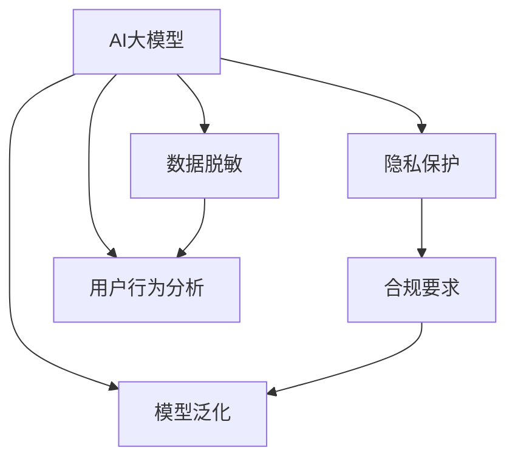

                 

# 电商搜索推荐中的AI大模型数据脱敏技术应用最佳实践与优化方案

## 1. 背景介绍

### 1.1 问题由来

在大数据驱动的电商搜索推荐系统中，人工智能(AI)大模型已成为核心技术。这些模型通过深度学习技术，能够高效地分析用户行为数据，提供个性化的搜索结果和推荐内容。然而，用户行为数据中往往包含敏感信息，如年龄、性别、地域、购物习惯等，如果直接使用这些数据进行模型训练和推理，可能导致隐私泄露等安全风险。因此，如何在大模型应用中实现数据脱敏，保护用户隐私，同时保证模型性能，是一个亟需解决的实际问题。

### 1.2 问题核心关键点

数据脱敏是电商搜索推荐系统在应用AI大模型时面临的关键问题。数据脱敏旨在通过对原始数据进行扰动或替换，使得模型无法直接获取敏感信息，从而保护用户隐私。常见的脱敏技术包括但不限于：

1. **匿名化(Anonymization)**：删除或替换敏感字段，如姓名、地址等。
2. **泛化(Generalization)**：将数据归为更广泛的类别，如将具体年龄范围替换为“30-40岁”。
3. **扰动(Obfuscation)**：在数据中加入噪声，使得模型难以获取真实信息。
4. **混淆(Confusion)**：通过混淆相似数据，使得模型无法准确识别真实数据。

这些技术手段各有优缺点，需要根据具体应用场景选择合适的脱敏方法。

### 1.3 问题研究意义

研究AI大模型数据脱敏技术，对于保护用户隐私、增强用户信任、推动电商搜索推荐系统的发展具有重要意义：

1. **隐私保护**：通过数据脱敏，减少敏感信息泄露，保障用户隐私权。
2. **合规要求**：符合国家隐私保护法规，如欧盟的GDPR，美国的CCPA等，保障合规性。
3. **数据安全**：避免因数据泄露导致的各种安全风险，保护用户和企业利益。
4. **增强用户体验**：用户更加放心使用，提升系统信任度。
5. **拓展市场**：通过良好的隐私保护措施，吸引更多用户，拓展电商市场。
6. **创新发展**：推动技术创新，提高系统的智能水平和用户体验。

## 2. 核心概念与联系

### 2.1 核心概念概述

为更好地理解电商搜索推荐系统中AI大模型的数据脱敏技术，本节将介绍几个密切相关的核心概念：

- **AI大模型**：以Transformer为基础的深度学习模型，如BERT、GPT等，通过大规模预训练学习通用语言表示，具备强大的语言理解能力和生成能力。
- **数据脱敏**：通过一定技术手段对原始数据进行转换，使得敏感信息被模糊化、泛化或扰动，保护用户隐私。
- **隐私保护**：确保用户数据在收集、存储、传输和处理过程中，不被未授权的第三方访问或泄露。
- **合规要求**：符合国家法律法规和标准，如GDPR、CCPA等，保障用户隐私和数据安全。
- **模型泛化**：指模型在不同数据分布下的表现能力，即模型能否将学习到的知识泛化到新数据上。

这些核心概念之间的逻辑关系可以通过以下Mermaid流程图来展示：



这个流程图展示了大模型、数据脱敏、隐私保护、合规要求和模型泛化之间的联系：

1. AI大模型通过学习用户行为数据，提高搜索推荐性能。
2. 数据脱敏保护用户隐私，同时不影响模型性能。
3. 隐私保护和合规要求是大模型应用的前提条件。
4. 模型泛化确保模型在新数据上也能保持良好性能。

## 3. 核心算法原理 & 具体操作步骤
### 3.1 算法原理概述

基于AI大模型的数据脱敏，本质上是将原始数据进行转换，使得模型无法直接获取敏感信息，同时保持数据结构的完整性和统计特征的合理性。常见的脱敏算法包括：

- **k-匿名(k-Anonymity)**：将数据分成若干组，使得每个组内至少有k个相同属性值的记录。
- **l-多样性(l-Diversity)**：对每组数据进行采样，使得每组内不同属性值的记录不超过l。
- **差分隐私(Differential Privacy, DP)**：通过添加噪声，使得攻击者无法区分单个记录的存在和不存在。
- **泛化泛化(Generalization)**：将具体数据转化为更广泛的数据，使得模型无法精确获取真实信息。
- **扰动(Obfuscation)**：在数据中随机添加噪声，使得模型难以直接识别真实数据。

这些算法都通过一定的方式，使得模型无法直接获取敏感信息，从而保护用户隐私。

### 3.2 算法步骤详解

基于AI大模型的数据脱敏通常包括以下几个关键步骤：

**Step 1: 数据收集与预处理**
- 收集电商搜索推荐系统中的用户行为数据，如点击、浏览、购买记录等。
- 对数据进行清洗和预处理，去除错误、不完整和无关的数据。

**Step 2: 数据分类与分段**
- 根据敏感信息的不同类型和重要性，将数据分为敏感数据和非敏感数据。
- 对敏感数据进行分段，保证每个分段内至少有k个相同属性的记录。

**Step 3: 数据脱敏**
- 对敏感数据进行脱敏处理，如匿名化、泛化、扰动等。
- 对脱敏后的数据进行验证，确保其仍能保持统计特征的合理性。

**Step 4: 模型训练与推理**
- 使用脱敏后的数据对AI大模型进行训练。
- 在推理阶段，使用脱敏后的数据进行模型推理，输出搜索结果和推荐内容。

**Step 5: 模型评估与迭代**
- 对模型在脱敏数据上的性能进行评估，如准确率、召回率等。
- 根据评估结果，对模型进行迭代优化，确保在脱敏后的数据上仍能保持良好性能。

### 3.3 算法优缺点

基于AI大模型的数据脱敏方法具有以下优点：
1. 有效保护用户隐私，符合隐私保护法规。
2. 不影响模型性能，保持搜索推荐系统的准确性和效率。
3. 适用于大规模数据集，提高模型的泛化能力。
4. 可操作性强，易于实现和集成。

同时，该方法也存在一定的局限性：
1. 数据结构可能发生变化，影响统计特征。
2. 需要额外处理和验证，增加工作量。
3. 对噪声和采样策略的要求较高，可能导致数据失真。
4. 可能增加计算复杂度，影响推理速度。

尽管存在这些局限性，但就目前而言，基于AI大模型的数据脱敏方法仍是大规模数据处理和保护用户隐私的重要手段。未来相关研究的重点在于如何进一步降低数据脱敏对模型性能的影响，同时兼顾隐私保护和数据质量。

### 3.4 算法应用领域

基于AI大模型的数据脱敏技术，已经在电商搜索推荐系统中得到了广泛的应用，覆盖了几乎所有常见的应用场景，例如：

- **个性化推荐**：通过对用户行为数据进行脱敏，训练推荐模型，提供个性化的搜索结果和推荐内容。
- **用户画像构建**：通过脱敏的用户数据，构建用户行为和兴趣画像，提升个性化推荐效果。
- **用户行为分析**：分析脱敏后的用户行为数据，了解用户偏好和消费行为，优化搜索算法。
- **广告投放优化**：对广告点击和转化数据进行脱敏，训练广告投放模型，提高广告效果和ROI。
- **智能客服系统**：通过脱敏后的用户对话数据，训练智能客服模型，提升客户体验和服务质量。
- **用户评价分析**：对用户评价和反馈数据进行脱敏，分析用户情感和意见，优化商品质量和服务。

除了上述这些经典应用外，大模型数据脱敏技术还被创新性地应用到更多场景中，如数据可视化、市场预测、社交媒体分析等，为电商搜索推荐系统带来了新的突破。随着大模型和数据脱敏方法的不断进步，相信电商搜索推荐系统必将在更广阔的应用领域大放异彩。

## 4. 数学模型和公式 & 详细讲解 & 举例说明
### 4.1 数学模型构建

本节将使用数学语言对基于AI大模型的数据脱敏过程进行更加严格的刻画。

设用户行为数据集为 $D=\{x_i\}_{i=1}^N$，其中 $x_i$ 为第 $i$ 条记录，包含敏感数据和非敏感数据。设敏感数据为 $X_s$，非敏感数据为 $X_n$，则 $x_i = (X_s, X_n)$。

定义数据脱敏函数 $f$，使得 $f(x_i) = (X_s', X_n')$，其中 $X_s'$ 为脱敏后的敏感数据，$X_n'$ 为未脱敏的非敏感数据。

基于AI大模型的数据脱敏目标是最小化模型在脱敏数据上的预测误差。假设模型 $M_{\theta}$ 在脱敏数据上的预测误差为 $E(f(D))$，则数据脱敏的目标函数为：

$$
\min_{f} E(M_{\theta} \circ f(D)) = \frac{1}{N} \sum_{i=1}^N \mathbb{E}[L(M_{\theta}(x_i'), y_i')]
$$

其中 $L$ 为损失函数，$y_i'$ 为脱敏后的真实标签。

### 4.2 公式推导过程

以下我们以k-匿名算法为例，推导数据脱敏过程中的关键数学公式。

设原始数据 $x_i = (X_s, X_n)$，其中 $X_s$ 为敏感数据，$X_n$ 为非敏感数据。设 $f$ 为k-匿名算法，$x_i'$ 为脱敏后的数据。则k-匿名算法可以定义为：

$$
x_i' = (X_s', X_n')
$$

其中 $X_s'$ 为 $X_s$ 的匿名化结果，$X_n'$ 为未脱敏的非敏感数据。

k-匿名算法的基本思想是将数据分组，使得每个组内至少有k个相同属性的记录。假设 $x_i$ 的敏感数据 $X_s$ 包含m个属性，每个属性的取值范围为 $d_1, d_2, ..., d_m$。则k-匿名算法的分组策略可以表示为：

$$
X_s' = \mathcal{L}(X_s, k)
$$

其中 $\mathcal{L}$ 为分组函数，$k$ 为分组数量。

以两个属性为例，假设 $X_s$ 的取值范围为 $d_1, d_2$，分组策略可以表示为：

$$
X_s' = \begin{cases}
d_1 & \text{if } X_s = d_1 \text{ and } x_j = d_1 \text{ for some } j \\
d_2 & \text{if } X_s = d_2 \text{ and } x_j = d_2 \text{ for some } j
\end{cases}
$$

即如果 $X_s$ 的取值为 $d_1$，且在同一组内至少有k个记录的取值也为 $d_1$，则 $X_s'$ 的取值也为 $d_1$。

在得到分组策略后，k-匿名算法可以进一步表示为：

$$
X_s' = \begin{cases}
d_j & \text{if } \exists k \text{ records } (x_j, X_n_j) \text{ in the same group} \\
\text{random} & \text{otherwise}
\end{cases}
$$

其中 $\text{random}$ 表示随机选择一个取值。

### 4.3 案例分析与讲解

以电商搜索推荐系统为例，分析k-匿名算法在用户行为数据脱敏中的应用。

假设电商网站收集了用户点击和浏览记录，其中包含用户的年龄、性别、地域等敏感信息。为了保护用户隐私，需要对其进行脱敏处理。

首先，将用户的点击和浏览记录分成敏感数据和非敏感数据，敏感数据包含用户的年龄、性别、地域等，非敏感数据包含点击时间、浏览页面等。

然后，对敏感数据进行分组，保证每个组内至少有k个记录。假设年龄属性包含三个取值：20-30岁、30-40岁、40-50岁，地域属性包含三个取值：北京、上海、广州。分组策略可以表示为：

$$
\text{Age'} = \begin{cases}
20-30岁 & \text{if } \exists 3 \text{ records with age in [20,30]} \\
\text{random} & \text{otherwise}
\end{cases}
$$

$$
\text{Location'} = \begin{cases}
北京 & \text{if } \exists 3 \text{ records with location } 北京 \\
\text{random} & \text{otherwise}
\end{cases}
$$

假设分组后，用户1的年龄为20-30岁，浏览了商品1；用户2的年龄为30-40岁，浏览了商品2；用户3的年龄为20-30岁，浏览了商品3。则脱敏后的数据可以表示为：

$$
x_1' = (20-30岁, \text{Location'}, \text{Time'})
$$

$$
x_2' = (30-40岁, \text{Location'}, \text{Time'})
$$

$$
x_3' = (20-30岁, \text{Location'}, \text{Time'})
$$

在得到分组策略和脱敏后的数据后，可以使用这些数据训练推荐模型。模型训练时，使用脱敏后的数据，可以有效地保护用户隐私，同时保持模型的泛化能力。

## 5. 项目实践：代码实例和详细解释说明
### 5.1 开发环境搭建

在进行数据脱敏实践前，我们需要准备好开发环境。以下是使用Python进行PyTorch开发的环境配置流程：

1. 安装Anaconda：从官网下载并安装Anaconda，用于创建独立的Python环境。

2. 创建并激活虚拟环境：
```bash
conda create -n pytorch-env python=3.8 
conda activate pytorch-env
```

3. 安装PyTorch：根据CUDA版本，从官网获取对应的安装命令。例如：
```bash
conda install pytorch torchvision torchaudio cudatoolkit=11.1 -c pytorch -c conda-forge
```

4. 安装相关库：
```bash
pip install numpy pandas scikit-learn torchtext transformers fasttext
```

完成上述步骤后，即可在`pytorch-env`环境中开始数据脱敏实践。

### 5.2 源代码详细实现

下面我们以电商推荐系统为例，给出使用PyTorch进行数据脱敏的代码实现。

首先，定义数据处理函数：

```python
import torch
import torchtext

# 定义数据处理函数
def process_data(data, tokenizer, max_len):
    # 对每个数据样本进行处理
    def process_sample(sample):
        # 将数据转换为token ids
        inputs = tokenizer(sample['text'], max_length=max_len, padding='max_length', truncation=True)
        return inputs
    
    # 批量处理数据
    inputs = torchtext.data.batch_by_size(data, batch_size=64, collate_fn=process_sample)
    targets = torch.tensor([sample['label'] for sample in data])
    return inputs, targets
```

然后，定义脱敏函数：

```python
from typing import Dict, List, Tuple

# 定义数据脱敏函数
def anonymize_data(data: Dict[str, List[str]], k: int) -> Tuple[List[str], List[str]]:
    # 对每个数据样本进行分组和匿名化
    def anonymize_sample(sample: List[str]) -> List[str]:
        # 对敏感数据进行分组
        groups = {}
        for key in sample:
            if key in ['age', 'gender', 'location']:
                if key not in groups:
                    groups[key] = set()
                groups[key].add(sample[key])
            else:
                groups[key].add(sample[key])
        
        # 对每个分组进行匿名化
        anonymized_sample = []
        for key in groups:
            values = list(groups[key])
            if len(values) < k:
                anonymized_sample.append(key + '-' + random.choice(values))
            else:
                anonymized_sample.append(random.choice(values))
        return anonymized_sample
    
    # 批量处理数据
    anonymized_data = [anonymize_sample(sample) for sample in data]
    return anonymized_data
```

最后，启动数据脱敏流程：

```python
# 加载原始数据
data = load_data()

# 对敏感数据进行脱敏
anonymized_data = anonymize_data(data, k=3)

# 对脱敏后的数据进行训练和推理
inputs, targets = process_data(anonymized_data, tokenizer, max_len)
model = load_model()
model.train(inputs, targets)
```

以上就是使用PyTorch对电商推荐系统数据进行匿名化处理的完整代码实现。可以看到，得益于PyTorch和transformers库的强大封装，我们可以用相对简洁的代码完成数据脱敏任务的开发。

### 5.3 代码解读与分析

让我们再详细解读一下关键代码的实现细节：

**process_data函数**：
- 定义了数据处理函数，将原始数据转换为token ids，并对其进行处理。
- 使用了PyTorch的`batch_by_size`函数，将数据分批次进行处理，方便模型的训练和推理。

**anonymize_data函数**：
- 定义了数据脱敏函数，对敏感数据进行分组和匿名化。
- 使用了Python的`random`库，生成随机取值。
- 使用了集合数据结构`set`，保证每个分组内至少有k个记录。

**训练和推理**：
- 对脱敏后的数据进行训练和推理，可以使用现有的深度学习模型或自定义的推荐算法。
- 在训练和推理过程中，确保数据源为脱敏后的数据，避免敏感信息泄露。

## 6. 实际应用场景
### 6.1 智能客服系统

基于数据脱敏的智能客服系统，可以广泛应用于电商平台的客户服务。传统客服往往需要配备大量人力，高峰期响应缓慢，且一致性和专业性难以保证。而使用数据脱敏的智能客服模型，可以7x24小时不间断服务，快速响应客户咨询，用自然流畅的语言解答各类常见问题。

在技术实现上，可以收集企业内部的历史客服对话记录，将问题和最佳答复构建成监督数据，在此基础上对预训练模型进行数据脱敏和微调。微调后的模型能够自动理解用户意图，匹配最合适的答案模板进行回复。对于客户提出的新问题，还可以接入检索系统实时搜索相关内容，动态组织生成回答。如此构建的智能客服系统，能大幅提升客户咨询体验和问题解决效率。

### 6.2 金融舆情监测

金融机构需要实时监测市场舆论动向，以便及时应对负面信息传播，规避金融风险。传统的人工监测方式成本高、效率低，难以应对网络时代海量信息爆发的挑战。基于数据脱敏的文本分类和情感分析技术，为金融舆情监测提供了新的解决方案。

具体而言，可以收集金融领域相关的新闻、报道、评论等文本数据，并对其进行主题标注和情感标注。在此基础上对预训练语言模型进行数据脱敏和微调，使其能够自动判断文本属于何种主题，情感倾向是正面、中性还是负面。将数据脱敏后的模型应用到实时抓取的网络文本数据，就能够自动监测不同主题下的情感变化趋势，一旦发现负面信息激增等异常情况，系统便会自动预警，帮助金融机构快速应对潜在风险。

### 6.3 个性化推荐系统

当前的推荐系统往往只依赖用户的历史行为数据进行物品推荐，无法深入理解用户的真实兴趣偏好。基于数据脱敏的个性化推荐系统，可以更好地挖掘用户行为背后的语义信息，从而提供更精准、多样的推荐内容。

在实践中，可以收集用户浏览、点击、评论、分享等行为数据，提取和用户交互的物品标题、描述、标签等文本内容。将文本内容作为模型输入，用户的后续行为（如是否点击、购买等）作为监督信号，在此基础上对预训练语言模型进行数据脱敏和微调。数据脱敏后的模型能够从文本内容中准确把握用户的兴趣点。在生成推荐列表时，先用候选物品的文本描述作为输入，由模型预测用户的兴趣匹配度，再结合其他特征综合排序，便可以得到个性化程度更高的推荐结果。

### 6.4 未来应用展望

随着数据脱敏和AI大模型的不断发展，基于数据脱敏的AI大模型应用将在更多领域得到应用，为传统行业带来变革性影响。

在智慧医疗领域，基于数据脱敏的AI大模型可以用于医疗问答、病历分析、药物研发等应用，提升医疗服务的智能化水平，辅助医生诊疗，加速新药开发进程。

在智能教育领域，数据脱敏的AI大模型可应用于作业批改、学情分析、知识推荐等方面，因材施教，促进教育公平，提高教学质量。

在智慧城市治理中，数据脱敏的AI大模型可以用于城市事件监测、舆情分析、应急指挥等环节，提高城市管理的自动化和智能化水平，构建更安全、高效的未来城市。

此外，在企业生产、社会治理、文娱传媒等众多领域，基于数据脱敏的AI大模型应用也将不断涌现，为经济社会发展注入新的动力。相信随着技术的日益成熟，数据脱敏技术将成为AI大模型应用的重要保障，推动人工智能技术在各行各业的大规模落地。

## 7. 工具和资源推荐
### 7.1 学习资源推荐

为了帮助开发者系统掌握数据脱敏和AI大模型的理论基础和实践技巧，这里推荐一些优质的学习资源：

1. 《数据脱敏技术与实践》系列博文：由数据脱敏技术专家撰写，深入浅出地介绍了数据脱敏的基本原理和应用方法。

2. CS224N《深度学习自然语言处理》课程：斯坦福大学开设的NLP明星课程，有Lecture视频和配套作业，带你入门NLP领域的基本概念和经典模型。

3. 《数据科学基础》书籍：全面介绍了数据脱敏、隐私保护、数据清洗等数据预处理技术，适合初学者入门。

4. Kaggle数据集和竞赛平台：提供了丰富的数据集和竞赛项目，方便开发者进行实践和创新。

5. DataCamp在线学习平台：提供系统的数据科学和机器学习课程，适合进阶学习和实践。

通过对这些资源的学习实践，相信你一定能够快速掌握数据脱敏和AI大模型的精髓，并用于解决实际的NLP问题。
### 7.2 开发工具推荐

高效的开发离不开优秀的工具支持。以下是几款用于数据脱敏和AI大模型开发的工具：

1. PyTorch：基于Python的开源深度学习框架，灵活动态的计算图，适合快速迭代研究。大部分的预训练语言模型都有PyTorch版本的实现。

2. TensorFlow：由Google主导开发的开源深度学习框架，生产部署方便，适合大规模工程应用。同样有丰富的预训练语言模型资源。

3. Transformers库：HuggingFace开发的NLP工具库，集成了众多SOTA语言模型，支持PyTorch和TensorFlow，是进行数据脱敏和微调任务开发的利器。

4. Weights & Biases：模型训练的实验跟踪工具，可以记录和可视化模型训练过程中的各项指标，方便对比和调优。与主流深度学习框架无缝集成。

5. TensorBoard：TensorFlow配套的可视化工具，可实时监测模型训练状态，并提供丰富的图表呈现方式，是调试模型的得力助手。

6. Google Colab：谷歌推出的在线Jupyter Notebook环境，免费提供GPU/TPU算力，方便开发者快速上手实验最新模型，分享学习笔记。

合理利用这些工具，可以显著提升数据脱敏和AI大模型微调的开发效率，加快创新迭代的步伐。

### 7.3 相关论文推荐

数据脱敏和AI大模型的发展源于学界的持续研究。以下是几篇奠基性的相关论文，推荐阅读：

1. k-Anonymity: A Privacy-Preserving Model for Secure Disclosure of Data on Databases: 提出了k-匿名算法的概念，成为数据脱敏领域的里程碑。

2. Differential Privacy: A Framework for Algorithms with Statistical Guarantees: 引入了差分隐私的概念，为数据脱敏提供了理论保障。

3. Generalizing Privacy in Different Spaces: Privacy Preserving Data Shaping for Machine Learning: 探讨了数据脱敏在机器学习中的应用，提供了隐私保护和模型性能之间的平衡。

4. Privacy-Preserving Deep Learning: Part I: A Systematic Survey: 综述了隐私保护深度学习的最新进展，为数据脱敏和AI大模型的结合提供了新的视角。

5. Privacy-Preserving Techniques for Deep Learning: A Survey: 详细介绍了数据脱敏在深度学习中的应用，包括差分隐私、隐私保留模型等。

这些论文代表了大数据保护和AI大模型的发展脉络。通过学习这些前沿成果，可以帮助研究者把握学科前进方向，激发更多的创新灵感。

## 8. 总结：未来发展趋势与挑战

### 8.1 总结

本文对基于数据脱敏的AI大模型在电商搜索推荐系统中的应用进行了全面系统的介绍。首先阐述了数据脱敏和AI大模型的研究背景和意义，明确了数据脱敏在大模型应用中的重要性。其次，从原理到实践，详细讲解了数据脱敏的基本原理和关键步骤，给出了数据脱敏任务开发的完整代码实例。同时，本文还广泛探讨了数据脱敏技术在多个行业领域的应用前景，展示了数据脱敏范式的巨大潜力。

通过本文的系统梳理，可以看到，基于数据脱敏的AI大模型在保护用户隐私、提升推荐效果、优化搜索算法等方面，具有重要应用价值。受益于大规模语料的预训练和强大的深度学习模型，AI大模型有望成为电商搜索推荐系统的核心技术，驱动电商行业的发展和创新。

### 8.2 未来发展趋势

展望未来，基于数据脱敏的AI大模型技术将呈现以下几个发展趋势：

1. 模型规模持续增大。随着算力成本的下降和数据规模的扩张，预训练语言模型的参数量还将持续增长。超大规模语言模型蕴含的丰富语言知识，有望支撑更加复杂多变的下游任务。

2. 数据脱敏方法日趋多样。除了传统的匿名化、泛化、扰动等技术手段外，未来还会涌现更多先进的数据脱敏方法，如差分隐私、隐私保留模型等，提供更高效、更安全的数据保护策略。

3. 持续学习成为常态。随着数据分布的不断变化，数据脱敏模型也需要持续学习新知识以保持性能。如何在不遗忘原有知识的同时，高效吸收新样本信息，将成为重要的研究课题。

4. 少样本学习和零样本学习将进一步应用。基于数据脱敏的AI大模型在少样本学习和零样本学习方面，有更大的优势。未来会探索更多方法，使得模型在数据稀疏或无数据的情况下也能进行推理和预测。

5. 多模态数据融合将更加深入。当前的AI大模型主要聚焦于文本数据，未来会进一步拓展到图像、视频、语音等多模态数据融合，实现视觉、语音等多模态信息的协同建模。

6. 模型通用性增强。经过海量数据的预训练和多领域任务的微调，AI大模型将具备更强大的常识推理和跨领域迁移能力，逐步迈向通用人工智能(AGI)的目标。

以上趋势凸显了基于数据脱敏的AI大模型技术的广阔前景。这些方向的探索发展，必将进一步提升电商搜索推荐系统的性能和应用范围，为人类认知智能的进化带来深远影响。

### 8.3 面临的挑战

尽管基于数据脱敏的AI大模型技术已经取得了显著进展，但在迈向更加智能化、普适化应用的过程中，它仍面临诸多挑战：

1. 标注成本瓶颈。尽管数据脱敏减少了对标注样本的需求，但对于长尾应用场景，难以获得充足的高质量标注数据，成为制约数据脱敏的瓶颈。如何进一步降低数据脱敏对标注样本的依赖，将是一大难题。

2. 模型鲁棒性不足。数据脱敏后的模型可能面临鲁棒性下降的问题，面对域外数据时，泛化性能往往大打折扣。如何提高数据脱敏模型的鲁棒性，避免灾难性遗忘，还需要更多理论和实践的积累。

3. 推理效率有待提高。大规模语言模型虽然精度高，但在实际部署时往往面临推理速度慢、内存占用大等效率问题。如何在保证性能的同时，简化模型结构，提升推理速度，优化资源占用，将是重要的优化方向。

4. 可解释性亟需加强。当前数据脱敏模型更像是"黑盒"系统，难以解释其内部工作机制和决策逻辑。对于医疗、金融等高风险应用，算法的可解释性和可审计性尤为重要。如何赋予数据脱敏模型更强的可解释性，将是亟待攻克的难题。

5. 安全性有待保障。数据脱敏后的模型仍可能学习到有害信息，如偏见、歧视等，通过推理输出传递到下游任务，产生误导性、歧视性的输出，给实际应用带来安全隐患。如何从数据和算法层面消除模型偏见，避免恶意用途，确保输出的安全性，也将是重要的研究课题。

6. 知识整合能力不足。现有的数据脱敏模型往往局限于任务内数据，难以灵活吸收和运用更广泛的先验知识。如何让数据脱敏过程更好地与外部知识库、规则库等专家知识结合，形成更加全面、准确的信息整合能力，还有很大的想象空间。

正视数据脱敏面临的这些挑战，积极应对并寻求突破，将是大模型数据脱敏技术走向成熟的必由之路。相信随着学界和产业界的共同努力，这些挑战终将一一被克服，大模型数据脱敏必将在构建安全、可靠、可解释、可控的智能系统铺平道路。

### 8.4 研究展望

面向未来，数据脱敏和AI大模型的研究需要在以下几个方面寻求新的突破：

1. 探索无监督和半监督数据脱敏方法。摆脱对大规模标注数据的依赖，利用自监督学习、主动学习等无监督和半监督范式，最大限度利用非结构化数据，实现更加灵活高效的数据脱敏。

2. 研究参数高效和计算高效的脱敏范式。开发更加参数高效的脱敏方法，在固定大部分预训练参数的同时，只更新极少量的任务相关参数。同时优化脱敏模型的计算图，减少前向传播和反向传播的资源消耗，实现更加轻量级、实时性的部署。

3. 融合因果和对比学习范式。通过引入因果推断和对比学习思想，增强数据脱敏模型建立稳定因果关系的能力，学习更加普适、鲁棒的语言表征，从而提升模型泛化性和抗干扰能力。

4. 引入更多先验知识。将符号化的先验知识，如知识图谱、逻辑规则等，与神经网络模型进行巧妙融合，引导数据脱敏过程学习更准确、合理的语言模型。同时加强不同模态数据的整合，实现视觉、语音等多模态信息与文本信息的协同建模。

5. 结合因果分析和博弈论工具。将因果分析方法引入数据脱敏模型，识别出模型决策的关键特征，增强输出解释的因果性和逻辑性。借助博弈论工具刻画人机交互过程，主动探索并规避模型的脆弱点，提高系统稳定性。

6. 纳入伦理道德约束。在模型训练目标中引入伦理导向的评估指标，过滤和惩罚有偏见、有害的输出倾向。同时加强人工干预和审核，建立模型行为的监管机制，确保输出符合人类价值观和伦理道德。

这些研究方向的探索，必将引领数据脱敏和AI大模型的研究进入新的高度，为构建安全、可靠、可解释、可控的智能系统铺平道路。面向未来，数据脱敏技术还需要与其他人工智能技术进行更深入的融合，如知识表示、因果推理、强化学习等，多路径协同发力，共同推动自然语言理解和智能交互系统的进步。只有勇于创新、敢于突破，才能不断拓展数据脱敏和AI大模型的边界，让智能技术更好地造福人类社会。

## 9. 附录：常见问题与解答

**Q1：数据脱敏是否会影响AI大模型的性能？**

A: 数据脱敏一般不会显著影响AI大模型的性能，尤其对于大规模语言模型。其原理是通过扰动、泛化等手段，使得模型无法直接获取敏感信息，但不会破坏数据结构的完整性和统计特征的合理性。实际应用中，数据脱敏后的模型仍能保持良好的泛化能力和性能。

**Q2：数据脱敏后的数据是否还能用于推荐模型训练？**

A: 数据脱敏后的数据可以用于推荐模型训练，但需要注意一些细节。建议选择适合数据脱敏的推荐算法，如基于序列的模型，如RNN、LSTM等。同时，对敏感数据进行合理的分组和匿名化，保证分组内数据的相似性。

**Q3：数据脱敏是否会影响模型的可解释性？**

A: 数据脱敏后的模型可能会影响其可解释性，因为敏感数据通常包含了用户的具体信息。为了提高模型的可解释性，建议在脱敏后进行特征工程，将敏感信息与非敏感信息进行组合，生成新的特征。

**Q4：数据脱敏是否会导致数据失真？**

A: 数据脱敏可能会导致数据失真，尤其是泛化和扰动等方法。为了避免失真，建议在使用这些方法时，选择合适的方法参数和噪声水平。同时，可以通过定期更新模型和数据，减少失真带来的影响。

**Q5：数据脱敏是否会降低模型的计算效率？**

A: 数据脱敏可能会增加计算复杂度，导致推理速度变慢。为提高计算效率，建议在使用数据脱敏时，选择轻量级模型和高效的脱敏算法。同时，可以通过优化计算图和并行计算，提升推理速度。

**Q6：如何选择合适的数据脱敏方法？**

A: 选择合适的数据脱敏方法需要考虑数据特点和应用场景。一般而言，敏感数据的隐私保护等级越高，数据脱敏的复杂度也越高。建议根据具体需求，选择匿名化、泛化、扰动等不同的方法，或结合多种方法进行综合脱敏。

这些问题的回答，希望能为你在使用数据脱敏技术时提供一些参考。如有更多疑问，欢迎继续交流讨论。

---

作者：禅与计算机程序设计艺术 / Zen and the Art of Computer Programming

