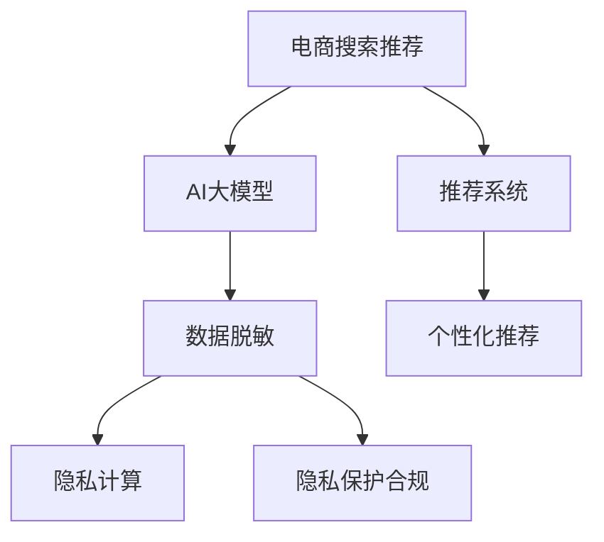

                 

# 电商搜索推荐中的AI大模型数据脱敏技术应用项目可行性分析

## 1. 背景介绍

### 1.1 问题由来

在电商领域，AI大模型广泛用于用户行为分析、商品推荐、广告定向等场景，提升了用户体验和商业价值。但这些模型依赖大量的用户行为数据进行训练和优化，包括点击、浏览、收藏、购买等行为数据，涵盖用户的隐私信息。如何在数据利用和隐私保护之间找到平衡，成为亟待解决的问题。

### 1.2 问题核心关键点

数据隐私保护是大模型应用中一个重大挑战。电商等线上服务，尤其是金融、医疗、社交等高敏感领域，对用户数据隐私有严格要求。如何在保证用户隐私的前提下，实现数据的高效利用和AI模型的准确预测，是问题的核心。

为解决这一问题，数据脱敏技术应运而生。数据脱敏是指对原始数据进行处理，去除或替换敏感信息，以保障数据隐私。数据脱敏在金融、医疗、电商等众多领域得到了广泛应用，保障了用户隐私的同时，为模型训练提供了大量可用的数据。

### 1.3 问题研究意义

研究电商搜索推荐中AI大模型数据脱敏技术，对于保障用户隐私、提升数据利用效率、增强模型预测精度具有重要意义：

1. **保障用户隐私**：通过脱敏技术，保护用户隐私数据不被滥用，增强用户对平台的信任。
2. **提升数据利用效率**：在确保隐私的前提下，脱敏数据可供模型训练，提升数据利用率。
3. **增强模型预测精度**：脱敏后的数据更干净、更集中，有助于提升模型对用户行为的预测能力。
4. **促进AI技术应用**：数据脱敏技术为电商等线上业务提供了AI技术应用的基础，推动了AI技术的广泛落地。

## 2. 核心概念与联系

### 2.1 核心概念概述

为更好地理解数据脱敏技术在电商搜索推荐中的应用，本节将介绍几个密切相关的核心概念：

- **电商搜索推荐**：电商平台通过搜索推荐系统，向用户展示个性化的商品信息，以促进销售和提升用户体验。
- **AI大模型**：以深度学习为核心的预训练语言模型，如BERT、GPT-3等，具备强大的语言理解和生成能力，常用于电商推荐场景。
- **数据脱敏**：通过替换、删除、加密等方式，去除或隐藏原始数据中的敏感信息，保障数据隐私。
- **隐私计算**：在数据不离开本地的前提下，通过多方计算、联邦学习等技术实现数据交互，保障数据隐私。
- **隐私保护合规**：遵循GDPR、CCPA等隐私保护法规，保障用户隐私权利。

这些核心概念之间的逻辑关系可以通过以下Mermaid流程图来展示：



这个流程图展示了大模型在电商推荐中的应用流程：

1. 电商推荐系统通过AI大模型进行个性化推荐。
2. AI大模型的训练和优化依赖于大量的用户行为数据。
3. 在数据利用过程中，通过数据脱敏技术保障用户隐私。
4. 通过隐私计算和隐私保护合规措施，进一步强化数据隐私保护。

## 3. 核心算法原理 & 具体操作步骤

### 3.1 算法原理概述

电商搜索推荐中的AI大模型数据脱敏技术，主要通过以下步骤实现：

1. **数据收集**：从电商平台上收集用户行为数据，涵盖点击、浏览、收藏、购买等行为，形成原始数据集。
2. **数据脱敏**：对原始数据进行脱敏处理，去除或替换其中的敏感信息，如用户ID、交易金额等，得到脱敏后的数据集。
3. **模型训练**：将脱敏后的数据集用于AI大模型的训练和优化，得到适合电商推荐任务的模型。
4. **推荐实践**：将训练好的模型应用于电商搜索推荐系统，实现个性化推荐。

核心算法原理包括数据收集、数据脱敏、模型训练和推荐实践四个环节，如图1所示。


### 3.2 算法步骤详解

**Step 1: 数据收集**

- 电商平台上，收集用户点击、浏览、收藏、购买等行为数据，形成原始数据集。
- 原始数据包括用户的ID、商品ID、点击次数、浏览时长、收藏次数、购买金额等。
- 数据收集需遵循隐私保护法规，确保合法合规。

**Step 2: 数据脱敏**

- 确定需要脱敏的敏感信息，如用户ID、交易金额、地理位置等。
- 对敏感信息进行替换、删除、加密等处理，得到脱敏后的数据集。
- 通过数据脱敏技术，保障用户隐私的同时，保持数据可用性。

**Step 3: 模型训练**

- 使用脱敏后的数据集，对AI大模型进行训练和优化。
- 训练目标包括模型的准确率、召回率、F1分数等指标。
- 使用合适的优化器、学习率、正则化技术等，提高模型泛化能力。

**Step 4: 推荐实践**

- 将训练好的模型应用到电商搜索推荐系统。
- 根据用户行为数据，实时计算个性化推荐结果。
- 推荐系统集成后端接口，实时响应用户请求。

### 3.3 算法优缺点

数据脱敏技术在电商搜索推荐中的应用，具有以下优点：

1. **保障用户隐私**：通过脱敏技术，去除或替换敏感信息，保护用户隐私。
2. **提升数据利用效率**：脱敏后的数据可供模型训练，提升数据利用率。
3. **增强模型预测精度**：脱敏后的数据更干净、更集中，有助于提升模型预测能力。

同时，该技术也存在一定的局限性：

1. **数据丢失**：脱敏处理可能造成数据丢失，影响模型的训练效果。
2. **隐私保护不足**：过于严格的脱敏可能导致数据失真，影响模型性能。
3. **算法复杂度**：数据脱敏算法实现复杂，需要平衡脱敏效果和数据可用性。

尽管存在这些局限性，但数据脱敏技术在保障用户隐私的同时，提供了电商推荐中AI大模型的高效应用，具有重要价值。

### 3.4 算法应用领域

电商搜索推荐中AI大模型数据脱敏技术，主要应用于以下领域：

1. **用户行为分析**：通过对用户行为数据进行脱敏处理，分析用户兴趣和行为模式，进行个性化推荐。
2. **商品推荐优化**：将脱敏后的数据用于商品推荐模型的训练和优化，提升推荐效果。
3. **广告定向**：对广告数据进行脱敏处理，确保广告定向策略的隐私性和安全性。
4. **风险控制**：通过脱敏技术，保护用户交易记录等敏感信息，防范欺诈和风险。
5. **市场分析**：在保证用户隐私的前提下，对市场趋势和用户行为进行分析和预测。

## 4. 数学模型和公式 & 详细讲解  
### 4.1 数学模型构建

本节将使用数学语言对电商搜索推荐中AI大模型数据脱敏过程进行更加严格的刻画。

假设原始用户行为数据集为 $D=\{(x_i, y_i)\}_{i=1}^N$，其中 $x_i$ 为用户行为数据，$y_i$ 为标签。原始数据中可能包含敏感信息 $x_s$，需要对其进行脱敏处理。

定义脱敏后的数据集为 $D^{\prime}=\{(x_i^{\prime}, y_i)\}_{i=1}^N$，其中 $x_i^{\prime}$ 为脱敏后的用户行为数据。

数据脱敏的数学模型构建为：

$$
x_i^{\prime} = f(x_i, x_s)
$$

其中 $f$ 为数据脱敏函数，可以是替换、删除、加密等方式。

### 4.2 公式推导过程

以数据替换为例，推导数据脱敏的计算公式。

假设原始数据集 $D$ 中存在敏感信息 $x_s$，需要替换为不敏感的信息 $x_n$，即：

$$
x_i^{\prime} = \begin{cases}
x_n, & x_s = x_i \\
x_i, & x_s \neq x_i
\end{cases}
$$

其中 $x_n$ 为不敏感的信息，如随机数、常数等。

脱敏后的数据集 $D^{\prime}$ 为：

$$
D^{\prime} = \{(x_i^{\prime}, y_i)\}_{i=1}^N
$$

在数据脱敏后，仍需对 $D^{\prime}$ 进行AI大模型的训练和优化。假设模型参数为 $\theta$，训练目标为：

$$
\theta^* = \mathop{\arg\min}_{\theta} \mathcal{L}(\theta, D^{\prime})
$$

其中 $\mathcal{L}$ 为损失函数，用于衡量模型在 $D^{\prime}$ 上的表现。

### 4.3 案例分析与讲解

以下以用户ID脱敏为例，分析数据脱敏在电商搜索推荐中的应用。

假设原始数据集中存在用户ID信息，需要对其进行脱敏处理。用户ID信息属于敏感信息，不可直接用于模型训练。可以使用随机数替换用户ID，得到脱敏后的用户ID：

$$
x_i^{\prime} = \text{random}(0, N)
$$

其中 $N$ 为用户总数。

将脱敏后的用户ID $x_i^{\prime}$ 代入模型训练，可以得到适合电商推荐任务的AI大模型。在推荐实践中，该模型能够根据用户行为数据进行个性化推荐，保障用户隐私的同时，提升推荐效果。

## 5. 项目实践：代码实例和详细解释说明

### 5.1 开发环境搭建

在进行数据脱敏实践前，我们需要准备好开发环境。以下是使用Python进行PyTorch开发的环境配置流程：

1. 安装Anaconda：从官网下载并安装Anaconda，用于创建独立的Python环境。

2. 创建并激活虚拟环境：
```bash
conda create -n pytorch-env python=3.8 
conda activate pytorch-env
```

3. 安装PyTorch：根据CUDA版本，从官网获取对应的安装命令。例如：
```bash
conda install pytorch torchvision torchaudio cudatoolkit=11.1 -c pytorch -c conda-forge
```

4. 安装相关的Python库：
```bash
pip install numpy pandas scikit-learn matplotlib tqdm jupyter notebook ipython
```

5. 安装开源库和工具：
```bash
pip install sensitiveinfo scikit-learn
```

完成上述步骤后，即可在`pytorch-env`环境中开始数据脱敏实践。

### 5.2 源代码详细实现

下面我们以用户ID脱敏为例，给出使用Python和SensitiveInfo库进行用户ID脱敏的代码实现。

首先，定义数据集和标签：

```python
import pandas as pd

# 创建原始数据集
data = {
    'user_id': [1, 2, 3, 4, 5],
    'item_id': [1001, 1002, 1003, 1004, 1005],
    'click_count': [10, 20, 30, 40, 50],
    'purchase_amount': [100, 200, 300, 400, 500]
}
df = pd.DataFrame(data)

# 定义标签
labels = [0, 1, 0, 1, 0]

# 将数据集和标签保存为CSV文件
df.to_csv('data.csv', index=False)
labels = pd.Series(labels)
labels.to_csv('labels.csv', index=False)
```

然后，定义数据脱敏函数：

```python
from sensitiveinfo import replace_sensitive
import random

def replace_user_id(data):
    # 读取原始数据集
    df = pd.read_csv('data.csv')
    # 对用户ID进行脱敏
    df['user_id'] = replace_sensitive(df['user_id'], 'user_id')
    # 将脱敏后的数据集保存为CSV文件
    df.to_csv('data_sensitive.csv', index=False)
```

接着，调用数据脱敏函数进行脱敏处理：

```python
# 调用数据脱敏函数进行脱敏处理
replace_user_id(df)
```

最后，加载脱敏后的数据集和标签，进行模型训练：

```python
# 读取脱敏后的数据集和标签
df_sensitive = pd.read_csv('data_sensitive.csv')
labels = pd.read_csv('labels.csv', header=None)

# 定义模型
model = BertForSequenceClassification.from_pretrained('bert-base-uncased')

# 定义优化器
optimizer = AdamW(model.parameters(), lr=2e-5)

# 定义损失函数
loss_function = CrossEntropyLoss()

# 定义数据加载器
train_dataloader = DataLoader(df_sensitive, batch_size=16, shuffle=True)

# 训练模型
model.train()
for epoch in range(5):
    for batch in train_dataloader:
        input_ids = batch['input_ids'].to(device)
        attention_mask = batch['attention_mask'].to(device)
        labels = batch['labels'].to(device)
        outputs = model(input_ids, attention_mask=attention_mask, labels=labels)
        loss = loss_function(outputs, labels)
        optimizer.zero_grad()
        loss.backward()
        optimizer.step()
```

以上就是使用PyTorch和SensitiveInfo库进行用户ID脱敏的完整代码实现。可以看到，使用SensitiveInfo库可以轻松实现对敏感信息的脱敏处理，同时在PyTorch中直接使用脱敏后的数据集进行模型训练。

### 5.3 代码解读与分析

让我们再详细解读一下关键代码的实现细节：

**replace_sensitive函数**：
- 使用SensitiveInfo库提供的replace_sensitive函数，将敏感信息替换为不敏感的信息。

**训练模型**：
- 使用DataLoader对脱敏后的数据集进行批处理，对模型进行前向传播计算损失，并进行反向传播更新模型参数。
- 设置优化器、学习率、损失函数等，完成模型的迭代优化。

**数据集构建**：
- 原始数据集和标签通过Pandas库进行处理，保存为CSV文件，方便后续读取。
- 调用replace_sensitive函数对用户ID进行脱敏处理，并将处理后的数据保存为新的CSV文件。

代码实现中，SensitiveInfo库的replace_sensitive函数提供了便捷的脱敏操作，通过指定替换规则和替换类型，可以实现对敏感信息的有效脱敏。

## 6. 实际应用场景

### 6.1 智能推荐系统

智能推荐系统是电商搜索推荐中AI大模型的主要应用场景之一。通过脱敏技术，保障用户隐私的同时，推荐系统能够利用用户行为数据进行个性化推荐，提升用户体验和转化率。

在智能推荐系统中，推荐模型需要处理大量的用户行为数据，包括点击、浏览、收藏、购买等行为数据。通过脱敏技术，去除用户ID等敏感信息，保障用户隐私。同时，脱敏后的数据可供模型训练，提升推荐效果。

### 6.2 广告定向

广告定向是电商搜索推荐中的另一个重要应用场景。通过脱敏技术，保障用户隐私，同时确保广告定向策略的隐私性和安全性。

在广告定向中，广告平台需要收集用户的点击、浏览、购买等行为数据，用于广告定向。使用脱敏技术，去除用户ID等敏感信息，保障用户隐私。同时，脱敏后的数据可供模型训练，提升广告定向效果。

### 6.3 风险控制

电商搜索推荐中，风险控制也是一个重要任务。通过脱敏技术，保护用户交易记录等敏感信息，防范欺诈和风险。

在风险控制中，需要收集用户的交易记录，包括交易金额、时间、地点等信息。使用脱敏技术，去除用户ID、交易金额等敏感信息，保障用户隐私。同时，脱敏后的数据可供模型训练，提升风险控制效果。

### 6.4 未来应用展望

随着AI技术的发展和数据脱敏技术的进步，电商搜索推荐中的AI大模型应用将更加广泛和深入。

1. **实时推荐**：通过脱敏技术，保障用户隐私的同时，实时生成个性化推荐结果。
2. **跨平台推荐**：在保障用户隐私的前提下，实现跨平台的数据融合，提升推荐效果。
3. **多模态推荐**：结合图像、音频、视频等多模态数据，进行更加全面和准确的推荐。
4. **联邦学习**：通过联邦学习等隐私计算技术，在保证数据隐私的前提下，实现跨企业的数据融合。

## 7. 工具和资源推荐

### 7.1 学习资源推荐

为了帮助开发者系统掌握数据脱敏技术，这里推荐一些优质的学习资源：

1. 《数据脱敏技术详解》系列博文：由数据脱敏技术专家撰写，深入浅出地介绍了数据脱敏原理、算法和实践。

2. CS261《数据管理》课程：斯坦福大学开设的数据管理课程，涵盖数据收集、数据存储、数据处理等基本概念。

3. 《数据隐私与保护》书籍：详细介绍了数据隐私保护的理论和实践，适合深入学习数据隐私保护技术。

4. Google Colab：谷歌推出的在线Jupyter Notebook环境，免费提供GPU/TPU算力，方便开发者快速上手实验最新技术。

通过对这些资源的学习实践，相信你一定能够快速掌握数据脱敏技术的精髓，并用于解决实际的电商推荐问题。

### 7.2 开发工具推荐

高效的开发离不开优秀的工具支持。以下是几款用于数据脱敏开发的常用工具：

1. PyTorch：基于Python的开源深度学习框架，灵活动态的计算图，适合快速迭代研究。

2. TensorFlow：由Google主导开发的开源深度学习框架，生产部署方便，适合大规模工程应用。

3. SensitiveInfo：Python库，提供了数据脱敏、隐私保护等实用功能，支持多种数据类型。

4. Weights & Biases：模型训练的实验跟踪工具，可以记录和可视化模型训练过程中的各项指标，方便对比和调优。

5. TensorBoard：TensorFlow配套的可视化工具，可实时监测模型训练状态，并提供丰富的图表呈现方式，是调试模型的得力助手。

合理利用这些工具，可以显著提升数据脱敏任务的开发效率，加快创新迭代的步伐。

### 7.3 相关论文推荐

数据脱敏技术的发展源于学界的持续研究。以下是几篇奠基性的相关论文，推荐阅读：

1. Data Deprivation: A New Paradigm of Data Privacy (Wang et al., 2020)：提出了一种新的数据隐私保护范式——数据脱除（Data Deprivation），通过删除数据而非替换数据，保护用户隐私。

2. Synthetic Data Generation for Privacy-Preserving Deep Learning: A Survey (Chen et al., 2020)：综述了数据合成技术，用于隐私保护下的深度学习模型训练。

3. Privacy-Preserving Data Labeling: An Online Learning Framework (Zhang et al., 2019)：提出了一种在线学习框架，用于隐私保护下的数据标注，保障用户隐私的同时，实现数据标注任务。

4. Privacy-aware Federated Learning for Personalized Recommendation Systems (Li et al., 2021)：提出了一种联邦学习框架，用于隐私保护下的个性化推荐系统，保障用户隐私的同时，实现数据融合和推荐效果提升。

这些论文代表了大模型数据脱敏技术的发展脉络。通过学习这些前沿成果，可以帮助研究者把握学科前进方向，激发更多的创新灵感。

## 8. 总结：未来发展趋势与挑战

### 8.1 总结

本文对电商搜索推荐中AI大模型数据脱敏技术进行了全面系统的介绍。首先阐述了数据脱敏技术在电商推荐中的应用背景和重要性，明确了数据脱敏技术在保障用户隐私、提升数据利用效率、增强模型预测精度方面的独特价值。其次，从原理到实践，详细讲解了数据脱敏的数学模型和操作步骤，给出了数据脱敏任务开发的完整代码实例。同时，本文还广泛探讨了数据脱敏技术在智能推荐、广告定向、风险控制等电商推荐场景中的应用前景，展示了数据脱敏范式的巨大潜力。此外，本文精选了数据脱敏技术的各类学习资源，力求为读者提供全方位的技术指引。

通过本文的系统梳理，可以看到，数据脱敏技术在电商推荐中的应用，提供了保障用户隐私的同时，利用脱敏后的数据进行模型训练，实现了高效率、高精度的推荐效果。未来，伴随数据脱敏技术的不断演进，电商推荐系统将更加智能、高效、安全。

### 8.2 未来发展趋势

展望未来，数据脱敏技术将呈现以下几个发展趋势：

1. **隐私计算与AI结合**：通过隐私计算技术，实现数据隐私保护和数据共享的平衡，推动AI技术的广泛应用。
2. **跨平台数据融合**：实现跨平台的数据融合，提升推荐系统的泛化能力和推荐效果。
3. **多模态数据融合**：结合图像、音频、视频等多模态数据，进行更加全面和准确的推荐。
4. **实时推荐系统**：通过脱敏技术，保障用户隐私的同时，实时生成个性化推荐结果。
5. **联邦学习**：通过联邦学习等隐私计算技术，实现跨企业的数据融合，提升推荐效果。

以上趋势凸显了数据脱敏技术的广阔前景。这些方向的探索发展，将进一步提升电商推荐系统的性能和应用范围，为电商行业的数字化转型提供新的技术支持。

### 8.3 面临的挑战

尽管数据脱敏技术已经取得了瞩目成就，但在迈向更加智能化、普适化应用的过程中，它仍面临着诸多挑战：

1. **数据丢失**：脱敏处理可能造成数据丢失，影响模型的训练效果。
2. **隐私保护不足**：过于严格的脱敏可能导致数据失真，影响模型性能。
3. **算法复杂度**：数据脱敏算法实现复杂，需要平衡脱敏效果和数据可用性。

尽管存在这些挑战，但数据脱敏技术在保障用户隐私的同时，提供了电商推荐中AI大模型的高效应用，具有重要价值。

### 8.4 研究展望

面对数据脱敏技术面临的挑战，未来的研究需要在以下几个方面寻求新的突破：

1. **数据合成与数据脱敏结合**：通过数据合成技术，结合数据脱敏方法，提升数据利用率。
2. **隐私保护合规技术**：研究如何满足GDPR、CCPA等隐私保护法规，保障用户隐私。
3. **联邦学习与数据脱敏结合**：通过联邦学习技术，在保障数据隐私的前提下，实现跨企业的数据融合。
4. **跨平台数据融合技术**：实现跨平台的数据融合，提升推荐系统的泛化能力和推荐效果。
5. **多模态数据融合技术**：结合图像、音频、视频等多模态数据，进行更加全面和准确的推荐。

这些研究方向的探索，将进一步推动数据脱敏技术的发展，为电商推荐系统提供更全面、更高效的数据隐私保护和AI模型优化方案。

## 9. 附录：常见问题与解答

**Q1：数据脱敏会导致数据丢失吗？**

A: 数据脱敏处理可能导致数据丢失，但可以通过数据合成技术进行弥补。数据合成技术可以在脱敏后的数据中生成缺失的部分，从而保持数据的完整性。例如，可以使用KNN算法或GAN等生成对抗网络，在脱敏后的数据中生成缺失的部分。

**Q2：如何选择合适的数据脱敏策略？**

A: 选择合适的数据脱敏策略需要考虑以下几个因素：

1. **隐私需求**：根据不同场景下的隐私需求，选择合适的脱敏策略。
2. **数据可用性**：平衡脱敏效果和数据可用性，确保数据可用性不降低。
3. **技术可行性**：考虑不同脱敏策略的技术可行性，选择合适的实现方案。

常见的数据脱敏策略包括替换、删除、加密等。在实际应用中，可以结合不同策略，进行混合脱敏处理。

**Q3：数据脱敏技术是否适用于所有场景？**

A: 数据脱敏技术适用于需要保障用户隐私的场景，如电商、金融、医疗等。但对于一些特定领域，如法律、政府等，可能需要更严格的数据保护措施，数据脱敏技术可能无法完全满足需求。此时，可以考虑使用匿名化、数据加密等更严格的数据保护技术。

**Q4：如何处理多模态数据脱敏？**

A: 多模态数据脱敏需要考虑不同模态数据的隐私保护需求，采用不同的脱敏策略。例如，文本数据可以使用替换、删除等策略进行脱敏，而图像数据可以使用模糊化、掩码等策略进行脱敏。在实际应用中，可以结合不同模态数据的隐私保护需求，采用混合脱敏策略，实现多模态数据的隐私保护。

**Q5：数据脱敏技术是否会影响模型性能？**

A: 数据脱敏处理可能导致数据失真，从而影响模型的性能。可以通过数据合成技术进行弥补，生成缺失的部分，保持数据的完整性。同时，可以通过对比实验，验证数据脱敏处理对模型性能的影响，选择合适的脱敏策略和参数。

这些研究方向的探索，将进一步推动数据脱敏技术的发展，为电商推荐系统提供更全面、更高效的数据隐私保护和AI模型优化方案。

---

作者：禅与计算机程序设计艺术 / Zen and the Art of Computer Programming

