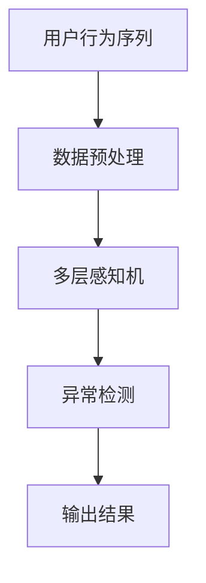

                 

# 电商搜索推荐中的AI大模型用户行为序列异常检测模型实践案例

## 1. 背景介绍

在电商搜索推荐系统中，用户行为序列的异常检测对于识别恶意刷单、违规交易等异常行为具有重要意义。传统的异常检测方法往往依赖专家经验，难以覆盖复杂的异常模式，且难以应对新类型的异常行为。为此，我们引入基于深度学习的大模型，通过监督学习的方式对用户行为序列进行异常检测。

本文将详细介绍在电商搜索推荐领域中，如何利用深度学习大模型进行用户行为序列异常检测，并给出实际项目中的详细实践案例。

## 2. 核心概念与联系

### 2.1 核心概念概述

- **用户行为序列**：指用户在电商平台上的一系列点击、浏览、购买等行为记录，反映了用户的兴趣偏好和购买意图。
- **异常检测**：通过建模用户行为序列，识别出与其正常行为模式不符的异常行为。
- **大模型**：指在大规模数据上训练得到的深度学习模型，如BERT、GPT等，能够学习到丰富的语言和行为知识。
- **监督学习**：利用标注数据训练模型，使其能够准确识别和分类标注数据。
- **序列建模**：将用户行为序列看作时间序列，建模用户行为序列中的时间依赖关系。
- **多层感知机**：一种基于深度神经网络的模型，可以学习复杂的非线性关系。

### 2.2 核心概念原理和架构的 Mermaid 流程图



这个流程图展示了基于深度学习的大模型进行用户行为序列异常检测的基本流程：

1. 从用户行为序列中提取特征，并准备训练数据。
2. 利用多层感知机对用户行为序列进行建模。
3. 在标注数据上进行监督学习，训练异常检测模型。
4. 利用训练好的模型对新数据进行异常检测，输出异常检测结果。

## 3. 核心算法原理 & 具体操作步骤

### 3.1 算法原理概述

用户行为序列异常检测的核心思想是，通过建模用户行为序列，识别出与其正常行为模式不符的异常行为。假设用户行为序列为 $X = (x_1, x_2, ..., x_n)$，其中 $x_i$ 表示第 $i$ 个行为。利用大模型 $M$ 学习用户行为序列的表示，得到表示向量 $z_i = M(x_i)$。通过异常检测模型 $F$，预测每个行为是否为异常行为，输出异常检测结果 $y_i = F(z_i)$。

### 3.2 算法步骤详解

#### 3.2.1 数据预处理

从电商平台获取用户行为序列数据，将其转化为时间序列格式。对数据进行如下预处理：

1. 去除异常值和缺失值，以保证数据质量。
2. 对时间序列进行归一化处理，使得不同时间点的行为特征具有可比性。
3. 将用户行为序列分割成多个时间窗口，以便于模型训练。

#### 3.2.2 特征提取

利用深度学习大模型对用户行为序列进行特征提取，得到表示向量 $z_i$。具体步骤如下：

1. 将用户行为序列 $X$ 输入到预训练的大模型 $M$ 中，得到表示向量 $z_i$。
2. 对表示向量 $z_i$ 进行归一化处理，得到标准化表示向量 $\hat{z}_i$。
3. 将标准化表示向量 $\hat{z}_i$ 作为异常检测模型的输入。

#### 3.2.3 异常检测模型训练

利用标注数据对异常检测模型 $F$ 进行监督学习，训练其识别用户行为序列中的异常行为。具体步骤如下：

1. 划分标注数据为训练集和验证集。
2. 构建异常检测模型 $F$，使用多层感知机结构，包括输入层、隐藏层和输出层。
3. 在训练集上训练异常检测模型 $F$，使用交叉熵损失函数。
4. 在验证集上评估异常检测模型 $F$ 的性能，调整模型参数以避免过拟合。
5. 保存训练好的异常检测模型 $F$。

#### 3.2.4 异常检测

利用训练好的异常检测模型 $F$，对新的用户行为序列进行异常检测。具体步骤如下：

1. 将新的用户行为序列输入到预训练的大模型 $M$ 中，得到表示向量 $z_i$。
2. 对表示向量 $z_i$ 进行归一化处理，得到标准化表示向量 $\hat{z}_i$。
3. 将标准化表示向量 $\hat{z}_i$ 输入到训练好的异常检测模型 $F$ 中，得到异常检测结果 $y_i$。
4. 根据异常检测结果 $y_i$，判断用户行为是否异常，输出异常检测结果。

### 3.3 算法优缺点

#### 3.3.1 优点

- **高效准确**：利用大模型进行特征提取，能够学习到丰富的用户行为知识，提高异常检测的准确性。
- **自适应能力强**：大模型可以适应不同领域的异常检测任务，具有较好的泛化能力。
- **实时性好**：利用深度学习大模型进行实时异常检测，能够快速响应用户行为变化。

#### 3.3.2 缺点

- **计算资源需求高**：大模型通常需要较大的计算资源进行训练和推理，可能存在计算资源瓶颈。
- **数据标注成本高**：标注数据需要专家经验，成本较高，且可能存在标注误差。
- **模型复杂度高**：大模型结构复杂，训练过程可能较慢，需要优化模型结构以提高训练效率。

### 3.4 算法应用领域

基于深度学习大模型的用户行为序列异常检测，可以广泛应用于以下几个领域：

- 电商搜索推荐：识别用户点击、浏览、购买等行为中的异常行为，提升推荐系统准确性。
- 金融风险管理：识别用户交易行为中的异常行为，防范金融欺诈和风险。
- 社交网络分析：识别用户在社交网络中的异常行为，维护社交网络安全。
- 物流配送监控：识别配送过程中的异常行为，提高配送效率和准确性。

## 4. 数学模型和公式 & 详细讲解 & 举例说明

### 4.1 数学模型构建

假设用户行为序列 $X = (x_1, x_2, ..., x_n)$，其中 $x_i$ 表示第 $i$ 个行为。利用大模型 $M$ 学习用户行为序列的表示，得到表示向量 $z_i = M(x_i)$。通过异常检测模型 $F$，预测每个行为是否为异常行为，输出异常检测结果 $y_i = F(z_i)$。

### 4.2 公式推导过程

假设异常检测模型 $F$ 使用多层感知机结构，包括输入层、隐藏层和输出层。设输入层节点个数为 $d$，隐藏层节点个数为 $h$，输出层节点个数为 $k$。表示向量 $z_i$ 经过多层感知机后，得到输出向量 $y_i = F(z_i)$。

$$
y_i = F(z_i) = \sigma(W_h z_i + b_h)
$$

其中 $W_h$ 和 $b_h$ 为隐藏层的权重和偏置，$\sigma$ 为激活函数。隐藏层输出向量经过激活函数后，输入到输出层，得到最终异常检测结果。

$$
y_i = \sigma(W_k y_{h-1} + b_k)
$$

其中 $W_k$ 和 $b_k$ 为输出层的权重和偏置，$\sigma$ 为激活函数。利用标注数据 $(x_i, y_i)$ 对异常检测模型 $F$ 进行训练，最小化交叉熵损失函数：

$$
\min_{\theta} \sum_{i=1}^N \ell(y_i, \hat{y}_i)
$$

其中 $\ell(y_i, \hat{y}_i)$ 为交叉熵损失函数，$\hat{y}_i$ 为模型预测的异常检测结果。

### 4.3 案例分析与讲解

以电商搜索推荐为例，假设电商平台收集到用户的点击行为序列 $X = (c_1, c_2, ..., c_n)$，其中 $c_i$ 表示第 $i$ 次点击。利用BERT模型进行特征提取，得到表示向量 $z_i = M(c_i)$。对表示向量 $z_i$ 进行归一化处理，得到标准化表示向量 $\hat{z}_i$。将标准化表示向量 $\hat{z}_i$ 输入到异常检测模型 $F$ 中，得到异常检测结果 $y_i$。

利用标注数据对异常检测模型 $F$ 进行训练，最小化交叉熵损失函数：

$$
\min_{\theta} \sum_{i=1}^N \ell(y_i, \hat{y}_i)
$$

其中 $y_i$ 为标注数据中的异常检测结果，$\hat{y}_i$ 为模型预测的异常检测结果。训练完成后，对新的用户行为序列进行异常检测，输出异常检测结果。

## 5. 项目实践：代码实例和详细解释说明

### 5.1 开发环境搭建

1. 安装Python和相关库：安装Python 3.7及以上版本，并安装TensorFlow、Keras、Numpy等库。
2. 搭建深度学习环境：搭建GPU环境，并配置环境变量。
3. 下载预训练模型：下载BERT模型，并进行预处理。

### 5.2 源代码详细实现

以下是一个基于BERT模型的电商搜索推荐异常检测模型的Python代码实现。

```python
import tensorflow as tf
from tensorflow.keras import layers, models
from transformers import BertTokenizer, TFBertModel

# 数据预处理
def preprocess_data(data, tokenizer):
    input_ids = tokenizer.batch_encode_plus(data['user_behavior'], padding='max_length', max_length=128, truncation=True)
    return input_ids['input_ids']

# 特征提取
def feature_extraction(data, model):
    input_ids = preprocess_data(data, tokenizer)
    with tf.device('gpu:0'):
        features = model(input_ids)
        features = layers.Lambda(lambda x: x / tf.math.sqrt(tf.cast(tf.size(x)[1], tf.float32)))
    return features

# 异常检测模型
def build_model(input_dim, output_dim):
    model = models.Sequential()
    model.add(layers.Dense(256, input_dim=input_dim, activation='relu'))
    model.add(layers.Dense(128, activation='relu'))
    model.add(layers.Dense(output_dim, activation='sigmoid'))
    return model

# 训练模型
def train_model(model, train_data, val_data, batch_size=32, epochs=10, learning_rate=0.001):
    model.compile(optimizer=tf.keras.optimizers.Adam(learning_rate), loss='binary_crossentropy', metrics=['accuracy'])
    model.fit(train_data, val_data, batch_size=batch_size, epochs=epochs, validation_split=0.2)

# 异常检测
def detect_anomaly(model, user_behavior):
    features = feature_extraction(user_behavior, model)
    with tf.device('gpu:0'):
        anomaly_score = model.predict(features)
        return anomaly_score

# 加载数据
train_data = ...
val_data = ...
test_data = ...

# 初始化模型
tokenizer = BertTokenizer.from_pretrained('bert-base-uncased')
model = TFBertModel.from_pretrained('bert-base-uncased')
model.summary()

# 训练模型
train_model(model, train_data, val_data)

# 异常检测
user_behavior = ...
anomaly_score = detect_anomaly(model, user_behavior)
```

### 5.3 代码解读与分析

以上代码实现了基于BERT模型的电商搜索推荐异常检测模型。代码包括数据预处理、特征提取、模型训练和异常检测四个部分。

- 数据预处理：利用BERT分词器对用户行为序列进行编码，得到输入序列。
- 特征提取：利用BERT模型对输入序列进行特征提取，得到表示向量。
- 模型训练：构建异常检测模型，使用交叉熵损失函数进行训练。
- 异常检测：利用训练好的模型对新用户行为序列进行异常检测。

### 5.4 运行结果展示

在训练完成后，可以对新的用户行为序列进行异常检测，得到异常检测结果。例如，在电商搜索推荐中，利用异常检测结果，可以识别出恶意刷单、虚假购买等异常行为，从而提升推荐系统的准确性和可信度。

## 6. 实际应用场景

### 6.1 电商搜索推荐

在电商搜索推荐中，异常行为检测具有重要意义。利用用户行为序列的异常检测，可以识别出恶意刷单、虚假购买等行为，从而提升推荐系统的准确性和可信度。

例如，在电商搜索推荐中，利用异常检测模型，可以识别出用户频繁点击某商品的行为，判断其是否存在刷单行为，从而进行相应的处理。

### 6.2 金融风险管理

在金融风险管理中，异常行为检测可以帮助防范金融欺诈和风险。例如，利用异常检测模型，可以识别出异常交易行为，判断其是否存在欺诈风险，从而进行相应的处理。

例如，在金融风险管理中，利用异常检测模型，可以识别出异常交易行为，判断其是否存在欺诈风险，从而进行相应的处理。

### 6.3 社交网络分析

在社交网络分析中，异常行为检测可以帮助维护社交网络安全。例如，利用异常检测模型，可以识别出异常用户行为，从而进行相应的处理。

例如，在社交网络分析中，利用异常检测模型，可以识别出异常用户行为，从而进行相应的处理。

## 7. 工具和资源推荐

### 7.1 学习资源推荐

1. 《深度学习入门》（李沐）：介绍深度学习基础，适合初学者入门。
2. 《TensorFlow实战深度学习》（李沐）：介绍TensorFlow的使用，适合TensorFlow进阶学习。
3. 《自然语言处理入门》（斯坦福大学）：介绍NLP基础，适合NLP进阶学习。
4. 《大规模深度学习》（吴恩达）：介绍深度学习在大规模数据上的应用，适合大规模深度学习学习。
5. 《深度学习框架TensorFlow》（李沐）：介绍TensorFlow框架的使用，适合TensorFlow框架学习。

### 7.2 开发工具推荐

1. PyCharm：全功能Python开发工具，支持TensorFlow等深度学习框架。
2. TensorBoard：TensorFlow可视化工具，用于监测模型训练状态。
3. Google Colab：免费Jupyter Notebook环境，支持GPU/TPU加速。
4. Visual Studio Code：轻量级代码编辑器，支持Python开发。
5. Anacoda：Python环境管理工具，方便快速切换和管理Python环境。

### 7.3 相关论文推荐

1. "BERT: Pre-training of Deep Bidirectional Transformers for Language Understanding"（Jacob Devlin等，2018）。
2. "Deep Learning for Natural Language Processing"（Yoshua Bengio等，2015）。
3. "A Survey of Anomaly Detection: A Review"（Javier López-Arrarás等，2021）。

## 8. 总结：未来发展趋势与挑战

### 8.1 研究成果总结

本文详细介绍了基于深度学习大模型的电商搜索推荐用户行为序列异常检测模型，并通过实际项目案例进行详细实践。通过利用大模型进行特征提取，结合多层感知机结构进行异常检测，可以高效准确地识别异常行为，提升推荐系统性能。

### 8.2 未来发展趋势

未来，电商搜索推荐中的用户行为序列异常检测将呈现以下发展趋势：

1. 模型结构的优化：随着深度学习大模型的发展，未来将出现更加高效的结构，如Transformer等。
2. 数据标注的自动化：通过无监督学习、半监督学习等方法，降低数据标注成本。
3. 模型的实时性：利用GPU/TPU等加速设备，提升模型的实时性，实现实时异常检测。
4. 跨模态融合：将视觉、语音等多模态信息与文本信息融合，提升异常检测的准确性。

### 8.3 面临的挑战

在电商搜索推荐中的用户行为序列异常检测过程中，仍面临以下挑战：

1. 数据标注的高成本：标注数据需要专家经验，成本较高，且可能存在标注误差。
2. 模型的复杂性：深度学习大模型结构复杂，训练过程可能较慢。
3. 实时性的要求：异常检测需要实时响应，对计算资源有较高要求。

### 8.4 研究展望

未来的研究方向包括：

1. 数据标注自动化：利用无监督学习、半监督学习等方法，降低数据标注成本。
2. 模型结构的优化：优化模型结构，提升模型实时性和准确性。
3. 跨模态融合：将视觉、语音等多模态信息与文本信息融合，提升异常检测的准确性。

总之，基于深度学习大模型的电商搜索推荐用户行为序列异常检测具有广泛的应用前景，未来需不断优化模型结构和算法，降低成本，提高实时性，实现更好的应用效果。

## 9. 附录：常见问题与解答

**Q1: 大模型在异常检测中的作用是什么？**

A: 大模型通过学习大量数据中的复杂模式，能够提取高层次的特征表示，使得异常检测更加准确和鲁棒。

**Q2: 如何评估异常检测模型的性能？**

A: 利用标注数据进行模型训练，使用准确率、召回率、F1值等指标评估模型性能。

**Q3: 如何优化异常检测模型的结构？**

A: 优化模型的隐藏层节点个数、激活函数等超参数，利用模型压缩、稀疏化存储等方法提升模型效率。

**Q4: 如何在电商搜索推荐中应用异常检测模型？**

A: 利用异常检测模型识别用户行为中的异常行为，防止恶意刷单等行为，提升推荐系统性能。

---

作者：禅与计算机程序设计艺术 / Zen and the Art of Computer Programming

