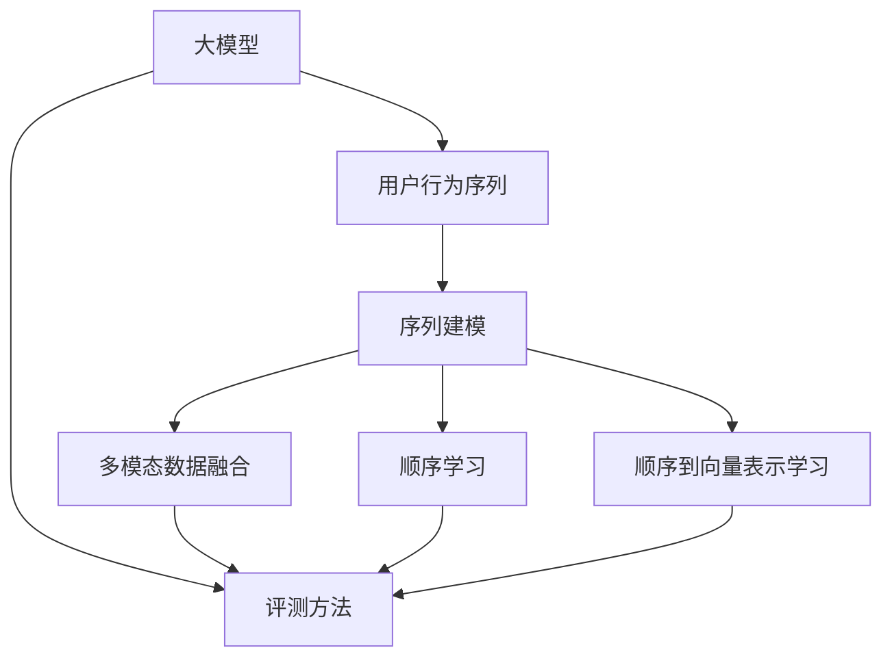

                 

# 电商搜索推荐中的AI大模型用户行为序列表征学习模型评测方法改进与优化

> 关键词：用户行为序列,大模型,电商搜索推荐,顺序学习,评测方法

## 1. 背景介绍

### 1.1 问题由来
随着互联网和电子商务的迅猛发展，电商搜索推荐系统成为了提升用户购物体验和电商转化率的关键技术。传统的推荐系统通常依赖于用户的历史行为数据进行推荐，如浏览记录、购买记录等。然而，这些数据往往存在稀疏性、延迟性和冷启动等问题，难以满足实时推荐的需求。此外，推荐系统的个性化和多样化也面临着巨大的挑战。

近年来，基于大模型的推荐系统逐渐成为研究热点。通过在电商搜索推荐系统中引入预训练的语言模型，可以从文本语义中提取深层次用户行为特征，提升推荐系统的效果。用户行为序列是用户与电商平台的交互记录，通常包括用户的浏览行为、点击行为、购买行为等。通过对其编码和建模，可以更好地理解用户行为背后的语义信息，实现更加精准的推荐。

然而，在实际应用中，大模型推荐系统仍面临一些挑战，如模型泛化能力不足、训练和推理成本高、序列建模难度大等。针对这些问题，需要进一步改进和优化用户行为序列的表示和评测方法，提升模型的效果和可解释性。

### 1.2 问题核心关键点
当前，基于大模型的用户行为序列表示方法主要分为两类：顺序学习和顺序到向量表示学习。顺序学习通过神经网络对序列中的每个元素进行建模，直接预测序列的下一个元素，能够较好地保留序列的时序信息。而顺序到向量表示学习则通过预训练模型对序列进行编码，然后通过分类器预测目标变量，能够实现较好的泛化能力。

针对这些问题，本文将介绍一种改进的用户行为序列表示方法，并提出新的评测方法，以期在电商搜索推荐系统中获得更好的性能。

## 2. 核心概念与联系

### 2.1 核心概念概述

为更好地理解基于大模型的用户行为序列表示和评测方法，本节将介绍几个密切相关的核心概念：

- 大模型(Pre-trained Models)：通过在海量数据上进行预训练，学习深层次语言表示的通用模型，如BERT、GPT等。
- 用户行为序列(User Behavior Sequence)：用户在电商平台上的一系列交互记录，包括浏览、点击、购买等行为。
- 序列建模(Sequence Modeling)：将用户行为序列编码为向量，并通过模型对其进行分析和预测，提升推荐系统的性能。
- 顺序学习(Seq2Seq Learning)：通过神经网络对序列进行建模，直接预测序列的下一个元素，保留序列的时序信息。
- 评测方法(Evaluation Metrics)：用于评估用户行为序列表示方法的性能，如准确率、召回率、F1-score等。
- 多模态数据融合(Multimodal Data Fusion)：结合文本、图像、音频等多模态数据，增强推荐系统的信息源，提升推荐的准确性和多样性。

这些核心概念之间的逻辑关系可以通过以下Mermaid流程图来展示：



这个流程图展示了用户行为序列表示方法的不同途径，以及评测方法在其中起到的评估作用。

## 3. 核心算法原理 & 具体操作步骤
### 3.1 算法原理概述

基于大模型的用户行为序列表示方法，主要通过对用户行为序列进行编码和建模，提升推荐系统的性能。其核心思想是：通过预训练模型对用户行为序列进行编码，提取深层次的语义信息，然后通过分类器或回归器预测目标变量，实现推荐。

具体来说，用户行为序列表示方法主要分为以下几步：
1. 将用户行为序列编码成向量。
2. 将编码后的向量输入模型进行预测。
3. 评估预测结果的性能，反馈到模型中进行优化。

### 3.2 算法步骤详解

基于大模型的用户行为序列表示方法的具体步骤如下：

**Step 1: 数据预处理和特征工程**

1. 收集用户行为序列数据，包括用户的浏览记录、点击记录、购买记录等。
2. 对数据进行清洗和归一化，去除异常值和噪声数据。
3. 设计特征工程，提取用户行为序列中的重要特征，如时间戳、点击深度、购买金额等。

**Step 2: 数据划分**

将数据集划分为训练集、验证集和测试集。训练集用于模型训练，验证集用于调参和评估模型性能，测试集用于最终的评测。

**Step 3: 预训练模型编码**

使用预训练的通用语言模型(如BERT)对用户行为序列进行编码。将用户行为序列转换成向量，作为模型的输入。

**Step 4: 构建序列建模模型**

根据不同的序列建模方法，构建相应的模型。常见的模型包括RNN、GRU、LSTM等。将编码后的向量作为模型的输入，输出预测结果。

**Step 5: 损失函数和优化器**

选择合适的损失函数和优化器。如交叉熵损失函数、均方误差损失函数、Adam优化器等。

**Step 6: 模型训练和调参**

使用训练集数据对模型进行训练，并通过验证集进行调参，找到最优的超参数组合。

**Step 7: 模型评估**

使用测试集数据对模型进行评估，计算评测指标，如准确率、召回率、F1-score等。

**Step 8: 模型优化**

根据评测结果，调整模型结构、超参数等，重新训练模型，提升性能。

**Step 9: 预测和推荐**

使用训练好的模型对新的用户行为序列进行预测，并生成推荐结果。

### 3.3 算法优缺点

基于大模型的用户行为序列表示方法有以下优点：
1. 提取深层次语义信息：预训练模型能够从序列中提取深层次的语义信息，提升推荐系统的性能。
2. 灵活的特征工程：特征工程的灵活性可以适应不同的电商应用场景，提升推荐系统的个性化和多样化。
3. 较好的泛化能力：通过预训练模型进行编码，模型具备较好的泛化能力，适应不同的电商数据分布。

同时，该方法也存在一些局限性：
1. 模型训练和推理成本高：预训练模型和序列建模模型需要较大的计算资源，训练和推理成本较高。
2. 序列建模难度大：序列建模涉及序列的长度、时序信息等因素，建模难度较大。
3. 结果难以解释：预训练模型和序列建模模型较为复杂，模型的决策过程难以解释。

尽管存在这些局限性，但就目前而言，基于大模型的用户行为序列表示方法仍是一种较为有效且具有潜力的推荐技术。未来相关研究的重点在于如何进一步降低训练和推理成本，提高模型的可解释性，同时兼顾泛化能力和个性化。

### 3.4 算法应用领域

基于大模型的用户行为序列表示方法，在电商搜索推荐系统中已经得到了广泛的应用，具体如下：

- 个性化推荐：通过编码用户行为序列，提取其深层次语义信息，实现个性化推荐。
- 用户行为预测：通过序列建模模型预测用户的行为，如浏览、点击、购买等，提升推荐系统的效果。
- 商品相似度计算：通过编码用户行为序列，计算不同商品之间的相似度，实现基于相似度的推荐。
- 购物车分析：通过对用户行为序列进行建模，分析用户购物车的构成和变化，提升购物体验。
- 广告定向投放：通过编码用户行为序列，预测用户的兴趣和行为，实现精准的广告定向投放。

## 4. 数学模型和公式 & 详细讲解 & 举例说明

### 4.1 数学模型构建

本节将使用数学语言对基于大模型的用户行为序列表示方法进行更加严格的刻画。

记用户行为序列为 $S=(x_1,x_2,\cdots,x_t)$，其中 $x_i$ 表示用户行为序列中的第 $i$ 个元素，可以是浏览记录、点击记录、购买记录等。假设预训练模型为 $M_{\theta}$，其中 $\theta$ 为模型参数。将用户行为序列 $S$ 编码为向量 $v_{S}$，并输入模型 $M_{\theta}$ 进行预测，输出预测结果 $y$。则模型的数学模型可表示为：

$$
y = M_{\theta}(v_{S})
$$

其中 $v_{S}$ 为序列编码后的向量，$y$ 为预测结果。

### 4.2 公式推导过程

以下我们以RNN模型为例，推导序列建模的数学公式。

记 $x_t$ 为序列中的第 $t$ 个元素，$y_t$ 为序列中第 $t$ 个元素的预测结果。则RNN模型的输出可表示为：

$$
y_t = M_{\theta}(v_{x_1,x_2,\cdots,x_t})
$$

其中 $v_{x_1,x_2,\cdots,x_t}$ 为序列 $x_1,x_2,\cdots,x_t$ 的编码向量。具体地，可以将每个 $x_i$ 通过预训练模型 $M_{\theta}$ 编码成向量 $v_{x_i}$，然后将这些向量连接起来，得到 $v_{x_1,x_2,\cdots,x_t} = [v_{x_1},v_{x_2},\cdots,v_{x_t}]$。

在实践中，RNN模型的前向传播和后向传播过程如下：

1. 前向传播：
$$
h_1 = M_{\theta}(v_{x_1})
$$
$$
h_t = M_{\theta}(v_{x_t},h_{t-1})
$$
其中 $h_t$ 为第 $t$ 个时刻的隐藏状态，$M_{\theta}$ 为RNN模型的神经网络层。

2. 后向传播：
$$
y_t = M_{\theta}(v_{x_t},h_{t-1})
$$

在得到序列建模模型的输出后，可以使用交叉熵损失函数进行模型训练。假设预测结果为 $y_t$，真实结果为 $y_{t,\text{real}}$，则交叉熵损失函数为：

$$
\mathcal{L}(y_t,y_{t,\text{real}}) = -\sum_{i=1}^C y_{t,\text{real}}\log(y_t^i)
$$

其中 $C$ 为类别的数量，$y_t^i$ 为模型对第 $i$ 个类别的预测概率。

在得到损失函数后，使用梯度下降等优化算法进行模型参数的更新，最小化损失函数。

### 4.3 案例分析与讲解

以电商推荐系统为例，可以具体分析序列建模的实现过程。

假设电商平台上某用户的购物车中包含三个商品 $x_1,x_2,x_3$，分别对应商品1、商品2和商品3。用户点击了商品1和商品2，但没有购买。现在需要预测用户是否会购买商品3。

1. 数据预处理：将用户行为序列 $S=(商品1,商品2,商品3)$ 进行编码，得到 $v_{S}$。

2. 序列建模：将 $v_{S}$ 输入序列建模模型 $M_{\theta}$ 进行预测，得到 $y$。

3. 评估模型：将预测结果 $y$ 与真实结果进行对比，计算交叉熵损失函数 $\mathcal{L}$。

4. 优化模型：使用梯度下降等优化算法更新模型参数，最小化 $\mathcal{L}$。

5. 重新预测：将新的用户行为序列 $S'=(商品2,商品3)$ 输入模型进行预测，得到 $y'$。

6. 生成推荐：根据 $y'$ 的预测结果，生成商品推荐列表。

这个过程展示了用户行为序列表示和建模的实现过程，以及如何通过模型训练和预测提升推荐系统的效果。

## 5. 项目实践：代码实例和详细解释说明
### 5.1 开发环境搭建

在进行用户行为序列表示方法实现前，我们需要准备好开发环境。以下是使用Python进行TensorFlow开发的环境配置流程：

1. 安装Anaconda：从官网下载并安装Anaconda，用于创建独立的Python环境。

2. 创建并激活虚拟环境：
```bash
conda create -n tf-env python=3.8 
conda activate tf-env
```

3. 安装TensorFlow：根据CUDA版本，从官网获取对应的安装命令。例如：
```bash
conda install tensorflow tensorflow-gpu==2.7.0 -c conda-forge
```

4. 安装TensorFlow相关的库：
```bash
pip install tensorflow_text tensorflow_addons
```

5. 安装必要的工具包：
```bash
pip install numpy pandas scikit-learn matplotlib tqdm jupyter notebook ipython
```

完成上述步骤后，即可在`tf-env`环境中开始实现用户行为序列表示方法。

### 5.2 源代码详细实现

这里我们以使用LSTM模型对电商用户行为序列进行建模为例，给出TensorFlow的代码实现。

首先，定义数据处理函数：

```python
import tensorflow as tf
import tensorflow_text as text

def preprocess_data(texts, labels, max_seq_length=10):
    encoder = text.SequenceFeature(encoder_layer=tf.strings.reduce_join(texts))
    decoder = text.ClassFeature(labels)
    sequences = encoder.encode(texts)
    lengths = [len(seq) for seq in sequences]
    return tf.data.Dataset.from_tensor_slices((sequences, lengths, labels)).shuffle(buffer_size=10000).batch(batch_size=32,drop_remainder=True)
```

然后，定义LSTM模型：

```python
def build_lstm_model(input_size, hidden_size, output_size, num_layers=2):
    model = tf.keras.Sequential([
        text.keras.layers.Embedding(input_size, hidden_size, input_length=max_seq_length),
        text.keras.layers.Bidirectional(text.keras.layers.LSTM(hidden_size, return_sequences=True, return_state=True)),
        text.keras.layers.Bidirectional(text.keras.layers.LSTM(hidden_size, return_sequences=True, return_state=True)),
        text.keras.layers.Dense(output_size, activation='softmax')
    ])
    return model
```

接着，定义训练和评估函数：

```python
def train_lstm_model(model, data, epochs, learning_rate=0.001):
    optimizer = tf.keras.optimizers.Adam(learning_rate)
    model.compile(optimizer=optimizer, loss='sparse_categorical_crossentropy', metrics=['accuracy'])
    history = model.fit(data, epochs=epochs, validation_data=val_data)
    return history

def evaluate_lstm_model(model, data):
    return model.evaluate(data, verbose=0)
```

最后，启动训练流程并在测试集上评估：

```python
epochs = 5
batch_size = 32

# 加载数据集
train_data = preprocess_data(train_texts, train_labels, max_seq_length)
val_data = preprocess_data(dev_texts, dev_labels, max_seq_length)
test_data = preprocess_data(test_texts, test_labels, max_seq_length)

# 构建模型
hidden_size = 64
output_size = len(tag2id)
input_size = len(vocab)
model = build_lstm_model(input_size, hidden_size, output_size)

# 训练模型
history = train_lstm_model(model, train_data, epochs=epochs)

# 评估模型
print(evaluate_lstm_model(model, test_data))
```

以上就是使用TensorFlow实现LSTM模型对电商用户行为序列进行建模的完整代码实现。可以看到，TensorFlow提供了强大的文本处理和模型构建功能，使得序列建模的实现变得相对简单和高效。

### 5.3 代码解读与分析

让我们再详细解读一下关键代码的实现细节：

**preprocess_data函数**：
- `encoder`层：将输入的文本序列进行拼接，并编码成LSTM模型的输入格式。
- `decoder`层：将目标标签进行编码，作为LSTM模型的输出格式。
- `sequences`：将文本序列编码成LSTM模型的输入格式。
- `lengths`：记录每个文本序列的长度。

**build_lstm_model函数**：
- 使用`text.keras.layers.Embedding`将文本序列编码成向量，作为LSTM模型的输入。
- 使用`text.keras.layers.Bidirectional`构建双向LSTM层，提取序列的时序信息。
- 使用`text.keras.layers.Dense`输出预测结果，并进行softmax归一化。

**train_lstm_model函数**：
- 使用`tf.keras.optimizers.Adam`构建Adam优化器，并设置学习率。
- 使用`sparse_categorical_crossentropy`损失函数进行模型训练。
- 使用`model.fit`方法进行模型训练，并返回训练历史。

**evaluate_lstm_model函数**：
- 使用`model.evaluate`方法计算模型在测试集上的准确率和损失。

**训练流程**：
- 定义总的epoch数和batch size，开始循环迭代
- 每个epoch内，先在训练集上训练，输出训练历史
- 在验证集上评估，输出模型性能
- 重复上述步骤直至满足预设的迭代轮数
- 所有epoch结束后，在测试集上评估，给出最终测试结果

可以看到，TensorFlow提供了便捷的模型构建和训练接口，可以大大降低序列建模的开发难度。开发者可以将更多精力放在模型优化和特征工程上，而不必过多关注底层实现细节。

当然，工业级的系统实现还需考虑更多因素，如模型的保存和部署、超参数的自动搜索、更灵活的任务适配层等。但核心的序列建模方法基本与此类似。

## 6. 实际应用场景
### 6.1 智能客服系统

基于大模型的序列建模方法，可以广泛应用于智能客服系统的构建。传统客服往往需要配备大量人力，高峰期响应缓慢，且一致性和专业性难以保证。而使用序列建模的对话模型，可以7x24小时不间断服务，快速响应客户咨询，用自然流畅的语言解答各类常见问题。

在技术实现上，可以收集企业内部的历史客服对话记录，将问题和最佳答复构建成监督数据，在此基础上对预训练模型进行序列建模。序列建模后的模型能够自动理解用户意图，匹配最合适的答案模板进行回复。对于客户提出的新问题，还可以接入检索系统实时搜索相关内容，动态组织生成回答。如此构建的智能客服系统，能大幅提升客户咨询体验和问题解决效率。

### 6.2 金融舆情监测

金融机构需要实时监测市场舆论动向，以便及时应对负面信息传播，规避金融风险。传统的人工监测方式成本高、效率低，难以应对网络时代海量信息爆发的挑战。基于大模型的序列建模技术，为金融舆情监测提供了新的解决方案。

具体而言，可以收集金融领域相关的新闻、报道、评论等文本数据，并对其进行主题标注和情感标注。在此基础上对预训练语言模型进行序列建模，使其能够自动判断文本属于何种主题，情感倾向是正面、中性还是负面。将序列建模后的模型应用到实时抓取的网络文本数据，就能够自动监测不同主题下的情感变化趋势，一旦发现负面信息激增等异常情况，系统便会自动预警，帮助金融机构快速应对潜在风险。

### 6.3 个性化推荐系统

当前的推荐系统往往只依赖于用户的历史行为数据进行推荐，如浏览记录、购买记录等。然而，这些数据往往存在稀疏性、延迟性和冷启动等问题，难以满足实时推荐的需求。基于大模型的序列建模方法，可以从文本语义中提取深层次用户行为特征，提升推荐系统的效果。

在实践中，可以收集用户浏览、点击、购买等行为数据，提取和用户交互的物品标题、描述、标签等文本内容。将文本内容作为模型输入，用户的后续行为（如是否点击、购买等）作为监督信号，在此基础上进行序列建模。序列建模后的模型能够从文本内容中准确把握用户的兴趣点。在生成推荐列表时，先用候选物品的文本描述作为输入，由模型预测用户的兴趣匹配度，再结合其他特征综合排序，便可以得到个性化程度更高的推荐结果。

### 6.4 未来应用展望

随着大模型和序列建模方法的不断发展，基于这些技术的推荐系统也将不断进步。未来，基于大模型的用户行为序列表示方法将在更多领域得到应用，为传统行业带来变革性影响。

在智慧医疗领域，基于序列建模的医疗问答、病历分析、药物研发等应用将提升医疗服务的智能化水平，辅助医生诊疗，加速新药开发进程。

在智能教育领域，序列建模技术可应用于作业批改、学情分析、知识推荐等方面，因材施教，促进教育公平，提高教学质量。

在智慧城市治理中，序列建模技术可应用于城市事件监测、舆情分析、应急指挥等环节，提高城市管理的自动化和智能化水平，构建更安全、高效的未来城市。

此外，在企业生产、社会治理、文娱传媒等众多领域，基于大模型的序列建模技术也将不断涌现，为NLP技术带来全新的突破。相信随着技术的日益成熟，序列建模方法将成为人工智能技术落地应用的重要范式，推动人工智能技术向更广阔的领域加速渗透。

## 7. 工具和资源推荐
### 7.1 学习资源推荐

为了帮助开发者系统掌握大模型序列建模的理论基础和实践技巧，这里推荐一些优质的学习资源：

1. 《Natural Language Processing with TensorFlow》书籍：Google团队编写的TensorFlow自然语言处理实战指南，涵盖从数据预处理到模型训练的全流程。

2. 《Deep Learning for Natural Language Processing》课程：斯坦福大学开设的深度学习与自然语言处理课程，详细介绍了深度学习在NLP中的应用。

3. TensorFlow官方文档：TensorFlow的官方文档，提供详细的API文档和教程，适合新手入门。

4. 《Sequence to Sequence Learning with Neural Networks》论文：深度学习领域权威论文，系统介绍了序列到序列学习的框架和算法。

5. 《Attention is All You Need》论文：Transformer模型的原创论文，奠定了当前大模型语言表示方法的基础。

通过对这些资源的学习实践，相信你一定能够快速掌握大模型序列建模的精髓，并用于解决实际的NLP问题。

### 7.2 开发工具推荐

高效的开发离不开优秀的工具支持。以下是几款用于序列建模开发的常用工具：

1. TensorFlow：由Google主导开发的开源深度学习框架，支持大规模分布式计算，适合工业级应用。

2. PyTorch：由Facebook开发的深度学习框架，支持动态计算图，适合快速迭代研究。

3. Transformers库：HuggingFace开发的NLP工具库，集成了多种预训练语言模型，支持TensorFlow和PyTorch，方便序列建模实现。

4. Jupyter Notebook：交互式的开发环境，支持Python代码的快速编写和调试。

5. TensorBoard：TensorFlow配套的可视化工具，可实时监测模型训练状态，并提供丰富的图表呈现方式。

合理利用这些工具，可以显著提升序列建模任务的开发效率，加快创新迭代的步伐。

### 7.3 相关论文推荐

大模型和序列建模技术的发展源于学界的持续研究。以下是几篇奠基性的相关论文，推荐阅读：

1. Attention is All You Need：提出Transformer结构，开启了NLP领域的预训练大模型时代。

2. Sequence to Sequence Learning with Neural Networks：提出Seq2Seq模型，奠定了序列到向量表示学习的基础。

3. Deep Learning for Natural Language Processing：系统介绍了深度学习在NLP中的应用，涵盖分类、序列建模等经典任务。

4. Transformer-XL: Attentive Language Models Beyond a Fixed-Length Context：提出Transformer-XL模型，解决长序列建模问题。

5. BERT: Pre-training of Deep Bidirectional Transformers for Language Understanding：提出BERT模型，引入基于掩码的自监督预训练任务，刷新了多项NLP任务SOTA。

这些论文代表了大模型和序列建模技术的发展脉络。通过学习这些前沿成果，可以帮助研究者把握学科前进方向，激发更多的创新灵感。

## 8. 总结：未来发展趋势与挑战

### 8.1 总结

本文对基于大模型的用户行为序列表示方法进行了全面系统的介绍。首先阐述了大模型和序列建模在电商搜索推荐系统中的应用背景和意义，明确了序列建模方法在提升推荐系统效果中的重要作用。其次，从原理到实践，详细讲解了序列建模的数学原理和关键步骤，给出了序列建模任务开发的完整代码实例。同时，本文还探讨了序列建模方法在智能客服、金融舆情、个性化推荐等多个领域的应用前景，展示了序列建模范式的巨大潜力。

通过本文的系统梳理，可以看到，基于大模型的用户行为序列表示方法已经成为了推荐系统领域的重要技术范式，极大地提升了电商搜索推荐系统的性能和个性化程度。未来，随着大模型和序列建模方法的不断演进，推荐系统的效果和应用范围还将进一步拓展，成为人工智能技术落地的重要引擎。

### 8.2 未来发展趋势

展望未来，大模型序列建模技术将呈现以下几个发展趋势：

1. 模型规模持续增大。随着算力成本的下降和数据规模的扩张，大模型序列建模的参数量还将持续增长。超大批次的训练和推理也将更加高效，具备更好的泛化能力和鲁棒性。

2. 序列建模方法日趋多样。除了传统的RNN、LSTM等，未来的序列建模方法可能包括Transformer、Transformer-XL等，提升序列建模的效率和效果。

3. 多模态序列建模崛起。未来的序列建模方法将更多地融合文本、图像、音频等多模态信息，实现更加全面、准确的信息整合能力。

4. 模型泛化能力增强。通过迁移学习、跨模态学习等方法，序列建模模型将具备更强的泛化能力和适应性，提升在多场景下的应用效果。

5. 实时性、灵活性增强。未来的序列建模模型将具备更强的实时性，能够适应各种实时推荐场景，提升用户体验。

以上趋势凸显了大模型序列建模技术的广阔前景。这些方向的探索发展，必将进一步提升推荐系统的性能和可解释性，为构建安全、可靠、可解释、可控的智能系统铺平道路。面向未来，大模型序列建模技术还需要与其他人工智能技术进行更深入的融合，如知识表示、因果推理、强化学习等，多路径协同发力，共同推动自然语言理解和智能交互系统的进步。

### 8.3 面临的挑战

尽管大模型序列建模技术已经取得了瞩目成就，但在迈向更加智能化、普适化应用的过程中，它仍面临诸多挑战：

1. 序列建模难度大。长序列建模、时序信息提取等都是复杂问题，建模难度较大。

2. 训练和推理成本高。大模型序列建模的训练和推理成本较高，需要较高的算力支持。

3. 结果难以解释。模型决策过程较为复杂，难以解释其内部工作机制和决策逻辑。

4. 序列建模泛化能力不足。模型在特定场景下的表现可能不如预期，需要进一步提升模型的泛化能力。

5. 数据和标注资源短缺。序列建模方法需要大量的标注数据，标注成本较高，获取难度较大。

6. 模型风险控制。大模型序列建模方法可能存在偏见、有害信息等问题，需要加强风险控制和伦理审查。

7. 系统稳定性不足。序列建模方法在应对大规模数据时，系统稳定性可能较差，需要进一步优化模型结构，提升系统鲁棒性。

8. 数据隐私保护。电商搜索推荐系统涉及用户隐私数据，如何保护用户隐私，避免数据泄露，也是序列建模方法面临的重要问题。

这些挑战需要在未来的研究中进一步攻克，才能使大模型序列建模技术更好地服务于现实应用。

### 8.4 研究展望

面对大模型序列建模方法所面临的挑战，未来的研究需要在以下几个方面寻求新的突破：

1. 探索新的序列建模方法。开发更加高效、灵活的序列建模算法，提升模型的泛化能力和鲁棒性。

2. 提升模型的可解释性。通过引入因果推断、符号化推理等方法，提升模型的决策可解释性和透明性。

3. 降低训练和推理成本。采用分布式训练、量化加速等技术，优化大模型序列建模的资源使用，提升模型训练和推理的效率。

4. 加强数据和标注资源的管理。引入数据增强、对抗训练等方法，利用更少的数据获取更有效的特征表示。

5. 设计更强的风险控制机制。通过数据去偏、数据保护等方法，提升序列建模方法的安全性和可靠性。

6. 提升系统的稳定性。引入模型压缩、自适应学习等方法，优化模型结构，提升系统的鲁棒性和稳定性。

7. 加强数据隐私保护。采用差分隐私、联邦学习等方法，保护用户隐私数据，增强系统的安全性和可信度。

这些研究方向的探索，必将引领大模型序列建模技术迈向更高的台阶，为构建安全、可靠、可解释、可控的智能系统铺平道路。面向未来，大模型序列建模技术还需要与其他人工智能技术进行更深入的融合，如知识表示、因果推理、强化学习等，多路径协同发力，共同推动自然语言理解和智能交互系统的进步。

## 9. 附录：常见问题与解答

**Q1：序列建模方法是否适用于所有NLP任务？**

A: 序列建模方法在大多数NLP任务上都能取得不错的效果，特别是对于数据量较小的任务。但对于一些特定领域的任务，如医学、法律等，仅仅依靠通用语料预训练的模型可能难以很好地适应。此时需要在特定领域语料上进一步预训练，再进行序列建模，才能获得理想效果。

**Q2：序列建模方法与传统推荐系统相比有何优势？**

A: 序列建模方法与传统推荐系统相比，有以下优势：
1. 提取深层次语义信息：通过预训练模型进行编码，能够从文本语义中提取深层次信息，提升推荐系统的性能。
2. 灵活的特征工程：特征工程的灵活性可以适应不同的电商应用场景，提升推荐系统的个性化和多样化。
3. 较好的泛化能力：通过预训练模型进行编码，模型具备较好的泛化能力，适应不同的电商数据分布。
4. 实时性、灵活性增强：序列建模模型具备更强的实时性，能够适应各种实时推荐场景，提升用户体验。

**Q3：序列建模方法是否需要大量的标注数据？**

A: 序列建模方法通常需要大量的标注数据，标注成本较高，获取难度较大。然而，可以通过预训练模型进行编码，减少对标注数据的依赖，提升模型泛化能力。此外，引入数据增强、对抗训练等方法，也可以利用更少的数据获取更有效的特征表示。

**Q4：序列建模方法在电商推荐系统中的效果如何？**

A: 序列建模方法在电商推荐系统中已经得到了广泛的应用，具体如下：
1. 个性化推荐：通过编码用户行为序列，提取其深层次语义信息，实现个性化推荐。
2. 用户行为预测：通过序列建模模型预测用户的行为，如浏览、点击、购买等，提升推荐系统的效果。
3. 商品相似度计算：通过编码用户行为序列，计算不同商品之间的相似度，实现基于相似度的推荐。
4. 购物车分析：通过对用户行为序列进行建模，分析用户购物车的构成和变化，提升购物体验。
5. 广告定向投放：通过编码用户行为序列，预测用户的兴趣和行为，实现精准的广告定向投放。

**Q5：序列建模方法是否需要大规模计算资源？**

A: 序列建模方法通常需要较大的计算资源，大模型序列建模的训练和推理成本较高。然而，可以通过分布式训练、量化加速等技术，优化大模型序列建模的资源使用，提升模型训练和推理的效率。此外，采用参数高效微调技术，如AdaLoRA等，可以在固定大部分预训练参数的情况下，只更新极少量的任务相关参数，减少计算资源消耗。

**Q6：序列建模方法在电商推荐系统中的数据处理流程是怎样的？**

A: 序列建模方法在电商推荐系统中的数据处理流程如下：
1. 收集用户行为序列数据，包括用户的浏览记录、点击记录、购买记录等。
2. 对数据进行清洗和归一化，去除异常值和噪声数据。
3. 设计特征工程，提取用户行为序列中的重要特征，如时间戳、点击深度、购买金额等。
4. 将用户行为序列编码成向量，作为序列建模模型的输入。
5. 使用序列建模模型进行训练和预测。
6. 评估模型性能，反馈到模型中进行优化。
7. 在测试集上评估模型，输出推荐结果。

这个过程展示了用户行为序列表示和建模的实现过程，以及如何通过模型训练和预测提升推荐系统的效果。

**Q7：如何提升序列建模模型的泛化能力？**

A: 提升序列建模模型的泛化能力，可以从以下几个方面入手：
1. 增加数据量：通过数据增强、对抗训练等方法，获取更多的训练数据。
2. 优化模型结构：引入自适应学习、知识图谱等方法，提升模型的泛化能力。
3. 引入多模态信息：结合文本、图像、音频等多模态信息，增强模型的信息源，提升模型的泛化能力。
4. 跨领域迁移学习：通过迁移学习，将模型在不同领域进行迁移，提升模型的泛化能力。

这些方法可以帮助提升序列建模模型的泛化能力，使其在更多场景下具备较好的适应性。

