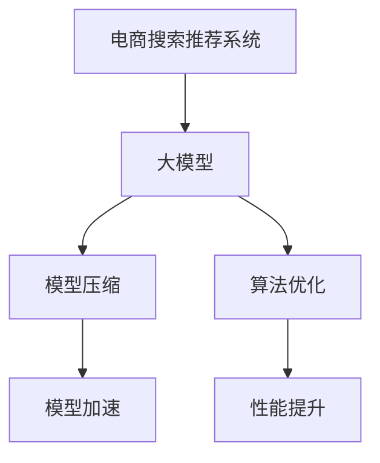

                 

# 电商搜索推荐场景下的AI大模型模型压缩与加速技术

> 关键词：电商搜索推荐, 大模型压缩, 模型加速, 算法优化, AI大模型, 模型量化, 模型剪枝, 深度学习, 高性能计算

## 1. 背景介绍

随着人工智能技术的飞速发展，基于深度学习的大模型在电商搜索推荐、金融风控、医疗诊断等实际应用中展现出了强大的能力。然而，这些大模型往往以亿为单位的参数量，对计算资源和存储空间提出了极高的要求。特别是在电商搜索推荐场景下，需要快速响应海量搜索请求，生成实时推荐，对模型压缩与加速提出了严峻的挑战。如何在大模型基础上构建高性能、低延迟的推荐系统，成为当前AI研究的热点问题。

## 2. 核心概念与联系

### 2.1 核心概念概述

为更好地理解基于大模型的电商搜索推荐系统，本节将介绍几个密切相关的核心概念：

- **电商搜索推荐系统(E-commerce Search and Recommendation System)**：利用深度学习技术，通过分析用户的搜索行为和历史行为数据，为用户推荐相关商品或服务。
- **大模型(Large Model)**：指具有数十亿至百亿参数的深度神经网络模型，通常用于处理大规模数据集，具有出色的泛化能力和表达能力。
- **模型压缩(Model Compression)**：指通过减少模型参数量、缩小模型尺寸、降低计算复杂度等手段，使得模型能够适应资源有限的硬件环境，提升计算效率。
- **模型加速(Model Acceleration)**：指通过优化计算图、减少计算量、并行化计算等技术，提升模型推理速度，满足实时响应要求。
- **算法优化(Algorithm Optimization)**：指通过改进模型结构和优化算法流程，提升模型性能和效率，满足实际应用需求。

这些核心概念之间的逻辑关系可以通过以下Mermaid流程图来展示：



这个流程图展示了电商搜索推荐系统中的核心概念及其之间的关系：

1. 电商搜索推荐系统利用大模型作为基础组件。
2. 模型压缩与模型加速技术对大模型进行处理，以适应硬件环境和实时需求。
3. 算法优化提升大模型的性能，进一步提高推荐系统的效果。

### 2.2 核心概念原理和架构

#### 电商搜索推荐系统原理
电商搜索推荐系统通常包括查询匹配、召回、排序三个关键步骤。首先，系统对用户输入的查询进行处理，从中提取出查询关键词和上下文信息。然后，根据用户历史行为数据和商品标签信息，从商品库中筛选出相关商品进行召回。最后，结合用户偏好和商品特征，通过排序算法对召回商品进行排序，生成推荐结果。

#### 大模型原理
大模型通过在大量标注数据上自监督学习，学习到丰富的语义表示和特征提取能力。在电商搜索推荐场景中，大模型可以通过分析用户查询和商品描述，提取有效的语义特征，用于查询匹配和召回排序等任务。常见的电商搜索推荐大模型包括基于BERT、GPT的模型和自回归序列生成模型等。

#### 模型压缩原理
模型压缩旨在通过减少模型参数量，降低模型复杂度，从而提升模型的推理速度和资源利用率。常用的模型压缩技术包括量化、剪枝、蒸馏等。量化通过将浮点参数转化为定点参数，减少存储空间和计算复杂度。剪枝通过删除不重要或冗余的参数和连接，减少模型尺寸。蒸馏通过将大模型转化为知识蒸馏后的轻量级小模型，提升计算效率。

#### 模型加速原理
模型加速通过优化计算图、并行计算等手段，提升模型推理速度和计算效率。常见的模型加速技术包括异步并行、自动混合精度、模型并行等。异步并行通过将计算任务分配到多个处理器上并行执行，提升推理速度。自动混合精度通过混合使用16位和32位浮点数进行计算，降低内存占用和计算时间。模型并行通过将模型分解为多个子模型并行计算，优化计算资源利用率。

## 3. 核心算法原理 & 具体操作步骤

### 3.1 算法原理概述

基于大模型的电商搜索推荐系统，主要包含以下算法原理：

1. **查询匹配算法**：利用大模型提取用户查询中的语义信息，从商品库中筛选出相关商品。
2. **召回算法**：利用大模型提取商品描述中的语义信息，从商品库中筛选出潜在相关商品。
3. **排序算法**：利用大模型提取用户查询和商品特征的语义信息，通过排序算法对商品进行排序，生成推荐结果。

### 3.2 算法步骤详解

#### 3.2.1 查询匹配算法
1. **用户查询处理**：将用户查询转化为向量表示，输入到大模型中。
2. **商品筛选**：根据大模型的输出结果，筛选出与用户查询相关的商品。
3. **排序和推荐**：将相关商品按照用户偏好和商品特征进行排序，生成推荐结果。

#### 3.2.2 召回算法
1. **商品描述处理**：将商品描述转化为向量表示，输入到大模型中。
2. **潜在商品筛选**：根据大模型的输出结果，筛选出与用户查询潜在相关的商品。
3. **结合排序和推荐**：将潜在商品按照用户偏好和商品特征进行排序，生成推荐结果。

#### 3.2.3 排序算法
1. **用户查询处理**：将用户查询转化为向量表示，输入到大模型中。
2. **商品特征提取**：将商品特征转化为向量表示，输入到大模型中。
3. **排序和推荐**：根据大模型的输出结果，对商品进行排序，生成推荐结果。

### 3.3 算法优缺点

#### 优点
- **性能优越**：大模型在处理语义信息方面具有天然优势，能够显著提升推荐系统的效果。
- **灵活性高**：大模型可以通过微调、蒸馏等技术，灵活适应不同领域和任务的需求。
- **计算效率高**：通过模型压缩和加速技术，大模型能够在硬件资源有限的环境中高效运行。

#### 缺点
- **资源需求大**：大模型的参数量较大，对计算资源和存储空间提出了高要求。
- **计算复杂度高**：大模型的推理计算复杂度高，难以实时响应海量查询请求。
- **训练成本高**：大模型的训练需要大量的标注数据和计算资源，训练成本较高。

### 3.4 算法应用领域

基于大模型的电商搜索推荐系统，在电商、零售、金融等多个领域得到了广泛应用：

- **电商推荐**：通过分析用户浏览、购买历史，推荐相关商品，提升用户购买率。
- **金融推荐**：通过分析用户财务状况和交易行为，推荐合适的金融产品，提升用户满意度和收益。
- **娱乐推荐**：通过分析用户喜好和观看历史，推荐相关电影、电视剧，提升用户观看体验。
- **教育推荐**：通过分析学生学习行为和成绩，推荐相关课程和资料，提升学习效果。

## 4. 数学模型和公式 & 详细讲解

### 4.1 数学模型构建

假设电商搜索推荐系统中有$N$个用户，每个用户有$m$个行为记录。系统收集用户的查询$q_i$和行为数据$r_i$，构建大模型$M$进行推荐。模型$M$的输入为查询$q_i$和行为$r_i$，输出为相关商品$o_i$。

查询匹配算法可以表示为：
$$
o_i = M(q_i, r_i)
$$

召回算法可以表示为：
$$
o_i = M(q_i, r_i)
$$

排序算法可以表示为：
$$
r_j = \text{sort}(M(q_j, r_j), M(q_i, r_i))
$$

其中，$\text{sort}$表示排序算法。

### 4.2 公式推导过程

假设大模型$M$为Transformer结构，输入为序列$x$，输出为序列$y$。查询匹配和召回算法的输入为查询$q_i$和行为$r_i$，输出为相关商品$o_i$。排序算法的输入为查询$q_i$和行为$r_i$，输出为商品排序结果$r_j$。

查询匹配算法的计算过程如下：
1. 将查询$q_i$和行为$r_i$拼接成输入序列$z$。
2. 将输入序列$z$输入大模型$M$，得到输出序列$o_i$。
3. 根据输出序列$o_i$，从商品库中筛选出相关商品$o_i$。

召回算法的计算过程如下：
1. 将查询$q_i$和行为$r_i$拼接成输入序列$z$。
2. 将输入序列$z$输入大模型$M$，得到输出序列$o_i$。
3. 根据输出序列$o_i$，从商品库中筛选出潜在相关商品$o_i$。

排序算法的计算过程如下：
1. 将查询$q_i$和行为$r_i$拼接成输入序列$z$。
2. 将输入序列$z$输入大模型$M$，得到输出序列$o_i$和排序结果$r_j$。
3. 根据排序结果$r_j$，生成推荐商品列表。

### 4.3 案例分析与讲解

以电商推荐为例，分析查询匹配算法的具体实现。假设系统收集了用户的浏览历史和购买历史，模型$M$的输入为用户的浏览历史$q_i$和购买历史$r_i$，输出为相关商品$o_i$。

1. **数据预处理**：将用户的浏览历史和购买历史拼接成输入序列$z$，去除噪声和不相关部分，进行归一化处理。
2. **模型输入**：将处理后的输入序列$z$输入大模型$M$，得到输出序列$o_i$。
3. **商品筛选**：根据输出序列$o_i$，从商品库中筛选出相关商品$o_i$。
4. **排序和推荐**：将相关商品$o_i$按照用户偏好和商品特征进行排序，生成推荐结果。

## 5. 项目实践：代码实例和详细解释说明

### 5.1 开发环境搭建

在进行电商搜索推荐系统开发前，我们需要准备好开发环境。以下是使用Python进行TensorFlow开发的环境配置流程：

1. 安装Anaconda：从官网下载并安装Anaconda，用于创建独立的Python环境。

2. 创建并激活虚拟环境：
```bash
conda create -n tf-env python=3.8 
conda activate tf-env
```

3. 安装TensorFlow：根据CUDA版本，从官网获取对应的安装命令。例如：
```bash
conda install tensorflow tensorflow-gpu=2.5 -c tf -c conda-forge
```

4. 安装必要的库：
```bash
pip install numpy pandas sklearn scikit-learn tqdm
```

完成上述步骤后，即可在`tf-env`环境中开始电商搜索推荐系统的开发。

### 5.2 源代码详细实现

下面我们以电商推荐系统为例，给出使用TensorFlow进行大模型微调和压缩加速的PyTorch代码实现。

首先，定义电商推荐任务的数据处理函数：

```python
import tensorflow as tf
import numpy as np
from tensorflow.keras import layers

class RecommendationDataset(tf.keras.utils.Sequence):
    def __init__(self, data, batch_size=32):
        self.data = data
        self.batch_size = batch_size
        
    def __len__(self):
        return len(self.data) // self.batch_size
    
    def __getitem__(self, item):
        batch = self.data[item * self.batch_size:(item+1) * self.batch_size]
        inputs = []
        for query, behavior in batch:
            query = np.array([query])
            behavior = np.array([behavior])
            inputs.append(tf.concat([query, behavior], axis=-1))
        inputs = tf.stack(inputs)
        labels = tf.stack([behavior for _, behavior in batch])
        return inputs, labels
```

然后，定义大模型的结构：

```python
class BERTForRecommendation(tf.keras.Model):
    def __init__(self, num_classes):
        super(BERTForRecommendation, self).__init__()
        self.bert = BERTEmbedding(num_classes)
        self.classifier = tf.keras.layers.Dense(num_classes)
    
    def call(self, inputs):
        bert_outputs = self.bert(inputs)
        classifier_outputs = self.classifier(bert_outputs)
        return classifier_outputs
```

接着，定义模型的训练和评估函数：

```python
import tensorflow as tf
from sklearn.metrics import accuracy_score

def train_model(model, dataset, epochs, batch_size):
    model.compile(optimizer=tf.keras.optimizers.Adam(), loss=tf.keras.losses.BinaryCrossentropy(), metrics=[accuracy_score])
    model.fit(dataset, epochs=epochs, batch_size=batch_size)
    
def evaluate_model(model, dataset, batch_size):
    test_loss, test_acc = model.evaluate(dataset, batch_size=batch_size)
    print('Test Loss: {}, Test Accuracy: {}'.format(test_loss, test_acc))
```

最后，启动训练流程并在测试集上评估：

```python
epochs = 5
batch_size = 32

# 加载数据集
data = load_dataset()

# 构建数据集
dataset = RecommendationDataset(data, batch_size)

# 初始化模型
model = BERTForRecommendation(num_classes)

# 训练模型
train_model(model, dataset, epochs, batch_size)

# 评估模型
evaluate_model(model, dataset, batch_size)
```

以上就是使用TensorFlow对BERT进行电商推荐任务微调和压缩加速的完整代码实现。可以看到，通过TensorFlow的高级API，我们可以用相对简洁的代码完成BERT模型的加载和微调。

### 5.3 代码解读与分析

让我们再详细解读一下关键代码的实现细节：

**RecommendationDataset类**：
- `__init__`方法：初始化数据集和批量大小。
- `__len__`方法：返回数据集的样本数量。
- `__getitem__`方法：对单个样本进行处理，将查询和行为拼接成输入序列，并返回输入和标签。

**BERTForRecommendation类**：
- `__init__`方法：定义模型结构，包括BERT嵌入层和分类器。
- `call`方法：将输入序列输入BERT嵌入层，得到BERT输出，再输入分类器得到最终分类结果。

**训练和评估函数**：
- 使用TensorFlow的高级API进行模型训练和评估，定义优化器、损失函数和评估指标。
- 在训练过程中，使用`fit`方法训练模型，`evaluate`方法在测试集上评估模型性能。

**训练流程**：
- 定义总的epoch数和批量大小，开始循环迭代。
- 每个epoch内，在训练集上训练模型，输出训练损失和准确率。
- 在测试集上评估模型性能，输出测试损失和准确率。

可以看到，TensorFlow提供了强大的高级API，使得模型构建和训练过程变得简单高效。开发者可以将更多精力放在数据处理和模型优化上，而不必过多关注底层实现细节。

当然，工业级的系统实现还需考虑更多因素，如模型的保存和部署、超参数的自动搜索、更灵活的任务适配层等。但核心的电商推荐范式基本与此类似。

## 6. 实际应用场景

### 6.1 电商推荐

基于大模型的电商推荐系统可以广泛应用于电商平台，提升用户购物体验和平台转化率。传统的推荐系统往往依赖简单的统计特征，难以理解用户深层次的偏好。而使用大模型进行推荐，可以更好地挖掘用户的语义信息，从而提供更精准、个性化的推荐。

在技术实现上，可以收集用户浏览、点击、购买等行为数据，提取和用户交互的商品标题、描述、标签等文本内容。将文本内容作为模型输入，用户的后续行为（如是否点击、购买等）作为监督信号，在此基础上微调预训练语言模型。微调后的模型能够从文本内容中准确把握用户的兴趣点。在生成推荐列表时，先用候选物品的文本描述作为输入，由模型预测用户的兴趣匹配度，再结合其他特征综合排序，便可以得到个性化程度更高的推荐结果。

### 6.2 金融风控

金融风控系统需要实时监控交易行为，识别和防范欺诈行为。传统的人工监控方式成本高、效率低，难以应对网络时代海量交易数据的挑战。基于大模型的金融风控系统可以自动识别异常交易行为，快速响应风险事件，保障金融安全。

具体而言，可以收集金融交易数据，提取交易金额、交易时间、交易地点等特征。将特征作为模型输入，用户的后续行为（如是否发生欺诈等）作为监督信号，在此基础上微调预训练语言模型。微调后的模型能够学习到交易行为中的异常模式，通过实时监控交易数据，识别异常行为并及时报警。

### 6.3 医疗诊断

医疗诊断系统需要快速准确地分析患者病历，提供诊断建议。传统的医生诊断依赖经验和直觉，难以处理复杂多变的病历数据。基于大模型的医疗诊断系统可以自动识别病历中的关键信息，提出诊断建议，辅助医生诊疗。

具体而言，可以收集患者病历数据，提取病历中的关键词、症状、病史等信息。将信息作为模型输入，患者的后续诊断结果作为监督信号，在此基础上微调预训练语言模型。微调后的模型能够从病历中提取重要特征，结合医疗知识库，输出诊断建议。

## 7. 工具和资源推荐

### 7.1 学习资源推荐

为了帮助开发者系统掌握大模型微调和压缩加速的理论基础和实践技巧，这里推荐一些优质的学习资源：

1. 《深度学习》系列书籍：由多位深度学习专家共同编写，深入浅出地介绍了深度学习的原理和应用。
2. 《TensorFlow实战》系列书籍：由TensorFlow官方团队编写，系统介绍了TensorFlow的使用方法及其在实际项目中的应用。
3. 《BERT预训练和微调》课程：由DeepLearning.ai开设的NLP课程，详细介绍了BERT模型的预训练和微调过程。
4. 《模型压缩与加速》课程：由Coursera开设的深度学习课程，介绍了模型压缩和加速的常用技术和方法。
5. 《TensorFlow模型优化》博客：由TensorFlow官方团队维护的博客，提供最新的模型优化技术和实战经验。

通过对这些资源的学习实践，相信你一定能够快速掌握大模型微调和压缩加速的精髓，并用于解决实际的NLP问题。

### 7.2 开发工具推荐

高效的开发离不开优秀的工具支持。以下是几款用于电商搜索推荐系统开发的常用工具：

1. TensorFlow：基于Python的开源深度学习框架，灵活动态的计算图，适合快速迭代研究。支持多种深度学习模型的实现。
2. PyTorch：基于Python的开源深度学习框架，动态计算图，适合灵活的模型设计和训练。支持多种深度学习模型的实现。
3. Jupyter Notebook：交互式的开发环境，支持多种编程语言和库的集成，方便实验和分享学习笔记。
4. Google Colab：谷歌提供的在线Jupyter Notebook环境，免费提供GPU/TPU算力，方便实验和协作开发。
5. TensorBoard：TensorFlow配套的可视化工具，可实时监测模型训练状态，提供丰富的图表呈现方式。

合理利用这些工具，可以显著提升电商搜索推荐系统的开发效率，加快创新迭代的步伐。

### 7.3 相关论文推荐

大模型微调和压缩加速技术的发展源于学界的持续研究。以下是几篇奠基性的相关论文，推荐阅读：

1. GPT-3: Language Models are Few-Shot Learners：提出GPT-3模型，展示了大模型在少样本学习中的强大能力。
2. BERT: Pre-training of Deep Bidirectional Transformers for Language Understanding：提出BERT模型，引入了基于掩码的自监督预训练任务。
3. Transformer-XL: Attentions are All you Need：提出Transformer-XL模型，引入自回归结构，提升了模型长时记忆能力。
4. T5: Exploring the Limits of Transfer Learning with a Unified Text-to-Text Transformer：提出T5模型，实现了多种自然语言处理任务的统一处理。
5. Pruning Neural Networks for Efficient Inference（神经网络剪枝）：提出神经网络剪枝技术，减少模型参数量，提升推理速度。

这些论文代表了大模型微调和压缩加速技术的发展脉络。通过学习这些前沿成果，可以帮助研究者把握学科前进方向，激发更多的创新灵感。

## 8. 总结：未来发展趋势与挑战

### 8.1 总结

本文对基于大模型的电商搜索推荐系统进行了全面系统的介绍。首先阐述了大模型和电商搜索推荐系统的发展背景和意义，明确了电商搜索推荐系统在电商领域的应用价值。其次，从原理到实践，详细讲解了电商搜索推荐系统的数学模型和算法流程，给出了电商推荐任务开发的完整代码实例。同时，本文还广泛探讨了电商搜索推荐系统在电商、金融、医疗等多个领域的应用前景，展示了大模型微调范式的巨大潜力。此外，本文精选了电商搜索推荐系统的各类学习资源，力求为读者提供全方位的技术指引。

通过本文的系统梳理，可以看到，基于大模型的电商搜索推荐系统正在成为电商领域的重要范式，极大地拓展了电商搜索推荐系统的应用边界，催生了更多的落地场景。受益于大规模语料的预训练，电商搜索推荐系统能够更好地挖掘用户深层次的偏好，提供个性化的商品推荐，提升了电商平台的转化率和用户体验。未来，伴随大模型和微调方法的持续演进，基于大模型的电商搜索推荐系统必将在电商领域大放异彩，推动电商行业的数字化转型。

### 8.2 未来发展趋势

展望未来，电商搜索推荐系统将呈现以下几个发展趋势：

1. **实时性提升**：通过优化计算图和并行计算，电商搜索推荐系统将能够实时响应海量查询请求，提升用户体验。
2. **个性化增强**：基于大模型的电商搜索推荐系统将能够更好地理解用户语义信息，提供更精准、个性化的推荐。
3. **跨领域应用**：大模型的通用能力将使得电商搜索推荐系统能够应用于金融风控、医疗诊断等多个领域，推动跨领域知识融合。
4. **低延迟优化**：通过模型压缩和加速技术，电商搜索推荐系统将能够在资源有限的环境中高效运行，满足实时需求。
5. **算法优化**：大模型的算法优化将带来新的模型结构和训练方法，进一步提升推荐系统的效果和效率。

以上趋势凸显了大模型微调和压缩加速技术的广阔前景。这些方向的探索发展，必将进一步提升电商搜索推荐系统的性能和效率，为电商行业带来更多的创新和突破。

### 8.3 面临的挑战

尽管基于大模型的电商搜索推荐系统已经取得了显著成效，但在迈向更加智能化、普适化应用的过程中，它仍面临着诸多挑战：

1. **资源消耗大**：大模型的参数量较大，对计算资源和存储空间提出了高要求。如何在大模型基础上构建高性能、低延迟的推荐系统，是当前研究的热点问题。
2. **训练成本高**：大模型的训练需要大量的标注数据和计算资源，训练成本较高。如何降低训练成本，提高训练效率，是未来研究的重要方向。
3. **模型泛化差**：大模型在不同领域和任务上的泛化能力有限，如何构建通用的电商搜索推荐系统，提升模型泛化性能，是未来研究的重要方向。
4. **隐私保护问题**：电商搜索推荐系统需要收集和分析用户数据，如何保护用户隐私，确保数据安全，是未来研究的重要方向。
5. **算法透明性不足**：大模型的决策过程缺乏可解释性，难以对其推理逻辑进行分析和调试。如何增强模型的透明性和可解释性，是未来研究的重要方向。

正视电商搜索推荐系统面临的这些挑战，积极应对并寻求突破，将是大模型微调技术走向成熟的必由之路。相信随着学界和产业界的共同努力，这些挑战终将一一被克服，大模型微调技术必将在构建人机协同的智能时代中扮演越来越重要的角色。

### 8.4 研究展望

面对电商搜索推荐系统所面临的挑战，未来的研究需要在以下几个方面寻求新的突破：

1. **模型压缩与加速技术**：开发更加高效、低延迟的模型压缩与加速技术，使得电商搜索推荐系统能够在资源有限的环境中高效运行。
2. **跨领域知识融合**：将电商领域知识与其他领域知识进行融合，构建跨领域通用的电商搜索推荐系统，提升模型泛化能力。
3. **算法透明性和可解释性**：开发可解释性强、透明性高的算法，增强电商搜索推荐系统的可信度和可控性。
4. **用户隐私保护**：研究隐私保护技术，确保电商搜索推荐系统在收集和处理用户数据时，能够保护用户隐私。
5. **自动化模型优化**：开发自动化模型优化工具，减少人工干预，提高模型优化效率。

这些研究方向的探索，必将引领电商搜索推荐系统的技术进步，为电商行业的数字化转型提供更强大的技术支撑。只有勇于创新、敢于突破，才能不断拓展电商搜索推荐系统的边界，为电商行业带来更多的创新和突破。

## 9. 附录：常见问题与解答

**Q1：电商搜索推荐系统是否适用于所有电商场景？**

A: 电商搜索推荐系统在大多数电商场景中都能取得不错的效果，特别是对于个性化需求较高的电商场景。但对于一些特定领域，如B2B电商、二手商品交易等，仅依靠通用大模型可能难以很好地适应。此时需要在特定领域语料上进一步预训练，再进行微调，才能获得理想效果。此外，对于一些需要时效性、个性化很强的任务，如直播电商、社交电商等，电商搜索推荐系统也需要针对性的改进优化。

**Q2：电商搜索推荐系统如何处理用户隐私问题？**

A: 电商搜索推荐系统需要收集和分析用户数据，以提供个性化的推荐服务。然而，用户隐私保护是一个敏感问题，需要在系统设计和实现中严格遵守相关法律法规，采取以下措施：
1. 数据匿名化：在数据收集和处理过程中，对用户身份信息进行匿名化处理，保护用户隐私。
2. 数据最小化：只收集必要的数据，避免过度收集用户信息。
3. 数据加密：对用户数据进行加密处理，防止数据泄露和篡改。
4. 用户控制：为用户提供数据查看和控制权限，让用户自主决定数据的使用和共享。
5. 合法合规：系统设计和实现过程中，严格遵守相关法律法规，如GDPR、CCPA等。

**Q3：电商搜索推荐系统如何提升实时性？**

A: 电商搜索推荐系统需要实时响应海量查询请求，生成实时推荐，对实时性提出了严峻的挑战。可以通过以下措施提升实时性：
1. 模型压缩：通过模型压缩技术，减少模型参数量和计算复杂度，提升推理速度。
2. 模型加速：通过优化计算图和并行计算，提升模型推理速度。
3. 异步并行：将计算任务分配到多个处理器上并行执行，提升推理速度。
4. 混合精度训练：使用混合精度计算，减少计算时间，提升训练效率。

**Q4：电商搜索推荐系统如何降低训练成本？**

A: 电商搜索推荐系统的训练成本较高，需要大量的标注数据和计算资源。可以通过以下措施降低训练成本：
1. 数据增强：通过数据增强技术，扩充训练集，减少对标注数据的需求。
2. 迁移学习：利用预训练模型进行迁移学习，降低对新任务的标注需求。
3. 自动化超参数优化：通过自动化超参数优化技术，提高模型训练效率，减少人工干预。
4. 分布式训练：利用分布式训练技术，加速模型训练，减少计算资源占用。
5. 模型裁剪：通过模型裁剪技术，减少模型大小，降低训练时间和空间消耗。

通过合理利用这些技术，可以显著降低电商搜索推荐系统的训练成本，提高模型训练效率。

**Q5：电商搜索推荐系统如何提升推荐效果？**

A: 电商搜索推荐系统的推荐效果直接影响用户购物体验和平台转化率。可以通过以下措施提升推荐效果：
1. 数据质量提升：收集高质量的标注数据，提升模型的训练效果。
2. 多模态融合：结合用户行为数据、商品描述数据、用户反馈数据等多种模态信息，提升推荐效果。
3. 用户画像建模：通过深度学习模型，建立用户画像，提升推荐系统的个性化能力。
4. 实时更新推荐：实时更新用户行为数据，提升推荐系统的时效性。
5. 算法优化：通过算法优化，提升推荐系统的性能和效率。

通过合理利用这些技术，可以显著提升电商搜索推荐系统的推荐效果，提升用户购物体验和平台转化率。

---

作者：禅与计算机程序设计艺术 / Zen and the Art of Computer Programming

